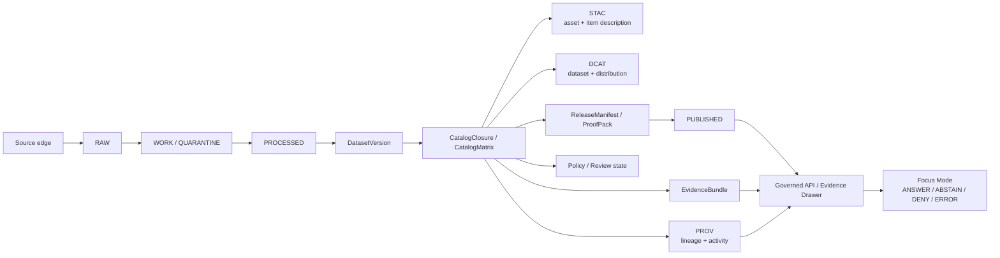
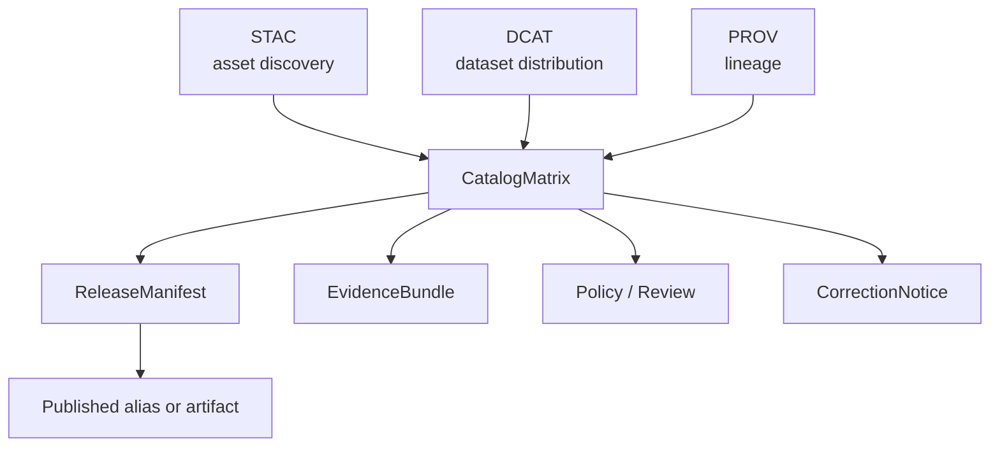

<!-- [KFM_META_BLOCK_V2]
doc_id: kfm://doc/NEEDS_VERIFICATION
title: KFM PROV Profile
type: standard
version: v1
status: draft
owners: NEEDS_VERIFICATION
created: NEEDS_VERIFICATION
updated: 2026-04-27
policy_label: NEEDS_VERIFICATION
related: [../../README.md, ../README.md, ../stac/README.md, ../dcat/README.md, ../release/README.md, ../evidence/README.md, ../correction/README.md, ../../../schemas/README.md, ../../../policy/README.md, ../../../tests/README.md]
tags: [kfm, contracts, provenance, prov-o, catalog-closure, evidence]
notes: [Target path is contracts/v1/provenance/README.md. Updated date reflects this draft generation date. doc_id, owners, created date, policy label, adjacent path inventory, and mounted implementation evidence require repository verification before promotion.]
[/KFM_META_BLOCK_V2] -->

<a id="top"></a>

# KFM PROV Profile

A contract-facing README for KFM’s outward provenance profile: how released lineage is described without replacing evidence, policy, review, or release authority.

> [!IMPORTANT]
> **Status:** experimental  
> **Owners:** `NEEDS_VERIFICATION`  
> **Path:** `contracts/v1/provenance/README.md`  
> **Repo fit:** child of [`contracts/v1`](../README.md) and [`contracts`](../../README.md); sibling profile lane to [`../stac/`](../stac/) and [`../dcat/`](../dcat/); downstream of release, evidence, correction, policy, catalog, and fixture conventions that still need mounted-repo verification.  
> **Quick jumps:** [Scope](#1-scope) · [Repo fit](#2-repo-fit) · [Inputs](#3-accepted-inputs) · [Exclusions](#4-exclusions) · [Architecture](#5-architecture-position) · [Profile rules](#7-profile-rules) · [Contract crosswalk](#10-contract-crosswalk) · [Validation](#14-validation-checklist) · [Open verification](#17-open-verification-items)  
>
> 
> 
> 
> 
> 

## At a glance

| Signal | Value |
|---|---|
| **Document role** | Directory README + profile standard for `contracts/v1/provenance/` |
| **Current posture** | **CONFIRMED** doctrine · **PROPOSED** profile details · **UNKNOWN** mounted implementation |
| **Primary semantic base** | PROV-O concepts: `Entity`, `Activity`, `Agent`, `used`, `wasGeneratedBy`, `wasAssociatedWith`, `wasAttributedTo`, `wasDerivedFrom` |
| **KFM role** | Outward lineage member beside STAC and DCAT inside catalog closure |
| **Must not replace** | `EvidenceBundle`, policy decisions, review records, release manifests, proof packs, correction notices, or runtime response envelopes |
| **Publication stance** | Fail closed when rights, sensitivity, release linkage, evidence closure, or catalog closure is unresolved |

---

## 1. Scope

This directory defines the **KFM PROV profile** for outward provenance surfaces associated with released or release-bearing objects.

It applies when KFM needs to answer:

- What artifact, dataset version, or closure object was produced?
- What source, capture, input, or prior artifact was used?
- What activity produced or transformed it?
- What agent, software runner, steward, or organization was associated with the activity?
- Which release, catalog, evidence, correction, and audit objects keep the lineage inspectable?

### 1.1 Applies to

This profile is intended for provenance attached to:

| KFM object family | Why provenance is needed |
|---|---|
| `DatasetVersion` | Identifies the governed data subject and its derivation path |
| `CatalogClosure` / `CatalogMatrix` | Cross-links STAC, DCAT, PROV, release, evidence, and proof references |
| `ReleaseManifest` / `ProofPack` | Preserves release-significant lineage and integrity references |
| `ProjectionBuildReceipt` / run receipts | Records the build activity that generated derived outputs |
| `EvidenceBundle` | Lets evidence surfaces reference lineage without becoming provenance-only |
| `CorrectionNotice` / rollback reference | Preserves supersession, withdrawal, replacement, and rollback lineage |

### 1.2 Truth posture

| Label | Use in this README |
|---|---|
| **CONFIRMED** | Supported by attached KFM doctrine and recurring corpus patterns |
| **INFERRED** | Structurally implied by repeated KFM object-family and closure rules |
| **PROPOSED** | Recommended profile detail that still needs implementation verification |
| **UNKNOWN** | Not verified because the mounted target repo, tests, emitters, and fixtures were not available |
| **NEEDS VERIFICATION** | Exact path, owner, schema home, fixture inventory, validator command, or enforcement claim requiring repo inspection |

[Back to top](#top)

---

## 2. Repo fit

`contracts/v1/provenance/` is the proposed contract-facing home for the KFM PROV profile.

```text
contracts/
└── v1/
    ├── provenance/
    │   └── README.md
    ├── stac/                 # NEEDS VERIFICATION
    ├── dcat/                 # NEEDS VERIFICATION
    ├── evidence/             # NEEDS VERIFICATION
    ├── release/              # NEEDS VERIFICATION
    └── correction/           # NEEDS VERIFICATION
```

| Relationship | Expected neighbor | Status |
|---|---|---|
| Upstream contract landing | [`../../README.md`](../../README.md) | **NEEDS VERIFICATION** |
| Version landing | [`../README.md`](../README.md) | **NEEDS VERIFICATION** |
| Companion asset profile | [`../stac/README.md`](../stac/README.md) | **NEEDS VERIFICATION** |
| Companion dataset/distribution profile | [`../dcat/README.md`](../dcat/README.md) | **NEEDS VERIFICATION** |
| Release object contracts | [`../release/README.md`](../release/README.md) | **NEEDS VERIFICATION** |
| Evidence object contracts | [`../evidence/README.md`](../evidence/README.md) | **NEEDS VERIFICATION** |
| Correction object contracts | [`../correction/README.md`](../correction/README.md) | **NEEDS VERIFICATION** |
| Schema registry | [`../../../schemas/README.md`](../../../schemas/README.md) | **NEEDS VERIFICATION** |
| Policy registry | [`../../../policy/README.md`](../../../policy/README.md) | **NEEDS VERIFICATION** |
| Contract tests and fixtures | [`../../../tests/README.md`](../../../tests/README.md) | **NEEDS VERIFICATION** |

> [!NOTE]
> This README names likely repo neighbors because KFM doctrine repeatedly separates contracts, schemas, policies, fixtures, proofs, receipts, catalogs, and release objects. Exact checked-in paths must be verified before merge.

[Back to top](#top)

---

## 3. Accepted inputs

Content belongs in this lane when it defines or documents the **contract-facing provenance profile** for outward KFM lineage.

Accepted inputs include:

- profile rules for KFM-compatible PROV entities, activities, agents, and relations;
- JSON-LD shape guidance and context requirements, when verified by the schema home;
- valid and invalid provenance fixture expectations;
- crosswalks between PROV concepts and KFM object families;
- validation checklists for release-facing provenance closure;
- examples that are explicitly public-safe and marked illustrative unless verified as fixtures;
- migration notes when the profile changes between contract versions.

### 3.1 Minimum candidate artifact types

| Candidate artifact | Belongs here? | Notes |
|---|---:|---|
| `README.md` | Yes | This file |
| `profile.md` | Maybe | Only if repo convention separates overview from normative profile text |
| `examples/*.jsonld` | Maybe | **PROPOSED** until fixture conventions are verified |
| `fixtures/valid/*.json` | Maybe | Prefer repo-wide fixture location if one exists |
| `fixtures/invalid/*.json` | Maybe | Prefer repo-wide fixture location if one exists |
| `schema/*.schema.json` | Maybe | Only if this lane is the verified schema home; otherwise link to schema registry |

[Back to top](#top)

---

## 4. Exclusions

This lane deliberately does **not** own the whole KFM trust system.

| Excluded content | Where it should live instead |
|---|---|
| STAC asset/item profile rules | `contracts/v1/stac/` or verified standards profile home |
| DCAT dataset/distribution profile rules | `contracts/v1/dcat/` or verified standards profile home |
| `EvidenceBundle` schema and resolver semantics | `contracts/v1/evidence/` or verified schema registry |
| `DecisionEnvelope` / policy decision contracts | `contracts/v1/policy/`, `policy/`, or verified contract home |
| `RuntimeResponseEnvelope` behavior | runtime contract home; not provenance-only |
| Release approval, proof pack, and manifest rules | `contracts/v1/release/`, `data/proofs/`, or verified release home |
| Run receipts as process memory | receipt contract/data home; PROV may link to them |
| Secrets, restricted exact locations, controlled source details | never in public outward provenance |
| UI rendering logic | Map/UI contract or application home |
| AI prompts, model outputs, or chain-of-thought | governed runtime/evidence contracts only; not PROV |

> [!WARNING]
> A provenance graph is not a permission grant. PROV may describe lineage, but KFM policy, review, rights, sensitivity, release, and evidence controls still decide what can be published.

[Back to top](#top)

---

## 5. Architecture position

KFM’s governed publication path remains:

```text
Source edge → RAW → WORK / QUARANTINE → PROCESSED → CATALOG / TRIPLET → PUBLISHED
```

At the `CATALOG / TRIPLET` stage, PROV sits beside STAC and DCAT as the **lineage member** of outward closure.



### 5.1 Boundary rule

**CONFIRMED doctrine:** public and ordinary clients should consume released artifacts, governed APIs, and evidence-resolved payloads. They should not read RAW, WORK, QUARANTINE, canonical stores, restricted exact geometry, vector indexes, or model runtimes directly.

### 5.2 Provenance rule

**PROPOSED profile rule:** a KFM PROV surface should be treated as an outward lineage artifact that participates in closure. It should never be the only support for a consequential public claim.

[Back to top](#top)

---

## 6. What PROV means in KFM

KFM uses PROV concepts as follows:

| PROV concept | KFM interpretation |
|---|---|
| `prov:Entity` | A governed artifact, dataset version, source capture, closure resource, release artifact, or correction artifact |
| `prov:Activity` | A named fetch, ingest, normalize, validate, transform, build, catalog, publish, correct, or rollback step |
| `prov:Agent` | A source organization, maintainer, steward, reviewer, service, software runner, or governed automation actor |
| `prov:used` | An activity’s use of a source, input artifact, config snapshot, prior version, or receipt reference |
| `prov:wasGeneratedBy` | The activity that generated an entity |
| `prov:wasAssociatedWith` | Operational association between activity and actor/service |
| `prov:wasAttributedTo` | Accountability, authorship, ownership, or steward relation for an entity |
| `prov:wasDerivedFrom` | Derivation from prior entities |
| `prov:qualifiedAssociation` | Optional refinement for runner role, execution context, steward role, or review role |
| `prov:qualifiedGeneration` | Optional refinement for generation timing, environment, method, or build conditions |

[Back to top](#top)

---

## 7. Profile rules

A KFM-conformant outward PROV surface **MUST**:

1. identify the released or release-bearing subject unambiguously;
2. identify at least one generating or transforming activity;
3. identify at least one accountable or associated agent;
4. link to the relevant release, correction, or audit context;
5. preserve enough lineage to support reconstruction, review, and audit;
6. remain coherent with the matching STAC and DCAT closure;
7. remain public-safe for the target audience;
8. be machine-checkable through the verified contract/schema/fixture path.

### 7.1 Minimum relation set

A normal released artifact needs, at minimum:

- one `prov:Entity` for the released subject;
- one `prov:Activity` for the generation, transformation, cataloging, release, or correction step;
- one `prov:Agent`;
- one `prov:wasGeneratedBy`;
- one `prov:used`;
- one accountability relation:
  - `prov:wasAssociatedWith`, or
  - `prov:wasAttributedTo`.

### 7.2 KFM extension rule

KFM-specific fields may be added beside PROV fields when they preserve trust-critical context:

| KFM field family | Why it may be needed |
|---|---|
| `spec_hash` | Deterministic identity for spec/config/materialization inputs |
| `release_ref` | Link to release-bearing object |
| `audit_ref` | Link to audit/run/review context |
| `evidence_bundle_ref` | Link to claim-support bundle |
| `policy_ref` | Link to policy decision or obligations |
| `review_ref` | Link to steward/reviewer state |
| `rights_ref` | Link to rights/redistribution posture |
| `sensitivity_ref` | Link to redaction/generalization/suppression posture |
| `correction_notice_ref` | Link to supersession, withdrawal, or replacement context |
| `catalog_matrix_ref` | Link to closure checker output |

> [!CAUTION]
> KFM extension fields must clarify lineage and governance. They must not create a second hidden truth path or bypass shared object-family contracts.

[Back to top](#top)

---

## 8. Minimum outward content

| Field family | Minimum requirement | Truth label |
|---|---|---|
| `profile_version` | KFM PROV profile version identifier | **PROPOSED** |
| `subject_id` | Stable identifier for the governed subject | **PROPOSED** |
| `subject_type` | Subject class such as dataset version, release artifact, projection artifact, or closure resource | **PROPOSED** |
| `release_ref` | Release-bearing object or release window reference | **INFERRED** |
| `audit_ref` | Audit linkage key or resolvable audit reference | **INFERRED** |
| `entities` | At least one input or output entity with stable identifiers | **CONFIRMED concept** |
| `activities` | At least one named activity with time bounds where applicable | **CONFIRMED concept** |
| `agents` | At least one accountable human, organization, or software agent | **CONFIRMED concept** |
| `core_relations` | `used`, `wasGeneratedBy`, and accountability relation | **PROPOSED** |
| `integrity_echo` | Digest/checksum linkage where the artifact model carries one | **PROPOSED** |
| `rights_sensitivity_echo` | Public-safe state or safe link to governing object | **INFERRED** |
| `correction_linkage` | Supersession, replacement, or withdrawal linkage where applicable | **INFERRED** |
| `serialization_metadata` | Media type, schema/profile identifier, linked context | **PROPOSED** |

[Back to top](#top)

---

## 9. Serialization posture

**PROPOSED until verified:** use JSON-LD for outward PROV profile artifacts and validate concrete JSON serializations through the repo’s verified schema/fixture system.

```json
{
  "@context": {
    "prov": "http://www.w3.org/ns/prov#",
    "kfm": "NEEDS_VERIFICATION"
  },
  "profile_version": "kfm-prov-profile/v1",
  "subject_id": "kfm:dataset-version:example:NEEDS_VERIFICATION",
  "subject_type": "dataset_version",
  "release_ref": "kfm:release:example:NEEDS_VERIFICATION",
  "audit_ref": "NEEDS_VERIFICATION",
  "entity": {},
  "activity": {},
  "agent": {},
  "wasGeneratedBy": {},
  "used": {},
  "wasAssociatedWith": {}
}
```

> [!NOTE]
> The snippet above is a shape sketch, not a verified fixture. Replace placeholders with verified IDs, contexts, schema paths, and examples only after repo inspection.

[Back to top](#top)

---

## 10. Contract crosswalk

| KFM contract family | PROV profile role | Rule |
|---|---|---|
| `SourceDescriptor` | Source identity and input authority context | Link as input context; do not duplicate full source admission contract |
| `IngestReceipt` / `RunReceipt` | Activity/run memory | Link to receipts; do not treat receipts as release proof by themselves |
| `ValidationReport` | Validation activity or gate result | Link where validation materially affects release or correction state |
| `DatasetVersion` | High-value `prov:Entity` | Use stable identifier and digest/identity echo where available |
| `CatalogClosure` / `CatalogMatrix` | Closure seam | Cross-link STAC, DCAT, PROV, release, evidence, and proof refs |
| `DecisionEnvelope` | Policy or governance decision context | Link as governing decision; PROV does not replace finite decision outcomes |
| `ReviewRecord` | Steward or reviewer context | Link review state; do not expose restricted review details publicly |
| `ReleaseManifest` / `ProofPack` | Release-significant context | Link release digest, published aliases, rollback target, and proof refs |
| `ProjectionBuildReceipt` | Derived artifact build activity | Represent build as activity; keep projection derived, not canonical |
| `EvidenceBundle` | Claim support | Link evidence bundle refs; do not collapse evidence into provenance triples |
| `RuntimeResponseEnvelope` | Runtime answer/abstain/deny/error | Runtime trust can link to PROV, but still depends on evidence and policy |
| `CorrectionNotice` | Supersession and correction lineage | Preserve replacement, withdrawal, rollback, and corrected-claim lineage |

[Back to top](#top)

---

## 11. Relationship to STAC and DCAT

KFM uses the STAC / DCAT / PROV triplet because each member answers a different release question.

| Surface | Primary question | KFM role |
|---|---|---|
| STAC | What spatial/temporal asset, item, or collection is discoverable? | Asset/item description |
| DCAT | What dataset or distribution is being published and under what access/rights framing? | Dataset/distribution description |
| PROV | How did this released object come to exist? | Lineage/activity/agent description |

### 11.1 Closure rule

A release-facing catalog closure is incomplete when any of these cannot be resolved:

- STAC reference for the asset/item side, where applicable;
- DCAT reference for dataset/distribution side, where applicable;
- PROV reference for lineage/activity side;
- release manifest reference;
- evidence bundle reference for consequential claims;
- rights and sensitivity posture;
- correction or rollback reference when applicable.

### 11.2 Anti-collapse rule

Do not flatten KFM governance into generic metadata.



[Back to top](#top)

---

## 12. Public-safe and fail-closed rules

A KFM PROV surface **MUST NOT** be published when any of the following are unresolved:

- missing or non-resolvable evidence;
- unknown rights or redistribution posture;
- unresolved sensitivity, exact-location, cultural, living-person, DNA, or infrastructure exposure risk;
- schema, identity, unit, geometry, CRS, or temporal-support failure;
- broken catalog closure or review artifact linkage;
- broken release linkage;
- broken correction linkage where correction is required.

### 12.1 Public-safe echo

Outward PROV should either:

- include a safe summary of rights and sensitivity state; or
- link to the governing release/policy/review object that carries that state.

It should not expose controlled source details, restricted coordinates, unpublished candidates, raw record payloads, or internal review notes.

[Back to top](#top)

---

## 13. Correction and supersession

When a released subject is corrected, generalized, withdrawn, or replaced:

- provenance must not imply silent replacement;
- the correction chain must remain inspectable;
- affected release references must remain resolvable;
- outward STAC / DCAT / PROV closure must be updated coherently;
- rollback references must identify what public alias, layer, dataset, or API surface is affected.

[Back to top](#top)

---

## 14. Validation checklist

Use this checklist before treating a PROV surface as KFM-conformant.

- [ ] Subject identifier is stable and resolvable in project context.
- [ ] At least one entity, one activity, and one agent are present.
- [ ] Minimum relation set is present.
- [ ] Time bounds are present where applicable.
- [ ] Release linkage is present.
- [ ] Audit linkage is present or resolvable.
- [ ] STAC / DCAT closure references are coherent.
- [ ] `CatalogMatrix` / closure checker status is linked where available.
- [ ] Rights / sensitivity state is public-safe or safely linked.
- [ ] Correction linkage is present when needed.
- [ ] JSON serialization validates against the chosen profile schema.
- [ ] Identifiers and checksums match the release-bearing subject.
- [ ] No unpublished, unreleased, restricted, or raw scope leaks into outward provenance.

### 14.1 Proposed validator command

The actual validator command is **UNKNOWN** until the repo is mounted. If a contract validator exists, adapt this sketch to the repo-native toolchain:

```bash
# PROPOSED / NEEDS VERIFICATION:
# Validate public-safe PROV fixtures against the verified KFM PROV profile schema.
python -m tools.validators.contracts validate contracts/v1/provenance/examples/valid/*.json
```

[Back to top](#top)

---

## 15. Illustrative example

> [!NOTE]
> This example is **PROPOSED** and intentionally uses placeholders. It is not a confirmed mounted fixture or emitted production artifact.

<details>
<summary>Expand illustrative JSON-LD example</summary>

```json
{
  "@context": {
    "prov": "http://www.w3.org/ns/prov#",
    "kfm": "NEEDS_VERIFICATION"
  },
  "profile_version": "kfm-prov-profile/v1",
  "subject_id": "kfm:dataset-version:hydrology:nwis:2026-03-14",
  "subject_type": "dataset_version",
  "release_ref": "kfm:release:hydrology:2026-03-14",
  "audit_ref": "audit_NEEDS_VERIFICATION",
  "closure_refs": {
    "stac_ref": "kfm:stac:hydrology:nwis:2026-03-14",
    "dcat_ref": "kfm:dcat:hydrology:nwis:2026-03-14",
    "catalog_matrix_ref": "kfm:catalog-matrix:hydrology:nwis:2026-03-14"
  },
  "integrity_echo": {
    "sha256": "NEEDS_VERIFICATION",
    "spec_hash": "NEEDS_VERIFICATION"
  },
  "entity": {
    "kfm:source:nwis:station-feed": {
      "prov:type": "kfm:SourceCapture",
      "prov:label": "USGS NWIS source capture"
    },
    "kfm:dataset-version:hydrology:nwis:2026-03-14": {
      "prov:type": "kfm:DatasetVersion",
      "prov:label": "Hydrology dataset version"
    }
  },
  "activity": {
    "kfm:activity:normalize-validate-catalog:2026-03-14T12:00:00Z": {
      "prov:type": "kfm:CanonicalBuildActivity",
      "prov:startTime": "2026-03-14T12:00:00Z",
      "prov:endTime": "2026-03-14T12:07:00Z"
    }
  },
  "agent": {
    "kfm:agent:governed-build-runner": {
      "prov:type": "prov:SoftwareAgent",
      "prov:label": "KFM governed build runner"
    }
  },
  "wasGeneratedBy": {
    "_:generation": {
      "prov:entity": "kfm:dataset-version:hydrology:nwis:2026-03-14",
      "prov:activity": "kfm:activity:normalize-validate-catalog:2026-03-14T12:00:00Z"
    }
  },
  "used": {
    "_:usedSource": {
      "prov:activity": "kfm:activity:normalize-validate-catalog:2026-03-14T12:00:00Z",
      "prov:entity": "kfm:source:nwis:station-feed"
    }
  },
  "wasAssociatedWith": {
    "_:runnerAssociation": {
      "prov:activity": "kfm:activity:normalize-validate-catalog:2026-03-14T12:00:00Z",
      "prov:agent": "kfm:agent:governed-build-runner"
    }
  },
  "kfm:public_safety": {
    "rights_state": "NEEDS_VERIFICATION",
    "sensitivity_state": "public_safe_or_safely_linked",
    "restricted_payload_exposed": false
  }
}
```

</details>

[Back to top](#top)

---

## 16. Maintainer workflow

Before promoting this README from draft to review or published status:

1. Verify the actual repo path and neighboring contract/profile directories.
2. Resolve whether profile schemas live under `contracts/`, `schemas/contracts/`, or another documented schema home.
3. Replace placeholder owner, created date, policy label, related links, and doc ID.
4. Add or link valid and invalid fixtures.
5. Add or link a validator command and CI check.
6. Confirm that STAC and DCAT companion profiles cross-link to this PROV profile.
7. Confirm no example leaks restricted or unpublished scope.
8. Record any path or schema-home decision in an ADR if repo evidence is conflicted.

[Back to top](#top)

---

## 17. Open verification items

- [ ] Confirm the target repo path for this file.
- [ ] Confirm the actual `doc_id`.
- [ ] Confirm owners and CODEOWNERS coverage.
- [ ] Confirm created date.
- [ ] Confirm policy label.
- [ ] Confirm companion STAC and DCAT profile homes.
- [ ] Confirm actual schema filenames and locations.
- [ ] Confirm actual serialization choice in code or fixtures.
- [ ] Confirm whether JSON-LD examples belong in this directory or centralized fixtures.
- [ ] Confirm existing release proof or catalog emitter implementation.
- [ ] Confirm tests for STAC / DCAT / PROV closure integrity.
- [ ] Confirm whether a repo-wide provenance profile version token already exists.
- [ ] Confirm whether `CatalogMatrix` or `CatalogClosure` is the preferred machine term in current contracts.
- [ ] Confirm whether the profile is public, restricted, or internal-only before publication.

[Back to top](#top)

---

## Appendix A — Compact field summary

<details>
<summary>Expand compact reference</summary>

| Area | Minimum |
|---|---|
| Subject | Stable ID and subject class |
| Lineage core | Entity, Activity, Agent |
| Core relations | `used`, `wasGeneratedBy`, accountability relation |
| Time | Start/end or generation timing where applicable |
| KFM linkage | `release_ref`, `audit_ref`, evidence/review/policy links where applicable |
| Closure linkage | STAC / DCAT / PROV coherence |
| Safety | Public-safe rights and sensitivity posture |
| Correction | Replacement, supersession, withdrawal, or rollback linkage where needed |
| Validation | Machine-checkable serialization and fixtures |

</details>

## Appendix B — Anti-patterns

<details>
<summary>Expand anti-pattern list</summary>

Avoid these patterns:

- treating PROV as the only evidence for a public claim;
- publishing provenance that references unreleased or restricted artifacts;
- hiding correction lineage behind a replaced file;
- using graph projections, tiles, scenes, or summaries as if they were canonical truth;
- attaching provenance after publication as a decorative afterthought;
- moving policy or review obligations into a free-text provenance note;
- exposing exact sensitive locations through provenance context or labels;
- claiming validator or emitter enforcement without checked-in tests or runtime evidence.

</details>

[Back to top](#top)
