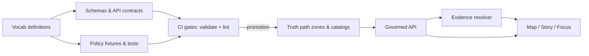

<!-- [KFM_META_BLOCK_V2]
doc_id: kfm://doc/7f2c9e3a-6f3b-4f6b-9d3c-5e5d3c1a9f2b
title: contracts/vocab — Controlled vocabulary contracts
type: standard
version: v1
status: draft
owners: TBD
created: 2026-02-22
updated: 2026-02-22
policy_label: public
related: []
tags: [kfm, contracts, vocab]
notes:
  - Central registry for enums used across schemas, policy, and UI.
[/KFM_META_BLOCK_V2] -->

# contracts/vocab
Single source of truth for **controlled vocabularies** used by KFM contracts (schemas + governed APIs + policy fixtures + UI badges).


**Owners:** TBD (platform engineers + governance stewards)  
**Change posture:** Treat vocab changes as **contract changes** (reviewed, tested, reversible).

---

## Quick navigation
- [What lives here](#what-lives-here)
- [Normative tags](#normative-tags)
- [How vocab is used end-to-end](#how-vocab-is-used-end-to-end)
- [Vocabulary registry](#vocabulary-registry)
- [File format and conventions](#file-format-and-conventions)
- [Change control](#change-control)
- [CI gates](#ci-gates)
- [Security and sensitivity notes](#security-and-sensitivity-notes)
- [References](#references)

---

## What lives here
This directory holds **machine-consumable** vocab definitions that appear as enums/strings across:
- catalog profiles (KFM-DCAT / KFM-STAC / KFM-PROV)
- Evidence Resolver and other governed API DTOs
- Story Nodes + citations + map-state sidecars
- policy pack fixtures/tests and UI “badges”/notices

### Directory tree
```text
contracts/
└─ vocab/
   └─ README.md
   # (PROPOSED) policy_label.v1.yaml
   # (PROPOSED) artifact.zone.v1.yaml
   # (PROPOSED) citation.kind.v1.yaml
   # (PROPOSED) geometry.generalization_method.v1.yaml
```

> NOTE: Only `README.md` is created by default. The versioned vocab files are intended follow-on additions.

---

## Normative tags
This repo uses lightweight tags to prevent accidental overreach in “contract” documentation:

- **CONFIRMED** — present in the KFM source-of-truth documents
- **PROPOSED** — implementable recommendation; requires adoption
- **UNKNOWN / DECISION NEEDED** — not confirmed; must be verified/decided (and then promoted to CONFIRMED or removed)

Use these tags in this README and in any vocab file comments/notes.

---

## How vocab is used end-to-end
Controlled vocabulary is part of the **trust membrane**: it keeps policy decisions, catalogs, and UI indicators aligned across CI and runtime.



### What this prevents
- “Same idea, different string” drift (e.g., `restrictedSensitive` vs `restricted_sensitive_location`)
- mismatched UI indicators vs policy enforcement
- breaking changes hidden as “just metadata”
- silent schema drift where CI and runtime interpret labels differently

---

## Vocabulary registry

### Starter set (CONFIRMED minimum)
These are the minimum controlled vocabularies that must remain stable and versioned.

| Vocab | Purpose | Used by | Status |
|---|---|---:|---|
| `policy_label` | Access + sensitivity classification | catalogs, policy, API, UI | **CONFIRMED** |
| `artifact.zone` | Lifecycle zone for artifacts/records | promotion manifests, catalogs, receipts | **CONFIRMED** |
| `citation.kind` | Evidence/citation type | Story Nodes, Evidence Resolver | **CONFIRMED** |

### Additional (CONFIRMED but needs parameterization decision)
| Vocab | Purpose | Used by | Status |
|---|---|---:|---|
| `geometry.generalization_method` | How sensitive geometry was generalized/redacted | STAC/PROV, UI notices | **CONFIRMED** (values include pattern-like entries; see notes) |

---

## Vocabulary definitions (v1)

### `policy_label` (CONFIRMED)
Allowed values:
- `public` — safe to show publicly
- `public_generalized` — derived public version of sensitive data (generalized geometry)
- `restricted` — requires authorization; not public
- `restricted_sensitive_location` — precise locations protected; default deny
- `internal` — visible to operators/stewards only
- `embargoed` — time-limited restriction pending release
- `quarantine` — not promoted (validation or rights unresolved)

**Rules of thumb**
- A dataset version that is `restricted_sensitive_location` MUST NOT leak precise locations through *any* surface (API, UI, Story, Focus).
- If a public representation is permitted, it SHOULD be a separate `public_generalized` dataset version with a recorded generalization transform.

---

### `artifact.zone` (CONFIRMED)
Allowed values:
- `raw`
- `work`
- `processed`
- `catalog`
- `published`

**Meaning**
- These terms align with the KFM “truth path” lifecycle and are used to keep promotion, catalogs, and runtime behavior consistent.

---

### `citation.kind` (CONFIRMED)
Allowed values:
- `dcat`
- `stac`
- `prov`
- `doc`
- `graph`
- `url` *(discouraged; prefer resolvable schemes)*

**Rule**
- Story/Focus citations MUST be resolvable via the Evidence Resolver (no “dead” citations).

---

### `geometry.generalization_method` (CONFIRMED, with an UNKNOWN detail)
Allowed values / patterns:
- `centroid_only`
- `grid_aggregation_…` *(UNKNOWN: parameter format; see below)*
- `random_offset_…` *(UNKNOWN: parameter format; see below)*
- `dissolve_to_admin_unit`
- `bounding_box_only`
- `none`

> DECISION NEEDED: `grid_aggregation_` and `random_offset_` appear as **prefix/pattern** terms rather than complete values.
> Recommended resolution (PROPOSED): adopt a fixed pattern such as `grid_aggregation_1000m` and `random_offset_500m`, and enforce via regex in schema + policy tests.

---

## File format and conventions

### Naming
**PROPOSED** naming convention for versioned vocab files:
- `<vocab-name>.v<MAJOR>.yaml`
  - example: `policy_label.v1.yaml`
  - example: `citation.kind.v1.yaml`

### Structure
**PROPOSED** minimal YAML structure (tooling-friendly):

```yaml
kfm_vocab_version: v1
vocab_id: policy_label
status: draft
updated: 2026-02-22
terms:
  - value: public
    label: Public
    definition: Safe to show publicly.
    status: active
    since: v1
  - value: public_generalized
    label: Public (generalized)
    definition: Derived public version of sensitive data (generalized geometry).
    status: active
    since: v1
  # ...
```

### Conventions (MUST)
- Values MUST be **stable**, **lowercase**, and **snake_case**.
- Values MUST NOT be renamed. If semantics change:
  - add a new value, and
  - mark the old value as `deprecated` with `replaced_by`.
- Terms MUST include a short `definition` (for humans) and `status` (active/deprecated).

---

## Change control
Treat vocab changes as contract changes.

### Add a new term (checklist)
- [ ] Add term to the correct versioned vocab file (or create it if missing).
- [ ] Update every schema/OpenAPI DTO that references the vocabulary.
- [ ] Update policy pack fixtures and tests so CI and runtime semantics match.
- [ ] Update UI mapping (badge text, warnings, notices) if user-facing.
- [ ] Add at least one **valid** and **invalid** example fixture for the new term.

### Deprecate a term (checklist)
- [ ] Mark `status: deprecated` and provide `replaced_by` (if applicable).
- [ ] Keep the deprecated value valid for at least one full release cycle (unless it is unsafe).
- [ ] Add a migration note and update downstream consumers.

---

## CI gates
Minimum expectations (PROPOSED, but aligned with KFM posture):
- Schema validation for every contract that uses these vocab values
- Policy tests that include allow/deny + obligations for each `policy_label`
- Link/citation lints: citations in Story Nodes must resolve via Evidence Resolver
- If `geometry.generalization_method` uses parameterized patterns, enforce with regex + golden tests

---

## Security and sensitivity notes
- Default-deny is expected for sensitive-location and restricted datasets.
- Story Nodes and Focus outputs MUST NOT embed precise coordinates unless policy explicitly allows.
- Generalization/redaction is a first-class transform and should be recorded in provenance (PROV).

> WARNING: Vocab drift can become a data leak. A single mis-typed policy label (e.g., `restricted_sensitive_locations`) can bypass deny rules unless CI blocks it.

---

## References
- KFM “Definitive Design & Governance Guide (vNext)”:
  - controlled vocabularies (minimum set and starter lists)
  - policy-as-code expectations (same semantics CI + runtime)
  - DCAT/STAC/PROV profiles and evidence resolver contract
