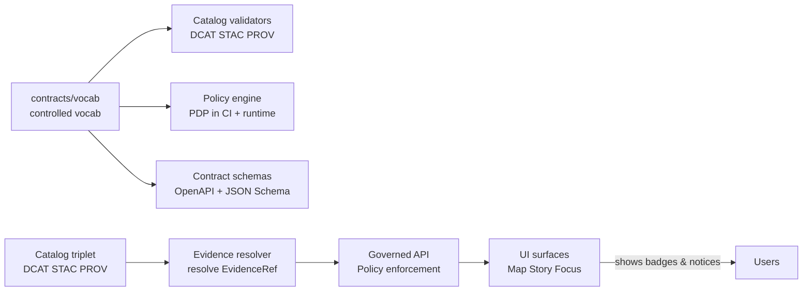

# KFM Controlled Vocabulary Contracts
Map-first, time-aware, governed **enumerations** used across KFM catalogs, policy, APIs, and UI.

**Status:** vNext (draft)  
**Owners:** Governance stewards (TBD)  
**Scope:** `contracts/vocab/*`  
`contract-surface` `policy-input` `evidence-first` `default-deny`

**Quick nav:**  
- [Purpose](#purpose) • [What belongs here](#what-belongs-here) • [How vocab is used](#how-vocab-is-used)  
- [Vocabulary registry](#vocabulary-registry) • [Starter lists](#starter-lists)  
- [Format contract](#format-contract) • [Change + governance rules](#change--governance-rules) • [CI gates](#ci-gates)

---

## Purpose

This directory defines **controlled vocabularies** (finite, versioned lists of allowed values) that are used as *enforceable contracts* in:

- **Catalog triplet** (DCAT / STAC / PROV)
- **EvidenceRef** resolution (`scheme://...`)
- **Policy-as-code** (policy labels, obligations, reason codes)
- **API contracts** (OpenAPI / DTO schemas)
- **UI semantics** (badges/notices only; UI does **not** decide policy)

Why this exists: without a shared vocabulary, values drift into free-text, breaking validation, governance, and explainability.

[Back to top](#kfm-controlled-vocabulary-contracts)

---

## What belongs here

**Belongs here (machine-validated enums):**
- `policy_label` values (e.g., `public`, `restricted_sensitive_location`)
- `artifact.zone` values (e.g., `raw`, `processed`)
- `citation.kind` values (e.g., `dcat`, `prov`)
- `evidence_ref.scheme` values / prefixes (e.g., `dcat://`, `prov://`)
- `time.axis` / time semantics keys (e.g., `event_time`, `transaction_time`)
- `obligation.type` and `reason_code` values (for policy decisions)

**Does NOT belong here (free prose):**
- Narrative glossary definitions (those belong in a glossary doc)
- Dataset-specific category values that aren’t reused across the platform

[Back to top](#kfm-controlled-vocabulary-contracts)

---

## How vocab is used



Key separation of concerns:
- **Policy Decision Point (PDP)** evaluates `policy_label` and returns allow/deny + obligations.
- **UI** renders *results* (badges, notices) but does not make policy decisions.

[Back to top](#kfm-controlled-vocabulary-contracts)

---

## Vocabulary registry

This README is the human entrypoint; the machine sources-of-truth should be individual vocabulary files in this folder (versioned).

Recommended (versioned) vocab IDs:

| Vocabulary ID | Used by | Notes |
|---|---|---|
| `policy_label` | policy engine, catalogs, evidence bundles | Primary classification input; drives allow/deny + obligations |
| `artifact.zone` | PROV entities, artifact manifests | Aligns with the “truth path” lifecycle zones |
| `citation.kind` | Story Nodes, evidence resolver, UI drawers | Describes what kind of citation a `ref` is |
| `evidence_ref.scheme` | evidence resolver | `scheme://...` prefixes to make resolution deterministic |
| `time.axis` | event/observation modeling, UI time slider | Clarifies which timeline a timestamp belongs to |
| `obligation.type` | policy engine outputs, UI notices, transforms | Must be renderable/testable |
| `reason_code` | policy decisions, audit, UX messaging | Should be stable and minimally scoped |
| `dcat.theme` | DCAT datasets | Controlled vocabulary for dataset theming |

> NOTE: If a value can reach runtime surfaces (API/UI), it MUST be drawn from a controlled vocabulary and validated in CI.

[Back to top](#kfm-controlled-vocabulary-contracts)

---

## Starter lists

These are the **starter** values that must be treated as versioned vocabularies.

### `policy_label` (starter)

- `public`
- `public_generalized`
- `restricted`
- `restricted_sensitive_location`
- `internal`
- `embargoed`
- `quarantine`

### `artifact.zone` (starter)

- `raw`
- `work`
- `processed`
- `catalog`
- `published`

### `citation.kind` (starter)

- `dcat`
- `stac`
- `prov`
- `doc`
- `graph`
- `url` *(discouraged)*

### `evidence_ref.scheme` (minimum)

- `dcat://...` → dataset/distribution metadata
- `stac://...` → collection/item/asset metadata
- `prov://...` → run lineage (activities/entities/agents)
- `doc://...` → governed docs and story citations
- `graph://...` → entity relations (if enabled)

### `time.axis` (recommended)

- `event_time` — when something happened
- `transaction_time` — when KFM acquired/published the record
- `valid_time` — when a statement is considered true *(optional; boundary/admin history)*

[Back to top](#kfm-controlled-vocabulary-contracts)

---

## Format contract

This repo may choose JSON/YAML/CSV; whichever format is used, **these invariants apply**:

### Required per-term fields (minimum)

Each term must have at least:
- `id` (stable machine key; lowercase snake_case recommended)
- `label` (human-facing short label)
- `definition` (one paragraph max; normative)
- `status` (`active` | `deprecated`)
- `since` (version or date introduced)

Recommended:
- `deprecated_since`
- `replaced_by`
- `examples`
- `notes` (use sparingly)

### Stability rules

- **Never rename** a term `id`. If a name is wrong, deprecate + introduce a replacement.
- **Never delete** a term that has shipped to runtime surfaces; deprecate it.
- **Additive changes** are non-breaking; removals/renames are breaking and should require governance approval + a major version bump.

[Back to top](#kfm-controlled-vocabulary-contracts)

---

## Change + governance rules

### When adding/changing vocabulary

A PR touching `contracts/vocab/*` MUST include:

- [ ] Definition for each new term (`label`, `definition`, `status`)
- [ ] A migration note if it replaces an older value
- [ ] Updates to any affected schemas (OpenAPI/JSON Schema) and policy fixtures
- [ ] CI validation passing (see below)

### Sensitive location defaults

If a change introduces/affects sensitive-location handling:

- Prefer **dual outputs** (`restricted` precise + `public_generalized` when allowed)
- Ensure **no precise coordinates leak** via exports, story content, or error messages
- UI must show a **generalization notice** when applicable

[Back to top](#kfm-controlled-vocabulary-contracts)

---

## CI gates

At minimum, CI should enforce:

1. **Uniqueness + canonicalization**
   - no duplicate `id`s
   - stable ordering / canonical formatting (so hashing is deterministic)

2. **Schema validation**
   - all `enum` fields in JSON Schemas reference the vocab values (or are generated from them)

3. **Policy fixtures**
   - policy tests cover public vs restricted scenarios
   - obligations are recognized/renderable (e.g., `show_notice`, `generalize_geometry`)

4. **Catalog + evidence checks**
   - catalogs only contain allowed vocab values (`kfm:policy_label`, `kfm:zone`, `citation.kind`)
   - EvidenceRef schemes resolve without guessing

[Back to top](#kfm-controlled-vocabulary-contracts)

---

## Appendix: Example shapes (illustrative)

### Policy decision (shape)

```json
{
  "policy_label": "restricted",
  "decision": "deny",
  "reason_codes": ["SENSITIVE_SITE", "RIGHTS_UNCLEAR"],
  "obligations": [
    { "type": "generalize_geometry", "min_cell_size_m": 5000 },
    { "type": "remove_attributes", "fields": ["exact_location", "owner_name"] }
  ]
}
```

### Story citation (shape)

```json
{
  "citations": [
    { "ref": "dcat://dataset@version", "kind": "dcat" },
    { "ref": "prov://run/...", "kind": "prov" }
  ]
}
```

> These examples are here to show how vocab values surface in contracts; the authoritative lists belong in `contracts/vocab/*`.

[Back to top](#kfm-controlled-vocabulary-contracts)
