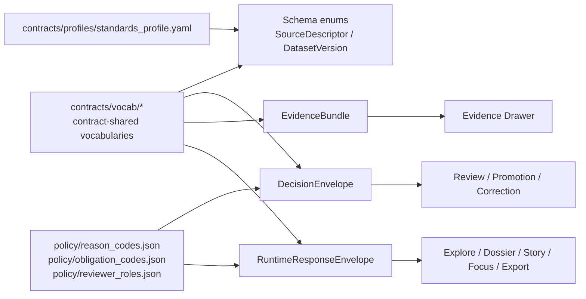

<!-- [KFM_META_BLOCK_V2]
doc_id: kfm://doc/<TODO-uuid>
title: Contract Vocabulary Registry
type: standard
version: v1
status: draft
owners: <TODO: verify contract and policy stewards>
created: <TODO: set on first commit>
updated: <TODO: set on commit>
policy_label: <TODO: verify public|restricted|internal>
related: [../profiles/standards_profile.yaml (PROPOSED), ../../policy/reason_codes.json (PROPOSED), ../../policy/obligation_codes.json (PROPOSED), ../../policy/reviewer_roles.json (PROPOSED)]
tags: [kfm, contracts, vocab, policy, schemas]
notes: [Corpus-grounded README revision; repo tree beyond this target file was not directly mounted in this session, so sibling paths remain PROPOSED or NEEDS VERIFICATION unless directly confirmed elsewhere.]
[/KFM_META_BLOCK_V2] -->

# Contract Vocabulary Registry
Machine-readable shared terms for KFM contracts, policy grammar, and trust-visible runtime payloads.

**Status:** experimental  
**Owners:** `TODO: verify contract + policy stewards`  
  

**Quick jump:** [Scope](#scope) · [Repo fit](#repo-fit) · [Starter registry matrix](#starter-registry-matrix) · [Usage](#usage) · [Diagram](#diagram) · [Task list](#task-list--definition-of-done) · [FAQ](#faq) · [Appendix](#appendix)

> [!IMPORTANT]
> This README is corpus-grounded, not repo-omniscient. In this session, the mounted repository tree beyond the target path was not directly visible. Exact sibling files, validators, fixtures, and import paths therefore remain **NEEDS VERIFICATION** unless they are the target file itself or are explicitly marked as **PROPOSED starter paths**.

## Scope
`contracts/vocab/` exists to stop semantic drift before it leaks into schemas, policy outcomes, runtime envelopes, shell trust cues, and review artifacts.

In KFM, shared vocabulary is not decorative naming. It is part of the trust membrane. If one surface says a subject is *modeled*, another says *derived*, and a third silently implies *observed*, the system has already lost an inspectability guarantee. This directory is where shared, machine-readable term families should be stabilized so contracts, validators, and trust-visible surfaces keep saying the same thing.

This directory is **not** the place for full schema bodies, lane-specific sample payloads, or executable policy logic. It is the place for controlled term families that multiple contract families need to reference consistently.

[Back to top](#contract-vocabulary-registry)

## Repo fit
**Path:** `contracts/vocab/README.md`

**Upstream inputs**
- KFM contract families repeatedly named in the doctrine: `SourceDescriptor`, `DatasetVersion`, `DecisionEnvelope`, `EvidenceBundle`, `RuntimeResponseEnvelope`, `CorrectionNotice`, and adjacent proof objects.
- Expected standards/profile mapping surface: [`../profiles/standards_profile.yaml`](../profiles/standards_profile.yaml) *(PROPOSED starter path; NEEDS VERIFICATION)*.
- Shell/runtime taxonomy that depends on stable term families: Evidence Drawer, Focus, Review, Compare, Export, and other trust-visible shell surfaces.

**Downstream consumers**
- Policy-owned registries such as [`../../policy/reason_codes.json`](../../policy/reason_codes.json), [`../../policy/obligation_codes.json`](../../policy/obligation_codes.json), and [`../../policy/reviewer_roles.json`](../../policy/reviewer_roles.json) *(all PROPOSED starter paths; NEEDS VERIFICATION)*.
- Schema enums and validators under neighboring contract families such as `../source/`, `../core/`, `../policy/`, `../release/`, `../runtime/`, and `../correction/` *(starter directory names are doctrinally consistent but still require repo verification)*.
- Trust-visible runtime payloads, especially `DecisionEnvelope`, `EvidenceBundle`, and `RuntimeResponseEnvelope` consumers in map, dossier, export, review, and Focus surfaces.

> [!NOTE]
> The corpus supports a boundary where **contract-shared vocabularies** live under `contracts/vocab/`, while **policy-owned code lists** stay under `policy/` unless an ADR intentionally changes that ownership boundary.

[Back to top](#contract-vocabulary-registry)

## Inputs
Accepted inputs for this directory are compact, machine-readable vocabulary artifacts and only the minimum prose needed to keep them interpretable.

- Shared enum registries used by more than one contract family
- Crosswalks between doctrinal labels and stable machine IDs
- Vocabulary notes that define trust consequences, not just display labels
- Change records for added, deprecated, split, or merged values
- Illustrative fixtures that show how a vocabulary family is consumed by contracts, policy, or runtime payloads

Recommended file shapes are JSON or YAML for registries and Markdown for directory-level guidance.

## Exclusions
What does **not** belong here:

| Excluded content | Why it does not belong here | Where it should go instead |
|---|---|---|
| Full schema definitions | This directory should stabilize shared terms, not duplicate schema bodies. | Neighboring contract-family directories such as `contracts/source/`, `contracts/core/`, `contracts/policy/`, `contracts/release/`, `contracts/runtime/`, and `contracts/correction/` *(starter locations are PROPOSED / NEEDS VERIFICATION)* |
| Executable policy logic | Rego bundles, decision code, and gate enforcement are policy assets, not vocabulary assets. | `policy/` |
| Policy-owned code lists | `reason_codes`, `obligation_codes`, and `reviewer_roles` are corpus-supported starter registries, but they are policy-governed. | `policy/` |
| Lane-specific examples | Example hydrology, hazards, or biodiversity payloads can be mistaken for shared vocabulary. | `examples/` or lane-owned example areas |
| Narrative glossary prose | This directory is machine-first and contract-oriented. | Repo glossary or standards docs *(path NEEDS VERIFICATION)* |
| UI copy and presentation strings | Trust-visible surfaces consume vocabularies, but copywriting is a separate concern. | UI/runtime or docs surfaces that own presentation text |

[Back to top](#contract-vocabulary-registry)

## Directory tree
The mounted repository tree beyond this target file was not directly visible in this session. The tree below is therefore an **illustrative target layout**, not a claim that these files already exist.

```text
contracts/vocab/
├── README.md                    # this directory contract
├── source_role.json             # PROPOSED shared registry
├── evidence_state.json          # PROPOSED shared registry
├── runtime_outcome.json         # PROPOSED shared registry
├── surface_class.json           # PROPOSED shared registry
└── surface_state.json           # PROPOSED shared registry
```

If the repo already stores shared registries elsewhere, update this README to match the mounted tree rather than creating a second vocabulary home.

## Quickstart
A safe first pass is small: stabilize the term families that doctrine already treats as load-bearing, then wire them into fixtures and validators.

1. Decide whether the term family is **contract-shared** or **policy-owned**.
2. Create or update one machine-readable registry file for that family.
3. Keep the machine ID stable and the human label editable.
4. Add definition text that explains the trust consequence of the term.
5. Reference the vocabulary from any affected schema enums, fixtures, and examples.
6. Update this README’s matrix so future contributors know the family exists and where it is owned.
7. Run contract and policy checks before merge.

Illustrative starter payload:

```json
{
  "family": "source_role",
  "version": "v1",
  "values": [
    {
      "id": "statutory_or_administrative",
      "label": "Statutory / administrative",
      "definition": "Legal or official records such as parcels, districts, service boundaries, or agency reporting.",
      "trust_consequence": "Carries legal or official force and must not be flattened into general context.",
      "status": "active"
    }
  ]
}
```

> [!TIP]
> Prefer one vocabulary family per file. It keeps diffs smaller, validator wiring clearer, and deprecations easier to track.

[Back to top](#contract-vocabulary-registry)

## Usage
### Working rules
- Treat shared vocabulary as a contract surface, not as optional documentation.
- Prefer `lower_snake_case` for shared machine IDs.
- Keep human labels separate from machine IDs.
- Add definitions that explain *why the distinction matters* in KFM’s trust model.
- Deprecate values instead of silently renaming them.
- Do not let one contract invent private variants of a shared term family.
- When a change affects source-role distinctions, policy outcomes, or trust-visible shell states, treat it as governance-sensitive and review it accordingly.

### Ownership boundaries
- `contracts/vocab/` should own contract-shared term families.
- `policy/` should own executable decision-code lists and reviewer-role registries unless an ADR states otherwise.
- `contracts/profiles/` should own standards or outward-profile mappings rather than duplicating them here.

### Naming rules
- File names: `snake_case.json` or `snake_case.yaml`
- Family names: singular when the file represents one registry (`source_role`, `surface_state`)
- Machine IDs: `lower_snake_case`
- Policy codes: preserve the policy team’s chosen format, which may be dot-delimited rather than snake_case

### Truth-label rules inside this directory
Use the narrowest truthful label available:

- **CONFIRMED** for directly corpus-supported concept families or boundaries
- **INFERRED** for conservative structural completions strongly implied by the corpus
- **PROPOSED** for starter paths, file names, or registry families not directly surfaced as mounted repo fact
- **UNKNOWN / NEEDS VERIFICATION** when direct repo evidence is missing

## Diagram

```mermaid
flowchart LR
    A[contracts/vocab/*\ncontract-shared vocabularies] --> B[Schema enums\nSourceDescriptor / DatasetVersion]
    A --> C[DecisionEnvelope]
    A --> D[EvidenceBundle]
    A --> E[RuntimeResponseEnvelope]

    F[policy/reason_codes.json\npolicy/obligation_codes.json\npolicy/reviewer_roles.json] --> C
    F --> E

    G[contracts/profiles/standards_profile.yaml] --> B

    D --> H[Evidence Drawer]
    E --> I[Explore / Dossier / Story / Focus / Export]
    C --> J[Review / Promotion / Correction]
```

## Tables
### Starter registry matrix

| Vocabulary family | Why it exists | Primary consumers | Ownership boundary | Current posture |
|---|---|---|---|---|
| `source_role` | Keeps statutory, observational, modeled, documentary, mirrored, and related source families visibly distinct. | `SourceDescriptor`, evidence resolution, shell trust cues | Contract-shared | **CONFIRMED** concept family / **PROPOSED** registry file |
| `evidence_state` | Prevents values like `source_stated`, `extracted`, `inferred`, `reviewed`, `source_dependent`, `generalized`, and `unspecified` from drifting across contracts and runtime surfaces. | Evidence rendering, review flows, runtime trust cues | Contract-shared | **CONFIRMED** concept family / **PROPOSED** registry file |
| `runtime_outcome` | Keeps finite governed response outcomes stable where runtime surfaces return a result rather than bluff. | `RuntimeResponseEnvelope`, Focus, governed assistance surfaces | Contract-shared | **CONFIRMED** minimum concept family / **PROPOSED** registry file |
| `surface_class` | Gives runtime envelopes and shell components a stable vocabulary for *where* an outcome is shown. | `RuntimeResponseEnvelope`, shell payloads, screenshots, tests | Contract-shared | **INFERRED** family / **PROPOSED** starter registry |
| `surface_state` | Keeps freshness, partiality, denial, correction, and visibility states consistent at the point of use. | Shell chips, runtime payloads, correction flows | Contract-shared with policy consequences | **CONFIRMED** concept family / **PROPOSED** registry file |
| `reason_code` | Makes policy outcomes explainable without free-text drift. | `DecisionEnvelope`, validation reports, denial/abstain traces | Policy-owned | **CONFIRMED** family / expected under `policy/` |
| `obligation_code` | Carries required follow-up duties after allow/generalize/narrow/deny outcomes. | `DecisionEnvelope`, review flows, release gates | Policy-owned | **CONFIRMED** family / expected under `policy/` |
| `reviewer_role` | Makes human review and approval state machine-readable. | `ReviewRecord`, approval boundaries, separation-of-duty maps | Policy-owned | **CONFIRMED** family / expected under `policy/` |

### Source-role normalization crosswalk
The corpus uses closely related but not always identical phrasing. The registry should normalize that variation rather than let it drift.

| Corpus phrasing | Proposed machine ID | Notes |
|---|---|---|
| Statutory / administrative | `statutory_or_administrative` | Canonical manual wording for legal or official records |
| Administrative record | `administrative_record` | Later working-edition phrasing; map to the same family if the repo prefers a shorter form |
| Direct observational / instrumented | `direct_observational_or_instrumented` | Measured, field, survey, or instrumented sources |
| Operational context feed | `operational_context_feed` | Strong later-edition phrase for live context feeds such as warnings or status feeds |
| Mirror / discovery service | `mirror_or_discovery_service` | Discovery-friendly copies; not source-of-record replacements |
| Modeled / assimilated | `modeled_or_assimilated` | Forecast, interpolation, simulation, analysis, or index outputs |
| Modeled / assimilated / derived surface | `modeled_assimilated_or_derived` | Later phrasing when the repo wants one broader visibly-derived family |
| Documentary / archival | `documentary_or_archival` | Maps, newspapers, scans, reports, oral histories, transcripts |
| Documentary evidence object | `documentary_evidence_object` | Later working-edition phrasing; normalize rather than fork |
| Community-contributed | `community_contributed` | Citizen science, civic submissions, local observations |
| Authority / crosswalk system | `authority_or_crosswalk_system` | LCNAF, VIAF, GNIS, or similar disambiguation aids |

### Outcome and state split that should not be flattened
One weak seam in corpus-adjacent drafts is collapsing runtime outcomes, decision grammar, and surface states into one registry. The safer shape is to keep them distinct.

| Family | Minimum stabilized values | Why the split matters |
|---|---|---|
| `runtime_outcome` | `answer`, `abstain`, `deny`, `error` | This is the clearest corpus-supported floor for governed runtime response behavior. |
| `decision_result` *(optional shared family)* | `allow`, `generalize`, `narrow`, `hold`, `deny`, `abstain`, `error` | Useful if `DecisionEnvelope` and runtime adapters share one machine grammar, but still **PROPOSED** as a separate registry name. |
| `surface_state` | `promoted`, `generalized`, `partial`, `stale_visible`, `abstained`, `denied`, `withdrawn`, `superseded`, `correction_pending` | These values describe what the user sees at the point of use, not the underlying runtime result alone. |

### Policy-owned code lists that should be referenced, not duplicated

| Registry | Why it matters | Example or note |
|---|---|---|
| `reason_codes` | Keeps machine-readable explanations stable across validation, policy, and runtime outcomes. | Corpus starter examples include `rights.unknown`, `sensitivity.exact_location`, `validation.schema_failed`, and `corroboration.conflicted`. |
| `obligation_codes` | Carries required follow-up duties such as generalization, steward review, or correction work. | Exact starter values were not directly surfaced in the visible repo tree. |
| `reviewer_roles` | Makes review authority machine-readable and keeps approval flows inspectable. | Treat role changes as governance changes, not casual edits. |

[Back to top](#contract-vocabulary-registry)

## Task list / Definition of done
A vocabulary change is done only when it is visible in the same proof chain as the behavior it affects.

- [ ] The term family is clearly classified as **contract-shared** or **policy-owned**.
- [ ] The registry file has stable machine IDs, human labels, definitions, and lifecycle status.
- [ ] Affected schemas or fixtures reference the updated vocabulary.
- [ ] Contract and policy tests are updated together when the change crosses that boundary.
- [ ] Negative-path behavior stays aligned with outcome grammar and does not invent one-off values.
- [ ] Any new source-role or surface-state value is reflected in runtime, review, and shell documentation where relevant.
- [ ] The change does not duplicate policy-owned registries inside `contracts/vocab/`.
- [ ] Unknown or provisional values are explicitly marked instead of silently presented as settled.

> [!WARNING]
> Do not add a new shared value in only one place. In KFM, free-text drift is a governance defect, not a cleanup task for later.

## FAQ
### Is this directory the same thing as a glossary?
No. A glossary explains terms for readers. `contracts/vocab/` should stabilize machine-readable term families that contracts, policy registries, and trust-visible runtime payloads need to share.

### Should `reason_codes`, `obligation_codes`, and `reviewer_roles` live here?
Not by default. The corpus places those registries under `policy/`. This README therefore treats them as adjacent, policy-owned registries unless an ADR intentionally moves that boundary.

### Why does this README keep saying “PROPOSED starter path”?
Because the doctrine strongly implies a contract-first layout, but the mounted repo tree beyond this target file was not directly visible in this session. The README should preserve useful starter paths without pretending they are already mounted fact.

### Why is `evidence_state` in the matrix but `knowledge_character` moved to the appendix?
Because the corpus directly defines an `evidence state` vocabulary, while `knowledge_character` is only suggested indirectly through later packet material. If the repo already uses `knowledge_character`, update this README to crosswalk the two rather than silently renaming the family.

### Can a lane invent its own private source-role or surface-state values?
No. Lane-specific needs may justify additions, but they should extend the shared vocabulary through governed review, not fork it silently inside one schema or one UI surface.

### What if the repo already keeps these registries somewhere else?
Update this README to match the mounted repo tree. Do not preserve an invented layout once direct repo evidence exists.

## Appendix
<details>
<summary><strong>Appendix A — Candidate starter families that still need direct repo verification</strong></summary>

### `knowledge_character` starter candidates
The packet family and exploratory overlays clearly pressure the system to keep *observed*, *modeled*, and *derived* knowledge visibly distinct, but the exact final enum is not frozen in the directly surfaced doctrine. Safe starter candidates include:

- `observed`
- `documentary`
- `public_reporting`
- `modeled`
- `assimilated`
- `derived`
- `anomaly_derived`
- `modeled_from_observation`

Treat this list as **PROPOSED starter material** until schemas, fixtures, or shell rendering rules directly confirm it.

### `surface_class` starter candidates
The shell doctrine provides a strong surface taxonomy that can seed a shared vocabulary if the repo chooses to machine-stabilize it:

- `map_explorer`
- `timeline`
- `dossier`
- `story_surface`
- `evidence_drawer`
- `focus_mode`
- `review_stewardship`
- `compare`
- `export_preview`
- `classroom_civic_variant`
- `controlled_3d`

### Change-control rule
If a vocabulary family affects trust-visible state, policy evaluation, or review flows, pair the vocabulary edit with:

1. one valid example,
2. one invalid example,
3. one updated validator or test reference, and
4. one short note explaining what semantic drift the change is preventing.

</details>

<details>
<summary><strong>Appendix B — Compact evidence map for this README</strong></summary>

| Topic in this README | Corpus basis |
|---|---|
| Contract families and first schema wave | Canonical KFM manual sections on contract families, starter schema wave, and minimal next artifact plan |
| Policy-owned registries under `policy/` | Canonical KFM manual and successor working editions that place `reason_codes`, `obligation_codes`, and `reviewer_roles` in `policy/` starter paths |
| Source-role normalization need | Canonical KFM manual and later working editions that use overlapping but related source-role labels |
| Runtime outcomes and surface states | Canonical KFM manual, successor working edition, and shell doctrine that distinguish finite runtime outcomes from visible surface states |
| Trust-visible shell dependence on stable vocab | Evidence Drawer, Focus, Review, Compare, Export, and other shell surfaces are defined as trust-bearing rather than decorative |
| Need for machine-readable vocab and registries | The manuals repeatedly argue that contracts, policy registries, fixtures, and tests are needed to prevent free-text drift |

</details>

[Back to top](#contract-vocabulary-registry)