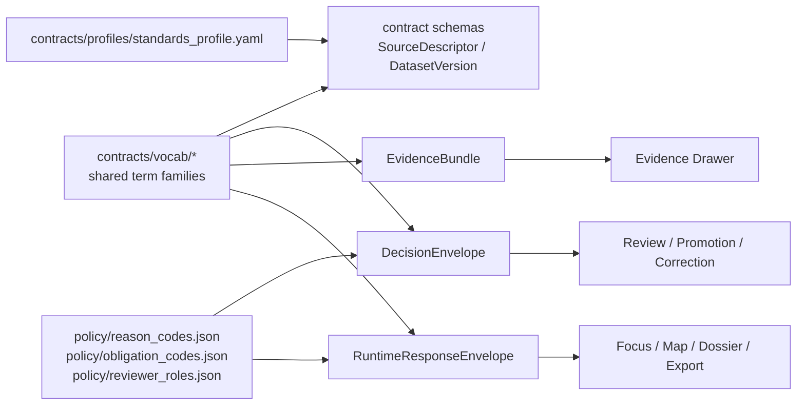

<!-- [KFM_META_BLOCK_V2]
doc_id: kfm://doc/<TODO-uuid>
title: Contract Vocabulary Registry
type: standard
version: v1
status: draft
owners: <TODO: verify contract and policy stewards>
created: <TODO: set on first commit>
updated: <TODO: set on commit>
policy_label: <TODO: verify public|restricted|internal>
related: [../profiles/standards_profile.yaml (PROPOSED), ../../policy/reason_codes.json (PROPOSED), ../../policy/obligation_codes.json (PROPOSED), ../../policy/reviewer_roles.json (PROPOSED)]
tags: [kfm, contracts, vocab, policy, schemas]
notes: [Workspace evidence for this draft was PDF-only; adjacent files besides this README are corpus-supported starter paths and require repo verification before being claimed as mounted.]
[/KFM_META_BLOCK_V2] -->

# Contract Vocabulary Registry
Machine-readable shared terms for KFM contracts, policy grammar, and trust-visible runtime payloads.

**Status:** experimental  
**Owners:** `TODO: verify contract + policy stewards`  
  

**Quick jump:** [Scope](#scope) · [Repo fit](#repo-fit) · [Starter registry matrix](#starter-registry-matrix) · [Usage](#usage) · [Diagram](#diagram) · [Task list](#task-list--definition-of-done) · [FAQ](#faq) · [Appendix](#appendix)

> [!IMPORTANT]
> This README is corpus-grounded, not repo-omniscient. In this session, the mounted repository tree beyond the target path was not directly visible. Exact sibling files, validators, fixtures, and import paths therefore remain **NEEDS VERIFICATION** unless they are the target file itself or are explicitly marked as **PROPOSED starter paths**.

## Scope
`contracts/vocab/` exists to stop semantic drift before it leaks into schemas, policy outcomes, runtime envelopes, shell state chips, and review artifacts.

In KFM, shared vocabulary is not decorative naming. It is part of the trust membrane. If one surface says a dataset is *modeled*, another says *derived*, and a third silently implies *observed*, the system has already lost a core inspectability guarantee. This directory is where shared, machine-readable term families should be stabilized so contracts, validators, and trust-visible UI surfaces keep saying the same thing.

This directory is **not** the place for full schema bodies, lane-specific example data, or policy logic itself. It is the place for controlled term families that multiple contract families need to reference consistently.

[Back to top](#contract-vocabulary-registry)

## Repo fit
**Path:** `contracts/vocab/README.md`

**Upstream inputs**
- Contract families named in KFM doctrine: `SourceDescriptor`, `DatasetVersion`, `DecisionEnvelope`, `EvidenceBundle`, `RuntimeResponseEnvelope`, `CorrectionNotice`, and related proof objects.
- Expected profile and standards mapping surface: [`../profiles/standards_profile.yaml`](../profiles/standards_profile.yaml) *(PROPOSED starter path; NEEDS VERIFICATION)*.
- Shell/runtime taxonomy that depends on stable term families: Evidence Drawer, Focus Mode, review surfaces, export surfaces, and correction-visible states.

**Downstream consumers**
- Policy-owned registries such as [`../../policy/reason_codes.json`](../../policy/reason_codes.json), [`../../policy/obligation_codes.json`](../../policy/obligation_codes.json), and [`../../policy/reviewer_roles.json`](../../policy/reviewer_roles.json) *(all PROPOSED starter paths; NEEDS VERIFICATION)*.
- Schema enums and validators under neighboring contract families such as `../source/`, `../core/`, `../policy/`, `../release/`, `../runtime/`, and `../correction/` *(directory names beyond this README are INFERRED from corpus starter bundles and require repo verification)*.
- Trust-visible runtime payloads, especially `DecisionEnvelope`, `EvidenceBundle`, and `RuntimeResponseEnvelope` consumers in map, dossier, export, review, and Focus surfaces.

> [!NOTE]
> The corpus consistently places `reason_codes`, `obligation_codes`, and `reviewer_roles` under `policy/`, not under `contracts/`. This README therefore treats `contracts/vocab/` as the home for **contract-shared vocabularies**, while **policy-owned code lists stay policy-owned** unless an ADR explicitly changes that boundary.

[Back to top](#contract-vocabulary-registry)

## Inputs
Accepted inputs for this directory are compact, machine-readable vocabulary artifacts and the minimum prose needed to keep them interpretable.

- Shared enum registries used by more than one contract family.
- Crosswalks between human-readable labels and machine IDs.
- Vocabulary notes that define trust consequences, not just pretty labels.
- Change records for added, deprecated, or split values.
- Illustrative fixtures that show how the vocabulary is consumed by contracts, policy, or runtime payloads.

Recommended file shapes are JSON or YAML for registries and Markdown for directory-level guidance.

## Exclusions
What does **not** belong here:

| Excluded content | Why it does not belong here | Where it should go instead |
|---|---|---|
| Full schema definitions | This directory should stabilize shared terms, not duplicate schema bodies. | Neighboring contract family directories such as `contracts/source/`, `contracts/core/`, `contracts/policy/`, `contracts/release/`, `contracts/runtime/`, and `contracts/correction/` *(starter locations are PROPOSED / NEEDS VERIFICATION)* |
| Policy decision logic | Rego, policy bundles, and executable gate logic are policy assets, not vocabulary assets. | `policy/` |
| Policy-owned code lists | `reason_codes`, `obligation_codes`, and `reviewer_roles` are corpus-supported starter registries, but they are policy-governed. | `policy/` |
| Lane-specific examples and thin slices | Example hydrology or lane payloads should not be mistaken for shared vocabulary. | `examples/` or lane-specific example areas |
| Narrative glossary prose | This directory is machine-first and contract-oriented. | Repo glossary or standards docs *(path NEEDS VERIFICATION)* |
| UI copy or presentation strings | Trust-visible surfaces may consume the vocabulary, but copywriting is a separate concern. | UI/runtime or docs surfaces that own presentation text |

[Back to top](#contract-vocabulary-registry)

## Directory tree
The mounted repository tree beyond this target file was not directly visible in this session. The tree below is therefore an **illustrative target layout**, not a claim that these files already exist.

```text
contracts/vocab/
├── README.md                    # this directory contract
├── source_role.json             # PROPOSED shared registry
├── runtime_outcome.json         # PROPOSED shared registry
├── knowledge_character.json     # PROPOSED shared registry
├── surface_class.json           # PROPOSED shared registry
└── surface_state.json           # PROPOSED shared registry
```

If the repo already stores shared registries elsewhere, update this README to match the mounted tree rather than creating a second vocabulary home.

## Quickstart
A safe first pass is small: stabilize the term families that doctrine already treats as load-bearing, then wire them into fixtures and validators.

1. Decide whether the term family is **contract-shared** or **policy-owned**.
2. Create or update one machine-readable registry file for that family.
3. Keep the machine ID stable and the human label editable.
4. Add definition text that explains the trust consequence of the term.
5. Reference the vocabulary from any affected schema enums, fixtures, and examples.
6. Update this README’s matrix so future contributors know the family exists and where it is owned.
7. Run contract and policy checks before merge.

Illustrative starter payload:

```json
{
  "family": "source_role",
  "version": "v1",
  "values": [
    {
      "id": "direct_observation",
      "label": "Direct observation",
      "definition": "Gauges, stations, sensor readings, field measurements, or specimen records where precision policy allows.",
      "trust_consequence": "Anchor observation claims when quality, support, and scope are known.",
      "status": "active"
    }
  ]
}
```

> [!TIP]
> Prefer one vocabulary family per file. It makes diffs smaller, validator wiring clearer, and deprecations easier to track.

[Back to top](#contract-vocabulary-registry)

## Usage
### Working rules
- Treat shared vocabulary as a contract surface, not as optional documentation.
- Prefer `lower_snake_case` for shared machine IDs.
- Keep human labels separate from machine IDs.
- Add definitions that explain *why the distinction matters* in KFM’s trust model.
- Deprecate values instead of silently renaming them.
- Do not let one contract invent private variants of a shared term family.
- When a change affects `source_role`, runtime outcomes, or review-state semantics, treat it as governance-sensitive and review it accordingly.

### Ownership rules
- `contracts/vocab/` should own contract-shared term families.
- `policy/` should own executable decision-code lists and reviewer-role registries unless an ADR states otherwise.
- `contracts/profiles/` should own standards or outward-profile mappings rather than duplicating them here.

### Naming rules
- File names: `snake_case.json` or `snake_case.yaml`
- Family names: singular when the file represents one registry (`source_role`, `surface_class`)
- Machine IDs: `lower_snake_case`
- Policy codes: preserve the policy team’s chosen format, which may be dot-delimited rather than snake_case

## Diagram

```mermaid
flowchart LR
    A[contracts/vocab/*\nshared term families] --> B[contract schemas\nSourceDescriptor / DatasetVersion]
    A --> C[DecisionEnvelope]
    A --> D[EvidenceBundle]
    A --> E[RuntimeResponseEnvelope]
    F[policy/reason_codes.json\npolicy/obligation_codes.json\npolicy/reviewer_roles.json] --> C
    F --> E
    G[contracts/profiles/standards_profile.yaml] --> B
    D --> H[Evidence Drawer]
    E --> I[Focus / Map / Dossier / Export]
    C --> J[Review / Promotion / Correction]
```

## Tables
### Starter registry matrix
| Vocabulary family | Why it exists | Primary consumers | Ownership boundary | Current posture |
|---|---|---|---|---|
| `source_role` | Keeps direct observation, administrative record, operational context feed, discovery mirror, modeled/assimilated product, documentary evidence, and derivative convenience layer visibly distinct. | `SourceDescriptor`, admission bundles, evidence resolution, shell trust cues | Contract-shared | **CONFIRMED** concept family / **PROPOSED** registry file |
| `runtime_outcome` | Keeps allow/generalize/narrow/hold/deny/abstain/error and related negative-path behavior consistent across decision and runtime objects. | `DecisionEnvelope`, `RuntimeResponseEnvelope`, Focus, review surfaces | Contract-shared with policy consequences | **CONFIRMED** concept family / **PROPOSED** registry file |
| `knowledge_character` | Prevents observed/modeled/derived/anomaly semantics from collapsing into one vague “data” label. | Evidence rendering, shell chips, derived-layer labeling | Contract-shared | **INFERRED** family / **PROPOSED** starter registry |
| `surface_class` | Gives runtime envelopes and shell components a stable vocabulary for where an outcome is being shown. | `RuntimeResponseEnvelope`, shell payloads, review screenshots | Contract-shared | **INFERRED** family / **PROPOSED** starter registry |
| `surface_state` | Keeps freshness, restriction, correction, and visibility states consistent at the point of use. | Shell chips, runtime payloads, correction flows | Contract-shared with policy consequences | **INFERRED** family / **PROPOSED** starter registry |
| `reason_code` | Makes policy outcomes explainable without free-text drift. | `DecisionEnvelope`, validation reports, runtime denial/abstain/error traces | Policy-owned | **CONFIRMED** family / expected under `policy/` |
| `obligation_code` | Carries required follow-up duties after allow/generalize/hold/deny outcomes. | `DecisionEnvelope`, review flows, release gates | Policy-owned | **CONFIRMED** family / expected under `policy/` |
| `reviewer_role` | Makes human review and approval state machine-readable. | `ReviewRecord`, approval boundaries, separation-of-duty maps | Policy-owned | **CONFIRMED** family / expected under `policy/` |

### Confirmed doctrinal source-role labels
The doctrine is strong on the *concepts* below. The machine IDs in the middle column are a repo-ready normalization, not a claim that these exact enum tokens are already mounted.

| Doctrinal label | Proposed machine ID | Trust consequence |
|---|---|---|
| Direct observation | `direct_observation` | Anchors observation claims when quality, support, and scope are known. |
| Administrative record | `administrative_record` | Carries statutory or administrative meaning and should not be flattened into mere context. |
| Operational context feed | `operational_context_feed` | Useful and often essential, but time scope and staleness must remain explicit. |
| Discovery mirror | `discovery_mirror` | Convenient for access, but must not silently replace the authoritative upstream role. |
| Modeled / assimilated product | `modeled_or_assimilated_product` | Must remain visibly derived and keep `DERIVED_FROM` lineage explicit. |
| Documentary evidence | `documentary_evidence` | Supports interpretation, quotation, and context, but rights and precision burdens vary. |
| Derivative convenience layer | `derivative_convenience_layer` | Accelerates use without inheriting canonical authority. |

### Confirmed runtime outcome grammar
These outcome concepts are doctrine-level and should not drift by schema, UI surface, or runtime adapter.

| Doctrinal label | Proposed machine ID | Typical use |
|---|---|---|
| ALLOW | `allow` | The action or response is supported and policy-permitted. |
| GENERALIZE | `generalize` | The subject can be shown only at a safer spatial, temporal, or semantic grain. |
| NARROW | `narrow` | The original scope is too broad; a smaller admissible slice exists. |
| HOLD | `hold` | Potentially admissible, but not yet closure-ready. |
| DENY | `deny` | Policy, rights, sensitivity, or role constraints prohibit the action. |
| ABSTAIN | `abstain` | Evidence is partial, conflicting, unresolved, or not inspectably supportable. |
| ERROR | `error` | Resolver, validator, or runtime failure prevents trustworthy output. |
| QUARANTINE | `quarantine` | The subject failed validation or has unresolved risk requiring controlled handling. |
| STALE-VISIBLE | `stale_visible` | A release-backed derivative is still visible, but its freshness basis has expired or been superseded. |
| SUPERSEDED | `superseded` | A prior release is replaced by a later release with lineage preserved. |
| WITHDRAWN | `withdrawn` | A public release has been removed from active use with visible trace retained. |
| CORRECTION-PENDING | `correction_pending` | A public release remains visible while a correction path is still active. |

### Policy-owned code lists that should be referenced, not duplicated
| Registry | Why it matters | Example or note |
|---|---|---|
| `reason_codes` | Keeps machine-readable explanations stable across validation, policy, and runtime outcomes. | Starter examples shown in doctrine include `rights.unknown`, `sensitivity.exact_location`, `validation.schema_failed`, and `corroboration.conflicted`. |
| `obligation_codes` | Carries required follow-up actions such as generalization, steward review, or correction work. | Exact starter values were not surfaced in the visible repo tree. |
| `reviewer_roles` | Makes review authority machine-readable and keeps approval flows inspectable. | Treat role changes as governance changes, not casual edits. |

[Back to top](#contract-vocabulary-registry)

## Task list / Definition of done
A vocabulary change is done only when it is visible in the same proof chain as the behavior it affects.

- [ ] The term family is clearly classified as **contract-shared** or **policy-owned**.
- [ ] The registry file has stable machine IDs, human labels, definitions, and lifecycle status.
- [ ] Affected schemas or fixtures reference the updated vocabulary.
- [ ] Contract and policy tests are updated together when the change crosses that boundary.
- [ ] Negative-path behavior stays aligned with outcome grammar and does not invent one-off values.
- [ ] Any new `source_role` or outcome value is reflected in review, shell, and runtime documentation where relevant.
- [ ] The change does not duplicate policy-owned registries inside `contracts/vocab/`.
- [ ] Unknown or provisional values are explicitly marked instead of silently presented as settled.

> [!WARNING]
> Do not add a new shared value in only one place. In KFM, free-text drift is a governance defect, not a cleanup task for later.

## FAQ
### Is this directory the same thing as a glossary?
No. A glossary explains terms for readers. `contracts/vocab/` should stabilize machine-readable term families that contracts, policy registries, and trust-visible runtime payloads need to share.

### Should `reason_codes`, `obligation_codes`, and `reviewer_roles` live here?
Not by default. The corpus places those registries under `policy/`. This README therefore treats them as adjacent, policy-owned registries unless an ADR intentionally moves that boundary.

### Can a lane invent its own private `source_role` or runtime outcome?
No. Lane-specific additions may be necessary, but they should extend the shared vocabulary through review, not fork it silently inside one schema or one UI surface.

### What if the repo already keeps these registries somewhere else?
Update this README to match the mounted repo tree. Do not preserve an invented layout once direct repo evidence exists.

## Appendix
<details>
<summary>Appendix A — Candidate starter families that still need direct repo verification</summary>

### `knowledge_character` starter candidates
The corpus explicitly signals the need for a standardized `knowledge_character` vocabulary, but the exact final enum is not frozen in the visible repo evidence. Safe starter candidates include:

- `observed`
- `documentary`
- `public_reporting`
- `modeled`
- `assimilated`
- `derived`
- `anomaly_derived`
- `modeled_from_observation`

Treat this list as **PROPOSED starter material** until schemas, fixtures, and shell rendering rules directly confirm it.

### `surface_class` starter candidates
The shell doctrine provides a strong surface taxonomy that can seed a shared vocabulary if the repo chooses to machine-stabilize it:

- `map_explorer`
- `timeline`
- `dossier`
- `story_surface`
- `evidence_drawer`
- `focus_mode`
- `review_stewardship`
- `compare`
- `export`
- `classroom_civic_variant`
- `controlled_3d`

### Change-control rule
If a vocabulary family affects trust-visible state, policy evaluation, or review flows, pair the vocabulary edit with:

1. one valid example,
2. one invalid example,
3. one updated validator or test reference, and
4. one short note explaining what semantic drift the change is preventing.

</details>

<details>
<summary>Appendix B — Compact evidence map for this README</summary>

| Topic in this README | Corpus basis |
|---|---|
| Starter contract bundles and policy registries | The April 2026 strengthened manuals name first-wave schema bundles under `contracts/*` and separate priority-2 registries under `contracts/profiles/` and `policy/`. |
| Shared source-role discipline | The strengthened doctrine explicitly distinguishes direct observation, administrative record, operational context feed, discovery mirror, modeled/assimilated product, documentary evidence, and derivative convenience layer. |
| Shared runtime outcome grammar | The strengthened doctrine explicitly names allow/generalize/narrow/hold/deny/abstain/error plus related stale/correction states as governed transition semantics. |
| Shell dependence on stable vocab | The canonical manual treats Evidence Drawer, Focus, review, export, and map/timeline surfaces as trust-visible consumers of stable release, evidence, and outcome semantics. |
| Need for machine-readable vocab and registries | The manuals argue that profiles, policy registries, fixtures, and tests are required to prevent free-text drift and make decision grammar executable. |

</details>

[Back to top](#contract-vocabulary-registry)
