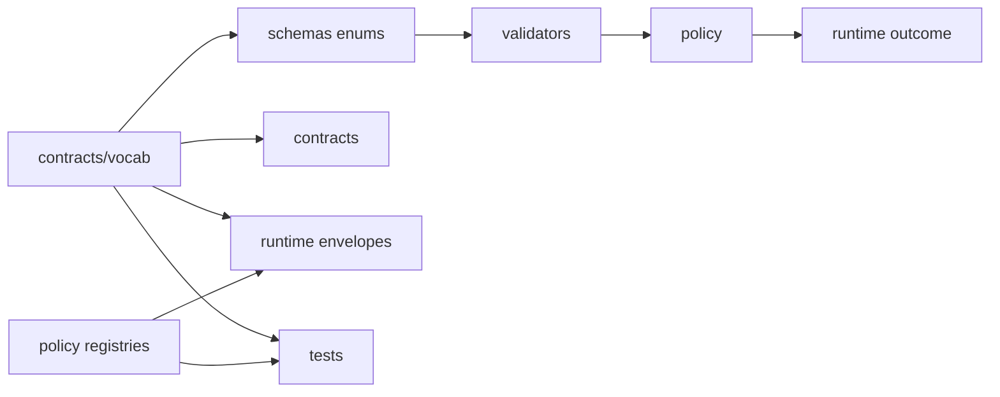

<!-- [KFM_META_BLOCK_V2]
doc_id: kfm://doc/<TODO-uuid>
title: Contract Vocabulary Registry
type: standard
version: v1
status: draft
owners: @bartytime4life
created: <TODO: set on first commit>
updated: 2026-04-18
policy_label: <TODO: verify public|restricted|internal>
related: [../README.md, ../contracts/README.md, ../schemas/README.md, ../schemas/contracts/README.md, ../../policy/README.md, ../../policy/reason_codes.json (PROPOSED), ../../policy/obligation_codes.json (PROPOSED), ../../policy/reviewer_roles.json (PROPOSED), ../../tests/contracts/README.md, ../../tests/e2e/runtime_proof/]
tags: [kfm, contracts, vocab, policy, schemas, runtime-proof]
notes: [Corpus-grounded README revision., This revision resolves ambiguity between contract-shared vocab and policy-owned code lists., Explicitly defines relationship between contracts/vocab/ and schemas/contracts/vocab/ as unresolved and requiring decision., Introduces runtime-proof consumption constraint for vocabulary stability.]
[/KFM_META_BLOCK_V2] -->

<a id="top"></a>

# Contract Vocabulary Registry

Machine-readable shared term families for KFM contracts, policy grammar, validators, and trust-visible runtime payloads.

<div align="left">


</div>

| Field | Value |
|---|---|
| **Path** | `contracts/vocab/README.md` |
| **Status** | experimental |
| **Owners** | `@bartytime4life` |
| **Primary job** | stabilize shared machine-readable term families |
| **Not this lane** | policy execution, schema bodies, UI copy, or duplicate registry ownership |
| **Current emphasis** | vocabulary authority boundaries, registry ownership, runtime-proof compatibility |

**Quick jump:** [Scope](#scope) · [Evidence posture](#evidence-posture) · [Repo fit](#repo-fit) · [Inputs](#inputs) · [Exclusions](#exclusions) · [Directory tree](#directory-tree) · [Quickstart](#quickstart) · [Usage](#usage) · [Diagram](#diagram) · [Tables](#tables) · [Task list](#task-list--definition-of-done) · [FAQ](#faq) · [Appendix](#appendix)

---

> [!IMPORTANT]
> Vocabulary is part of the **trust membrane**.
>
> If term families drift across:
> - contracts  
> - policy outputs  
> - runtime envelopes  
> - test fixtures  
>
> then validation can pass while meaning silently diverges.
>
> This lane exists to prevent that failure mode.

---

> [!WARNING]
> There are currently **two competing vocabulary signals**:
>
> - `contracts/vocab/` (this lane)
> - `schemas/contracts/vocab/*.json`
>
> This README **does not resolve that conflict silently**.  
> It makes the relationship explicit and requires a decision.

---

> [!TIP]
> Vocabulary decisions must be **visible before they are enforceable**.
>
> This file is where that visibility happens.

---

## Scope

`contracts/vocab/` stabilizes **contract-shared vocabulary families** used across:

- contract definitions
- schema enums
- policy outputs
- validator checks
- runtime envelopes
- trust-visible UI surfaces
- runtime-proof fixtures

It exists to ensure:

- consistent machine IDs across lanes  
- stable semantic meaning across releases  
- explicit trust consequences for each term  
- alignment between contracts, policy, and runtime surfaces  

### What this lane does

- defines shared vocabulary families
- defines machine IDs and semantics
- documents trust consequences
- routes ownership correctly
- prevents duplication across lanes

### What this lane does NOT do

- define schema structure
- implement policy logic
- store receipts or runtime data
- define UI copy
- silently become the canonical vocabulary home

[Back to top](#contract-vocabulary-registry)

---

## Evidence posture

| Claim | Status | Why it matters |
|---|---|---|
| Shared vocab is required across contracts, policy, and runtime | **CONFIRMED** | corpus doctrine depends on it |
| `contracts/vocab/` is intended as a shared registry lane | **CONFIRMED** | baseline doc |
| Policy owns `reason_codes`, `obligation_codes`, `reviewer_roles` | **CONFIRMED** | corpus + prior README |
| Schema-side vocab files exist (`schemas/contracts/vocab/*.json`) | **CONFIRMED** | schemas README |
| Canonical vocabulary home is resolved | **NEEDS VERIFICATION** | current repo signals conflict |
| Runtime-proof depends on stable vocab | **INFERRED** | fail-closed outcome grammar requires it |
| Contracts/vocab should be canonical | **PROPOSED** | not yet decided |

[Back to top](#contract-vocabulary-registry)

---

## Repo fit

| Surface | Role |
|---|---|
| `contracts/vocab/` | shared vocabulary definitions |
| `schemas/contracts/vocab/` | machine-enforced enum surfaces |
| `policy/` | executable code lists |
| `tools/validators/` | enforcement and checks |
| `tests/contracts/` | contract verification |
| `tests/e2e/runtime_proof/` | runtime outcome proof |
| runtime surfaces | consume vocab for trust visibility |

### Boundary rule

| Question | Answer |
|---|---|
| What does this term mean? | `contracts/vocab/` |
| Where is it enforced? | schema layer |
| Who decides outcomes? | `policy/` |
| Who verifies usage? | validators + tests |
| Who proves runtime behavior? | runtime-proof |

---

## Inputs

Accepted inputs:

- shared vocabulary registries (JSON/YAML)
- term definitions with trust consequences
- machine ID ↔ label mappings
- crosswalk tables
- compatibility notes
- deprecation records

### Minimum requirements

Each vocabulary entry must include:

- `id` (machine-stable)
- `label` (human-readable)
- `definition`
- `trust_consequence`
- `status` (active/deprecated)

---

## Exclusions

| Excluded | Why | Where instead |
|---|---|---|
| Policy code lists | executable authority | `policy/` |
| Schema bodies | structural definition | `schemas/` |
| Runtime payloads | instance data | runtime |
| Receipts | process memory | `data/receipts/` |
| UI copy | presentation layer | UI surfaces |
| Duplicate vocab registries | causes drift | one canonical + pointer |

> [!CAUTION]
> Duplicate vocabulary = **silent inconsistency** = governance failure.

---

## Directory tree

```text
contracts/vocab/
├── README.md
├── source_role.json          # PROPOSED
├── evidence_state.json       # PROPOSED
├── runtime_outcome.json      # PROPOSED
├── surface_class.json        # PROPOSED
└── surface_state.json        # PROPOSED
```

### Competing schema-side location

```text
schemas/contracts/vocab/
└── *.json   # CONFIRMED signal
```

---

## Quickstart

### Add a vocabulary family

1. classify ownership (contract-shared vs policy-owned)
2. create one registry file
3. define stable IDs
4. define trust consequences
5. update schema enums
6. update tests + validators
7. update this README

### Example

```json
{
  "family": "runtime_outcome",
  "version": "v1",
  "values": [
    {
      "id": "answer",
      "label": "Answer",
      "definition": "Sufficient evidence available",
      "trust_consequence": "Safe to present as governed output",
      "status": "active"
    }
  ]
}
```

---

## Usage

### Core rules

- machine IDs never change
- labels can evolve
- definitions explain trust impact
- deprecations are explicit
- no lane invents private variants

### Ownership rules

| Family type | Owner |
|---|---|
| contract-shared | `contracts/vocab/` |
| policy-enforced | `policy/` |
| schema-enforced | schema layer |
| runtime-used | runtime surfaces |

---

### Runtime-proof constraint

Vocabulary must satisfy:

- finite outcome grammar
- deterministic interpretation
- validator-consumable IDs
- stable test fixtures

If runtime-proof tests require a value, that value **must exist here or in policy-owned registries**, not be invented in tests.

---

## Diagram


```mermaid
flowchart LR
    V[contracts/vocab] --> S[schemas enums]
    V --> C[contracts]
    V --> R[runtime envelopes]
    V --> T[tests]

    P[policy registries] --> R
    P --> T

    S --> VAL[validators]
    VAL --> POL[policy]
    POL --> OUT[runtime outcome]
```

---

## Tables

### Starter registry matrix

| Family | Purpose | Owner | Status |
|---|---|---|---|
| `source_role` | source classification | contract-shared | CONFIRMED concept |
| `evidence_state` | evidence lifecycle | contract-shared | CONFIRMED concept |
| `runtime_outcome` | response grammar | contract-shared | CONFIRMED |
| `surface_class` | UI surface taxonomy | contract-shared | INFERRED |
| `surface_state` | UI state indicators | contract-shared | CONFIRMED |
| `reason_code` | policy explanation | policy | CONFIRMED |
| `obligation_code` | required actions | policy | CONFIRMED |
| `reviewer_role` | review authority | policy | CONFIRMED |

---

### Authority resolution options (PROPOSED)

| Option | Meaning |
|---|---|
| A | `contracts/vocab/` canonical, schema mirrors |
| B | schema vocab canonical, contracts pointer-only |
| C | unresolved (explicit dual surfaces) |

---

## Task list / Definition of done

- [ ] ownership defined per vocabulary family
- [ ] no duplicate registry exists
- [ ] schema enums updated
- [ ] validators updated
- [ ] runtime-proof tests aligned
- [ ] docs updated
- [ ] authority decision recorded (A/B/C)

---

## FAQ

### Is this a glossary?

No. This is machine-readable contract vocabulary.

### Who owns `reason_codes`?

`policy/`, unless explicitly moved.

### Why not duplicate vocab?

Because drift breaks trust guarantees.

### What if schema and contracts disagree?

Stop. Resolve authority before proceeding.

---

## Appendix

<details>
<summary>Starter candidates</summary>

### runtime_outcome

- answer
- abstain
- deny
- error

### evidence_state

- source_stated
- extracted
- inferred
- reviewed
- generalized
- unspecified

</details>

[Back to top](#contract-vocabulary-registry)
