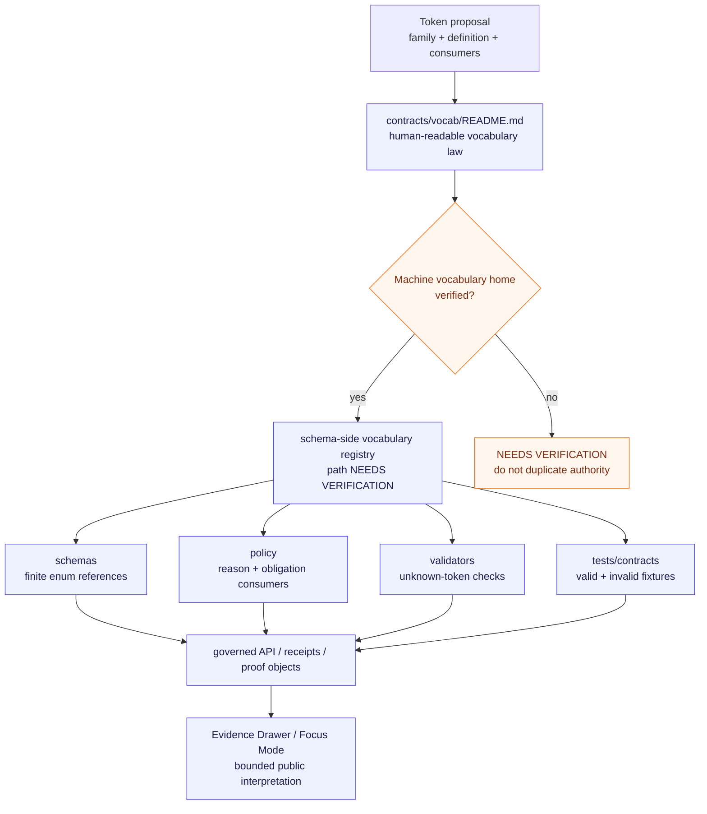

<!-- [KFM_META_BLOCK_V2]
doc_id: kfm://doc/NEEDS-VERIFICATION
title: Governed Object Vocabulary Registry
type: standard
version: v1
status: draft
owners: <TODO-VERIFY-OWNERS>
created: <TODO-VERIFY-CREATED-DATE>
updated: 2026-04-22
policy_label: public
related: [../../README.md, ../README.md, ../../schemas/contracts/vocab/README.md, ../../docs/standards/README.md, ../../policy/README.md, ../../tests/contracts/README.md, ../../.github/workflows/README.md]
tags: [kfm, contracts, vocab, governance, enums, reason-codes, obligation-codes, reviewer-roles]
notes: [doc_id owner created date and active-branch inventory need verification, this README is the human-readable vocabulary control surface, machine-readable vocabulary home remains NEEDS VERIFICATION until schema authority is settled]
[/KFM_META_BLOCK_V2] -->

# Governed Object Vocabulary Registry

Human-readable control surface for finite governed tokens shared by KFM contracts, schemas, validators, policy gates, receipts, reviews, and release objects.

> **Status:** experimental · **Doc status:** draft · **Owners:** `<TODO-VERIFY-OWNERS>`  
> 
> 
> 
> 
> 
>   
> **Quick jumps:** [Scope](#scope) · [Repo fit](#repo-fit) · [Inputs](#accepted-inputs) · [Exclusions](#exclusions) · [Quickstart](#quickstart) · [Governance rules](#governance-rules) · [Definition of done](#definition-of-done) · [FAQ](#faq)

---

## Scope

`contracts/vocab/` is the vocabulary boundary for shared KFM token law.

It exists to keep repeated values finite, named, reviewable, and consistent across trust-bearing object families. Typical examples include outcome enums, reason-code families, obligation-code families, reviewer-role names, object-family identifiers, and linkage keys such as `run_id` and `spec_hash`.

> [!IMPORTANT]
> This lane does **not** decide policy, promotion eligibility, release status, schema validity, or validator behavior by itself. It names shared tokens so contracts, schemas, policy, validators, fixtures, receipts, and UI payloads do not drift into competing vocabularies.

### Current truth posture

| Claim | Status | Meaning for this README |
|---|---:|---|
| `contracts/vocab/README.md` is the intended human-readable vocabulary lane | **CONFIRMED from supplied corpus** | Revise this file in place rather than creating a parallel vocabulary README. |
| The machine-readable vocabulary home is fully settled | **NEEDS VERIFICATION** | Do not imply `contracts/vocab/`, `schemas/contracts/vocab/`, or another path is the sole machine authority until an ADR or schema-authority statement confirms it. |
| Shared vocabulary should remain finite and reviewable | **CONFIRMED doctrine / PROPOSED implementation detail** | New values require a definition, owning family, consumers, examples, and a deprecation plan. |
| Validators, policy, and fixtures already enforce every token listed here | **UNKNOWN** | Treat enforcement claims as open until tests and workflow callers are inspected on the active branch. |

[Back to top](#governed-object-vocabulary-registry)

---

## Repo fit

| Item | Value |
|---|---|
| Path | `contracts/vocab/README.md` |
| Role | Human-readable vocabulary governance lane for shared governed-object tokens |
| Upstream | [`../README.md`](../README.md), [`../../README.md`](../../README.md) |
| Contract neighbor | [`../README.md`](../README.md) |
| Schema-side vocabulary neighbor | [`../../schemas/contracts/vocab/README.md`](../../schemas/contracts/vocab/README.md) |
| Standards neighbor | [`../../docs/standards/README.md`](../../docs/standards/README.md) |
| Policy neighbor | [`../../policy/README.md`](../../policy/README.md) |
| Verification neighbor | [`../../tests/contracts/README.md`](../../tests/contracts/README.md) |
| Workflow neighbor | [`../../.github/workflows/README.md`](../../.github/workflows/README.md) |
| Current authority posture | **NEEDS VERIFICATION** — schema-home, fixture-home, and machine-vocabulary-home law are not settled by this README alone |

### Responsibility split

| Responsibility | Preferred home | Why |
|---|---|---|
| Vocabulary meaning, naming rules, lifecycle posture | `contracts/vocab/README.md` | Human-readable term law belongs close to contracts. |
| Machine-readable vocabulary registries | `schemas/contracts/vocab/` or another verified schema authority | Validators need a stable machine source, but the exact home must be verified. |
| Policy decisions and allow/deny behavior | `policy/` | Vocabulary names reasons and obligations; policy decides consequences. |
| Validator implementation | `tools/validators/` | Validators consume vocabulary; they do not own it. |
| Valid and invalid examples | `tests/contracts/` and policy-specific fixture lanes | Fixture burden belongs in tests, not in README prose. |
| Process-memory instances | `data/receipts/` | Contracts define receipt shape; actual receipts are lifecycle artifacts. |

[Back to top](#governed-object-vocabulary-registry)

---

## Accepted inputs

Use this lane for small, stable, shared tokens that would otherwise be duplicated across object families.

| Accepted input | Examples | Required review posture |
|---|---|---|
| Governed object family names | `run_receipt`, `policy_decision`, `promotion_gate` | Family must already be contract-relevant or explicitly proposed. |
| Linkage keys | `run_id`, `spec_hash` | Key must explain what it joins and what fails closed when missing. |
| Outcome enums | `ANSWER`, `ABSTAIN`, `DENY`, `ERROR`; `PASS`, `HOLD`, `DENY`, `ERROR` | Values must be finite and mapped to their owning object family. |
| Reason-code families | `gate_passed`, `evidence_closure_missing`, `policy_evaluation_failed` | Codes need definitions, consumers, and invalid-example tests. |
| Obligation-code families | `supply_ownership_and_review_metadata`, `publish_correction_or_rollback_path` | Obligations must point to policy or review behavior; this README only names them. |
| Reviewer / steward role names | `steward`, `reviewer`, `approver`, exact values **NEEDS VERIFICATION** | Roles must be tied to review surfaces and CODEOWNERS or governance docs. |
| Vocabulary lifecycle notes | `draft`, `active`, `deprecated`, `reserved`, exact status set **NEEDS VERIFICATION** | Token lifecycle must include migration and rollback expectations. |

### Token admission card

Every new shared token should arrive with this minimum card:

| Field | Required? | Notes |
|---|---:|---|
| Token value | Yes | Prefer lowercase `snake_case` for code-like values unless an existing object family requires another form. |
| Family | Yes | The object or registry family that owns the token. |
| Definition | Yes | One sentence, no policy side effects hidden inside the prose. |
| Allowed consumers | Yes | Schemas, validators, policy, UI payloads, receipts, or reports. |
| Invalid examples | Yes | At least one negative fixture or drift-check case when the token is machine-enforced. |
| Deprecation path | Yes | Required before renaming or replacing a token already referenced by fixtures or receipts. |

[Back to top](#governed-object-vocabulary-registry)

---

## Exclusions

Do not use this lane as a dumping ground for nearby governance work.

| Does **not** belong here | Put it here instead | Reason |
|---|---|---|
| Schema object bodies | `../../schemas/contracts/` or verified schema authority | This README names shared vocabulary; it does not define full schema shape. |
| Policy rules, deny conditions, obligations logic | `../../policy/` | Policy owns consequences and fail-closed decisions. |
| Validator code | `../../tools/validators/` | Validators consume vocabulary and emit reports. |
| Workflow YAML | `../../.github/workflows/` | Workflows run checks; this lane only documents token law. |
| Valid / invalid fixture packs | `../../tests/contracts/` | Fixtures prove behavior and drift resistance. |
| Receipts, proof packs, manifests, release bundles | `../../data/receipts/`, `../../data/proofs/`, release lanes **NEEDS VERIFICATION** | Runtime evidence is lifecycle state, not vocabulary. |
| Domain-specific controlled vocabularies with source authority | Domain registry or source descriptor lane | Domain terms may require source-role, rights, or steward controls beyond shared contract vocabulary. |
| Glossary essays or generic definitions | `../../docs/` | This lane is for shared governed tokens, not broad explanatory prose. |

[Back to top](#governed-object-vocabulary-registry)

---

## Directory tree

### This lane

```text
contracts/
└── vocab/
    └── README.md
```

### Adjacent surfaces to inspect before changing tokens

```text
contracts/
├── README.md
└── vocab/
    └── README.md

schemas/
└── contracts/
    └── vocab/
        ├── README.md
        ├── reason_codes.json              # NEEDS VERIFICATION on active branch
        ├── obligation_codes.json          # NEEDS VERIFICATION on active branch
        └── reviewer_roles.json            # NEEDS VERIFICATION on active branch

tests/
└── contracts/
    └── README.md                          # fixture/test depth NEEDS VERIFICATION

policy/
└── README.md                              # policy-code consumers live here or below

.github/
└── workflows/
    └── README.md                          # checked-in YAML depth NEEDS VERIFICATION
```

> [!NOTE]
> The tree above is a review map, not a claim that every listed file is populated or enforced on the active branch. Reopen the files before making validator, workflow, or schema-authority claims.

[Back to top](#governed-object-vocabulary-registry)

---

## Quickstart

Run these commands from the repository root. They are read-only inspection commands.

```bash
# 1. Inspect this lane and its parent.
find contracts -maxdepth 3 -type f | sort
sed -n '1,260p' contracts/README.md
sed -n '1,260p' contracts/vocab/README.md

# 2. Inspect schema-side vocabulary and adjacent authority docs.
find schemas/contracts/vocab -maxdepth 3 -type f | sort 2>/dev/null || true
sed -n '1,260p' schemas/contracts/vocab/README.md 2>/dev/null || true
sed -n '1,260p' docs/standards/README.md 2>/dev/null || true

# 3. Inspect policy, fixture, and workflow consumers before adding a token.
find policy tests/contracts .github/workflows -maxdepth 3 -type f | sort 2>/dev/null || true

# 4. Search for duplicated inline token lists.
git grep -nE 'reason_codes|obligation_codes|reviewer_roles|spec_hash|run_id|ALLOW|ABSTAIN|DENY|ERROR' -- \
  contracts schemas policy tests tools apps packages docs .github 2>/dev/null || true
```

### Safe edit sequence

1. Confirm whether the token already exists in schema-side registries, policy, validators, fixtures, or docs.
2. Add or revise the human-readable token rule in this README.
3. Update exactly one verified machine vocabulary source, or leave a `NEEDS VERIFICATION` note if machine-home authority is unresolved.
4. Add or update valid and invalid fixtures in the verified fixture home.
5. Update validators to reject unknown or stale token values.
6. Update adjacent READMEs in the same change when placement meaning changes.
7. Record deprecation or migration notes for any renamed token.

[Back to top](#governed-object-vocabulary-registry)

---

## Usage

### For maintainers

Keep this lane boring in the best way: finite, reviewable, and hard to accidentally fork.

A token should not be added here just because it is convenient in one schema or one validator. Add it here when at least two governed surfaces need the same value, or when a single high-consequence surface needs a stable token that future consumers must not rename casually.

### For contributors

Start with the smallest vocabulary change that keeps meaning stable.

Good pull requests explain:

- why the token is shared;
- which object family owns it;
- which consumers read it;
- which invalid examples should fail;
- whether existing receipts, fixtures, or reports need migration.

### For reviewers

Reject changes that:

- duplicate the same enum values in multiple schemas without a shared vocabulary source;
- treat this README as proof that validator enforcement exists;
- move policy semantics into vocabulary definitions;
- create a token without a family, definition, consumer list, and invalid example;
- add a machine-readable registry under a second path without an explicit mirror or migration rule;
- rename a token without a deprecation and compatibility note.

[Back to top](#governed-object-vocabulary-registry)

---

## Governance rules

### 1. Vocabulary is subordinate to contracts and policy

Contracts describe object meaning. Schemas constrain machine shape. Policy decides allow, deny, abstain, obligations, and review consequences. Vocabulary keeps shared tokens stable across those surfaces.

### 2. Adjacent governed objects remain separate

Adjacent governed objects remain separate and link by `run_id` and `spec_hash`; any required mismatch or missing linkage is fail-closed.

### 3. Token lists must be finite

Open-ended string fields are allowed only when the value is descriptive text, not a governed state, reason, obligation, role, or object family identifier.

### 4. Unknown tokens fail closed

A validator, policy gate, or promotion evaluator that encounters an unknown governed token should return a bounded failure outcome rather than guessing.

### 5. Vocabulary changes need migration notes

Renaming `gate_passed` to `promotion_gate_passed` is not a text edit. It changes schema examples, validator logic, policy reports, fixtures, historical receipts, and possibly UI display mappings.

[Back to top](#governed-object-vocabulary-registry)

---

## Vocabulary map

### Starter families

| Family | Role | Example tokens | Status |
|---|---|---|---|
| `run_receipt` | Process-memory outcome family | `PROMOTED`, `HELD`, `QUARANTINED`, `ERROR` | **PROPOSED / NEEDS VERIFICATION** |
| `policy_decision` | Policy result family | `ALLOW`, `ABSTAIN`, `DENY`, `ERROR` | **PROPOSED / NEEDS VERIFICATION** |
| `quarantine_record` | Blocked or held review-state family | exact values **NEEDS VERIFICATION** | **NEEDS VERIFICATION** |
| `promotion_gate` | Release-readiness membrane | `PASS`, `HOLD`, `DENY`, `ERROR` | **PROPOSED / NEEDS VERIFICATION** |
| `linkage` | Join consistency membrane | `run_id`, `spec_hash` | **PROPOSED / NEEDS VERIFICATION** |

### Policy / receipt / promotion translation

| Policy result | Receipt outcome | Promotion gate result | Review posture |
|---|---|---|---|
| `ALLOW` | `PROMOTED` | `PASS` | Continue only if evidence, catalog, policy, and review gates are satisfied. |
| `ABSTAIN` | `HELD` | `HOLD` | Hold for missing evidence, unresolved authority, or required review. |
| `DENY` | `QUARANTINED` | `DENY` | Block promotion or publication. |
| `ERROR` | `ERROR` | `ERROR` | Stop and surface bounded failure. |

> [!WARNING]
> The table above is a vocabulary alignment aid. It is not a promotion algorithm and must not be treated as policy enforcement.

[Back to top](#governed-object-vocabulary-registry)

---

## Diagram


```mermaid
flowchart TD
    A["Token proposal<br/>family + definition + consumers"] --> B["contracts/vocab/README.md<br/>human-readable vocabulary law"]
    B --> C{"Machine vocabulary home<br/>verified?"}
    C -- "yes" --> D["schema-side vocabulary registry<br/>path NEEDS VERIFICATION"]
    C -- "no" --> E["NEEDS VERIFICATION<br/>do not duplicate authority"]
    D --> F["schemas<br/>finite enum references"]
    D --> G["policy<br/>reason + obligation consumers"]
    D --> H["validators<br/>unknown-token checks"]
    D --> I["tests/contracts<br/>valid + invalid fixtures"]
    F --> J["governed API / receipts / proof objects"]
    G --> J
    H --> J
    I --> J
    J --> K["Evidence Drawer / Focus Mode<br/>bounded public interpretation"]

    classDef caution fill:#fff7ed,stroke:#f97316,color:#7c2d12;
    classDef control fill:#eef2ff,stroke:#4f46e5,color:#1e1b4b;
    class C,E caution;
    class B,D,F,G,H,I,J,K control;
```

[Back to top](#governed-object-vocabulary-registry)

---

## Definition of done

A vocabulary change is ready only when the reviewer can answer “yes” to every applicable gate.

- [ ] The active branch inventory for `contracts/`, `schemas/contracts/vocab/`, `policy/`, `tests/contracts/`, and workflow callers has been checked.
- [ ] The token has one owning family and a one-sentence definition.
- [ ] The token uses an existing naming style or explicitly justifies a new one.
- [ ] The token has at least one named consumer.
- [ ] The token is added to exactly one verified machine source, or the PR states why machine-home authority remains unresolved.
- [ ] Valid and invalid fixtures exist or are explicitly deferred with `NEEDS VERIFICATION`.
- [ ] Validators reject unknown values where enforcement is in scope.
- [ ] Policy semantics remain in policy files, not in this README.
- [ ] Adjacent docs are updated when placement rules change.
- [ ] Renames include deprecation, migration, and rollback notes.
- [ ] The change does not silently settle schema-home, fixture-home, or vocabulary-home authority by directory inertia.

[Back to top](#governed-object-vocabulary-registry)

---

## FAQ

### Is this README the machine-readable registry?

No. This README is the human-readable vocabulary control surface. Machine-readable registry placement remains **NEEDS VERIFICATION** until the schema-authority split is resolved on the active branch.

### Can a schema define its own enum inline?

Only as a temporary starter-wave exception with a drift ticket. Shared governed values should move to a single vocabulary source so validators, fixtures, policy outputs, and UI payloads do not diverge.

### Is a reason code the same thing as a policy rule?

No. A reason code names why a decision or gate returned a result. The policy rule decides the result.

### What happens when `contracts/vocab/` and `schemas/contracts/vocab/` disagree?

Treat the disagreement as **CONFLICTED** and do not promote the change. Resolve through a schema-authority or vocabulary-home decision before adding new trust-bearing tokens.

### Can domain lanes add their own vocabularies?

Yes, but only when the terms are domain-specific and source-role-aware. Shared governed-object tokens belong here or in the verified shared machine registry; domain terms belong in their domain registry or source descriptor lane.

[Back to top](#governed-object-vocabulary-registry)

---

## Appendix

<details>
<summary><strong>Truth labels used in this README</strong></summary>

| Label | Meaning |
|---|---|
| **CONFIRMED** | Verified from supplied project corpus or current-session workspace inspection. |
| **INFERRED** | Conservative interpretation of source-grounded material, not an implementation claim. |
| **PROPOSED** | Recommended design or edit posture that still needs implementation or active-branch verification. |
| **UNKNOWN** | Not verified strongly enough from mounted repo, tests, workflows, logs, or emitted artifacts. |
| **NEEDS VERIFICATION** | Concrete branch, ownership, schema-home, fixture-home, workflow, or enforcement check is still required. |
| **CONFLICTED** | Two surfaces imply incompatible authority or placement and must be reconciled before promotion. |

</details>

<details>
<summary><strong>Reviewer checklist for authority drift</strong></summary>

Review these files together when vocabulary meaning changes:

- `contracts/README.md`
- `contracts/vocab/README.md`
- `schemas/contracts/vocab/README.md`
- `docs/standards/README.md`
- `policy/README.md`
- `tests/contracts/README.md`
- `.github/workflows/README.md`
- `.github/CODEOWNERS`

Ask:

1. Does the change introduce a second source of truth?
2. Does it make a README sound more enforced than tests prove?
3. Does it move policy behavior into vocabulary prose?
4. Does it create or rename a token without fixture coverage?
5. Does it require a schema-authority or vocabulary-home ADR before merge?

</details>
