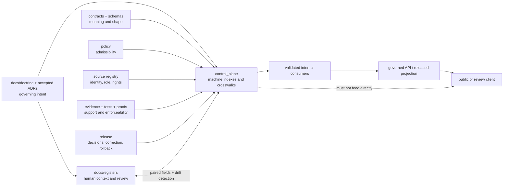
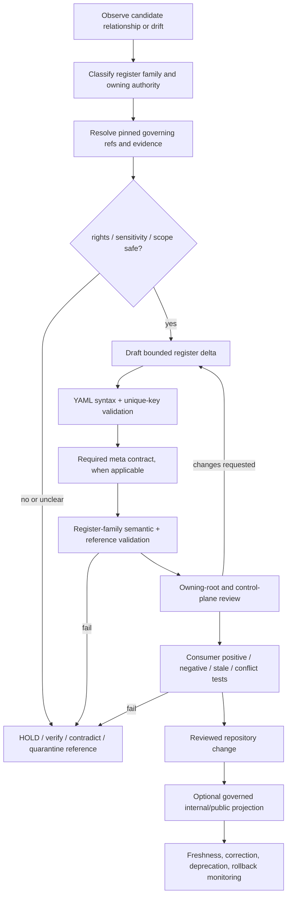

<!-- [KFM_META_BLOCK_V2]
doc_id: kfm://doc/control-plane-readme
title: control_plane/ — Machine-Readable Governance Index Root
version: v0.3
type: readme; root-readme; canonical-control-plane-root; machine-register-index; crosswalk-boundary; governance-observability-root
status: "draft; repository-grounded; canonical-root-confirmed; root-register-meta-contract-enforced; register-population-sparse; semantic-validation-partial; nested-lane-validation-unverified; non-authoritative"
owners: "OWNER_TBD — Control-plane steward · Register steward · Architecture steward · Docs steward · Contract/schema/policy/source/evidence/release stewards · Domain stewards · Validation/CI steward; CODEOWNERS routes /control_plane/ to @bartytime4life"
created: "NEEDS VERIFICATION — a short root stub existed before the v0.2 expansion"
updated: 2026-07-23
supersedes: v0.2 control-plane root README at the same path
prepared_under_prompt: KFM Markdown Engineering, Modernization & GitHub Documentation Implementation Agent v5.0.0
policy_label: "repository-facing; control-plane; machine-registers; authority-index; no-parallel-authority; no-direct-public-path; cite-or-abstain; correction-aware; rollback-aware"
current_path: control_plane/README.md
truth_posture: >
  CONFIRMED the existing control-plane root, stable document identity, Directory Rules v1.4
  responsibility and root-README contract, nine required root register files, current root-YAML
  parser and register meta-contract tests, current docs-control-plane workflow, CODEOWNERS route,
  Makefile boundary-guard entrypoint, four bounded child Markdown surfaces, and two supplemental
  root YAML files / PROPOSED register maturity vocabulary, semantic-closure packet, update
  transaction, consumer-admission contract, and future nested-lane validation / CONFLICTED
  root-level required registers versus the optional control_plane/registers/ sublane pattern,
  and narrative language that calls a sparse PROPOSED document register authoritative /
  UNKNOWN exhaustive recursive inventory, every register consumer, semantic agreement across
  all referenced authority roots, branch-protection enforcement, runtime use, production
  deployment, and public effects / NEEDS VERIFICATION accountable owners, independent review,
  per-register machine schemas, complete population, stale-reference detection, nested YAML
  coverage, consumer drift checks, correction propagation, and retirement drills
evidence_snapshot:
  repository: bartytime4life/Kansas-Frontier-Matrix
  repository_id: "1059091169"
  visibility: public
  base_ref: main
  base_commit: 9ab50d9a94e36320b12b1deb9035ea5a3d315815
  prior_blob: ce3daede0df36b6d976a545dcb0d0470db2c5833
  directory_rules_blob: 2affb080e6f0043867c64c7f06c1ca52030fbd55
  docs_control_plane_workflow_blob: 986fe1b4845c51f719bcfeeefe08729517ae543c
  register_meta_contract_test_blob: 05ebb49d07235ab77bd9dbf6717ee05a59e2f052
  codeowners_blob: dd2a84aa514d8ecd9208bc347f90f9a2ed37dd61
  makefile_blob: 51537af34ee065c2de571134688415042b83b22a
  domains_readme_blob: 59db9ada6c17aba05781f0a994dce1f27fd00330
  habitat_lane_readme_blob: 14cf3852acf3b308329121e402d3beb2e779f004
  registers_readme_blob: 61b30da67fb8cc8afea109bcba777a57a6daf8f4
  drift_profile_blob: 2c472bd2552b758d365a8e9311aaa19ff4d5d7b9
  required_registers: "9"
  required_registers_with_entries: "1"
  required_registers_empty: "8"
  bounded_supplemental_root_yaml_files: "2"
  inventory_method: exact GitHub file reads and exact-path absence probes at the pinned base; no recursive Git tree, local checkout, branch-protection inspection, deployment, or runtime was inspected
related:
  - ../README.md
  - ../docs/doctrine/directory-rules.md
  - ../docs/doctrine/authority-ladder.md
  - ../docs/doctrine/truth-posture.md
  - ../docs/doctrine/trust-membrane.md
  - ../docs/doctrine/lifecycle-law.md
  - ../docs/adr/INDEX.md
  - ../docs/registers/DOCUMENT_REGISTRY.md
  - ../docs/registers/DRIFT_REGISTER.md
  - ../docs/registers/VERIFICATION_BACKLOG.md
  - ../docs/registers/OBJECT_FAMILY_MAP.md
  - ../contracts/README.md
  - ../schemas/README.md
  - ../policy/README.md
  - ../tests/README.md
  - ../tools/validators/README.md
  - ../data/README.md
  - ../release/README.md
  - ../.github/CODEOWNERS
  - ../.github/workflows/docs-control-plane.yml
  - ../Makefile
  - domains/README.md
  - domains/habitat/README.md
  - registers/README.md
  - registers/DRIFT_REGISTER.md
  - document_registry.yaml
  - document_registry_doctrine_required.yaml
  - source_authority_register.yaml
  - object_family_register.yaml
  - domain_lane_register.yaml
  - policy_gate_register.yaml
  - release_state_register.yaml
  - verification_backlog.yaml
  - contradiction_register.yaml
  - deprecation_register.yaml
  - normalized_summary_consumer_readiness.yaml
tags: [kfm, control-plane, machine-registers, governance-index, crosswalks, authority, drift, verification, deprecation, policy-gates, release-state, validation, correction, rollback]
notes:
  - "v0.3 is a same-path, no-loss modernization of the existing control-plane root contract."
  - "The first twelve H2 sections follow Directory Rules section 15 exactly."
  - "A file can pass the current meta contract while remaining empty, semantically incomplete, unreviewed, or unsafe for consumers."
  - "This README does not populate a register, create a schema, accept an ADR, approve policy, change release state, promote lifecycle data, expose a public route, or publish."
[/KFM_META_BLOCK_V2] -->

<a id="top"></a>

# `control_plane/` — Machine-Readable Governance Index Root

[](#status)
[](#authority-level)
[](#current-bounded-inventory)
[](#register-population-and-maturity)
[](#validation)
[](#what-does-not-belong-here)
[](#register-rules-and-failure-controls)

> **One-line purpose.** `control_plane/` stores validated, machine-readable indexes and crosswalks that answer **what governs what** without becoming the contract, schema, policy, source, evidence, lifecycle, release, runtime, or public authority being indexed.

**Quick navigation:** [Purpose](#purpose) · [Authority](#authority-level) · [Status](#status) · [Belongs](#what-belongs-here) · [Does not belong](#what-does-not-belong-here) · [Inputs](#inputs) · [Outputs](#outputs) · [Validation](#validation) · [Review](#review-burden) · [Related roots](#related-folders) · [ADRs](#adrs) · [Last reviewed](#last-reviewed) · [Inventory](#current-bounded-inventory) · [Maturity](#register-population-and-maturity) · [Contract](#root-register-meta-contract) · [Pairing](#human-and-machine-register-pairing) · [Flow](#register-update-and-consumer-admission-flow) · [Guardrails](#register-rules-and-failure-controls) · [Correction](#correction-deprecation-and-rollback) · [Verification](#open-verification-register) · [Evidence](#evidence-ledger) · [No-loss](#v02-to-v03-no-loss-ledger) · [Summary](#status-summary)

> [!IMPORTANT]
> **A register indexes authority; it does not manufacture authority.** A path, identifier, status, or crosswalk becomes useful only when it resolves to the owning contract, schema, policy, source, evidence, test, release, or review record. Register presence, valid YAML, a green workflow, or a merged pull request cannot promote an entry into truth or release authority.

> [!WARNING]
> **Current validation is real but bounded.** The repository parses root `control_plane/*.yaml`, rejects duplicate YAML keys, checks nine required register files for a small metadata contract, and validates ADR-index coherence. It does **not** prove field-level semantics for every register, cross-register agreement, complete population, nested-lane validation, consumer correctness, policy approval, release readiness, or publication.

> [!CAUTION]
> **No ordinary public client reads this root directly.** Public and semi-public surfaces consume governed APIs and released, policy-allowed projections. Exposing a raw control-plane register as public truth would bypass the trust membrane.

---

## Purpose

`control_plane/` is KFM's canonical responsibility root for machine-readable governance maps, indexes, crosswalks, and operational registers.

It exists to let tools and stewards answer bounded questions such as:

- Which document, ADR, contract, schema, policy, source, domain lane, test, release state, or correction record governs a named object or path?
- Which authority relationships are current, proposed, contradicted, deprecated, or awaiting verification?
- Which root owns the actual meaning, shape, admissibility, evidence, lifecycle state, or release decision behind an index entry?
- Which checks and consumers may use a register, and at what verified maturity?
- Where must a reviewer look when human-facing documentation and machine-readable state disagree?

The root improves inspectability and coordination. It does not create domain truth, approve policy, release data, execute a validator, or expose a normal public interface.

[Back to top](#top)

---

<a id="authority-boundary"></a>

## Authority level

| Surface | Authority posture |
|---|---|
| `control_plane/` root | **Canonical responsibility root** for machine-readable governance indexes and crosswalks. |
| Required register file path | **Repository-required surface** when named by the current meta-contract test. |
| Register metadata and entries | **Index claims only.** Their authority is bounded by referenced evidence, owners, review, and owning roots. |
| Human-readable explanation | Owned by `docs/`, especially `docs/registers/`; machine indexes do not replace narrative context. |
| Object meaning | Owned by `contracts/`; a register points to meaning but does not define it. |
| Machine shape | Owned by `schemas/`; a register instance does not become its own schema. |
| Admissibility and sensitivity | Owned by `policy/`; a gate map is not a `PolicyDecision`. |
| Source identity and authority | Owned by source registry and lifecycle surfaces; a source-authority register is a crosswalk, not a `SourceDescriptor`. |
| Evidence and proof | Owned by evidence/proof surfaces; a reference in a register is not an `EvidenceBundle` or ProofPack. |
| Release, correction, rollback | Owned by `release/`; a release-state index cannot approve or alter a release. |
| Runtime and public response | Owned by governed applications and released artifacts; this root has no normal public-client authority. |

Authority is **referential** here: the register is useful because it points to an owning artifact and preserves a reviewable relationship. When the reference does not resolve, the entry is incomplete and consumers must fail closed.

[Back to top](#top)

---

<a id="status-notes"></a>

## Status

| Finding | Truth status | Current bounded result |
|---|---:|---|
| Root path and README | `CONFIRMED` | `control_plane/README.md` exists with stable `kfm://doc/control-plane-readme` identity. |
| Required root registers | `CONFIRMED` | The current test requires nine exact `control_plane/*.yaml` register files. |
| Required register metadata | `CONFIRMED / ENFORCED` | Tests require `meta.status`, `owner`, ISO `last_reviewed`, existing `related_doctrine` paths, and an `entries:` body. |
| Required-register population | `CONFIRMED BOUNDED` | `document_registry.yaml` has one entry; the other eight required registers have empty `entries` lists. |
| Root YAML syntax | `CONFIRMED / ENFORCED` | Workflow parses every root `control_plane/*.yaml`, rejects duplicate keys, and requires a mapping document root. |
| Per-register machine schemas | `NEEDS VERIFICATION` | The workflow explicitly does not claim a dedicated schema for every field. |
| Semantic and cross-register coherence | `UNKNOWN / PARTIAL` | No general proof was established that entries resolve, agree, are complete, or match implementation. |
| Child Markdown lanes | `CONFIRMED BOUNDED` | `domains/`, `domains/habitat/`, `registers/`, and `registers/DRIFT_REGISTER.md` were read. |
| Child machine registers | `NEEDS VERIFICATION` | The inspected child READMEs describe proposed files; no child YAML instance was established by this bounded review. |
| Dedicated review route | `CONFIRMED ROUTING / NEEDS VERIFICATION ENFORCEMENT` | CODEOWNERS routes `/control_plane/` to `@bartytime4life`; independent stewardship and required-review enforcement were not verified. |
| Direct public use | `DENY` | Register placement never authorizes public consumption. |

### Current tensions

1. **Root register files versus `registers/` sublane.** The enforceable meta contract requires nine registers at `control_plane/` root, while `control_plane/registers/README.md` describes an optional sublane and correctly says existing root files should not be moved merely to match a proposal.
2. **Sparse register versus authoritative wording.** The human Document Registry calls `control_plane/document_registry.yaml` the canonical machine register, but the machine file is `PROPOSED` and carries only one entry. Path role and inventory completeness must not be conflated.
3. **Syntax/meta validation versus semantic closure.** Empty `entries: []` bodies pass the current meta contract. A green check proves the declared boundary, not useful population or cross-root agreement.
4. **Root-only YAML glob.** The workflow's syntax lane reads `control_plane/*.yaml`; nested future YAML requires an explicit validation decision rather than assumed coverage.

[Back to top](#top)

---

<a id="accepted-material"></a>
<a id="what-belongs-here"></a>

## What belongs here

Only machine-readable governance-index material belongs in this root or its governed sublanes.

| Material | Required posture |
|---|---|
| Required root register YAML | Exact path, metadata contract, `entries` body, resolvable doctrine references, bounded owner and review date. |
| Document and authority indexes | Point to documents and their classified status without copying document bodies. |
| Object-family crosswalks | Map object families to semantic contracts, schemas, policy, fixtures/tests, emitters, evidence, and release surfaces. |
| Domain-lane indexes | Point to domain responsibility lanes and gates without becoming domain contracts, schemas, policy, or data. |
| Policy/release gate maps | Name gate identifiers and owning artifacts; never record an allow or release decision merely by index value. |
| Verification, contradiction, drift, and deprecation indexes | Record a reviewable mismatch, backlog item, replacement, sunset, or evidence need with references. |
| Bounded consumer-readiness records | State exactly which consumer and command were observed, at which revision, without generalizing to all consumers. |
| README and profile Markdown | Explain control-plane boundaries, register meaning, update discipline, validation limits, correction, and rollback. |

A register entry should be small and referential. It should include stable identity, status, owning root, governing references, evidence or verification references where material, review state, and correction/deprecation information appropriate to its type.

[Back to top](#top)

---

<a id="exclusions"></a>
<a id="what-does-not-belong-here"></a>

## What does NOT belong here

| Do not place or decide here | Correct authority or action |
|---|---|
| Human doctrine, architecture, runbooks, narrative registers | `docs/` |
| Object-family semantic meaning | `contracts/` |
| JSON Schema or other machine-shape authority | `schemas/` |
| OPA/Rego or other admissibility logic | `policy/` |
| `SourceDescriptor` instances, source captures, source payloads | Source registry and the correct `data/` lifecycle lane |
| `EvidenceBundle`, ProofPack, citation-validation result | Evidence/proof lanes |
| RAW, WORK, QUARANTINE, PROCESSED, CATALOG/TRIPLET, or PUBLISHED payloads | The correct `data/` phase |
| `ReleaseManifest`, `PromotionDecision`, `CorrectionNotice`, `WithdrawalNotice`, `RollbackCard` | `release/` |
| Executable validators, builders, generators, or migrations | `tools/`, `pipelines/`, `scripts/`, or `migrations/` according to responsibility |
| Fixtures and tests | `fixtures/` and `tests/` |
| API handlers, UI components, runtime adapters, packages | `apps/`, `packages/`, `runtime/`, or another implementation root |
| Credentials, private tokens, secrets, restricted details, hidden reasoning | Never commit; follow incident, quarantine, or sensitive-data procedures |
| Direct public responses or public map configuration | Governed API and released public-safe artifacts |
| Generated summaries presented as authority | Resolve to evidence and owning authority, or abstain |

Do not copy an authoritative artifact into a register to make lookup convenient. Link to the canonical artifact and preserve a stable crosswalk.

[Back to top](#top)

---

## Inputs

Admissible register inputs include:

- pinned repository paths and content identities;
- current, unsuperseded doctrine and accepted ADRs;
- semantic contracts and machine schemas;
- policy bundles and observed policy tests;
- source descriptors, rights/sensitivity records, and source-health results;
- evidence, proof, validation, catalog, release, correction, and rollback records;
- bounded workflow, test, build, or runtime evidence tied to a known revision;
- steward-reviewed classification or deprecation decisions;
- deterministic inventory or drift scans that emit candidates for review.

Every material input must retain its authority class. A generated scan, model suggestion, or documentation statement can propose a register delta; it cannot self-approve the entry.

Before admission, resolve:

1. the register type and stable identity;
2. the owning authority root;
3. the evidence and revision supporting the claim;
4. status, review, and freshness;
5. rights or sensitivity implications;
6. the consumer scope;
7. correction, deprecation, or rollback requirements.

Unknown or conflicting authority blocks consumer-ready status. Record a verification or contradiction entry rather than guessing.

[Back to top](#top)

---

## Outputs

`control_plane/` may emit or support:

- validated machine-readable register files;
- authority, object-family, domain-lane, source, policy-gate, and release-state crosswalks;
- verification, contradiction, deprecation, and drift candidates;
- deterministic validation logs and CI annotations;
- internal lookup inputs for validators, generators, review tools, and governed services;
- human-review references that pair with `docs/registers/`.

It must not emit or claim:

- domain truth or evidence closure;
- a policy allow/deny decision;
- lifecycle promotion;
- a release, correction, withdrawal, or rollback decision;
- a public API response or public map layer;
- production readiness merely because a register parses;
- KFM `PUBLISHED` state.

Downstream consumers must declare which register fields they use, what validation they require, how stale/conflicting entries fail, and what fallback or rollback behavior applies.

[Back to top](#top)

---

<a id="validation-checklist"></a>

## Validation

Validation is layered. Each layer proves only its declared boundary.

### Current implemented checks

| Check | Current command or workflow | What it proves | What it does not prove |
|---|---|---|---|
| Root YAML parse | `docs-control-plane` → `validate-control-plane-yaml` | Every root `control_plane/*.yaml` parses with `PyYAML==6.0.3`, has unique mapping keys, and a mapping root. | Field semantics, completeness, nested YAML, consumer correctness. |
| Required register meta contract | `python -m pytest tests/policy/test_control_plane_register_meta_contract.py -q --strict-config --strict-markers` | Nine exact files exist; metadata keys, `entries`, date, status vocabulary, owner, and doctrine paths pass. | Entry shape, resolved references, nonempty population, semantic agreement. |
| Boundary guard aggregate | `make boundary-guards` | Runs the register meta-contract with API/renderer/connector boundary tests. | Full repository validation or release readiness. |
| CI aggregate counterpart | `make boundary-guards-ci` | Same bounded guard family with JUnit output under `artifacts/qa/`. | Proof, release, publication, or production parity. |
| ADR index coherence | `docs-control-plane` → `adr-index-coherence` | Numbered ADR inventory and selected status/link/supersession relationships are coherent for the revision. | Acceptance of any ADR or implementation of its decision. |
| General schema/contract baseline | `make validate` | Runs configured aggregate schema validators and schema/contract tests. | The control-plane meta-contract; `make validate` does not invoke it. |

### Required review checks for a register change

- [ ] The target register is the correct machine index for the claim.
- [ ] The owning authority artifact exists and the reference resolves at a known revision.
- [ ] The entry does not duplicate contract, schema, policy, source, evidence, release, or data authority.
- [ ] Status, owner, review date, evidence, and freshness are explicit.
- [ ] Rights, sensitivity, and public-path implications were considered.
- [ ] Empty, stale, conflicting, or unresolved state fails closed for consumers.
- [ ] Human-readable counterpart or explanatory context is updated when material.
- [ ] Consumer-specific tests cover positive and negative behavior.
- [ ] Correction, deprecation, and rollback behavior is defined.
- [ ] No workflow or README claim exceeds observed checks.

### Known validation gaps

- no dedicated field-level schema was established for every register family;
- current required-register tests permit empty `entries` lists;
- no general referential-integrity scan was established across all referenced repository paths and IDs;
- no general machine-versus-human register drift check was established;
- root YAML syntax coverage does not automatically cover nested YAML;
- no exhaustive consumer inventory or stale-cache/correction-propagation test was established.

[Back to top](#top)

---

## Review burden

CODEOWNERS routes `/control_plane/` to `@bartytime4life`. That is a GitHub review-routing fact, not a `StewardshipAssignment`, independent approval, `PolicyDecision`, release authorization, or proof that review occurred.

| Change type | Minimum review burden |
|---|---|
| README-only clarification | Docs/control-plane reviewer; verify no authority claim changed. |
| Register metadata or path inventory | Control-plane/register steward and owning-root reviewer. |
| Object-family, schema, or contract crosswalk | Contract and schema stewards plus affected consumer owner. |
| Source-authority entry | Source steward, rights/sensitivity reviewer, and owning domain reviewer. |
| Policy-gate map | Policy steward and affected system/domain owner; map does not approve policy. |
| Release-state or promotion-gate map | Release/correction/rollback reviewer; separation of duties where required. |
| Sensitive-domain or harmful-precision relationship | Policy/sensitivity reviewer and domain steward; fail closed. |
| Consumer-readiness claim | Consumer owner plus validation/CI reviewer with observed positive and negative evidence. |
| Structural move between root and `registers/` sublane | Directory Rules review; migration/ADR treatment if authority or compatibility changes. |

The author of a generated register delta or receipt must not use that generated artifact as human approval.

[Back to top](#top)

---

## Related folders

| Path | Relationship |
|---|---|
| [`../docs/`](../docs/README.md) | Human-facing doctrine, architecture, ADRs, runbooks, and narrative registers. |
| [`../docs/registers/`](../docs/registers/DOCUMENT_REGISTRY.md) | Human-readable companions and review context. |
| [`../contracts/`](../contracts/README.md) | Semantic meaning that object-family registers reference. |
| [`../schemas/`](../schemas/README.md) | Machine shapes for authoritative objects and future register schemas. |
| [`../policy/`](../policy/README.md) | Admissibility and sensitivity authority referenced by gate maps. |
| [`../tests/`](../tests/README.md) | Enforceability evidence and register/consumer tests. |
| [`../tools/validators/`](../tools/validators/README.md) | Executable validator responsibility root. |
| [`../data/`](../data/README.md) | Lifecycle data, source registries, receipts, proofs, and published artifacts. |
| [`../release/`](../release/README.md) | Release, correction, withdrawal, and rollback decisions. |
| [`domains/`](domains/README.md) | Domain-specific control-plane index lanes. |
| [`registers/`](registers/README.md) | Register profiles and optional sublane; does not supersede required root files. |
| [`.github/workflows/docs-control-plane.yml`](../.github/workflows/docs-control-plane.yml) | Root YAML, required-register meta-contract, and ADR-index orchestration. |
| [`.github/CODEOWNERS`](../.github/CODEOWNERS) | Current GitHub review routing. |

[Back to top](#top)

---

## ADRs

The current ADR index classifies all numbered records as effectively `proposed`. This README does not accept, reject, or supersede any ADR.

| ADR | Relevance to this root |
|---|---|
| [`ADR-0001`](../docs/adr/ADR-0001-schema-home--schemas-contracts-v1-is-canonical.md) | Register schemas, if created, use the canonical machine-shape home rather than `control_plane/`. |
| [`ADR-0003`](<../docs/adr/ADR-0003-policy-singular-is-canonical-(policies-is-compatibility).md>) | Gate maps point to singular `policy/`; they do not create a second policy authority. |
| [`ADR-0004`](../docs/adr/ADR-0004-apps-governed-api-is-the-trust-membrane.md) | Public clients do not consume raw machine registers as normal public truth. |
| [`ADR-0011`](../docs/adr/ADR-0011-receipts-vs-proofs-vs-manifests-vs-catalog-separation.md) | Index entries preserve separation among process memory, proof, catalog, release, and publication. |
| [`ADR-0017`](../docs/adr/ADR-0017-source-descriptor-admission-process.md) | Source-authority indexes point to admitted source records; they do not activate a source. |
| [`ADR-0018`](../docs/adr/ADR-0018-promotion-gate-sequence.md) | Policy/release gate maps describe the sequence without making a promotion decision. |
| [`ADR-0020`](../docs/adr/ADR-0020-abstain-is-a-first-class-decision.md) | Consumers abstain or hold when required register evidence cannot resolve. |

No accepted ADR was verified that promotes this root to contract, schema, policy, source, evidence, lifecycle, release, runtime, or public authority.

[Back to top](#top)

---

## Last reviewed

| Field | Value |
|---|---|
| Evidence inspection date | 2026-07-23 |
| Repository snapshot | `main@9ab50d9a94e36320b12b1deb9035ea5a3d315815` |
| Prior README blob | `ce3daede0df36b6d976a545dcb0d0470db2c5833` |
| Required root register files inspected | 9 |
| Required registers with entries | 1 |
| Required registers with empty bodies | 8 |
| Supplemental root YAML files inspected | 2 |
| Child Markdown surfaces inspected | 4 |
| Open overlapping PR or matching branch found | No, in bounded GitHub search before authoring |
| Recursive tree inspection | Not performed |
| Local repository checkout | Not available |
| Workflow definitions and tests | Inspected; not executed locally |
| Repository-native CI for this revision | Pending after draft pull-request creation; no pass claim is made here |
| Host rendering | Not formally validated |
| Human review | Pending |

Re-review this root when a required register is added, moved, populated, or retired; a machine schema or semantic validator is introduced; nested register lanes gain YAML; consumer behavior changes; the ADR index contract changes; or public/governed projections begin depending on these files.

[Back to top](#top)

---

<a id="current-lanes"></a>
<a id="suggested-layout"></a>

## Current bounded inventory

This table is a pinned orientation inventory, not an exhaustive recursive manifest.

### Required root registers

| Register | Current body | Bounded status | Authority limit |
|---|---:|---|---|
| [`document_registry.yaml`](document_registry.yaml) | 1 entry | `PROPOSED / POPULATED_MINIMALLY` | Indexes a required-doctrine artifact register; not a complete document inventory. |
| [`source_authority_register.yaml`](source_authority_register.yaml) | empty | `PROPOSED / EMPTY` | Does not establish source identity, rights, sensitivity, or activation. |
| [`object_family_register.yaml`](object_family_register.yaml) | empty | `PROPOSED / EMPTY` | Does not establish contract/schema/policy closure. |
| [`domain_lane_register.yaml`](domain_lane_register.yaml) | empty | `PROPOSED / EMPTY` | Does not establish domain readiness or owners. |
| [`policy_gate_register.yaml`](policy_gate_register.yaml) | empty | `PROPOSED / EMPTY` | Does not establish an executable policy gate. |
| [`release_state_register.yaml`](release_state_register.yaml) | empty | `PROPOSED / EMPTY` | Does not establish release, promotion, reviewer, or rollback state. |
| [`verification_backlog.yaml`](verification_backlog.yaml) | empty | `PROPOSED / EMPTY` | Does not replace the human verification backlog or prove closure. |
| [`contradiction_register.yaml`](contradiction_register.yaml) | empty | `PROPOSED / EMPTY` | Does not prove that no contradiction exists. |
| [`deprecation_register.yaml`](deprecation_register.yaml) | empty | `PROPOSED / EMPTY` | Does not prove that no deprecated path or object exists. |

### Supplemental root YAML observed in bounded probes

| File | Current body | Validation boundary |
|---|---|---|
| [`document_registry_doctrine_required.yaml`](document_registry_doctrine_required.yaml) | Three required-doctrine artifact rows, each `needs_verification`. | Root YAML syntax/unique-key check; not part of the nine-file `entries` meta contract. |
| [`normalized_summary_consumer_readiness.yaml`](normalized_summary_consumer_readiness.yaml) | Two consumer-specific `validated` rows with commands recorded. | Root YAML syntax/unique-key check; claims remain bounded to named consumers and historical branch evidence. |

### Child Markdown surfaces

| Surface | Current bounded character | Limit |
|---|---|---|
| [`domains/README.md`](domains/README.md) | Domain control-plane lane guide. | Describes proposed child registers; not a domain register instance. |
| [`domains/habitat/README.md`](domains/habitat/README.md) | Habitat governance-index profile with sensitivity guardrails. | Does not establish child YAML, policy, proof, or release readiness. |
| [`registers/README.md`](registers/README.md) | Optional register sublane guide. | Does not move or supersede required root registers. |
| [`registers/DRIFT_REGISTER.md`](registers/DRIFT_REGISTER.md) | Markdown profile for a future machine drift register. | Not itself a validated YAML drift register. |

Inventory rules:

- A row proves only the exact file read at the pinned revision.
- An empty register is visible debt, not evidence that the indexed category has no items.
- Omitted files are not thereby absent; use a recursive tree before making an exhaustive claim.
- Do not create duplicates under `registers/` merely to make the tree look uniform.
- Path movement requires consumer/reference review and migration discipline.

[Back to top](#top)

---

## Register population and maturity

A register's maturity must be reported independently from its path presence and YAML validity.

The following vocabulary is **PROPOSED** for consistent reporting:

| State | Minimum evidence | Must not be inferred from |
|---|---|---|
| `PATH_PRESENT` | Exact file exists at a pinned revision. | A README or Directory Rules example. |
| `SYNTAX_VALIDATED` | YAML parse, unique keys, mapping root. | File existence alone. |
| `META_CONTRACT_VALIDATED` | Required metadata and `entries` contract pass. | Workflow name `registers-schema`. |
| `POPULATED` | Nonempty entries with stable identities and owning references. | `entries: []`. |
| `SEMANTICALLY_VALIDATED` | Entry fields and invariants pass a register-family validator. | Generic YAML parsing. |
| `REFERENCE_CLOSED` | Referenced paths/IDs resolve and agree with owning authority at a pinned revision. | A syntactically valid string. |
| `CONSUMER_VERIFIED` | Named consumer tests positive, negative, stale, conflict, and rollback behavior. | A recorded command without repeatable fixtures. |
| `GOVERNED_READY` | Ownership, review, freshness, correction, and rollback are enforceable for the declared consumer scope. | Merge, green CI, or documentation claims alone. |
| `DEPRECATED` | Replacement, sunset, consumers, migration, and rollback are recorded. | A stale date or unused-looking file. |
| `RETIRED` | Consumers/reference search completed; historical lineage preserved; removal reviewed. | Silent deletion. |

Current bounded classification:

- all nine required files are at least `PATH_PRESENT`;
- root syntax and meta-contract enforcement are implemented;
- only `document_registry.yaml` is minimally `POPULATED`;
- no root-wide `SEMANTICALLY_VALIDATED`, `REFERENCE_CLOSED`, `CONSUMER_VERIFIED`, or `GOVERNED_READY` claim is made.

[Back to top](#top)

---

## Root register meta contract

The current repository-owned test defines the required root register packet:

```text
control_plane/document_registry.yaml
control_plane/source_authority_register.yaml
control_plane/object_family_register.yaml
control_plane/domain_lane_register.yaml
control_plane/policy_gate_register.yaml
control_plane/release_state_register.yaml
control_plane/verification_backlog.yaml
control_plane/contradiction_register.yaml
control_plane/deprecation_register.yaml
```

For each file, the current test requires:

```yaml
meta:
  status: PROPOSED | CONFIRMED
  owner: <non-empty value>
  last_reviewed: YYYY-MM-DD
  related_doctrine:
    - docs/<existing-path>

entries: []
```

This is a **meta contract**, not a complete register schema. It deliberately establishes a minimum common surface:

- known required files;
- parseable dates that are not in the future;
- bounded status vocabulary;
- a nonempty owner string;
- at least one existing doctrine path;
- an `entries` body.

It does not validate entry-field shape, ID uniqueness, referential integrity, authority precedence, semantic conflict, completeness, consumer behavior, or merge/release readiness.

### Proposed semantic-closure packet

Before a register family is described as semantically validated, add or verify:

1. semantic contract under `contracts/`;
2. machine schema under `schemas/`;
3. valid, invalid, stale, conflicting, and denied fixtures;
4. deterministic validator under `tools/validators/`;
5. targeted tests under `tests/`;
6. explicit policy checks when admissibility or sensitivity is involved;
7. cross-reference and consumer tests;
8. correction/deprecation/rollback behavior;
9. workflow entrypoint and bounded status language.

This README does not create those artifacts.

[Back to top](#top)

---

## Human and machine register pairing

KFM separates explanation from indexing:



Pairing rules:

1. Machine registers carry structured fields; human registers carry rationale, history, and reviewer context.
2. Neither side silently overwrites the other when they disagree.
3. A disagreement becomes a contradiction, drift, or verification item with evidence and owner.
4. Authority disputes resolve through governing doctrine/ADR/owning artifact—not by whichever register was edited last.
5. Human and machine entries share stable identity where a pairing exists.
6. Consumer-facing projections preserve release, policy, correction, and freshness state appropriate to the use.
7. Public clients never consume the raw register merely because it is in a public repository.

[Back to top](#top)

---

## Register update and consumer-admission flow



### Transaction rules

- Update the smallest coherent register packet.
- Pin the base revision and recheck the target before writing.
- Do not populate a broad register from memory or a planning document.
- Keep generated discovery output as a review candidate until evidence and owners close.
- Update human counterpart, tests, consumer docs, and deprecation/drift records when materially affected.
- Preserve prior identity and correction lineage.
- Separate authoring from policy-significant approval.
- A register change does not promote the indexed artifact or authorize a source, policy, release, or public response.

[Back to top](#top)

---

<a id="register-rules"></a>

## Register rules and failure controls

Registers index authority; they do not create authority by themselves.

| Risk or failure | Required control |
|---|---|
| Register becomes a parallel authority | Store references and classifications only; owning roots retain meaning, shape, admissibility, evidence, and release. |
| Empty register is treated as “none exist” | Report `EMPTY / UNPOPULATED`, not absence of real-world or repository items. |
| YAML pass is treated as semantic validation | Name the syntax/meta boundary and require register-family validators before stronger claims. |
| Human and machine register diverge | Open contradiction/drift item; do not silently choose or sync without review. |
| Stale path or ID remains consumable | Freshness and reference checks fail closed; record correction or deprecation. |
| Source crosswalk upgrades authority | Resolve `SourceDescriptor`, rights, source role, and activation state; index cannot activate. |
| Policy-gate map becomes policy result | Link to policy and tests; map cannot emit `allow`, `deny`, or release approval on its own. |
| Release-state map changes release | Link to release records; only release authority changes state. |
| Sensitive relationship leaks through index | Minimize or withhold fields; apply policy before any projection; avoid reconstructive detail. |
| Nested registers escape validation | Extend reviewed validator scope deliberately; do not assume root glob coverage. |
| Consumer relies on undocumented fields | Declare contract/version, fixtures, negative behavior, and migration path. |
| Generated entry self-approves | Human review remains distinct; receipt and CI are not approval. |
| Deletion erases lineage | Record replacement, consumers, sunset, correction, and rollback before retirement. |
| Public client reads raw register | Route through governed API/released projection or deny. |

### Finite consumer outcomes

A consumer should map unresolved state to its own accepted finite contract. Typical safe behavior:

- missing or stale authority reference → `ABSTAIN` or `HOLD`;
- rights/sensitivity prohibition → `DENY`;
- malformed or validator failure → `ERROR`;
- conflicting machine/human/owning records → `HOLD` or `ABSTAIN`;
- validated, reviewed, in-scope reference → proceed only to the next governed gate.

Do not standardize these labels in a register where the applicable consumer contract uses a different enum.

[Back to top](#top)

---

<a id="rollback"></a>

## Correction, deprecation, and rollback

### Correction triggers

Correct or hold a register entry when:

- its referenced path or stable ID no longer resolves;
- owning authority changed or was superseded;
- human and machine representations disagree;
- status, owner, review date, rights, sensitivity, evidence, release, or rollback state changed;
- a consumer reveals an undocumented dependency;
- the entry overstates implementation maturity;
- a validator or workflow changes the meaning of “pass.”

### Deprecation packet

A deprecated register or entry should record:

```text
stable identity
current status
replacement identity/path
reason and governing decision
affected consumers
sunset date or review condition
migration/checklist state
correction or compatibility behavior
rollback target
evidence and reviewer references
```

### Rollback for this README modernization

Restore `control_plane/README.md` from prior blob:

```text
ce3daede0df36b6d976a545dcb0d0470db2c5833
```

and remove the generated receipt for this revision in one reviewed correction change.

No machine register body, contract, schema, policy, source record, evidence object, lifecycle artifact, release decision, workflow, runtime, deployment, or public state requires rollback for this documentation/provenance-only update.

[Back to top](#top)

---

## Open verification register

| Verification item | Status | Required evidence |
|---|---|---|
| Exhaustive recursive `control_plane/` inventory | `UNKNOWN` | Pinned recursive Git tree including generated/LFS/submodule classification. |
| All root YAML files and their consumers | `NEEDS VERIFICATION` | Generated inventory, per-file consumer search, tests, and ownership review. |
| Per-register semantic contracts and schemas | `NEEDS VERIFICATION` | Accepted contracts/schemas plus valid/invalid/stale/conflict fixtures. |
| Referential integrity across paths and IDs | `PROPOSED` | Repository-owned resolver and deterministic negative tests. |
| Human-machine register drift detection | `PROPOSED` | Pairing contract, comparator, fixtures, workflow, correction behavior. |
| Nested YAML validation | `NEEDS VERIFICATION` | Deliberate scope decision and validator/test coverage. |
| Register population plan | `PROPOSED` | Source-of-truth inventory, owners, review sequence, no-loss migration. |
| Source-authority register activation relationship | `NEEDS VERIFICATION` | SourceDescriptor contract, activation decision, rights/sensitivity tests. |
| Policy/release map semantics | `NEEDS VERIFICATION` | Policy/release contract references and no-self-authorization tests. |
| Consumer cache, stale state, correction propagation | `UNKNOWN` | Named consumer inventory, observed behavior, rollback/drill evidence. |
| Branch protection and required CODEOWNERS review | `NEEDS VERIFICATION` | Current GitHub ruleset/settings evidence. |
| Independent author/approver separation | `NEEDS VERIFICATION` | Steward assignments and enforced review records. |
| Public/governed projection from control plane | `UNKNOWN` | Route implementation, contract, policy, release binding, tests, runtime evidence. |
| Register retirement drill | `PROPOSED` | Consumer search, compatibility window, rollback test, review record. |

[Back to top](#top)

---

<a id="evidence-ledger"></a>

## Evidence ledger

| Evidence | Observation | Status / limit |
|---|---|---|
| This README before revision | v0.2 root boundary at blob `ce3daede0df36b6d976a545dcb0d0470db2c5833`. | `CONFIRMED` |
| [`directory-rules.md`](../docs/doctrine/directory-rules.md) | `control_plane/` owns machine-readable governance maps; root READMEs use the required twelve-section order. | `CONFIRMED doctrine` |
| Required-register test | Nine exact root files; metadata, date, owner, status, doctrine paths, and `entries` checks. | `CONFIRMED executable source`; observed run for this revision pending |
| [`docs-control-plane.yml`](../.github/workflows/docs-control-plane.yml) | Root YAML parse, register meta contract, and ADR-index coherence jobs. | `CONFIRMED workflow definition`; green result remains bounded |
| [`Makefile`](../Makefile) | `boundary-guards` includes the register meta-contract; `make validate` does not. | `CONFIRMED command wiring` |
| [CODEOWNERS](../.github/CODEOWNERS) | `/control_plane/` routes to `@bartytime4life`; independent enforcement unverified. | `CONFIRMED routing` |
| Nine required register reads | One minimally populated; eight empty. | `CONFIRMED bounded inventory` |
| Two supplemental root YAML reads | Required-doctrine and normalized-summary consumer-readiness records exist. | `CONFIRMED bounded inventory`; not exhaustive |
| Four child Markdown reads | Domain/register lane guides and drift profile exist. | `CONFIRMED docs`; child machine registers unverified |
| [`DOCUMENT_REGISTRY.md`](../docs/registers/DOCUMENT_REGISTRY.md) | Human/machine pairing pattern and authority tension are documented. | `CONFIRMED narrative`; individual entry completeness unproved |
| Open PR and branch search | No overlapping control-plane README modernization surfaced before authoring. | `CONFIRMED bounded search` |
| Recursive tree, branch rules, runtime, deployment | Not inspected. | `UNKNOWN / NEEDS VERIFICATION` |

Exact reads and bounded searches do not replace a recursive tree, local checkout, full validator suite, consumer inventory, workflow history, branch-rules inspection, runtime telemetry, or production audit.

[Back to top](#top)

---

## v0.2 to v0.3 no-loss ledger

| v0.2 element | v0.3 disposition |
|---|---|
| Machine-readable “what governs what” purpose | Preserved and made the first required section. |
| No-parallel-authority boundary | Preserved and expanded under **Authority level** and exclusions. |
| Human docs versus machine register split | Preserved and expanded as a pairing contract and diagram. |
| Belongs/does-not-belong tables | Preserved under exact Directory Rules headings. |
| Domain and register child-lane index | Preserved in the pinned bounded inventory. |
| Register rules | Preserved and expanded into explicit failure controls. |
| Validation checklist | Preserved; corrected to reflect implemented syntax/meta checks and remaining semantic gaps. |
| Public-client prohibition | Preserved and strengthened through the governed projection path. |
| Rollback target | Preserved in the revision lineage and correction section. |
| Legacy fragments | Retained for `authority-boundary`, `status-notes`, `accepted-material`, `what-belongs-here`, `exclusions`, `what-does-not-belong-here`, `validation-checklist`, `current-lanes`, `suggested-layout`, `register-rules`, `rollback`, and `evidence-ledger`. |

[Back to top](#top)

---

## Change history

### v0.3 — 2026-07-23

- reordered the first twelve H2 sections to the Directory Rules folder-README contract;
- pinned the current nine-file root meta contract and current workflow/test boundaries;
- distinguished syntax, metadata, population, semantic validation, reference closure, consumer verification, and governed readiness;
- recorded one minimally populated and eight empty required registers without treating emptiness as absence of governed objects;
- reconciled required root files with the optional `registers/` sublane;
- added update flow, pairing rules, consumer-admission controls, failure modes, correction/deprecation/rollback, and an open verification register;
- preserved the v0.2 authority, lane, validation, public-path, and rollback substance;
- changed documentation and generated provenance only.

### v0.2 — 2026-06-24

- expanded the short root stub into a control-plane boundary guide;
- distinguished machine indexes from docs, contracts, schemas, policy, evidence, data, release, validators, and runtime;
- indexed domain/register child lanes and established a rollback target.

[Back to top](#top)

---

<a id="status-summary"></a>

## Status summary

`control_plane/` is the canonical machine-readable governance-index root. Current repository evidence establishes a real, bounded validation surface: root YAML parsing with duplicate-key rejection, a nine-file register meta contract, ADR-index coherence checks, Makefile boundary-guard entrypoints, CODEOWNERS routing, and documented child lanes.

That evidence does **not** establish a complete or semantically closed control plane. Eight of nine required register bodies are empty, the document registry is minimally populated, per-register schemas and cross-register reference validation remain unverified, nested YAML is outside the observed root glob, consumer coverage is incomplete, and no raw register is a public truth surface.

The smallest safe next increment is one register-family closure packet—not broad population: select one required register, define or verify its semantic contract and machine schema, add deterministic valid/invalid/stale/conflict fixtures, implement reference validation, test one named consumer, and record correction/deprecation/rollback behavior before declaring that family `CONSUMER_VERIFIED`.

<p align="right"><a href="#top">Back to top</a></p>
