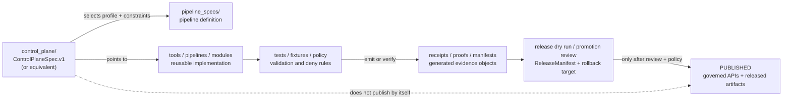

# KFM Control Plane

Governed automation, workflow-policy, and release-adjacent control specs for KFM — without making automation the source of truth.


Read first · [Scope](#scope) · [Repo fit](#repo-fit) · [Inputs](#accepted-inputs) · [Exclusions](#exclusions) · [Current contents](#current-contents) · [Operating model](#operating-model) · [Validation](#validation) · [Done](#definition-of-done) · [Rollback](#rollback) · [Appendix](#appendix)

---

## Read this first

> [!IMPORTANT]
> **Status:** `experimental` directory README / `draft` guidance  
> **Owner:** `@bartytime4life`  
> **Path:** `control_plane/README.md`  
> **Truth posture:** `CONFIRMED_PUBLIC_MAIN` directory presence and example JSON · `PROPOSED` directory contract · `UNKNOWN` active CI/platform enforcement  
> **Public posture:** cite-or-abstain; fail closed where evidence, rights, sensitivity, source terms, release state, secrets, or exposure posture are unresolved.

This directory is for declarative control-plane specs that tell KFM automation **how it is allowed to operate** across pull requests, main-branch runs, release certification, scheduled monitoring, and remediation planning.

It does **not** own KFM truth, policy semantics, source authority, evidence closure, release approval, or publication.

| This directory may coordinate | This directory must not become |
| --- | --- |
| Automation profiles, workflow-policy guardrails, generated-runbook/export intent, and release-adjacent control declarations. | Canonical evidence, policy authority, source registry authority, runtime truth, publication approval, or model output authority. |
| Safe automation defaults such as offline PR fixtures, local-only mutation, release certification requirements, and deny-by-default remote behavior. | A shortcut around validators, policy gates, EvidenceBundle resolution, review state, ReleaseManifest closure, or rollback records. |
| Thin orchestration contracts that point to pipeline specs, tools, tests, policies, and release checks. | Inline business logic that should live in validators, tools, schemas, policies, tests, or runbooks. |

### One-screen rule

`control_plane/` may define **how automation is constrained**. It must not decide **what is true**.

[Back to top ↑](#kfm-control-plane)

---

## Scope

`control_plane/` is KFM’s repository-facing automation-control surface.

Use it for small, reviewable, declarative files that bind pipeline specs, execution profiles, workflow restrictions, export intentions, and release-adjacent certification expectations.

This directory should make it easy to answer:

- Which pipeline or automation profile is allowed to run in a pull request, on `main`, during a release dry run, on a schedule, or during remediation?
- Which execution modes are offline, local-only, controlled-remote, plan-only, or release-certifying?
- Which workflow behaviors are forbidden by default?
- Which generated outputs are allowed as reports, runbooks, release checklists, or observability exports?
- Which claims remain `UNKNOWN` until schema validation, workflow YAML, branch protection, emitted artifacts, and platform settings are inspected?

> [!WARNING]
> A control-plane spec is not enforcement proof. Required checks, branch protection, workflow permissions, environment approvals, secrets, scheduled jobs, generated artifacts, and release gates must be verified from current repository and platform evidence before they are described as active controls.

[Back to top ↑](#kfm-control-plane)

---

## Repo fit

`control_plane/` sits beside the KFM trust system. It should point to the surfaces that own meaning, validation, policy, and release evidence instead of duplicating them.

| Relationship | Target path | Current status | Role |
| --- | --- | ---: | --- |
| Upstream landing | [`../README.md`](../README.md) | `NEEDS_RECHECK` | Root identity, trust path, and repo orientation. |
| GitHub routing | [`../.github/README.md`](../.github/README.md) | `NEEDS_RECHECK` | GitHub-native contribution, review, and workflow orchestration guidance. |
| Pipeline definitions | `../pipeline_specs/` | `NEEDS_RECHECK` | Pipeline stages and executable pipeline shape referenced by control specs. |
| Pipeline implementation | `../pipelines/`, `../tools/`, or repo-verified module paths | `NEEDS_RECHECK` | Implementation code and reusable validators invoked by automation. |
| Machine meaning | `../contracts/`, `../schemas/`, `../jsonschema/` | `CONFLICTED / NEEDS_RECHECK` | Contract/schema homes; do not duplicate schema authority here. |
| Policy gates | `../policy/`, `../policies/` | `CONFLICTED / NEEDS_RECHECK` | Policy semantics and tests; control specs may reference gates but do not own them. |
| Fixtures and tests | `../fixtures/`, `../tests/` | `NEEDS_RECHECK` | Offline fixtures, positive/negative cases, validator tests, and CI smoke checks. |
| Evidence lifecycle | `../data/`, `../release/` | `NEEDS_RECHECK` | Receipts, proofs, manifests, catalogs, release bundles, correction notices, and rollback references. |
| Documentation and ADRs | `../docs/`, `../docs/adr/` | `NEEDS_RECHECK` | Documentation control plane, schema-home decisions, runbooks, and verification backlog. |

### Boundary contract



`control_plane/` should keep public-output authority downstream of validation, policy, review, release, and rollback closure.

[Back to top ↑](#kfm-control-plane)

---

## Accepted inputs

Accepted inputs are small declarative files that constrain automation. They should be readable in a diff and safe to inspect without secrets.

| Input family | Belongs here when… | Must stay linked to… |
| --- | --- | --- |
| Control-plane specs | They bind a pipeline spec, execution profiles, workflow policy, export options, and release certification requirements. | Pipeline specs, validators, policies, fixtures, release docs, and runbooks. |
| Profile declarations | They define PR, main-branch, release, scheduled-monitor, or remediation posture. | Stage ranges, network profile, mutation profile, and policy gates. |
| Workflow-policy declarations | They express deny-by-default workflow constraints such as no hardcoded secrets, no unpinned actions, no unsafe triggers, and no remote mutation by default. | GitHub workflow YAML, policy tests, platform settings, and security review. |
| Export declarations | They state which generated artifacts are allowed, such as local scripts, operator runbooks, release checklists, observability manifests, or provenance reports. | Generated-artifact rules, release dry-run checks, and artifact-retention policy. |
| Safe examples | They demonstrate expected shape without credentials, private endpoints, sensitive locations, or unverified publication claims. | Schemas, fixtures, and validation notes. |

### Preferred file qualities

A good control-plane file is:

- declarative, not procedural;
- small enough to audit in one review pass;
- explicit about execution mode, network posture, mutation posture, and release posture;
- free of secrets, credentials, private endpoints, and sensitive source details;
- validated by schema, policy, and negative-path tests;
- linked to rollback behavior.

[Back to top ↑](#kfm-control-plane)

---

## Exclusions

| Do not put here | Put it here instead | Why |
| --- | --- | --- |
| Canonical evidence, EvidenceBundles, proof packs, receipts, catalogs, or release manifests | `../data/`, `../release/`, or repo-verified evidence homes | Control specs may require these objects; they do not own them. |
| Pipeline implementation code | `../tools/`, `../pipelines/`, `../packages/`, or repo-verified module paths | Implementation must be locally runnable, testable, and reusable outside GitHub automation. |
| Pipeline stage definitions | `../pipeline_specs/` | Stage shape and control profile are separate concerns. |
| Policy semantics or Rego/policy bodies | `../policy/`, `../policies/`, or repo-verified policy home | Control specs may reference policy gates; they do not define policy truth. |
| JSON Schema / contract definitions | `../schemas/`, `../contracts/`, `../jsonschema/`, pending ADR | Avoid parallel schema authority. |
| Credentials, tokens, private endpoints, model keys, remote write permissions, or deployment secrets | Never commit; use approved secret-management and platform settings | Secrets do not belong in docs, specs, fixtures, prompts, screenshots, or examples. |
| Public release decisions | `../release/` plus review and promotion records | Publication is a governed state transition, not a control-plane file move. |
| RAW, WORK, QUARANTINE, or unpublished candidate material | Governed lifecycle storage only | Public clients and ordinary automation must not bypass the trust membrane. |
| Generated automation bundles | Generated-artifact output directories with receipts and cleanup rules | Generated files must not masquerade as source authority. |

> [!CAUTION]
> If a control-plane file would cause remote mutation, public exposure, release promotion, live source activation, or model-runtime access, the default posture is `DENY` until the policy, test, owner, platform, and rollback evidence is current.

[Back to top ↑](#kfm-control-plane)

---

## Current contents

As of authoring, the public `main` branch surface for this directory is minimal.

```text
control_plane/
├── README.md
└── soilgrids_control_plane_example.json
```

| File | Status | What it appears to do | Do not infer |
| --- | --- | --- | --- |
| `README.md` | `TARGET_FILE` | Directory landing page. | That current guidance was already populated before this draft. |
| `soilgrids_control_plane_example.json` | `CONFIRMED_PUBLIC_MAIN / NEEDS_RECHECK` | Example `ControlPlaneSpec.v1`-style JSON for a SoilGrids governed control plane. | That all referenced modules, pipeline specs, workflows, generated exports, or release checks are active. |

### Existing example: review points

The existing SoilGrids example should be reviewed as a useful control-plane signal, not as proof of complete enforcement.

| Area | Example signal | Review expectation |
| --- | --- | --- |
| Schema marker | `schema: ControlPlaneSpec.v1` | Confirm schema home and validator. |
| Pipeline binding | `pipeline_spec_path`, `orchestrator_module`, `run_root` | Confirm referenced files exist and are owned by the right surfaces. |
| Profiles | `pull_request`, `main_branch`, `release`, `scheduled_monitor`, `remediation` | Confirm profile names, stage ranges, network/mutation rules, and release requirements. |
| Workflow policy | permissions and forbidden behaviors | Confirm CI/platform enforcement and policy tests. |
| Exports | GitHub Actions, local scripts, operator runbook, release checklist, observability, SLSA-style outputs | Confirm generated outputs are non-authoritative unless release/proof closure exists. |

[Back to top ↑](#kfm-control-plane)

---

## Operating model

`control_plane/` should encode KFM’s automation posture as finite, reviewable choices.

### Execution profiles

| Profile type | Default posture | Release implication |
| --- | --- | --- |
| Pull request | Offline fixture / local-only / smoke validation | No publication; no remote mutation; no live-source dependency. |
| Main branch | Local or controlled execution after checks | Still not publication by itself. |
| Release | Certification mode with reproducibility, evidence, registry, proof, and rollback checks | May support promotion review, but does not replace promotion. |
| Scheduled monitor | Disabled or controlled-remote by explicit policy | Must not silently activate remote source writes or publication. |
| Remediation | Plan-only by default | Human review required before consequential action. |

### Workflow-policy minimums

A control-plane spec should fail validation when it permits or omits unsafe workflow behavior.

| Control | Expected default |
| --- | --- |
| `pull_request_target` usage | Forbidden unless a security ADR explicitly authorizes a constrained exception. |
| Hardcoded secrets | Forbidden. |
| Package installation in CI | Forbidden or tightly constrained until package-manager and lockfile rules are verified. |
| Unpinned third-party actions | Forbidden. |
| Remote mutation | Forbidden by default. |
| Timeout | Required. |
| Concurrency group | Required for long-running or release-adjacent workflows. |
| Permissions | Least privilege; read-only where possible. |

### Control-plane outcomes

Use finite outcomes for automation review.

| Outcome | Meaning |
| --- | --- |
| `ALLOW_DRY_RUN` | Spec may run offline or local validation only. |
| `ALLOW_CERTIFICATION_CHECK` | Spec may support release-readiness review without publishing. |
| `DENY` | Spec violates policy, safety, sensitivity, rights, or platform boundaries. |
| `ABSTAIN` | Required evidence is missing, unresolved, or not inspectable. |
| `ERROR` | Validation failed due to technical or environmental failure. |

[Back to top ↑](#kfm-control-plane)

---

## Validation

Validation commands must be reconciled with the actual repo’s accepted tooling before being treated as required.

### Minimal local sanity check

```bash
# Safe JSON syntax check only. Confirm repo tooling before making this mandatory.
python -m json.tool control_plane/soilgrids_control_plane_example.json >/dev/null
```

### Required validation surfaces

- [ ] Control-plane spec parses and validates against the accepted schema.
- [ ] Referenced `pipeline_spec_path` exists and validates.
- [ ] Referenced orchestrator or module path exists, or the spec is marked `NEEDS_VERIFICATION`.
- [ ] Profiles use known execution modes, network profiles, mutation profiles, and stage ranges.
- [ ] PR profile is offline-fixture or equivalent no-network smoke mode.
- [ ] Release profile requires reproducibility, evidence crate or EvidenceBundle closure, registry/catolog support, proof objects, and rollback target where applicable.
- [ ] Scheduled profiles cannot activate remote network or mutation without explicit policy and owner review.
- [ ] Remediation profile defaults to plan-only.
- [ ] Workflow policy forbids unsafe triggers, hardcoded secrets, unpinned actions, remote mutation by default, and over-broad permissions.
- [ ] Generated exports are marked as derived artifacts and cannot become publication proof by themselves.
- [ ] Negative fixtures cover missing evidence, unknown source role, unclear rights, unsafe network posture, remote mutation, missing timeout, missing concurrency, and missing rollback reference.

### Platform checks

The following cannot be proven by files alone:

- branch protection;
- required checks;
- workflow permissions;
- environment approval rules;
- repository secrets posture;
- scheduled workflow activation;
- code-owner enforcement;
- artifact retention;
- deployment settings.

Record current platform evidence before describing any of these as active controls.

[Back to top ↑](#kfm-control-plane)

---

## Definition of Done

A control-plane change is not done until it remains reviewable, testable, and subordinate to KFM evidence governance.

- [ ] Purpose and affected pipeline are stated.
- [ ] Owner or steward is verified, or clearly marked `OWNER_TBD`.
- [ ] Schema and validator home is verified, or clearly marked `NEEDS_VERIFICATION`.
- [ ] Referenced pipeline spec, tools, policies, fixtures, release docs, and generated-artifact destinations are checked.
- [ ] No secrets, private endpoints, sensitive locations, private credentials, or uncontrolled remote writes are present.
- [ ] PR/main/release/scheduled/remediation profiles have explicit network and mutation posture.
- [ ] Release-adjacent profiles require proof, review, rollback, and evidence closure.
- [ ] Negative-path tests fail closed.
- [ ] Documentation changed when behavior changed, or the reason it did not is recorded.
- [ ] Rollback target is documented.

[Back to top ↑](#kfm-control-plane)

---

## Rollback

Rollback is required when a control-plane change weakens source integrity, grants unsafe automation, bypasses policy gates, permits remote mutation, creates release ambiguity, exposes secrets, or makes generated artifacts look authoritative.

| Event | Required response |
| --- | --- |
| Bad profile added | Revert spec change; disable generated workflow if present; record validation failure. |
| Unsafe workflow permission | Remove permission; rerun policy tests; document platform-state recheck. |
| Remote mutation enabled by mistake | Disable schedule/workflow; quarantine affected run outputs; preserve receipts and correction notes. |
| Release certification mismatch | Block promotion; preserve failed certification envelope and rollback target. |
| Generated automation drift | Invalidate generated files; regenerate only after spec and tool validation. |
| Schema-home conflict | Pause new machine-file expansion; resolve by ADR; avoid parallel definitions. |

Rollback target: `ROLLBACK_TARGET_TBD_AFTER_REPO_INSPECTION`

[Back to top ↑](#kfm-control-plane)

---

## Open verification backlog

- [ ] Confirm whether `ControlPlaneSpec.v1` has a canonical schema and where it lives.
- [ ] Confirm whether `contracts/`, `schemas/`, or `jsonschema/` owns machine-checkable control-plane schemas.
- [ ] Confirm whether `policy/` or `policies/` owns control-plane policy semantics.
- [ ] Confirm owner-of-record through CODEOWNERS or a project-owned stewardship registry.
- [ ] Confirm package manager and sanctioned local validation commands.
- [ ] Confirm CI workflow names, triggers, permissions, and required checks.
- [ ] Confirm branch protection, environment approvals, secret posture, and scheduled workflow state.
- [ ] Confirm generated automation output homes and cleanup rules.
- [ ] Confirm release certification envelope, proof-pack, catalog, and rollback artifact names.
- [ ] Confirm whether SoilGrids control-plane material should remain under `control_plane/` or move into a domain-specific lane after a schema-home ADR.

[Back to top ↑](#kfm-control-plane)

---

## Appendix

### Placeholder register

| Placeholder | Why it remains |
| --- | --- |
| `OWNER_TBD` | Use only if ownership cannot be confirmed from CODEOWNERS or a project-owned registry. |
| `NEEDS_VERIFICATION` | Required where schema home, policy engine, workflows, platform settings, or runtime behavior are not proven. |
| `ROLLBACK_TARGET_TBD_AFTER_REPO_INSPECTION` | Exact rollback target depends on repo release and generated-artifact conventions. |
| `kfm://doc/NEEDS-VERIFICATION` | Use until the document registry confirms stable KFM document IDs. |

### Glossary

| Term | Working meaning |
| --- | --- |
| Control plane | Declarative constraints and routing for automation; not evidence, policy truth, or publication authority. |
| Execution profile | A named automation posture such as pull request, main branch, release, scheduled monitor, or remediation. |
| Network profile | Whether a run is offline, local-only, controlled-remote, or otherwise constrained. |
| Mutation profile | Whether a run can write locally, write remotely, or only plan changes. |
| Release certification | A release-readiness check that may support promotion review but does not itself publish. |
| Generated export | A derivative artifact created from a spec; not authoritative unless admitted by proof/release gates. |
| Fail closed | Deny, abstain, quarantine, or stage access when evidence, policy, rights, sensitivity, or release state is unresolved. |

### README pre-commit check

- [ ] Exactly one H1.
- [ ] Impact block includes status, owner, path, badges, and quick links.
- [ ] Repo fit, accepted inputs, and exclusions are present.
- [ ] Relative links are valid from `control_plane/` or marked `NEEDS_RECHECK`.
- [ ] Mermaid diagram reflects responsibility boundaries and does not imply active implementation.
- [ ] No fake CI, release, coverage, license, security, platform, or deployment claim appears.
- [ ] Examples do not contain secrets, credentials, private endpoints, or sensitive locations.
- [ ] Unknown implementation remains `UNKNOWN`, `PROPOSED`, or `NEEDS_VERIFICATION`.
- [ ] Control-plane authority stays subordinate to evidence, policy, review, release, and rollback.

[Back to top ↑](#kfm-control-plane)
