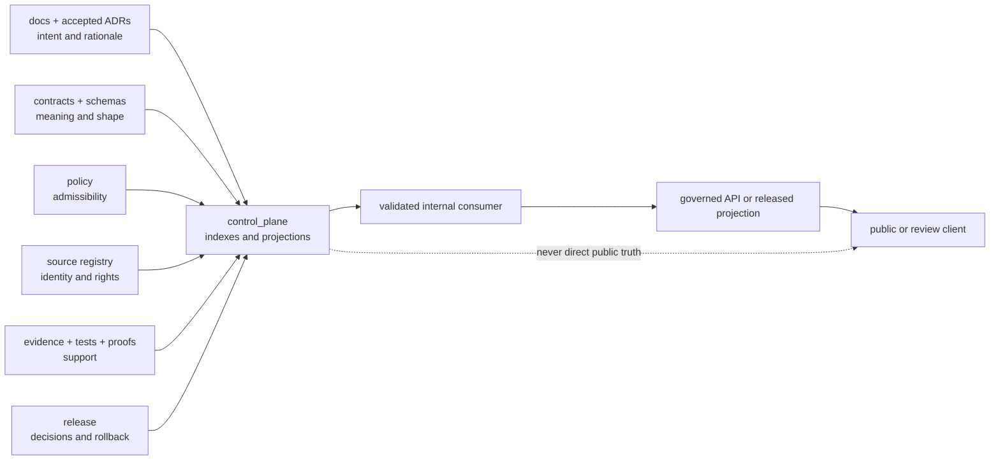
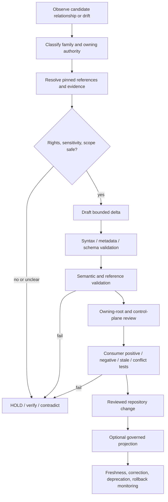

<!-- [KFM_META_BLOCK_V2]
doc_id: kfm://doc/control-plane-readme
title: control_plane/ — Machine-Readable Governance Index Root
version: v0.7
type: README
status: "draft; repository-grounded; canonical-root-confirmed; directory-rules-v2-adopted; required-register-packet-enforced; mixed-validation-profiles; register-population-partial; specialized-projections-present; non-authoritative"
owners: "OWNER_TBD — Control-plane steward · Register steward · Architecture steward · Docs steward · affected authority-root owners · Validation/CI steward; CODEOWNERS routes /control_plane/ to @bartytime4life"
created: 2026-06-24
updated: 2026-09-06
supersedes: v0.6 control-plane root README at the same path
prepared_under_prompt: KFM Repository Build-Out & Markdown Modernization Implementation Agent v6.0.0
policy_label: "repository-facing; control-plane; machine-registers; authority-index; no-parallel-authority; no-direct-public-path; cite-or-abstain; correction-aware; rollback-aware"
current_path: control_plane/README.md
owning_root: control_plane/
responsibility: document the machine-readable governance projection root its authority boundary current bounded inventory validation profiles correction controls and no-direct-public-path posture without creating or changing indexed authority
truth_posture: CONFIRMED existing control-plane root stable identity accepted ADR-0006 ADR-0007 and ADR-0029 adopted Directory Rules v2 required register packet split validation profiles pinned MRTS-01 snapshot pinned M01 program baseline current direct-child inventory including the topology-correction projection dedicated workflows current-main validation readback CODEOWNERS routing and Makefile entrypoints / PROPOSED maturity vocabulary semantic closure consumer admission and incomplete-family closure order / UNKNOWN external consumers branch-protection enforcement production behavior and public effects / NEEDS VERIFICATION accountable owners independent review field-level schemas full population reference closure correction propagation and retirement drills
evidence_snapshot:
  repository: bartytime4life/Kansas-Frontier-Matrix
  repository_id: "1059091169"
  visibility: public
  base_ref: main
  base_commit: 1e69410cfd871e1ec004eedcd23f845eff435137
  prior_blob: 51026faa37b2ebe940472e1d513a25cd0832c692
  directory_rules_blob: fd49a0b83e55cef52c1124281f093e263526898d
  directory_rules_sha256: sha256:44f7e94344cb42b630008eb0bc03a13fcb97dbdfba6f3e56579693a272571e6e
  adr_0029_blob: a4de0d7a96b78da59cfc499d1025e1508afd8dd9
  register_meta_contract_test_blob: 83e74c1c657d06f9c7b4bd256419a8aa8868d173
  docs_control_plane_workflow_blob: ed0d3b50a12931b67cad005cd99433924c829fa3
  object_family_workflow_blob: d33526513b9dff1943333ebbb2a3e4c6b4263409
  root_registry_blob: 024f668b5f0a9239bafa4f8b09e2afd86300ff8c
  path_alias_register_blob: 6ad6840bd47eb8b176d03f9e946c16453fc4caee
  domain_lane_register_blob: 1bfc6f91cfa713a5e3d51ece011b63b46310734f
  object_family_register_blob: 03bba0769738d29bbc4c9481ba34c6c7b8366941
  cross_domain_seam_register_blob: dc87ea9c2ab11cc10e51cf4e8284c030e7c9ab29
  required_registers: "9"
  required_meta_profile_registers: "8"
  required_schema_profile_registers: "1"
  required_registers_with_entries: "3"
  required_registers_empty: "6"
  direct_child_entries: "29"
  direct_child_files: "27"
  direct_child_directories: "2"
  repository_topology_correction_register_blob: b48e8df74a2b9d8c2599ce256ef5156687b98dbf
  repository_governance_parity_blob: 06214b4c66164a82c614a02dd2a0632465ac6cd6
  repository_governance_parity_workflow_blob: 37189a82d3ed78800318847384ea931e87561696
  control_plane_registry_packet_workflow_blob: 095f644f739a555ea7e30530048f8270c81b7712
  validator_suite_workflow_blob: 4241e6e17582232777ea5f93a188fb80d30b17ad
  current_validation_runs: "docs-control-plane=34015364349 PASS; control-plane-registry-packet=34015364270 PASS; object-family-register=34015364272 PASS; trust-spine-baseline=34015364322 PASS; validator-suite=34015364283 FAIL; repository-governance-parity=34015364324 FAIL; program-baseline=34015364273 FAIL; schema-validation=34015364300 FAIL"
related:
  - ../README.md
  - ../docs/doctrine/directory-rules.md
  - ../docs/adr/ADR-0029-adopt-directory-governance-standard-v2.md
  - ../docs/registers/DOCUMENT_REGISTRY.md
  - ../docs/registers/DRIFT_REGISTER.md
  - ../docs/registers/VERIFICATION_BACKLOG.md
  - ../contracts/README.md
  - ../schemas/README.md
  - ../policy/README.md
  - ../tests/README.md
  - ../tools/validators/README.md
  - ../data/README.md
  - ../release/README.md
  - ../.github/CODEOWNERS
  - ../.github/workflows/docs-control-plane.yml
  - ../.github/workflows/object-family-register.yml
  - ../.github/workflows/directory-root-registry.yml
  - ../.github/workflows/path-alias-register.yml
  - ../.github/workflows/domain-lane-register.yml
  - ../.github/workflows/cross-domain-seam-register.yml
  - ../.github/workflows/trust-spine-baseline.yml
  - ../.github/workflows/program-baseline.yml
  - ../.github/workflows/control-plane-registry-packet.yml
  - ../.github/workflows/repository-governance-parity.yml
  - ../.github/workflows/validator-suite.yml
  - ../Makefile
  - program_baseline.json
  - trust_spine_baseline.yaml
  - domains/README.md
  - registers/README.md
tags: [kfm, control-plane, machine-registers, governance-index, crosswalks, authority, directory-rules-v2, drift, verification, deprecation, policy-gates, release-state, validation, correction, rollback]
notes:
  - "v0.7 repins the same-path README to current main, reconciles the direct-child map, records the topology-correction projection, and adds named current-main validation outcomes without changing authority."
  - "The first twelve H2 sections implement the adopted Directory Rules v2 ROOT_FULL field order."
  - "A validation pass proves only the boundary exercised by that validator."
  - "This README does not populate or activate a register, create authority, amend an ADR, approve policy, change release state, promote lifecycle data, expose a public route, or publish."
[/KFM_META_BLOCK_V2] -->

<a id="top"></a>

# `control_plane/` — Machine-Readable Governance Index Root

[](#status)
[](#related-folders-adrs-migrations-and-aliases)
[](#current-bounded-inventory)
[](#register-population-and-maturity)
[](#validation)
[](#public-exposure-and-sensitivity-posture)
[](#register-rules-and-failure-controls)

> **One-line purpose.** `control_plane/` stores validated machine-readable indexes, crosswalks, and governance projections that answer **what governs what** without becoming the contract, schema, policy, source, evidence, lifecycle, release, runtime, or public authority being indexed.

**Quick navigation:** [Purpose](#purpose) · [Authority](#authority-level) · [Status](#status) · [Belongs](#what-belongs-here) · [Inputs/outputs](#inputs-outputs-and-permitted-writers) · [Exposure](#public-exposure-and-sensitivity-posture) · [Storage](#mutability-retention-generation-and-physical-storage) · [Validation](#validation) · [Review](#review-burden-and-escalation) · [ADRs](#related-folders-adrs-migrations-and-aliases) · [Map](#direct-child-directory-map) · [Last reviewed](#last-reviewed) · [Inventory](#current-bounded-inventory) · [Maturity](#register-population-and-maturity) · [Profiles](#required-register-validation-profiles) · [Guardrails](#register-rules-and-failure-controls) · [Rollback](#correction-deprecation-and-rollback) · [Evidence](#evidence-ledger) · [Summary](#status-summary)

> [!IMPORTANT]
> **A register indexes authority; it does not manufacture authority.** A path, identifier, digest, status, schema pass, receipt, workflow result, or merged pull request cannot promote an entry into truth, policy, review, release, or publication authority.

> [!WARNING]
> **Validation is real but profile-specific.** Root YAML parsing, legacy metadata checks, dedicated register schemas, fixture polarity, path closure, and generated-receipt checks are separate boundaries. A green check must be described by the exact checks it ran.

> [!CAUTION]
> **No ordinary public client reads this root directly.** Public and semi-public surfaces consume governed APIs and released, policy-allowed projections. Direct raw-register consumption would bypass the trust membrane.

---

## Purpose

`control_plane/` is KFM's canonical responsibility root for machine-readable governance maps, indexes, crosswalks, compatibility projections, and bounded readiness records.

It supports questions such as:

- Which adopted document, ADR, contract, schema, policy, source, domain lane, test, release record, correction record, or compatibility mapping governs a named object or path?
- Which relationships are active, proposed, held, contradicted, stale, deprecated, or awaiting verification?
- Which root owns the actual meaning, shape, admissibility, evidence, lifecycle state, release decision, or implementation behind an index entry?
- Which validator and consumer may rely on a projection, and at what verified maturity?

The root improves inspectability and coordination. It does not create domain truth, approve policy, activate sources, execute release authority, or expose a normal public interface.

[Back to top](#top)

---

<a id="authority-boundary"></a>

## Authority level

| Surface | Authority posture |
|---|---|
| `control_plane/` root | **Canonical responsibility root** for machine-readable governance projections and indexes under adopted Directory Rules v2. |
| Register or matrix path | A repository surface whose authority is bounded by its governing contract, schema, decision, evidence, and review. |
| Register entry | Referential or readiness claim only; it cannot redefine the owning artifact. |
| Human explanation | Owned by `docs/`, including `docs/registers/`; machine projections do not replace rationale or decision history. |
| Object meaning | Owned by `contracts/`. |
| Machine shape | Owned by `schemas/`. |
| Admissibility and sensitivity | Owned by `policy/` and applied `PolicyDecision` records. |
| Source identity, rights, and activation | Owned by the source registry and source-admission surfaces. |
| Evidence and proof | Owned by evidence/proof families. |
| Release, correction, withdrawal, rollback | Owned by `release/`. |
| Runtime and public response | Owned by governed applications and released artifacts. |

Authority is referential here. When a reference does not resolve, is stale, or conflicts with its owning authority, the entry is incomplete and consumers fail closed.

[Back to top](#top)

---

<a id="status-notes"></a>

## Status

| Finding | Truth status | Current bounded result |
|---|---:|---|
| Root and README | `CONFIRMED` | Existing same-path root README with stable `kfm://doc/control-plane-readme` identity; current main readback is `main@1e69410cfd871e1ec004eedcd23f845eff435137`. |
| Placement authority | `CONFIRMED / ACCEPTED` | ADR-0029 adopts exact Directory Rules v2 bytes and makes `docs/doctrine/directory-rules.md` the writable human placement authority. |
| Required register packet | `CONFIRMED` | Nine files are required: eight legacy metadata-profile files and one schema-governed object-family register. |
| Required register population | `CONFIRMED BOUNDED` | Three required registers are nonempty; six remain empty. |
| Dedicated projection profiles | `CONFIRMED` | Root, path-alias, domain-lane, cross-domain-seam, object-family, and trust-spine baseline projections have dedicated validation surfaces. |
| Supplemental matrices and watcher registry | `CONFIRMED / BOUNDED` | Present, mostly `PROPOSED_INACTIVE`, documented-only, or unresolved; no activation or release is implied. |
| Topology-correction projection | `CONFIRMED BOUNDED` | One proposed consume-once transition is present; its decision record has no accepted commit, and the projection cannot suppress live findings or authorize edits. |
| Current-main validation | `CONFIRMED BOUNDED` | Named profiles pass or fail as recorded below; no result creates authority, waives topology, or establishes release/publication readiness. |
| Repository-control projection | `STALE / PROJECTION ONLY` | `repository_control_state.yaml` records an older observation and cannot authorize or prohibit this current scoped change. |
| Review routing | `CONFIRMED ROUTING` | CODEOWNERS routes `/control_plane/` to `@bartytime4life`; independent enforcement remains `NEEDS VERIFICATION`. |
| Direct public use | `DENY` | Raw registers are not normal public truth surfaces. |

### Current tensions

1. **Required root packet versus optional `registers/` sublane.** Existing root files remain canonical until a reviewed migration proves consumer closure.
2. **Mixed profiles.** YAML metadata files, schema-governed JSON-shaped content, direct JSON matrices, and nested Markdown lanes do not share one validation contract.
3. **Sparse versus authoritative wording.** A canonical path can still be incomplete, proposed, stale, or consumer-unready.
4. **Historical projections.** A machine projection tied to an older observation is evidence about that observation, not current repository authority.
5. **Current validation is mixed.** The control-plane packet, object-family, and trust-spine profiles pass their named current-main runs; validator-suite, governance parity, M01 program baseline, and schema validation remain failed for bounded, separate reasons.

[Back to top](#top)

---

<a id="accepted-material"></a>
<a id="what-belongs-here"></a>

## What belongs here and what is prohibited

### What belongs here

| Material | Required posture |
|---|---|
| Governance projection or index | Stable identity, owning authority reference, status, review date, non-effects, and bounded consumer scope. |
| Root, path-alias, object-family, domain-lane, and cross-domain seam projections | Schema/contract/validator/tests appropriate to the claim strength. |
| Verification, contradiction, deprecation, and drift indexes | Evidence, owner, resolution path, correction state, and rollback where material. |
| Readiness matrices | Explicit inactive/held state, reason codes, no-self-activation, and no-publication boundaries. |
| Watcher registry | Candidate specifications and activation posture; watchers remain non-publishers. |
| README and lane profiles | Explain local authority, permitted writers, validation, public-path denial, correction, and review triggers. |

An entry should remain small and referential. It should identify the owning root and evidence rather than copy the authoritative object into the register.

<a id="exclusions"></a>
<a id="what-does-not-belong-here"></a>

### What does not belong here

| Prohibited content or decision | Correct authority or action |
|---|---|
| Human doctrine, architecture, runbooks, narrative registers | `docs/` |
| Semantic contract meaning | `contracts/` |
| JSON Schema or other machine-shape authority | `schemas/` |
| OPA/Rego or other admissibility logic | `policy/` |
| `SourceDescriptor` instances or source payloads | Source registry and correct `data/` lifecycle lane |
| `EvidenceBundle`, ProofPack, citation-validation output | Evidence/proof lanes |
| RAW, WORK, QUARANTINE, PROCESSED, CATALOG/TRIPLET, PUBLISHED payloads | Correct `data/` phase |
| `ReleaseManifest`, `PromotionDecision`, `CorrectionNotice`, `RollbackCard` | `release/` |
| Executable validators, builders, generators, migrations | `tools/`, `pipelines/`, `scripts/`, or `migrations/` by responsibility |
| Fixtures and tests | `fixtures/` and `tests/` |
| API handlers, UI components, runtime adapters | `apps/`, `packages/`, or `runtime/` |
| Credentials, secrets, restricted details, hidden reasoning | Never commit; use incident/quarantine procedures |
| Direct public response or map configuration | Governed API and released public-safe artifacts |

Do not copy an authority object into a register merely for convenient lookup. Link to its canonical home and preserve stable identity.

[Back to top](#top)

---

## Inputs, outputs, and permitted writers

### Inputs

Admissible inputs include pinned repository paths and digests, accepted doctrine and ADRs, contracts and schemas, policy bundles and tests, source descriptors and rights records, evidence/proof/release records, observed workflow/test/runtime evidence tied to a revision, and steward-reviewed classification decisions.

Before admission, resolve:

1. register or matrix family and stable identity;
2. owning authority root;
3. evidence and revision supporting the claim;
4. status, review, and freshness;
5. rights, sensitivity, and exposure implications;
6. declared consumer scope;
7. correction, deprecation, and rollback needs.

Generated discovery may propose a delta. It cannot approve itself.

### Outputs

This root may support validated projections, authority crosswalks, domain/seam maps, compatibility aliases, readiness records, deterministic validation logs, internal lookup inputs, and paired human-review references.

It must not claim domain truth, policy allow/deny, lifecycle promotion, release, correction, rollback, public API output, public map output, or `PUBLISHED` state.

### Permitted writers

- repository authors with branch-write authority may propose feature-branch changes;
- CODEOWNERS routes review to `@bartytime4life`;
- governing roots and affected consumers must participate when a projection changes their relationship;
- generated receipts and CI results are evidence, not approval;
- no watcher, matrix, register, or stale authorization projection may authorize its own write.

[Back to top](#top)

---

## Public exposure and sensitivity posture

| Concern | Required behavior |
|---|---|
| Ordinary public client | Reads governed API or released projection, never raw control-plane files as truth. |
| Sensitive relationship | Minimize or withhold reconstructive details; apply the most restrictive applicable policy before projection. |
| Unknown rights or source role | `HOLD`, `ABSTAIN`, or `DENY` according to the consumer contract. |
| Living-person, DNA, rare-species, archaeology, infrastructure, land/title precision | Fail closed until qualified policy/steward evidence supports a bounded projection. |
| Public repository visibility | Does not make an internal governance projection public-safe or authoritative. |
| Error disclosure | Public surfaces show bounded failure states without leaking protected reasons or internal paths. |

No field should be added merely because it is useful to an internal reviewer if it would create harmful precision or a new reconstructive path.

[Back to top](#top)

---

## Mutability, retention, generation, and physical storage

| Property | Root contract |
|---|---|
| Mutability | Versioned repository changes through reviewed branches. Append-only semantics apply where a register records decisions or lineage. |
| Retention | Durable for adopted governance projections and audit-relevant lineage; temporary discovery outputs do not become durable authority automatically. |
| Generation | Generated projections declare source, generator/version, digest, edit policy, and reproducible command. Hand editing a generated mirror is denied. |
| Physical storage | Tracked text lives in Git; large/runtime payloads remain outside this root. Logical authority does not move when physical bytes use another approved store. |
| Compatibility | Dual-read/single-write only when an accepted decision and verified consumers require it. |
| Retirement | Requires replacement, consumer inventory, sunset/exit criteria, correction history, and rollback—not silent deletion. |

`control_plane/` is not a cache, scratch area, artifact store, runtime database, or release store.

[Back to top](#top)

---

<a id="validation-checklist"></a>

## Validation

Validation is layered; each result proves only its named boundary.

### Implemented and observed validation surfaces

| Profile | Command or workflow | Proves | Does not prove |
|---|---|---|---|
| Direct root YAML syntax | `docs-control-plane` → `validate-control-plane-yaml` | Direct `control_plane/*.yaml` parses with unique mapping keys and mapping root. | JSON files, nested YAML, field semantics, reference closure. |
| Legacy required-register metadata | `python -m pytest tests/policy/test_control_plane_register_meta_contract.py -q --strict-config --strict-markers` | Eight legacy files have required metadata, review date, owner, doctrine paths, and `entries`. | Nonempty population, entry shape, semantic agreement. |
| Object-family register | `object-family-register` workflow | Schema shape, fixtures, path existence, maturity classification, generated-receipt binding. | Object-family authority, runtime deployment, release. |
| Trust-spine baseline | `make trust-spine-baseline` / `trust-spine-baseline` workflow | Pinned base, authority inventory, path/digest binding, reconciled counts and execution states, fixture polarity, and receipt integrity. | New authority, ADR acceptance, drift waiver, source activation, policy approval, release, deployment, promotion, or publication. |
| M01 program baseline | `make program-baseline` / `program-baseline` workflow | Pinned authority and owner bytes, exact issue/PR overlap, Drive-lineage non-authority, honest failure states, fixture polarity, and receipt integrity. | Issue mutation, tracker truth, human review, settings enforcement, source admission, drift waiver, release, deployment, promotion, or publication. |
| Root registry | `directory-root-registry` workflow | Adopted-doctrine digest binding, root-class invariants, ordering, top-level coverage. | Root creation, activation, migration, write permission. |
| Path alias register | `path-alias-register` workflow | Alias shape and compatibility invariants. | Consumer closure, tombstoning, deletion authority. |
| Domain lane register | `domain-lane-register` workflow | Lane identity and placement projection. | Steward assignment, source activation, domain readiness. |
| Cross-domain seam register | `cross-domain-seam-register` workflow | Seam shape and fail-closed cross-context posture. | Join authorization or public release. |
| Boundary aggregate | `make boundary-guards` | Required-register test plus API/renderer/connector boundary tests. | Full repository validation or publication readiness. |
| General schema/contract baseline | `make validate` | Configured aggregate validators and schema/contract tests. | Every control-plane profile or consumer. |

### Current exact-head readback — `main@1e69410cfd871e1ec004eedcd23f845eff435137`

These are current GitHub Actions observations for the pinned main commit, not a claim that the repository is globally green.

| Surface | Run | Result | Bounded observation |
|---|---:|---|---|
| [`docs-control-plane`](https://github.com/bartytime4life/Kansas-Frontier-Matrix/actions/runs/34015364349) | 34015364349 | `PASS` | `validate-control-plane-yaml`, `registers-schema`, and `adr-index-coherence` passed. |
| [`control-plane-registry-packet`](https://github.com/bartytime4life/Kansas-Frontier-Matrix/actions/runs/34015364270) | 34015364270 | `PASS` | The required control-plane packet profile passed. |
| [`object-family-register`](https://github.com/bartytime4life/Kansas-Frontier-Matrix/actions/runs/34015364272) | 34015364272 | `PASS` | The dedicated object-family profile passed; this does not resolve the projection's 11 conflicted required families. |
| [`trust-spine-baseline`](https://github.com/bartytime4life/Kansas-Frontier-Matrix/actions/runs/34015364322) | 34015364322 | `PASS` | The pinned trust-spine profile passed its named checks. |
| [`validator-suite`](https://github.com/bartytime4life/Kansas-Frontier-Matrix/actions/runs/34015364283) | 34015364283 | `FAIL` | Topology reported 0 invariant violations, 5 new-drift findings, 122 baselined warnings, and 5 stale fingerprints; the aggregate remains failed. |
| [`repository-governance-parity`](https://github.com/bartytime4life/Kansas-Frontier-Matrix/actions/runs/34015364324) | 34015364324 | `FAIL` | Expected-topology parity mismatched current evidence; the lane-cache regression also failed. |
| [`program-baseline`](https://github.com/bartytime4life/Kansas-Frontier-Matrix/actions/runs/34015364273) | 34015364273 | `FAIL` | `GENERATED_RECEIPT_INVALID` reports `ARTIFACT_DIGEST_MISMATCH` at `/artifact_paths/1`; the projection validator itself returned no findings. |
| [`schema-validation`](https://github.com/bartytime4life/Kansas-Frontier-Matrix/actions/runs/34015364300) | 34015364300 | `FAIL` | After schema parsing, the aggregate suite hit `SyntaxError: expected ':'` in `tests/validators/test_validator_orchestrator.py:307`. |

### Required review checks

- [ ] The target file is the correct projection family and does not create parallel authority.
- [ ] Governing references resolve at the pinned revision.
- [ ] Status, owner, review date, evidence, freshness, and non-effects are explicit.
- [ ] Rights, sensitivity, and public-path implications are bounded.
- [ ] Empty, stale, conflicting, denied, and malformed states fail closed.
- [ ] Human counterpart and consumer documentation are updated where material.
- [ ] Positive and negative fixtures cover the behavior actually consumed.
- [ ] Correction, deprecation, compatibility, and rollback are explicit.
- [ ] Workflow and README claims do not exceed observed checks.

### Known validation gaps

- no single recursive validator covers all YAML, JSON, and nested lanes;
- six required register bodies remain empty;
- field-level schemas and semantic validators are uneven across families;
- no general cross-register path/ID/digest resolver is established;
- no general human-versus-machine drift comparator is established;
- consumer inventory, stale-cache behavior, correction propagation, and current expected-topology parity remain incomplete;
- the M01 program-baseline receipt currently has an artifact digest mismatch;
- the aggregate schema/fixture lane currently has a validator-test syntax error.

[Back to top](#top)

---

## Review burden and escalation

CODEOWNERS review routing is not stewardship assignment, independent approval, policy permission, release authority, or proof that review occurred.

| Change | Minimum review burden |
|---|---|
| README-only factual correction | Docs/control-plane reviewer; verify authority language and stable links. |
| Register metadata or inventory | Control-plane reviewer and owning-root reviewer. |
| Contract/schema/object-family crosswalk | Contract/schema owners and affected consumer. |
| Source-authority entry | Source, rights/sensitivity, and affected domain reviewers. |
| Policy-gate or release-state map | Policy or release/correction/rollback reviewer; map cannot approve the decision. |
| Sensitive seam | Domain and sensitivity reviewers; default hold. |
| Consumer-readiness claim | Consumer owner plus validation/CI reviewer with positive and negative evidence. |
| Structural move | Directory Rules review, accepted ADR when triggered, migration manifest, and rollback. |

Escalate unresolved authority to the owning root or ADR process. Escalate rights/sensitivity uncertainty to qualified policy/steward review. Do not resolve a material conflict by whichever register was edited last.

[Back to top](#top)

---

## Related folders, ADRs, migrations, and aliases

### Related responsibility roots

| Path | Relationship |
|---|---|
| [`../docs/`](../docs/README.md) | Human doctrine, decisions, architecture, runbooks, and narrative registers. |
| [`../contracts/`](../contracts/README.md) | Semantic meaning referenced by projections. |
| [`../schemas/`](../schemas/README.md) | Machine shape. |
| [`../policy/`](../policy/README.md) | Admissibility and sensitivity. |
| [`../tests/`](../tests/README.md) | Executable conformance evidence. |
| [`../tools/validators/`](../tools/validators/README.md) | Repository validator implementations. |
| [`../data/`](../data/README.md) | Lifecycle, registry, receipt, proof, catalog, and published instances. |
| [`../release/`](../release/README.md) | Release, correction, withdrawal, rollback, and promotion decisions. |
| [`domains/`](domains/README.md) | Domain-specific control-plane documentation lanes. |
| [`registers/`](registers/README.md) | Optional profile sublane; does not supersede required root files. |

### Governing decisions

- [`ADR-0029`](../docs/adr/ADR-0029-adopt-directory-governance-standard-v2.md) is **accepted** and adopts the exact Directory Rules v2 bytes.
- Other ADR status must be read from its current record/index; this README does not promote any proposal.
- `root_registry.yaml`, `path_alias_register.yaml`, `domain_lane_register.yaml`, and `cross_domain_seam_register.yaml` are projections with explicit non-effects.

### Current alias and migration posture

`path_alias_register.yaml` records the legacy `docs/architecture/directory-rules.md` path resolving to `docs/doctrine/directory-rules.md` under dual-read/single-write constraints. Consumer closure is still open; the alias cannot be retired or deleted merely because the canonical target exists.

No path is moved, renamed, tombstoned, or deleted by this README update.

[Back to top](#top)

---

<a id="current-lanes"></a>
<a id="suggested-layout"></a>

## Direct-child directory map

This is the verified direct-child view at the pinned base, not a recursive manifest.

```text
control_plane/
├── README.md
├── authority_ladder.yaml
├── contradiction_register.yaml
├── cross_domain_seam_register.yaml
├── crosswalks.yaml
├── deprecation_register.yaml
├── doctrine_artifact_provenance_sources.yaml
├── document_registry.yaml
├── document_registry_doctrine_required.yaml
├── domain_lane_register.yaml
├── domains/
├── earth_observation_harvest_authority_matrix.json
├── graph_runtime_compatibility_matrix.json
├── hash_profile_readiness_matrix.json
├── normalized_summary_consumer_readiness.yaml
├── object_family_register.yaml
├── path_alias_register.yaml
├── policy_gate_register.yaml
├── program_baseline.json
├── registers/
├── release_state_register.yaml
├── repository_control_state.yaml
├── repository_governance_parity.yaml
├── repository_topology_correction_register.yaml
├── root_registry.yaml
├── source_authority_register.yaml
├── trust_spine_baseline.yaml
├── verification_backlog.yaml
└── watcher_registry.json
```

Child READMEs own deeper detail. Do not duplicate deep trees here.

[Back to top](#top)

---

## Last reviewed

| Field | Value |
|---|---|
| Evidence inspection date | 2026-09-06 |
| Repository snapshot | `main@1e69410cfd871e1ec004eedcd23f845eff435137` |
| Prior README blob | `51026faa37b2ebe940472e1d513a25cd0832c692` |
| Direct children inspected | 29: 27 files, two directories, including the topology-correction projection |
| Required registers | 9: three nonempty, six empty |
| Open overlapping README PR | None found in two bounded GitHub searches on 2026-09-06 |
| Historical matching branch | Not relied on for this currentness update |
| Local repository checkout | Not used; GitHub file and current-main Actions readback were used |
| Workflow definitions and tests | Current exact-head run IDs and bounded failures are recorded in the validation table above |
| Human review | Pending |

Re-review when a required register is added, moved, populated, or retired; validation scope changes; a consumer begins relying on new fields; ADR-0029 migration state changes; public/governed projections are added; or a risk-based review trigger occurs.

[Back to top](#top)

---

## Current bounded inventory

### Required register packet

| Register | Body | Profile | Authority limit |
|---|---:|---|---|
| [`document_registry.yaml`](document_registry.yaml) | 1 entry | legacy metadata | Minimal document index only. |
| [`source_authority_register.yaml`](source_authority_register.yaml) | empty | legacy metadata | Does not establish source identity, rights, or activation. |
| [`object_family_register.yaml`](object_family_register.yaml) | 19 entries | dedicated schema | Dedicated current-main profile passes; the projection declares 11 conflicted required families. No object-family authority. |
| [`domain_lane_register.yaml`](domain_lane_register.yaml) | 13 entries | legacy metadata + dedicated workflow | Placement projection; no steward or readiness authority. |
| [`policy_gate_register.yaml`](policy_gate_register.yaml) | empty | legacy metadata | Does not create policy gates or decisions. |
| [`release_state_register.yaml`](release_state_register.yaml) | empty | legacy metadata | Does not create release or rollback state. |
| [`verification_backlog.yaml`](verification_backlog.yaml) | empty | legacy metadata | Does not prove verification closure. |
| [`contradiction_register.yaml`](contradiction_register.yaml) | empty | legacy metadata | Empty does not mean no contradictions exist. |
| [`deprecation_register.yaml`](deprecation_register.yaml) | empty | legacy metadata | Empty does not mean no deprecated objects exist. |

### Specialized projections and readiness records

| File | Current bounded character | Non-effect |
|---|---|---|
| `root_registry.yaml` | Active projection of adopted root classes and top-level roots. | Cannot create, activate, migrate, or retire a root. |
| `path_alias_register.yaml` | Active legacy-to-canonical mapping for Directory Rules. | Cannot close consumers or authorize tombstone/deletion. |
| `cross_domain_seam_register.yaml` | Five high-risk seams, all held unresolved. | Cannot authorize a join or lower policy/sensitivity. |
| `trust_spine_baseline.yaml` | Proposed pinned MRTS-01 authority and implementation evidence projection. | Cannot create authority, accept decisions, waive drift, activate sources, or change release/publication state. |
| `program_baseline.json` | Proposed pinned M01 authority, ownership, tracker/PR overlap, Drive-lineage, validation, and rollback projection; current-main run `34015364273` fails its generated-receipt artifact digest check. | Cannot mutate issues, create authority, accept decisions, waive failures, activate sources, or change release/publication state. |
| `repository_control_state.yaml` | Historical repository-control observation. | Cannot authorize itself; stale for current state. |
| `repository_governance_parity.yaml` | Proposed validation projection; its expected topology (0 new drift / 127 baselined warnings / 0 stale) does not match the current-main observed result (5 / 122 / 5), so the parity run fails closed. | Cannot amend Directory Rules, expand a baseline, or turn an inherited hold into a pass. |
| `repository_topology_correction_register.yaml` | One proposed KFM-TOPO-004 consume-once transition with equal 43-member path sets; no accepted commit is recorded. | Cannot suppress live findings, authorize unregistered edits, migrate/delete, release, or publish. |
| `watcher_registry.json` | Placeholder and inactive soil candidate. | No source activation, RAW admission, release, or publication. |
| `hash_profile_readiness_matrix.json` | Candidate hash profiles, mostly spec-only/inactive. | No shared activation or migration decision. |
| `graph_runtime_compatibility_matrix.json` | One unresolved runtime row. | No runtime selection or execution authority. |
| `earth_observation_harvest_authority_matrix.json` | Two documented-only NASA rows. | No network, source admission, or harvest authority. |
| `authority_ladder.yaml`, `crosswalks.yaml` | Empty proposed scaffolds. | No authority or relationship should be inferred. |
| `normalized_summary_consumer_readiness.yaml` | Two historical consumer-specific observations. | Does not certify current global consumer readiness. |

[Back to top](#top)

---

## Required register validation profiles

The current required-file test intentionally mixes two profiles.

### Legacy metadata profile — eight files

Required surface:

```yaml
meta:
  status: PROPOSED | CONFIRMED
  owner: <non-empty value>
  last_reviewed: YYYY-MM-DD
  related_doctrine:
    - docs/<existing-path>

entries: []
```

This verifies file presence, metadata, dates, status vocabulary, doctrine paths, and an `entries` body. It does not validate entry shape, ID uniqueness, reference closure, completeness, or consumer behavior.

### Dedicated object-family profile — one required-register file

`object_family_register.yaml` is JSON text at a `.yaml` path and is governed by a dedicated schema, semantic contract, fixtures, validator, tests, workflow, and generated receipt. Its validator checks structural maturity and declared repository paths; it still does not create object-family meaning, policy, evidence, release, or publication authority.

This mixed state is current implementation evidence, not a recommendation that future families copy it. New or migrated register families should choose one explicit contract and record compatibility.

### Dedicated trust-spine baseline profile — supplemental projection

`trust_spine_baseline.yaml` is a JSON-compatible YAML projection pinned to a reviewed repository base. Its dedicated contract, schema, valid/invalid fixtures, validator, tests, Make target, workflow, and generated receipt verify repository path/digest binding, count reconciliation, explicit partial states, and honest validation outcomes. It remains outside the nine-file required register packet and cannot promote its own authority.

### Dedicated M01 program-baseline profile — supplemental projection

`program_baseline.json` is pinned to the exact pre-change main commit for Milestone 2. Its contract, schema, fixture cases, validator, focused tests, Make target, read-only workflow, and generated receipt verify authority and ownership bytes, the observed issue/PR overlap, advisory Drive lineage, classification vocabulary, explicit inherited failures, correction triggers, and rollback. It remains outside the nine-file required register packet, does not mutate GitHub or Drive, and cannot authorize itself.

[Back to top](#top)

---

## Register population and maturity

Maturity is independent from path presence and syntax.

| State | Minimum evidence | Must not be inferred from |
|---|---|---|
| `PATH_PRESENT` | Exact file exists at a pinned revision. | README example. |
| `SYNTAX_VALIDATED` | Parser, unique keys, and document-root checks pass. | File existence. |
| `META_CONTRACT_VALIDATED` | Shared metadata contract passes. | Workflow name alone. |
| `SCHEMA_VALIDATED` | Dedicated schema and format checks pass. | Generic YAML parsing. |
| `POPULATED` | Nonempty entries with stable identities and owning references. | `entries: []`. |
| `SEMANTICALLY_VALIDATED` | Family invariants and negative fixtures pass. | Shape validation. |
| `REFERENCE_CLOSED` | Paths, IDs, digests, and decisions resolve and agree. | Syntactically valid strings. |
| `CONSUMER_VERIFIED` | Named consumer covers positive, negative, stale, conflict, and rollback behavior. | A historical command note. |
| `GOVERNED_READY` | Ownership, review, freshness, correction, and rollback are enforceable for declared scope. | Merge or green CI alone. |
| `DEPRECATED` / `RETIRED` | Replacement, consumers, migration, lineage, and rollback are recorded. | Unused-looking file or deletion. |

Current bounded classification: all nine required files are present; eight satisfy the legacy metadata surface; the object-family register has a dedicated structural profile; three are populated; six are empty; no root-wide `REFERENCE_CLOSED`, `CONSUMER_VERIFIED`, or `GOVERNED_READY` claim is made.

[Back to top](#top)

---

## Human and machine register pairing


```mermaid
flowchart LR
    D["docs + accepted ADRs<br/>intent and rationale"] --> M["control_plane<br/>indexes and projections"]
    C["contracts + schemas<br/>meaning and shape"] --> M
    P["policy<br/>admissibility"] --> M
    S["source registry<br/>identity and rights"] --> M
    E["evidence + tests + proofs<br/>support"] --> M
    R["release<br/>decisions and rollback"] --> M
    M --> I["validated internal consumer"]
    I --> G["governed API or released projection"]
    G --> U["public or review client"]
    M -. "never direct public truth" .-> U
```

Pairing rules:

1. Machine projections carry structured relationships; human records carry rationale and review context.
2. Neither silently overwrites the other when they disagree.
3. A disagreement becomes contradiction, drift, or verification work.
4. Authority resolves through doctrine, accepted ADRs, and the owning artifact—not last writer wins.
5. Public projections preserve policy, release, correction, and freshness state.

[Back to top](#top)

---

## Register update and consumer-admission flow


```mermaid
flowchart TD
    O["Observe candidate relationship or drift"] --> C["Classify family and owning authority"]
    C --> R["Resolve pinned references and evidence"]
    R --> S{"Rights, sensitivity, scope safe?"}
    S -->|"no or unclear"| H["HOLD / verify / contradict"]
    S -->|"yes"| D["Draft bounded delta"]
    D --> V["Syntax / metadata / schema validation"]
    V --> Q["Semantic and reference validation"]
    Q --> W["Owning-root and control-plane review"]
    W --> T["Consumer positive / negative / stale / conflict tests"]
    T --> M["Reviewed repository change"]
    M --> P["Optional governed projection"]
    P --> N["Freshness, correction, deprecation, rollback monitoring"]
    Q -->|"fail"| H
    T -->|"fail"| H
```

Transaction rules: pin the base; update the smallest coherent packet; preserve stable identity and correction lineage; keep generated discovery as a candidate; update human counterpart/tests/consumer docs where material; never let a register change activate a source, approve policy, alter release, or publish.

[Back to top](#top)

---

<a id="register-rules"></a>

## Register rules and failure controls

| Risk or failure | Required control |
|---|---|
| Parallel authority | Store references/classifications only; owning roots retain authority. |
| Empty register treated as “none exist” | Report `EMPTY / UNPOPULATED`; do not infer absence. |
| Syntax/schema pass treated as semantic closure | State exact profile and require family validator/reference tests before stronger claims. |
| Human/machine drift | Record contradiction/drift; do not silently pick a winner. |
| Stale path or observation | Freshness/reference checks fail closed; correct or deprecate. |
| Source index activates a source | Resolve `SourceDescriptor`, rights, role, and activation decision separately. |
| Policy/release map changes policy/release | Link to owning decision; map cannot emit approval. |
| Cross-domain seam authorizes a join | Keep `HOLD` until seam contract, evidence, policy, sensitivity, and release close. |
| Sensitive relationship leaks | Minimize/withhold; most restrictive policy controls. |
| JSON or nested files escape validation | Add deliberate schema/validator/test coverage; do not assume root YAML glob coverage. |
| Generated entry self-approves | Human review stays separate; receipt and CI are not approval. |
| Deletion erases lineage | Record replacement, consumers, sunset, migration, and rollback first. |
| Public client reads raw register | Route through governed API/released projection or deny. |

Typical safe outcomes: missing/stale/conflicted → `ABSTAIN` or `HOLD`; prohibited → `DENY`; malformed/validator failure → `ERROR`; validated/reviewed/in-scope → proceed only to the next governed gate.

[Back to top](#top)

---

<a id="rollback"></a>

## Correction, deprecation, and rollback

Correct or hold an entry when its path/ID no longer resolves, authority changes, human and machine records disagree, status/owner/rights/sensitivity/release state changes, a consumer reveals an undocumented dependency, maturity is overstated, or a validator changes the meaning of pass.

A deprecation packet records stable identity, replacement, reason/decision, affected consumers, sunset or exit condition, compatibility behavior, correction state, rollback target, and evidence/review references.

### Rollback for v0.6

Before merge, close/abandon the draft PR or restore the prior README bytes. After merge, use a transparent revert or forward-fix PR. The exact prior blob is:

```text
a7bbfddc0f257194c42b75046da6eccf976980e0
```

Revert the M01 program-baseline instance, contract, schema, fixture cases, validator, tests, workflow, Make target, README delta, and generated receipt as one reviewed packet, or apply a same-path forward fix with a new receipt. Correct external tracker statements with append-only issue comments. This slice creates no source activation, policy decision, lifecycle transition, release, deployment, promotion, publication, or public-runtime state.

[Back to top](#top)

---

## Open verification register

| Item | Status | Evidence needed |
|---|---|---|
| Exhaustive recursive inventory and consumers | `UNKNOWN` | Pinned recursive tree plus per-file consumer/reference search. |
| Unified schema/semantic coverage | `NEEDS VERIFICATION` | Contracts, schemas, fixtures, validators, and tests per family. |
| Cross-register reference integrity | `PROPOSED` | Repository-owned resolver and negative fixtures. |
| Human-machine drift detection | `PROPOSED` | Pairing contract, comparator, correction behavior. |
| JSON and nested-lane validation | `NEEDS VERIFICATION` | Explicit scope, schemas, validators, tests, and workflow wiring. |
| Six empty register closure plans | `PROPOSED` | Consumer need, evidence source, owners, review order, rollback. |
| Source-authority activation relationship | `NEEDS VERIFICATION` | SourceDescriptor, rights/sensitivity, activation decision, deny tests. |
| Policy and release map semantics | `NEEDS VERIFICATION` | Owning contracts/decisions and no-self-authorization tests. |
| Cross-domain seam decisions | `HOLD` | Accepted seam contracts and participant evidence/policy/release closure. |
| Repository-control projection freshness | `STALE / NEEDS VERIFICATION` | Current GitHub evidence, refreshed digest, and review. |
| Branch protection and independent review | `NEEDS VERIFICATION` | Current ruleset/settings and review records. |
| Public/governed projection | `UNKNOWN` | Route, contract, policy, release binding, tests, runtime evidence. |
| Retirement drill | `PROPOSED` | Consumer closure, compatibility window, rollback test, review record. |

[Back to top](#top)

---

<a id="evidence-ledger"></a>

## Evidence ledger

| Evidence | Observation | Status / limit |
|---|---|---|
| Prior README | v0.6 at blob `51026faa37b2ebe940472e1d513a25cd0832c692`. | `CONFIRMED` |
| Directory Rules | Exact v2 bytes define `control_plane/` as governance-projection root. | `CONFIRMED adopted via ADR-0029` |
| ADR-0029 | Current record at blob `a4de0d7a96b78da59cfc499d1025e1508afd8dd9` says `accepted` and pins the adopted digest. | `CONFIRMED / ACCEPTED` |
| Required-register test | Eight legacy metadata files plus one object-family schema profile. | `CONFIRMED executable source` |
| `docs-control-plane.yml` | Direct root YAML parse, required-register test, ADR-index coherence. | `CONFIRMED workflow definition` |
| Dedicated projection workflows | Root, alias, lane, seam, object-family, trust-spine, governance-parity, control-plane-packet, validator-suite, and M01 program-baseline checks exist at the current snapshot. | `CONFIRMED definitions`; not release authority |
| Makefile | `boundary-guards` includes required-register tests; trust-spine and M01 program baselines are separate bounded profiles. | `CONFIRMED wiring` |
| CODEOWNERS | `/control_plane/` routes to `@bartytime4life`. | `CONFIRMED routing`; enforcement unverified |
| Required registers | Three nonempty; six empty. | `CONFIRMED bounded inventory` |
| Topology-correction register | One proposed consume-once transition is present; no accepted commit is recorded and no live finding is suppressed. | `CONFIRMED / PROPOSED projection only` |
| Current-main Actions readback | Named pass/fail results are listed in the validation table; current topology remains 5 new drift / 122 baselined warnings / 5 stale fingerprints. | `CONFIRMED bounded; not global release evidence` |
| Direct-child listing | 29 entries at current main: 27 files and two directories, including `repository_topology_correction_register.yaml`. | `CONFIRMED current-main inventory` |
| Repository-topology validator | Current main run `34015364283` reports 0 invariant violations, 5 new-drift findings, 122 baselined warnings, and 5 stale fingerprints. | `CONFIRMED FAIL`; inherited/current mismatch and not waived |
| Repository-control projection | Older observation and main SHA. | `CONFIRMED present / STALE` |
| Open-PR search | Two targeted current GitHub searches returned no open `control_plane/README.md` overlap. | `CONFIRMED bounded search` |
| Runtime/deployment/external consumers | Not inspected. | `UNKNOWN / NEEDS VERIFICATION` |

[Back to top](#top)

---

<a id="v02-to-v03-no-loss-ledger"></a>
<a id="v03-to-v04-no-loss-ledger"></a>

## v0.5 to v0.6 no-loss ledger

| v0.5 material element | v0.6 disposition |
|---|---|
| Machine-readable “what governs what” purpose | Preserved and clarified. |
| No-parallel-authority boundary | Preserved and tied to accepted ADR-0029. |
| Human/machine split | Preserved. |
| Belongs/prohibited material | Preserved under adopted ROOT_FULL order. |
| Required register packet | Preserved; corrected to three populated/six empty. |
| Validation contract | Preserved; corrected to eight metadata profiles plus one schema profile and dedicated projection workflows. |
| Domain/register child lanes | Preserved in direct-child map. |
| Public-client prohibition | Preserved. |
| Correction/deprecation/rollback | Preserved with current prior blob. |
| Stable fragments | Legacy anchors retained for authority, status, belongs, exclusions, validation, lanes, register rules, rollback, evidence, no-loss, and summary. |
| Current-state claims | Repinned to the M01 starting revision; inherited topology and object-family workflow-watch failures remain explicit. |

[Back to top](#top)

---

## Change history

### v0.7 — 2026-09-06

- repinned the README to current `main@1e69410cfd871e1ec004eedcd23f845eff435137` and updated current blob bindings;
- corrected the direct-child inventory from 28 to 29 entries and added the existing `repository_topology_correction_register.yaml` to the map;
- recorded current exact-head pass/fail observations without treating any profile as global release, publication, or merge authority;
- preserved the proposed correction register, inherited topology failures, historical receipts, and all no-self-authority/no-public-path boundaries.

### v0.6 — 2026-08-22

- repinned the bounded control-plane inventory to `main@6aa1ce50dfc4e818e5f33d47fff24b6d06a1c91e`;
- indexed the proposed M01 program-baseline contract, schema, instance, fixture cases, validator, tests, workflow, and generated receipt;
- recorded the exact three accepted ADRs, unchanged Directory Rules digest, current issue overlap, empty open-PR queue, and non-authoritative Drive lineage;
- preserved nine inherited topology findings, nine object-family workflow-watch failures, and absent exact-main hosted runs as `FAIL`, `FAIL`, and `NOT_RUN` respectively;
- changed no authority, register entry, source, lifecycle, release, deployment, promotion, publication, or repository setting.

### v0.5 — 2026-08-22

- pinned the MRTS-01 authority and implementation starting point to `main@f86fcddb553217f7ffadafd80f20e95d635180b1`;
- indexed the proposed trust-spine baseline contract, schema, fixtures, validator, tests, workflow, and receipt;
- recorded thirteen missing required trust-object registrations, six empty legacy registers, and nine inherited unbaselined topology-drift findings as unresolved;
- preserved the nine-file required register packet and all no-self-authority, no-public-path, correction, and rollback boundaries.

### v0.4 — 2026-08-08

- repinned the README to current `main` and exact prior blob;
- recorded ADR-0029 as accepted and Directory Rules v2 as adopted placement authority;
- corrected the required packet to eight metadata-profile files plus one schema-governed object-family file;
- corrected population from one populated/eight empty to three populated/six empty;
- added current root, alias, domain-lane, seam, readiness-matrix, watcher, and stale repository-control projection boundaries;
- aligned the first twelve H2 sections with the adopted ROOT_FULL contract;
- preserved no-public-path, no-parallel-authority, cite-or-abstain, correction, deprecation, and rollback rules;
- changed documentation and generated provenance only.

### v0.3 — 2026-07-23

- expanded and reordered the root contract;
- pinned the then-current nine-file packet and validation boundaries;
- distinguished syntax, metadata, population, semantic, reference, consumer, and governed-readiness states.

### v0.2 — 2026-06-24

- expanded the original stub into a control-plane boundary guide and rollback-aware child-lane index.

[Back to top](#top)

---

<a id="status-summary"></a>

## Status summary

`control_plane/` is the canonical machine-readable governance-projection root under Directory Rules v2 as adopted by ADR-0029. Current repository evidence establishes a mixed nine-file required register packet, three nonempty required registers, six empty required registers, 29 direct children (27 files and two directories), dedicated root/alias/domain/seam/object-family validation profiles, a pinned historical MRTS-01 trust-spine snapshot, a pinned proposed M01 program baseline, a proposed topology-correction projection, specialized inactive readiness matrices, CODEOWNERS routing, and bounded Makefile/CI entrypoints.

That evidence does **not** establish a complete or semantically closed control plane. Six required register bodies are empty; the object-family projection declares eleven conflicted required families; the topology-correction entry has no accepted commit; schema and reference closure are uneven; JSON and nested-lane coverage are not unified; consumers and correction propagation are incomplete; and no raw register is a public truth surface. Current main's named validation is mixed: the control-plane packet, object-family, and trust-spine profiles pass, while validator-suite, governance parity, M01 program-baseline receipt integrity, and schema validation remain failed for their recorded bounded reasons.

The next safe corrections are separately attributable: reconcile the expected-topology/parity projection with the current evidence without expanding the baseline, repair the M01 receipt binding, and repair the aggregate validator-test syntax issue. None of those follow-ups should be folded into this README update, used to consume the proposed correction entry, or treated as authority for broad activation.

<p align="right"><a href="#top">Back to top</a></p>
