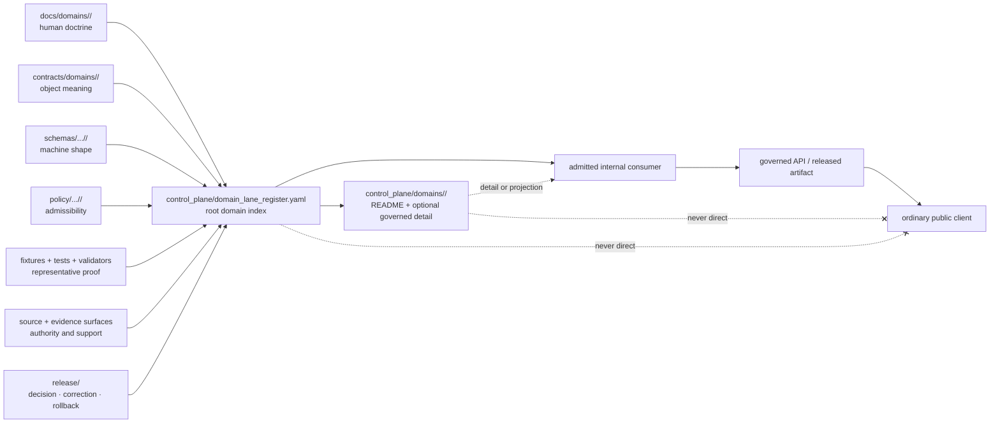

<!-- [KFM_META_BLOCK_V2]
doc_id: kfm://doc/control-plane-domains-readme
title: control_plane/domains/README.md — Control-Plane Domain Governance-Index Lanes
version: v0.2
type: readme; control-plane-domain-index; nested-folder-contract; domain-lane-governance-map
status: repository-grounded draft; one verified child lane; root-domain-register-empty; nested-validation-not-implemented; non-authoritative
owners: NEEDS VERIFICATION — Control-plane steward · Domain stewards · Policy steward · Evidence steward · Release steward · Docs steward
created: NEEDS VERIFICATION — blank placeholder existed before v0.1 expansion
updated: 2026-07-24
supersedes: v0.1 at the same path
prepared_under_prompt: KFM Markdown Modernization & GitHub Documentation Implementation Agent v4.0.0
policy_label: repository-facing; control-plane; domains; governance-index; no-parallel-authority; no-direct-public-path; cite-or-abstain; correction-aware; rollback-aware
current_path: control_plane/domains/README.md
truth_posture: >
  CONFIRMED the tracked parent README, canonical control_plane responsibility root,
  Directory Rules v1.4 placement doctrine and folder-README contract, current root
  control-plane validation workflow, root register meta-contract tests, CODEOWNERS route,
  the modernized Habitat child README, an empty root domain_lane_register entries body,
  and absence of verified nested-domain YAML validation / PROPOSED domain-lane admission,
  root-versus-child register strategy, referential-integrity rules, consumer admission,
  maturity vocabulary, and correction workflow / UNKNOWN exhaustive recursive child-lane
  inventory, every domain authority relationship, runtime consumers, branch-protection
  enforcement, deployment, and public effects / NEEDS VERIFICATION accountable owners,
  independent review, field-level register schemas, complete domain inventory, populated
  root entries, nested-lane validation, stale-reference checks, and rollback drills
evidence_snapshot:
  repository: bartytime4life/Kansas-Frontier-Matrix
  repository_id: "1059091169"
  visibility: public
  base_ref: main
  base_commit: 9788686ddada708c94901ce641cff32e08a04173
  prior_blob: 59db9ada6c17aba05781f0a994dce1f27fd00330
  directory_rules_blob: 2affb080e6f0043867c64c7f06c1ca52030fbd55
  control_plane_readme_blob: 5d58d7e361671b9bf66deb97766cff021ab8ac2f
  habitat_lane_readme_blob: 578407520c9b3f0ee275defd2f23f54e84581efb
  domain_lane_register_blob: 81b23beb3178b59d5c1fdb50edbc9f98f8664930
  object_family_register_blob: 930a9da30d5481f8d7ed5b7789d7846a30d3f4e1
  policy_gate_register_blob: 10e66eb9d587797a3f12e2aaac00fb4e60ec7fa2
  release_state_register_blob: f576239f447045b04d7b30c540234d8641ceb7dc
  docs_control_plane_workflow_blob: 986fe1b4845c51f719bcfeeefe08729517ae543c
  register_meta_contract_test_blob: 05ebb49d07235ab77bd9dbf6717ee05a59e2f052
  codeowners_blob: dd2a84aa514d8ecd9208bc347f90f9a2ed37dd61
  verified_child_readmes: "1"
  root_domain_lane_entries: "0"
  nested_domain_yaml_validation: "not implemented"
  open_overlapping_pull_requests_found: "0"
  inventory_method: exact GitHub file reads, exact child-path reads, root-register reads, workflow/test inspection, and open-PR overlap search; no recursive Git tree, branch-protection inspection, deployment, or runtime was inspected
related:
  - ../README.md
  - ../domain_lane_register.yaml
  - ../object_family_register.yaml
  - ../policy_gate_register.yaml
  - ../release_state_register.yaml
  - ./habitat/README.md
  - ../../docs/doctrine/directory-rules.md
  - ../../docs/domains/README.md
  - ../../contracts/README.md
  - ../../schemas/README.md
  - ../../policy/README.md
  - ../../tests/README.md
  - ../../fixtures/README.md
  - ../../data/README.md
  - ../../release/README.md
  - ../../docs/adr/INDEX.md
  - ../../docs/adr/ADR-0001-schema-home--schemas-contracts-v1-is-canonical.md
  - ../../docs/adr/ADR-0004-apps-governed-api-is-the-trust-membrane.md
  - ../../.github/workflows/docs-control-plane.yml
  - ../../.github/CODEOWNERS
tags: [kfm, control-plane, domains, governance-index, domain-lanes, registers, policy-gates, release-state, evidence, sensitivity, correction, rollback]
notes:
  - "v0.2 is a same-path, no-loss modernization of the existing domain-lane parent README."
  - "The first twelve H2 sections follow Directory Rules section 15 exactly."
  - "The Habitat README is the only child-lane README verified by exact path in this bounded inspection; exhaustive recursive inventory remains UNKNOWN."
  - "The root domain_lane_register.yaml exists with entries: []; child documentation therefore currently exceeds machine-index population."
  - "The current docs-control-plane workflow parses only control_plane/*.yaml, and the current meta-contract test names nine exact root registers; nested domain YAML validation is not implemented."
  - "This README does not create or populate a register, accept an ADR, approve policy, alter release state, promote data, expose a public route, deploy, or publish."
[/KFM_META_BLOCK_V2] -->

<a id="top"></a>

# `control_plane/domains/` — Domain Governance-Index Lanes

[](#status)
[](#current-bounded-inventory)
[](#documented-lanes-versus-machine-index)
[](#validation)
[](#outputs)

> **One-line purpose.** `control_plane/domains/` organizes domain-specific governance indexes that answer **what governs each domain lane** while keeping contracts, schemas, policy, sources, evidence, lifecycle data, release decisions, runtime behavior, and public delivery in their owning responsibility roots.

**Quick navigation:** [Purpose](#purpose) · [Authority](#authority-level) · [Status](#status) · [Belongs](#what-belongs-here) · [Does not belong](#what-does-not-belong-here) · [Inputs](#inputs) · [Outputs](#outputs) · [Validation](#validation) · [Review](#review-burden) · [Related](#related-folders) · [ADRs](#adrs) · [Last reviewed](#last-reviewed) · [Inventory](#current-bounded-inventory) · [Machine gap](#documented-lanes-versus-machine-index) · [Admission](#domain-lane-admission-contract) · [Register strategy](#root-versus-child-register-strategy) · [Flow](#referential-governance-flow) · [Sensitivity](#sensitive-domain-and-cross-domain-posture) · [Failure controls](#failure-controls) · [Correction](#correction-deprecation-and-rollback) · [Verification](#open-verification-register) · [No-loss](#v01-to-v02-no-loss-ledger) · [Summary](#status-summary)

> [!IMPORTANT]
> **A domain index describes authority relationships; it does not create domain authority.** A child folder, README, YAML file, badge, workflow result, commit, pull request, or merged branch cannot establish object meaning, source authority, evidence closure, policy approval, release approval, or publication by itself.

> [!WARNING]
> **The human and machine domain inventories are not closed.** A grounded Habitat child README exists, but [`domain_lane_register.yaml`](../domain_lane_register.yaml) still contains `entries: []`. The current workflow and tests validate root register syntax and metadata—not domain completeness, nested register semantics, cross-root agreement, or consumer safety.

> [!CAUTION]
> Ordinary public clients must not read this folder or its future registers directly. Public and semi-public surfaces consume governed APIs and released, policy-allowed artifacts. A control-plane pointer may guide backend validation or review, but it is never a public claim payload.

---

## Purpose

`control_plane/domains/` is the domain-segment lane beneath KFM's machine-readable governance-index root.

It exists to make domain governance relationships inspectable without collapsing the responsibilities they connect. A mature entry or child lane may help tools and stewards answer questions such as:

- Which domains are recognized, proposed, deprecated, or blocked?
- Which human doctrine, semantic contracts, machine schemas, policy surfaces, source registries, fixtures, tests, release records, correction notices, and rollback targets govern each domain?
- Which object families and source roles belong to a domain, and which belong to an adjacent or cross-domain owner?
- Which sensitivity, geoprivacy, rights, review, evidence, and release gates apply?
- Which domain relationships are current, stale, contradicted, incomplete, or awaiting verification?
- Which consumers may rely on a domain pointer, and at what verified maturity?

This lane improves navigation, coordination, validation planning, drift detection, and review. It does not define domain truth or execute domain behavior.

[Back to top](#top)

---

## Authority level

| Surface | Authority posture |
|---|---|
| `control_plane/` | **Canonical responsibility root** for machine-readable governance indexes, crosswalks, and operational registers. |
| `control_plane/domains/` | Nested domain-index lane. It organizes domain governance pointers; it does not own domain facts. |
| This `README.md` | Repository-facing boundary, inventory, and maintenance contract; not a machine register. |
| [`domain_lane_register.yaml`](../domain_lane_register.yaml) | Root machine-index candidate for domain lanes; current file is `PROPOSED` and empty. |
| Child domain READMEs | Human boundary and evidence notes for one control-plane domain segment; not machine authority. |
| Future child YAML | **PROPOSED** detail or projection surfaces until strategy, schemas, entries, review, validation, and consumers are approved. |
| Human domain doctrine | Owned by [`docs/domains/`](../../docs/domains/README.md). |
| Object meaning | Owned by [`contracts/`](../../contracts/README.md). |
| Machine shape | Owned by [`schemas/`](../../schemas/README.md); ADR-0001 remains proposed. |
| Admissibility, rights, and sensitivity | Owned by [`policy/`](../../policy/README.md). |
| Source identity and authority | Owned by source registry and lifecycle surfaces; an index pointer is not a `SourceDescriptor`. |
| Evidence and proof | Owned by evidence/proof surfaces; an index pointer is not an `EvidenceBundle` or ProofPack. |
| Release, correction, and rollback | Owned by [`release/`](../../release/README.md); an index cannot approve or alter release state. |
| Runtime and public response | Owned by governed applications and released artifacts; this lane has no ordinary public-client authority. |

Authority is **referential** in this lane. An unresolved, stale, contradicted, or unauthorized pointer is incomplete. Consumers must fail closed rather than infer the missing relationship.

[Back to top](#top)

---

## Status

| Finding | Truth status | Current bounded result |
|---|---:|---|
| Parent path and README | `CONFIRMED` | `control_plane/domains/README.md` exists with stable `kfm://doc/control-plane-domains-readme` identity. |
| Canonical root ownership | `CONFIRMED DOCTRINE` | Directory Rules assign machine-readable governance indexes to `control_plane/`; domain names remain segments inside responsibility roots. |
| Verified child README lanes | `CONFIRMED BOUNDED` | [`habitat/README.md`](./habitat/README.md) exists and is repository-grounded. No exhaustive recursive child inventory was established. |
| Root domain-lane machine entries | `CONFIRMED EMPTY` | [`domain_lane_register.yaml`](../domain_lane_register.yaml) exists with `entries: []`. |
| Related root registers | `CONFIRMED EMPTY` | The inspected object-family, policy-gate, and release-state registers also have empty `entries` lists. |
| Root YAML parsing | `CONFIRMED / ENFORCED` | The docs-control-plane workflow parses root `control_plane/*.yaml`, rejects duplicate keys, and requires mapping roots. |
| Root register meta contract | `CONFIRMED / ENFORCED` | Tests require nine exact root registers, selected metadata, ISO review dates, related-doctrine paths, and an `entries:` body. |
| Nested domain YAML validation | `NOT IMPLEMENTED` | The inspected workflow glob and exact-file tests do not cover `control_plane/domains/**/*.yaml`. |
| Field-level domain-register schema | `NEEDS VERIFICATION` | No dedicated domain-lane register schema or fixture suite was established. |
| Domain inventory completeness | `UNKNOWN` | One verified child README and an empty machine register do not prove a complete domain inventory. |
| Consumer readiness | `UNKNOWN / HOLD` | No admitted consumer contract or stale-reference behavior was established for domain indexes. |
| Review routing | `CONFIRMED ROUTING / NEEDS VERIFICATION ENFORCEMENT` | CODEOWNERS routes `/control_plane/` to `@bartytime4life`; independent stewardship and required-review controls remain unverified. |
| Direct public use | `DENY` | Domain indexes do not authorize public consumption. |

### Current tensions

1. **Documented child lane versus empty root register.** Habitat is documented beneath this folder, while the root domain-lane machine register has no entries.
2. **Root register versus future child detail.** The prior README proposed per-domain child YAML files without deciding whether they extend, duplicate, or project the root register.
3. **Syntax/meta validation versus semantic closure.** Root validation is real but does not prove domain coverage, reference resolution, cross-register agreement, or safe consumers.
4. **Known child pattern versus exhaustive inventory.** Habitat is a verified pattern; it must not be presented as the only possible or complete domain inventory without recursive evidence.
5. **Review routing versus accountable stewardship.** A GitHub owner route exists, but domain, policy, evidence, sensitivity, and release accountability remain unverified.

[Back to top](#top)

---

## What belongs here

Only machine-governance indexing and its immediate boundary documentation belong in this lane.

| Accepted surface | Purpose | Admission condition |
|---|---|---|
| `README.md` | Defines the parent domain-index boundary, inventory method, validation boundary, and maintenance rules. | Must follow Directory Rules §15 and preserve the non-authoritative posture. |
| `<domain>/README.md` | Explains one domain's control-plane index boundary and grounded state. | Domain path and responsibility must be verified; no parallel authority may be created. |
| `<domain>/*.yaml` | Optional detailed governance index or generated projection. | **PROPOSED only** until root-versus-child strategy, field schema, fixtures, validators, ownership, and consumer rules are approved. |
| Domain pointer records | References to contracts, schemas, policy, sources, tests, evidence, release, corrections, and rollback. | Every pointer must resolve to the owning root and carry bounded status/review metadata. |
| Drift, contradiction, deprecation, and verification references | Domain-scoped relationships to the canonical root registers or docs registers. | Must not become an independent parallel register family. |
| Generated read-only projections | Domain-filtered views produced from a canonical root register. | Generator, source hash, output hash, freshness, and non-authoritative projection status must be explicit. |

A future file is admitted because its **primary responsibility is indexing governance**, not because its subject is a domain.

[Back to top](#top)

---

## What does NOT belong here

| Prohibited content | Owning surface | Why |
|---|---|---|
| Human domain doctrine, architecture, source explanations, or usage guides | `docs/domains/<domain>/` | `docs/` explains domain meaning and operation to humans. |
| Semantic object contracts | `contracts/domains/<domain>/` | Contracts define meaning; an index only points to them. |
| JSON Schema or other machine shape | `schemas/contracts/v1/domains/<domain>/` or accepted schema home | `control_plane/` must not become a parallel schema authority. |
| Rego, access decisions, sensitivity rules, or geoprivacy logic | `policy/domains/<domain>/` and cross-domain policy lanes | A policy-gate map is not policy. |
| `SourceDescriptor` instances or source-rights records | Source registry and policy/evidence roots | A source pointer is not source authority. |
| RAW, WORK, QUARANTINE, PROCESSED, CATALOG, TRIPLET, or PUBLISHED payloads | `data/<phase>/<domain>/` | This folder is not a lifecycle store. |
| EvidenceBundle, receipt, or proof instances | Evidence, `data/receipts/`, and `data/proofs/` surfaces | References do not replace evidence or audit objects. |
| Release manifests, promotion decisions, correction notices, or rollback cards | `release/` | A release-state pointer cannot approve release. |
| Fixtures, tests, validators, pipelines, connectors, packages, or app code | Their canonical implementation/proof roots | This folder indexes; it does not execute. |
| Public API, map, tile, search, graph, or AI payloads | Governed applications and released artifacts | Direct public consumption would bypass the trust membrane. |
| Unreviewed AI-generated domain inventories | Candidate documentation or review workflow | Generated completeness is not evidence. |
| Secrets, credentials, private records, or precise sensitive locations | Never here | Machine governance indexes must remain public-safe or access-controlled by approved policy. |

[Back to top](#top)

---

## Inputs

Domain-index material may be derived from:

- accepted doctrine and ADRs;
- the current Directory Rules and root README contracts;
- verified domain documentation under `docs/domains/`;
- semantic contracts and machine schemas;
- policy, rights, sensitivity, and geoprivacy surfaces;
- source registry and source-activation records;
- fixture, test, validator, and workflow evidence;
- evidence/proof, review, release, correction, and rollback records;
- drift, contradiction, deprecation, and verification registers;
- current repository path and content evidence;
- bounded steward-authored corrections.

Every input retains its own authority class. Copying a path or status into a domain index does not upgrade the source's truth, review, policy, or release state.

[Back to top](#top)

---

## Outputs

This lane may support:

- human navigation between domain governance surfaces;
- machine lookup of domain-to-authority relationships after consumer admission;
- review routing and affected-root discovery;
- drift, contradiction, deprecation, and verification reporting;
- validator planning and missing-proof diagnostics;
- domain completeness reports with explicit evidence boundaries;
- correction impact analysis and stale-reference queues;
- generated domain-filtered projections from a canonical root register.

It does **not** emit domain truth, policy decisions, source activation, evidence closure, release approval, lifecycle promotion, public API responses, map layers, AI answers, or KFM publication.

```text
verified authority roots
  -> reviewed root register entry
  -> optional generated/read-only domain projection
  -> admitted internal consumer
  -> governed API or release process performs its own checks

control_plane/domains/*
  -X-> ordinary public client
  -X-> direct policy decision
  -X-> direct release or publication
```

[Back to top](#top)

---

## Validation

### Implemented validation boundary

The current [docs-control-plane workflow](../../.github/workflows/docs-control-plane.yml) provides bounded checks:

1. parses every root `control_plane/*.yaml` file with pinned PyYAML;
2. rejects duplicate mapping keys;
3. requires each parsed root document to be a mapping;
4. runs repository-owned tests for nine exact root register files;
5. requires selected root metadata, ISO review dates, existing related-doctrine paths, and an `entries:` body;
6. validates ADR-index coherence in a separate job.

### Not established by those checks

The current inspected workflow and tests do **not** prove:

- recursive parsing of `control_plane/domains/**/*.yaml`;
- a field-level schema for domain-lane entries;
- complete domain coverage;
- unique domain identifiers or alias rules;
- reference resolution across contracts, schemas, policy, sources, tests, evidence, and release;
- agreement between the root domain register and child README or child YAML;
- sensitivity or rights correctness;
- accepted ADR or policy status;
- consumer authorization, freshness handling, or failure behavior;
- correction propagation, deprecation, or rollback drills;
- current workflow success for this branch;
- deployment or public behavior.

### Minimum admission checks before nested YAML is added

- [ ] Decide whether the canonical domain inventory is root-only, root-plus-detail, or generated-projection based.
- [ ] Define stable domain identity, aliases, status vocabulary, and relationship fields.
- [ ] Add a machine schema or deterministic field validator.
- [ ] Add valid, invalid, unresolved-reference, duplicate-ID, stale-pointer, and sensitive-domain fixtures.
- [ ] Extend CI to parse and validate nested domain files if they are admitted.
- [ ] Add cross-checks against the root domain register and referenced paths.
- [ ] Define consumer allowlist and fail-closed behavior.
- [ ] Require correction, deprecation, and rollback handling.
- [ ] Document ownership and review burden.

A green parser or metadata test is necessary but insufficient for consumer readiness.

[Back to top](#top)

---

## Review burden

CODEOWNERS currently routes `/control_plane/` to `@bartytime4life`. That is a GitHub review route, not proof of accountable or independent stewardship.

| Change class | Minimum review burden |
|---|---|
| README clarification or dead-link repair | Control-plane/docs review; verify no authority claim changed. |
| New child domain README | Control-plane + domain + docs review; verify domain path, boundaries, and no parallel authority. |
| Root domain register entry | Control-plane + affected domain + owning-root reviewers; verify every pointer and truth status. |
| New child YAML or field contract | Control-plane + schema/validation + domain + affected policy/evidence/release reviewers. |
| Sensitivity, rights, geoprivacy, living-person, DNA, archaeology, rare-species, or infrastructure pointer | Domain + policy/sensitivity + source/evidence + security/privacy review; fail closed. |
| Consumer admission or runtime dependency | Control-plane + consumer owner + security + policy + evidence/release review; negative-path tests required. |
| Deprecation, identity change, or path migration | Owning roots + migration/deprecation review; compatibility and rollback required. |
| Publication-significant relationship | Independent release/policy/evidence review where separation of duties is required. |

Do not encode unverified role names as executable GitHub owners. Record accountable assignments in approved governance surfaces.

[Back to top](#top)

---

## Related folders

| Surface | Relationship |
|---|---|
| [`control_plane/`](../README.md) | Parent root contract, root inventory, and validation boundary. |
| [`habitat/`](./habitat/README.md) | Verified child domain-index README and current grounded child pattern. |
| [`domain_lane_register.yaml`](../domain_lane_register.yaml) | Root domain-lane machine index candidate; currently empty. |
| [`object_family_register.yaml`](../object_family_register.yaml) | Root object-family crosswalk; currently empty. |
| [`policy_gate_register.yaml`](../policy_gate_register.yaml) | Root policy-gate crosswalk; currently empty. |
| [`release_state_register.yaml`](../release_state_register.yaml) | Root release-state crosswalk; currently empty. |
| [`docs/domains/`](../../docs/domains/README.md) | Human-facing domain doctrine and orientation. |
| [`contracts/`](../../contracts/README.md) | Semantic object meaning. |
| [`schemas/`](../../schemas/README.md) | Machine-checkable shape. |
| [`policy/`](../../policy/README.md) | Admissibility, obligations, rights, and sensitivity. |
| [`tests/`](../../tests/README.md) and [`fixtures/`](../../fixtures/README.md) | Enforceability proof and representative examples. |
| [`data/`](../../data/README.md) | Lifecycle data, registries, receipts, proofs, and published artifacts. |
| [`release/`](../../release/README.md) | Release decisions, corrections, withdrawals, and rollback. |
| [docs-control-plane workflow](../../.github/workflows/docs-control-plane.yml) | Current root YAML and register-meta validation orchestration. |
| [CODEOWNERS](../../.github/CODEOWNERS) | GitHub review routing; not stewardship or approval proof. |

[Back to top](#top)

---

## ADRs

| Decision surface | Current posture |
|---|---|
| [Canonical ADR inventory](../../docs/adr/INDEX.md) | Effective status source for numbered ADRs. |
| [ADR-0001 — schema home](../../docs/adr/ADR-0001-schema-home--schemas-contracts-v1-is-canonical.md) | `proposed`; current schema configuration does not substitute for acceptance. |
| [ADR-0004 — governed API trust membrane](../../docs/adr/ADR-0004-apps-governed-api-is-the-trust-membrane.md) | `proposed`; reinforces that ordinary clients do not read internal control-plane or lifecycle stores directly. |
| Domain-index canonical strategy | **NEEDS VERIFICATION / ADR candidate** if it changes authority, creates a new register family, or establishes generated mirrors. |
| Domain ID and alias grammar | **NEEDS VERIFICATION.** Must be frozen before multiple producers or consumers depend on it. |
| Root-versus-child precedence | **NEEDS VERIFICATION.** No child YAML should independently evolve before this is decided. |
| Sensitive-domain minimum fields | **NEEDS VERIFICATION.** Policy and evidence references must remain pointers, not embedded decisions. |

A proposed README or child file cannot authorize itself. Decisions that create parallel authority, change placement doctrine, or bind public/runtime behavior require the applicable ADR and review path.

[Back to top](#top)

---

## Last reviewed

**2026-07-24**

Review again when any of these occurs:

- a new child domain lane is added or removed;
- `domain_lane_register.yaml` receives its first entry or changes shape;
- nested domain YAML is admitted;
- a domain index consumer is introduced;
- validation expands beyond root files;
- a domain identifier or alias changes;
- a sensitivity or public-path rule changes;
- correction, deprecation, or rollback is exercised;
- six months elapse without review.

[Back to top](#top)

---

## Current bounded inventory

### Verified surfaces

```text
control_plane/
├── README.md                         # grounded root contract
├── domain_lane_register.yaml         # exists; entries: []
├── object_family_register.yaml       # exists; entries: []
├── policy_gate_register.yaml         # exists; entries: []
├── release_state_register.yaml       # exists; entries: []
└── domains/
    ├── README.md                     # this parent boundary
    └── habitat/
        └── README.md                 # grounded child boundary
```

This is a **bounded exact-path inventory**, not a recursive tree claim. Additional child paths remain UNKNOWN until a recursive Git-tree or equivalent inspection verifies them.

### Inventory interpretation

| Layer | Verified state | Safe conclusion |
|---|---|---|
| Parent lane | README exists. | Domain governance-index placement is documented. |
| Child lane | Habitat README exists. | One grounded child pattern exists. |
| Root machine inventory | Empty `entries` body. | No domain is currently represented as a root machine entry. |
| Child machine details | Not established. | Do not claim child register implementation. |
| Nested validation | Not established. | Do not claim child YAML CI coverage. |
| Consumers | Not established. | Do not build public or consequential dependencies on this lane. |

[Back to top](#top)

---

## Documented lanes versus machine index

The current repository has a deliberate gap that must remain visible:

```text
human documentation
  control_plane/domains/habitat/README.md       -> present

root machine inventory
  control_plane/domain_lane_register.yaml       -> entries: []

nested machine detail
  control_plane/domains/habitat/*.yaml          -> not established
```

This means:

- the Habitat control-plane lane is **documented**, not machine-registered;
- the root register path exists, but its body does not enumerate Habitat;
- no child YAML may be inferred from README examples;
- no consumer may treat directory presence as a complete domain inventory;
- a future first domain entry must preserve provenance, review, and owning-root references;
- documentation and machine index must be reconciled through a reviewed update, not silently assumed equal.

### Smallest safe closure sequence

1. Define the root `domain_lane_register` entry contract and stable domain ID grammar.
2. Add valid/invalid fixtures and deterministic negative-path tests.
3. Add one reviewed Habitat entry referencing verified owning surfaces.
4. Cross-check the entry against the Habitat child README and exact paths.
5. Decide whether child YAML adds justified detail or should remain absent.
6. Admit consumers only after stale, missing, contradictory, sensitive, and deprecated states fail closed.

[Back to top](#top)

---

## Domain-lane admission contract

A new child lane should not be added merely because a domain is discussed elsewhere. Before adding `control_plane/domains/<domain>/`, verify:

| Gate | Required evidence | Failure posture |
|---|---|---|
| Domain identity | Stable domain ID, slug, aliases, and human-readable name. | HOLD on ambiguity or collision. |
| Responsibility-root fit | Directory Rules basis confirms this is a domain segment inside `control_plane/`. | DENY new root or wrong-root placement. |
| Human doctrine | Current domain README or accepted equivalent exists and defines boundaries. | HOLD; do not fabricate meaning. |
| Semantic and machine homes | Contract and schema relationships are known or explicitly unresolved. | Mark `NEEDS VERIFICATION`; do not invent paths. |
| Policy and sensitivity | Applicable rights/sensitivity/geoprivacy posture is referenced. | Fail closed when material. |
| Evidence and source roles | Source and evidence boundaries are named without duplicating them. | ABSTAIN on unsupported relationships. |
| Tests and validation | At least the lane README and introduced references are validated; machine files require fixtures/tests. | Do not admit machine consumers. |
| Release/correction/rollback | Relevant release and correction relationships are referenced when public products exist. | HOLD publication-significant use. |
| Root register relationship | Decide whether the child lane is represented by or generated from a root entry. | DENY independent competing inventory. |
| Ownership and review | Accountable review path is established. | Keep status `PROPOSED`. |

A child README may document an evidence-bounded lane before machine registration. It must state that gap explicitly.

[Back to top](#top)

---

## Root-versus-child register strategy

The repository should choose one explicit strategy before domain-specific YAML proliferates.

| Strategy | Shape | Benefit | Main risk | Current posture |
|---|---|---|---|---|
| **A. Root-only** | All domain entries live in `domain_lane_register.yaml`; child folders contain READMEs only. | Smallest authority surface and simplest validation. | Root file may become large. | **PROPOSED / smallest current fit.** |
| **B. Root index + child detail** | Root entry holds stable ID/status/pointer; child YAML carries domain detail. | Scales detail while preserving one inventory. | Root and child can drift without cross-checks. | PROPOSED; requires schemas and reciprocal validation. |
| **C. Canonical root + generated child projections** | Root register is authored; child files are generated read-only views. | Avoids independent authority and supports local navigation. | Generator and freshness become trust-bearing. | PROPOSED; requires receipts/hashes and no hand editing. |
| **D. Independent child registers** | Each domain owns its own machine inventory. | Local autonomy. | Creates fragmented or parallel authority. | **DENY by default** absent accepted ADR and strong controls. |

Until a strategy is approved:

- do not create child YAML merely to match the old README's suggested tree;
- keep the root register authoritative only for what it actually contains;
- keep child READMEs explicit about machine-registration gaps;
- prevent consumers from recursively discovering directories and treating them as truth;
- record the decision and migration path before introducing multiple producers.

[Back to top](#top)

---

## Referential governance flow



The diagram is a proposed operating model. It does not claim current entries, generated projections, admitted consumers, or runtime enforcement.

### Consumer rules

An admitted consumer should:

1. read only a validated, reviewed revision;
2. resolve every consequential pointer before use;
3. verify domain status, freshness, policy, review, and release context;
4. reject missing, duplicate, stale, deprecated, contradicted, or unauthorized relationships;
5. preserve source-role and domain-boundary distinctions;
6. emit a decision or validation record for consequential use;
7. never expose a raw register as a public response;
8. support correction invalidation and rollback.

[Back to top](#top)

---

## Sensitive-domain and cross-domain posture

Some domain relationships carry higher risk than a normal navigation pointer. Examples include living-person data, DNA/genomics, rare species, archaeology, culturally sensitive locations, private land, critical infrastructure, and exact cross-domain joins.

The parent lane must enforce these principles:

- domain indexes point to policy and sensitivity authority; they do not embed or replace it;
- exact sensitive geometry must not appear merely because a path or object family is indexed;
- domain-to-domain joins require the stricter applicable policy posture;
- unknown rights, sensitivity, source role, or review state fails closed;
- public-safe transforms remain linked to their transform receipts and original restricted evidence where policy permits;
- administrative, modeled, observed, regulatory, aggregate, candidate, and synthetic roles must not collapse;
- a domain index may say a relationship exists only at the support level actually verified;
- denial, abstention, redaction, generalization, staged access, or quarantine remain valid outcomes.

A directory or register entry must never become a shortcut around policy, evidence resolution, steward review, or release gates.

[Back to top](#top)

---

## Failure controls

| Failure | Required result |
|---|---|
| Domain path is named but does not exist | Mark `NEEDS VERIFICATION`; do not emit a confirmed entry. |
| Domain slug collides or aliases disagree | HOLD until identity is resolved and compatibility is documented. |
| Root register and child README disagree | Treat as `CONFLICTED`; block consequential consumers and open correction/drift work. |
| Root entry points to missing contract/schema/policy/source/test/release path | Fail validation; do not infer replacement. |
| Referenced ADR is proposed or superseded | Preserve effective status; do not present decision as accepted. |
| Sensitive-domain policy pointer is missing | DENY or HOLD exposure; do not default allow. |
| Domain is deprecated or superseded | Preserve lineage, successor pointer, effective date, and consumer migration state. |
| Register is stale | Mark stale and block consumers whose correctness depends on freshness. |
| Nested YAML appears without schema/tests | Keep unadmitted; CI and consumers must ignore or fail. |
| Consumer reads directory names as discovery truth | Reject design; require validated register contract. |
| Public client reads register directly | DENY; use governed API/released artifact. |
| Generated projection differs from canonical source | Fail generation/validation, preserve prior good output, and investigate. |
| Correction cannot identify affected consumers | HOLD correction closure and expand impact inventory. |

No failure mode may silently upgrade UNKNOWN or PROPOSED information into CONFIRMED domain authority.

[Back to top](#top)

---

## Correction, deprecation, and rollback

A domain-index correction must preserve the history of the relationship being corrected.

### Correction procedure

1. Identify the incorrect entry, README statement, pointer, status, or alias.
2. Identify the owning authority and exact supporting evidence.
3. Determine affected root entries, child lanes, consumers, docs, tests, and public/release surfaces.
4. Correct the canonical source first or record why it cannot yet be corrected.
5. Update root and child index surfaces in one bounded transaction when both are authoritative participants.
6. Re-run syntax, field, reference, contradiction, sensitivity, and consumer tests.
7. Emit or update drift, verification, contradiction, deprecation, or correction records as applicable.
8. Invalidate generated projections and dependent caches.
9. Preserve prior hashes and a rollback target.

### Deprecation requirements

A deprecated domain ID or lane should record:

- prior stable ID and slug;
- replacement or successor, if any;
- reason and effective date;
- authority and review record;
- affected consumers;
- compatibility window;
- migration and rollback path;
- correction implications for released claims.

### Rollback boundary

Rollback of this README means restoring prior documentation. Rollback of a domain relationship may require reverting root register entries, child projections, generated indexes, consumer configuration, and cached outputs. It never erases correction history or changes release state by itself.

[Back to top](#top)

---

## Open verification register

| ID | Item | Status | Closure evidence |
|---|---|---|---|
| `CP-DOM-V-001` | Exhaustive recursive inventory beneath `control_plane/domains/`. | NEEDS VERIFICATION | Pinned recursive tree or equivalent exact inventory. |
| `CP-DOM-V-002` | Stable domain ID, slug, alias, and supersession grammar. | NEEDS VERIFICATION | Accepted contract/ADR plus fixtures. |
| `CP-DOM-V-003` | Root-only versus root-plus-child versus generated-projection strategy. | NEEDS VERIFICATION | Reviewed decision and migration plan. |
| `CP-DOM-V-004` | Field-level schema for `domain_lane_register.yaml`. | NEEDS VERIFICATION | Schema/validator plus valid and invalid fixtures. |
| `CP-DOM-V-005` | First reviewed Habitat root entry. | NEEDS VERIFICATION | Validated entry resolving to verified authorities. |
| `CP-DOM-V-006` | Recursive nested YAML parsing and duplicate-key checks. | NOT IMPLEMENTED | Workflow and negative test evidence. |
| `CP-DOM-V-007` | Root/child reciprocal reference and drift checks. | NOT IMPLEMENTED | Deterministic cross-check tests. |
| `CP-DOM-V-008` | Cross-register agreement with object-family, policy-gate, source, evidence, and release indexes. | NEEDS VERIFICATION | Integration validator and fixtures. |
| `CP-DOM-V-009` | Sensitive-domain and cross-domain minimum pointer fields. | NEEDS VERIFICATION | Policy-reviewed contract and deny fixtures. |
| `CP-DOM-V-010` | Consumer allowlist and fail-closed behavior. | NEEDS VERIFICATION | Consumer contract, threat review, and negative tests. |
| `CP-DOM-V-011` | Accountable domain/control-plane ownership and independent review. | NEEDS VERIFICATION | Approved assignments and repository enforcement evidence. |
| `CP-DOM-V-012` | Correction, deprecation, and rollback drill. | NEEDS VERIFICATION | Observed drill with impact inventory and restoration evidence. |
| `CP-DOM-V-013` | Branch protection and required review enforcement. | UNKNOWN | Repository ruleset evidence. |
| `CP-DOM-V-014` | Any runtime or public effect. | UNKNOWN / DENY ASSUMPTION | Deployed configuration and information-flow evidence; direct public use remains denied. |

[Back to top](#top)

---

## v0.1 to v0.2 no-loss ledger

| v0.1 material | v0.2 disposition |
|---|---|
| Governance-index purpose | Preserved and sharpened into the required Purpose and Authority sections. |
| Domain child folders as index lanes | Preserved; admission contract now prevents directory presence from becoming authority. |
| Responsibility-root placement table | Preserved across Authority, Belongs, Does not belong, and Related folders. |
| Accepted child file pattern | Preserved but reclassified as PROPOSED pending root-versus-child strategy and validation. |
| Exclusion list | Preserved and expanded with public-path, evidence, source, release, secrets, and generated-inventory controls. |
| Domain-lane guardrails | Preserved and expanded into sensitivity, failure, consumer, correction, and rollback rules. |
| Habitat as known child lane | Updated from a simple existence note to the grounded v0.2 child pattern. |
| Suggested register pattern | Preserved as a strategy option, not an implemented tree claim. |
| Validation checklist | Expanded into implemented/not-implemented boundaries and admission gates. |
| Rollback warning | Preserved and expanded into correction, deprecation, and multi-surface rollback discipline. |
| Blank-placeholder lineage | Preserved in metadata; v0.2 supersedes v0.1, not the original blank directly. |

No accurate governance boundary was intentionally removed. Generic or unsupported implementation language was replaced with pinned evidence and explicit uncertainty.

[Back to top](#top)

---

## Status summary

| Dimension | Current result |
|---|---|
| Document outcome | **UPGRADED** — same path, same stable ID, no parallel README. |
| Lane role | Nested governance-index lane under canonical `control_plane/`; non-authoritative with respect to domain truth. |
| Verified child inventory | One grounded child README: Habitat. Exhaustive inventory remains UNKNOWN. |
| Root domain machine inventory | Exists with `entries: []`; documented lanes exceed machine registration. |
| Related root register population | Object-family, policy-gate, and release-state entries are also empty in the inspected snapshot. |
| Validation maturity | Root syntax/meta checks implemented; field-level domain and nested-lane validation not implemented. |
| Consumer maturity | UNKNOWN / HOLD; no admitted consequential consumer established. |
| Public path | DENY direct use; governed APIs and released artifacts only. |
| Next smallest safe change | Define and test the root domain-entry contract, then add one reviewed Habitat entry before considering child YAML or consumers. |
| Publication effect | None. This README, branch, commit, checks, review, or merge does not publish data or accept an ADR. |

---

<p align="right"><a href="#top">Back to top</a></p>
