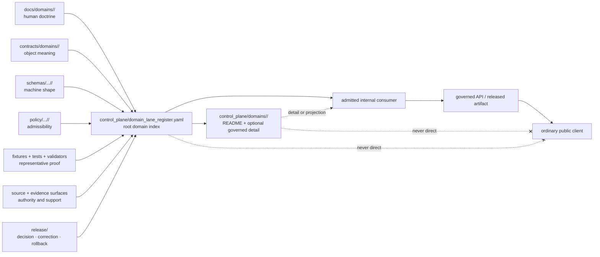

<!-- [KFM_META_BLOCK_V2]
doc_id: kfm://doc/control-plane-domains-readme
title: control_plane/domains/README.md — Control-Plane Domain Governance-Index Lanes
type: README
version: v0.4
status: repository-grounded draft; current-main-repinned; 13-entry root projection; dedicated validation implemented; nested-domain-yaml-not-admitted; non-authoritative
owner: NEEDS VERIFICATION — Control-plane steward · Domain stewards · Policy steward · Evidence steward · Release steward · Docs steward
created: 2026-05-14
updated: 2026-09-06
policy_label: repository-facing; control-plane; domains; governance-index; no-parallel-authority; no-direct-public-path; cite-or-abstain; correction-aware; rollback-aware
owning_root: control_plane/
responsibility: Document the nested domain-governance index boundary and reconcile it with the canonical 13-entry root projection without creating domain, source, policy, lifecycle, release, or publication authority.
truth_posture: CONFIRMED current-main root projection, exact subtree inventory, schema/validator/test/workflow definitions, historical receipt binding, accepted Directory Rules, and repository ownership route / PROPOSED machine_projection_only identity set and root-versus-child strategy / UNKNOWN current hosted domain-lane result, consumers, cross-root maturity, and runtime effects / NEEDS VERIFICATION accountable review, nested-YAML strategy, and runtime effects
evidence_snapshot:
  repository: bartytime4life/Kansas-Frontier-Matrix
  base_ref: main
  base_commit: 56c6694fbf1a3c7b91677e360bce144cdb612f13
  prior_blob: a03d93a0867b768bc6b415a3f08606b27d339a17
  control_plane_readme_blob: cd315af7c4a9cc5ac50f6a80989f2ec8d1c1a8ba
  directory_rules_blob: fd49a0b83e55cef52c1124281f093e263526898d
  directory_rules_sha256: sha256:44f7e94344cb42b630008eb0bc03a13fcb97dbdfba6f3e56579693a272571e6e
  adr_0029_blob: a4de0d7a96b78da59cfc499d1025e1508afd8dd9
  domain_lane_register_blob: 1bfc6f91cfa713a5e3d51ece011b63b46310734f
  domain_lane_workflow_blob: 318214ba62830d255429fa257c3391276f5a2bf0
  domain_lane_schema_blob: 62776893b6589aacf8ffc5d14be3b39f68439c0b
  domain_lane_validator_blob: 0ed8fbbec788d785fbd7ae1a8ad878af567dbf2a
  domain_lane_tests_blob: 89f1887ceebe44c3fd0954471a5c12e53c332880
  domain_lane_receipt_blob: 9185c351880b5a210ab18a16468c9e312e677187
  narrative_register_blob: 7cd641d99e1e4e3b3823f608d63679a438590c3a
  habitat_readme_blob: bf3d500033ca1180b611a9cc714e8ec5bc35dfc1
  habitat_gitkeep_blob: e69de29bb2d1d6434b8b29ae775ad8c2e48c5391
  domain_subtree: "README.md; habitat/README.md; habitat/.gitkeep"
  current_main_domain_lane_workflow_runs: none_returned_for_latest_merge_commit
  open_control_plane_prs_at_preflight: none_observed
related:
  - ../README.md
  - ../domain_lane_register.yaml
  - ../object_family_register.yaml
  - ../policy_gate_register.yaml
  - ../release_state_register.yaml
  - ./habitat/README.md
  - ../../docs/doctrine/directory-rules.md
  - ../../docs/adr/ADR-0029-adopt-directory-governance-standard-v2.md
  - ../../docs/domains/README.md
  - ../../docs/registers/DOMAIN_LANE.md
  - ../../schemas/contracts/v1/governance/domain_lane_register.schema.json
  - ../../tools/validators/directory_governance/validate_domain_lane_register.py
  - ../../tests/validators/directory_governance/test_validate_domain_lane_register.py
  - ../../contracts/README.md
  - ../../schemas/README.md
  - ../../policy/README.md
  - ../../tests/README.md
  - ../../fixtures/README.md
  - ../../data/README.md
  - ../../release/README.md
  - ../../docs/adr/INDEX.md
  - ../../docs/adr/ADR-0001-schema-home--schemas-contracts-v1-is-canonical.md
  - ../../docs/adr/ADR-0004-apps-governed-api-is-the-trust-membrane.md
  - ../../.github/workflows/docs-control-plane.yml
  - ../../.github/workflows/domain-lane-register.yml
  - ../../.github/CODEOWNERS
[/KFM_META_BLOCK_V2] -->

<a id="top"></a>

# `control_plane/domains/` — Domain Governance-Index Lanes

[](#status)
[](#documented-lanes-versus-machine-index)
[](#validation)
[](#validation)
[](#outputs)

> **One-line purpose.** `control_plane/domains/` organizes domain-specific governance indexes that answer **what governs each domain lane** while keeping contracts, schemas, policy, sources, evidence, lifecycle data, release decisions, runtime behavior, and public delivery in their owning responsibility roots.

**Quick navigation:** [Purpose](#purpose) · [Authority](#authority-level) · [Status](#status) · [Belongs](#what-belongs-here) · [Does not belong](#what-does-not-belong-here) · [Inputs](#inputs) · [Outputs](#outputs) · [Validation](#validation) · [Review](#review-burden) · [Related](#related-folders) · [ADRs](#adrs) · [Last reviewed](#last-reviewed) · [Inventory](#current-bounded-inventory) · [Machine gap](#documented-lanes-versus-machine-index) · [Admission](#domain-lane-admission-contract) · [Register strategy](#root-versus-child-register-strategy) · [Flow](#referential-governance-flow) · [Sensitivity](#sensitive-domain-and-cross-domain-posture) · [Failure controls](#failure-controls) · [Correction](#correction-deprecation-and-rollback) · [Verification](#open-verification-register) · [Lineage](#version-lineage-and-no-loss-ledger) · [Summary](#status-summary)

> [!IMPORTANT]
> **A domain index describes authority relationships; it does not create domain authority.** A child folder, README, YAML file, badge, workflow result, commit, pull request, or merged branch cannot establish object meaning, source authority, evidence closure, policy approval, release approval, or publication by itself.

> [!WARNING]
> **The machine projection is populated but non-authorizing.** [`domain_lane_register.yaml`](../domain_lane_register.yaml) carries the 13 canonical lane identities and is schema-backed, validator-tested, and covered by a dedicated workflow definition and generated receipt. Its `PROPOSED` and `machine_projection_only` posture does not establish implementation maturity, accountable stewardship, sensitivity authority, consumer admission, release, or publication; no current hosted pass is claimed for the latest merge commit.

> [!CAUTION]
> Ordinary public clients must not read this folder or its future registers directly. Public and semi-public surfaces consume governed APIs and released, policy-allowed artifacts. A control-plane pointer may guide backend validation or review, but it is never a public claim payload.

---

## Purpose

`control_plane/domains/` is the domain-segment lane beneath KFM's machine-readable governance-index root.

It exists to make domain governance relationships inspectable without collapsing the responsibilities they connect. A mature entry or child lane may help tools and stewards answer questions such as:

- Which domains are recognized, proposed, deprecated, or blocked?
- Which human doctrine, semantic contracts, machine schemas, policy surfaces, source registries, fixtures, tests, release records, correction notices, and rollback targets govern each domain?
- Which object families and source roles belong to a domain, and which belong to an adjacent or cross-domain owner?
- Which sensitivity, geoprivacy, rights, review, evidence, and release gates apply?
- Which domain relationships are current, stale, contradicted, incomplete, or awaiting verification?
- Which consumers may rely on a domain pointer, and at what verified maturity?

This lane improves navigation, coordination, validation planning, drift detection, and review. It does not define domain truth or execute domain behavior.

[Back to top](#top)

---

## Authority level

| Surface | Authority posture |
|---|---|
| `control_plane/` | **Canonical responsibility root** for machine-readable governance indexes, crosswalks, and operational registers. |
| `control_plane/domains/` | Nested domain-index lane. It organizes domain governance pointers; it does not own domain facts. |
| This `README.md` | Repository-facing boundary, inventory, and maintenance contract; not a machine register. |
| [`domain_lane_register.yaml`](../domain_lane_register.yaml) | Root 13-entry domain-lane projection; `PROPOSED` and `machine_projection_only`, with no authority to create domains or establish maturity. |
| Child domain READMEs | Human boundary and evidence notes for one control-plane domain segment; not machine authority. |
| Future child YAML | **PROPOSED** detail or projection surfaces until strategy, schemas, entries, review, validation, and consumers are approved. |
| Human domain doctrine | Owned by [`docs/domains/`](../../docs/domains/README.md). |
| Object meaning | Owned by [`contracts/`](../../contracts/README.md). |
| Machine shape | Owned by [`schemas/`](../../schemas/README.md); ADR-0001 remains proposed. |
| Admissibility, rights, and sensitivity | Owned by [`policy/`](../../policy/README.md). |
| Source identity and authority | Owned by source registry and lifecycle surfaces; an index pointer is not a `SourceDescriptor`. |
| Evidence and proof | Owned by evidence/proof surfaces; an index pointer is not an `EvidenceBundle` or ProofPack. |
| Release, correction, and rollback | Owned by [`release/`](../../release/README.md); an index cannot approve or alter release state. |
| Runtime and public response | Owned by governed applications and released artifacts; this lane has no ordinary public-client authority. |

Authority is **referential** in this lane. An unresolved, stale, contradicted, or unauthorized pointer is incomplete. Consumers must fail closed rather than infer the missing relationship.

[Back to top](#top)

---

## Status

| Finding | Truth status | Current bounded result |
|---|---:|---|
| Parent path and README | `CONFIRMED` | `control_plane/domains/README.md` exists with stable `kfm://doc/control-plane-domains-readme` identity. |
| Canonical root ownership | `CONFIRMED DOCTRINE` | Directory Rules assign machine-readable governance indexes to `control_plane/`; domain names remain segments inside responsibility roots. |
| Verified child README lanes | `CONFIRMED BOUNDED` | `main@56c6694fbf1a3c7b91677e360bce144cdb612f13` contains the parent README, [`habitat/README.md`](./habitat/README.md), and an empty Habitat `.gitkeep`; no nested machine YAML is tracked. |
| Root domain-lane machine entries | `CONFIRMED / PROPOSED PROJECTION` | [`domain_lane_register.yaml`](../domain_lane_register.yaml) at blob `1bfc6f91cfa713a5e3d51ece011b63b46310734f` contains 13 canonically ordered entries and excludes `matrix`, `scene`, and `spatial` as cross-cutting scopes. |
| Related root registers | `CONFIRMED MIXED` | The object-family register contains 19 entries; policy-gate and release-state registers remain empty. Their independent maturity is outside this README's domain-lane boundary. |
| Root YAML parsing | `CONFIRMED / ENFORCED` | The docs-control-plane workflow parses root `control_plane/*.yaml`, rejects duplicate keys, and requires mapping roots. |
| Root register meta contract | `CONFIRMED / ENFORCED` | Tests require nine exact root registers, selected metadata, ISO review dates, related-doctrine paths, and an `entries:` body. |
| Nested domain YAML validation | `NOT IMPLEMENTED` | The inspected workflow glob and exact-file tests do not cover `control_plane/domains/**/*.yaml`. |
| Field-level domain-register schema | `CONFIRMED / IMPLEMENTED BOUNDED` | The Draft 2020-12 schema, deterministic validator, focused tests, workflow, and generated authoring receipt are present. The receipt records focused local gates as PASS; repository/byte bindings and hosted exact-head CI were recorded as skipped, so no current hosted pass is claimed. |
| Domain inventory completeness | `BOUNDED / NEEDS VERIFICATION` | The projection contains the 13 canonical lane identities, but it deliberately does not prove cross-root implementation completeness, stewardship, or consumer readiness. |
| Consumer readiness | `UNKNOWN / HOLD` | No admitted consumer contract or stale-reference behavior was established for domain indexes. |
| Review routing | `CONFIRMED ROUTING / NEEDS VERIFICATION ENFORCEMENT` | CODEOWNERS routes `/control_plane/` to `@bartytime4life`; independent stewardship and required-review controls remain unverified. |
| Direct public use | `DENY` | Domain indexes do not authorize public consumption. |

### Current tensions

1. **Root projection versus implementation maturity.** The 13 identities are projected, while every entry retains `NEEDS_VERIFICATION` registration and implementation posture.
2. **Root register versus future child detail.** No nested machine YAML is admitted; any future child detail must extend or project the root register without competing with it.
3. **Validated shape versus semantic closure.** Root validation proves shape, identity, bindings, aliases, and repository paths, but not cross-root implementation completeness or safe consumers.
4. **Machine identity set versus human child layout.** The root projection covers all 13 lanes; this nested folder currently documents only Habitat and is not required to mirror the machine entries with empty scaffolds.
5. **Review routing versus accountable stewardship.** A GitHub owner route exists, but domain, policy, evidence, sensitivity, and release accountability remain unverified.

[Back to top](#top)

---

## What belongs here

Only machine-governance indexing and its immediate boundary documentation belong in this lane.

| Accepted surface | Purpose | Admission condition |
|---|---|---|
| `README.md` | Defines the parent domain-index boundary, inventory method, validation boundary, and maintenance rules. | Must follow Directory Rules §15 and preserve the non-authoritative posture. |
| `<domain>/README.md` | Explains one domain's control-plane index boundary and grounded state. | Domain path and responsibility must be verified; no parallel authority may be created. |
| `<domain>/*.yaml` | Optional detailed governance index or generated projection. | **PROPOSED only** until root-versus-child strategy, field schema, fixtures, validators, ownership, and consumer rules are approved. |
| Domain pointer records | References to contracts, schemas, policy, sources, tests, evidence, release, corrections, and rollback. | Every pointer must resolve to the owning root and carry bounded status/review metadata. |
| Drift, contradiction, deprecation, and verification references | Domain-scoped relationships to the canonical root registers or docs registers. | Must not become an independent parallel register family. |
| Generated read-only projections | Domain-filtered views produced from a canonical root register. | Generator, source hash, output hash, freshness, and non-authoritative projection status must be explicit. |

A future file is admitted because its **primary responsibility is indexing governance**, not because its subject is a domain.

[Back to top](#top)

---

## What does NOT belong here

| Prohibited content | Owning surface | Why |
|---|---|---|
| Human domain doctrine, architecture, source explanations, or usage guides | `docs/domains/<domain>/` | `docs/` explains domain meaning and operation to humans. |
| Semantic object contracts | `contracts/domains/<domain>/` | Contracts define meaning; an index only points to them. |
| JSON Schema or other machine shape | `schemas/contracts/v1/domains/<domain>/` or accepted schema home | `control_plane/` must not become a parallel schema authority. |
| Rego, access decisions, sensitivity rules, or geoprivacy logic | `policy/domains/<domain>/` and cross-domain policy lanes | A policy-gate map is not policy. |
| `SourceDescriptor` instances or source-rights records | Source registry and policy/evidence roots | A source pointer is not source authority. |
| RAW, WORK, QUARANTINE, PROCESSED, CATALOG, TRIPLET, or PUBLISHED payloads | `data/<phase>/<domain>/` | This folder is not a lifecycle store. |
| EvidenceBundle, receipt, or proof instances | Evidence, `data/receipts/`, and `data/proofs/` surfaces | References do not replace evidence or audit objects. |
| Release manifests, promotion decisions, correction notices, or rollback cards | `release/` | A release-state pointer cannot approve release. |
| Fixtures, tests, validators, pipelines, connectors, packages, or app code | Their canonical implementation/proof roots | This folder indexes; it does not execute. |
| Public API, map, tile, search, graph, or AI payloads | Governed applications and released artifacts | Direct public consumption would bypass the trust membrane. |
| Unreviewed AI-generated domain inventories | Candidate documentation or review workflow | Generated completeness is not evidence. |
| Secrets, credentials, private records, or precise sensitive locations | Never here | Machine governance indexes must remain public-safe or access-controlled by approved policy. |

[Back to top](#top)

---

## Inputs

Domain-index material may be derived from:

- accepted doctrine and ADRs;
- the current Directory Rules and root README contracts;
- verified domain documentation under `docs/domains/`;
- semantic contracts and machine schemas;
- policy, rights, sensitivity, and geoprivacy surfaces;
- source registry and source-activation records;
- fixture, test, validator, and workflow evidence;
- evidence/proof, review, release, correction, and rollback records;
- drift, contradiction, deprecation, and verification registers;
- current repository path and content evidence;
- bounded steward-authored corrections.

Every input retains its own authority class. Copying a path or status into a domain index does not upgrade the source's truth, review, policy, or release state.

[Back to top](#top)

---

## Outputs

This lane may support:

- human navigation between domain governance surfaces;
- machine lookup of domain-to-authority relationships after consumer admission;
- review routing and affected-root discovery;
- drift, contradiction, deprecation, and verification reporting;
- validator planning and missing-proof diagnostics;
- domain completeness reports with explicit evidence boundaries;
- correction impact analysis and stale-reference queues;
- generated domain-filtered projections from a canonical root register.

It does **not** emit domain truth, policy decisions, source activation, evidence closure, release approval, lifecycle promotion, public API responses, map layers, AI answers, or KFM publication.

```text
verified authority roots
  -> reviewed root register entry
  -> optional generated/read-only domain projection
  -> admitted internal consumer
  -> governed API or release process performs its own checks

control_plane/domains/*
  -X-> ordinary public client
  -X-> direct policy decision
  -X-> direct release or publication
```

[Back to top](#top)

---

## Validation

### Implemented validation boundary

The dedicated [domain-lane-register workflow](../../.github/workflows/domain-lane-register.yml) and repository-owned validator family provide bounded, deterministic, no-network checks:

1. parse the root projection with duplicate-key, alias, size, depth, and non-finite-number controls;
2. validate it against the dedicated Draft 2020-12 schema;
3. require the 13 canonical lane IDs, canonical order, documentation paths, code aliases, and three cross-cutting exclusions;
4. bind the adopted Directory Rules digest, human narrative-register blob, root-registry blob/base, and ADR-0029 decision reference;
5. reject any non-null `lane_defaults.owner_identity`, unexpected root domain directories, missing domain documentation, malformed aliases, and unrecognized fields;
6. execute focused positive and negative tests and verify the generated authoring receipt against its historical artifact ref.

The broader [docs-control-plane workflow](../../.github/workflows/docs-control-plane.yml) separately parses root `control_plane/*.yaml`, enforces the legacy meta contract, and checks ADR-index coherence. That compatibility coverage does not replace the dedicated semantic validator.

At the current-main readback, GitHub returned no `domain-lane-register` workflow run for the latest merge commit. The workflow definition and historical receipt therefore remain bounded implementation evidence, not a current hosted-success claim.

### Not established by those checks

These checks do **not** prove:

- recursive parsing of `control_plane/domains/**/*.yaml`;
- cross-root implementation completeness for each projected lane;
- reference resolution across contracts, schemas, policy, sources, tests, evidence, and release;
- agreement between the root domain register and child README or child YAML;
- sensitivity or rights correctness;
- repository-backed identity verification for `meta.owner` or `reviewers` handles;
- accepted ADR or policy status;
- consumer authorization, freshness handling, or failure behavior;
- correction propagation, deprecation, or rollback drills;
- current workflow success for this branch;
- deployment or public behavior.

### Minimum admission checks before nested YAML is added

- [x] Establish the canonical root projection, stable lane identities, aliases, status vocabulary, and bounded relationship fields.
- [x] Add a machine schema, deterministic validator, and focused positive and negative tests.
- [ ] Extend CI to parse and validate nested domain files if they are admitted.
- [ ] Add cross-checks against the root domain register and referenced paths.
- [ ] Define consumer allowlist and fail-closed behavior.
- [ ] Require correction, deprecation, and rollback handling.
- [ ] Document ownership and review burden.

A green parser or metadata test is necessary but insufficient for consumer readiness.

[Back to top](#top)

---

## Review burden

CODEOWNERS currently routes `/control_plane/` to `@bartytime4life`. That is a GitHub review route, not proof of accountable or independent stewardship.

| Change class | Minimum review burden |
|---|---|
| README clarification or dead-link repair | Control-plane/docs review; verify no authority claim changed. |
| New child domain README | Control-plane + domain + docs review; verify domain path, boundaries, and no parallel authority. |
| Root domain register entry | Control-plane + affected domain + owning-root reviewers; verify every pointer and truth status. |
| New child YAML or field contract | Control-plane + schema/validation + domain + affected policy/evidence/release reviewers. |
| Sensitivity, rights, geoprivacy, living-person, DNA, archaeology, rare-species, or infrastructure pointer | Domain + policy/sensitivity + source/evidence + security/privacy review; fail closed. |
| Consumer admission or runtime dependency | Control-plane + consumer owner + security + policy + evidence/release review; negative-path tests required. |
| Deprecation, identity change, or path migration | Owning roots + migration/deprecation review; compatibility and rollback required. |
| Publication-significant relationship | Independent release/policy/evidence review where separation of duties is required. |

Do not encode unverified role names as executable GitHub owners. Record accountable assignments in approved governance surfaces.

[Back to top](#top)

---

## Related folders

| Surface | Relationship |
|---|---|
| [`control_plane/`](../README.md) | Parent root contract, root inventory, and validation boundary. |
| [`habitat/`](./habitat/README.md) | Verified child domain-index README and current grounded child pattern. |
| [`domain_lane_register.yaml`](../domain_lane_register.yaml) | Root 13-entry domain-lane identity and placement projection; `PROPOSED` and non-authorizing. |
| [`object_family_register.yaml`](../object_family_register.yaml) | Separate 19-entry object-family projection; it does not establish domain implementation maturity. |
| [`policy_gate_register.yaml`](../policy_gate_register.yaml) | Root policy-gate crosswalk; currently empty. |
| [`release_state_register.yaml`](../release_state_register.yaml) | Root release-state crosswalk; currently empty. |
| [`docs/domains/`](../../docs/domains/README.md) | Human-facing domain doctrine and orientation. |
| [`contracts/`](../../contracts/README.md) | Semantic object meaning. |
| [`schemas/`](../../schemas/README.md) | Machine-checkable shape. |
| [`policy/`](../../policy/README.md) | Admissibility, obligations, rights, and sensitivity. |
| [`tests/`](../../tests/README.md) and [`fixtures/`](../../fixtures/README.md) | Enforceability proof and representative examples. |
| [`data/`](../../data/README.md) | Lifecycle data, registries, receipts, proofs, and published artifacts. |
| [`release/`](../../release/README.md) | Release decisions, corrections, withdrawals, and rollback. |
| [domain-lane-register workflow](../../.github/workflows/domain-lane-register.yml) | Dedicated schema, validator, test, and generated-receipt orchestration for the root projection. |
| [docs-control-plane workflow](../../.github/workflows/docs-control-plane.yml) | Broader root YAML and legacy register-meta validation orchestration. |
| [CODEOWNERS](../../.github/CODEOWNERS) | GitHub review routing; not stewardship or approval proof. |

[Back to top](#top)

---

## ADRs

| Decision surface | Current posture |
|---|---|
| [Canonical ADR inventory](../../docs/adr/INDEX.md) | Effective status source for numbered ADRs. |
| [ADR-0001 — schema home](../../docs/adr/ADR-0001-schema-home--schemas-contracts-v1-is-canonical.md) | `proposed`; current schema configuration does not substitute for acceptance. |
| [ADR-0004 — governed API trust membrane](../../docs/adr/ADR-0004-apps-governed-api-is-the-trust-membrane.md) | `proposed`; reinforces that ordinary clients do not read internal control-plane or lifecycle stores directly. |
| Domain-index canonical strategy | **NEEDS VERIFICATION / ADR candidate** if it changes authority, creates a new register family, or establishes generated mirrors. |
| Domain ID and alias grammar | **PROPOSED / ENFORCED PROJECTION.** The schema and validator freeze the current 13 IDs and compatibility aliases; consumer admission and authority remain unresolved. |
| Root-versus-child precedence | **NEEDS VERIFICATION.** No child YAML should independently evolve before this is decided. |
| Sensitive-domain minimum fields | **NEEDS VERIFICATION.** Policy and evidence references must remain pointers, not embedded decisions. |

A proposed README or child file cannot authorize itself. Decisions that create parallel authority, change placement doctrine, or bind public/runtime behavior require the applicable ADR and review path.

[Back to top](#top)

---

## Last reviewed

**2026-09-06 — current snapshot `main@56c6694fbf1a3c7b91677e360bce144cdb612f13`**

Review again when any of these occurs:

- a new child domain lane is added or removed;
- `domain_lane_register.yaml` changes its lane set, aliases, shape, or authority bindings;
- nested domain YAML is admitted;
- a domain index consumer is introduced;
- validation expands beyond root files;
- a domain identifier or alias changes;
- a sensitivity or public-path rule changes;
- correction, deprecation, or rollback is exercised;
- six months elapse without review.

[Back to top](#top)

---

## Current bounded inventory

### Verified surfaces

```text
control_plane/
├── README.md                         # grounded root contract; blob cd315af7…
├── domain_lane_register.yaml         # 13-entry PROPOSED projection; blob 1bfc6f91…
├── object_family_register.yaml       # separate 19-entry projection
├── policy_gate_register.yaml         # exists; entries: []
├── release_state_register.yaml       # exists; entries: []
└── domains/
    ├── README.md                     # this parent boundary; prior blob a03d93a0…
    └── habitat/
        ├── .gitkeep                  # empty tracked placeholder
        └── README.md                 # grounded child boundary; blob bf3d5000…
```

This is a **bounded exact-main inventory** read at `main@56c6694fbf1a3c7b91677e360bce144cdb612f13` of the directly relevant root registers and the complete tracked `control_plane/domains/` subtree. It does not claim that the 13 projected lanes have complete implementation across every responsibility root.

### Inventory interpretation

| Layer | Verified state | Safe conclusion |
|---|---|---|
| Parent lane | README exists. | Domain governance-index placement is documented. |
| Child lane | Habitat README exists. | One grounded child pattern exists. |
| Root machine inventory | 13 canonically ordered entries. | Lane identity and documentation placement are projected; authority, ownership, maturity, and sensitivity remain bounded by the register defaults and non-effects. |
| Child machine details | Not established. | Do not claim child register implementation. |
| Nested validation | Not established. | Do not claim child YAML CI coverage. |
| Consumers | Not established. | Do not build public or consequential dependencies on this lane. |

[Back to top](#top)

---

## Documented lanes versus machine index

The current repository has a deliberate separation that must remain visible:

```text
human documentation
  docs/domains/<lane>/README.md                 -> 13 projected documentation targets
  control_plane/domains/habitat/README.md       -> one nested boundary example

root machine inventory
  control_plane/domain_lane_register.yaml       -> 13 PROPOSED projection entries

nested machine detail
  control_plane/domains/habitat/*.yaml          -> not established
```

This means:

- all 13 canonical lane identities, including Habitat, are represented by the root projection;
- the projection records identity and placement, not complete domain implementation or authority;
- no child YAML may be inferred from README examples;
- no consumer may treat directory presence as a complete domain inventory;
- any future entry change must preserve provenance, review, authority bindings, stable identity, and owning-root references;
- nested documentation and the machine index must remain referentially consistent without requiring empty child scaffolds.

### Smallest safe closure sequence

1. Decide whether nested YAML adds justified detail or should remain absent.
2. If admitted, define it as root-derived detail or a generated read-only projection, never an independent inventory.
3. Add reciprocal root/child and cross-register drift checks with deterministic negative cases.
4. Admit consumers only after stale, missing, contradictory, sensitive, and deprecated states fail closed.

[Back to top](#top)

---

## Domain-lane admission contract

A new child lane should not be added merely because a domain is discussed elsewhere. Before adding `control_plane/domains/<domain>/`, verify:

| Gate | Required evidence | Failure posture |
|---|---|---|
| Domain identity | Stable domain ID, slug, aliases, and human-readable name. | HOLD on ambiguity or collision. |
| Responsibility-root fit | Directory Rules basis confirms this is a domain segment inside `control_plane/`. | DENY new root or wrong-root placement. |
| Human doctrine | Current domain README or accepted equivalent exists and defines boundaries. | HOLD; do not fabricate meaning. |
| Semantic and machine homes | Contract and schema relationships are known or explicitly unresolved. | Mark `NEEDS VERIFICATION`; do not invent paths. |
| Policy and sensitivity | Applicable rights/sensitivity/geoprivacy posture is referenced. | Fail closed when material. |
| Evidence and source roles | Source and evidence boundaries are named without duplicating them. | ABSTAIN on unsupported relationships. |
| Tests and validation | At least the lane README and introduced references are validated; machine files require fixtures/tests. | Do not admit machine consumers. |
| Release/correction/rollback | Relevant release and correction relationships are referenced when public products exist. | HOLD publication-significant use. |
| Root register relationship | Decide whether the child lane is represented by or generated from a root entry. | DENY independent competing inventory. |
| Ownership and review | Accountable review path is established. | Keep status `PROPOSED`. |

A child README may document an evidence-bounded lane before machine registration. It must state that gap explicitly.

[Back to top](#top)

---

## Root-versus-child register strategy

The repository should choose one explicit strategy before domain-specific YAML proliferates.

| Strategy | Shape | Benefit | Main risk | Current posture |
|---|---|---|---|---|
| **A. Root-only** | All domain entries live in `domain_lane_register.yaml`; child folders contain READMEs only. | Smallest authority surface and simplest validation. | Root file may become large. | **PROPOSED / smallest current fit.** |
| **B. Root index + child detail** | Root entry holds stable ID/status/pointer; child YAML carries domain detail. | Scales detail while preserving one inventory. | Root and child can drift without cross-checks. | PROPOSED; requires schemas and reciprocal validation. |
| **C. Canonical root + generated child projections** | Root register is authored; child files are generated read-only views. | Avoids independent authority and supports local navigation. | Generator and freshness become trust-bearing. | PROPOSED; requires receipts/hashes and no hand editing. |
| **D. Independent child registers** | Each domain owns its own machine inventory. | Local autonomy. | Creates fragmented or parallel authority. | **DENY by default** absent accepted ADR and strong controls. |

Until a strategy is approved:

- do not create child YAML merely to match the old README's suggested tree;
- keep the root register authoritative only for what it actually contains;
- keep child READMEs explicit about machine-registration gaps;
- prevent consumers from recursively discovering directories and treating them as truth;
- record the decision and migration path before introducing multiple producers.

[Back to top](#top)

---

## Referential governance flow


```mermaid
flowchart LR
    D["docs/domains/<domain>/<br/>human doctrine"]
    C["contracts/domains/<domain>/<br/>object meaning"]
    S["schemas/.../<domain>/<br/>machine shape"]
    P["policy/.../<domain>/<br/>admissibility"]
    T["fixtures + tests + validators<br/>representative proof"]
    E["source + evidence surfaces<br/>authority and support"]
    R["release/<br/>decision · correction · rollback"]

    ROOT["control_plane/domain_lane_register.yaml<br/>root domain index"]
    CHILD["control_plane/domains/<domain>/<br/>README + optional governed detail"]
    CONSUMER["admitted internal consumer"]
    API["governed API / released artifact"]
    PUBLIC["ordinary public client"]

    D --> ROOT
    C --> ROOT
    S --> ROOT
    P --> ROOT
    T --> ROOT
    E --> ROOT
    R --> ROOT
    ROOT --> CHILD
    ROOT --> CONSUMER
    CHILD -. detail or projection .-> CONSUMER
    CONSUMER --> API
    API --> PUBLIC

    CHILD -. never direct .-x PUBLIC
    ROOT -. never direct .-x PUBLIC
```

The diagram is a proposed operating model. It does not claim current entries, generated projections, admitted consumers, or runtime enforcement.

### Consumer rules

An admitted consumer should:

1. read only a validated, reviewed revision;
2. resolve every consequential pointer before use;
3. verify domain status, freshness, policy, review, and release context;
4. reject missing, duplicate, stale, deprecated, contradicted, or unauthorized relationships;
5. preserve source-role and domain-boundary distinctions;
6. emit a decision or validation record for consequential use;
7. never expose a raw register as a public response;
8. support correction invalidation and rollback.

[Back to top](#top)

---

## Sensitive-domain and cross-domain posture

Some domain relationships carry higher risk than a normal navigation pointer. Examples include living-person data, DNA/genomics, rare species, archaeology, culturally sensitive locations, private land, critical infrastructure, and exact cross-domain joins.

The parent lane must enforce these principles:

- domain indexes point to policy and sensitivity authority; they do not embed or replace it;
- exact sensitive geometry must not appear merely because a path or object family is indexed;
- domain-to-domain joins require the stricter applicable policy posture;
- unknown rights, sensitivity, source role, or review state fails closed;
- public-safe transforms remain linked to their transform receipts and original restricted evidence where policy permits;
- administrative, modeled, observed, regulatory, aggregate, candidate, and synthetic roles must not collapse;
- a domain index may say a relationship exists only at the support level actually verified;
- denial, abstention, redaction, generalization, staged access, or quarantine remain valid outcomes.

A directory or register entry must never become a shortcut around policy, evidence resolution, steward review, or release gates.

[Back to top](#top)

---

## Failure controls

| Failure | Required result |
|---|---|
| Domain path is named but does not exist | Mark `NEEDS VERIFICATION`; do not emit a confirmed entry. |
| Domain slug collides or aliases disagree | HOLD until identity is resolved and compatibility is documented. |
| Root register and child README disagree | Treat as `CONFLICTED`; block consequential consumers and open correction/drift work. |
| Root entry points to missing contract/schema/policy/source/test/release path | Fail validation; do not infer replacement. |
| Referenced ADR is proposed or superseded | Preserve effective status; do not present decision as accepted. |
| Sensitive-domain policy pointer is missing | DENY or HOLD exposure; do not default allow. |
| Domain is deprecated or superseded | Preserve lineage, successor pointer, effective date, and consumer migration state. |
| Register is stale | Mark stale and block consumers whose correctness depends on freshness. |
| Nested YAML appears without schema/tests | Keep unadmitted; CI and consumers must ignore or fail. |
| Consumer reads directory names as discovery truth | Reject design; require validated register contract. |
| Public client reads register directly | DENY; use governed API/released artifact. |
| Generated projection differs from canonical source | Fail generation/validation, preserve prior good output, and investigate. |
| Correction cannot identify affected consumers | HOLD correction closure and expand impact inventory. |

No failure mode may silently upgrade UNKNOWN or PROPOSED information into CONFIRMED domain authority.

[Back to top](#top)

---

## Correction, deprecation, and rollback

A domain-index correction must preserve the history of the relationship being corrected.

### Correction procedure

1. Identify the incorrect entry, README statement, pointer, status, or alias.
2. Identify the owning authority and exact supporting evidence.
3. Determine affected root entries, child lanes, consumers, docs, tests, and public/release surfaces.
4. Correct the canonical source first or record why it cannot yet be corrected.
5. Update root and child index surfaces in one bounded transaction when both are authoritative participants.
6. Re-run syntax, field, reference, contradiction, sensitivity, and consumer tests.
7. Emit or update drift, verification, contradiction, deprecation, or correction records as applicable.
8. Invalidate generated projections and dependent caches.
9. Preserve prior hashes and a rollback target.

### Deprecation requirements

A deprecated domain ID or lane should record:

- prior stable ID and slug;
- replacement or successor, if any;
- reason and effective date;
- authority and review record;
- affected consumers;
- compatibility window;
- migration and rollback path;
- correction implications for released claims.

### Rollback boundary

Rollback of this README means restoring prior documentation. Rollback of a domain relationship may require reverting root register entries, child projections, generated indexes, consumer configuration, and cached outputs. It never erases correction history or changes release state by itself.

[Back to top](#top)

---

## Open verification register

| ID | Item | Status | Closure evidence |
|---|---|---|---|
| `CP-DOM-V-001` | Exhaustive recursive inventory beneath `control_plane/domains/`. | CONFIRMED BOUNDED | At `main@56c6694fbf1a3c7b91677e360bce144cdb612f13`, the exact subtree contains this README, Habitat README, and Habitat `.gitkeep`; future changes require a fresh inventory. |
| `CP-DOM-V-002` | Stable domain ID, slug, alias, and supersession grammar. | PARTIAL / ENFORCED PROJECTION | Schema and validator enforce 13 lane IDs, code aliases, three unresolved compatibility aliases, and canonical ordering; authority remains PROPOSED. |
| `CP-DOM-V-003` | Root-only versus root-plus-child versus generated-projection strategy. | NEEDS VERIFICATION | Reviewed decision and migration plan. |
| `CP-DOM-V-004` | Field-level schema for `domain_lane_register.yaml`. | IMPLEMENTED / HOSTED CURRENTNESS UNVERIFIED | Dedicated Draft 2020-12 schema, validator, focused positive/negative tests, workflow, and generated authoring receipt; the latest merge commit returned no domain-lane workflow run at readback. |
| `CP-DOM-V-005` | Habitat root projection entry. | IMPLEMENTED / REVIEW HELD | Habitat is one of 13 validated entries; accountable review and authority remain separate. |
| `CP-DOM-V-006` | Recursive nested YAML parsing and duplicate-key checks. | NOT IMPLEMENTED | Workflow and negative test evidence. |
| `CP-DOM-V-007` | Root/child reciprocal reference and drift checks. | NOT IMPLEMENTED | Deterministic cross-check tests. |
| `CP-DOM-V-008` | Cross-register agreement with object-family, policy-gate, source, evidence, and release indexes. | NEEDS VERIFICATION | Integration validator and fixtures. |
| `CP-DOM-V-009` | Sensitive-domain and cross-domain minimum pointer fields. | NEEDS VERIFICATION | Policy-reviewed contract and deny fixtures. |
| `CP-DOM-V-010` | Consumer allowlist and fail-closed behavior. | NEEDS VERIFICATION | Consumer contract, threat review, and negative tests. |
| `CP-DOM-V-011` | Accountable domain/control-plane ownership and independent review. | NEEDS VERIFICATION | Approved assignments and repository enforcement evidence. |
| `CP-DOM-V-012` | Correction, deprecation, and rollback drill. | NEEDS VERIFICATION | Observed drill with impact inventory and restoration evidence. |
| `CP-DOM-V-013` | Branch protection and required review enforcement. | UNKNOWN | Repository ruleset evidence. |
| `CP-DOM-V-014` | Any runtime or public effect. | UNKNOWN / DENY ASSUMPTION | Deployed configuration and information-flow evidence; direct public use remains denied. |

[Back to top](#top)

---

## Version lineage and no-loss ledger

### v0.4 current-main reconciliation

v0.4 refreshes current-state evidence after the observed merges of the adjacent control-plane README, drift-register README, and register-lane README work. It preserves the stable document identity, non-authoritative domain-index boundary, 13-entry root projection, absent nested-YAML posture, historical no-loss ledger, and every publication, source, policy, lifecycle, release, and runtime non-effect.

Current implementation evidence at preflight:

- `main@56c6694fbf1a3c7b91677e360bce144cdb612f13` is the latest observed implementation snapshot; this README's prior blob is `a03d93a0867b768bc6b415a3f08606b27d339a17`.
- The current parent root README is blob `cd315af7c4a9cc5ac50f6a80989f2ec8d1c1a8ba`; the root domain-lane projection remains blob `1bfc6f91cfa713a5e3d51ece011b63b46310734f` with 13 entries.
- The dedicated schema, validator, focused tests, workflow, narrative register, Habitat child README, and generated receipt are present at the blobs recorded in the metadata evidence snapshot.
- The exact `control_plane/domains/` subtree remains this parent README, `habitat/README.md`, and `habitat/.gitkeep`; no nested machine YAML is admitted.
- The latest merge commit returned no `domain-lane-register` workflow run at readback. The generated receipt records focused local gates as PASS but repository/byte bindings and hosted exact-head CI as SKIPPED; this refresh does not convert those facts into current hosted acceptance.
- No open control-plane PR was observed at preflight. Any later change must re-pin `main`, the target blob, and path overlap before mutation.

These corrections are currentness metadata and evidence-boundary repairs only. They do not add a domain lane, change the root register, admit a consumer, accept a new ADR, or authorize a release or public path.

### v0.3 historical reconciliation

v0.3 was the prior currentness reconciliation superseded by this v0.4 snapshot. It preserves the v0.2 boundary, the absent nested-YAML posture, stable document identity, historical evidence, and every non-effect.

<details>
<summary>v0.2 evidence snapshot (historical; not current authority)</summary>

The v0.2 metadata recorded base `main@9788686ddada708c94901ce641cff32e08a04173` and these blobs: prior README `59db9ada6c17aba05781f0a994dce1f27fd00330`, Directory Rules `2affb080e6f0043867c64c7f06c1ca52030fbd55`, control-plane README `5d58d7e361671b9bf66deb97766cff021ab8ac2f`, Habitat README `578407520c9b3f0ee275defd2f23f54e84581efb`, domain-lane register `81b23beb3178b59d5c1fdb50edbc9f98f8664930`, object-family register `930a9da30d5481f8d7ed5b7789d7846a30d3f4e1`, policy-gate register `10e66eb9d587797a3f12e2aaac00fb4e60ec7fa2`, release-state register `f576239f447045b04d7b30c540234d8641ceb7dc`, docs-control-plane workflow `986fe1b4845c51f719bcfeeefe08729517ae543c`, register meta-contract test `05ebb49d07235ab77bd9dbf6717ee05a59e2f052`, and CODEOWNERS `dd2a84aa514d8ecd9208bc347f90f9a2ed37dd61`.

At that revision, the bounded inspection recorded one verified child README, zero root domain-lane entries, no nested-domain YAML validation, and no overlapping open pull request. It explicitly did not claim a recursive inventory, branch-protection inspection, deployment, or runtime inspection. Those observations remain historical and must not be read as current state.

</details>

### v0.1 to v0.2 historical no-loss ledger

| v0.1 material | v0.2 disposition |
|---|---|
| Governance-index purpose | Preserved and sharpened into the required Purpose and Authority sections. |
| Domain child folders as index lanes | Preserved; admission contract now prevents directory presence from becoming authority. |
| Responsibility-root placement table | Preserved across Authority, Belongs, Does not belong, and Related folders. |
| Accepted child file pattern | Preserved but reclassified as PROPOSED pending root-versus-child strategy and validation. |
| Exclusion list | Preserved and expanded with public-path, evidence, source, release, secrets, and generated-inventory controls. |
| Domain-lane guardrails | Preserved and expanded into sensitivity, failure, consumer, correction, and rollback rules. |
| Habitat as known child lane | Updated from a simple existence note to the grounded v0.2 child pattern. |
| Suggested register pattern | Preserved as a strategy option, not an implemented tree claim. |
| Validation checklist | Expanded into implemented/not-implemented boundaries and admission gates. |
| Rollback warning | Preserved and expanded into correction, deprecation, and multi-surface rollback discipline. |
| Blank-placeholder lineage | Preserved in metadata; v0.2 supersedes v0.1, not the original blank directly. |

No accurate governance boundary was intentionally removed. Generic or unsupported implementation language was replaced with pinned evidence and explicit uncertainty.

[Back to top](#top)

---

## Status summary

| Dimension | Current result |
|---|---|
| Document outcome | **UPGRADED** — same path, same stable ID, no parallel README. |
| Lane role | Nested governance-index lane under canonical `control_plane/`; non-authoritative with respect to domain truth. |
| Verified child inventory | `main@56c6694fbf1a3c7b91677e360bce144cdb612f13` contains this parent README, one grounded Habitat README, and Habitat `.gitkeep`; no nested machine YAML. |
| Root domain machine inventory | 13-entry `PROPOSED` and `machine_projection_only` identity/placement projection at current blob `1bfc6f91cfa713a5e3d51ece011b63b46310734f`. |
| Related root register population | Object-family has 19 entries; policy-gate and release-state remain empty. Their maturity remains independently governed. |
| Validation maturity | Root schema, semantic validator, positive/negative tests, workflow, and generated-receipt contract are implemented; the receipt's hosted/current-main gates are not a current pass claim; nested-lane YAML remains unadmitted. |
| Consumer maturity | UNKNOWN / HOLD; no admitted consequential consumer established. |
| Public path | DENY direct use; governed APIs and released artifacts only. |
| Next smallest safe change | Add reciprocal root/narrative drift checks before admitting any nested YAML or consequential consumer. |
| Publication effect | None. This README, branch, commit, checks, review, or merge does not publish data or accept an ADR. |

---

<p align="right"><a href="#top">Back to top</a></p>
