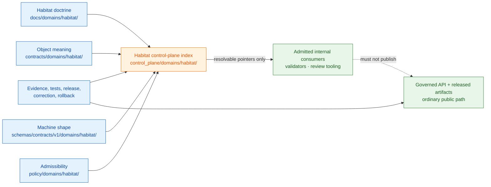

<!-- [KFM_META_BLOCK_V2]
doc_id: kfm://doc/control-plane-domains-habitat-readme
title: control_plane/domains/habitat/README.md — Habitat Control-Plane Domain Lane README
version: v0.2
type: readme; control-plane-domain-index; governance-lane-guide; nested-folder-contract
status: repository-grounded draft; PROPOSED register lane; child-registers-absent; nested-validation-not-implemented; non-authoritative
owners: NEEDS VERIFICATION — Control-plane steward · Habitat steward · Policy steward · Evidence steward · Release steward · Docs steward
created: NEEDS VERIFICATION — blank placeholder existed before v0.1 expansion
updated: 2026-07-24
supersedes: v0.1 at the same path
prepared_under_prompt: KFM Markdown Modernization & GitHub Documentation Implementation Agent v4.0.0
policy_label: repository-facing; control-plane; domains; habitat; governance-index; no-parallel-authority; no-direct-public-path; cite-or-abstain; correction-aware; rollback-aware
current_path: control_plane/domains/habitat/README.md
truth_posture: >
  CONFIRMED the tracked Habitat control-plane README, canonical control_plane responsibility root,
  Directory Rules v1.4 placement doctrine and README contract, root control-plane validation workflow,
  root register meta-contract tests, CODEOWNERS route, Habitat docs/contracts/schema/policy/fixtures/tests
  sibling README surfaces, absence of the seven previously proposed Habitat child-register files, and
  empty root domain-lane/object-family/policy-gate/release-state register bodies / PROPOSED future Habitat
  child registers and their admission contract / UNKNOWN exhaustive recursive lane inventory, semantic
  cross-root agreement, runtime consumers, branch-protection enforcement, deployment, and public effects /
  NEEDS VERIFICATION accountable owners, independent review, dedicated nested-register schemas,
  nested-lane CI coverage, populated Habitat entries, stale-reference checks, and rollback drills
evidence_snapshot:
  repository: bartytime4life/Kansas-Frontier-Matrix
  repository_id: "1059091169"
  visibility: public
  base_ref: main
  base_commit: 85a939fd8a3fbac6e76fc4eaf3ce6172398d186f
  prior_blob: 14cf3852acf3b308329121e402d3beb2e779f004
  directory_rules_blob: 2affb080e6f0043867c64c7f06c1ca52030fbd55
  control_plane_readme_blob: 5d58d7e361671b9bf66deb97766cff021ab8ac2f
  control_plane_domains_readme_blob: 59db9ada6c17aba05781f0a994dce1f27fd00330
  docs_control_plane_workflow_blob: 986fe1b4845c51f719bcfeeefe08729517ae543c
  register_meta_contract_test_blob: 05ebb49d07235ab77bd9dbf6717ee05a59e2f052
  codeowners_blob: dd2a84aa514d8ecd9208bc347f90f9a2ed37dd61
  habitat_docs_readme_blob: 876d1fa41a00d94d7120c6ef065750748e6bf524
  habitat_canonical_paths_blob: 837aa111f70b8df678b5545c72f92c1fdca73b66
  habitat_contracts_readme_blob: 65b5b259b3ac1887e6bb753f48d83d752ff0875a
  habitat_schema_readme_blob: ab7563e33cd7a70919a68a5452514566fc53dfa4
  habitat_policy_readme_blob: 8456c65196354695b8eb5b8178ecb61cfc12b7dd
  habitat_fixtures_readme_blob: 674c5acf8c2f1739762625e392616ce1034de0e6
  habitat_tests_readme_blob: 4503de9bcb1c92db45012d897d647fb39a9f7172
  domain_lane_register_blob: 81b23beb3178b59d5c1fdb50edbc9f98f8664930
  object_family_register_blob: 930a9da30d5481f8d7ed5b7789d7846a30d3f4e1
  policy_gate_register_blob: 10e66eb9d587797a3f12e2aaac00fb4e60ec7fa2
  release_state_register_blob: f576239f447045b04d7b30c540234d8641ceb7dc
  proposed_child_registers_checked: "7"
  proposed_child_registers_present: "0"
  open_overlapping_pull_requests_found: "0"
  inventory_method: exact GitHub file reads and exact-path absence probes at the pinned base; no recursive Git tree, branch-protection inspection, deployment, or runtime was inspected
related:
  - ../../README.md
  - ../README.md
  - ../../domain_lane_register.yaml
  - ../../object_family_register.yaml
  - ../../policy_gate_register.yaml
  - ../../release_state_register.yaml
  - ../../../docs/doctrine/directory-rules.md
  - ../../../docs/domains/habitat/README.md
  - ../../../docs/domains/habitat/CANONICAL_PATHS.md
  - ../../../contracts/domains/habitat/README.md
  - ../../../schemas/contracts/v1/domains/habitat/README.md
  - ../../../policy/domains/habitat/README.md
  - ../../../fixtures/domains/habitat/README.md
  - ../../../tests/domains/habitat/README.md
  - ../../../release/README.md
  - ../../../.github/workflows/docs-control-plane.yml
  - ../../../.github/CODEOWNERS
tags: [kfm, control-plane, habitat, domain-lane, governance-index, policy-gates, release-state, evidence, sensitivity, geoprivacy, correction, rollback]
notes:
  - "v0.2 is a same-path, no-loss modernization of the existing Habitat control-plane lane README."
  - "The first twelve H2 sections follow the Directory Rules §15 folder-README contract, with Status placed after Authority level as required."
  - "The seven child-register filenames named by v0.1 were checked at the pinned base and were absent."
  - "The current docs-control-plane workflow parses only control_plane/*.yaml and the current meta-contract test covers nine exact root registers; nested Habitat register validation is not implemented."
  - "This README indexes authority relationships. It does not create contracts, schemas, policy, source authority, evidence, release state, runtime behavior, or publication."
[/KFM_META_BLOCK_V2] -->

# `control_plane/domains/habitat/` — Habitat Governance-Index Lane

> **One-line purpose.** This lane may index **which Habitat contracts, schemas, policies, source roles, evidence requirements, tests, release gates, corrections, and rollback records govern which Habitat objects**—without becoming any of those authorities itself.

**Quick navigation:** [Purpose](#purpose) · [Authority](#authority-level) · [Status](#status) · [Belongs](#what-belongs-here) · [Does not belong](#what-does-not-belong-here) · [Inputs](#inputs) · [Outputs](#outputs) · [Validation](#validation) · [Review](#review-burden) · [Related](#related-folders) · [ADRs](#adrs) · [Last reviewed](#last-reviewed) · [Inventory](#current-bounded-inventory) · [Guardrails](#habitat-specific-guardrails) · [Register contract](#proposed-child-register-contract) · [Flow](#referential-governance-flow) · [Failure controls](#failure-controls) · [Correction](#correction-deprecation-and-rollback) · [Verification](#open-verification-register) · [No-loss](#v01-to-v02-no-loss-ledger) · [Summary](#status-summary)

> [!IMPORTANT]
> **An index points to authority; it does not manufacture authority.** A Habitat path, object-family name, policy-gate pointer, release-state pointer, or reason code is usable only when it resolves to the owning artifact and its evidence, review, and lifecycle state. Valid Markdown, valid YAML, a green workflow, a commit, or a merged pull request cannot turn an index entry into Habitat truth or KFM publication.

> [!WARNING]
> **The seven Habitat child registers proposed by v0.1 are not present at the pinned `main` snapshot.** The current workflow parses only root `control_plane/*.yaml`, and the current register meta-contract test names nine exact root registers. Do not claim nested Habitat register coverage, semantic closure, consumer readiness, or CI enforcement until dedicated files and checks are implemented and reviewed.

---

## Purpose

`control_plane/domains/habitat/` is the Habitat-domain segment of KFM's machine-readable governance-index responsibility root.

It exists to support bounded, auditable questions such as:

- Which Habitat object family is governed by which semantic contract, machine schema, policy surface, fixture/test lane, source registry, release record, correction notice, or rollback target?
- Which source-role, sensitivity, geoprivacy, review, and release gates apply to a Habitat product or cross-domain join?
- Which Habitat authority relationship is proposed, confirmed, contradicted, deprecated, stale, or awaiting verification?
- Which register consumer may rely on a pointer, and at what verified maturity?
- Where should a reviewer look when Habitat documentation, machine indexes, and implementation disagree?

This lane improves inspectability and coordination. It does not define Habitat objects, validate payloads, decide policy, activate sources, prove claims, approve releases, run public services, or publish layers.

[Back to top](#top)

---

## Authority level

| Surface | Authority posture |
|---|---|
| `control_plane/` | **Canonical responsibility root** for machine-readable governance indexes and crosswalks. |
| `control_plane/domains/` | Nested domain-index lane; its README defines the child-lane pattern but does not create domain truth. |
| This `README.md` | **Repository-facing boundary and inventory document.** It explains the Habitat index lane; it is not a machine register. |
| Future Habitat child registers | **PROPOSED index surfaces** until files, schemas, entries, review, validation, and consumers are verified. |
| Habitat human doctrine | Owned by [`docs/domains/habitat/`](../../../docs/domains/habitat/README.md). |
| Habitat object meaning | Owned by [`contracts/domains/habitat/`](../../../contracts/domains/habitat/README.md). |
| Habitat machine shape | Configured under [`schemas/contracts/v1/domains/habitat/`](../../../schemas/contracts/v1/domains/habitat/README.md); ADR-0001 remains proposed. |
| Habitat admissibility and sensitivity | Owned by [`policy/domains/habitat/`](../../../policy/domains/habitat/README.md) and applicable cross-domain sensitivity policy. |
| Evidence and proof | Owned by evidence/proof surfaces; a register pointer is not an `EvidenceBundle` or ProofPack. |
| Release, correction, and rollback | Owned by [`release/`](../../../release/README.md); an index cannot approve or alter release state. |
| Runtime and public response | Owned by governed applications and released artifacts; this lane has no ordinary public-client authority. |

Authority is **referential** here. When a pointer is unresolved, stale, contradicted, or outside its admitted consumer scope, consumers must fail closed rather than infer the missing relationship.

[Back to top](#top)

---

## Status

| Finding | Truth status | Current bounded result |
|---|---:|---|
| Target path and identity | `CONFIRMED` | This README exists at `control_plane/domains/habitat/README.md` with stable document ID `kfm://doc/control-plane-domains-habitat-readme`. |
| Owning responsibility root | `CONFIRMED` | `control_plane/` is the machine-readable governance-index root. |
| Habitat as a domain segment | `CONFIRMED doctrine` | Directory Rules place domains inside responsibility roots, not at repository root. |
| Habitat sibling authority surfaces | `CONFIRMED bounded` | Habitat README surfaces were read under `docs/`, `contracts/`, `schemas/`, `policy/`, `fixtures/`, and `tests/`. |
| Previously proposed child registers | `CONFIRMED absent` | All seven filenames named by v0.1 returned exact-path absence at the pinned base. |
| Root domain/object/policy/release registers | `CONFIRMED present, sparse` | The four relevant root registers exist and each currently has `entries: []`. |
| Root YAML syntax validation | `CONFIRMED implemented` | The workflow parses `control_plane/*.yaml`, rejects duplicate keys, and requires a mapping root. |
| Root register meta contract | `CONFIRMED implemented` | Tests cover nine exact root registers, required metadata, ISO review dates, related-doctrine paths, status vocabulary, owner presence, and an `entries:` body. |
| Nested Habitat YAML validation | `NOT IMPLEMENTED / NEEDS VERIFICATION` | The current workflow glob and exact-file test do not cover future `control_plane/domains/habitat/*.yaml` files. |
| Habitat register population | `UNKNOWN / absent` | No child register body exists to inspect; root Habitat mappings are not populated in the four relevant root registers. |
| Consumer correctness | `UNKNOWN` | No runtime or tool consumer of Habitat control-plane entries was established in this bounded review. |
| Review routing | `CONFIRMED routing / NEEDS VERIFICATION enforcement` | CODEOWNERS routes `/control_plane/` to `@bartytime4life`; required-review enforcement and independent stewardship were not verified. |
| Direct public use | `DENY` | Public and semi-public clients must use governed APIs and released, policy-allowed projections—not this lane. |

### Current tensions

1. **Documented child-register pattern versus repository reality.** The parent and v0.1 Habitat READMEs describe seven child-register names, but none exists at the pinned base.
2. **Root-only validation versus nested-lane ambition.** Existing YAML parsing and meta-contract tests are real but stop at the root register set.
3. **Configured schema path versus decision status.** `schemas/contracts/v1/domains/habitat/` exists as the configured lane, while ADR-0001 remains `proposed`; the index must preserve that distinction.
4. **Habitat path guidance versus inventory completeness.** Habitat canonical-path documentation is useful placement guidance, not proof that every named path or object family is implemented.

[Back to top](#top)

---

## What belongs here

Only machine-readable **governance-index and crosswalk material** for the Habitat domain belongs in this lane.

| Admissible surface | Purpose | Current status |
|---|---|---|
| `README.md` | Explains lane responsibility, authority boundaries, inventory, validation, review, correction, and rollback. | `CONFIRMED` |
| `domain_lane.yaml` | Indexes Habitat lane identity, responsibility-root pointers, maturity, and review references. | `PROPOSED / absent` |
| `object_family_map.yaml` | Maps Habitat object-family identifiers to owning contract, schema, policy, fixture/test, evidence, and release surfaces. | `PROPOSED / absent` |
| `policy_gate_map.yaml` | Points Habitat object/source roles to applicable policy gates and obligations without copying policy logic. | `PROPOSED / absent` |
| `release_gate_map.yaml` | Points candidate Habitat products to release, correction, withdrawal, and rollback requirements. | `PROPOSED / absent` |
| `reason_code_map.yaml` | Indexes reason-code definitions and their owning contracts/policies. | `PROPOSED / absent` |
| `sensitivity_matrix_ref.yaml` | Points to sensitivity and geoprivacy policy surfaces; it must not contain the policy itself. | `PROPOSED / absent` |
| `drift_register.yaml` | Records Habitat-specific path, identity, authority, deprecation, and verification conflicts. | `PROPOSED / absent` |

Any future file must preserve deterministic identity where practical, explicit truth/review state, resolvable owning paths, and correction/deprecation lineage. File presence alone is insufficient for consumer admission.

[Back to top](#top)

---

## What does NOT belong here

| Prohibited content | Owning surface |
|---|---|
| Habitat semantic contract prose | [`contracts/domains/habitat/`](../../../contracts/domains/habitat/README.md) |
| JSON Schema or other machine payload shape | [`schemas/contracts/v1/domains/habitat/`](../../../schemas/contracts/v1/domains/habitat/README.md) or a later accepted schema home |
| Rego, policy tables that decide outcomes, or sensitivity logic | [`policy/domains/habitat/`](../../../policy/domains/habitat/README.md) and applicable cross-domain policy roots |
| Synthetic fixtures or golden/invalid payloads | [`fixtures/domains/habitat/`](../../../fixtures/domains/habitat/README.md) |
| Tests, validator code, or executable checking logic | [`tests/domains/habitat/`](../../../tests/domains/habitat/README.md) and `tools/validators/` |
| `SourceDescriptor` instances, source activation decisions, or retrieved source material | Source registry and lifecycle data roots |
| RAW, WORK, QUARANTINE, PROCESSED, CATALOG/TRIPLET, or PUBLISHED data | `data/<phase>/habitat/` and release-governed published surfaces |
| `EvidenceRef`, `EvidenceBundle`, receipts, or proof objects as authoritative records | Evidence, receipt, and proof roots |
| Release manifests, `PromotionDecision`, correction notices, or rollback cards | [`release/`](../../../release/README.md) |
| API, UI, MapLibre, package, connector, pipeline, or runtime implementation | Their implementation responsibility roots |
| Direct public-client configuration or lookup path | Governed API and released-artifact surfaces |

This lane must never become a convenient parallel home for trust-bearing objects merely because they mention Habitat.

[Back to top](#top)

---

## Inputs

This lane may be maintained from the following **governed inputs**:

- [Directory Rules](../../../docs/doctrine/directory-rules.md), especially responsibility-root placement, Domain Placement Law, anti-parallel-authority controls, migration discipline, and the folder README contract.
- The [`control_plane/` root contract](../../README.md) and [`control_plane/domains/` child-lane contract](../README.md).
- Human Habitat doctrine and placement references, including the [Habitat lane README](../../../docs/domains/habitat/README.md) and [Habitat Canonical Paths](../../../docs/domains/habitat/CANONICAL_PATHS.md).
- Verified Habitat semantic contracts, schemas, policy, fixtures, tests, source descriptors, evidence/proof records, and release/correction records from their owning roots.
- Accepted ADRs and current ADR lifecycle state.
- Verified repository inventory, validators, workflows, review records, drift entries, and correction/deprecation records.

This lane must not ingest unreviewed generated prose, source payloads, map properties, model output, or inferred path relationships as if they were authority.

[Back to top](#top)

---

## Outputs

When implemented and admitted, Habitat control-plane files may support:

- machine-readable navigation from a Habitat identifier to its owning authority surface;
- cross-root consistency and stale-reference checks;
- reviewer and steward orientation;
- bounded validator discovery and consumer admission;
- drift, contradiction, deprecation, correction, and rollback planning;
- governance observability dashboards or reports that remain subordinate to the indexed evidence.

They must **not** emit or imply:

- Habitat truth, species occurrence truth, critical-habitat designation, or model fitness;
- source activation, rights clearance, sensitivity clearance, or geoprivacy approval;
- `ANSWER`, `ALLOW`, promotion, release, or publication authority;
- public tiles, API payloads, map layers, AI answers, or downloadable public products;
- proof that a referenced contract, schema, policy, validator, test, release, or runtime path is correct merely because the link exists.

Ordinary public and semi-public clients are denied direct reads of this lane. Any future machine consumer must have an explicit admission contract, fail-closed behavior, and a governed reason for using the index.

[Back to top](#top)

---

## Validation

### Implemented checks

The current [`docs-control-plane` workflow](../../../.github/workflows/docs-control-plane.yml) provides three bounded jobs:

1. `validate-control-plane-yaml` parses **root** `control_plane/*.yaml`, rejects duplicate mapping keys, and requires a mapping document root.
2. `registers-schema` runs [`tests/policy/test_control_plane_register_meta_contract.py`](../../../tests/policy/test_control_plane_register_meta_contract.py) against nine exact **root** register paths.
3. `adr-index-coherence` validates the canonical ADR inventory and its tested failure paths.

The current root register test checks:

- required root files;
- top-level `meta` presence;
- `status`, `owner`, `last_reviewed`, and `related_doctrine` metadata;
- ISO review dates that are not in the future;
- existing doctrine references;
- allowed root status values;
- a present `entries:` body.

### Explicit validation boundary

The implemented workflow and test **do not** establish:

- parsing or schema validation for `control_plane/domains/habitat/*.yaml`;
- a dedicated machine schema for any proposed Habitat child register;
- field-level semantics, cross-register agreement, pointer resolution, or complete population;
- Habitat source-role, sensitivity, evidence, policy, review, release, correction, or rollback correctness;
- consumer behavior, deployment isolation, branch-protection enforcement, or publication safety.

### README validation for this update

This README update is validated by:

- preserving the stable path and document ID;
- following the Directory Rules §15 folder-README section order;
- checking every introduced repository-relative Markdown link against a confirmed target file;
- verifying heading/fragment uniqueness and fenced Mermaid syntax structurally;
- recording exact child-register absence rather than presenting proposed files as implemented;
- verifying the remote branch bytes after mutation.

A future PR that creates Habitat child registers should add a dedicated nested-register schema/test lane before any consumer depends on them.

[Back to top](#top)

---

## Review burden

[`CODEOWNERS`](../../../.github/CODEOWNERS) currently routes `/control_plane/` changes to `@bartytime4life`.

That routing is **not** proof of review, stewardship assignment, independent approval, or release authority. Until verified assignments exist, material changes should receive review appropriate to impact from:

- control-plane/register stewardship;
- Habitat-domain stewardship;
- contract/schema stewardship when mappings change;
- policy and sensitivity stewardship when gate pointers or geoprivacy relationships change;
- evidence/source stewardship when source-role or EvidenceBundle relationships change;
- release/correction stewardship when release-state or rollback pointers change;
- validation/CI stewardship when machine consumers or checks change;
- docs stewardship for reader-facing contract changes.

A reviewer should request changes when an entry lacks an owning artifact, evidence, current status, review state, correction/deprecation path, or an admitted consumer need.

[Back to top](#top)

---

## Related folders

| Responsibility | Verified related surface | Relationship to this lane |
|---|---|---|
| Control-plane root | [`control_plane/README.md`](../../README.md) | Defines the canonical machine-index root, root registers, validation boundary, and public-path denial. |
| Domain-index parent | [`control_plane/domains/README.md`](../README.md) | Defines the nested domain governance-index pattern. |
| Root domain register | [`control_plane/domain_lane_register.yaml`](../../domain_lane_register.yaml) | Intended root index for domain lanes; currently `PROPOSED` with `entries: []`. |
| Root object-family register | [`control_plane/object_family_register.yaml`](../../object_family_register.yaml) | Intended object-family crosswalk; currently `PROPOSED` with `entries: []`. |
| Root policy-gate register | [`control_plane/policy_gate_register.yaml`](../../policy_gate_register.yaml) | Intended policy-gate index; currently `PROPOSED` with `entries: []`. |
| Root release-state register | [`control_plane/release_state_register.yaml`](../../release_state_register.yaml) | Intended release-state index; currently `PROPOSED` with `entries: []`. |
| Human Habitat doctrine | [`docs/domains/habitat/README.md`](../../../docs/domains/habitat/README.md) | Defines Habitat scope, source-role distinctions, object language, lifecycle, and cross-lane boundaries. |
| Habitat placement reference | [`docs/domains/habitat/CANONICAL_PATHS.md`](../../../docs/domains/habitat/CANONICAL_PATHS.md) | Enumerates proposed Habitat paths under Directory Rules; it does not prove path presence. |
| Habitat semantic contracts | [`contracts/domains/habitat/README.md`](../../../contracts/domains/habitat/README.md) | Owns Habitat object meaning. |
| Habitat machine shapes | [`schemas/contracts/v1/domains/habitat/README.md`](../../../schemas/contracts/v1/domains/habitat/README.md) | Configured Habitat schema index; canonical decision remains proposed under ADR-0001. |
| Habitat policy | [`policy/domains/habitat/README.md`](../../../policy/domains/habitat/README.md) | Owns Habitat policy-bearing materials; its own maturity remains draft/PROPOSED. |
| Habitat fixtures | [`fixtures/domains/habitat/README.md`](../../../fixtures/domains/habitat/README.md) | Owns bounded synthetic examples, not lifecycle data or authority. |
| Habitat tests | [`tests/domains/habitat/README.md`](../../../tests/domains/habitat/README.md) | Owns enforceability proof lanes; passing tests do not publish Habitat claims. |
| Release root | [`release/README.md`](../../../release/README.md) | Owns release decisions, manifests, correction, withdrawal, and rollback. |

[Back to top](#top)

---

## ADRs

| Decision surface | Current posture | Effect on this lane |
|---|---|---|
| [`ADR-0001 — Schema Home`](../../../docs/adr/ADR-0001-schema-home--schemas-contracts-v1-is-canonical.md) | `proposed`; configured path evidence exists | The index may point to the configured `schemas/contracts/v1/domains/habitat/` lane, but must not describe the ADR as accepted or migration-complete. |
| [`ADR-0004 — Governed API Trust Membrane`](../../../docs/adr/ADR-0004-apps-governed-api-is-the-trust-membrane.md) | source metadata `draft`; effective status `proposed`; bounded fail-closed scaffold exists | Reinforces that ordinary clients do not consume control-plane registers or canonical/internal stores directly. |

No ADR is created or accepted by this README. Any future change that creates a parallel schema, contract, policy, source, registry, proof, receipt, or release home requires the applicable Directory Rules and ADR path before implementation.

[Back to top](#top)

---

## Last reviewed

| Field | Value |
|---|---|
| **Last reviewed** | `2026-07-24` |
| **Review basis** | Exact repository file reads and exact-path absence probes on `main@85a939fd8a3fbac6e76fc4eaf3ce6172398d186f` |
| **Next review trigger** | Creation of any Habitat child register; change to root register contract; nested-validation implementation; consumer admission; relevant ADR status change; Habitat sensitivity or release-gate change; correction or migration |
| **Stale threshold** | Re-review within six months at the latest, or earlier when a trigger above occurs. |

[Back to top](#top)

---

## Current bounded inventory

### Confirmed tracked surface

| Path | Current state | Bounded interpretation |
|---|---|---|
| `control_plane/domains/habitat/README.md` | Present | The only confirmed Habitat child-lane artifact in the seven-name register plan plus README. |

### Previously proposed child registers

| Proposed path | Pinned-base result | Required disposition |
|---|---|---|
| `domain_lane.yaml` | Not found | Keep `PROPOSED`; create only with schema/test/review and root-register reconciliation. |
| `object_family_map.yaml` | Not found | Keep `PROPOSED`; do not infer mappings from docs alone. |
| `policy_gate_map.yaml` | Not found | Keep `PROPOSED`; do not copy policy logic into this lane. |
| `release_gate_map.yaml` | Not found | Keep `PROPOSED`; do not treat candidate paths as release approval. |
| `reason_code_map.yaml` | Not found | Keep `PROPOSED`; point to owning definitions when created. |
| `sensitivity_matrix_ref.yaml` | Not found | Keep `PROPOSED`; preserve deny-by-default and exact-location protections. |
| `drift_register.yaml` | Not found | Keep `PROPOSED`; use the canonical human drift register until a nested machine lane is admitted. |

### Relevant root registers

| Root register | Current status | Entries at pinned base |
|---|---:|---:|
| `domain_lane_register.yaml` | `PROPOSED` | `0` |
| `object_family_register.yaml` | `PROPOSED` | `0` |
| `policy_gate_register.yaml` | `PROPOSED` | `0` |
| `release_state_register.yaml` | `PROPOSED` | `0` |

The absence of Habitat entries is an implementation gap, not permission to generate them without source, authority, review, and validation closure.

[Back to top](#top)

---

## Habitat-specific guardrails

1. **Habitat is a domain segment, not a repository root.** Domain material remains inside the appropriate responsibility root.
2. **Habitat indexes are not Habitat truth.** A control-plane relationship never substitutes for source evidence, an `EvidenceBundle`, policy, review, release state, or correction lineage.
3. **Landscape and species truth remain separate.** Habitat owns landscape context, habitat classes, patches, suitability, connectivity, corridors, restoration opportunity, and stewardship-zone concepts. Fauna and Flora retain occurrence and taxonomic truth.
4. **Source roles do not collapse.** Observed, regulatory, modeled, aggregate, administrative, candidate, and synthetic material must remain distinguishable when indexed.
5. **Modeled suitability is not occurrence or designation.** A habitat suitability surface cannot be indexed as evidence that a species occurs there or that land is legally designated critical habitat.
6. **Sensitive joins fail closed.** Exact occurrence geometry, rare-species sites, nests, dens, roosts, hibernacula, spawning sites, culturally sensitive context, and other protected precision require policy-governed denial, restriction, redaction, generalization, or staged access.
7. **Pointers do not bypass lifecycle.** RAW → WORK / QUARANTINE → PROCESSED → CATALOG / TRIPLET → PUBLISHED remains intact; promotion is a governed state transition.
8. **Public clients do not read registers directly.** Governed APIs and released, policy-allowed projections remain the public path.
9. **Watchers and connectors do not publish.** Source-change observations may generate candidates and receipts only.
10. **Correction remains visible.** Superseded, contradicted, deprecated, or withdrawn relationships must retain forward and backward lineage.

[Back to top](#top)

---

## Proposed child-register contract

This is a **PROPOSED admission contract**, not an implemented schema.

A future Habitat child register should not be consumed merely because it parses. Before consumer admission, it should demonstrate:

| Requirement | Minimum expectation |
|---|---|
| Stable identity | Register identity and entry identity are deterministic where practical. |
| Root-compatible metadata | `status`, nonempty owner or accountable role reference, ISO `last_reviewed`, related doctrine, and an entries body. |
| Owning-authority pointer | Every entry resolves to the root that owns meaning, shape, policy, source, evidence, test, release, or correction state. |
| Truth and review state | Proposed, confirmed, conflicted, deprecated, or verification-needed status is explicit and evidence-backed. |
| Evidence location | Consequential relationships cite a repository path, immutable revision, schema pointer, test, receipt, review, or release record appropriate to the claim. |
| No copied authority | Policy logic, schema definitions, contract prose, source records, evidence bodies, and release decisions remain in their owning roots. |
| Stale behavior | Missing, moved, contradicted, or out-of-date targets produce a finite fail-closed result. |
| Correction/deprecation | Supersession, correction, deprecation, and rollback references are preserved. |
| Consumer scope | Each admitted consumer and allowed use is named; ordinary public-client use remains denied. |
| Validation | Syntax, duplicate-key, field-shape, pointer-resolution, semantic-coherence, stale-reference, and negative-path checks are defined and tested. |

Until a dedicated schema and test lane exists, these requirements are documentation guidance only.

[Back to top](#top)

---

## Referential governance flow

The index is downstream of its owning authority surfaces and upstream only of admitted internal governance consumers. Public truth still flows from evidence, policy, review, release, and correction closure—not from the index.

[Back to top](#top)

---

## Failure controls

| Failure or ambiguity | Required posture |
|---|---|
| Owning path is missing | Mark unresolved; do not infer a replacement. |
| Two paths claim the same authority | Mark `CONFLICTED`; open drift/ADR work; do not choose silently. |
| Referenced status is stale | Fail closed for consequential consumers; request re-verification. |
| Policy pointer is missing or unknown | `DENY`, `HOLD`, or `ABSTAIN` according to the governing contract; never default allow. |
| Evidence pointer does not resolve | `ABSTAIN` for evidence-dependent claims. |
| Sensitive precision is unclear | Deny, restrict, redact, generalize, or stage access; record the transform and reason. |
| Release or rollback pointer is missing | Hold publication-facing use. |
| Nested register lacks validation | Do not admit machine consumers. |
| Human docs and machine index disagree | Preserve both as evidence, mark conflict, and route correction through the owning authority. |
| Register consumer attempts public exposure | Deny and treat as a trust-membrane violation. |

[Back to top](#top)

---

## Correction, deprecation, and rollback

Corrections to this lane should be additive and traceable:

1. Identify the incorrect or stale relationship and its evidence snapshot.
2. Verify the owning artifact and current authority state.
3. Update the human explanation and machine index together when both are in scope.
4. Preserve prior identifiers or add an explicit supersession/deprecation mapping.
5. Re-run syntax, field, pointer, semantic, and consumer checks appropriate to the change.
6. Record affected consumers, correction propagation, and rollback target.
7. Never delete a contradiction, denial, correction, or supersession merely to make the index look clean.

Rollback is required if this lane begins to:

- define Habitat object meaning or machine shape;
- copy or execute policy logic;
- store source, evidence, receipt, proof, lifecycle, or release objects as authority;
- expose a normal public route or direct client lookup;
- treat modeled Habitat as species occurrence or regulatory designation;
- bypass geoprivacy, sensitivity, review, release, correction, or rollback gates;
- admit consumers before nested validation and stale-reference controls exist.

For this README update, the immediate content rollback target is prior blob `14cf3852acf3b308329121e402d3beb2e779f004`.

[Back to top](#top)

---

## Open verification register

| ID | Verification item | Current status | Closure evidence |
|---|---|---|---|
| `HCP-V-001` | Assign accountable owner and reviewer roles without converting role names into unverified GitHub identities. | `NEEDS VERIFICATION` | Stewardship assignment and review record. |
| `HCP-V-002` | Decide whether Habitat-specific child registers are needed or whether populated root registers are sufficient. | `OPEN / PROPOSED` | Reviewed design decision and consumer inventory. |
| `HCP-V-003` | Define dedicated schemas for any admitted Habitat child registers. | `NOT IMPLEMENTED` | Schema files, valid/invalid fixtures, and tests. |
| `HCP-V-004` | Extend CI to parse and validate nested control-plane YAML without overclaiming semantics. | `NOT IMPLEMENTED` | Workflow diff and passing negative-path tests. |
| `HCP-V-005` | Populate root Habitat mappings in domain/object/policy/release registers if those registers remain the canonical machine index. | `OPEN` | Reviewed entries with resolvable evidence. |
| `HCP-V-006` | Verify cross-root Habitat object-family, path, and source-role agreement. | `UNKNOWN` | Contract/schema/policy/source/test crosswalk report. |
| `HCP-V-007` | Define consumer-admission and fail-closed behavior for each machine consumer. | `UNKNOWN` | Consumer contract and integration tests. |
| `HCP-V-008` | Verify stale-reference, correction propagation, deprecation, and rollback drills. | `NOT RUN` | Drill receipt and restored state. |
| `HCP-V-009` | Reconcile ADR-0001 lifecycle status with the configured Habitat schema lane and any compatibility paths. | `NEEDS VERIFICATION` | Reviewed ADR/index status plus migration/deprecation evidence. |
| `HCP-V-010` | Verify branch protection and required CODEOWNERS review for `/control_plane/`. | `NEEDS VERIFICATION` | Repository ruleset evidence. |

[Back to top](#top)

---

## v0.1 to v0.2 no-loss ledger

| v0.1 material | v0.2 disposition |
|---|---|
| Stable document ID and same path | Preserved. |
| Governance-index purpose | Preserved and tightened into the §15 folder contract. |
| Control-plane versus contracts/schemas/policy/data/release boundary | Preserved and expanded with verified sibling README links. |
| Seven suggested child-register names | Preserved, but reclassified from generic suggestions to exact `PROPOSED / absent` inventory findings. |
| Habitat sensitivity and geoprivacy guardrails | Preserved and expanded with source-role and modeled-versus-occurrence anti-collapse rules. |
| Public clients must not read registers directly | Preserved and elevated into authority, outputs, flow, and failure-control sections. |
| Validation checklist | Preserved as implemented-versus-missing validation evidence and an open verification register. |
| Rollback rule and original blank-blob lineage | Preserved in metadata; current README rollback target updated to the v0.1 blob. |
| Badge strip and navigation | Replaced with a smaller evidence-bearing badge strip and expanded navigation. |
| Generic `OWNER_TBD` role list | Preserved as `NEEDS VERIFICATION`; CODEOWNERS routing is separately documented as confirmed. |
| Claim that child files were merely “suggested” | Strengthened with exact absence probes and root-register sparsity evidence. |

No v0.1 governance boundary was intentionally removed. The substantive change is stronger repository grounding, exact status separation, Directory Rules §15 conformance, explicit validation limits, correction/rollback controls, and a buildable verification backlog.

[Back to top](#top)

---

## Status summary

| Dimension | Current result |
|---|---|
| Document outcome | **UPGRADED** — same path, same stable ID, no parallel README. |
| Lane authority | Canonical responsibility-root segment for Habitat governance indexes; non-authoritative with respect to the objects it indexes. |
| Child register inventory | `0 / 7` previously proposed files confirmed present at the pinned base. |
| Root register readiness | Relevant root registers exist but currently contain no entries. |
| Validation maturity | Root syntax/meta checks implemented; nested Habitat register validation not implemented. |
| Consumer maturity | UNKNOWN; no admitted Habitat control-plane consumer established. |
| Public path | DENY direct use; governed APIs and released artifacts only. |
| Next smallest safe change | Decide root-versus-child register strategy, then add schema + fixtures + negative tests before creating or consuming a Habitat register. |
| Publication effect | None. This README, its branch, commit, checks, or pull request do not publish Habitat data or accept an ADR. |

---

<a href="#top">Back to top</a>

