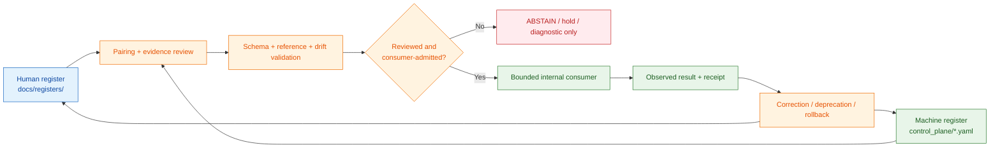

<!-- [KFM_META_BLOCK_V2]
doc_id: kfm://doc/control-plane-registers-readme
title: control_plane/registers/README.md — Control-Plane Register Profile and Pairing Lane
version: v0.2
type: readme; control-plane-register-profile; nested-folder-contract; human-machine-pairing-guide
status: repository-grounded draft; required-registers-at-root; child-yaml-absent; drift-profile-present; semantic-validation-partial; non-authoritative
owners: NEEDS VERIFICATION — Control-plane steward · Register steward · Docs steward · Policy steward · Evidence steward · Release steward · Validation/CI steward
created: NEEDS VERIFICATION — blank placeholder existed before v0.1 expansion
updated: 2026-07-24
supersedes: v0.1 at the same path
prepared_under_prompt: KFM Markdown Modernization & GitHub Documentation Implementation Agent v4.0.0
policy_label: repository-facing; control-plane; registers; governance-index; no-parallel-authority; no-direct-public-path; cite-or-abstain; correction-aware; rollback-aware
current_path: control_plane/registers/README.md
truth_posture: >
  CONFIRMED the tracked register-lane README, canonical control_plane responsibility root,
  Directory Rules v1.4 placement doctrine and folder-README contract, nine required root
  register paths, current root-YAML parser and register meta-contract tests, CODEOWNERS route,
  one populated required root register, eight empty required root registers, the child
  DRIFT_REGISTER.md profile, absence of the seven previously proposed child YAML registers,
  human drift and verification entries, and empty machine contradiction/deprecation/
  verification registers / PROPOSED root-only register authority, optional generated
  projections, register-pairing rules, admission and consumer contracts, maturity vocabulary,
  drift synchronization, and correction workflow / CONFLICTED sparse PROPOSED machine
  registers versus human prose that describes some machine registers as authoritative,
  and current root register paths versus the optional control_plane/registers/ placement
  pattern / UNKNOWN exhaustive recursive inventory, every register consumer, cross-register
  semantic agreement, branch-protection enforcement, deployment, and public effects /
  NEEDS VERIFICATION accountable owners, independent review, per-register schemas,
  populated inventories, stale-reference checks, machine drift representation, and rollback drills
evidence_snapshot:
  repository: bartytime4life/Kansas-Frontier-Matrix
  repository_id: "1059091169"
  visibility: public
  base_ref: main
  base_commit: d38b2886d1786eeaf0e8ec1f1ab83da5f0c93b3a
  prior_blob: 61b30da67fb8cc8afea109bcba777a57a6daf8f4
  directory_rules_blob: 2affb080e6f0043867c64c7f06c1ca52030fbd55
  control_plane_readme_blob: 5d58d7e361671b9bf66deb97766cff021ab8ac2f
  child_drift_profile_blob: 2c472bd2552b758d365a8e9311aaa19ff4d5d7b9
  docs_drift_register_blob: 5c5078b93c467e66f4cc8b86a7a696dbce5ae7e0
  docs_verification_backlog_blob: ec66084a9de71f569f2a8291776647f9bbbaef71
  docs_document_registry_blob: fed5f51408ad015a26006c8521154e9fd47d54c9
  docs_object_family_map_blob: d517029ba4cefe4b36c6ba96c6cf31d9195cd9ae
  docs_authority_ladder_blob: 59ee23649e81d473de72259ebd4b73154d6867eb
  docs_canonical_lineage_blob: d04304071eebf7746a113daa8e7c4ffd9d62d94a
  document_registry_blob: 217a13a9f7d9eeb6ee6ea0bf6eaa90a707a32f1a
  source_authority_register_blob: 82c23722520922f5ca0dad7f37ed794d1c2edf81
  object_family_register_blob: 930a9da30d5481f8d7ed5b7789d7846a30d3f4e1
  domain_lane_register_blob: 81b23beb3178b59d5c1fdb50edbc9f98f8664930
  policy_gate_register_blob: 10e66eb9d587797a3f12e2aaac00fb4e60ec7fa2
  release_state_register_blob: f576239f447045b04d7b30c540234d8641ceb7dc
  verification_backlog_blob: d0fd8552e4ad90f80ea0c04a2607f9e85c7b1b9d
  contradiction_register_blob: b6fbab5395e315a9de7142f07abe27d091ca5011
  deprecation_register_blob: 1fb7219dcdb7a437e38fa8ca92ba34e29667d3fa
  authority_ladder_blob: b67e6fe99b8e9f6c098b9c1eb332dd4cade6cad8
  docs_control_plane_workflow_blob: 986fe1b4845c51f719bcfeeefe08729517ae543c
  register_meta_contract_test_blob: 05ebb49d07235ab77bd9dbf6717ee05a59e2f052
  codeowners_blob: dd2a84aa514d8ecd9208bc347f90f9a2ed37dd61
  required_registers: "9"
  required_registers_with_entries: "1"
  required_registers_empty: "8"
  proposed_child_yaml_checked: "7"
  proposed_child_yaml_present: "0"
  open_overlapping_pull_requests_found: "0"
  inventory_method: exact GitHub file reads, exact child-path absence probes, workflow/test inspection, and open-PR overlap search; no recursive Git tree, branch-protection inspection, deployment, or runtime was inspected
related:
  - ../README.md
  - ../document_registry.yaml
  - ../source_authority_register.yaml
  - ../object_family_register.yaml
  - ../domain_lane_register.yaml
  - ../policy_gate_register.yaml
  - ../release_state_register.yaml
  - ../verification_backlog.yaml
  - ../contradiction_register.yaml
  - ../deprecation_register.yaml
  - ../authority_ladder.yaml
  - ./DRIFT_REGISTER.md
  - ../../docs/doctrine/directory-rules.md
  - ../../docs/registers/DOCUMENT_REGISTRY.md
  - ../../docs/registers/DRIFT_REGISTER.md
  - ../../docs/registers/VERIFICATION_BACKLOG.md
  - ../../docs/registers/OBJECT_FAMILY_MAP.md
  - ../../docs/registers/AUTHORITY_LADDER.md
  - ../../docs/registers/CANONICAL_LINEAGE_EXPLORATORY.md
  - ../../contracts/README.md
  - ../../schemas/README.md
  - ../../policy/README.md
  - ../../data/README.md
  - ../../release/README.md
  - ../../tests/README.md
  - ../../tools/validators/README.md
  - ../../docs/adr/INDEX.md
  - ../../.github/workflows/docs-control-plane.yml
  - ../../.github/CODEOWNERS
tags: [kfm, control-plane, registers, governance-index, human-machine-pairing, drift, verification, authority, deprecation, correction, rollback]
notes:
  - "v0.2 is a same-path, no-loss modernization of the existing register-lane README."
  - "The first twelve H2 sections follow Directory Rules section 15 exactly."
  - "The current enforceable register paths remain at control_plane/ root; this README does not move or duplicate them."
  - "Seven child YAML paths proposed by v0.1 were checked and were absent."
  - "control_plane/registers/DRIFT_REGISTER.md is a Markdown profile, not a validated machine drift register."
  - "Human drift and verification registers contain entries while the corresponding root machine verification, contradiction, and deprecation registers are empty."
  - "This README does not populate registers, create schemas, accept ADRs, approve policy, alter release state, promote data, expose a public route, deploy, or publish."
[/KFM_META_BLOCK_V2] -->

<a id="top"></a>

# `control_plane/registers/` — Register Profile and Pairing Lane

[](#status)
[](#current-bounded-inventory)
[](#root-register-population)
[](#current-bounded-inventory)
[](#validation)
[](#outputs)

> **One-line purpose.** `control_plane/registers/` documents register profiles, human–machine pairing rules, and unresolved register-placement questions without becoming a second machine-register authority beside the required files at `control_plane/` root.

**Quick navigation:** [Purpose](#purpose) · [Authority](#authority-level) · [Status](#status) · [Belongs](#what-belongs-here) · [Does not belong](#what-does-not-belong-here) · [Inputs](#inputs) · [Outputs](#outputs) · [Validation](#validation) · [Review](#review-burden) · [Related](#related-folders) · [ADRs](#adrs) · [Last reviewed](#last-reviewed) · [Inventory](#current-bounded-inventory) · [Population](#root-register-population) · [Pairing](#human-and-machine-pairing) · [Drift gap](#drift-and-verification-representation-gap) · [Strategy](#root-versus-sublane-register-strategy) · [Admission](#register-admission-contract) · [Consumers](#consumer-admission-and-maturity) · [Flow](#referential-governance-flow) · [Failures](#failure-controls) · [Correction](#correction-deprecation-and-rollback) · [Verification](#open-verification-register) · [Evidence](#evidence-ledger) · [No-loss](#v01-to-v02-no-loss-ledger) · [Summary](#status-summary)

> [!IMPORTANT]
> **The current machine-register contract is root-level.** Nine exact register files under `control_plane/*.yaml` are required by repository tests. This sublane does not authorize copies, moves, aliases, or divergent child registers.

> [!WARNING]
> **Human register prose is materially richer than current machine population.** The human drift and verification files carry dated entries, while eight of the nine required root machine registers are empty. A narrative entry, valid YAML shell, passing meta-contract, badge, commit, pull request, or merge is not semantic closure.

> [!CAUTION]
> **No ordinary public client reads this lane or a raw register directly.** Public and semi-public surfaces consume governed APIs and released, policy-allowed artifacts. A register may guide a backend validator or reviewer only after its consumer contract and maturity are verified.

---

<a id="purpose"></a>

## Purpose

`control_plane/registers/` is a nested documentation and profile lane beneath KFM's canonical machine-readable governance-index root.

It exists to make register design and pairing inspectable:

- explain what each register is intended to index;
- describe the boundary between human narrative under `docs/registers/` and machine indexes under `control_plane/`;
- document proposed shapes, status vocabularies, evidence requirements, and consumer constraints before machine adoption;
- surface conflicts between root register paths and proposed child placements;
- expose drift when human narratives, machine entries, doctrine, and implementation disagree;
- preserve correction, deprecation, and rollback expectations for register evolution.

It does not define canonical object meaning, field shape, policy, source authority, evidence, lifecycle state, release state, runtime behavior, or public truth.

[Back to top](#top)

---

<a id="authority-level"></a>

## Authority level

| Surface | Authority posture |
|---|---|
| [`control_plane/`](../README.md) | **Canonical responsibility root** for machine-readable governance indexes and crosswalks. |
| Required root YAML paths | **Repository-required surfaces** because the current meta-contract test names nine exact files. |
| Register metadata and entries | Referential index claims only; their authority depends on resolvable owning artifacts, review, and evidence. |
| This `README.md` | Repository-facing lane contract and inventory; not a machine register. |
| [`DRIFT_REGISTER.md`](./DRIFT_REGISTER.md) | Draft Markdown profile for a possible machine drift register; not a validated YAML instance. |
| `docs/registers/` files | Human-readable context and review history; they do not replace machine indexes or stronger authorities. |
| Object meaning | Owned by [`contracts/`](../../contracts/README.md). |
| Machine shape | Owned by [`schemas/`](../../schemas/README.md). |
| Admissibility, rights, and sensitivity | Owned by [`policy/`](../../policy/README.md). |
| Lifecycle records, receipts, and proofs | Owned by [`data/`](../../data/README.md) and its governed phases. |
| Release, correction, and rollback decisions | Owned by [`release/`](../../release/README.md). |
| Runtime and public response | Owned by governed applications and released artifacts; this lane has no ordinary public-client authority. |

Authority is **referential**. A path or identifier in a register is usable only when it resolves to the owning artifact and the register's maturity permits the proposed consumer. Unresolved or contradicted references fail closed.

[Back to top](#top)

---

<a id="status"></a>

## Status

| Finding | Truth status | Current bounded result |
|---|---:|---|
| Lane path and README | `CONFIRMED` | `control_plane/registers/README.md` exists with stable `kfm://doc/control-plane-registers-readme` identity. |
| Required root machine registers | `CONFIRMED / ENFORCED` | Nine exact root YAML files are named by `test_control_plane_register_meta_contract.py`. |
| Required root-register metadata | `CONFIRMED / ENFORCED` | Current tests require status, owner, ISO review date, related doctrine, and an `entries:` body. |
| Root YAML syntax | `CONFIRMED / ENFORCED` | Workflow parses root `control_plane/*.yaml`, rejects duplicate keys, and requires a mapping root. |
| Register population | `CONFIRMED BOUNDED` | `document_registry.yaml` has one entry; eight required root registers are empty. |
| Child Markdown profiles | `CONFIRMED BOUNDED` | This README and `registers/DRIFT_REGISTER.md` were read. |
| Proposed child YAML | `CONFIRMED ABSENT AT SNAPSHOT` | Seven v0.1 child YAML paths were probed and were not present. |
| Human drift narrative | `CONFIRMED` | `docs/registers/DRIFT_REGISTER.md` contains dated drift records through 2026-07-22. |
| Human verification narrative | `CONFIRMED` | `docs/registers/VERIFICATION_BACKLOG.md` contains open and resolved entries. |
| Machine drift representation | `UNKNOWN / CONFLICTED` | No `drift_register.yaml` was established; root contradiction, deprecation, and verification registers exist but are empty. |
| Per-register field schemas | `NEEDS VERIFICATION` | Current workflow explicitly does not claim a dedicated schema for every register field. |
| Semantic and cross-register coherence | `UNKNOWN / PARTIAL` | No general proof establishes complete resolution, agreement, freshness, or consumer correctness. |
| Review routing | `CONFIRMED ROUTING / NEEDS VERIFICATION ENFORCEMENT` | CODEOWNERS routes `/control_plane/` and `/docs/registers/` to `@bartytime4life`; independent stewardship and required review were not established. |
| Direct public use | `DENY` | Placement never authorizes public register consumption. |

### Current tensions

1. **Root paths versus sublane proposal.** The enforceable contract names root-level files, while v0.1 proposed equivalent child YAML paths.
2. **Human detail versus machine sparsity.** Human drift and verification narratives contain material entries, while related machine registers are empty.
3. **Profile versus instance.** `registers/DRIFT_REGISTER.md` describes an intended machine shape but is not a machine register.
4. **Machine-authoritative wording versus proposed status.** `DOCUMENT_REGISTRY.md` calls its YAML counterpart canonical, but that YAML is `PROPOSED` and contains one entry.
5. **Syntax/meta validity versus semantic closure.** A file can pass current checks while empty, stale, unresolved, or unsafe for consumers.
6. **Pairing vocabulary versus actual one-to-one coverage.** Human and machine names do not yet form a complete, verified pairing map.

[Back to top](#top)

---

<a id="what-belongs-here"></a>

## What belongs here

Only bounded register-profile and pairing material belongs in this sublane:

| Material | Purpose |
|---|---|
| `README.md` | Defines this lane, current placement, pairing, admission, and maintenance boundaries. |
| Register profile Markdown | Explains intended meaning, fields, states, failure rules, and evidence burden before machine adoption. |
| Pairing maps | Documents the human narrative, root machine register, schema, validator, and consumer relationship. |
| Migration notes | Plans a reviewed, reversible move or projection without changing authority by implication. |
| Compatibility notes | Declares a mirror, alias, generated projection, or deprecated path and its sunset conditions. |
| Register design examples | Small, non-authoritative examples clearly marked PROPOSED and not consumed as production state. |
| Review checklists | Bounded criteria for admitting a register or consumer. |
| Drift explanations | Human-readable descriptions of register mismatch that point to the human drift register or accepted remediation record. |

A profile may propose a field or state vocabulary. It must identify that proposal and cannot treat its own examples as accepted machine records.

[Back to top](#top)

---

<a id="what-does-not-belong-here"></a>

## What does NOT belong here

| Do not place here | Owning home |
|---|---|
| A second mutable copy of a required root register | Existing `control_plane/*.yaml` path unless a reviewed migration changes it |
| Human governance register bodies | `docs/registers/` |
| Semantic object contracts | `contracts/` |
| JSON Schema or equivalent machine-shape definitions | `schemas/` |
| Policy code or `PolicyDecision` records | `policy/` and governed decision stores |
| `SourceDescriptor` instances or source payloads | Source registry and lifecycle roots |
| `EvidenceRef`, `EvidenceBundle`, receipts, or proofs | Evidence, receipt, and proof surfaces |
| RAW, WORK, QUARANTINE, PROCESSED, CATALOG, TRIPLET, or PUBLISHED payloads | `data/` lifecycle roots |
| Release manifests, promotion decisions, correction notices, or rollback cards | `release/` |
| Executable validators | `tools/validators/` |
| Validator-only fixtures or executable tests | `fixtures/` and `tests/` according to their root contracts |
| Runtime, API, UI, connector, pipeline, or watcher code | Their implementation responsibility roots |
| Secrets, private data, restricted coordinates, or embedded evidence payloads | Never in a public register profile; use governed restricted stores |
| Generated claims of approval, remediation, release, or publication | No documentation or register may manufacture these states |

[Back to top](#top)

---

<a id="inputs"></a>

## Inputs

Register profiles and pairing notes may be derived from:

1. current Directory Rules and accepted ADRs;
2. exact machine-register bytes and current register tests;
3. human register narratives and recorded review history;
4. semantic contracts, machine schemas, and policy references;
5. source, evidence, lifecycle, and release records;
6. validators, fixtures, workflow definitions, and observed run evidence;
7. drift, correction, deprecation, and rollback records;
8. explicit steward decisions.

Repository content is evidence, not an instruction to bypass higher authority. A profile must not absorb source payloads or sensitive evidence merely to make a register self-contained.

[Back to top](#top)

---

<a id="outputs"></a>

## Outputs

This lane may support:

- clearer root-register maintenance and review;
- human–machine pairing maps;
- proposed schemas and validator requirements routed to their owning roots;
- drift and verification work items;
- migration or deprecation plans;
- bounded consumer-admission decisions;
- correction and rollback instructions for register changes.

This lane does **not** emit source truth, EvidenceBundles, PolicyDecisions, lifecycle promotion, release approval, public claims, deployed configuration, or publication.

Downstream tools must consume the admitted machine register at its approved path—not prose or examples from this lane.

[Back to top](#top)

---

<a id="validation"></a>

## Validation

### Implemented checks

The current `docs-control-plane` workflow:

- parses tracked root `control_plane/*.yaml` files with `PyYAML==6.0.3`;
- rejects duplicate mapping keys;
- requires a mapping at each YAML document root;
- runs the nine-file register meta-contract test;
- validates ADR-index coherence in a separate job.

The current register test checks:

- nine exact required root files;
- a top-level `meta:` block;
- `status`, `owner`, `last_reviewed`, and `related_doctrine`;
- ISO and non-future review dates;
- status limited to `PROPOSED` or `CONFIRMED`;
- an `entries:` body;
- existence of referenced doctrine paths.

### Checks not established

Current evidence does not establish:

- recursive `control_plane/registers/**/*.yaml` parsing;
- a dedicated schema for each register family;
- field-level entry validation;
- stable ID uniqueness across registers;
- reference resolution to contracts, schemas, policy, evidence, release, and correction artifacts;
- human–machine pair agreement;
- stale-reference and stale-review detection;
- cross-register contradiction checks;
- consumer allowlists or maturity gates;
- sensitivity-aware redaction of register content;
- complete population;
- rollback or retirement drills.

A green workflow proves only the checks it ran against the checked revision.

### Local documentation validation for this README

A documentation update should verify:

- one H1 and the required first twelve H2 sections in order;
- balanced Markdown fences and valid HTML anchors;
- internal fragment integrity;
- repository-relative link targets;
- no accidental machine-register or sensitive payload introduction;
- no unsupported claims of authority, validation, review, release, or publication.

[Back to top](#top)

---

<a id="review-burden"></a>

## Review burden

Current executable routing is provided by [`.github/CODEOWNERS`](../../.github/CODEOWNERS), which routes both `/control_plane/` and `/docs/registers/` to `@bartytime4life`.

That route proves GitHub ownership configuration only. It does not prove accountable stewardship, independent approval, separation of duties, or that review occurred.

| Change | Minimum review burden |
|---|---|
| README clarification or dead-link repair | Control-plane or docs maintainer |
| New register profile | Control-plane/register steward plus owner of the indexed authority |
| New machine register or entry family | Register, schema, validation, and affected authority owners |
| Rights, sensitivity, source, evidence, or public-surface pointer | Policy/sensitivity, source/evidence, and affected domain reviewers |
| Release/correction/rollback pointer | Release and evidence reviewers |
| Consumer admission | Register, consumer, policy/security, and validation owners |
| Root-to-sublane move or parallel projection | Architecture/docs/register reviewers; ADR or migration decision where authority changes |
| Status promotion to `CONFIRMED` | Evidence-backed steward review; never self-promoted by an authoring tool |

[Back to top](#top)

---

<a id="related-folders"></a>

## Related folders

| Surface | Relationship |
|---|---|
| [`control_plane/`](../README.md) | Canonical machine-index responsibility root and current required-register home. |
| [`document_registry.yaml`](../document_registry.yaml) | One populated required root register; current inventory remains sparse. |
| [`source_authority_register.yaml`](../source_authority_register.yaml) | Required source-authority index; empty at the snapshot. |
| [`object_family_register.yaml`](../object_family_register.yaml) | Required object-family index; empty at the snapshot. |
| [`domain_lane_register.yaml`](../domain_lane_register.yaml) | Required domain-lane index; empty at the snapshot. |
| [`policy_gate_register.yaml`](../policy_gate_register.yaml) | Required policy-gate index; empty at the snapshot. |
| [`release_state_register.yaml`](../release_state_register.yaml) | Required release-state index; empty at the snapshot. |
| [`verification_backlog.yaml`](../verification_backlog.yaml) | Required machine verification backlog; empty at the snapshot. |
| [`contradiction_register.yaml`](../contradiction_register.yaml) | Required contradiction index; empty at the snapshot. |
| [`deprecation_register.yaml`](../deprecation_register.yaml) | Required deprecation index; empty at the snapshot. |
| [`authority_ladder.yaml`](../authority_ladder.yaml) | Supplemental PROPOSED authority-ladder index with an empty `rungs` body. |
| [`DRIFT_REGISTER.md`](./DRIFT_REGISTER.md) | Draft machine-drift profile; not a YAML register. |
| [`docs/registers/DOCUMENT_REGISTRY.md`](../../docs/registers/DOCUMENT_REGISTRY.md) | Human document-registry narrative; its canonicality wording exceeds current machine population. |
| [`docs/registers/DRIFT_REGISTER.md`](../../docs/registers/DRIFT_REGISTER.md) | Human drift record with dated entries. |
| [`docs/registers/VERIFICATION_BACKLOG.md`](../../docs/registers/VERIFICATION_BACKLOG.md) | Human verification backlog with open/resolved entries. |
| [`docs/registers/OBJECT_FAMILY_MAP.md`](../../docs/registers/OBJECT_FAMILY_MAP.md) | PROPOSED naming-parity scaffold paired with the empty machine register. |
| [`docs/registers/AUTHORITY_LADDER.md`](../../docs/registers/AUTHORITY_LADDER.md) | PROPOSED human parity scaffold paired with an empty machine ladder. |
| [`docs/registers/CANONICAL_LINEAGE_EXPLORATORY.md`](../../docs/registers/CANONICAL_LINEAGE_EXPLORATORY.md) | PROPOSED human register with no initial entries. |
| [`schemas/`](../../schemas/README.md) | Owns machine shape. |
| [`policy/`](../../policy/README.md) | Owns admissibility, rights, sensitivity, and obligations. |
| [`tests/`](../../tests/README.md) and [`tools/validators/`](../../tools/validators/README.md) | Own enforceability proof and validation implementation. |
| [`data/`](../../data/README.md) | Owns lifecycle records, receipts, proofs, catalog/triplet outputs, and published artifacts. |
| [`release/`](../../release/README.md) | Owns release, correction, withdrawal, and rollback decisions. |

[Back to top](#top)

---

<a id="adrs"></a>

## ADRs

No accepted ADR was verified as establishing `control_plane/registers/` as a replacement home for the required root registers.

Applicable decision areas include:

- root versus sublane machine-register placement;
- human–machine pairing authority and sync rules;
- dedicated register schema home and versioning;
- stable identifier and status vocabularies;
- generated projections or compatibility mirrors;
- consumer admission and fail-closed behavior;
- drift/contradiction/deprecation register boundaries;
- migration, deprecation, and rollback of register paths.

Until resolved, the safest repository-grounded posture is:

1. keep the nine required machine registers at their tested root paths;
2. use this sublane for profiles, pairing, and migration design;
3. do not create mutable child copies;
4. record disagreements in the human drift register and applicable machine register once an admitted shape exists;
5. require a reviewed migration before changing paths or authority.

Relevant decision inventory: [`docs/adr/INDEX.md`](../../docs/adr/INDEX.md).

[Back to top](#top)

---

<a id="last-reviewed"></a>

## Last reviewed

**2026-07-24**

Review scope:

- exact current README and child drift profile;
- exact required root-register contents and population;
- exact absence probes for seven proposed child YAML paths;
- human document, drift, verification, object-family, authority, and lineage register files;
- Directory Rules and root control-plane contract;
- current workflow, register tests, and CODEOWNERS;
- open pull-request overlap.

Not reviewed:

- exhaustive recursive Git tree;
- every register consumer or reference;
- branch protection and required-review enforcement;
- deployed systems, runtime behavior, or public effects;
- confidential or restricted stores;
- full CI run results for this proposed update.

[Back to top](#top)

---

<a id="current-bounded-inventory"></a>

## Current bounded inventory

### Required root registers

| File | Required by current test | Body state |
|---|---:|---|
| `document_registry.yaml` | Yes | One entry |
| `source_authority_register.yaml` | Yes | Empty |
| `object_family_register.yaml` | Yes | Empty |
| `domain_lane_register.yaml` | Yes | Empty |
| `policy_gate_register.yaml` | Yes | Empty |
| `release_state_register.yaml` | Yes | Empty |
| `verification_backlog.yaml` | Yes | Empty |
| `contradiction_register.yaml` | Yes | Empty |
| `deprecation_register.yaml` | Yes | Empty |

### Verified sublane files

| File | Current role |
|---|---|
| `registers/README.md` | Lane contract and inventory. |
| `registers/DRIFT_REGISTER.md` | Markdown profile for an intended machine drift register; no YAML instance established. |

### v0.1 proposed child YAML paths

The following exact paths were checked and were absent at the pinned snapshot:

- `control_plane/registers/document_registry.yaml`
- `control_plane/registers/object_family_map.yaml`
- `control_plane/registers/domain_lane_register.yaml`
- `control_plane/registers/source_authority_register.yaml`
- `control_plane/registers/drift_register.yaml`
- `control_plane/registers/verification_backlog.yaml`
- `control_plane/registers/release_gate_register.yaml`

Absence supports the current boundary: this sublane is not an alternative populated register root.

[Back to top](#top)

---

<a id="root-register-population"></a>

## Root register population

Current required-register population is **one populated / eight empty**.

| Register family | Current machine state | Human-side pressure |
|---|---|---|
| Documents | One machine entry | Human Document Registry describes a broader intended inventory. |
| Sources | Empty | Source descriptors and source docs exist elsewhere, but no complete machine authority map is established here. |
| Object families | Empty | Human `OBJECT_FAMILY_MAP.md` is a PROPOSED parity scaffold. |
| Domain lanes | Empty | Domain-lane documentation exists, including Habitat, but no root machine entries are present. |
| Policy gates | Empty | Policy roots exist; gate-to-object mapping is not populated here. |
| Release states | Empty | Release documentation exists; release-state mapping is not populated here. |
| Verification | Empty | Human verification backlog contains open and resolved entries. |
| Contradictions | Empty | Human docs and implementation tensions are described elsewhere. |
| Deprecations | Empty | Compatibility and drift concerns exist, but no machine deprecation entries are populated. |

This is not a reason to bulk-copy prose into YAML. Population requires an admitted schema or contract, resolvable references, representative fixtures, negative tests, steward review, and an identified consumer need.

[Back to top](#top)

---

<a id="human-and-machine-pairing"></a>

## Human and machine pairing

KFM separates explanation from structured indexing:

```text
docs/registers/<REGISTER>.md
  human context, rationale, history, review notes
                |
                | paired through stable IDs and resolvable refs
                v
control_plane/<register>.yaml
  machine-readable crosswalk and bounded status
                |
                | validated, reviewed, consumer-admitted
                v
backend validator / reviewer tool / governed control flow
```

### Pairing rules

A mature pair should share:

- stable register and entry identifiers;
- status vocabulary and status meaning;
- owner and reviewer references;
- governing doctrine and ADR references;
- source or evidence references;
- correction, supersession, and deprecation lineage;
- last-reviewed or freshness state;
- explicit fields owned only by the machine or human side.

The human side may explain **why**. The machine side may encode bounded structured fields. Neither side may unilaterally manufacture authority, approval, release, or truth.

### Conflict rule

When the pair disagrees:

1. preserve both current states;
2. identify which field and authority question is disputed;
3. create a drift or contradiction record with evidence;
4. fail closed for consumers that depend on the disputed field;
5. resolve through the owning steward or ADR;
6. update both sides atomically where practical;
7. preserve correction and rollback references.

[Back to top](#top)

---

<a id="drift-and-verification-representation-gap"></a>

## Drift and verification representation gap

The repository currently has:

- a human drift register with dated material entries;
- a human verification backlog with open and resolved entries;
- a Markdown profile for a future machine drift register;
- empty root machine verification, contradiction, and deprecation registers;
- no established `drift_register.yaml`.

This creates a bounded governance gap: **reviewers can read drift and verification history, but a general machine-readable drift/verification model and synchronization process are not established.**

Do not resolve this by silently copying prose into YAML. A safe closure packet requires:

1. a semantic contract for drift/verification entries;
2. machine schema and stable ID rules;
3. controlled status and severity vocabularies;
4. valid, invalid, and stale-reference fixtures;
5. validators for references, dates, status transitions, and duplicate IDs;
6. explicit human–machine field ownership;
7. migration of selected current entries with preserved source text and evidence;
8. consumer-admission rules;
9. correction and rollback procedures.

[Back to top](#top)

---

<a id="root-versus-sublane-register-strategy"></a>

## Root versus sublane register strategy

| Strategy | Posture | Tradeoff |
|---|---|---|
| **A. Root-only machine authority** | Safest current default | Preserves tested paths; this sublane remains profile/pairing documentation. |
| **B. Root authority plus generated child projections** | PROPOSED | Can group views without parallel mutation, but requires deterministic generation, hashes, mirror labels, tests, and no independent edits. |
| **C. Move machine registers into this sublane** | NEEDS ADR / migration | Cleaner grouping, but changes tested paths, references, workflows, and potentially authority; requires compatibility window and rollback. |
| **D. Root summaries plus domain/family child authorities** | PROPOSED / high risk | May scale, but creates split authority unless ownership, aggregation, conflict resolution, and consumer rules are rigorously defined. |
| **E. Duplicate editable root and child registers** | DENY | Creates parallel authority and inevitable divergence. |

No strategy is selected by this README. Until an accepted decision changes current behavior, Strategy A governs operations.

[Back to top](#top)

---

<a id="register-admission-contract"></a>

## Register admission contract

Before a new register family, child YAML, or material entry is admitted, verify:

| Gate | Requirement | Failure result |
|---|---|---|
| Responsibility | The file is an index/crosswalk, not contract, schema, policy, evidence, data, release, or runtime content. | Relocate or deny. |
| Existing authority | No existing register already owns the same mutable field set. | Hold and reconcile. |
| Semantic contract | Entry meaning, field ownership, and claim limits are documented. | `NEEDS VERIFICATION`. |
| Machine schema | Required fields, enums, IDs, dates, and references are machine-checkable. | Do not admit consumers. |
| Fixtures | Valid, invalid, duplicate, stale, missing-ref, and contradiction cases exist. | Hold. |
| Validator | Deterministic validation is implemented in the correct root. | Hold. |
| Evidence closure | Material claims carry resolvable evidence or explicit UNKNOWN state. | ABSTAIN / hold. |
| Policy and sensitivity | Register content is safe for its access class and does not leak protected data. | DENY or restrict. |
| Human pairing | Narrative context and structured field ownership are clear. | Hold. |
| Consumer contract | Named consumers, allowed fields, maturity floor, and fail-closed behavior are documented. | No consumer admission. |
| Review | Accountable stewards approve the family and first entries. | Remain PROPOSED. |
| Correction and rollback | Bad entries and path decisions can be corrected or reversed audibly. | Hold. |

A new path is not justified merely because the filename appeared in a prior README.

[Back to top](#top)

---

<a id="consumer-admission-and-maturity"></a>

## Consumer admission and maturity

### Proposed maturity vocabulary

| State | Meaning | Consumer posture |
|---|---|---|
| `scaffold` | File/path exists; no validated entry contract. | No automated consumer. |
| `syntax_valid` | Parses and meets generic metadata checks. | Diagnostics only. |
| `schema_valid` | Entries pass a dedicated machine schema. | Test tools may read; no consequential action. |
| `reference_valid` | Required references resolve and duplicate/stale checks pass. | Bounded internal use. |
| `reviewed` | Accountable owners reviewed content and scope. | Named internal consumers may use allowed fields. |
| `consumer_admitted` | Consumer contract, negative tests, observability, and rollback exist. | Approved bounded automation. |
| `release_supporting` | Register may support release checks but does not itself approve release. | Release tooling may read under policy. |
| `deprecated` | Replacement and sunset are recorded. | Read-only compatibility during migration. |

### Consumer requirements

A consumer must:

- name the exact register version or content identity it expects;
- define which fields it reads;
- define behavior for missing, unknown, stale, denied, or contradictory data;
- fail closed where policy or release risk exists;
- emit diagnostics or receipts for consequential use;
- avoid treating a register as source truth or evidence;
- provide rollback or disablement;
- be covered by representative negative tests.

No current evidence establishes a generally admitted consumer for this sublane.

[Back to top](#top)

---

<a id="referential-governance-flow"></a>

## Referential governance flow



The register remains downstream of governing authority and upstream of bounded consumers. It is never a truth or release source by itself.

[Back to top](#top)

---

<a id="failure-controls"></a>

## Failure controls

| Condition | Required posture |
|---|---|
| Required reference does not resolve | Mark incomplete; consumer ABSTAINS or fails closed. |
| Human and machine fields disagree | Open drift/contradiction; do not silently pick one. |
| Duplicate mutable authority exists | Freeze expansion; choose authority through migration/ADR. |
| Entry claims implementation without code/test/runtime evidence | Demote to UNKNOWN or remove claim. |
| Register contains exact sensitive geometry or private data | DENY exposure; remove or generalize under policy with receipt. |
| Status changes without review/evidence | Reject transition. |
| Entry is stale beyond its review/freshness rule | Mark stale; block consequential use. |
| Consumer reads an unadmitted maturity state | Deny consumer or downgrade to diagnostic mode. |
| Generated projection differs from source register | Regenerate or fail; never hand-edit the projection. |
| Register points to unreleased or withdrawn public artifact | Block public use and surface correction state. |
| Workflow/test fails | Do not infer approval or safe fallback. |
| Register, README, PR, or merge is mistaken for publication | Correct the claim; publication requires release authority. |

[Back to top](#top)

---

<a id="correction-deprecation-and-rollback"></a>

## Correction, deprecation, and rollback

### Entry correction

1. preserve the prior entry identity and content hash where available;
2. record the defect and evidence;
3. update the owning human and machine surfaces;
4. preserve correction or supersession linkage;
5. rerun schema, reference, drift, and consumer tests;
6. notify or invalidate admitted consumers;
7. record the corrected content identity.

### Path deprecation

A register path may be deprecated only with:

- selected replacement authority;
- old-to-new mapping;
- migration and compatibility plan;
- generated mirror rules if needed;
- sunset date;
- consumer inventory;
- validation and rollback evidence;
- deprecation-register entry;
- documentation updates.

### Rollback

Rollback must distinguish:

- reverting a README/profile change;
- reverting a machine entry;
- disabling a consumer;
- restoring a deprecated path during a migration;
- correcting a release that relied on faulty register data.

A rollback does not erase the defect or correction history.

[Back to top](#top)

---

<a id="open-verification-register"></a>

## Open verification register

| ID | Status | Verification item | Safe next action |
|---|---|---|---|
| `REG-V-001` | NEEDS VERIFICATION | Assign accountable register and control-plane stewards. | Record approved assignments; do not infer roles from prose. |
| `REG-V-002` | OPEN | Decide root-only versus sublane machine-register strategy. | ADR or reviewed architecture decision with migration/rollback. |
| `REG-V-003` | OPEN | Define a dedicated machine drift/verification model. | Contract, schema, fixtures, validator, and pairing map. |
| `REG-V-004` | OPEN | Reconcile human drift/verification entries with empty machine registers. | Migrate a bounded pilot set after shape approval. |
| `REG-V-005` | OPEN | Define stable register and entry ID grammar. | Add semantic contract and duplicate-ID tests. |
| `REG-V-006` | OPEN | Define controlled status, severity, freshness, and closure vocabularies. | Schema enums plus transition tests. |
| `REG-V-007` | OPEN | Establish field-level schemas for required root registers. | Start with one high-value family; avoid generic overreach. |
| `REG-V-008` | OPEN | Add reference-resolution and stale-reference validation. | Fixture-backed validator with fail-closed cases. |
| `REG-V-009` | OPEN | Define human–machine field ownership and synchronization. | Pairing contract and atomic update workflow. |
| `REG-V-010` | OPEN | Inventory actual register consumers. | Search code/workflows and record each consumer's fields and fallback. |
| `REG-V-011` | OPEN | Establish consumer-admission maturity gates. | Negative tests, observability, disablement, rollback. |
| `REG-V-012` | OPEN | Classify `authority_ladder.yaml` and other supplemental root YAML. | Add to inventory/register or document why supplemental. |
| `REG-V-013` | OPEN | Correct overbroad canonical wording in human register docs. | Modernize human files without silently changing machine authority. |
| `REG-V-014` | OPEN | Verify sensitive-data and access-class requirements for register content. | Policy review and redaction/generalization tests. |
| `REG-V-015` | OPEN | Exercise correction, deprecation, migration, and rollback drills. | Use synthetic fixtures; record results. |
| `REG-V-016` | UNKNOWN | Determine whether branch protection requires control-plane checks. | Inspect repository rulesets; do not infer from workflow presence. |
| `REG-V-017` | UNKNOWN | Determine deployed/runtime/public use. | Inspect deployment, logs, and consumer configuration. |

[Back to top](#top)

---

<a id="evidence-ledger"></a>

## Evidence ledger

| Evidence | Verified result | Limitation |
|---|---|---|
| Target README | Existing v0.1 lane document | Predates current root contract and overstates a child-YAML pattern. |
| Root control-plane README | Nine required registers; one populated; eight empty; root/subroot tension documented | Snapshot is bounded, not recursive or runtime proof. |
| Register meta-contract test | Nine exact root paths and generic metadata checks | No field-level semantics or nested-lane coverage. |
| Docs-control-plane workflow | Parses root YAML and runs focused tests | Workflow definition is not a current passing run. |
| Root register bytes | One document entry; other required bodies empty | Emptiness is not readiness. |
| Child path probes | Seven proposed child YAML files absent | Does not prove no other uninspected child files exist. |
| Human drift register | Dated entries through 2026-07-22 | Human prose is not machine synchronization. |
| Human verification backlog | Open/resolved entries | Machine backlog remains empty. |
| Child drift profile | Proposed fields and states | Markdown profile, not machine instance or schema. |
| Human object-family and authority files | PROPOSED parity scaffolds | Machine counterparts remain empty. |
| CODEOWNERS | Routes relevant paths to `@bartytime4life` | Not proof of steward assignment or review enforcement. |
| Open PR search | No overlapping open PR found for the target path | Point-in-time concurrency evidence only. |

[Back to top](#top)

---

<a id="v01-to-v02-no-loss-ledger"></a>

## v0.1 to v0.2 no-loss ledger

| v0.1 material | v0.2 disposition |
|---|---|
| Control-plane register-lane purpose | Preserved and sharpened with current root-register evidence. |
| Human versus machine pairing | Preserved; expanded with field ownership and conflict rules. |
| Accepted-content table | Preserved; reframed as profile/pairing material rather than machine instances. |
| Exclusions | Preserved and expanded across authority, lifecycle, release, and sensitive content. |
| Guardrails | Preserved; expanded with maturity, consumer, drift, and stale-reference controls. |
| Suggested child-register tree | Preserved as historical proposal; seven paths verified absent and no longer implied as default. |
| Validation checklist | Replaced by implemented/not-implemented validation boundaries and an admission contract. |
| Rollback warning | Preserved and expanded into correction, deprecation, migration, and rollback procedures. |
| Previous blank-blob rollback note | Retained as lineage in v0.1 history; current rollback target is the v0.1 blob `61b30da67fb8cc8afea109bcba777a57a6daf8f4`. |
| Stable document identity and path | Preserved. |

No register was created, moved, populated, accepted, promoted, released, or published by this documentation update.

[Back to top](#top)

---

<a id="status-summary"></a>

## Status summary

| Dimension | Current result |
|---|---|
| Document outcome | **UPGRADED** — same path and stable ID; no parallel README. |
| Machine authority | Nine required registers remain at `control_plane/` root. |
| Required population | One populated, eight empty. |
| Sublane machine files | Zero of seven v0.1 proposed child YAML paths confirmed present. |
| Drift representation | Human drift register populated; machine drift shape and synchronization unresolved. |
| Validation maturity | Root syntax/meta checks implemented; field semantics, nested validation, pairing, references, and consumers unverified. |
| Consumer maturity | No generally admitted sublane consumer established. |
| Public path | DENY direct use; governed APIs and released artifacts only. |
| Next smallest safe change | Define one register family contract + schema + fixtures + validator + pairing rules before populating or admitting consumers. |
| Publication effect | None. This README, branch, commit, checks, review, or merge do not publish KFM data or accept an ADR. |

---

<p align="right"><a href="#top">Back to top</a></p>
