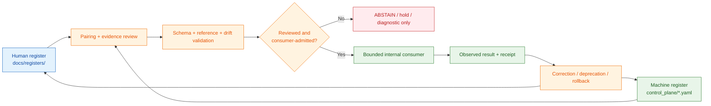

<!-- [KFM_META_BLOCK_V2]
doc_id: kfm://doc/control-plane-registers-readme
title: control_plane/registers/README.md — Control-Plane Register Profile and Pairing Lane
version: v0.3
type: readme; control-plane-register-profile; nested-folder-contract; human-machine-pairing-guide
status: "repository-grounded currentness update; root-packet-mixed-profiles; directory-rules-v2-adopted; specialized-projections-present; semantic-validation-partial; non-authoritative"
owners: "NEEDS VERIFICATION — Control-plane steward · Register steward · Docs steward · Policy steward · Evidence steward · Release steward · Validation/CI steward; CODEOWNERS routes /control_plane/ to @bartytime4life"
created: NEEDS VERIFICATION — blank placeholder existed before v0.1 expansion
updated: 2026-09-06
supersedes: v0.2 at the same path
prepared_under_prompt: KFM same-path README currentness update
policy_label: "repository-facing; control-plane; registers; governance-index; no-parallel-authority; no-direct-public-path; cite-or-abstain; correction-aware; rollback-aware"
current_path: control_plane/registers/README.md
truth_posture: >
  CONFIRMED the tracked register-lane README, canonical control_plane responsibility root,
  accepted ADR-0029 adoption of the exact Directory Rules v2 bytes, nine required root
  register paths, the split validation profiles (eight legacy metadata files plus one
  schema-governed object-family register), three required registers with entries, six
  empty required registers, current root projection files, the child DRIFT_REGISTER.md
  profile, absence of the seven previously proposed child YAML paths, human drift and
  verification entries, current workflow/test definitions, and CODEOWNERS routing /
  PROPOSED human-machine pairing rules, register maturity and consumer admission,
  machine drift synchronization, and future migration or projection strategies /
  CONFLICTED or incomplete wording between human register narratives and sparse machine
  projections, plus historical or stale snapshot pins in coordination artifacts /
  UNKNOWN exhaustive recursive inventory, every register consumer, branch-protection
  enforcement, deployment, runtime behavior, and public effects / NEEDS VERIFICATION
  accountable owners, field-level schemas for all legacy families, cross-register
  reference closure, stale-reference checks, independent review, and correction drills
evidence_snapshot:
  repository: bartytime4life/Kansas-Frontier-Matrix
  repository_id: "1059091169"
  visibility: public
  base_ref: main
  base_commit: 1e69410cfd871e1ec004eedcd23f845eff435137
  prior_blob: aee5412b9c4ebd8b6343a07f628dd7210bc30695
  directory_rules_blob: fd49a0b83e55cef52c1124281f093e263526898d
  adr_0029_blob: a4de0d7a96b78da59cfc499d1025e1508afd8dd9
  control_plane_readme_blob: 51026faa37b2ebe940472e1d513a25cd0832c692
  child_drift_profile_blob: 2c472bd2552b758d365a8e9311aaa19ff4d5d7b9
  docs_drift_register_blob: 5c5078b93c467e66f4cc8b86a7a696dbce5ae7e0
  docs_verification_backlog_blob: 077c29c04ab6c45212ed0f4812aa176094923155
  docs_document_registry_blob: ff9dbba6a8fde653aacf09e7fe615bf7a1779d9a
  docs_object_family_blob: ce7339295de87d7d61a8ff95c72129bda6a7bb9c
  docs_domain_lane_blob: 7cd641d99e1e4e3b3823f608d63679a438590c3a
  document_registry_blob: 9129f2f271f11516249b0d27b0a470082677fba4
  source_authority_register_blob: 32729857bc8eb5001acb37b8ee8e60bcb6e0dc50
  object_family_register_blob: 03bba0769738d29bbc4c9481ba34c6c7b8366941
  domain_lane_register_blob: 1bfc6f91cfa713a5e3d51ece011b63b46310734f
  policy_gate_register_blob: bc8185b4762a947c742cf54a7ea4f2bf80670e21
  release_state_register_blob: b22776001e7c6df1f4dbd2c4f9c63e7dca612ba2
  verification_backlog_blob: a52c1b1cd7566878bcea0727e94987973fdc7da2
  contradiction_register_blob: cf51caf09daa17822b052e955f1fa48e830453ab
  deprecation_register_blob: e67cbfcc9b7b220b1fd82292f2afe19ea458f4ea
  register_meta_contract_test_blob: 83e74c1c657d06f9c7b4bd256419a8aa8868d173
  docs_control_plane_workflow_blob: ed0d3b50a12931b67cad005cd99433924c829fa3
  object_family_schema_blob: 3e0499e0fe2026e8a40ff9f859ab6bd3c0922d43
  object_family_validator_blob: 02c6d2c253282e45adb5c8b51141e3a10d4bebb2
  object_family_tests_blob: bd49cd9b886a0120d4e6a01a4bfad95f74c8e2e7
  object_family_workflow_blob: d33526513b9dff1943333ebbb2a3e4c6b4263409
  domain_lane_workflow_blob: 318214ba62830d255429fa257c3391276f5a2bf0
  root_registry_blob: 024f668b5f0a9239bafa4f8b09e2afd86300ff8c
  path_alias_register_blob: 6ad6840bd47eb8b176d03f9e946c16453fc4caee
  cross_domain_seam_register_blob: dc87ea9c2ab11cc10e51cf4e8284c030e7c9ab29
  repository_topology_correction_register_blob: b48e8df74a2b9d8c2599ce256ef5156687b98dbf
  repository_governance_parity_blob: 06214b4c66164a82c614a02dd2a0632465ac6cd6
  repository_control_state_blob: a35a68ee7e3a0eac111ee8ab9a5a2371f42c0763
  repository_control_workflow_blob: 7d4e1dd250a1114898599ccedc14b99ff0577523
  codeowners_blob: dd2a84aa514d8ecd9208bc347f90f9a2ed37dd61
  required_registers: "9"
  required_meta_profile_registers: "8"
  required_schema_profile_registers: "1"
  required_registers_with_entries: "3"
  required_registers_empty: "6"
  proposed_child_yaml_checked: "7"
  proposed_child_yaml_present: "0"
  open_overlapping_pull_requests_found: "0"
  inventory_method: exact current-main file reads, targeted child-path absence probes, workflow/test inspection, and target-path overlap search; no exhaustive recursive tree, branch-protection inspection, runtime, deployment, or public effect was inspected
related:
  - ../README.md
  - ../document_registry.yaml
  - ../source_authority_register.yaml
  - ../object_family_register.yaml
  - ../domain_lane_register.yaml
  - ../policy_gate_register.yaml
  - ../release_state_register.yaml
  - ../verification_backlog.yaml
  - ../contradiction_register.yaml
  - ../deprecation_register.yaml
  - ../root_registry.yaml
  - ../path_alias_register.yaml
  - ../cross_domain_seam_register.yaml
  - ../repository_topology_correction_register.yaml
  - ../repository_governance_parity.yaml
  - ../repository_control_state.yaml
  - ./DRIFT_REGISTER.md
  - ../../docs/doctrine/directory-rules.md
  - ../../docs/adr/ADR-0029-adopt-directory-governance-standard-v2.md
  - ../../docs/registers/DOCUMENT_REGISTRY.md
  - ../../docs/registers/OBJECT_FAMILY.md
  - ../../docs/registers/OBJECT_FAMILY_MAP.md
  - ../../docs/registers/DOMAIN_LANE.md
  - ../../docs/registers/DRIFT_REGISTER.md
  - ../../docs/registers/VERIFICATION_BACKLOG.md
  - ../../docs/registers/AUTHORITY_LADDER.md
  - ../../docs/registers/CANONICAL_LINEAGE_EXPLORATORY.md
  - ../../contracts/governance/control_plane_registry_packet.md
  - ../../schemas/contracts/v1/governance/object_family_register.schema.json
  - ../../tests/policy/test_control_plane_register_meta_contract.py
  - ../../tests/validators/test_validate_object_family_register.py
  - ../../tools/validators/control_plane/validate_object_family_register.py
  - ../../.github/workflows/docs-control-plane.yml
  - ../../.github/workflows/object-family-register.yml
  - ../../.github/workflows/domain-lane-register.yml
  - ../../.github/CODEOWNERS
tags: [kfm, control-plane, registers, governance-index, human-machine-pairing, drift, verification, authority, deprecation, correction, rollback]
notes:
  - "v0.3 is a same-path currentness correction of the v0.2 register-lane README."
  - "ADR-0029 is accepted; it adopts Directory Rules v2 but does not move the required packet into this sublane."
  - "The required packet remains at control_plane/ root: eight legacy metadata profiles plus one dedicated object-family profile."
  - "Current bounded population is three nonempty required registers and six empty required registers."
  - "The object-family register uses a JSON-compatible payload at a .yaml path with dedicated schema, contract, validator, fixtures, tests, workflow, and receipt support."
  - "Seven child YAML paths proposed by v0.1 were probed on current main and were absent."
  - "Adjacent draft PR #4325 changes only control_plane/README.md and draft PR #4326 changes only control_plane/registers/DRIFT_REGISTER.md; neither changes this target path. Re-pin if either lands before review."
  - "control_plane/registers/DRIFT_REGISTER.md is a Markdown profile, not a validated machine drift register."
  - "Human drift and verification narratives remain richer than the empty machine verification, contradiction, and deprecation registers."
  - "This README does not populate registers, create schemas, accept an ADR, approve policy, alter release state, promote data, expose a public route, deploy, or publish."
[/KFM_META_BLOCK_V2] -->

<a id="top"></a>

# `control_plane/registers/` — Register Profile and Pairing Lane

[](#status)
[](#adrs)
[](#current-bounded-inventory)
[](#root-register-population)
[](#validation)
[](#outputs)

> **One-line purpose.** `control_plane/registers/` documents register profiles, human–machine pairing rules, and unresolved placement questions while the required packet and specialized machine projections remain at the canonical `control_plane/` root.

**Quick navigation:** [Purpose](#purpose) · [Authority](#authority-level) · [Status](#status) · [Belongs](#what-belongs-here) · [Does not belong](#what-does-not-belong-here) · [Inputs](#inputs) · [Outputs](#outputs) · [Validation](#validation) · [Review](#review-burden) · [Related](#related-folders) · [ADRs](#adrs) · [Last reviewed](#last-reviewed) · [Inventory](#current-bounded-inventory) · [Population](#root-register-population) · [Pairing](#human-and-machine-pairing) · [Drift gap](#drift-and-verification-representation-gap) · [Strategy](#root-versus-sublane-register-strategy) · [Admission](#register-admission-contract) · [Consumers](#consumer-admission-and-maturity) · [Flow](#referential-governance-flow) · [Failures](#failure-controls) · [Correction](#correction-deprecation-and-rollback) · [Verification](#open-verification-register) · [Evidence](#evidence-ledger) · [No-loss](#v02-to-v03-no-loss-ledger) · [Summary](#status-summary)

> [!IMPORTANT]
> **The required machine-register packet remains root-level.** Nine exact files under `control_plane/` are required: eight legacy metadata-profile files plus one dedicated schema-governed object-family register. Specialized projections are separate root files; this sublane does not authorize child copies, moves, aliases, or divergent registers.

> [!WARNING]
> **Population is partial and validation is mixed.** Three required registers contain entries and six remain empty. The object-family register has a dedicated schema/validator/workflow, while the other eight files share a narrower metadata contract. A green check, valid YAML shell, badge, commit, pull request, or merge is not semantic closure.

> [!CAUTION]
> **No ordinary public client reads this lane or a raw register directly.** Public and semi-public surfaces consume governed APIs and released, policy-allowed artifacts. A register may guide a backend validator or reviewer only after its consumer contract and maturity are verified.

---

<a id="purpose"></a>

## Purpose

`control_plane/registers/` is a nested documentation and profile lane beneath KFM's canonical machine-readable governance-index root.

It exists to make register design and pairing inspectable:

- explain what each register is intended to index;
- describe the boundary between human narrative under `docs/registers/` and machine indexes under `control_plane/`;
- document proposed shapes, status vocabularies, evidence requirements, and consumer constraints before machine adoption;
- surface conflicts between root register paths and proposed child placements;
- expose drift when human narratives, machine entries, doctrine, and implementation disagree;
- preserve correction, deprecation, and rollback expectations for register evolution.

It does not define canonical object meaning, field shape, policy, source authority, evidence, lifecycle state, release state, runtime behavior, or public truth.

[Back to top](#top)

---

<a id="authority-level"></a>

## Authority level

| Surface | Authority posture |
|---|---|
| [`control_plane/`](../README.md) | **Canonical responsibility root** for machine-readable governance indexes and crosswalks. |
| Required root packet | **Repository-required surfaces**: eight legacy metadata-profile paths plus one dedicated schema-governed object-family path. |
| Register metadata and entries | Referential index claims only; their authority depends on resolvable owning artifacts, review, and evidence. |
| This `README.md` | Repository-facing lane contract and inventory; not a machine register. |
| [`DRIFT_REGISTER.md`](./DRIFT_REGISTER.md) | Draft Markdown profile for a possible machine drift register; not a validated YAML instance. |
| `docs/registers/` files | Human-readable context and review history; they do not replace machine indexes or stronger authorities. |
| Object meaning | Owned by [`contracts/`](../../contracts/README.md). |
| Machine shape | Owned by [`schemas/`](../../schemas/README.md). |
| Admissibility, rights, and sensitivity | Owned by [`policy/`](../../policy/README.md). |
| Lifecycle records, receipts, and proofs | Owned by [`data/`](../../data/README.md) and its governed phases. |
| Release, correction, and rollback decisions | Owned by [`release/`](../../release/README.md). |
| Runtime and public response | Owned by governed applications and released artifacts; this lane has no ordinary public-client authority. |

Authority is **referential**. A path or identifier in a register is usable only when it resolves to the owning artifact and the register's maturity permits the proposed consumer. Unresolved or contradicted references fail closed.

[Back to top](#top)

---

<a id="status"></a>

## Status

| Finding | Truth status | Current bounded result |
|---|---:|---|
| Lane path and README | `CONFIRMED` | `control_plane/registers/README.md` exists with stable `kfm://doc/control-plane-registers-readme` identity; this update keeps the same path. |
| Placement authority | `CONFIRMED / ACCEPTED` | ADR-0029 adopts the exact Directory Rules v2 bytes. It does not move the required root packet into this sublane. |
| Required root packet | `CONFIRMED / ENFORCED` | Nine exact files are required: eight legacy metadata profiles and one schema-governed `object_family_register.yaml`. |
| Required population | `CONFIRMED BOUNDED` | Three required registers contain entries: document (1), object family (19), and domain lane (13); six required registers are empty. |
| Legacy metadata profile | `CONFIRMED / ENFORCED` | The current test checks eight files for `meta`, status, owner, review date, doctrine references, and an `entries` body. |
| Object-family profile | `CONFIRMED / DEDICATED` | The `.yaml` path contains JSON-compatible data with a schema, contract, validator, fixtures, tests, workflow, and generated-receipt support. |
| Root YAML syntax | `CONFIRMED / ENFORCED` | `docs-control-plane` parses every direct `control_plane/*.yaml`, rejects duplicate keys, and requires a mapping root. |
| Specialized root projections | `CONFIRMED / BOUNDED` | Root, path-alias, domain-lane, cross-domain-seam, topology-correction, governance-parity, trust-spine, and program-baseline projections exist with explicit non-effects; they are not child copies of the required packet. |
| Child Markdown profiles | `CONFIRMED BOUNDED` | This README and `registers/DRIFT_REGISTER.md` are present; the latter is a profile, not a machine register. |
| Proposed child YAML | `CONFIRMED ABSENT AT SNAPSHOT` | Seven v0.1 child YAML paths were probed on current `main` and were absent. |
| Human drift and verification | `CONFIRMED` | Human drift and verification files contain dated material entries; their existence does not populate the machine registers. |
| Machine drift representation | `UNKNOWN / PARTIAL` | No `control_plane/registers/drift_register.yaml` is established; the required machine verification, contradiction, and deprecation registers remain empty. |
| Review routing | `CONFIRMED ROUTING / NEEDS VERIFICATION ENFORCEMENT` | CODEOWNERS routes `/control_plane/` and `/docs/registers/` to `@bartytime4life`; this does not prove independent review or required enforcement. |
| Direct public use | `DENY` | Placement and validation do not authorize raw register reads by public clients. |

### Current tensions

1. **Root packet versus optional sublane.** The required packet remains at tested root paths; this sublane documents profiles and pairing.
2. **Mixed validation profiles.** The object-family profile has dedicated semantic machinery; the eight legacy files do not share equivalent field-level validation.
3. **Sparse versus authoritative wording.** Nonempty entries are projections and do not create object, source, policy, evidence, release, or publication authority.
4. **Human detail versus machine sparsity.** Human drift/verification narratives remain richer than the empty machine verification, contradiction, and deprecation registers.
5. **Historical pins versus currentness.** Coordination artifacts may preserve older main snapshots; this README records the current-main pin used for this update.

[Back to top](#top)

---
<a id="what-belongs-here"></a>

## What belongs here

Only bounded register-profile and pairing material belongs in this sublane:

| Material | Purpose |
|---|---|
| `README.md` | Defines this lane, current placement, pairing, admission, and maintenance boundaries. |
| Register profile Markdown | Explains intended meaning, fields, states, failure rules, and evidence burden before machine adoption. |
| Pairing maps | Documents the human narrative, root machine register, schema, validator, and consumer relationship. |
| Migration notes | Plans a reviewed, reversible move or projection without changing authority by implication. |
| Compatibility notes | Declares a mirror, alias, generated projection, or deprecated path and its sunset conditions. |
| Register design examples | Small, non-authoritative examples clearly marked PROPOSED and not consumed as production state. |
| Review checklists | Bounded criteria for admitting a register or consumer. |
| Drift explanations | Human-readable descriptions of register mismatch that point to the human drift register or accepted remediation record. |

A profile may propose a field or state vocabulary. It must identify that proposal and cannot treat its own examples as accepted machine records.

[Back to top](#top)

---

<a id="what-does-not-belong-here"></a>

## What does NOT belong here

| Do not place here | Owning home |
|---|---|
| A second mutable copy of a required root register | Existing `control_plane/*.yaml` path unless a reviewed migration changes it |
| Human governance register bodies | `docs/registers/` |
| Semantic object contracts | `contracts/` |
| JSON Schema or equivalent machine-shape definitions | `schemas/` |
| Policy code or `PolicyDecision` records | `policy/` and governed decision stores |
| `SourceDescriptor` instances or source payloads | Source registry and lifecycle roots |
| `EvidenceRef`, `EvidenceBundle`, receipts, or proofs | Evidence, receipt, and proof surfaces |
| RAW, WORK, QUARANTINE, PROCESSED, CATALOG, TRIPLET, or PUBLISHED payloads | `data/` lifecycle roots |
| Release manifests, promotion decisions, correction notices, or rollback cards | `release/` |
| Executable validators | `tools/validators/` |
| Validator-only fixtures or executable tests | `fixtures/` and `tests/` according to their root contracts |
| Runtime, API, UI, connector, pipeline, or watcher code | Their implementation responsibility roots |
| Secrets, private data, restricted coordinates, or embedded evidence payloads | Never in a public register profile; use governed restricted stores |
| Generated claims of approval, remediation, release, or publication | No documentation or register may manufacture these states |

[Back to top](#top)

---

<a id="inputs"></a>

## Inputs

Register profiles and pairing notes may be derived from:

1. current Directory Rules and accepted ADRs;
2. exact machine-register bytes and current register tests;
3. human register narratives and recorded review history;
4. semantic contracts, machine schemas, and policy references;
5. source, evidence, lifecycle, and release records;
6. validators, fixtures, workflow definitions, and observed run evidence;
7. drift, correction, deprecation, and rollback records;
8. explicit steward decisions.

Repository content is evidence, not an instruction to bypass higher authority. A profile must not absorb source payloads or sensitive evidence merely to make a register self-contained.

[Back to top](#top)

---

<a id="outputs"></a>

## Outputs

This lane may support:

- clearer root-register maintenance and review;
- human–machine pairing maps;
- proposed schemas and validator requirements routed to their owning roots;
- drift and verification work items;
- migration or deprecation plans;
- bounded consumer-admission decisions;
- correction and rollback instructions for register changes.

This lane does **not** emit source truth, EvidenceBundles, PolicyDecisions, lifecycle promotion, release approval, public claims, deployed configuration, or publication.

Downstream tools must consume the admitted machine register at its approved path—not prose or examples from this lane.

[Back to top](#top)

---

<a id="validation"></a>

## Validation

Validation is layered. Each result proves only its named boundary; the workflow definitions below were inspected for this update, but no hosted workflow result is claimed here.

### Implemented validation surfaces

| Profile | Command or workflow | Proves | Does not prove |
|---|---|---|---|
| Direct root YAML syntax | `docs-control-plane` → `validate-control-plane-yaml` | Every direct `control_plane/*.yaml` parses with unique mapping keys and a mapping root. | JSON files, nested YAML, field semantics, reference closure. |
| Legacy required-register metadata | `python -m pytest tests/policy/test_control_plane_register_meta_contract.py -q --strict-config --strict-markers` | Eight legacy files have required metadata, review date, owner, doctrine paths, and an `entries` body. | Nonempty population, entry shape, semantic agreement. |
| Object-family register | `object-family-register` workflow | Dedicated schema/validator/fixture/test boundaries, declared path checks, maturity classification, and receipt binding. | Object-family authority, runtime deployment, release, or publication. |
| Domain-lane register | `domain-lane-register` workflow | Bounded domain-lane identity and placement projection. | Steward assignment, source activation, domain readiness, or release. |
| Root and alias projections | `directory-root-registry` and `path-alias-register` workflows | Adopted-doctrine binding, root-class and compatibility-alias invariants. | Root creation, migration completion, consumer closure, or deletion. |
| Cross-domain seam projection | `cross-domain-seam-register` workflow | Seam shape and fail-closed cross-context posture. | Join authorization, policy weakening, or public release. |
| ADR index | `docs-control-plane` → `adr-index-coherence` | Canonical ADR inventory and bounded link/status/supersession coherence. | ADR adoption, implementation proof, policy approval, or release. |

### Checks not established

Current evidence does not establish:

- a recursive validator for `control_plane/registers/**/*.yaml`;
- a common field-level schema for all nine required register families;
- stable ID uniqueness and cross-register reference closure;
- human–machine pair agreement or automated drift synchronization;
- stale-reference and stale-review detection across consumers;
- consumer allowlists or maturity admission for this sublane;
- sensitivity-aware redaction of register content;
- complete population, independent review, branch-protection enforcement, runtime use, or rollback-drill completion.

A green workflow proves only the checks it ran against the checked revision. It does not convert a projection into authority.

### Local documentation validation for this README

A documentation update should verify:

- one H1 and the required first twelve H2 sections in order;
- balanced Markdown fences and valid HTML anchors;
- internal fragment integrity and repository-relative link targets;
- no accidental machine-register, sensitive, or source payload introduction;
- no unsupported claims of authority, validation, review, release, or publication;
- current evidence snapshot, counts, profile names, and rollback target are internally consistent.

[Back to top](#top)

---
<a id="review-burden"></a>

## Review burden

Current executable routing is provided by [`.github/CODEOWNERS`](../../.github/CODEOWNERS), which routes both `/control_plane/` and `/docs/registers/` to `@bartytime4life`.

That route proves GitHub ownership configuration only. It does not prove accountable stewardship, independent approval, separation of duties, or that review occurred.

| Change | Minimum review burden |
|---|---|
| README clarification or dead-link repair | Control-plane or docs maintainer |
| New register profile | Control-plane/register steward plus owner of the indexed authority |
| New machine register or entry family | Register, schema, validation, and affected authority owners |
| Rights, sensitivity, source, evidence, or public-surface pointer | Policy/sensitivity, source/evidence, and affected domain reviewers |
| Release/correction/rollback pointer | Release and evidence reviewers |
| Consumer admission | Register, consumer, policy/security, and validation owners |
| Root-to-sublane move or parallel projection | Architecture/docs/register reviewers; ADR or migration decision where authority changes |
| Status promotion to `CONFIRMED` | Evidence-backed steward review; never self-promoted by an authoring tool |

[Back to top](#top)

---

<a id="related-folders"></a>

## Related folders

| Surface | Relationship |
|---|---|
| [`control_plane/`](../README.md) | Canonical machine-index responsibility root and home of the required register packet. |
| Required root YAML files | Nine tested paths: eight legacy metadata profiles plus one dedicated object-family profile. |
| [`root_registry.yaml`](../root_registry.yaml) and [`path_alias_register.yaml`](../path_alias_register.yaml) | Specialized root/compatibility projections; neither creates or retires a root. |
| [`domain_lane_register.yaml`](../domain_lane_register.yaml) | Populated placement projection with no steward or readiness authority. |
| [`cross_domain_seam_register.yaml`](../cross_domain_seam_register.yaml) | High-risk seam projection with fail-closed posture; no join authority. |
| [`DRIFT_REGISTER.md`](./DRIFT_REGISTER.md) | Proposed Markdown profile for a machine drift register; not a YAML instance. |
| [`docs/registers/DOCUMENT_REGISTRY.md`](../../docs/registers/DOCUMENT_REGISTRY.md) | Human document-registry narrative; does not replace the machine packet. |
| [`docs/registers/OBJECT_FAMILY.md`](../../docs/registers/OBJECT_FAMILY.md) | Human object-family contract paired with the dedicated machine profile. |
| [`docs/registers/OBJECT_FAMILY_MAP.md`](../../docs/registers/OBJECT_FAMILY_MAP.md) | Older proposed Markdown mirror retained as lineage; not a second authority. |
| [`docs/registers/DOMAIN_LANE.md`](../../docs/registers/DOMAIN_LANE.md) | Human domain-lane narrative paired with the root projection. |
| [`docs/registers/DRIFT_REGISTER.md`](../../docs/registers/DRIFT_REGISTER.md) | Human drift history with dated entries. |
| [`docs/registers/VERIFICATION_BACKLOG.md`](../../docs/registers/VERIFICATION_BACKLOG.md) | Human verification backlog; machine emptiness does not close it. |
| [`contracts/governance/control_plane_registry_packet.md`](../../contracts/governance/control_plane_registry_packet.md) | Proposed normalized packet contract and no-self-authority boundary. |
| [`schemas/contracts/v1/governance/object_family_register.schema.json`](../../schemas/contracts/v1/governance/object_family_register.schema.json) | Dedicated shape contract for `object_family_register.yaml`. |
| [`tools/validators/control_plane/validate_object_family_register.py`](../../tools/validators/control_plane/validate_object_family_register.py) | Dedicated object-family validator implementation. |
| [`tests/`](../../tests/README.md) and [`tools/validators/`](../../tools/validators/README.md) | Own executable conformance evidence and validator implementation. |
| [`policy/`](../../policy/README.md) | Owns admissibility, rights, sensitivity, and obligations. |
| [`data/`](../../data/README.md) | Owns lifecycle records, receipts, proofs, catalog/triplet outputs, and published artifacts. |
| [`release/`](../../release/README.md) | Owns release, correction, withdrawal, and rollback decisions. |

[Back to top](#top)

---
<a id="adrs"></a>

## ADRs

- [`ADR-0029`](../../docs/adr/ADR-0029-adopt-directory-governance-standard-v2.md) is **accepted** and adopts the exact Directory Rules v2 bytes.
- ADR-0029 establishes responsibility-first placement and keeps the required machine-register packet at its current root unless a separately reviewed migration changes it.
- No accepted ADR was verified as moving the required packet into `control_plane/registers/` or authorizing editable root/child duplicates.
- The doctrine file retains its own historical document-control status label; this README relies on the accepted ADR record and pinned bytes rather than relabeling doctrine in an unrelated README update.

Until a future decision changes current behavior:

1. keep the nine required machine registers at their tested `control_plane/` paths;
2. keep specialized projections in their own explicit root profiles;
3. use this sublane for profiles, pairing, migration, and review material;
4. do not create mutable child copies or aliases that can diverge;
5. require a reviewed ADR/migration packet before changing path or authority.

Relevant decision inventory: [`docs/adr/INDEX.md`](../../docs/adr/INDEX.md).

[Back to top](#top)

---
<a id="last-reviewed"></a>

## Last reviewed

**2026-09-06**

| Review field | Current bounded result |
|---|---|
| Repository snapshot | `main@1e69410cfd871e1ec004eedcd23f845eff435137` |
| Prior README blob | `aee5412b9c4ebd8b6343a07f628dd7210bc30695` |
| Governing placement | Accepted ADR-0029 and Directory Rules v2 bytes; no sublane migration adopted. |
| Register inventory | Nine required root files; three nonempty and six empty. |
| Validation inventory | Eight metadata-profile checks plus the dedicated object-family profile and specialized projection workflows. |
| Child-path probes | Seven v0.1 proposed child YAML paths absent at this snapshot. |
| Target-path overlap | No open pull request found for `control_plane/registers/README.md` in the bounded search. |
| Hosted validation | Not run or claimed by this documentation authoring action. |
| Human review | Pending; CODEOWNERS routing is not proof that review occurred. |

Re-review when a required register is added, moved, populated, or retired; a profile or consumer changes; ADR-0029 migration state changes; a specialized projection changes authority wording; a public/governed projection is added; or a correction/rollback drill changes the evidence boundary.

[Back to top](#top)

---
<a id="current-bounded-inventory"></a>

## Current bounded inventory

### Required root register packet

| File | Required profile | Current body state | Authority limit |
|---|---|---:|---|
| [`document_registry.yaml`](../document_registry.yaml) | Legacy metadata | 1 entry | Document index only; does not accept or supersede documents. |
| [`source_authority_register.yaml`](../source_authority_register.yaml) | Legacy metadata | Empty | Does not establish source identity, rights, or activation. |
| [`object_family_register.yaml`](../object_family_register.yaml) | Dedicated schema/validator | 19 entries | Navigational object-family projection only; does not define family meaning or release. |
| [`domain_lane_register.yaml`](../domain_lane_register.yaml) | Legacy metadata + dedicated workflow | 13 entries | Placement projection only; no steward or readiness authority. |
| [`policy_gate_register.yaml`](../policy_gate_register.yaml) | Legacy metadata | Empty | Does not create policy gates or decisions. |
| [`release_state_register.yaml`](../release_state_register.yaml) | Legacy metadata | Empty | Does not create release, correction, promotion, or rollback state. |
| [`verification_backlog.yaml`](../verification_backlog.yaml) | Legacy metadata | Empty | Does not prove verification closure. |
| [`contradiction_register.yaml`](../contradiction_register.yaml) | Legacy metadata | Empty | Empty does not mean no contradictions exist. |
| [`deprecation_register.yaml`](../deprecation_register.yaml) | Legacy metadata | Empty | Empty does not mean no deprecated objects exist. |

### Specialized root projections

These are separate root-level projections and are not child copies of the required packet:

| Projection | Bounded character | Non-effect |
|---|---|---|
| `root_registry.yaml` | Adopted root-class projection. | Cannot create, activate, migrate, or retire a root. |
| `path_alias_register.yaml` | Legacy-to-canonical compatibility mapping. | Cannot close consumers or authorize tombstone/deletion. |
| `cross_domain_seam_register.yaml` | Five high-risk seam rows with unresolved posture. | Cannot authorize a join or lower policy/sensitivity. |
| `trust_spine_baseline.yaml` | Historical/proposed pinned trust-spine projection. | Cannot create authority, waive drift, activate sources, or change release/publication state. |
| `program_baseline.json` | Historical/proposed M01 coordination projection. | Cannot mutate issues, approve review, or change release/publication state. |
| `repository_topology_correction_register.yaml` | Proposed consume-once topology-correction projection. | Cannot suppress live findings, reclassify roots, or authorize edits. |
| `repository_governance_parity.yaml` | Proposed repository-governance parity projection. | Cannot establish settings enforcement, waive failures, or authorize merge. |
| `repository_control_state.yaml` | Historical repository-control observation. | Cannot authorize itself; currentness is not established by its embedded base. |

### Verified sublane files

| File | Current role |
|---|---|
| `registers/README.md` | This profile, pairing, and inventory contract. |
| `registers/DRIFT_REGISTER.md` | Markdown profile for an intended machine drift register; no YAML instance established. |

### v0.1 proposed child YAML paths

The following exact paths were checked against current `main` and were absent:

- `control_plane/registers/document_registry.yaml`
- `control_plane/registers/object_family_map.yaml`
- `control_plane/registers/domain_lane_register.yaml`
- `control_plane/registers/source_authority_register.yaml`
- `control_plane/registers/drift_register.yaml`
- `control_plane/registers/verification_backlog.yaml`
- `control_plane/registers/release_gate_register.yaml`

Absence supports the current boundary: this sublane is not an alternative populated register root.

[Back to top](#top)

---
<a id="root-register-population"></a>

## Root register population

Current required-register population is **three populated / six empty**.

| Register family | Current machine state | Human-side pressure and limit |
|---|---|---|
| Documents | 1 entry | Human Document Registry describes a broader intended inventory; the projection does not make documents authoritative. |
| Sources | Empty | Source descriptors and source docs exist elsewhere; source admission remains outside this register. |
| Object families | 19 entries under a dedicated schema profile | Human `OBJECT_FAMILY.md` supplies meaning and review context; the machine file remains a navigational projection. |
| Domain lanes | 13 entries under a projection workflow | Human `DOMAIN_LANE.md` supplies narrative context; entries do not assign stewards or readiness. |
| Policy gates | Empty | Policy roots and decisions remain the policy authority. |
| Release states | Empty | Release, correction, withdrawal, promotion, and rollback remain under `release/`. |
| Verification | Empty | Human verification backlog contains material work; machine emptiness is not closure. |
| Contradictions | Empty | Human docs may describe tensions; no machine winner is implied. |
| Deprecations | Empty | Compatibility concerns may exist; no path is retired by an empty register. |

Population is not a reason to bulk-copy prose into YAML. A new entry requires an admitted profile, resolvable references, representative fixtures, negative tests, steward review, and an identified consumer need.

[Back to top](#top)

---
<a id="human-and-machine-pairing"></a>

## Human and machine pairing

KFM separates explanation from structured indexing and records the profile used by each machine family:

```text
docs/registers/<REGISTER>.md
  human context, rationale, history, review notes, and field meaning
                |
                | paired through stable IDs and resolvable references
                v
control_plane/<register>.yaml
  root machine projection: legacy metadata or a declared dedicated profile
                |
                | validated, reviewed, and consumer-admitted only by contract
                v
backend validator / reviewer tool / governed control flow
```

### Pairing rules

A mature pair should share:

- stable register and entry identifiers;
- profile identity and status meaning;
- owner and reviewer references;
- governing doctrine, ADR, contract, and schema references;
- source or evidence references;
- correction, supersession, and deprecation lineage;
- last-reviewed or freshness state;
- explicit fields owned only by the machine or human side.

The human side may explain **why**. The machine side may encode bounded structured fields. Neither side may unilaterally manufacture authority, approval, release, or truth.

### Conflict rule

When the pair disagrees:

1. preserve both current states;
2. identify the disputed field, profile, and authority question;
3. create a drift or contradiction record with evidence;
4. fail closed for consumers that depend on the disputed field;
5. resolve through the owning steward or ADR;
6. update both sides atomically where practical;
7. preserve correction and rollback references.

[Back to top](#top)

---
<a id="drift-and-verification-representation-gap"></a>

## Drift and verification representation gap

The repository currently has:

- a human drift register with dated material entries;
- a human verification backlog with open and resolved entries;
- a Markdown profile for a future machine drift register;
- populated document, object-family, and domain-lane projections;
- empty required machine verification, contradiction, and deprecation registers;
- no established `control_plane/registers/drift_register.yaml` instance.

This creates a bounded governance gap: **some register families have structured projections, but a general machine-readable drift/verification model and synchronization process are not established.**

Do not resolve this by silently copying prose into YAML. A safe closure packet requires:

1. a semantic contract for drift/verification entries;
2. machine schema and stable ID rules;
3. controlled status and severity vocabularies;
4. valid, invalid, duplicate, stale-reference, and contradiction fixtures;
5. validators for references, dates, status transitions, and duplicate IDs;
6. explicit human–machine field ownership;
7. migration of selected current entries with preserved source text and evidence;
8. consumer-admission rules;
9. correction and rollback procedures.

[Back to top](#top)

---
<a id="root-versus-sublane-register-strategy"></a>

## Root versus sublane register strategy

| Strategy | Posture | Tradeoff |
|---|---|---|
| **A. Root packet plus explicit root projections** | **Current bounded default** | Preserves tested required paths while allowing separately profiled root projections. |
| **B. Root authority plus generated child projections** | `PROPOSED` | Can group views without parallel mutation, but requires deterministic generation, hashes, labels, tests, and no independent edits. |
| **C. Move machine registers into this sublane** | `NEEDS ADR / MIGRATION` | Changes tested paths, references, workflows, and possibly authority; requires compatibility and rollback evidence. |
| **D. Root summaries plus domain/family child authorities** | `PROPOSED / HIGH RISK` | May scale, but creates split authority unless ownership, aggregation, conflict resolution, and consumers are explicit. |
| **E. Duplicate editable root and child registers** | `DENY` | Creates parallel authority and inevitable divergence. |

No strategy is adopted by this README. For the required packet, Strategy A remains the current repository-grounded default until an accepted decision changes it.

[Back to top](#top)

---
<a id="register-admission-contract"></a>

## Register admission contract

Before a new register family, child projection, or material entry is admitted, verify:

| Gate | Requirement | Failure result |
|---|---|---|
| Responsibility | The file is an index/crosswalk, not contract, schema, policy, evidence, data, release, or runtime content. | Relocate or deny. |
| Profile | The family declares legacy metadata, dedicated schema, or another accepted contract and names its support files. | `NEEDS VERIFICATION`. |
| Existing authority | No existing register already owns the same mutable field set. | Hold and reconcile. |
| Semantic contract | Entry meaning, field ownership, and claim limits are documented. | `NEEDS VERIFICATION`. |
| Machine schema | Required fields, enums, IDs, dates, and references are machine-checkable at the declared profile. | Do not admit consumers. |
| Fixtures | Valid, invalid, duplicate, stale, missing-ref, and contradiction cases exist where the claim requires them. | Hold. |
| Validator | Deterministic validation is implemented in the correct responsibility root. | Hold. |
| Evidence closure | Material claims carry resolvable evidence or explicit `UNKNOWN` state. | `ABSTAIN` / hold. |
| Policy and sensitivity | Register content is safe for its access class and does not leak protected data. | `DENY` or restrict. |
| Human pairing | Narrative context and structured field ownership are clear. | Hold. |
| Consumer contract | Named consumers, allowed fields, maturity floor, and fail-closed behavior are documented. | No consumer admission. |
| Review | Accountable stewards approve the family and first entries. | Remain `PROPOSED`. |
| Correction and rollback | Bad entries and path decisions can be corrected or reversed audibly. | Hold. |

A new path is not justified merely because a filename appeared in a prior README or coordination artifact.

[Back to top](#top)

---
<a id="consumer-admission-and-maturity"></a>

## Consumer admission and maturity

### Proposed maturity vocabulary

| State | Meaning | Consumer posture |
|---|---|---|
| `scaffold` | File/path exists; no validated entry contract. | No automated consumer. |
| `syntax_valid` | Parses and meets generic metadata checks. | Diagnostics only. |
| `schema_valid` | Entries pass a dedicated machine schema. | Test tools may read; no consequential action. |
| `reference_valid` | Required references resolve and duplicate/stale checks pass. | Bounded internal use. |
| `reviewed` | Accountable owners reviewed content and scope. | Named internal consumers may use allowed fields. |
| `consumer_admitted` | Consumer contract, negative tests, observability, and rollback exist. | Approved bounded automation. |
| `release_supporting` | Register may support release checks but does not itself approve release. | Release tooling may read under policy. |
| `deprecated` | Replacement and sunset are recorded. | Read-only compatibility during migration. |

### Consumer requirements

A consumer must:

- name the exact register version or content identity it expects;
- define which fields it reads;
- define behavior for missing, unknown, stale, denied, or contradictory data;
- fail closed where policy or release risk exists;
- emit diagnostics or receipts for consequential use;
- avoid treating a register as source truth or evidence;
- provide rollback or disablement;
- be covered by representative negative tests.

No current evidence establishes a generally admitted consumer for this sublane.

[Back to top](#top)

---

<a id="referential-governance-flow"></a>

## Referential governance flow


```mermaid
flowchart LR
    H["Human register<br/>docs/registers/"] --> P["Pairing + evidence review"]
    M["Machine register<br/>control_plane/*.yaml"] --> P
    P --> V["Schema + reference + drift validation"]
    V --> R{"Reviewed and<br/>consumer-admitted?"}
    R -->|No| X["ABSTAIN / hold / diagnostic only"]
    R -->|Yes| C["Bounded internal consumer"]
    C --> O["Observed result + receipt"]
    O --> D["Correction / deprecation / rollback"]
    D --> H
    D --> M

    classDef human fill:#e3f2fd,stroke:#1565c0,color:#0d47a1
    classDef machine fill:#e8f5e9,stroke:#2e7d32,color:#1b5e20
    classDef gate fill:#fff3e0,stroke:#ef6c00,color:#e65100
    classDef deny fill:#ffebee,stroke:#c62828,color:#b71c1c
    class H human
    class M,C,O machine
    class P,V,R,D gate
    class X deny
```

The register remains downstream of governing authority and upstream of bounded consumers. It is never a truth or release source by itself.

[Back to top](#top)

---

<a id="failure-controls"></a>

## Failure controls

| Condition | Required posture |
|---|---|
| Required reference does not resolve | Mark incomplete; consumer ABSTAINS or fails closed. |
| Human and machine fields disagree | Open drift/contradiction; do not silently pick one. |
| Duplicate mutable authority exists | Freeze expansion; choose authority through migration/ADR. |
| Entry claims implementation without code/test/runtime evidence | Demote to UNKNOWN or remove claim. |
| Register contains exact sensitive geometry or private data | DENY exposure; remove or generalize under policy with receipt. |
| Status changes without review/evidence | Reject transition. |
| Entry is stale beyond its review/freshness rule | Mark stale; block consequential use. |
| Consumer reads an unadmitted maturity state | Deny consumer or downgrade to diagnostic mode. |
| Generated projection differs from source register | Regenerate or fail; never hand-edit the projection. |
| Register points to unreleased or withdrawn public artifact | Block public use and surface correction state. |
| Workflow/test fails | Do not infer approval or safe fallback. |
| Register, README, PR, or merge is mistaken for publication | Correct the claim; publication requires release authority. |

[Back to top](#top)

---

<a id="correction-deprecation-and-rollback"></a>

## Correction, deprecation, and rollback

### Entry correction

1. preserve the prior entry identity and content hash where available;
2. record the defect and evidence;
3. update the owning human and machine surfaces;
4. preserve correction or supersession linkage;
5. rerun schema, reference, drift, and consumer tests;
6. notify or invalidate admitted consumers;
7. record the corrected content identity.

### Path deprecation

A register path may be deprecated only with:

- selected replacement authority;
- old-to-new mapping;
- migration and compatibility plan;
- generated mirror rules if needed;
- sunset date;
- consumer inventory;
- validation and rollback evidence;
- deprecation-register entry;
- documentation updates.

### Rollback

Rollback must distinguish:

- reverting a README/profile change;
- reverting a machine entry;
- disabling a consumer;
- restoring a deprecated path during a migration;
- correcting a release that relied on faulty register data.

A rollback does not erase the defect or correction history.

[Back to top](#top)

---

<a id="open-verification-register"></a>

## Open verification register

| ID | Status | Verification item | Safe next action |
|---|---|---|---|
| `REG-V-001` | `NEEDS VERIFICATION` | Assign accountable register and control-plane stewards. | Record approved assignments; do not infer roles from prose. |
| `REG-V-002` | `BOUNDED CURRENT DEFAULT` | Required packet remains root-level; any move into this sublane is an authority-changing migration. | Keep root paths; use ADR, consumer inventory, compatibility, and rollback before any move. |
| `REG-V-003` | `OPEN` | Define a dedicated machine drift/verification model. | Contract, schema, fixtures, validator, and pairing map. |
| `REG-V-004` | `OPEN` | Reconcile human drift/verification entries with empty machine registers. | Migrate a bounded pilot set only after profile approval. |
| `REG-V-005` | `OPEN` | Define stable register and entry ID grammar across profiles. | Add semantic contract and duplicate-ID tests. |
| `REG-V-006` | `OPEN` | Define controlled status, severity, freshness, and closure vocabularies. | Schema enums plus transition tests. |
| `REG-V-007` | `OPEN` | Add field-level schemas for the eight legacy required families. | Start with one high-value family; do not generalize from object-family support without evidence. |
| `REG-V-008` | `OPEN` | Add reference-resolution and stale-reference validation. | Fixture-backed validator with fail-closed cases. |
| `REG-V-009` | `OPEN` | Define human–machine field ownership and synchronization. | Pairing contract and atomic update workflow. |
| `REG-V-010` | `OPEN` | Inventory actual register consumers and fields. | Search code/workflows and record fallback behavior. |
| `REG-V-011` | `OPEN` | Establish consumer-admission maturity gates. | Negative tests, observability, disablement, and rollback. |
| `REG-V-012` | `OPEN` | Classify supplemental root projections and their relationship to the required packet. | Keep explicit profile/non-effect records; do not infer a shared schema. |
| `REG-V-013` | `OPEN` | Correct overbroad canonical wording in human register docs. | Modernize human files without silently changing machine authority. |
| `REG-V-014` | `OPEN` | Verify sensitive-data and access-class requirements for register content. | Policy review and redaction/generalization tests. |
| `REG-V-015` | `OPEN` | Exercise correction, deprecation, migration, and rollback drills. | Use synthetic fixtures; record results. |
| `REG-V-016` | `UNKNOWN` | Determine whether branch protection requires control-plane checks. | Inspect repository rulesets; do not infer from workflow presence. |
| `REG-V-017` | `UNKNOWN` | Determine deployed/runtime/public use. | Inspect deployment, logs, and consumer configuration. |

[Back to top](#top)

---
<a id="evidence-ledger"></a>

## Evidence ledger

| Evidence | Verified result | Limitation |
|---|---|---|
| Target README | Existing v0.2 lane document at blob `aee5412b9c4ebd8b6343a07f628dd7210bc30695`. | Its July snapshot and one/eight population claims were stale against current main. |
| Root control-plane README | Nine required files; eight legacy metadata profiles, one dedicated object-family profile; three nonempty and six empty; specialized projections present. | Root README itself carries an older bounded snapshot and is not a recursive or runtime proof. |
| Register meta-contract test | Nine exact required paths; eight legacy metadata checks plus one dedicated object-family support check. | No uniform semantic closure across all profiles. |
| Docs-control-plane workflow | Parses every direct root YAML, runs register tests, and checks ADR-index coherence. | Workflow definition is not a current passing run. |
| Object-family support | Current schema, contract reference, validator, fixtures, tests, workflow, and generated-receipt references were read. | Dedicated support for one family does not establish support for all families. |
| Root register bytes | Document (1), object family (19), and domain lane (13) have entries; six required bodies are empty. | Emptiness is not readiness, and entries are referential projections. |
| Specialized root projections | Root, alias, seam, topology-correction, governance-parity, trust-spine, and program-baseline surfaces exist with explicit non-effects. | Historical/proposed status, stale repository-control state, and incomplete consumer closure remain material. |
| Child path probes | Seven proposed child YAML files were absent at current main. | Does not prove no other uninspected child files exist. |
| Human drift register | Dated human drift entries were observed through 2026-07-22. | Human prose is not machine synchronization. |
| Human verification backlog | Open/resolved human entries were observed. | Machine verification register remains empty. |
| Child drift profile | Proposed fields and states. | Markdown profile, not machine instance or schema. |
| ADR-0029 | Accepted decision adopts Directory Rules v2 exact bytes. | Does not itself establish every register consumer or complete implementation. |
| CODEOWNERS | Routes relevant paths to `@bartytime4life`. | Not proof of steward assignment, independent review, or enforcement. |
| Notion Workbench and Drive corpus | Currentness/coordination records were consulted read-only; GitHub remains implementation authority. | Coordination records are not repository implementation evidence and may preserve older pins. |
| Target overlap search | No open PR found for the target path in the bounded search. | Point-in-time concurrency evidence only. |

[Back to top](#top)

---
<a id="v02-to-v03-no-loss-ledger"></a>

## v0.2 to v0.3 no-loss ledger

| v0.2 material | v0.3 disposition |
|---|---|
| Control-plane register-lane purpose | Preserved; current root packet and projection boundary made explicit. |
| Human versus machine pairing | Preserved; profile identity and conflict handling refreshed. |
| Accepted-content and exclusion tables | Preserved; aligned to current root/projection responsibilities. |
| Root-only default | Preserved and tied to accepted ADR-0029; specialized root projections are distinguished from the sublane. |
| Validation checklist | Updated to eight legacy metadata checks plus dedicated object-family and specialized projection workflows. |
| Population and inventory | Corrected from one populated/eight empty to three populated/six empty. |
| Child-register proposal | Preserved as historical lineage; seven exact child YAML paths remain absent at current main. |
| Drift/verification gap | Preserved; machine drift synchronization remains open. |
| Rollback warning | Preserved; prior blob `aee5412b9c4ebd8b6343a07f628dd7210bc30695` is the same-path rollback target for this update. |
| Stable document identity and path | Preserved. |

No register was created, moved, populated, accepted, promoted, released, or published by this documentation update.

[Back to top](#top)

---
<a id="status-summary"></a>

## Status summary

| Dimension | Current result |
|---|---|
| Document outcome | **UPDATED** — same path and stable ID; v0.3 currentness correction with no parallel README. |
| Placement authority | Required packet remains at `control_plane/` root under accepted ADR-0029 / Directory Rules v2. |
| Required packet | Nine files: eight legacy metadata profiles plus one dedicated object-family profile. |
| Required population | Three populated, six empty. |
| Sublane machine files | Zero of seven v0.1 proposed child YAML paths confirmed present. |
| Specialized projections | Present at explicit root paths with bounded non-effects; not child copies or general authority. |
| Drift representation | Human drift/verification records exist; machine drift synchronization and several machine registers remain unresolved. |
| Validation maturity | Root syntax/meta checks plus one dedicated object-family profile and specialized workflows; no uniform semantic closure. |
| Consumer maturity | No generally admitted consumer for this documentation sublane established. |
| Public path | `DENY` direct use; governed APIs and released artifacts only. |
| Next smallest safe change | Define one remaining high-value register family contract/schema/fixtures/validator/pairing slice before broader population or consumer admission. |
| Publication effect | None. This README, branch, commit, checks, review, or merge does not publish KFM data or accept an ADR. |

---

<p align="right"><a href="#top">Back to top</a></p>
