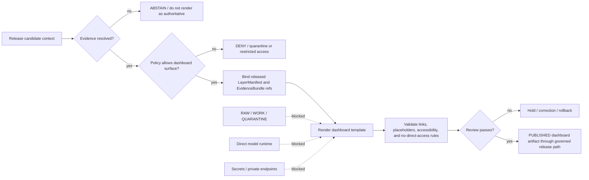

<!-- [KFM_META_BLOCK_V2]
doc_id: kfm://doc/NEEDS-VERIFICATION
title: dashboard_templates
type: standard
version: v1
status: draft
owners: @bartytime4life
created: NEEDS-VERIFICATION
updated: 2026-05-02
policy_label: public
related: [../README.md, ../viewer_templates/, ../web/, ../ui/, ../apps/, ../schemas/, ../contracts/, ../policy/, ../data/, ../release/, ../tools/, ../tests/, ../.github/CODEOWNERS]
tags: [kfm, dashboards, templates, ui, evidence, release]
notes: [Owner is based on the current public CODEOWNERS broad fallback and still needs active-branch and branch-ruleset verification; local mounted repo evidence was unavailable; verify sibling template files, renderer path, validation workflow, and stable links before treating this README as authoritative.]
[/KFM_META_BLOCK_V2] -->

<a id="top"></a>

# Dashboard Templates

Reusable, evidence-subordinate static dashboard templates for released Kansas Frontier Matrix artifacts.

> [!IMPORTANT]
> **Status:** `experimental` README surface · `draft` content  
> **Owners:** `@bartytime4life` *(fallback owner; verify active branch and enforcement)*  
> **Path:** `dashboard_templates/README.md`  
> **Truth posture:** `CONFIRMED` public-main path and sibling template names · `PROPOSED` render contract and validation rules · `UNKNOWN` local checkout, renderer implementation, CI behavior, and published dashboard runtime


**Quick jumps:** [Scope](#scope) · [Repo fit](#repo-fit) · [Accepted inputs](#accepted-inputs) · [Exclusions](#exclusions) · [Template inventory](#template-inventory) · [Render contract](#render-contract) · [Validation](#validation) · [Rollback](#rollback) · [Definition of done](#definition-of-done)

---

## Read this first

`dashboard_templates/` is a template surface, not a truth surface.

Dashboards may help reviewers, stewards, and trusted users inspect released evidence, compare status, and understand public-safe spatial outputs. They must not become a shortcut around KFM’s governed lifecycle:

```text
RAW -> WORK / QUARANTINE -> PROCESSED -> CATALOG / TRIPLET -> PUBLISHED
```

A rendered dashboard is valid only when it is downstream of released artifacts, review state, policy decisions, evidence resolution, and rollback-ready publication records.

> [!WARNING]
> A polished dashboard is not evidence. A chart, card, layer list, AI summary, tile, or screenshot must never replace `EvidenceBundle`, `ReleaseManifest`, `PolicyDecision`, review state, correction lineage, or source-role limits.

[Back to top](#top)

---

## Scope

This directory holds static dashboard template files used to produce governed, reviewable dashboard surfaces.

It is intended for lightweight presentation scaffolds such as HTML, CSS, and JavaScript templates that can be rendered from a validated dashboard context. It is not intended to hold generated dashboards, live data, source records, policy definitions, canonical schemas, release manifests, or runtime application code.

### This directory should make it easy to answer

| Question | Expected answer |
|---|---|
| What template files exist? | The sibling template files listed in [Template inventory](#template-inventory). |
| What can templates render? | Public-safe, released, evidence-resolved dashboard context only. |
| What must templates never read? | `RAW`, `WORK`, `QUARANTINE`, unpublished candidates, secrets, direct model output, or canonical stores. |
| What proves a dashboard is safe? | A validated render context, release linkage, policy posture, evidence references, review state, and rollback target. |
| What remains unresolved? | Renderer implementation, validation workflow, template variables, active branch state, and CI enforcement. |

[Back to top](#top)

---

## Repo fit

`dashboard_templates/` sits near other user-facing and runtime-adjacent surfaces, but it should remain thinner than `web/`, `ui/`, or `apps/`.

| Relationship | Target | Current posture |
|---|---|---|
| Upstream repository orientation | [`../README.md`](../README.md) | Root doctrine and repo identity. |
| Adjacent viewer templates | [`../viewer_templates/`](../viewer_templates/) | Related presentation-template surface; verify overlap before duplicating patterns. |
| Web/UI runtime surfaces | [`../web/`](../web/), [`../ui/`](../ui/), [`../apps/`](../apps/) | Runtime or application code belongs there, not here. |
| Contracts and schemas | [`../contracts/`](../contracts/), [`../schemas/`](../schemas/) | Machine authority belongs there; this README only describes template expectations. |
| Policy | [`../policy/`](../policy/) | Policy semantics and deny/abstain rules belong there. |
| Evidence lifecycle | [`../data/`](../data/), [`../release/`](../release/) | Receipts, proofs, catalogs, release objects, published artifacts, and rollback references belong there. |
| Validation and tests | [`../tools/`](../tools/), [`../tests/`](../tests/) | Template validators and fixtures should be reusable outside GitHub Actions. |
| Ownership routing | [`../.github/CODEOWNERS`](../.github/CODEOWNERS) | Fallback ownership is visible; enforcement still needs verification. |

### Boundary contract

| `dashboard_templates/` may | `dashboard_templates/` must not |
|---|---|
| Provide static template scaffolds. | Own canonical truth, source authority, or policy semantics. |
| Define reviewable placeholder expectations. | Store generated dashboards as if they were release objects. |
| Document render-safety rules. | Pull directly from internal stores, model runtimes, secrets, or unpublished data. |
| Support reviewer-friendly dashboards downstream of release evidence. | Publish unsupported claims, unreviewed summaries, or sensitive exact locations. |

[Back to top](#top)

---

## Accepted inputs

Only template-supporting materials belong here.

| Input family | Belongs here when… | Required posture |
|---|---|---|
| `*.html.template` | It is a static dashboard page scaffold. | Must render from validated context, not direct data fetches. |
| `*.css.template` | It styles dashboard output without encoding evidentiary meaning. | Must preserve accessibility and not hide state labels. |
| `*.js.template` | It provides small client behavior for rendered dashboards. | Must not bypass governed APIs, call model runtimes directly, or fetch private data. |
| Placeholder notes | They explain allowed template variables. | Must distinguish confirmed placeholders from proposed placeholders. |
| Sanitized fixture context | It helps test rendering without live data. | Should move to tests/fixtures if it becomes executable test material. |
| README updates | They explain template role, limits, validation, and rollback. | Must preserve KFM trust membrane language. |

### Template content rules

1. Prefer static rendering over live runtime calls.
2. Use escaped text substitution by default.
3. Treat every placeholder as untrusted until validated.
4. Show release, review, policy, stale-state, and evidence posture when available.
5. Prefer visible `ABSTAIN`, `DENY`, or `ERROR` states over silent omission.
6. Do not embed secrets, credentials, private endpoints, raw prompts, or unpublished payloads.

[Back to top](#top)

---

## Exclusions

| Do not place here | Put it here instead | Why |
|---|---|---|
| Generated dashboard outputs | [`../release/`](../release/) or published-artifact homes after verification | Publication is a governed state transition, not a template write. |
| Source data, fixtures with real records, or lifecycle artifacts | [`../data/`](../data/) and appropriate lifecycle subtrees | Templates must not become data stores. |
| `EvidenceBundle`, `ReleaseManifest`, `PolicyDecision`, or proof object schemas | [`../schemas/`](../schemas/) or [`../contracts/`](../contracts/) after schema-home verification | Machine authority should not be duplicated. |
| Policy rules or access-control logic | [`../policy/`](../policy/) | Policy semantics must remain testable and reusable. |
| Runtime app components | [`../web/`](../web/), [`../ui/`](../ui/), or [`../apps/`](../apps/) | Templates are not application packages. |
| Renderers, validators, or build scripts | [`../tools/`](../tools/) and [`../tests/`](../tests/) | Executable behavior should be testable outside this README. |
| RAW, WORK, QUARANTINE, unpublished candidates, secrets, API keys, or credentials | Nowhere public; quarantine or secure stores only | Public and ordinary UI paths must fail closed. |
| Emergency, legal, medical, title, cultural, archaeological, ecological, living-person, or sensitive-location claims without release support | Governed review and policy lanes first | High-consequence claims require stronger evidence, policy, and review. |

[Back to top](#top)

---

## Template inventory

Observed public-main template family; recheck the active branch before merge.

```text
dashboard_templates/
├── README.md
├── dashboard.css.template
├── dashboard.js.template
└── index.html.template
```

| File | Role | Current burden |
|---|---|---|
| [`README.md`](./README.md) | Directory orientation, constraints, validation, rollback, and maintenance rules. | Must remain evidence-bounded and update when template behavior changes. |
| [`index.html.template`](./index.html.template) | Dashboard page scaffold. | Must not publish unsupported claims; current confirmed placeholder family is minimal. |
| [`dashboard.css.template`](./dashboard.css.template) | Dashboard styling scaffold. | Must not hide evidence, review, policy, stale, denied, or error states. |
| [`dashboard.js.template`](./dashboard.js.template) | Dashboard behavior scaffold. | Must not call canonical stores, raw lifecycle paths, secrets, or direct model runtimes. |

> [!NOTE]
> The sibling templates appear intentionally minimal. Treat them as scaffolds until a render context, validation workflow, fixture set, and release linkage are confirmed.

[Back to top](#top)

---

## Render contract

### Canonical posture

A dashboard render should be a derived, reviewable communication artifact created from released, public-safe, evidence-resolved inputs. It is not a source of authority by itself.

### PROPOSED minimum render inputs

| Field family | Purpose | Required before public use |
|---|---|---|
| `dashboard_title` | Human-readable title. | Yes; must be escaped. |
| `release_id` | Connects the dashboard to a governed release event. | Yes for release-bearing dashboards. |
| `generated_at` | Records render time. | Yes. |
| `template_version` | Supports rollback and comparison. | Yes. |
| `layer_manifest_refs` | Links rendered map/layer content to layer metadata and release posture. | Required when spatial layers appear. |
| `evidence_bundle_refs` | Links claims/cards/charts to resolved evidence. | Required for consequential claims. |
| `policy_decision_refs` | Shows rights, sensitivity, access, and publication posture. | Required for public or semi-public outputs. |
| `review_state` | Distinguishes draft, reviewed, released, corrected, withdrawn, or superseded dashboards. | Yes. |
| `correction_notice_refs` | Makes corrections and withdrawal lineage visible. | Required when applicable. |
| `rollback_ref` | Identifies the rollback target or recovery plan. | Required for release-bearing outputs. |

### Illustrative render context

This is an example shape, not schema authority.

```json
{
  "schema_version": "dashboard_template_context.v1",
  "dashboard_title": "Hydrology Evidence Dashboard",
  "release_id": "kfm://release/NEEDS-VERIFICATION",
  "generated_at": "NEEDS-VERIFICATION",
  "template_version": "NEEDS-VERIFICATION",
  "review_state": "draft",
  "public_release_allowed": false,
  "layer_manifest_refs": ["kfm://layer/NEEDS-VERIFICATION"],
  "evidence_bundle_refs": ["kfm://evidence/NEEDS-VERIFICATION"],
  "policy_decision_refs": ["kfm://policy-decision/NEEDS-VERIFICATION"],
  "correction_notice_refs": [],
  "rollback_ref": "kfm://rollback/NEEDS-VERIFICATION",
  "notes": [
    "Illustrative only; define machine authority in schemas/contracts after repo verification."
  ]
}
```

[Back to top](#top)

---

## Lifecycle diagram



[Back to top](#top)

---

## Placeholder rules

| Placeholder type | Status | Rule |
|---|---|---|
| `{{dashboard_title}}` | CONFIRMED sibling-template placeholder | Escape as text; never allow raw HTML injection. |
| `{{release_id}}` | PROPOSED | Use only after release-object conventions are verified. |
| `{{generated_at}}` | PROPOSED | Use ISO-like timestamp formatting from the render process. |
| `{{review_state}}` | PROPOSED | Must remain visible when dashboard is draft, stale, corrected, or withdrawn. |
| `{{policy_posture}}` | PROPOSED | Must surface `ALLOW`, `DENY`, `ABSTAIN`, or `ERROR`-like outcomes when policy is consequential. |
| `{{evidence_refs}}` | PROPOSED | Link to resolved evidence surfaces; do not embed unreviewed raw evidence payloads. |
| `{{correction_lineage}}` | PROPOSED | Show correction, withdrawal, or supersession notices when applicable. |

### Unsafe placeholder behavior

Do not add placeholders that directly substitute:

- unescaped HTML from source records
- API keys or bearer tokens
- direct database URLs
- RAW, WORK, or QUARANTINE file paths
- internal model prompts or raw model output
- exact sensitive locations without reviewed public-safe transforms
- unvalidated claims, charts, counts, or summaries

[Back to top](#top)

---

## Validation

Run these checks from `dashboard_templates/` or adapt them into repo-native tooling after the real validation convention is confirmed.

```bash
# Inspect template placeholders.
grep -RIn "{{[A-Za-z0-9_:-]*}}" .

# Flag direct access patterns that should not appear in static dashboard templates.
grep -RInE "data/(raw|work|quarantine)|Authorization|api[_-]?key|secret|token|localhost:11434|ollama|openai|/internal|/admin" . || true

# Check that all sibling templates are still present.
test -f README.md
test -f index.html.template
test -f dashboard.css.template
test -f dashboard.js.template
```

> [!CAUTION]
> The commands above are inspection helpers, not proof of release readiness. A public dashboard also needs evidence closure, policy approval, review state, release linkage, and rollback support.

### Validation matrix

| Check | Required result |
|---|---|
| Placeholder inventory | Every placeholder is documented or intentionally flagged `NEEDS VERIFICATION`. |
| HTML escaping | Text placeholders are escaped by default. |
| Link integrity | Relative links in this README resolve from `dashboard_templates/`. |
| No direct internal access | Templates do not reference raw lifecycle paths, internal admin endpoints, private stores, secrets, or model runtimes. |
| Evidence support | Consequential dashboard claims link to `EvidenceBundle` or abstain. |
| Policy support | Rights, sensitivity, and access posture are visible where consequential. |
| Review support | Draft, reviewed, released, corrected, withdrawn, and superseded states are not hidden. |
| Rollback support | Release-bearing dashboards have a rollback target. |
| Accessibility | Dashboard templates preserve headings, readable contrast, keyboard navigation, and visible negative states. |

[Back to top](#top)

---

## Maintenance rules

1. Update this README when a template file is added, removed, renamed, or promoted.
2. Add a placeholder registry before expanding placeholder use.
3. Keep rendering logic small; move reusable logic to validated tools or runtime packages.
4. Keep templates public-safe by default.
5. Treat dashboard screenshots as derived communication artifacts, not evidence.
6. Preserve stable links and headings where practical.
7. Add fixtures and negative-path tests before using templates for public or semi-public dashboards.
8. Record rollback instructions when templates affect release-bearing dashboard outputs.

[Back to top](#top)

---

## Definition of done

A dashboard template change is not done until the relevant items below are true.

- [ ] Active branch confirms `dashboard_templates/README.md` and sibling templates.
- [ ] Owners are verified from current CODEOWNERS or a narrower owner source.
- [ ] Placeholder inventory is current.
- [ ] Templates do not embed secrets, credentials, private endpoints, direct model calls, or raw lifecycle paths.
- [ ] Consequential dashboard claims resolve to evidence or visibly abstain.
- [ ] Policy, review, release, stale-state, and correction posture remain visible where relevant.
- [ ] Rendered examples use sanitized fixtures only.
- [ ] Accessibility expectations are checked.
- [ ] Generated outputs are routed to release/published artifact homes, not committed into this template directory as authority.
- [ ] Rollback target is documented for release-bearing template changes.
- [ ] README links are checked from `dashboard_templates/`.
- [ ] Any schema or contract implied by this README is created in the verified schema/contract home, not silently defined here.

[Back to top](#top)

---

## Rollback

Rollback is required when a template change weakens evidence visibility, hides policy or review state, introduces unsupported public claims, exposes sensitive or unpublished data, breaks stable dashboard rendering, or makes generated dashboards appear authoritative without release support.

| Trigger | Rollback action |
|---|---|
| Template exposes RAW, WORK, QUARANTINE, unpublished candidates, private endpoints, or secrets. | Remove the template change, rotate affected secrets if needed, and create a review record. |
| Dashboard renders unsupported claims as authoritative. | Revert template change and issue or link a correction notice for affected outputs. |
| Placeholder expansion is undocumented. | Revert or quarantine expansion until placeholder registry and tests exist. |
| Generated dashboard lands in this directory as authority. | Move or remove generated artifact; route through release/published artifact process after verification. |
| Accessibility or negative-state visibility regresses. | Revert style/behavior change or restore visible states. |
| Schema/contract authority is duplicated here. | Move machine authority to verified schema/contract home and keep this README descriptive. |

Rollback target: `ROLLBACK_TARGET_TBD_AFTER_ACTIVE_BRANCH_VERIFICATION`

[Back to top](#top)

---

## Open verification backlog

| Item | Status | Needed evidence |
|---|---|---|
| Active branch sibling files | NEEDS VERIFICATION | Mounted checkout or current repository file census. |
| README prior content | NEEDS VERIFICATION | Confirm whether target branch README is empty or contains hidden/stale content. |
| Owner enforcement | NEEDS VERIFICATION | CODEOWNERS plus branch/ruleset evidence. |
| Dashboard renderer | UNKNOWN | Tool, script, app, workflow, or package that consumes these templates. |
| Template context schema | PROPOSED | Schema/contract home decision and fixture tests. |
| Render receipt | PROPOSED | Receipt object and validation workflow. |
| Generated output home | NEEDS VERIFICATION | Release/published artifact convention. |
| CI validation | UNKNOWN | Workflow YAML, test runner, package manager, and emitted artifacts. |
| Accessibility checks | PROPOSED | Manual or automated accessibility review path. |
| Public-release policy | NEEDS VERIFICATION | Policy engine, policy files, and reviewer gate evidence. |

[Back to top](#top)

---

<details>
<summary>Appendix — maintainer checklist for adding a new dashboard template</summary>

Use this checklist before adding a new `*.template` file.

- [ ] Name the template for the dashboard role, not for a temporary experiment.
- [ ] Document every placeholder.
- [ ] Confirm the template renders from validated context only.
- [ ] Keep data, release objects, proof objects, and generated dashboards outside this directory.
- [ ] Add sanitized fixtures and negative-path tests before public use.
- [ ] Ensure `ABSTAIN`, `DENY`, `ERROR`, stale, corrected, and withdrawn states remain visible.
- [ ] Link to evidence and release objects by reference rather than embedding unreviewed payloads.
- [ ] Update this README’s inventory, validation matrix, and rollback table.
- [ ] Verify links from `dashboard_templates/`.
- [ ] Preserve KFM’s trust membrane.

</details>

[Back to top](#top)
