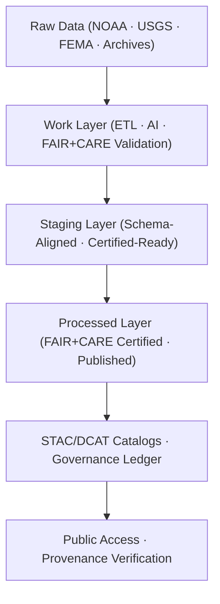
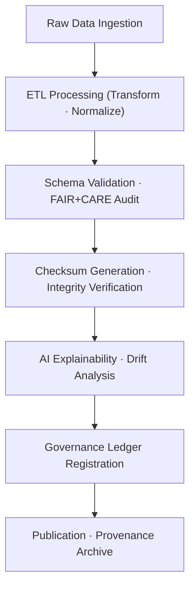

<div align="center">

# 🧱 Kansas Frontier Matrix — **Data Architecture Specification**
`data/ARCHITECTURE.md`

**Purpose:**  
Defines the **structural, procedural, and ethical foundations** of the Kansas Frontier Matrix (KFM) data ecosystem.  
Ensures all datasets — from ingestion to publication — comply with **FAIR+CARE**, **ISO metadata**, and **MCP-DL v6.3** documentation-first standards.

[](../docs/README.md)
[](../LICENSE)
[](../docs/standards/faircare-validation.md)
[]()
[]()

</div>

---

## 📘 Overview

The **KFM Data Architecture** provides a modular, scalable, and ethically governed foundation for acquiring, processing, validating, and disseminating environmental, cultural, and historical data.

This specification codifies:
- The **multi-layered data model** (Raw → Work → Staging → Processed → Archive).  
- **FAIR+CARE** governance workflows and ethics checkpoints.  
- **AI explainability** & provenance integration requirements.  
- **STAC/DCAT 3.0** catalog interoperability and metadata linkage.

---

## 🧭 Data Architecture Framework



### System Highlights

| Element | Description |
|---|---|
| **Modular Architecture** | Directory-based layers isolate concerns and enable traceability. |
| **Ethical Design** | FAIR+CARE, CARE, and ISO 37000-aligned review gates. |
| **Transparency** | Immutable provenance ledgers record all critical events. |
| **Automation** | CI/CD validation pipelines guarantee continuous compliance. |
| **Interoperability** | Native **STAC 1.0**, **DCAT 3.0**, **GeoJSON/Parquet/NetCDF** support. |

---

## 🗂️ Directory Hierarchy

```plaintext
data/
├── raw/                                   # Unaltered public and archival sources (+ source metadata)
├── work/                                  # Operational workspace for ETL, AI, validation
│   ├── tmp/                               # Transient layer for transforms/tests
│   ├── staging/                           # Schema-aligned data under audit
│   └── processed/                         # Ready for release packaging
│
├── processed/                             # Final FAIR+CARE-certified datasets
├── reports/                               # Validation/FAIR+CARE/AI governance & telemetry outputs
├── checksums/                             # Hash registries (SHA-256) for integrity and lineage
├── stac/                                  # STAC collections and items (static catalog)
└── archive/                               # Immutable, versioned, certified data releases
```

---

## ⚙️ Core Data Layers

| Layer | Description | Governance Role |
|---|---|---|
| **Raw** | Original, unaltered datasets with source/licensing metadata. | Provenance preservation |
| **Work** | Active transformation, validation, AI explainability instrumentation. | Ethics & validation |
| **Staging** | Schema-aligned datasets pending council certification. | Compliance checkpoint |
| **Processed** | Publicly released, FAIR+CARE-approved datasets with checksums. | Open distribution |
| **Archive** | Permanently preserved certified releases with manifests/SBOM. | Provenance ledger |

---

## 🧠 FAIR+CARE Data Governance Model

| Principle | Implementation | Oversight |
|---|---|---|
| **Findable** | STAC/DCAT catalogs, global IDs, SBOM/manifest cross-links. | `@kfm-data` |
| **Accessible** | Open data formats (CSV/Parquet/GeoJSON/NetCDF), public catalogs. | `@kfm-accessibility` |
| **Interoperable** | FAIR schema + **ISO 19115/CF** metadata alignment. | `@kfm-architecture` |
| **Reusable** | Versioned schemas, lineage, and licensing preserved. | `@kfm-design` |
| **Collective Benefit** | Equitable public access to environmental/cultural knowledge. | `@faircare-council` |
| **Authority to Control** | FAIR+CARE Council certifies publish gates and deltas. | `@kfm-governance` |
| **Responsibility** | Full audit trails in `data/reports/audit/`. | `@kfm-security` |
| **Ethics** | CARE-aligned sensitive content review and redaction. | `@kfm-ethics` |

---

## 📊 Data Validation Workflow



### Validation Stages

| Stage | Output | Tooling |
|---|---|---|
| **Schema Validation** | `schema_validation_summary.json` | JSON Schema · STAC/DCAT validators |
| **Checksum Verification** | `checksum_manifest.json` | SHA-256 · SPDX linkages |
| **FAIR+CARE Audit** | `faircare_validation_report.json` | FAIR+CARE audit runner |
| **AI Explainability** | `ai_validation_ledger.json` | SHAP/LIME · counterfactuals |
| **Ledger Registration** | `data_provenance_ledger.json` | Blockchain-linked governance registry |

---

## 🧩 STAC & DCAT Interoperability

| Catalog | Description | Compliance |
|---|---|---|
| **STAC 1.0** | Spatio-temporal catalog for geospatial assets & derivatives. | OGC Community Standard |
| **DCAT 3.0** | Dataset/Distribution descriptors for cross-portal discovery. | W3C DCAT alignment |
| **CIDOC CRM** | Semantic ontology for historical/archival entities. | ISO 21127 mapping |

**STAC root:** `data/stac/catalog.json`

---

## ⚖️ Provenance & Audit Integration

| Record Type | Description | Stored In |
|---|---|---|
| **Audit Logs** | FAIR+CARE and validation results; AI governance notes. | `data/reports/audit/` |
| **Checksum Registry** | File-level integrity proofs per dataset/release. | `data/checksums/` |
| **Governance Ledger** | Immutable blockchain-backed governance index. | `data/reports/audit/data_provenance_ledger.json` |
| **FAIR+CARE Reports** | Council reviews & certification summaries. | `data/reports/fair/` |

---

## 🌱 Sustainability & Ethical Stewardship

| Practice | Description | Standard |
|---|---|---|
| **Renewable Infrastructure** | Pipelines run on **RE100**-compliant compute. | ISO 14064 |
| **Carbon/Energy Accounting** | Energy & CO₂e tracked in telemetry; reported per release. | ISO 50001 · 14064 |
| **Ethical AI Governance** | All AI workflows bias-audited and explainable. | FAIR+CARE |
| **Data Lifespan Management** | Certified datasets archived indefinitely with ledgers. | MCP-DL v6.3 |

---

## 🧾 Internal Use Citation

```text
Kansas Frontier Matrix (2025). Data Architecture Specification (v9.7.0).
Comprehensive FAIR+CARE-certified architecture defining ethical data pipelines, schema governance,
and provenance systems for Kansas Frontier Matrix. Ensures open, sustainable, and reproducible
scientific data practices across domains.
```

---

## 🕰️ Version History

| Version | Date | Author | Summary |
|---|---|---|---|
| v9.7.0 | 2025-11-06 | `@kfm-data` | Upgraded to v9.7.0; badge syntax hardened; STAC/DCAT paths refreshed; telemetry schema v9. |
| v9.6.0 | 2025-11-03 | `@kfm-data` | Added DCAT 3.0, CIDOC CRM, and telemetry-linked governance reports. |
| v9.5.0 | 2025-11-02 | `@kfm-data` | Introduced sustainability metrics and energy reporting integration. |
| v9.3.2 | 2025-10-28 | `@kfm-core` | Established FAIR+CARE-compliant layer definitions and validation pipeline. |

---

<div align="center">

**Kansas Frontier Matrix**  
*FAIR+CARE Data Ethics × Sustainable Provenance × Open Science Governance*  
© 2025 Kansas Frontier Matrix — CC-BY 4.0  

[Back to Docs Index](../docs/README.md) · [Governance Charter](../docs/standards/governance/DATA-GOVERNANCE.md) · [FAIR+CARE Summary](../data/reports/fair/faircare_summary.json)

</div>
