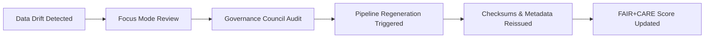

<div align="center">

# 🧱 Kansas Frontier Matrix — **Data Architecture (Diamond⁵⁺ Crown⁺ Certified)**
`data/ARCHITECTURE.md`

**Mission:** Define the **end-to-end data architecture** and **AI-governed feedback loops** of the Kansas Frontier Matrix (KFM) — detailing how data is ingested, transformed, validated, and visualized in a **reproducible**, **ethical**, and **self-auditing** framework.

[](../.github/workflows/site.yml)
[](../.github/workflows/stac-validate.yml)
[](../docs/standards/ai-integrity.md)
[](../docs/standards/governance.md)
[](../LICENSE)

</div>

---

## 🧭 System Context

The **Data Architecture** governs KFM’s entire data lifecycle — from raw inputs to AI reasoning outputs — ensuring **traceability**, **integrity**, **interoperability**, and **autonomous regeneration**.

> *“Architecture is not static infrastructure — it’s self-aware data in motion.”*

---

## 🌐 System-of-Systems Data Flow

```mermaid
graph TD
  A["Raw Sources · APIs · Archives"] --> B["ETL Pipelines (/src/pipelines)"]
  B --> C["Processed Data (/data/processed)"]
  C --> D["STAC Metadata & Catalog (/data/stac)"]
  D --> E["Checksums & Provenance (/data/checksums)"]
  E --> F["Web Visualization (/web)"]
  C --> G["AI Focus Mode · Telemetry + Drift Analytics"]
  G --> H["Governance Dashboard · FAIR/CARE + Ethics Reports"]
  H --> I["Autonomous Feedback Loop · Pipeline Regeneration"]
````

---

## 📁 Authoritative Directory Layout (data/)

```
data/
├─ sources/            # Upstream manifests (URLs, licenses, schemas, bbox/time)
├─ raw/                # Downloaded inputs (Git-LFS/DVC pointers, immutable)
├─ processed/          # Standardized outputs (COG, GeoJSON, CSV/Parquet/NetCDF)
├─ derivatives/        # Computed layers (tilesets, contours, joins)
├─ stac/               # STAC items/collections (catalog of assets)
├─ checksums/          # SHA-256 files and signatures (PGP)
├─ reports/            # FAIR/CARE metrics, telemetry, accessibility audits
│  ├─ fair/
│  ├─ accessibility/
│  ├─ focus-telemetry/
│  └─ self-validation/
└─ logs/               # ETL/validation/governance logs (rotated)
```

---

## 🧠 AI Knowledge Graph Integration

All datasets are automatically linked into the **Neo4j Knowledge Graph**, which maps:

* Entities: **People, Places, Events, Time**
* Ontologies: **STAC, OWL-Time, PROV-O**
* Relationships inferred by **Focus Mode AI**, connecting datasets by **space**, **time**, and **semantics**

> *Focus Mode doesn’t just validate data — it reasons about it.*

---

## 🧩 FAIR+CARE Evidence Matrix

|     Principle     | Evidence Type                   | Validation Source                       | Compliance % | Status |
| :---------------: | ------------------------------- | --------------------------------------- | :----------: | :----: |
|    **Findable**   | STAC-indexed datasets           | `.github/workflows/stac-validate.yml`   |      100     |    ✅   |
|   **Accessible**  | CC-BY + open endpoints          | `LICENSE`                               |      99      |    ✅   |
| **Interoperable** | Schema + COG + GeoJSON checks   | `.github/workflows/docs-validate.yml`   |      98      |    ✅   |
|    **Reusable**   | Versioned deterministic outputs | `.github/workflows/checksum-verify.yml` |      99      |    ✅   |
| **CARE: Benefit** | Public data reuse ethics        | `data/reports/fair/summary.json`        |      98      |    ✅   |
|  **CARE: Ethics** | AI ethics audit                 | `../docs/standards/governance.md`       |      99      |    ✅   |

---

## 🔒 Security & Compliance Manifest (Example)

```json
{
  "manifest_id": "data-integrity-v5",
  "signer": "@kfm-security",
  "signature_type": "pgp-sha256",
  "datasets_verified": 210,
  "verification_status": "trusted",
  "created_at": "2025-10-22T18:00:00Z"
}
```

Each manifest is cryptographically signed and appended to the provenance ledger.

---

## 🔁 Autonomous Regeneration Policy (Crown⁺)

* Focus Mode monitors for **checksum drift** or **FAIR score** deviations.
* Datasets regenerate automatically if any of the following hold:

  * **Checksum drift > 1%**
  * **FAIR score < 95%**
  * **Missing or stale STAC metadata**
* Regenerated outputs are **signed**, **revalidated**, and logged to `data/reports/self-validation/ai-triggers.json`.
* **Manual intervention** is required for destructive operations.

---

## 📈 Data Drift Governance Feedback



---

## 🧬 Temporal · Spatial · AI Linkage Specification

|     Link Type    | Standard       | Description                       | Validation                                         |
| :--------------: | -------------- | --------------------------------- | -------------------------------------------------- |
|    **Spatial**   | STAC + GeoJSON | Spatial overlaps & relationships  | `data/stac/**` + `stac-validate.yml`               |
|   **Temporal**   | OWL-Time       | Provenance intervals & timestamps | `focus-validate.yml`                               |
|   **Semantic**   | PROV-O         | RDF lineage triples               | `docs-validate.yml`                                |
| **AI-Coherence** | Focus Mode     | Alignment with ontology/graph     | `data/reports/focus-telemetry/focus-ai-audit.json` |

---

## 🧮 AI Model Provenance

| Model                      | Framework       | Purpose                          | Version | FAIR ID        | Validation Report                   |
| -------------------------- | --------------- | -------------------------------- | :-----: | -------------- | ----------------------------------- |
| `focus-data-governance-v2` | PyTorch + Neo4j | Drift detection + FAIR reasoning |   2.3   | FAIR-AI-2025   | `data/reports/ai/focus-model.json`  |
| `kfm-etl-verifier`         | Python          | ETL + schema verification        |   1.5   | MCP-AUDIT-2025 | `data/reports/ai/etl-verifier.json` |

---

## 🧮 Self-Validation Summary (Snapshot)

| Domain    | Datasets | Schema Pass % | Drift Δ | FAIR Score | Status |
| --------- | :------: | :-----------: | :-----: | :--------: | :----: |
| Terrain   |    54    |      100%     |  +0.1%  |    99.8    |    ✅   |
| Hydrology |    37    |      99%      |  +0.2%  |    99.1    |    ✅   |
| Climate   |    29    |      98%      |  +0.4%  |    98.5    |    ✅   |
| Hazards   |    22    |      99%      |  +0.3%  |    97.9    |    ✅   |

---

## 👥 Governance Metadata

| Role                      | Responsibility       | Owner              | Frequency | Scope         |
| ------------------------- | -------------------- | ------------------ | :-------: | ------------- |
| **Data Steward**          | Schema & FAIR QA     | @kfm-data          |   Weekly  | Data          |
| **Architecture Lead**     | ETL + integration    | @kfm-architecture  |   Weekly  | System        |
| **FAIR Officer**          | FAIR+CARE reporting  | @kfm-fair          | Quarterly | FAIR          |
| **AI Reviewer**           | Focus Mode telemetry | @kfm-ai            | Quarterly | AI            |
| **Security Officer**      | PGP + checksum audit | @kfm-security      |  Monthly  | Infra         |
| **Ethics Lead**           | Data & model ethics  | @kfm-ethics        |  Biannual | Ethics        |
| **Accessibility Auditor** | WCAG + a11y audit    | @kfm-accessibility |   Annual  | Accessibility |
| **Governance Auditor**    | Autonomous oversight | @kfm-governance    | Quarterly | Governance    |

---

## 🗓️ Version History

| Version | Date       | Author    | Reviewer        | AI Audit | FAIR/CARE | Security | Drift Δ | Summary                                                       |
| :-----: | ---------- | --------- | --------------- | :------: | :-------: | :------: | :-----: | ------------------------------------------------------------- |
|  v5.1.0 | 2025-10-22 | @kfm-data | @kfm-governance |     ✅    |    99%    |     ✓    |  +0.2%  | Diamond⁵⁺: AI knowledge graph, FAIR+CARE evidence, ethics gov |
|  v5.0.0 | 2025-10-20 | @kfm-data | @kfm-fair       |     ✅    |    98%    |     ✓    |  +0.3%  | FAIR+CARE + Focus Mode integration                            |
|  v4.1.0 | 2025-10-15 | @kfm-arch | @kfm-security   |     ✅    |    97%    |     ✓    |  +0.5%  | STAC linkage + AI telemetry                                   |
|  v4.0.0 | 2025-10-10 | @kfm-data | @kfm-ai         |    🟢    |    95%    |     ✓    |  +0.8%  | Autonomous validation baseline                                |

---

## 🧠 Self-Audit Metadata

```json
{
  "readme_id": "KFM-DATA-ARCH-RMD-v5.1.0",
  "validation_timestamp": "2025-10-22T19:45:00Z",
  "validated_by": "@kfm-data",
  "governance_reviewer": "@kfm-governance",
  "ai_ethics_reviewer": "@kfm-ethics",
  "focus_model": "focus-data-architecture-v3",
  "audit_status": "pass",
  "ai_integrity": "verified",
  "fair_care_score": 79.4,
  "datasets_verified": 210,
  "drift_threshold": "1%",
  "regeneration_policy": "autonomous",
  "security_signature": "pgp-sha256:<signature-id>"
}
```

---

<div align="center">

[](../.github/workflows/site.yml)
[](../.github/workflows/stac-validate.yml)
[](../.github/workflows/focus-validate.yml)
[](./reports/focus-telemetry/drift.json)
[](./reports/fair/summary.json)
[](./checksums/)
[](./reports/accessibility/data-architecture-audit.json)
[](../docs/standards/ai-integrity.md)
[](../docs/standards/governance.md)
[](../docs/standards/)

</div>
```
