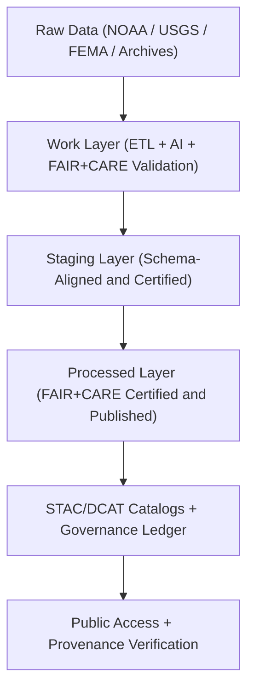
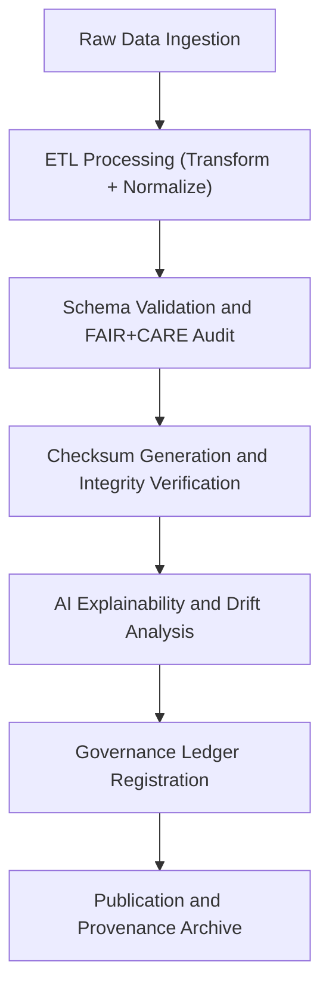

<div align="center">

# 🧱 Kansas Frontier Matrix — **Data Architecture Specification**
`data/ARCHITECTURE.md`

**Purpose:**  
Defines the **structural, procedural, and ethical foundations** of the Kansas Frontier Matrix (KFM) data ecosystem.  
This specification ensures that all datasets — from ingestion to publication — conform to FAIR+CARE governance, ISO metadata standards, and MCP-DL v6.3 documentation-first compliance.

[](../docs/standards/faircare-validation.md)
[]()
[]()
[](../LICENSE)

</div>

---

## 📚 Overview

The **KFM Data Architecture** provides a modular, scalable, and ethically governed foundation for the acquisition, processing, validation, and dissemination of environmental, cultural, and historical data.  
This specification codifies:
- The **multi-layered data model** (Raw → Work → Staging → Processed → Archive).  
- FAIR+CARE-aligned data governance workflows.  
- AI explainability and provenance integration standards.  
- STAC/DCAT 3.0 catalog interoperability and metadata linkage.

---

## 🧭 Data Architecture Framework



### System Highlights
| Element | Description |
|----------|--------------|
| **Modular Architecture** | Distinct directory-based data layers for traceable operations. |
| **Ethical Design** | FAIR+CARE, CARE, and ISO 37000-aligned workflows. |
| **Transparency** | Immutable provenance ledgers document every modification. |
| **Automation** | CI/CD-driven validation pipelines ensure continuous compliance. |
| **Interoperability** | Native STAC, DCAT 3.0, and GeoJSON/Parquet support. |

---

## 🗂️ Directory Hierarchy

```plaintext
data/
├── raw/                                   # Unaltered public and archival data sources
├── work/                                  # Operational workspace for ETL and validation
│   ├── tmp/                               # Transient layer for AI and FAIR+CARE workflows
│   ├── staging/                           # Schema-aligned data under audit
│   └── processed/                         # Certified datasets ready for public distribution
│
├── processed/                             # Final, FAIR+CARE-certified datasets
├── reports/                               # Validation, FAIR+CARE, and governance records
├── checksums/                             # Hash registries for reproducibility
├── stac/                                  # STAC catalogs for discoverable spatial datasets
└── archive/                               # Immutable archive of all certified data releases
```

---

## ⚙️ Core Data Layers

| Layer | Description | Governance Role |
|--------|--------------|-----------------|
| **Raw** | Original, unaltered datasets from public or archival sources. | Provenance preservation |
| **Work** | Active transformation and FAIR+CARE validation environment. | Ethics + validation |
| **Staging** | Schema-aligned datasets awaiting governance certification. | Compliance checkpoint |
| **Processed** | Publicly published, FAIR+CARE-approved datasets. | Open data distribution |
| **Archive** | Immutable record of certified data and validation proofs. | Permanent provenance ledger |

---

## 🧠 FAIR+CARE Data Governance Model

| Principle | Implementation | Oversight |
|------------|----------------|------------|
| **Findable** | STAC/DCAT catalogs maintain global discoverability. | @kfm-data |
| **Accessible** | Open access formats (CSV, Parquet, GeoJSON, NetCDF). | @kfm-accessibility |
| **Interoperable** | Data adheres to FAIR schema and ISO 19115 metadata. | @kfm-architecture |
| **Reusable** | Comprehensive lineage and licensing metadata. | @kfm-design |
| **Collective Benefit** | Supports public understanding and policy transparency. | @faircare-council |
| **Authority to Control** | FAIR+CARE Council authorizes publication workflows. | @kfm-governance |
| **Responsibility** | Audit reports stored in `data/reports/audit/`. | @kfm-security |
| **Ethics** | All datasets reviewed for cultural and environmental sensitivity. | @kfm-ethics |

---

## 📊 Data Validation Workflow



### Validation Stages

| Stage | Output | Tool |
|--------|---------|------|
| **Schema Validation** | `schema_validation_summary.json` | JSON Schema / MCP Validator |
| **Checksum Verification** | `checksum_manifest.json` | SHA-256 / Trivy |
| **FAIR+CARE Audit** | `faircare_validation_report.json` | FAIR+CARE AI Auditor |
| **AI Explainability** | `ai_validation_ledger.json` | SHAP / LIME |
| **Ledger Registration** | `data_provenance_ledger.json` | Blockchain-Linked Governance Registry |

---

## 🧩 Example Data Governance Record

```json
{
  "dataset_id": "hazards_processed_v9.6.0",
  "domain": "hazards",
  "schema_version": "v3.0.1",
  "records_total": 18324,
  "checksum_verified": true,
  "fairstatus": "certified",
  "ai_explainability_score": 0.992,
  "governance_registered": true,
  "ledger_ref": "data/reports/audit/data_provenance_ledger.json",
  "created": "2025-11-03T18:59:00Z",
  "validator": "@kfm-data"
}
```

---

## 🧩 STAC & DCAT Interoperability

| Catalog | Description | Compliance |
|----------|--------------|-------------|
| **STAC 1.0** | Spatial-temporal catalog linking all geospatial assets. | OGC / FAIR Compliant |
| **DCAT 3.0** | Metadata exchange standard for tabular and hybrid datasets. | W3C DCAT Alignment |
| **CIDOC CRM** | Semantic ontology for cultural and archival records. | ISO 21127 Integration |

STAC Collections published under:  
`data/stac/catalog.json`

---

## ⚖️ Provenance and Audit Integration

| Record Type | Description | Stored In |
|--------------|--------------|-----------|
| **Audit Logs** | FAIR+CARE validation results and provenance trace. | `data/reports/audit/` |
| **Checksum Registry** | File-level integrity proofs. | `data/checksums/` |
| **Governance Ledger** | Immutable blockchain-backed metadata index. | `data/reports/audit/data_provenance_ledger.json` |
| **FAIR+CARE Reports** | Compliance and ethics assessments. | `data/reports/fair/` |

---

## 🌱 Sustainability and Ethical Stewardship

| Practice | Description | Standard |
|-----------|--------------|-----------|
| **Renewable Infrastructure** | ETL workflows run on RE100-compliant compute clusters. | ISO 14064 |
| **Carbon Accounting** | Energy metrics tracked in telemetry for reporting. | ISO 50001 |
| **Ethical AI Governance** | All AI workflows reviewed for bias and transparency. | FAIR+CARE |
| **Data Lifespan Management** | Archived data preserved indefinitely with ledger registration. | MCP-DL v6.3 |

---

## 🧾 Internal Use Citation

```text
Kansas Frontier Matrix (2025). Data Architecture Specification (v9.6.0).
Comprehensive FAIR+CARE-certified architecture defining ethical data pipelines, schema governance, and provenance systems for Kansas Frontier Matrix.
Ensures open, sustainable, and reproducible scientific data practices across domains.
```

---

## 🧾 Version Notes

| Version | Date | Notes |
|----------|------|--------|
| v9.6.0 | 2025-11-03 | Updated schema to include DCAT 3.0, CIDOC CRM, and telemetry-linked governance reports. |
| v9.5.0 | 2025-11-02 | Added sustainability metrics and energy reporting integration. |
| v9.3.2 | 2025-10-28 | Established FAIR+CARE-compliant data layer definitions and validation pipeline. |

---

<div align="center">

**Kansas Frontier Matrix** · *FAIR+CARE Data Ethics × Sustainable Provenance × Open Science Governance*  
[🔗 Repository](https://github.com/bartytime4life/Kansas-Frontier-Matrix) • [🧭 Governance Ledger](../docs/standards/governance/DATA-GOVERNANCE.md) • [📊 FAIR+CARE Summary](../data/reports/fair/faircare_summary.json)

</div>