<div align="center">

# 🧱 Kansas Frontier Matrix — **Data Architecture**  
`data/ARCHITECTURE.md`

**Mission:** Define the **end-to-end data architecture** of the Kansas Frontier Matrix (KFM) —  
detailing how raw inputs are transformed, validated, documented, and visualized within a **reproducible**,  
**STAC-compliant**, and **MCP-governed** data ecosystem.

[](../.github/workflows/site.yml)
[](../.github/workflows/stac-validate.yml)
[](../.github/workflows/codeql.yml)
[](../.github/workflows/trivy.yml)
[](../docs/)
[](../LICENSE)

</div>

---

```yaml
---
title: "KFM • Data Architecture (data/ARCHITECTURE.md)"
version: "v1.3.0"
last_updated: "2025-10-16"
owners: ["@kfm-data", "@kfm-architecture"]
tags: ["architecture","data","etl","stac","provenance","mcp","cog","geojson","parquet"]
license: "CC-BY 4.0"
semantic_alignment:
  - STAC 1.0.0
  - GeoJSON (RFC 7946)
  - Cloud-Optimized GeoTIFF (COG)
  - CSVW / Apache Parquet
  - NetCDF / CF Conventions
  - MCP-DL v6.2 (Reproducibility & Provenance)
---
```

---

## 📚 Overview

The **Kansas Frontier Matrix Data Architecture** defines how data moves through the repository —  
from acquisition and transformation to metadata generation, validation, and visualization.

It ensures that every layer of data is:

- **Traceable** — from its `data/sources/*.json` manifest to its published **STAC Item**.  
- **Reproducible** — deterministic **ETL** and **validation** workflows.  
- **Auditable** — via **checksums**, provenance logs, and MCP documentation.  
- **Open** — using transparent, standards-based formats for maximum interoperability.  

This document is the **blueprint** for the KFM data subsystem — describing its lifecycle, governance model, and automated verification pipelines.

---

## 🗺️ Data Architecture Overview

```mermaid
flowchart TD
  A["🌐 External Sources\n(data/sources/)"] --> B["📦 Raw Data (immutable)\n(data/raw/)"]
  B --> C["⚙️ ETL Processing & Cleaning\n(src/pipelines/)"]
  C --> D["✅ Processed Data\n(data/processed/)"]
  D --> E["🧩 Metadata & STAC\n(data/processed/**/metadata/ · data/stac/)"]
  E --> F["🧾 Checksums & Validation\n(data/checksums/ · CI: stac-validate.yml)"]
  F --> G["🌎 Visualization & Web\n(data/tiles/ · web/config/)"]

  style A fill:#f8f9fa,stroke:#777;
  style B fill:#eef7ff,stroke:#0b6fff;
  style C fill:#fff0f6,stroke:#d4007f;
  style D fill:#e9fff0,stroke:#2daa2d;
  style E fill:#fff7e6,stroke:#e7a200;
  style F fill:#f0ebff,stroke:#7f2dea;
  style G fill:#f7f7f7,stroke:#333;
%% END OF MERMAID
```



---

## 🧩 Data Lifecycle Stages

| Stage | Directory | Purpose | Key Artifacts |
| :-- | :-- | :-- | :-- |
| **1. Source Registration** | `data/sources/` | Defines dataset origins, endpoints, and license details. | JSON manifests |
| **2. Raw Acquisition** | `data/raw/` | Immutable snapshots of downloaded or scraped source data. | GeoTIFF, CSV, NetCDF |
| **3. ETL Processing** | `src/pipelines/` | Clean, reproject, transform, and normalize inputs. | Python scripts, logs |
| **4. Processed Data** | `data/processed/` | Ready-to-use open datasets for analysis and visualization. | COGs, GeoJSON, CSV |
| **5. Metadata & STAC** | `data/processed/**/metadata/`, `data/stac/` | Provides metadata and catalog structure for assets. | STAC Items & Collections |
| **6. Integrity Validation** | `data/checksums/` | Verifies integrity using deterministic hashes. | `.sha256` manifests |
| **7. Visualization** | `data/tiles/`, `web/config/` | Powers frontend map & timeline systems. | Map tiles, config JSON |

---

## ⚙️ ETL Pipeline Architecture

| Domain | Pipeline Script | Output Directory | Description |
| :-- | :-- | :-- | :-- |
| **Terrain** | `terrain_pipeline.py` | `data/processed/terrain/` | Elevation models, hillshade, slope, aspect layers. |
| **Hydrology** | `hydrology_pipeline.py` | `data/processed/hydrology/` | River networks, basins, flood risk polygons. |
| **Landcover** | `landcover_pipeline.py` | `data/processed/landcover/` | NLCD, vegetation, cropland masks. |
| **Climate** | `climate_pipeline.py` | `data/processed/climate/` | Precipitation, temperature, drought indices. |
| **Hazards** | `hazards_pipeline.py` | `data/processed/hazards/` | Tornadoes, floods, wildfire, drought datasets. |
| **Tabular** | `tabular_pipeline.py` | `data/processed/tabular/` | Census, agriculture, economy datasets. |
| **Text** | `text_pipeline.py` | `data/processed/text/` | OCR and NLP results (treaties, newspapers). |

Each ETL run:

- Pulls inputs from `data/sources/`.  
- Logs actions to `data/work/logs/`.  
- Generates temporary intermediates in `data/work/tmp/`.  
- Produces checksums in `data/checksums/`.  
- Publishes metadata to `data/stac/`.

---

## 🧮 Validation & Integrity Layers

| Component | Function | Tooling |
| :-- | :-- | :-- |
| **Checksums** | Verify integrity of all data artifacts. | `hashlib`, `make checksums` |
| **Schema Validation** | Ensure JSON, STAC, and metadata compliance. | `jsonschema`, `stac-validator` |
| **STAC Compliance** | Confirm catalog consistency and relative link integrity. | GitHub Actions: `stac-validate.yml` |
| **Continuous Integration** | Validate with every commit and pull request. | `.github/workflows/ci.yml` |
| **Peer Review** | Human MCP data peer verification. | Manual review, provenance log updates |

---

## 🧠 Provenance Tracking

`Source → Raw → Processed → Metadata → Visualization`

| Artifact | Example Path | Purpose |
| :-- | :-- | :-- |
| **Source Manifest** | `data/sources/usgs_dem.json` | Defines origin and license for dataset. |
| **Checksum File** | `data/checksums/terrain/ks_dem_1m.sha256` | Verifies post-process integrity. |
| **STAC Item** | `data/stac/terrain/ks_dem_1m.json` | Records metadata and file references. |
| **ETL Log** | `data/work/logs/terrain_2025-10.log` | Documents operations performed. |
| **Pipeline Script** | `src/pipelines/terrain_pipeline.py` | Defines deterministic workflow. |

---

## 🔒 CI/CD Data Governance

| Workflow | Purpose | Trigger |
| :-- | :-- | :-- |
| `fetch.yml` | Ingest sources from manifest endpoints. | Manual / Scheduled |
| `stac-validate.yml` | Validate STAC schema and relationships. | Push / PR |
| `checksums.yml` | Generate and verify file integrity hashes. | Data updates |
| `codeql.yml` | Static analysis for ETL security. | Push / PR |
| `site.yml` | Build docs and web visualizations. | Merge to `main` |
| `trivy.yml` | Scan containers and dependencies. | Nightly |

---

## 🧰 Example Artifacts

### Source Manifest
```json
{
  "id": "usgs_ks_1m_dem_2018_2020",
  "title": "Kansas LiDAR DEM (1m, 2018–2020)",
  "license": "Public Domain (USGS 3DEP)",
  "type": "raster-dem",
  "endpoints": ["https://example.usgs.gov/3dep/ks_dem_1m_2018_2020.tif"],
  "spatial": { "bbox": [-102.05, 36.99, -94.59, 40.00], "crs": "EPSG:4326" },
  "temporal": { "start": "2018-01-01", "end": "2020-12-31" },
  "processing": { "reproject_to": "EPSG:4326", "cog": true }
}
```

### Checksum
```text
b2f3a18e2c87decd0c91ab4e1d73ccdd  data/processed/terrain/ks_dem_1m_2018_2020.tif
```

### STAC Item
```json
{
  "stac_version": "1.0.0",
  "type": "Feature",
  "id": "ks_dem_1m_2018_2020",
  "properties": {
    "title": "Kansas LiDAR DEM (1m, 2018–2020)",
    "datetime": "2020-01-01T00:00:00Z",
    "license": "Public Domain (USGS 3DEP)"
  },
  "assets": {
    "data": {
      "href": "../processed/terrain/ks_dem_1m_2018_2020.tif",
      "type": "image/tiff; application=geotiff; profile=cloud-optimized"
    }
  },
  "bbox": [-102.05, 36.99, -94.59, 40.00]
}
```

---

## 🧱 MCP Compliance Matrix

| MCP Principle | Implementation |
| :-- | :-- |
| **Documentation-First** | YAML metadata + STAC examples in each data directory. |
| **Reproducibility** | Deterministic ETL + Make targets + checksum verification. |
| **Open Standards** | STAC 1.0, GeoTIFF (COG), GeoJSON, CSVW, NetCDF. |
| **Provenance** | End-to-end lineage captured in manifests, logs, and metadata. |
| **Auditability** | Automated and manual validation on every update. |

---

## 🧩 Data Philosophy

1. **Transparency** — Every dataset has traceable lineage.  
2. **Reproducibility** — Every transformation is scriptable and logged.  
3. **Interoperability** — Every output uses open standards.  
4. **Extensibility** — Modular design supports future schema evolution.

---

## 📎 Related Documentation

| Path | Description |
| :-- | :-- |
| `data/README.md` | Overview of all data directories and conventions. |
| `data/sources/README.md` | Source manifests and dataset registry. |
| `data/stac/README.md` | STAC catalog design and validation guide. |
| `docs/architecture/` | Broader system architecture documentation. |
| `src/pipelines/` | ETL code and transformation logic. |

---

## 🧾 Version History

| Version | Date | Summary |
| :-- | :-- | :-- |
| **v1.0.0** | 2025-10-04 | Initial draft — defined architecture flow and ETL. |
| **v1.1.0** | 2025-10-10 | Added CI/CD integration and provenance schema. |
| **v1.3.0** | 2025-10-16 | Upgraded alignment: STAC 1.0, MCP-DL v6.2, tables, examples. |

---

<div align="center">

**Kansas Frontier Matrix** — *“Data Without Mystery: Every Byte Proven, Every Layer Reproducible.”*  
📍 [`data/ARCHITECTURE.md`](.) · Blueprint for the Kansas Frontier Matrix data subsystem.

</div>