<div align="center">

# 🗄️ **Kansas Frontier Matrix — Data System Architecture**  
`data/ARCHITECTURE.md`

**Purpose**  
Define the **complete v11.2.2 architecture** for KFM data ingestion, storage, validation, governance, lineage, STAC/DCAT cataloging, AI enrichment, and graph loading.  

This is the **canonical reference** for everyone touching `data/**`:
- ETL engineers  
- AI/ML practitioners  
- GIS specialists  
- Governance & FAIR+CARE reviewers  
- Focus Mode architects  

Designed to be **machine-readable**, **governance-enforced**, and **GitHub-safe**.

</div>

---

## 📘 1. High-Level Overview

The KFM Data System:

- Integrates **heterogeneous historical, environmental, cultural, and geologic data**.  
- Normalizes everything to a **common spatial, temporal, and semantic frame**.  
- Represents datasets via **STAC**, **DCAT**, and **JSON-LD** with FAIR+CARE governance metadata.  
- Loads results into a **Neo4j knowledge graph** aligned with:
  - CIDOC-CRM  
  - GeoSPARQL  
  - OWL-Time  
  - PROV-O  
  - KFM-OP v11  
- Tracks **lineage, integrity, governance decisions, and sustainability metrics**.  
- Exposes data to:
  - Focus Mode v3  
  - Story Nodes v3  
  - KFM APIs and web UIs  
  - Public-facing STAC/DCAT catalogs  

Core goals:

- Reproducible ETL and transformations  
- Transparent, auditable governance  
- Ethical and sovereign data use  
- Robust sustainability accounting  
- Tight integration with AI + visualization layers  

---

## 🗂️ 2. Data System Directory Architecture

The `data/` tree is the **physical backbone** of the KFM data platform. It follows the same canonical layout used across the project.

```text
📁 data/
│   📄 ARCHITECTURE.md             — This document (data system architecture)
│   📄 README.md                   — Data directory overview
│
│   📁 sources/                    — External dataset manifests and configs
│
│   📁 raw/                        — Original source datasets (immutable, append-only)
│   │   📁 hydrology/
│   │   📁 geology/
│   │   📁 history/
│   │   📁 remote-sensing/
│   │   📁 sovereignty/
│   │   📁 environmental/
│
│   📁 work/                       — Cleaned, normalized, enriched intermediates
│   │   📁 tables/                 — Normalized tabular data (CSV, Parquet)
│   │   📁 spatial/                — Intermediate GeoJSON/GPKG/rasters
│   │   📁 metadata/               — Pre-STAC/DCAT JSON/JSON-LD
│
│   📁 processed/                  — Deterministic ETL outputs (analysis-ready)
│   │   📁 hydrology/
│   │   📁 climate/
│   │   📁 ecology/
│   │   📁 historical/
│   │   📁 hazards/
│   │   📁 storynodes/
│
│   📁 stac/                       — STAC Items & Collections
│   │   📄 README.md               — STAC catalog overview
│   │   📄 catalog.json            — STAC root
│   │   📁 missions/               — EO mission namespaces (Sentinel, Landsat, etc.)
│   │   📁 hydrology/              — Hydrology STAC domain
│   │   📁 climate/                — Climate STAC domain
│   │   📁 hazards/                — Hazards STAC domain
│   │   📁 landcover/              — Landcover/Land use STAC domain
│   │   📁 tabular/                — Tabular STAC domain
│
│   📁 dcat/                       — DCAT 3.0 catalogs (JSON-LD)
│   │   📄 catalog.jsonld          — Root DCAT catalog
│   │   📁 datasets/               — DCAT dataset descriptions
│
│   📁 archive/                    — Versioned, retired, superseded datasets
│
│   📁 checksums/                  — SHA-256 lineage and integrity tracking
│   │   📁 raw/
│   │   📁 processed/
│   │   📁 stac/
│
│   📁 reports/                    — Validation, FAIR+CARE, audit, and telemetry outputs
│   │   📁 self-validation/        — Schema, CARE, checksum reports
│   │   📁 telemetry/              — Sustainability & performance telemetry
│   │   📁 audit/                  — Governance & compliance audits
│
└── 📁 tmp/                        — Scratch / dev-only; never used in production pipelines
```

Key architectural guarantees:

- `raw/` is **append-only and immutable**.  
- `processed/` is **deterministic**, derived solely from raw + configs.  
- `stac/` & `dcat/` are **schema-valid and governance-approved**.  
- `checksums/` and `reports/` provide integrity and governance evidence.

---

## 🔄 3. End-to-End Data Lifecycle

KFM’s data lifecycle follows a strict, multi-phase pattern:

```mermaid
flowchart TD
  A["📁 raw/\n(immutable sources)"]
    --> B["📁 work/\n(cleaning & normalization)"]
  B --> C["📁 processed/\n(ETL products)"]
  C --> D["📁 stac/ + 📁 dcat/\n(metadata catalogs)"]
  D --> E["📁 checksums/\n(SHA-256 lineage)"]
  E --> F["📁 reports/\nself-validation + FAIR+CARE"]
  F --> G["Graph ingest\n(Neo4j · CIDOC-CRM · GeoSPARQL · PROV-O)"]
  G --> H["Focus Mode · Story Nodes · Public Catalogs"]
```



Phases:

1. **Ingest (raw/)**: Acquire and freeze external data.  
2. **Normalize (work/)**: Clean, conform, and enrich.  
3. **Transform (processed/)**: Produce stable products.  
4. **Catalog (stac/, dcat/)**: Emit STAC/DCAT metadata.  
5. **Verify & Govern (checksums/, reports/)**: Ensure integrity and ethics.  
6. **Load & Publish**: Insert into graph; surface via UI and APIs.

Each phase has **explicit entry/exit criteria** enforced by CI/CD and governance.

---

## 🌍 4. Spatial Architecture (CRS, Geometry, H3)

### 4.1 CRS Policy

Canonical published CRS:

- **EPSG:4326 (WGS84)** for all STAC and DCAT spatial extents.

Working CRSs in `work/` and `processed/` may include:

- Equal-area projections for statistics.  
- UTM for local-site precision.  
- Historical CRSs for legacy maps (with explicit transform metadata).

All spatial datasets MUST:

- Declare CRS explicitly.  
- Record transformation steps between CRSs.  
- Pass geometry validity checks (no self-intersections, no invalid polygons).

### 4.2 H3 Integration

H3 is used for:

- Generalization of sensitive locations.  
- Multi-scale aggregation and lightweight indexing.  

Rules:

- Sensitive or sacred sites → generalized to H3 cells in public-facing datasets.  
- Full-resolution coordinates may only be accessible in governed, restricted contexts.

---

## ⏱ 5. Temporal Architecture (OWL-Time)

Temporal modeling via OWL-Time:

- Datasets MUST specify:
  - `temporal_start`  
  - `temporal_end`  
  - Optional uncertainty field(s).  

Mappings:

- STAC → `extent.temporal.interval`  
- DCAT → `dct:temporal` (TimePeriod)  

Graph representation:

- `time:Instant` for single-point events.  
- `time:Interval` for ranges (e.g., multi-year series, paleoclimate epochs).  

These are leveraged by Focus Mode timelines and Story Node temporal scopes.

---

## 📊 6. Metadata Systems — STAC, DCAT, JSON-LD

### 6.1 STAC

STAC is the primary schema for geospatial/temporal assets:

- Collections define dataset families.  
- Items define specific assets (rasters, vectors, scenes).

KFM-STAC v11.2 extends STAC with:

- `kfm_id`, FAIR+CARE flags, and lineage fields.  
- Domain-specific attributes (hydrology, climate, hazards, etc.).

### 6.2 DCAT

DCAT 3.0 catalogs:

- Provide a web-native description of KFM datasets for external interoperability.  
- Map STAC datasets into DCAT `dcat:Dataset` and `dcat:Distribution` records.  

### 6.3 JSON-LD

Every DCAT catalog uses JSON-LD with a KFM-specific context:

- Connects internal ontology terms (KFM-OP v11).  
- Enables knowledge graph alignment.  
- Encodes PROV-O, FAIR+CARE, and license metadata.

---

## 🧠 7. AI & Enrichment Architecture

AI components are used to:

- OCR historical maps and manuscripts.  
- Extract entities (people, places, events) from text.  
- Derive thematic layers (e.g., hazard indices, projections).  
- Support Focus Mode summarization and evidence linking.

Constraints:

- All AI outputs used in data layer MUST:
  - Record model name + version.  
  - Reference training data sources.  
  - Document known limitations and biases.  
  - Be clearly flagged as AI-derived in metadata.

AI governance is described in:

- `docs/standards/faircare.md`  
- `docs/standards/ai-law-coevolution.md` (if present)

---

## 🧮 8. ETL Architecture (Pipelines)

Pipelines live in `src/pipelines/` and use `data/**` as the storage backbone:

- Extract:
  - Download or stream into `data/raw/` or `data/sources/` referenced entries.  
- Transform:
  - Normalize into `data/work/`, enrich, join, compute metrics.  
- Load:
  - Write deterministic outputs into `data/processed/`.  
  - Build STAC Items and Collections in `data/stac/`.  
  - Build DCAT catalog entries in `data/dcat/`.  
  - Trigger graph ingest.

All pipelines must be:

- Deterministic and reproducible.  
- Logged with configuration, timestamps, and outputs.  
- Governed via CI/CD and governance workflows.

---

## 🧬 9. Lineage & PROV-O Architecture

Lineage is modeled with PROV-O, emitted via:

- OpenLineage events.  
- JSON-LD provenance descriptions.  

Key patterns:

- `prov:Entity` — datasets, products, assets.  
- `prov:Activity` — ETL runs, AI inferences, human curation.  
- `prov:Agent` — pipelines, services, or organizations.

Lineage data stored in:

- `data/reports/audit/`  
- `data/reports/self-validation/lineage/`  
- KFM graph (`:Entity`, `:Activity`, `:Agent` nodes and edges).

Every important ETL step MUST:

- Record upstream sources.  
- Record configuration or parameter sets.  
- Record responsible agent(s).  

---

## ⚖️ 10. Governance, FAIR+CARE, & Sovereignty

The data architecture is governed by:

- `governance_ref` (ROOT-GOVERNANCE.md)  
- FAIR+CARE guidance (`faircare.md`)  
- Sovereignty policy (`INDIGENOUS-DATA-PROTECTION.md`)

Applied at:

- Dataset design  
- Ingestion  
- Publication  
- Public API exposure  

Governance aspects:

- Sensitive data flagged and masked/generalized.  
- Public exposure risk assessed per dataset.  
- Indigenous rights and custodial control respected.  

---

## 🌱 11. Sustainability & Telemetry

Sustainability telemetry:

- `energy_wh` — energy usage of pipelines.  
- `carbon_gco2e` — estimated emissions.  
- Efficiency metrics (records per Wh, etc.).

Telemetry location:

- `data/reports/telemetry/`  
- `../releases/<version>/focus-telemetry.json`

Used to:

- Monitor long-term resource usage.  
- Support governance on sustainable computing.  

---

## 📈 12. Data Quality (ISO 19157)

Quality dimensions tracked:

- Completeness  
- Logical consistency  
- Positional accuracy  
- Temporal accuracy  
- Thematic accuracy  

Quality results stored under:

- `data/reports/self-validation/quality/`

Used to:

- Assess fitness-for-use for analyses.  
- Inform Focus Mode/Story Nodes about confidence and limitations.

---

## 🧩 13. Data Ontology — Entity Classes

Data layer entity types:

| KFM Entity    | Description                               | CIDOC | Schema.org | DCAT          | PROV-O    |
|---------------|-------------------------------------------|-------|------------|---------------|-----------|
| Dataset       | Logical grouped data product              | E73   | Dataset    | dcat:Dataset  | Entity    |
| Distribution  | Particular file/asset of a dataset        | E73   | DataDownload | dcat:Distribution | Entity |
| Feature       | Spatial feature (vector)                  | E53   | Place      | n/a           | Entity    |
| RasterLayer   | Spatial raster layer                      | E36/E73 | Dataset   | dcat:Distribution | Entity |
| Table         | Tabular dataset                           | E73   | Dataset    | dcat:Distribution | Entity |
| SensorStream  | Time-series stream                        | E16   | Dataset    | dcat:Dataset  | Entity    |

These classes are used consistently across STAC, DCAT, JSON-LD, and the graph.

---

## 🔗 14. STAC/DCAT → Graph Mapping

Mappings from STAC/DCAT to graph nodes:

- STAC `collection.id` → `:Dataset {kfm_id}`  
- STAC `item.id` → `:Distribution` or `:DatasetInstance`  
- STAC `geometry` and `bbox` → `:Geometry` nodes with GeoSPARQL shapes  
- DCAT `dct:license` → license property on dataset and distribution nodes  
- DCAT `dct:temporal` → OWL-Time interval nodes  

Ensures **semantic continuity** from `data/**` to the graph.

---

## 🧰 15. Validation Toolchain

Validation tools integrate with the Data System to ensure everything stays correct:

- Schema validators (JSON Schema, SHACL)  
- Spatial validators (geometry tests)  
- FAIR+CARE validators  
- Checksum auditors  
- Telemetry summarizers  

Outputs live in:

- `data/reports/self-validation/`  
- `data/reports/audit/`  

CI pipelines block merges when critical validation fails.

---

## 🧭 16. Contributor Workflow Summary

When modifying data architecture or adding data:

1. Place files in correct part of `data/`.  
2. Update ETL pipeline definitions if needed.  
3. Update or create STAC/DCAT metadata.  
4. Run validation (locally if possible).  
5. Submit PR and let CI/CD do full checks.  
6. Respond to governance review where applicable.

---

## 🕰️ 17. Version History

| Version | Date       | Summary                                                                                         |
|--------:|------------|-------------------------------------------------------------------------------------------------|
| v11.2.2 | 2025-11-27 | Upgraded to KFM-MDP v11.2.2; canonical directory layout applied; telemetry/schema refs updated; governance and ontology alignment tightened. |
| v11.0.0 | 2025-11-19 | Initial v11 data system architecture; defined core lifecycle, governance, and ETL patterns.     |

---

<div align="center">

**Kansas Frontier Matrix — Data System Architecture v11.2.2**  
“Data is the substrate. Architecture is how it breathes.”

© 2025 Kansas Frontier Matrix — MIT License  
MCP-DL v6.3 · KFM-MDP v11.2.2 · KFM-OP v11  

[⬅ Back to Data Overview](README.md) ·  
[⬅ Back to Repository Root](../README.md) ·  
[⚖ Governance Charter](../docs/standards/governance/ROOT-GOVERNANCE.md)

</div>
