<div align="center">

# 🧱 Kansas Frontier Matrix — **Data Architecture (Diamond⁶ Crown⁺ Certified)**
`data/ARCHITECTURE.md`

**Purpose:** Defines the complete data architecture, FAIR+CARE framework, and AI-integrated governance ecosystem that manages all datasets within the Kansas Frontier Matrix.  
Implements **MCP-DL v6.4.3** for self-validating pipelines, autonomous provenance tracking, and AI-augmented feedback loops.

[](../.github/workflows/site.yml)
[](../.github/workflows/stac-validate.yml)
[](../docs/standards/ai-integrity.md)
[](../docs/standards/governance.md)
[](../LICENSE)

</div>

---

## 🧭 Overview

The **Data Architecture** layer unites **raw data ingestion**, **AI/ML validation**, **provenance governance**, and **autonomous regeneration** under one reproducible and ethical framework.  
It enables transparent traceability from raw inputs to analytical and visual outputs across the entire Kansas Frontier Matrix ecosystem.

> *"Every dataset tells a story — KFM ensures it’s auditable, ethical, and eternal."*

---

## 🌐 End-to-End Data Lifecycle

```mermaid
graph TD
  A["Raw Sources · APIs · Archives"] --> B["ETL Pipelines (/src/pipelines)"]
  B --> C["Processed Outputs (/data/processed)"]
  C --> D["STAC Catalog (/data/stac)"]
  D --> E["Checksums & Provenance (/data/checksums)"]
  E --> F["Governance Reports (/data/reports)"]
  F --> G["AI Focus Mode · Drift & FAIR Validation"]
  G --> H["Autonomous Feedback Loop · Regeneration Trigger"]
```



---

## 📁 Data Directory Architecture

```
data/
├── sources/            # Source manifests (URLs, licenses, schemas)
├── raw/                # Immutable raw data (versioned, checksum-verified)
├── processed/          # Standardized datasets (COG, GeoJSON, Parquet)
├── derivatives/        # Secondary computations (tiles, joins, grids)
├── stac/               # STAC 1.0-compliant catalog of all assets
├── checksums/          # PGP-signed SHA-256 checksums
├── reports/            # FAIR+CARE, telemetry, validation reports
│   ├── fair/
│   ├── accessibility/
│   ├── focus-telemetry/
│   └── self-validation/
└── logs/               # Pipeline & audit logs (rotated & immutable)
```

---

## 🧩 FAIR+CARE Evidence & AI Ethics Matrix

| Principle | Validation Workflow | Compliance Source | Status |
|:----------:|--------------------|------------------|:------:|
| **Findable** | STAC catalog presence | `.github/workflows/stac-validate.yml` | ✅ |
| **Accessible** | Open datasets & licenses | `LICENSE` | ✅ |
| **Interoperable** | DCAT/GeoJSON compliance | `.github/workflows/docs-validate.yml` | ✅ |
| **Reusable** | Checksum-verified releases | `.github/workflows/checksum-verify.yml` | ✅ |
| **CARE: Benefit** | Ethical reuse evaluation | `data/reports/fair/summary.json` | ✅ |
| **CARE: Ethics** | AI integrity audit | `docs/standards/governance.md` | ✅ |

---

## 🧠 AI-Augmented Governance

Focus Mode AI acts as an autonomous observer within the data architecture.  
It performs:
- Drift detection and anomaly identification  
- FAIR+CARE score regression monitoring  
- Ethics alignment and compliance checks  
- Triggering of regeneration workflows when drift > threshold  

Outputs logged to:
```
data/reports/focus-telemetry/drift.json
data/reports/self-validation/ai-triggers.json
```

---

## 🔁 Autonomous Regeneration Policy (Crown⁺)

Focus Mode automatically initiates regeneration when:
- **Checksum drift** exceeds 1%  
- **FAIR+CARE score** falls below 95%  
- **STAC metadata** missing or invalid  

All actions require human review before persistence to governance ledger.

---

## 📈 Data Governance Feedback Loop


---

## 🧬 Provenance & Standards Integration

| Domain | Standard | Implementation |
|---------|-----------|----------------|
| **Spatial** | STAC + GeoJSON | Spatial overlaps, bounding boxes |
| **Temporal** | OWL-Time | Time intervals & provenance |
| **Semantic** | PROV-O + CIDOC CRM | RDF lineage & ontology mapping |
| **Accessibility** | WCAG 2.1 AA | Metadata accessibility audits |
| **Interoperability** | DCAT 3.0 | Cross-catalog dataset sharing |

---

## 🔒 Security & Provenance Example

```json
{
  "manifest_id": "data-integrity-v6",
  "signer": "@kfm-security",
  "signature_type": "pgp-sha256",
  "datasets_verified": 225,
  "verification_status": "trusted",
  "ai_audit_pass": true,
  "created_at": "2025-11-02T20:00:00Z"
}
```

---

## 🧮 Validation Summary Snapshot

| Domain | Datasets | Schema Pass | FAIR Score | Drift Δ | Status |
|---------|:--------:|:------------:|:-----------:|:-------:|:------:|
| Terrain | 59 | 100% | 99.9 | +0.1% | ✅ |
| Hydrology | 42 | 99% | 99.3 | +0.2% | ✅ |
| Climate | 35 | 98% | 98.9 | +0.3% | ✅ |
| Hazards | 27 | 99% | 98.4 | +0.3% | ✅ |

---

## 👥 Governance Roles

| Role | Responsibility | Owner | Frequency |
|------|----------------|--------|:----------:|
| **Data Steward** | FAIR+CARE verification | @kfm-data | Weekly |
| **Governance Lead** | Autonomous audits | @kfm-governance | Quarterly |
| **AI Reviewer** | Drift and model validation | @kfm-ai | Quarterly |
| **Ethics Officer** | Data ethics review | @kfm-ethics | Biannual |
| **Security Auditor** | PGP signature & checksum audit | @kfm-security | Monthly |
| **Accessibility Auditor** | WCAG 2.1 AA compliance | @kfm-accessibility | Annual |

---

## 🧾 Version History

| Version | Date | Author | Reviewer | FAIR/CARE | Drift Δ | Summary |
|:-------:|------|---------|-----------|:----------:|:--------:|----------|
| v6.0.0 | 2025-11-02 | @kfm-data | @kfm-governance | 99.3 | +0.2% | Upgraded to MCP-DL v6.4.3, Diamond⁶ certification, expanded FAIR+CARE telemetry schema. |
| v5.2.0 | 2025-10-22 | @kfm-data | @kfm-governance | 99.1 | +0.2% | Diamond⁵⁺ recertification; autonomous regeneration baseline. |
| v5.0.0 | 2025-10-20 | @kfm-data | @kfm-fair | 98.5 | +0.3% | Introduced FAIR+CARE validation matrix with AI integration. |

---

## 🧠 Self-Audit Metadata

```json
{
  "readme_id": "KFM-DATA-ARCH-RMD-v6.0.0",
  "validated_by": "@kfm-data",
  "governance_reviewer": "@kfm-governance",
  "ai_ethics_reviewer": "@kfm-ethics",
  "focus_model": "focus-data-governance-v3",
  "validation_timestamp": "2025-11-02T20:00:00Z",
  "audit_status": "pass",
  "ai_integrity": "verified",
  "fair_care_score": 99.3,
  "datasets_verified": 225,
  "drift_threshold": "1%",
  "security_signature": "pgp-sha256:<signature-id>"
}
```

---

<div align="center">

[](../.github/workflows/site.yml)
[](../.github/workflows/stac-validate.yml)
[](../.github/workflows/focus-validate.yml)
[](./reports/focus-telemetry/drift.json)
[](./reports/fair/summary.json)
[](./checksums/)
[](./reports/accessibility/data-architecture-audit.json)
[](../docs/standards/ai-integrity.md)
[](../docs/standards/governance.md)
[](../docs/standards/)
