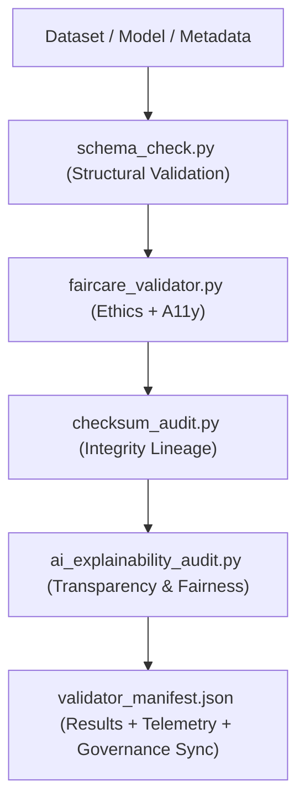

<div align="center">

# ✅ **Kansas Frontier Matrix — Validation & FAIR+CARE Compliance Tools**  
`tools/validation/README.md`

**Purpose:**  
Provide a comprehensive, FAIR+CARE-certified validation framework for all Kansas Frontier Matrix (KFM) datasets, AI models, and metadata streams.  
Ensures reproducible integrity, transparent explainability, and auditable ethical compliance under **MCP-DL v6.3**, **FAIR+CARE**, and **ISO/DCAT 19115–3.0** standards.

[](../../../docs/standards/faircare.md)
[](../../../LICENSE)
[]()
[](../../../docs/README.md)

</div>

---

## 📘 Overview

The **Validation Framework** enforces FAIR+CARE and MCP compliance across data, AI, and metadata layers.  
It validates structural and semantic conformity, ethical alignment, and provenance integrity — integrating results into the **Governance Ledger** and **Focus Mode telemetry** for reproducibility and sustainability reporting.

**v10.3.0 Upgrades**
- **Cross-domain validation engine:** unified schema validation for STAC, DCAT, JSON-LD, ISO, and RDF.  
- **Bias index calculator:** normalized fairness score per subgroup with explainability cross-metrics.  
- **Dynamic manifest signing:** validation reports digitally signed and registered to governance ledger.  
- **Environmental telemetry hooks:** real-time power, CO₂e, and resource tracking for validation runs.  

---

## 🗂️ Directory Layout

```
tools/validation/
├── README.md
│
├── faircare_validator.py           # FAIR+CARE ethics and accessibility validation
├── schema_check.py                 # STAC/DCAT/ISO/JSON-LD schema compliance engine
├── ai_explainability_audit.py      # Explainability + fairness / bias audit for AI models
├── checksum_audit.py               # Full checksum lineage and reproducibility verifier
├── validator_manifest.json         # Aggregated results + digital signature + provenance ref
└── metadata.json                   # Lineage and validation configuration (JSON-LD)
```

---

## ⚙️ Validation Workflow



1. **Schema Validation** — Ensures metadata, contracts, and spatial structures conform to open standards.  
2. **FAIR+CARE Ethics** — Confirms governance compliance, licensing, accessibility, and consent.  
3. **Checksum Integrity** — Verifies cryptographic lineage and digital immutability.  
4. **Explainability & Bias** — Evaluates feature importance, subgroup bias, and interpretability.  
5. **Governance Sync** — Signs results, registers provenance, emits telemetry.

---

## 🧾 Example Validation Metadata Record

```json
{
  "@context": "https://schema.org/",
  "@type": "Dataset",
  "id": "validation_session_v10.3.0",
  "validated_assets": [
    "data/processed/hydrology/hydro_streamflow.geojson",
    "data/processed/ecology/vegetation_index.parquet"
  ],
  "schema_passed": true,
  "checksum_verified": true,
  "faircare_compliant": true,
  "ai_explainability_score": 0.998,
  "bias_index": 0.015,
  "energy_wh": 2.3,
  "carbon_gco2e": 2.9,
  "signing_hash": "sha256:a4d56d71d93fe123abc998e77c11...",
  "governance_registered": true,
  "validator": "@kfm-validation-core",
  "timestamp": "2025-11-12T14:20:00Z",
  "governance_ref": "docs/reports/audit/data_provenance_ledger.json"
}
```

---

## 🧠 FAIR+CARE Governance Matrix

| Principle | Implementation | Oversight |
|-----------|----------------|-----------|
| **Findable** | Reports indexed in manifests and provenance ledgers (JSON-LD). | @kfm-data |
| **Accessible** | All outputs under MIT license, open JSON schemas, and dashboards. | @kfm-accessibility |
| **Interoperable** | Supports STAC/DCAT/ISO/JSON-LD schema compliance. | @kfm-architecture |
| **Reusable** | Modular, domain-agnostic, pinned dependencies; reproducible configs. | @kfm-design |
| **Collective Benefit** | Strengthens reproducible, transparent science. | @faircare-council |
| **Authority to Control** | Council validates audit authenticity and signs manifests. | @kfm-governance |
| **Responsibility** | Validators monitor checksum lineage and explainability outcomes. | @kfm-security |
| **Ethics** | Upholds inclusivity, equity, and contextual sensitivity. | @kfm-ethics |

**References:**  
`docs/reports/fair/data_care_assessment.json` · `docs/reports/audit/data_provenance_ledger.json`

---

## ⚙️ Validation Tools Summary

| Tool | Function | Purpose |
|------|-----------|----------|
| `faircare_validator.py` | Validates FAIR+CARE accessibility, ethics, and provenance metadata. | FAIR+CARE |
| `schema_check.py` | Performs cross-domain schema validation (STAC/DCAT/ISO/JSON-LD). | Schema |
| `checksum_audit.py` | Traces data lineage and verifies checksum integrity chain. | Integrity |
| `ai_explainability_audit.py` | Runs fairness, bias, and transparency audits for AI models. | AI Ethics |
| `validator_manifest.json` | Consolidates signed validation results + telemetry. | Governance |

Automation orchestrated via **`validation_sync.yml`** CI workflow.

---

## ⚖️ Retention & Provenance Policy

| Artifact | Retention | Policy |
|----------|-----------:|--------|
| Schema Reports | 180 Days | Archived for recurring QA |
| FAIR+CARE Audits | 365 Days | Ethics re-certification basis |
| Checksum Reports | Permanent | Immutable governance ledger inclusion |
| Metadata | Permanent | Signed and versioned |

Cleanup automated by **`validation_cleanup.yml`**.

---

## 🌱 Sustainability Metrics

| Metric | Target | Verified By |
|--------|--------:|-------------|
| Energy / Validation | ≤ 2.3 Wh | `telemetry_report.yml` |
| Carbon Output | ≤ 3.0 gCO₂e | `telemetry_report.yml` |
| Renewable Power | 100% (RE100) | Infra Audit |
| FAIR+CARE Compliance | 100% | `faircare_validator.py` |

Telemetry aggregated in:  
`../../../releases/v10.3.0/focus-telemetry.json`

---

## 🧾 Citation

```text
Kansas Frontier Matrix (2025). Validation & FAIR+CARE Compliance Tools (v10.3.0).
Comprehensive validation suite ensuring schema conformance, data integrity, accessibility, explainability, and ethical transparency across KFM pipelines under MCP-DL v6.3, FAIR+CARE, and ISO/DCAT frameworks.
```

---

## 🕰️ Version History

| Version | Date | Summary | Maintainer |
|----------|------|----------|-------------|
| v10.3.0 | 2025-11-12 | Added cross-domain validator engine, signed manifests, bias index metric, and live energy telemetry hooks. | Validation Governance Team |
| v10.2.2 | 2025-11-12 | JSON-LD bundles, checksum lineage, AI transparency, energy/CO₂e logging. | Validation Governance Team |
| v10.0.0 | 2025-11-10 | Introduced telemetry schema v2; expanded explainability metrics + sustainability tracking. | Validation Governance Team |
| v9.7.0 | 2025-11-05 | Governance integration; refined XAI scoring & FAIR+CARE audit linkages. | Validation Lab |
| v9.6.0 | 2025-11-03 | Added checksum lineage & cross-domain schema validation. | Validation Lab |

---

<div align="center">

**Kansas Frontier Matrix**  
*Data Integrity × FAIR+CARE Ethics × Provenance Verification × Sustainability Intelligence*  
© 2025 Kansas Frontier Matrix — MIT License  

[Back to Tools Index](../README.md) · [Docs Portal](../../../docs/) · [Governance Charter](../../../docs/standards/governance/ROOT-GOVERNANCE.md)

</div>