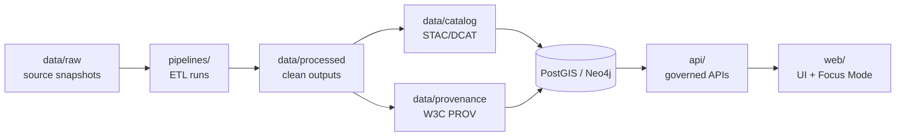

# KFM Data Directory

<kbd>GOVERNED</kbd> <kbd>PROVENANCE-FIRST</kbd> <kbd>STAC · DCAT</kbd> <kbd>W3C PROV</kbd> <kbd>FAIR + CARE</kbd> <kbd>SAFE BY DEFAULT</kbd>

This `data/` directory is the governed home for **KFM datasets** *and* the **machine-readable metadata + provenance** that make those datasets usable, reviewable, and safe to publish.

> [!IMPORTANT]
> **Canonical pipeline order (no shortcuts):** Raw → Processed → Catalog + Provenance → Database/Graph → API → UI/Focus Mode.  
> Directly injecting data into the UI or bypassing metadata/provenance is considered a broken contribution pattern.

---

## Contents

- [Scope](#scope)
- [Directory layout](#directory-layout)
- [Canonical data lifecycle](#canonical-data-lifecycle)
- [Dataset bundle contract](#dataset-bundle-contract)
- [Add or update a dataset](#add-or-update-a-dataset)
- [Metadata and catalog](#metadata-and-catalog)
- [Provenance](#provenance)
- [Licensing and usage constraints](#licensing-and-usage-constraints)
- [Sensitivity and CARE](#sensitivity-and-care)
- [Validation and CI expectations](#validation-and-ci-expectations)
- [Templates and examples](#templates-and-examples)
- [References](#references)
- [Version history](#version-history)

---

## Scope

| In scope | Out of scope |
|---|---|
| Governed storage for **raw snapshots**, **processed outputs**, and **STAC/DCAT/PROV** artifacts | Detailed ETL implementation docs (see pipeline code/docs) |
| Rules for adding/updating datasets without breaking governance | Legal advice (licenses are summarized, not interpreted) |
| CI/validation expectations for data contributions | Runtime database operations (handled by deploy/runtime tooling) |

---

## Directory layout

The **canonical** layout (as designed in KFM architecture docs) is:

```text
data/
  raw/            # Immutable raw data snapshots (exact copies of sources)
  processed/      # Cleaned/standardized outputs ready for KFM use
  catalog/        # Catalog metadata (STAC Items/Collections, DCAT dataset records)
  provenance/     # W3C PROV lineage documents (what ran, when, using what, producing what)
```

> [!NOTE]
> Some documents mention alternative legacy or expanded subfolders (e.g., `work/`, `stac/`, `prov/`).  
> Treat the four folders above as the **contract** unless the repo’s current structure explicitly differs.

---

## Canonical data lifecycle



> [!IMPORTANT]
> **Trust membrane rule:** The UI must never access databases directly; all access goes through the governed API layer.

---

## Dataset bundle contract

A dataset is “real” in KFM only when it is bundled with its metadata and provenance.

### Required artifacts

| Artifact | Purpose | Expected location |
|---|---|---|
| Raw snapshot **or** governed pointer | Reproducibility; evidence that processing is grounded | `data/raw/<domain>/...` *(or pointer/manifest if raw can’t be redistributed)* |
| Processed output(s) | What the platform actually uses (clean, standardized) | `data/processed/<domain>/...` |
| STAC Item/Collection | Spatial/temporal extent + dataset description + license/attribution | `data/catalog/...` |
| (Optional) DCAT record | Catalog interoperability / data portal publishing | `data/catalog/...` |
| W3C PROV lineage doc | Audit trail: inputs → activity → outputs (+who/when/how) | `data/provenance/...` |
| Pipeline code reference | Re-run capability and reviewability | `pipelines/...` *(exact path may vary)* |

> [!WARNING]
> **No data enters KFM without documentation.** If you add a file under `data/processed/`, you should assume CI will require corresponding catalog + provenance artifacts.

---

## Add or update a dataset

### Definition of Done checklist

- [ ] Raw snapshot is present **or** a governed retrieval pointer exists (license-aware)
- [ ] Processed output(s) written under `data/processed/`
- [ ] Catalog metadata created/updated under `data/catalog/` (STAC; DCAT if applicable)
- [ ] Provenance created/updated under `data/provenance/` (W3C PROV lineage)
- [ ] License and attribution are explicit in metadata
- [ ] Validation passes locally (format + schema + links where applicable)
- [ ] PR opened with a clear change summary and dataset IDs referenced

### Step-by-step workflow

1. **Acquire source data (raw)**
   - Store the *exact* snapshot in `data/raw/` when allowed.
   - If the source **cannot** be redistributed, store a **pointer/manifest** (see [Licensing and usage constraints](#licensing-and-usage-constraints)).

2. **Run the pipeline**
   - Use the appropriate ETL under `pipelines/` to:
     - parse/clean/normalize
     - convert CRS if needed
     - standardize schema and units

3. **Write outputs to `data/processed/`**
   - Prefer well-defined, reviewable formats (examples used in design docs include GeoJSON for vector and Parquet for tabular time-series).
   - Keep processed outputs *ready-to-use* by the platform (correct columns, valid geometries, correct spatial reference).

4. **Update metadata + provenance (hard requirement)**
   - Create/update STAC (and DCAT if used) under `data/catalog/`.
   - Create/update PROV lineage under `data/provenance/` that references:
     - which raw files (or pointers) were used
     - which script version ran (Git commit/hash if available)
     - when it ran
     - what outputs were produced

5. **Commit + PR**
   - Stage changes, commit, open a PR.
   - Expect CI to check:
     - every new `data/processed/` file has matching catalog + provenance artifacts
     - basic format validity (e.g., GeoJSON validity checks)
     - governance failures (e.g., missing license) fail closed

### Updating an existing dataset

Treat updates as the same lifecycle:
- add new raw snapshot (or pointer)
- re-run pipeline
- update processed output
- create a new PROV “version” record (new run) so the audit trail shows what changed and when

---

## Metadata and catalog

### What belongs in `data/catalog/`

- **STAC Item** for a single dataset asset
- **STAC Collection + Items** for multi-date or multi-part datasets
- **DCAT dataset record** (optional but recommended when publishing a catalog externally)

> [!NOTE]
> Some repos keep a “catalog index” listing all datasets. With STAC, this may be optional because STAC can be crawled.

### Metadata fields

Use a table like this inside your STAC/DCAT record (or in a small sidecar README if needed).

| Field | Required | What it means | Example |
|---|---:|---|---|
| `dataset_id` | Yes | Canonical KFM identifier | `ks-population-1900` |
| `title` | Yes | Human-readable dataset name | `Kansas Population 1900` |
| `description` | Yes | What this dataset is and why it exists | Short paragraph |
| `spatial_extent` | Yes | Bounding box / geometry coverage | Kansas bbox |
| `temporal_extent` | If applicable | Start/end dates | `1900-01-01` → `1900-12-31` |
| `source_ref` | Yes | Provenance pointer to source evidence (URN/path/hash) | `data/raw/...` or manifest reference |
| `license` | Yes | License/terms label + link/identifier where possible | SPDX-like or source terms |
| `attribution` | Yes | Required attribution text | e.g., “Cornell Lab of Ornithology (eBird)” |
| `sensitivity` | Yes | Handling label for governance | `Public` / `Restricted` *(labels may be project-defined)* |
| `provenance_ref` | Yes | Link to PROV doc for this dataset version | `data/provenance/...` |
| `schema_version` | Recommended | Version of your KFM STAC/DCAT profile | e.g., `KFM-STAC v11.0.0` *(if used in repo)* |

> [!IMPORTANT]
> If something is unknown or not yet verified in the repo, mark it explicitly as *“(not confirmed in repo)”* instead of guessing.

---

## Provenance

### What belongs in `data/provenance/`

Provenance artifacts should be **machine-readable** and describe lineage at **run granularity**.

A PROV document should cover:
- **Entities**: raw inputs, processed outputs
- **Activity**: the pipeline run that transformed inputs → outputs
- **Agent**: who/what executed the run (pipeline, contributor, automation)

### Provenance content checklist

- [ ] Inputs listed (including retrieval pointers if raw is external)
- [ ] Outputs listed (paths under `data/processed/`)
- [ ] Pipeline/script identifier recorded (prefer Git SHA or content hash)
- [ ] Run timestamp recorded
- [ ] Checksums recorded for key artifacts *(recommended)*
- [ ] License + sensitivity carried through *(recommended)*

> [!NOTE]
> Provenance is not only for internal audit—KFM UI patterns expect to show dataset attribution and lineage in provenance panels and audit views.

---

## Licensing and usage constraints

> [!WARNING]
> This section is **not legal advice**. It’s a contributor-friendly reminder that KFM treats licensing as a first-class governance constraint.

### Practical rules

1. **Always record license/terms in metadata.**
2. If the source **cannot be redistributed**, do **not** commit raw data:
   - store a pointer/manifest (what to fetch, where, and under what terms)
   - store only derived outputs if permitted
3. When in doubt, **fail closed** and request governance review.

### Examples from “KFM Data for Kansas” planning

| Source | Common constraint | Practical handling in KFM |
|---|---|---|
| eBird | Registration + data use agreement; raw redistribution restrictions | Keep raw external; store pointer/manifest; publish only allowed derivatives + required attribution |
| Kansas GAP (USGS) | Public domain | Raw and processed may be storable; still cite source |
| NOAA climate archives | Open/public domain (commonly), attribution recommended | Store raw where permitted; cite; keep processing transparent |
| Kansas Mesonet | Access may require request/terms | Treat as restricted until verified; use pointer/manifest |
| Kansas Oral History Project | CC BY-NC-ND | Avoid derivatives unless terms allow; store with required attribution; consider access controls |

---

## Sensitivity and CARE

KFM is committed to **FAIR + CARE** and a **safe-by-default** posture.

### Redaction and governance triggers

> [!IMPORTANT]
> Protect culturally sensitive information:
> - redact precise locations of sacred/vulnerable sites
> - flag datasets/docs requiring special review in the Governance section

Common review triggers (non-exhaustive):
- Indigenous-related cultural content
- precise site locations that could enable harm
- personal data that is not explicitly cleared for publication
- new licenses or unclear redistribution terms

---

## Validation and CI expectations

KFM documentation and data contributions are expected to pass automated checks.

### What CI is expected to enforce

| Category | Typical checks |
|---|---|
| Data contract checks | Every new file in `data/processed/` has corresponding PROV (and catalog) artifacts |
| Schema validation | STAC, DCAT v3, PROV-O structural checks |
| Doc hygiene | Markdown linting, template/structure checks where applicable |
| Link + image checks | Internal links resolve; no hot-linked external images |
| Sensitivity scanning | Flags missing citations or sensitive content patterns needing redaction/review |
| Accessibility | Alt text, heading hierarchy, table headers |

### Local workflow tips

- Run pre-commit checks (if configured)
- Validate STAC/DCAT/PROV with the project’s validators
- Preview Markdown rendering before PR
- Update version history for non-trivial changes

---

## Templates and examples

<details>
<summary>STAC Item skeleton (illustrative)</summary>

```json
{
  "type": "Feature",
  "stac_version": "1.0.0",
  "id": "ks-example-dataset-1900",
  "properties": {
    "title": "Example Dataset Title",
    "description": "What this dataset is, provenance context, and constraints.",
    "start_datetime": "1900-01-01T00:00:00Z",
    "end_datetime": "1900-12-31T23:59:59Z",
    "license": "TBD",
    "sensitivity": "Public"
  },
  "bbox": [-102.051, 36.993, -94.588, 40.003],
  "geometry": null,
  "links": [],
  "assets": {}
}
```

> Replace with the repo’s actual STAC profile requirements and validate in CI.
</details>

<details>
<summary>PROV run record checklist (illustrative)</summary>

- Entity: `data/raw/...` (or retrieval pointer)
- Entity: `data/processed/...`
- Activity: pipeline run (include parameters/config hash if relevant)
- Agent: CI runner / contributor / pipeline identity
- `used`: raw → activity
- `wasGeneratedBy`: processed → activity
- Timestamp + script hash/Git SHA
</details>

---

## References

These documents informed this directory contract and workflow:

- Kansas Frontier Matrix (KFM) – Comprehensive Technical Blueprint (PDF) [^blueprint]
- Kansas Frontier Matrix (KFM) Comprehensive Guide (PDF) [^compguide]
- Kansas Frontier Matrix engineering and documentation advancement report (PDF) [^engreport]
- KFM Markdown Guide (PDF) [^mdguide]
- KFM-Data for Kansas (PDF) [^datasources]
- Kansas Frontier Matrix (KFM) – Unified Technical Blueprint (PDF) [^unified]

[^blueprint]: KFM design doc describing the canonical pipeline order, repo layout, and data folder contract. *(Repo path not confirmed here.)*
[^compguide]: KFM guide describing CI expectations for data bundles and architectural “no shortcuts” constraints. *(Repo path not confirmed here.)*
[^engreport]: KFM engineering report recommending deterministic pipelines + STAC/DCAT/PROV validators and provenance panels. *(Repo path not confirmed here.)*
[^mdguide]: KFM Markdown governance guide describing citation requirements, validation checks, and sensitivity posture. *(Repo path not confirmed here.)*
[^datasources]: KFM “Data for Kansas” source inventory and licensing/constraints notes. *(Repo path not confirmed here.)*
[^unified]: Unified blueprint emphasizing open standards (OGC, STAC, DCAT) and interoperability goals. *(Repo path not confirmed here.)*

---

## Version history

| Version | Date | Summary of changes | Author |
|---|---|---|---|
| v1.0.0 | 2026-02-11 | Initial governed `data/` directory contract + contribution workflow | AI-assisted draft |