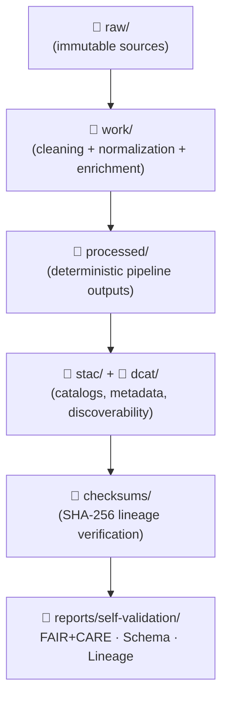

<div align="center">

# 📦 **Kansas Frontier Matrix — Data Directory Overview (v11.2.2)**  
`data/README.md`

**Purpose**  
Define the **canonical structure and lifecycle** of all datasets in the Kansas Frontier Matrix, from raw source files to fully validated, cataloged, and graph-integrated products.

</div>

---

## 📘 Overview

The `data/` directory is the **root of the KFM data plane**. It provides:

- A deterministic, reproducible layout for all datasets.  
- A clear flow from **raw → work → processed → catalogs**.  
- A single place for **STAC**, **DCAT**, **checksums**, and **validation reports**.  
- Enforcement of:
  - **MCP-DL v6.3** (documentation-first, reproducible pipelines).  
  - **KFM-MDP v11.2.2** (Markdown and structure rules).  
  - **KFM-OP v11** (ontology alignment).  
  - **STAC 1.x / DCAT 3.0** metadata.  
  - **FAIR+CARE** governance and sovereignty policies.  
  - **Checksum lineage + manifest verification**.

All ETL pipelines, interactive UIs, and Focus Mode narratives ultimately rely on assets organized under `data/`.

---

## 🗂️ Directory Layout (Canonical)

```text
📁 data/
│   📄 README.md                      — This file (data directory overview)
│
│   📁 sources/                       — External dataset manifests (URLs, APIs, providers)
│
│   📁 raw/                           — Unmodified source datasets (immutable, read-only)
│   │   📁 historic/                  — Maps, manuscripts, diaries, archival scans
│   │   📁 environmental/             — NOAA, PRISM, Daymet, USGS, Mesonet, AQS, etc.
│   │   📁 cultural/                  — Tribal, Indigenous, heritage datasets (H3-masked, governed)
│   │   📁 geology/                   — DEMs, lithologic maps, KGS datasets
│   │   📁 admin/                     — Boundary datasets (counties, parcels, HUCs, etc.)
│
│   📁 work/                          — Normalized & enriched intermediates (pipeline workspace)
│   │   📁 tables/                    — Cleaned tabular data (CSV, Parquet)
│   │   📁 spatial/                   — GeoJSON, GPKG, intermediate rasters/COGs
│   │   📁 metadata/                  — Pre-STAC/DCAT metadata bundles
│
│   📁 processed/                     — Deterministic ETL outputs, analysis-ready
│   │   📁 hydrology/                 — Streamflow, flood history, watersheds
│   │   📁 climate/                   — Normals, anomalies, extremes
│   │   📁 ecology/                   — Biodiversity, vegetation indices, GBIF/eBird merges
│   │   📁 historical/                — Generalized historical datasets
│   │   📁 hazards/                   — Tornado, drought, flood, wildfire, etc.
│
│   📁 stac/                          — STAC Items, Collections, and catalog root
│   │   📄 README.md                  — STAC catalog overview
│   │   📄 catalog.json               — STAC root
│   │   📁 missions/                  — EO missions (Sentinel, Landsat, NAIP, SWOT, etc.)
│   │   📁 hydrology/                 — Hydrology STAC domain
│   │   📁 climate/                   — Climate STAC domain
│   │   📁 hazards/                   — Hazard STAC domain
│   │   📁 landcover/                 — NLCD/land-use STAC domain
│   │   📁 tabular/                   — Tabular STAC domain
│
│   📁 dcat/                          — DCAT 3.0 catalogs (JSON-LD)
│   │   📄 catalog.jsonld             — Root DCAT catalog
│   │   📁 datasets/                  — Individual DCAT dataset descriptions
│
│   📁 archive/                       — Versioned snapshots & retired datasets
│
│   📁 checksums/                     — SHA-256 lineage verification
│   │   📁 raw/
│   │   📁 processed/
│   │   📁 stac/
│
│   📁 reports/                       — Validation, FAIR+CARE, and audit outputs
│   │   📁 self-validation/           — Schema, CARE, checksum reports
│   │   📁 telemetry/                 — Sustainability & performance telemetry
│   │   📁 audit/                     — Governance & external audit reports
│
└── 📁 tmp/                           — Temporary scratch (ignored by production pipelines)
```

This layout is **the single source of truth** for how all KFM data is physically organized.

---

## 🔄 Data Lifecycle Flow



High-level:

1. **raw/** — direct ingests from external sources; never overwritten.  
2. **work/** — intermediate transformations, normalized schema, CRS harmonization, and enrichment.  
3. **processed/** — clean, reproducible datasets ready for analysis and cataloging.  
4. **stac/**, **dcat/** — metadata and discovery layers.  
5. **checksums/**, **reports/** — integrity and governance.

---

## 🧪 Validation & Compliance

All datasets moving beyond `raw/` MUST pass a minimum validation stack:

### 1. Schema & Structural Validation

- JSON Schema / SHACL  
- Internal **Data Contract** conformance  
- Geometry validity (no self-intersections, valid CRS)  
- Required fields and units present

### 2. FAIR+CARE Governance

- License compatibility and declared license(s).  
- CARE label and sovereignty flags for cultural/Indigenous data.  
- Spatial masking (H3 or equivalent) when needed for sensitive locations.  
- Risk and exposure category appended to metadata.

### 3. Cryptographic Integrity

- SHA-256 checksums for key assets:  
  - raw/  
  - processed/  
  - stac/  

- Checksums are stored under `data/checksums/` and cross-checked against:
  - `manifest.zip`  
  - `sbom.spdx.json`

### 4. Sustainability Telemetry

For major ETL and reprocess operations, telemetry SHOULD include:

- `energy_wh`  
- `carbon_gco2e`  
- `records_processed`  
- `compute_time_s`  

Aggregated per release and written into:

- `data/reports/telemetry/`  
- `../releases/*/focus-telemetry.json`

---

## 🧬 STAC / DCAT Integration

All **production** datasets (those used in UI, analyses, or narratives) MUST be represented as:

- A **STAC Item** (and usually part of a STAC Collection).  
- A **DCAT Dataset** with distributions referencing the same assets.  
- A **JSON-LD** representation with:
  - KFM context  
  - Ontology mappings (CIDOC/GeoSPARQL/OWL-Time)  
  - PROV-O lineage relationships  

Stable identity is provided by `kfm_id` and mirrored in:

- STAC `id`  
- DCAT `dct:identifier`  
- Graph node IDs

---

## 🧠 Contributor Guidance (Data)

When adding or updating data:

1. **Choose correct directory** (`raw/`, `work/`, `processed/`, `stac/`, `dcat/`, etc.).  
2. **Ensure CRS** — EPSG:4326 unless explicitly documented otherwise.  
3. **Document provenance** — what, when, where, how.  
4. **Record checksums** for raw/ and processed/ assets.  
5. **Create or update STAC/DCAT entries** if dataset is production-facing.  
6. **Run validation** via CI or local scripts:
   - Schema checks  
   - STAC + DCAT checks  
   - FAIR+CARE checks  

Submissions SHOULD follow the data submission template:

```text
.github/ISSUE_TEMPLATE/data_submission.yml
```

---

## 🕰️ Version History

| Version | Date       | Summary                                                                                                      |
|--------:|------------|--------------------------------------------------------------------------------------------------------------|
| v11.2.2 | 2025-11-27 | Upgraded to KFM-MDP v11.2.2; canonical directory layout applied; telemetry/schema paths updated; governance hooks hardened. |
| v11.0.1 | 2025-11-19 | Rewritten with v11 fence rules; GitHub-safe layout; aligned to data architecture v11.                        |
| v11.0.0 | 2025-11-19 | Initial v11 dataset directory documentation.                                                                |

---

<div align="center">

📦 **Kansas Frontier Matrix — Data Directory Overview v11.2.2**  
“Data is the substrate. Governance is the frame.”

© 2025 Kansas Frontier Matrix — CC-BY 4.0  
MCP-DL v6.3 · KFM-MDP v11.2.2 · KFM-OP v11  

[⬅ Back to Repository Root](../README.md) ·  
[⚖ Governance Charter](../docs/standards/governance/ROOT-GOVERNANCE.md)

</div>
