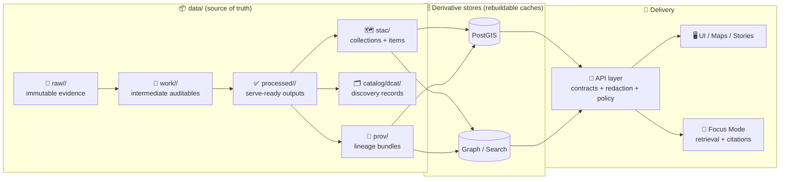

<div align="center">

<!-- 🚧 UNDER CONSTRUCTION -->

<br/>

# 📦 `data/` — Evidence Vault, Versioned Datasets, Metadata, & Provenance 🗺️🧾

**KFM’s canonical “source-of-truth” for everything that powers maps, stories, and Focus Mode — traceable end-to-end.**  
<sub><em>“The map behind the map” — every layer has receipts.</em></sub>

<br/>


<br/>

<a href="#-quick-nav">🧭 Quick Nav</a> •
<a href="#-kfm-invariant-the-truth-path-is-non-negotiable">🧱 Truth Path</a> •
<a href="#-folder-layout-v13-canonical">📁 Layout</a> •
<a href="#-dataset-contract-bundle-completeness">📦 Dataset Contract</a> •
<a href="#-governance-fair--care--data-sovereignty">⚖️ Governance</a> •
<a href="#-validation--ci-gates-fail-closed">🧪 CI Gates</a>

</div>

---

> [!WARNING]
> **This `data/` folder is under active construction.**  
> Structure, validators, and naming rules are stabilizing. Expect migrations (with redirects / compatibility notes), and expect CI to get stricter over time. 🚧

---

## ✨ What this folder is

`data/` is KFM’s **evidence vault**: a **versioned, reviewable, rebuildable** data layer where:

- 📌 **Raw sources are preserved** (immutability = reproducibility)
- 🧼 **Processed outputs are standardized** (serve-ready, analysis-ready)
- 🗺️ **Catalogs make datasets discoverable** (STAC + DCAT)
- 🧬 **Provenance makes datasets defensible** (W3C PROV)
- 🔒 **Governance gates stop bad merges** (fail-closed by design)

KFM is not a “black-box portal” — it’s an evidence-first system where insights must remain traceable.  [oai_citation:0‡Kansas Frontier Matrix Comprehensive System Documentation.pdf](sediment://file_00000000ef40722faf17987b69730695)

---

## 🧭 Quick Nav

- [🧱 KFM invariant: the Truth Path is non-negotiable](#-kfm-invariant-the-truth-path-is-non-negotiable)
- [📁 Folder layout (v13 canonical)](#-folder-layout-v13-canonical)
- [🧩 Legacy path compatibility map](#-legacy-path-compatibility-map)
- [📦 Dataset contract (bundle completeness)](#-dataset-contract-bundle-completeness)
- [🏷️ Naming, versioning, & identifiers](#-naming-versioning--identifiers)
- [🗂️ STAC / DCAT / PROV alignment](#-stac--dcat--prov-alignment)
- [🧱 Formats, storage tiers, & “large file” strategy](#-formats-storage-tiers--large-file-strategy)
- [🛰️ Remote sensing & raster conventions](#-remote-sensing--raster-conventions)
- [🤖 Evidence artifacts (AI + analysis outputs)](#-evidence-artifacts-ai--analysis-outputs)
- [⚖️ Governance: FAIR + CARE + data sovereignty](#-governance-fair--care--data-sovereignty)
- [🧪 Validation & CI gates (fail-closed)](#-validation--ci-gates-fail-closed)
- [✅ Publishing checklist (Definition of Done)](#-publishing-checklist-definition-of-done)
- [📚 References](#-references--standards)

---

## 🧱 KFM invariant: the Truth Path is non-negotiable

KFM enforces a strict order from evidence → outputs. Nothing ships by bypassing steps.  [oai_citation:1‡Kansas Frontier Matrix Comprehensive System Documentation.pdf](sediment://file_00000000ef40722faf17987b69730695)

```text
Raw ➜ Processed ➜ Catalog ➜ Databases ➜ API ➜ UI/AI
```

Why this matters:

- 🧯 **If a database is wiped**, we can rebuild it from `data/processed/` + boundary artifacts + pipeline code.
- 🧾 **If an answer is questioned**, we can trace it to catalogs + provenance.
- 🔒 **If metadata is missing**, merges and publication should be blocked.

> [!IMPORTANT]
> **Databases are performance caches.**  
> The repository (data + catalogs + provenance + pipelines) is the authority.

---

## 🗺️ The Truth Path lifecycle



---

## 📁 Folder layout (v13 canonical)

This layout is mirrored in KFM’s master guide: raw → work → processed, then boundary artifacts (STAC/DCAT/PROV).  [oai_citation:2‡MARKDOWN_GUIDE_v13.md.gdoc](file-service://file-UYVruFXfueR8veHMUKeugU)

```text
📦 data/
├─ 🧾 raw/                          # Immutable source snapshots (evidence)
│  └─ <domain>/                     # e.g., census/, railroads/, historical_maps/
│
├─ 🧪 work/                         # Intermediate artifacts worth preserving
│  └─ <domain>/
│
├─ ✅ processed/                    # Curated outputs used downstream
│  └─ <domain>/
│
├─ 🗺️ stac/                         # Spatial/temporal discovery layer
│  ├─ collections/
│  └─ items/
│
├─ 🗂️ catalog/
│  └─ dcat/                         # Dataset discovery records (JSON-LD, etc.)
│
├─ 🧬 prov/                         # W3C PROV lineage bundles
│
└─ 🧱 external/                     # Pointers/manifests for huge assets
   └─ manifest.*                    # JSON/YAML w/ sha256 + retrieval method
```

### 🔗 “Nearby” coupling (not inside `data/`, but mandatory in spirit)
```text
⚙️ pipelines/ or src/pipelines/      # Deterministic ETL writing raw→work→processed
🧾 schemas/                          # JSON Schemas for STAC/DCAT/PROV + contracts
📚 docs/data/<domain>/README.md       # Domain runbooks & source notes
```

> [!TIP]
> Keep `data/` **review-friendly**: prefer diffable formats (GeoParquet/Parquet) and store large binaries via manifests/LFS.

---

## 🧩 Legacy path compatibility map

KFM evolves. When legacy paths exist, **don’t fork the truth** — redirect to canonical paths.

| Concept | Canonical | Legacy patterns you may still see |
|---|---|---|
| STAC metadata | `data/stac/...` | `data/catalog/stac/...` |
| DCAT metadata | `data/catalog/dcat/...` | (often the same) |
| Provenance | `data/prov/...` | `data/provenance/...` |
| Intermediate artifacts | `data/work/...` | missing / scattered |

**Migration stance**
- ✅ New work goes to canonical layout
- ✅ Legacy gets a README redirect, symlink, or tooling alias (so validators still find artifacts)

---

## 📦 Dataset contract (bundle completeness)

A dataset is not “real” in KFM until it has its **boundary artifacts**.  [oai_citation:3‡MARKDOWN_GUIDE_v13.md.gdoc](file-service://file-UYVruFXfueR8veHMUKeugU)

### ✅ Minimum viable dataset bundle

| Artifact | Purpose | Canonical location |
|---|---|---|
| Processed output(s) | What DB/API/UI consume | `data/processed/<domain>/...` |
| STAC Item (+ Collection if new) | Spatial/temporal + asset linking | `data/stac/items/*.json` (+ `collections/*.json`) |
| DCAT record | Human-facing discovery + license + distributions | `data/catalog/dcat/*.jsonld` |
| PROV bundle | Lineage: inputs → activities → outputs | `data/prov/*.prov.json` |

> [!IMPORTANT]
> Missing any of the above should be treated as **fail-closed**: not publishable, not mergable, not servable. 🔒

### 🧩 Strongly recommended “bundle manifest” (lightweight glue)
Create a tiny “dataset bill of materials” to make reviews and CI painless:

`data/processed/<domain>/<dataset_id>/bundle.yaml`

```yaml
dataset_id: "kfm.census.population.1900"
domain: "census"
version: "v1"
outputs:
  - path: "data/processed/census/population__kansas__1900__v1.geoparquet"
    sha256: "REPLACE_ME"
stac:
  item: "data/stac/items/kfm.census.population.1900.json"
  collection: "data/stac/collections/kfm.census.population.json"
dcat:
  record: "data/catalog/dcat/kfm.census.population.1900.jsonld"
prov:
  bundle: "data/prov/kfm.census.population.1900.prov.json"
license:
  spdx: "CC-BY-4.0"
sensitivity:
  classification: "public"  # or restricted/internal/etc.
```

---

## 🏷️ Naming, versioning, & identifiers

### 📛 Domain folders
Use `snake_case` domains aligned with real-world sources/themes:
- `census`, `weather`, `railroads`, `soil`, `imagery`, `historical_maps`, `land_treaties`

### 🧩 Dataset IDs (stable + boring = good)
Recommended format:

```text
kfm.<domain>.<topic>.<time_or_edition>
```

Examples:
- `kfm.census.population.1900`
- `kfm.weather.precip.daily.v1`
- `kfm.historical_maps.county_boundaries.1930`

### 🧾 Processed filename conventions (scan-readable)
```text
<topic>__<coverage>__<time>__<vX>.<ext>
```

Examples:
- `population__kansas__1900__v1.geoparquet`
- `precip__kansas__daily__1850-2020__v2.parquet`
- `landsat__kansas__2010-06-15__v1.cog.tif`

> [!TIP]
> Treat version bumps like code releases: **why did it change?** (source update, bug fix, improved method, reproject, etc.) — record it in DCAT + PROV.

---

## 🧾 STAC / DCAT / PROV alignment

KFM relies on open standards and strict cross-linking so every layer is discoverable and defensible.  [oai_citation:4‡Kansas Frontier Matrix Comprehensive System Documentation.pdf](sediment://file_00000000ef40722faf17987b69730695)

### 🔗 Cross-linking expectations (minimum)

- **STAC Item → assets** (hrefs to processed files or external manifests)
- **STAC Item → PROV** (a `provenance` link or equivalent)
- **DCAT Dataset → STAC** (distribution entry pointing to STAC item/collection)
- **PROV → raw/work/processed entities** (with hashes where practical)

> ✅ Think of STAC/DCAT/PROV as the **data-layer API** that downstream stages consume.

### 🧠 Practical rule
If a Story Node or Focus Mode response cites a dataset, we must be able to walk:

```text
Story ➜ Dataset (DCAT) ➜ Assets (STAC) ➜ Lineage (PROV) ➜ Inputs (raw snapshots)
```

---

## 🧱 Formats, storage tiers, & “large file” strategy

KFM prefers open, interoperable formats for longevity and tool compatibility.  [oai_citation:5‡Kansas Frontier Matrix Comprehensive System Documentation.pdf](sediment://file_00000000ef40722faf17987b69730695)

### ✅ Recommended defaults
| Data type | Preferred format | Notes |
|---|---|---|
| Vector | **GeoParquet** (or GeoJSON for small) | GeoParquet is diff/size/perf friendly |
| Tabular/time-series | **Parquet** (partitioned when large) | keep schema stable, document units |
| Raster | **COG GeoTIFF** | cloud-optimized, streamable |
| Tiles | **PMTiles / MVT / XYZ** | consistent map delivery & caching |

> [!NOTE]
> KFM explicitly calls out COGs and cloud-friendly tile sets (PMTiles/XYZ) for efficient visualization and interoperability.  [oai_citation:6‡Kansas Frontier Matrix Comprehensive System Documentation.pdf](sediment://file_00000000ef40722faf17987b69730695)

### 📦 Large assets: what belongs in Git vs manifests
- ✅ Small/medium: store directly in Git (prefer diffable)
- 🧱 Big binaries: use Git LFS or external object storage + checksum manifest
- 🧾 Always record:
  - `sha256`
  - `size_bytes`
  - `uri` / retrieval method
  - access assumptions (public/private)

Example `data/external/manifest.json`:

```json
{
  "assets": [
    {
      "logical_name": "landsat__kansas__2010-06-15__v1.cog.tif",
      "storage": "s3",
      "uri": "s3://kfm-data/imagery/landsat__kansas__2010-06-15__v1.cog.tif",
      "sha256": "REPLACE_ME",
      "size_bytes": 1234567890,
      "retrieval": "aws s3 cp s3://kfm-data/imagery/... ./data/work/imagery/"
    }
  ]
}
```

---

## 🛰️ Remote sensing & raster conventions

KFM’s system design explicitly supports continuous remote sensing ingestion via STAC feeds and automated preprocessing.  [oai_citation:7‡Kansas Frontier Matrix Comprehensive System Documentation.pdf](sediment://file_00000000ef40722faf17987b69730695)

Typical pipeline steps (recommended):
1. 📥 Subscribe/poll STAC feed for new scenes over Kansas
2. ✂️ Clip/mosaic to Kansas AOI
3. 🌐 Reproject into KFM standard CRS (document EPSG!)
4. 🧱 Convert to **COG** + build pyramids/tiles for web rendering
5. 🗺️ Register STAC Item (bbox/time/resolution) + link PROV
6. 🤖 Optional: run ML (cloud mask, land cover, change detection) → publish derived layers as first-class datasets

> [!IMPORTANT]
> AI-derived outputs (classifications, masks, change layers) become **new datasets** with their own STAC/DCAT/PROV.  [oai_citation:8‡Kansas Frontier Matrix Comprehensive System Documentation.pdf](sediment://file_00000000ef40722faf17987b69730695)

---

## 🤖 Evidence artifacts (AI + analysis outputs)

KFM treats analysis outputs and AI-generated artifacts as **first-class datasets**, not “misc outputs.”  [oai_citation:9‡MARKDOWN_GUIDE_v13.md.gdoc](file-service://file-UYVruFXfueR8veHMUKeugU)

Examples:
- OCR corpora from scanned archives
- inferred features (trails, land cover, settlement footprints)
- simulation outputs (hydrology, climate scenarios)
- QA confidence layers (uncertainty bands, flags)

**Rule:** If it can influence a map, story, statistic, or AI answer, then it must:
- live in `data/processed/...`
- be cataloged (STAC/DCAT)
- be provenance-linked (PROV)
- be governed (license + sensitivity + policy tags)

---

## ⚖️ Governance: FAIR + CARE + data sovereignty

KFM’s governance explicitly aligns with **FAIR + CARE** and treats governance as part of the data lifecycle, not an afterthought.  [oai_citation:10‡Kansas Frontier Matrix (KFM) – Comprehensive Technical Blueprint.pdf](sediment://file_000000006dbc71f89a5094ce310a452d)

### 🌱 FAIR (Findable, Accessible, Interoperable, Reusable)
- Achieved via consistent formats + metadata + catalogs.

### 🤝 CARE (Collective Benefit, Authority to Control, Responsibility, Ethics)
CARE exists as a necessary complement to FAIR, especially for data relating to Indigenous Peoples, lands, waters, and territories.  [oai_citation:11‡Indigenous Statistics.pdf](sediment://file_0000000033ec72308e1f791a79f61bfe)

**KFM stance (practical):**
- 🧾 **If data concerns Indigenous Peoples or territories**, treat it as CARE-sensitive by default.
- 🏷️ Encode sensitivity/classification in metadata (DCAT + PROV + policy tags).
- 🔒 Make access policy-explicit (fail-closed if uncertain).
- 🧠 Preserve provenance so communities can validate, contest, or contextualize.

Indigenous Data Governance emphasizes **decision-making authority** and control over collection, access, and use — including when data is held by institutions.  [oai_citation:12‡Indigenous Statistics.pdf](sediment://file_0000000033ec72308e1f791a79f61bfe)

> [!NOTE]
> If you’re unsure whether a dataset triggers CARE obligations: **raise it early** (issue + governance label). Default to caution.

---

## 🧪 Validation & CI gates (fail-closed)

KFM’s architecture explicitly relies on policy gating and provenance logging before publication.  [oai_citation:13‡Kansas Frontier Matrix Comprehensive System Documentation.pdf](sediment://file_00000000ef40722faf17987b69730695)

### ✅ Minimum CI checks (recommended)
- **Bundle completeness:** processed ↔ STAC ↔ DCAT ↔ PROV all exist
- **Schema validation:** STAC + DCAT + PROV conform to project profiles
- **Geometry sanity:** valid geometries, bbox sanity, CRS declared
- **License checks:** license present + compatible + attribution present
- **External manifest integrity:** checksum present and verified
- **Determinism smoke test:** pipeline rerun does not produce drift without a version bump

<details>
<summary><b>🧪 Suggested “dataset PR gates” checklist</b> (expand) ✅</summary>

- [ ] Raw snapshot added (or external manifest updated)
- [ ] Pipeline updated/added and deterministic
- [ ] Processed outputs written to canonical location
- [ ] STAC Item updated (bbox/time/links/assets)
- [ ] DCAT record updated (title/desc/license/distributions)
- [ ] PROV updated (inputs/activities/agents/params)
- [ ] Sensitivity classification recorded (policy tags)
- [ ] Validators pass locally + in CI
- [ ] Reviewer can reproduce output from documented steps

</details>

---

## ✅ Publishing checklist (Definition of Done)

A dataset is “done” when:

### ✅ Required
- [ ] 📥 Raw snapshot under `data/raw/<domain>/...` **or** external manifest with checksum
- [ ] 🧼 Deterministic pipeline writes `raw → work → processed`
- [ ] ✅ Output(s) in `data/processed/<domain>/...`
- [ ] 🗺️ STAC item exists + links to assets + provenance
- [ ] 🗂️ DCAT record exists + license + distributions
- [ ] 🧬 PROV bundle exists + connects raw/work/processed
- [ ] ⚖️ License is explicit + attribution is present
- [ ] 🔐 Sensitivity classification recorded (policy can enforce)
- [ ] 🧪 CI gates pass (fail-closed)

### 🌟 Strongly recommended
- [ ] 📚 Domain runbook: `docs/data/<domain>/README.md`
- [ ] 🧾 Checksums recorded for *all* large binaries (even if stored in Git)
- [ ] 📈 QA summaries stored in `data/work/` and linked in PROV

---

## 🧪 Example: dataset bundle (end-to-end)

```text
data/
├─ raw/
│  └─ census/
│     └─ census_1900_source.csv
├─ work/
│  └─ census/
│     └─ census_1900_cleaned.parquet
├─ processed/
│  └─ census/
│     └─ population__kansas__1900__v1.geoparquet
├─ stac/
│  ├─ collections/
│  │  └─ kfm.census.population.json
│  └─ items/
│     └─ kfm.census.population.1900.json
├─ catalog/
│  └─ dcat/
│     └─ kfm.census.population.1900.jsonld
└─ prov/
   └─ kfm.census.population.1900.prov.json
```

✅ Now the dataset is: **usable**, **findable**, **auditable**, and **rebuildable**.

---

## 📚 References & standards

Project anchor docs (recommended reading):
- **KFM — Comprehensive System Documentation**  [oai_citation:14‡Kansas Frontier Matrix Comprehensive System Documentation.pdf](sediment://file_00000000ef40722faf17987b69730695)
- **KFM — Comprehensive Technical Blueprint**  [oai_citation:15‡Kansas Frontier Matrix (KFM) – Comprehensive Technical Blueprint.pdf](sediment://file_000000006dbc71f89a5094ce310a452d)
- **KFM Markdown + Data Guide (v13)**  [oai_citation:16‡MARKDOWN_GUIDE_v13.md.gdoc](file-service://file-UYVruFXfueR8veHMUKeugU)
- **Indigenous Statistics (FAIR + CARE, data sovereignty governance)**  [oai_citation:17‡Indigenous Statistics.pdf](sediment://file_0000000033ec72308e1f791a79f61bfe)
- **Digital Humanism (data + AI governance, provenance & quality)**  [oai_citation:18‡Introduction to Digital Humanism.pdf](sediment://file_0000000090a071f5afd5c78c4383e488)

---

<div align="center">

### 🧭 North Star
**If it can’t be traced → it can’t be served.**  
**If it can’t be governed → it can’t be merged.** ✅🔒

</div>

<!-- ✅ TODOs (Roadmap for this README)
- Add canonical STAC/DCAT/PROV profiles used by KFM (links to schemas/)
- Add a real "bundle.yaml" template used by validators
- Add "CRS policy" + "time policy" sections once standardized
- Add examples for raster + tiles + time-series domains
-->