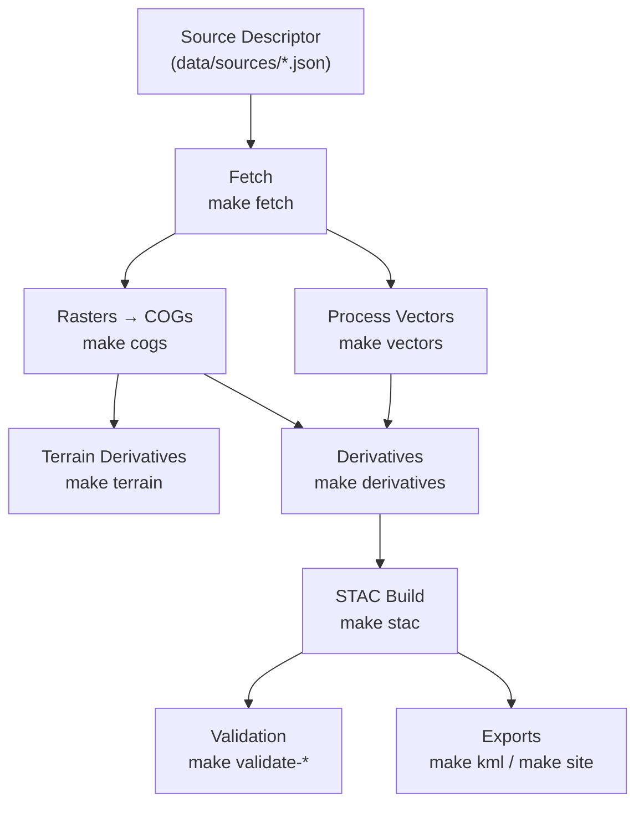

<div align="center">

# 📂 Kansas-Frontier-Matrix — `data/`

**Mission:** keep **inputs immutable**, **artifacts reproducible**, **catalogs discoverable**, and **knowledge auditable**.
This directory implements the project’s **MCP-style data lifecycle**, feeding both the **STAC catalog** and the **Neo4j knowledge graph**.

[](../../.github/workflows/site.yml)  
[](../../.github/workflows/stac-badges.yml)  
[](../../.github/workflows/pre-commit.yml)  
[](../../.github/workflows/codeql.yml)  
[](../../.github/workflows/trivy.yml)  
[](https://codecov.io/gh/bartytime4life/Kansas-Frontier-Matrix)  
[](https://stacspec.org/)  
[](https://www.cidoc-crm.org/)  

</div>

---

## 📑 Contents

* [Philosophy](#philosophy)
* [Directory Layout](#directory-layout)
* [Git & LFS Policy](#git--lfs-policy)
* [Lifecycle & Make Targets](#lifecycle--make-targets)
* [Naming Conventions](#naming-conventions)
* [Source Descriptor Schema](#source-descriptor-schema)
* [Provenance & Checksums](#provenance--checksums)
* [STAC Guidance](#stac-guidance)
* [Knowledge Graph Integration](#knowledge-graph-integration)
* [Uncertainty & Confidence](#uncertainty--confidence)
* [QA & Validation](#qa--validation)
* [Quickstart](#quickstart)
* [Gotchas](#gotchas)
* [TL;DR](#tldr)

---

## 🎯 Philosophy

* **Raw is immutable.** Never hand-edit `raw/`.
* **Processing is reproducible.** Scripts + configs recreate every artifact.
* **Catalogs are first-class.** Everything is registered in **STAC 1.0.0**.
* **Graph is connective tissue.** Every entity/event links into the **Neo4j graph**.
* **Uncertainty is explicit.** Confidence scores & provenance stored with data.

---

## 📂 Directory Layout

```text
data/
├─ 📥 raw/             # Immutable payloads (never edit)
│  └─ *_src.json       # Provenance sidecars
│
├─ 📝 sources/         # Curated descriptors (JSON/YAML, schema-validated)
│  └─ schema.source.json
│
├─ 🛠 work/            # Scratch staging (ignored in git)
├─ 🧹 tmp/             # Ephemeral build (cleared in CI)
│
├─ 📊 processed/       # Analysis-ready outputs
│  ├─ vectors/*.geojson
│  ├─ rasters/*.tif
│  └─ _meta.json
│
├─ 🛰 cogs/            # Canonical Cloud-Optimized GeoTIFFs
├─ 🔬 derivatives/     # Higher-order blends & indices
│
├─ 📂 stac/            # STAC catalog (collections + items)
│
├─ 🗺 tiles/           # Web tiles (PMTiles, MBTiles; ignored in git)
└─ 📖 provenance/      # SHA-256, experiment logs, lineage docs
```

> **Rule:** every derivation emits `_meta.json` and `.sha256`.

---

## ⚙️ Git & LFS Policy

* `.gitignore`: exclude heavy artifacts (`processed/`, `cogs/`, `derivatives/`, `tiles/`, `work/`, `tmp/`).
* `.gitattributes`: route rasters, lidar, GeoPackages → **Git LFS**.
* JSON/CSV/GeoJSON remain in vanilla Git for diffs.

---

## 🔄 Lifecycle & Make Targets



<!-- END OF MERMAID -->

---

## 🧾 Naming Conventions

* `processed/vectors/<layer>_<period>.geojson` → `hydrography_1936.geojson`
* `processed/dem/<id>.tif` → `ks_1m_dem_2018.tif`
* `cogs/<id>.tif` → canonical COGs
* `stac/items/<collection>/<id>.json` → STAC item
* Periods: `{YYYY | YYYY-YYYY | 1930s | late-19c}`

---

## 📜 Source Descriptor Schema

All sources validate against `sources/schema.source.json`.

Example keys:

* `id`, `title`, `type` (`vector`, `raster`, `collection`, `document`)
* `period`, `bbox`, `urls`, `license`, `provenance`, `retrieved`
* `confidence` (0–1) for uncertainty quantification

---

## 🔒 Provenance & Checksums

Each dataset emits:

* `_meta.json` → command, inputs, CRS, versions, bbox, stats
* `.sha256` → hash per artifact

---

## 🌐 STAC Guidance

* **Collections**: grouped by domain (terrain, hydrology, treaties, hazards).
* **Items**: concrete datasets (e.g. `hydrography_1936`).
* Must include: geometry, bbox, datetime, ≥1 asset, checksum, license, roles.

---

## 🕸 Knowledge Graph Integration

* Nodes: `Person`, `Place`, `Event`, `Document`, `Organization`
* Edges: `OCCURRED_AT`, `MENTIONS`, `PARTICIPATED_IN`
* Ontology: **CIDOC CRM** + **OWL-Time**
* Direct tie-in to map + timeline UI

---

## 🎚 Uncertainty & Confidence

* Every entity gets `confidence ∈ [0,1]`
* Visuals: opacity mapped to certainty
* Low-confidence → flagged for curation

---

## ✅ QA & Validation

* `make validate-sources` → JSON Schema
* `make validate-cogs` → COG compliance
* `make validate-vectors` → CRS/topology
* `make stac-validate` → STAC 1.0.0
* `make checksums` → refresh SHA-256

All run in CI.

---

## 🚀 Quickstart

```bash
# 1. Add descriptor
$ $EDITOR data/sources/ks_hydrography_1936.json

# 2. Fetch & process
$ make fetch vectors stac

# 3. Validate
$ make validate-sources validate-vectors checksums

# 4. Explore
$ open data/processed/vectors/hydrography_1936.geojson
$ open data/stac/items/vectors/hydrography_1936.json
```

---

## ⚠️ Gotchas

* Shapefiles are brittle → prefer GeoPackage or FlatGeobuf.
* Always reproject to **EPSG:4326** unless justified.
* Never commit `tmp/` or `work/`.
* Pair `_meta.json` with `.sha256`.

---

## 🧾 TL;DR

* Immutable raw in `raw/`
* Curated descriptors in `sources/`
* Reproducible outputs in `processed/`, `cogs/`, `derivatives/`
* Discoverable metadata in `stac/`
* Connected knowledge in **Neo4j**
* Provenance + uncertainty tracked everywhere

---

✅ This README is now **MCP-compliant, badge-rich, and GitHub-polished**. It ties in **ontology (CIDOC CRM + OWL-Time)**, **cross-disciplinary integration (history, cartography, geology, archaeology)**, and **NASA-grade modeling principles**.
