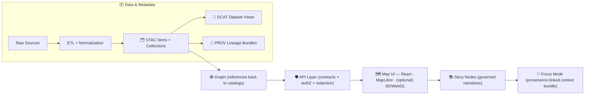

<!--
📌 `data/` is KFM’s canonical evidence + metadata boundary.
🗓️ Last updated: 2026-01-11
🔐 Reminder: “Published” in KFM means cataloged + provenance-linked + validated (not just “a file exists”).
-->

# 📦 `data/` — Kansas Frontier Matrix Data & Metadata Hub 🧭🗺️

<p align="left">
  
  
  
  
  
  
  
  
</p>

> ✅ **Purpose:** `data/` is the canonical home for **raw inputs**, **intermediate work**, **processed evidence artifacts**, and the **metadata boundary artifacts** (STAC/DCAT/PROV) that make KFM traceable, governed, and shippable.  
> ⚠️ **Rule:** If it isn’t **cataloged + provenance‑linked**, it isn’t **published** in KFM.  
> 🧠 **Data spaces mindset:** Metadata + identifiers + provenance are the *interface*; big binaries may live elsewhere **only if** pointers are stable, licensed, hashed, and auditable.

**⬅️ Back to repo overview:** `../README.md`  
**🧬 Pipelines boundary (ordering + contract):** `../pipelines/README.md`  
**🧩 Executable boundary:** `../src/README.md`  
**🧪 MCP methods + receipts:** `../mcp/README.md`  
**🧰 Validators & tooling:** `../tools/README.md` *(if present)*  
**🌐 Web UI boundary:** `../web/README.md` *(if present)*

---

## 🧭 Quick Nav
- [🧾 Doc metadata](#-doc-metadata)
- [🏁 5‑minute publish checklist](#-5minute-publish-checklist)
- [🧠 KFM pipeline snapshot](#-kfm-pipeline-snapshot)
- [🚦 Non‑negotiables](#-nonnegotiables)
- [✅ What “published” means in KFM](#-what-published-means-in-kfm)
- [🗂️ Canonical directory layout](#️-canonical-directory-layout)
- [🔁 Data lifecycle](#-data-lifecycle)
- [🏷️ Metadata boundary artifacts](#️-metadata-boundary-artifacts)
- [🧷 IDs, versioning, naming, hashing](#-ids-versioning-naming-hashing)
- [📐 Formats & performance rules](#-formats--performance-rules)
- [🧪 Validation & CI gates](#-validation--ci-gates)
- [➕ Adding a new dataset / domain](#-adding-a-new-dataset--domain)
- [🧬 Releases, snapshots, and attestations](#-releases-snapshots-and-attestations)
- [📚 Project file influence map](#-project-file-influence-map)
- [🕰️ Version history](#️-version-history)

---

## 🧾 Doc metadata

| Field | Value |
|---|---|
| Doc | `data/README.md` |
| Status | Active ✅ |
| Last updated | **2026-01-11** |
| Audience | pipeline authors · catalog writers · validators · reviewers · UI/API integrators |
| Prime directive | **No catalog → no graph → no API → no UI.** Catalogs are the interface. |
| Canonical ordering | **ETL → Catalogs (STAC/DCAT/PROV) → Graph → API → UI → Story → Focus** |

---

## 🏁 5‑minute publish checklist

> [!IMPORTANT]
> **Publishing** = **processed evidence output + boundary artifacts + validation**.  
> Raw files alone are *never* “published” in KFM.

### ✅ Minimum bar (per dataset)
- [ ] Place sources under `data/<domain>/raw/...` *(read-only mindset; reprocessing baseline)*
- [ ] Generate intermediates under `data/<domain>/work/...` *(ok to delete/regenerate)*
- [ ] Produce publishable outputs under `data/<domain>/processed/...`
- [ ] Write boundary artifacts:
  - [ ] **STAC Collection** → `data/stac/collections/kfm.ks.<domain>.<dataset>.v<major>.json`
  - [ ] **STAC Item(s)** → `data/stac/items/kfm.ks.<domain>.<dataset>.<yyyymmdd>.<variant>.v<major>.json`
  - [ ] **DCAT Dataset (JSON‑LD)** → `data/catalog/dcat/kfm.ks.<domain>.<dataset>.v<major>.jsonld`
  - [ ] **PROV bundle (JSON‑LD)** → `data/prov/<run-id>.jsonld`
- [ ] Record hashes (SHA256) for processed outputs *(and raw when feasible)*
- [ ] Add QA evidence to `data/qa/<domain>/...` *(bbox sanity, quicklook, validation report)*
- [ ] Run validators (local or CI) and confirm schemas + links + governance checks pass

### 🥇 Optional quality tiers (helps set expectations)
| Tier | What it means | Required |
|---|---|---|
| 🥉 Bronze | Raw + minimal metadata | Raw preserved + classification + source/terms |
| 🥈 Silver | Publishable output + STAC | Processed output + STAC + QA note |
| 🥇 Gold | Fully governed + discoverable | STAC + DCAT + PROV + strong QA + hashes |

---

## 🧠 KFM pipeline snapshot

KFM enforces strict ordering from **data → catalogs → graph → API → UI → narrative**, ensuring end‑to‑end traceability.



---

## 🚦 Non‑negotiables

- ⛓️ **Pipeline ordering is absolute:** `ETL → Catalogs (STAC/DCAT/PROV) → Graph → API → UI → Story → Focus`.
- 🧾 **Catalogs are required interfaces:** downstream layers must use **catalog IDs**, not ad‑hoc paths.
- 🔁 **Deterministic + idempotent ETL:** config-driven; stable IDs; stable ordering; replay-safe paths.
- 🧷 **Integrity is mandatory:** hashes + manifests for publishable artifacts (at least processed outputs).
- 🔐 **Classification & sovereignty propagate:** outputs cannot be *less restricted* than any input without an explicit, reviewed redaction/generalization step.
- 🛡️ **Hostile inputs:** treat GeoJSON/CSV/PDF/raster/metadata-from-the-internet as attack surfaces → validate + bound + sanitize.
- 🚪 **API boundary rule:** UI never reaches into internal stores directly; it consumes governed API outputs.
- 🧊 **Keep git healthy:** commit metadata + small QA; store heavy assets via stable pointers when needed.

> [!TIP]
> **FAIR** makes data *findable/accessible/interoperable/reusable*.  
> **CARE** keeps it *ethical and accountable*.  
> **Sovereignty** ensures the right people control sensitive data.

---

## ✅ What “published” means in KFM

KFM uses explicit **stages** and **contracts** (so we don’t ship “mystery layers”).

### 🧊 Stages (data state)
- **Raw** → `data/<domain>/raw/**`  
  Source snapshot; minimally transformed; reprocessing anchor.
- **Work** → `data/<domain>/work/**`  
  Intermediate artifacts; not stable; may be deleted/regenerated.
- **Processed** → `data/<domain>/processed/**`  
  Final evidence outputs meant to be served/used downstream.
- **Published** ✅  
  Processed outputs that have:
  - STAC/DCAT/PROV boundary artifacts, **and**
  - passing validations/CI gates, **and**
  - classification/handling rules correctly applied.

### 🧾 Boundary artifacts (metadata state)
- **STAC** = asset-level + spatial/temporal indexing
- **DCAT** = dataset/distribution discovery entry
- **PROV** = lineage graph (inputs → activities → outputs)

> [!WARNING]
> If you ship a file without a STAC/DCAT/PROV trail, you ship an **orphan**.  
> Orphans do not go to prod.

---

## 🗂️ Canonical directory layout

> [!IMPORTANT]
> v13 canonical shape is **domain-first**: `data/<domain>/{raw,work,processed}`.  
> If older layouts exist (top-level `data/raw`, `data/work`, `data/processed`), treat them as legacy and migrate forward when touching the domain.

### ✅ Canonical layout (target shape)
```text
data/
  <domain>/                         # e.g. "hydrology/", "historical/", "hazards/"
    raw/                            # raw source inputs (read-only mindset)
    work/                           # intermediate transforms (ok to delete)
    processed/                      # publishable evidence artifacts
    mappings/                       # OPTIONAL: dataset → STAC/DCAT/PROV mapping notes
    README.md                       # OPTIONAL: domain runbook (scope, sources, cadence)

  stac/                             # ✅ Required: STAC catalogs
    catalog.json                    # recommended STAC root entrypoint
    collections/
    items/

  catalog/
    dcat/                           # ✅ Required: DCAT JSON-LD dataset entries

  prov/                             # ✅ Required: PROV lineage bundles

  manifests/                        # recommended: dataset manifests/contracts + dictionaries
  qa/                               # recommended: QA receipts (quicklooks, bbox checks, reports)

  graph/                            # OPTIONAL: graph import/export artifacts (reference index only)
    csv/
    cypher/

  README.md                         # you are here
```

> [!NOTE]
> If your repo currently uses `data/raw/<domain>/...` at the top level, keep it working —  
> but new domains should default to the canonical `data/<domain>/{raw,work,processed}` shape.

---

## 🔁 Data lifecycle

KFM supports **batch** and **event-driven** pipelines (depending on source scale and cadence).

### 1) Ingestion 📥
- Batch pulls (scheduled) for known sources.
- Manual expert uploads into controlled staging with explicit terms.
- Preserve raw inputs as a reprocessing anchor.

### 2) Processing 🧰
Cleaning, joins, georeferencing, derived layers, modeling, simulation outputs.

- Prefer “compute close to data” when appropriate (e.g., PostGIS + spatial indices).
- Use partitioning/chunking as archives grow (tiles, counties, time windows).
- Keep transforms explicit and repeatable (scripts/configs captured in PROV).

### 3) Indexing & discovery 🗂️
- STAC Items + Collections describe **assets** and their spatiotemporal coverage.
- DCAT describes **datasets** and how to obtain them.
- PROV describes **how** the dataset was produced and from what inputs.

### 4) Publication & serving 🌐
- Downstream layers ingest from catalogs (or catalog-driven exports).
- UI consumes governed API outputs (authZ + redaction + classification rules).
- “New data available” signals can trigger graph refresh + UI indexing.

---

## 🏷️ Metadata boundary artifacts

> [!IMPORTANT]
> Boundary artifacts are the **interfaces** downstream layers consume.  
> Graph/API/UI/story should reference **catalog IDs**, not ad‑hoc local paths.

### ✅ Required boundary outputs
- **STAC (Collections + Items)** for geospatial assets (vectors, rasters, tiles, and related artifacts).
- **DCAT dataset entry (JSON‑LD)** for discovery: title/description/license/keywords/distributions.
- **PROV lineage bundle** capturing inputs → activities → outputs with configs/params and run identifiers.

### 🔗 Cross-layer linkage expectations (do not break)
- STAC Items must link to stable assets (usually under `data/<domain>/processed/**`, or object-store URLs).
- DCAT must link to distributions (STAC collection, API endpoint, and/or direct downloads).
- PROV must link raw → work → processed and record run/config identifiers.
- Graph stores references to catalog IDs (avoid storing bulky payloads in the graph).

### 🔐 Classification propagation (always-on)
- Carry classification/handling labels through STAC, DCAT, and PROV.
- Outputs cannot be published at a lower restriction than any input without a documented redaction step.

> [!CAUTION]
> Public repo = public download. Treat “easy to copy” formats (GeoJSON/CSV) as disclosure boundaries.

---

## 🧷 IDs, versioning, naming, hashing

Stable IDs make the system queryable, debuggable, and safe to automate.

### ✅ Dataset IDs (recommended)
Use **versioned** dataset IDs (major versions) to avoid “quiet semantic drift”:

- **Dataset / Collection ID:** `kfm.ks.<domain>.<dataset>.v<major>`  
  Example: `kfm.ks.hydrology.watersheds.v1`

- **STAC Item ID:** `kfm.ks.<domain>.<dataset>.<yyyymmdd>.<variant>.v<major>`  
  Example: `kfm.ks.hydrology.watersheds.20260101.county.v1`

- **Run ID:** stable, audit-friendly  
  Example: `etl_20260111_134455_a1b2c3d`

> [!NOTE]
> Versioning rule of thumb: **don’t change IDs without changing meaning**, and **don’t change meaning without changing IDs**.  
> Major versions are for semantic/schema/meaning changes; patch-level “metadata fixes” should not silently redefine values.

### 📛 File naming (processed evidence artifacts)
Use names that support routing + reproducibility:

- `<domain>__<dataset>__<yyyymmdd|yyyymm>__<epsg>__<resolution>__v<major.minor>.<ext>`
- Example: `agriculture__ndvi__20250301__epsg4326__30m__v1.0.tif`

### 🔒 Hashing rule
Record **SHA256** for:
- processed outputs (**required**)
- raw inputs (**recommended** when feasible)
- ETL configs / parameter snapshots (**recommended**)

Where hashes should appear:
- STAC `assets` (checksum field / profile extension)
- PROV `Entity` records
- `data/manifests/**` (audit-friendly index)

---

## 📐 Formats & performance rules

KFM is map-first and time-aware. Formats must support streaming, indexing, and honest representation.

### 🗺️ Vector
| Use case | Recommended format | Why |
|---|---|---|
| Small inspectable overlays | GeoJSON | debuggable; works everywhere |
| Medium/large boundaries | TopoJSON | smaller wire size |
| Dense/large features | Vector tiles (PMTiles/MBTiles) | pan/zoom performance |
| Authority edits / storage | PostGIS | constraints + indices + query power |

**Vector must-haves ✅**
- stable feature IDs (`kfm_id` or equivalent)
- geometry validity checks + CRS explicit
- simplification/topology documented for UI-facing layers

### 🛰️ Raster
| Use case | Recommended format | Why |
|---|---|---|
| Web streaming | **COG** (Cloud Optimized GeoTIFF) | range requests; pyramids |
| Quicklook | PNG/JPEG (small) | QA + previews |
| Time-series stacks | chunked/partitioned storage | scalability + partial reads |

**Raster must-haves ✅**
- overviews/pyramids (when needed)
- nodata defined, units documented
- QA “looks-right” screenshot at known zoom + bbox

### 📦 Big data posture (keep git healthy)
- Git stores **metadata + small samples + QA**, not the entire state of the world.
- Heavy assets may live in object storage or release artifacts as long as:
  - STAC/DCAT pointers are stable,
  - hashes exist,
  - licensing allows distribution.

---

## 🧪 Validation & CI gates

KFM expects automated validation and governance checks to prevent regressions and sensitive leaks.

### ✅ Typical gates
- STAC/DCAT/PROV schema validation
- Link checks:
  - STAC assets exist
  - DCAT distributions resolve
  - PROV locations present and coherent
- Classification-consistency checks (no downgrades without redaction approval)
- Secret scanning + sensitive data scanning
- “Looks-right” QA checks for map layers (bbox, zoom, quicklook)

### 🧰 Starter local checks (example)
```bash
# 1) JSON sanity
find data/stac data/catalog/dcat data/prov -name "*.json*" -print0 | xargs -0 -n 1 jq empty

# 2) Broken links (STAC assets exist)
python tools/validation/validate_stac_links.py data/stac/items

# 3) Provenance completeness (raw→work→processed)
python tools/validation/validate_prov.py data/prov

# 4) Governance scan (example placeholder)
python tools/validation/scan_sensitive.py data
```

> ⭐ Keep CI fast: run heavy geospatial validations nightly when needed.

---

## ➕ Adding a new dataset / domain

Follow the domain expansion pattern and keep domains isolated.

### ✅ Checklist
- [ ] Create domain folder: `data/<new-domain>/`
- [ ] Create stage folders:
  - [ ] `data/<new-domain>/raw/`
  - [ ] `data/<new-domain>/work/`
  - [ ] `data/<new-domain>/processed/`
- [ ] Add (optional) domain runbook: `data/<new-domain>/README.md`
- [ ] Add ETL config (idempotent, logged, hashable)
- [ ] Produce boundary artifacts:
  - [ ] STAC Collection + Item(s)
  - [ ] DCAT JSON‑LD entry
  - [ ] PROV run bundle
- [ ] Validate schemas + links in CI
- [ ] (Optional) Sync references into graph (after catalogs exist)
- [ ] Expose via governed API (redaction/classification)
- [ ] Add a domain runbook under `docs/` (recommended)

<details>
<summary><strong>🧱 Dataset skeleton (copy/paste)</strong></summary>

```text
# Evidence lifecycle (domain-first)
data/<domain>/raw/<source>/
data/<domain>/work/<dataset>/
data/<domain>/processed/<dataset>/

# Catalog boundary artifacts (versioned dataset IDs)
data/stac/collections/kfm.ks.<domain>.<dataset>.v1.json
data/stac/items/kfm.ks.<domain>.<dataset>.<yyyymmdd>.<variant>.v1.json

data/catalog/dcat/kfm.ks.<domain>.<dataset>.v1.jsonld
data/prov/etl_<yyyymmdd>_<hhmmss>_<shortgitsha>.jsonld

# QA + manifests (recommended)
data/qa/<domain>/<dataset>__<yyyymmdd>__qa.md
data/manifests/kfm.ks.<domain>.<dataset>.v1.yml
data/<domain>/mappings/<dataset>.md
```
</details>

---

## 🧬 Releases, snapshots, and attestations

When evidence artifacts graduate beyond “working data” into distribution:

- 📦 Prefer **release snapshots** (versioned dataset IDs + immutable hashes).
- 🧾 Keep a human-readable manifest that answers:
  - what changed?
  - why?
  - which catalogs/prov bundles define it?
- 🛡️ If the repo supports it, publish cryptographic integrity signals (attestations/signatures) alongside release artifacts.

> [!NOTE]
> Supply-chain posture (SLSA/SBOM/attestation) is primarily a build/release concern, but the same mindset applies to datasets: immutable identifiers + hashes + provenance are what make evidence trustworthy.

---

## 📚 Project file influence map

> ✅ This README follows the repo’s documentation-first, evidence-first conventions and the v13 layout doctrine.  
> Below is a “why it exists” index: each project file influences at least one `data/` convention.

<details>
<summary><strong>📦 Expand: Influence map (all project files)</strong></summary>

| Project file | How it shapes `data/` (policy, formats, metadata, QA) |
|---|---|
| `MARKDOWN_GUIDE_v13.md.gdoc` | Canonical v13 repo/data layout; “catalog boundary artifacts as interfaces”; versioning expectations; review-gates posture. |
| `KFM_MARKDOWN_WORK_PROTOCOL.md` | Documentation discipline + “no placeholders” + consistent sectioning for repo boundary READMEs. |
| `Comprehensive Markdown Guide_ Syntax, Extensions, and Best Practices.docx` | Markdown conventions for durable docs (callouts, tables, structure). |
| `Kansas Frontier Matrix (KFM) – Comprehensive Technical Documentation.docx` | Defines evidence/citation posture, data-layer responsibilities, and metadata-first governance expectations. |
| `Kansas-Frontier-Matrix_ Open-Source Geospatial Historical Mapping Hub Design.pdf` | End-to-end architecture rationale: ingest → catalogs → graph/API/UI; why catalog IDs must be stable. |
| `Kansas-Frontier-Matrix Design Audit – Gaps and Enhancement Opportunities.pdf` | Forces operational clarity: real SOPs, real validation gates, real “definition of published.” |
| `Scientific Method _ Research _ Master Coder Protocol Documentation.pdf` | “Protocol + receipt” mindset applied to datasets (run IDs, manifests, reproducibility). |
| `Foundational Templates and Glossary for Scientific Method _ Research _ Master Coder Protocol.pdf` | Template discipline that carries into dataset manifests, QA receipts, and provenance notes. |
| `🌟 Kansas Frontier Matrix – Latest Ideas & Future Proposals.docx` | Transparency/provenance-first product thinking; supply-chain integrity signals; “trust signals” are part of shipping. |
| `Data Spaces.pdf` | Metadata-as-interface mindset: pointer-over-payload, stable IDs, and federation-friendly catalogs. |
| `Scalable Data Management for Future Hardware.pdf` | Partitioning, caching, chunking, and “pipeline breakers” for scale; keep git lean but auditable. |
| `PostgreSQL Notes for Professionals - PostgreSQLNotesForProfessionals.pdf` | PostGIS posture: indexing, migrations, schema discipline, safe import/export. |
| `python-geospatial-analysis-cookbook.pdf` | CRS hygiene, vector/raster IO discipline, safe transformations at boundaries. |
| `Cloud-Based Remote Sensing with Google Earth Engine-Fundamentals and Applications.pdf` | Remote sensing export discipline; time-series outputs; derived indices treated as governed evidence. |
| `making-maps-a-visual-guide-to-map-design-for-gis.pdf` | “Map honesty”: symbology/aggregation choices change meaning → require QA receipts and documented choices. |
| `Mobile Mapping_ Space, Cartography and the Digital - 9789048535217.pdf` | Mobile/offline constraints and location sensitivity awareness → tiling + payload budgets + cautious disclosure. |
| `responsive-web-design-with-html5-and-css3.pdf` | Practical payload/latency constraints that shape data packaging (tiles, previews, progressive loading). |
| `webgl-programming-guide-interactive-3d-graphics-programming-with-webgl.pdf` | GPU/3D constraints: coordinate conventions, LOD/tiling, graceful degradation expectations. |
| `compressed-image-file-formats-jpeg-png-gif-xbm-bmp.pdf` | Quicklook and preview optimization rules to avoid repo bloat while supporting QA. |
| `ethical-hacking-and-countermeasures-secure-network-infrastructures.pdf` | Threat-model the ingest surface; deny-by-default; least privilege; disclosure boundaries. |
| `Gray Hat Python - Python Programming for Hackers and Reverse Engineers (2009).pdf` | Hostile-input awareness for parsers/extractors; guard rails against archive bombs and unsafe deserialization. |
| `concurrent-real-time-and-distributed-programming-in-java-threads-rtsj-and-rmi.pdf` | Worker/job discipline: bounded work, timeouts, backpressure, deterministic outputs. |
| `Introduction to Digital Humanism.pdf` | Human-centered governance: transparency, accountability, dignity, and restraint. |
| `Principles of Biological Autonomy - book_9780262381833.pdf` | Systems thinking: feedback loops and stability; avoid pipelines that create “self-justifying truth.” |
| `On the path to AI Law’s prophecies and the conceptual foundations of the machine learning age.pdf` | AI-derived artifacts require labeling + provenance; avoid “automation theater”; document limits. |
| `Understanding Statistics & Experimental Design.pdf` | Experimental rigor for analysis outputs; explicit assumptions; avoids misleading derived layers. |
| `graphical-data-analysis-with-r.pdf` | “Look first” diagnostics; QA artifacts as first-class evidence before publishing. |
| `regression-analysis-with-python.pdf` | Baseline + diagnostics discipline for published analytical outputs. |
| `Regression analysis using Python - slides-linear-regression.pdf` | Lightweight baseline reporting shape; minimal reproducible checks. |
| `think-bayes-bayesian-statistics-in-python.pdf` | Uncertainty-forward reporting; provenance of priors/posteriors for Bayesian evidence artifacts. |
| `Scientific Modeling and Simulation_ A Comprehensive NASA-Grade Guide.pdf` | Simulation governance: V&V status, sensitivity analysis, and run receipts for outputs that become evidence. |
| `Generalized Topology Optimization for Structural Design.pdf` | Optimization outputs as governed datasets: objective/constraints + parameter sweeps captured in PROV. |
| `Spectral Geometry of Graphs.pdf` | Graph analytics caution: treat graph metrics as signals; don’t hide “truth” only inside graph math. |
| `Deep Learning for Coders with fastai and PyTorch - Deep.Learning.for.Coders.with.fastai.and.PyTorchpdf` | ML artifacts as governed data: model cards, reproducibility, separation of training evidence vs serving outputs. |
| `Patterns, Algorithms, and Fractals_ A Cross-Disciplinary Technical Reference.pdf` | Cross-discipline patterns: encourages consistent representation choices and careful abstraction boundaries. |
| `Understanding Machine Learning: From Theory to Algorithms.pdf` :contentReference[oaicite:0]{index=0} | ML theory discipline: motivates dataset splits, leakage avoidance, and “claims must match evidence + assumptions.” |
| `Flexible Software Design_ Systems Development for Computational Science in Fortran.pdf` :contentReference[oaicite:1]{index=1} | Computational-science software discipline: deterministic workflows, long-lived code/data interfaces, reproducible runs. |
| Programming bundles (`A programming Books.pdf`, `B-C programming Books.pdf`, `D-E programming Books.pdf`, `F-H programming Books.pdf`, `I-L programming Books.pdf`, `M-N programming Books.pdf`, `O-R programming Books.pdf`, `S-T programming Books.pdf`, `U-X programming Books.pdf`) | Broad engineering reference stack: reinforces maintainability, testing, security hygiene, and cross-stack interoperability. |

</details>

---

## 🕰️ Version history

| Version | Date | Summary | Author |
|---:|---|---|---|
| v1.3.0 | 2026-01-11 | Aligned `data/` to v13 **domain-first** layout guidance; clarified “published means cataloged”; standardized versioned dataset IDs (`.v<major>`); tightened boundary artifact expectations and validation gates; refreshed influence map and links. | KFM Engineering |
| v1.2.0 | 2026-01-06 | Prior iteration: staged lifecycle, STAC/DCAT/PROV boundary artifacts, initial influence map. | KFM Engineering |

---

<!--
Evidence anchors used to update this README:
- v13 data layout + STAC/DCAT/PROV alignment + linkage expectations: , 
- v13 versioning expectations: 
- KFM technical doc references to data directories and metadata boundary artifacts (incl. legacy `data/provenance` wording): 
- KFM “latest ideas” emphasizes transparency/provenance and supply-chain integrity signals: 
-->
