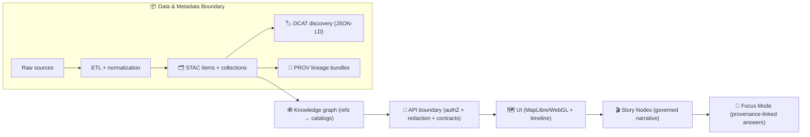

<!--
📌 `data/` is KFM’s canonical evidence + metadata boundary.
🗓️ Last updated: 2026-01-19
🔐 Reminder: “Published” in KFM means cataloged + provenance-linked + validated (not just “a file exists”).
-->

<a id="top"></a>

# 📦 `data/` — Kansas Frontier Matrix Evidence & Metadata Hub 🧭🗺️
_The governed home of KFM’s **sources**, **evidence artifacts**, and the **boundary metadata** (STAC/DCAT/PROV) that makes everything traceable._

<p align="left">
  
  
  
  
  
  
  
  
  
  
  
  
</p>

> [!IMPORTANT]
> ✅ **Prime directive:** `data/` is the **evidence boundary**.  
> If something can be used in the UI, Story Nodes, or Focus Mode, it must be:
> **(1) cataloged (STAC/DCAT)** + **(2) lineage-linked (PROV)** + **(3) policy-checked** + **(4) reproducible**.  
> **No catalog → no graph → no API → no UI.**

> [!NOTE]
> 🌐 **Data Spaces mindset:** In KFM, **metadata + IDs + provenance** are the interface.  
> Big binaries may live in object storage *only if* pointers are stable, licensed, hashed, and auditable.

---

## 🔗 Repo navigation (common)
- ⬅️ Overview: `../README.md`
- 🧬 Pipelines: `../src/pipelines/README.md` *(or `../pipelines/README.md`, if present)*
- 🚪 API boundary: `../api/README.md` *(if present)*
- 🌐 Web UI boundary: `../web/README.md` *(if present)*
- 🧪 MCP (methods + receipts): `../mcp/README.md` *(if present)*
- 🧩 Schemas & contracts: `../schemas/README.md` *(if present)*
- 🧰 Validators & tooling: `../tools/README.md` *(if present)*
- 🤝 Collaboration automation: `../.github/README.md` *(if present)*

---

<details>
<summary><strong>🧭 Table of contents</strong></summary>

- [🧾 Doc metadata](#-doc-metadata)
- [🏁 5‑minute publish checklist](#-5minute-publish-checklist)
- [🧠 KFM pipeline snapshot](#-kfm-pipeline-snapshot)
- [🚦 Non‑negotiables](#-nonnegotiables)
- [✅ What “published” means in KFM](#-what-published-means-in-kfm)
- [🗂️ Canonical directory layout](#-canonical-directory-layout)
- [🧱 Intake Gate 0 (security + integrity)](#-intake-gate-0-security--integrity)
- [🔁 Data lifecycle](#-data-lifecycle)
- [🏷️ Metadata boundary artifacts](#-metadata-boundary-artifacts)
- [🧾 Manifests, contracts, QA receipts](#-manifests-contracts-qa-receipts)
- [🧬 Telemetry & run receipts](#-telemetry--run-receipts)
- [🧷 IDs, versioning, naming, hashing](#-ids-versioning-naming-hashing)
- [📐 Formats & packaging rules](#-formats--packaging-rules)
- [📦 “Dual-format package” pattern (GeoParquet + PMTiles)](#-dual-format-package-pattern-geoparquet--pmtiles)
- [🛰️ Streaming/live feeds](#-streaminglive-feeds)
- [🧪 Validation & CI gates](#-validation--ci-gates)
- [🔐 Security, privacy, and sensitive-location safety](#-security-privacy-and-sensitive-location-safety)
- [🌐 Federation & data spaces](#-federation--data-spaces)
- [➕ Adding a new dataset / domain](#-adding-a-new-dataset--domain)
- [🧬 Releases, snapshots, and attestations](#-releases-snapshots-and-attestations)
- [📚 Project file influence map](#-project-file-influence-map)
- [🕰️ Version history](#-version-history)

</details>

---

## 🧾 Doc metadata

| Field | Value |
|---|---|
| Doc | `data/README.md` |
| Status | Active ✅ |
| Last updated | **2026-01-19** |
| Audience | pipeline authors · catalog writers · validators · reviewers · API/UI integrators |
| Prime directive | **Catalogs are interfaces** (offer IDs + truthy pointers, not mystery paths). |
| Canonical ordering | **ETL → Catalogs (STAC/DCAT/PROV) → Graph → API → UI → Story → Focus** |
| Default posture | fail‑closed for publish gates 🚦 · hostile‑input aware 🧯 · audit‑ready 🧾 |

---

## 🏁 5‑minute publish checklist

> [!IMPORTANT]
> **Publishing** = **processed evidence output + boundary artifacts + validation**.  
> Raw files alone are *never* “published” in KFM.

### ✅ Minimum bar (per dataset)
- [ ] **Intake Gate 0** passed (security + integrity) ✅  
  - [ ] `source.json` present  
  - [ ] `checksums.sha256` present  
  - [ ] `telemetry.ndjson` started *(even if tiny)*  
- [ ] Place sources under `data/raw/<domain>/<source>/...` *(read-only mindset; reprocessing anchor)*
- [ ] Generate intermediates under `data/work/<domain>/<dataset>/...` *(discardable/regeneratable)*
- [ ] Produce publishable outputs under `data/processed/<domain>/<dataset>/...`
- [ ] Create (or update) a dataset **manifest/contract** *(machine-checkable)*  
  - [ ] `data/manifests/kfm.ks.<domain>.<dataset>.v<major>.yml` *(recommended)*  
  - [ ] or `dataset.contract.json` *(supported if you prefer JSON; keep schema’d)*  
- [ ] Emit boundary artifacts:
  - [ ] **STAC Collection** → `data/stac/collections/kfm.ks.<domain>.<dataset>.v<major>.json`
  - [ ] **STAC Item(s)** → `data/stac/items/kfm.ks.<domain>.<dataset>.<yyyymmdd>.<variant>.v<major>.json`
  - [ ] **DCAT Dataset (JSON‑LD)** → `data/catalog/dcat/kfm.ks.<domain>.<dataset>.v<major>.jsonld` *(or `data/dcat/` if your repo uses that layout)*
  - [ ] **PROV run bundle (JSON‑LD)** → `data/prov/<run-id>.jsonld`
- [ ] Add QA receipts: `data/qa/<domain>/<dataset>/<run-id>/...` *(bbox sanity, quicklook, validation report)*
- [ ] Run validators (local or CI) ✅ confirm schemas + links + governance checks pass

### 🥇 Quality tiers (helps reviewers)
| Tier | What it means | Required |
|---|---|---|
| 🥉 Bronze | Raw preserved + basic stewardship | source + terms + classification + hashes |
| 🥈 Silver | Processed output + STAC | publishable artifacts + STAC + QA note |
| 🥇 Gold | Fully governed + discoverable | STAC + DCAT + PROV + strong QA + hashes + policy pass |

---

## 🧠 KFM pipeline snapshot

KFM enforces strict ordering so downstream always has traceable evidence.



---

## 🚦 Non‑negotiables

- ⛓️ **Pipeline ordering is absolute:** `ETL → Catalogs (STAC/DCAT/PROV) → Graph → API → UI → Story → Focus`.
- 🧾 **Catalogs are required interfaces:** downstream layers reference **catalog IDs**, not ad‑hoc file paths.
- 🔁 **Deterministic + idempotent ETL:** same inputs + config ⇒ same outputs (replay-safe).
- 🧷 **Stable IDs forever:** IDs are contracts (dataset IDs, collection IDs, run IDs, story IDs).
- 🔒 **Integrity is mandatory:** hashes + manifests for publishable artifacts (at minimum processed outputs).
- 🔐 **Sovereignty/classification propagate:** outputs cannot be *less restricted* than any input unless a reviewed redaction/generalization step exists.
- 🧯 **Hostile inputs:** GeoJSON/CSV/PDF/images/rasters from the internet are attack surfaces → validate + bound + sanitize.
- 🧊 **Git stays healthy:** commit metadata + QA receipts; keep heavy binaries in stable storage with hashed pointers.

> [!TIP]
> **FAIR** makes data findable/accessible/interoperable/reusable.  
> **CARE** keeps it ethical and accountable.  
> **Sovereignty** ensures the right people control sensitive knowledge. 🧭

---

## ✅ What “published” means in KFM

KFM uses explicit **stages** and **contracts** so we don’t ship mystery layers.

### 🧊 Stages (data state)
- **Raw** → `data/raw/<domain>/<source>/...`  
  Source snapshot; minimally transformed; reprocessing anchor.
- **Work** → `data/work/<domain>/<dataset>/...`  
  Intermediate artifacts; not stable; may be deleted/regenerated.
- **Processed** → `data/processed/<domain>/<dataset>/...`  
  Final evidence outputs meant to be served/used downstream.
- **Published** ✅  
  Processed outputs with:
  - STAC/DCAT/PROV boundary artifacts, **and**
  - passing validations/CI gates, **and**
  - correct license/classification handling, **and**
  - stable IDs (dataset + run).

### 🧾 Boundary artifacts (metadata state)
- **STAC** = asset-level + spatiotemporal indexing
- **DCAT** = dataset/distribution discovery entry
- **PROV** = lineage graph (inputs → activities → outputs)

> [!WARNING]
> If you ship a file without a STAC/DCAT/PROV trail, you ship an **orphan**.  
> Orphans do not get promoted.

---

## 🗂️ Canonical directory layout

> [!IMPORTANT]
> v13 posture is **stage-first**: `data/{raw,work,processed}/<domain>/...`  
> Catalogs live alongside and reference **processed** artifacts (or stable object-store pointers).

```text
data/
  raw/                                 # ✅ Required: raw source snapshots (read-only mindset)
    <domain>/
      <source>/                        # e.g., usgs/, kgs/, kshs_scans/, noaa/, nasa/

  work/                                # recommended: intermediate transforms (regeneratable)
    <domain>/
      <dataset>/

  processed/                            # ✅ Required: publishable evidence artifacts
    <domain>/
      <dataset>/

  sources/                              # recommended: source manifests + fetch receipts (small files)
    <domain>/
      <source>/                         # source.json, fetch configs, license notes, contacts

  stac/                                 # ✅ Required: STAC catalogs
    catalog.json                         # recommended STAC root
    collections/
    items/

  catalog/
    dcat/                               # ✅ Required: DCAT JSON-LD dataset entries
    # (optional) vocabulary/, keywords/, orgs/

  prov/                                 # ✅ Required: PROV lineage bundles (JSON-LD)

  manifests/                            # recommended: dataset manifests/contracts + dictionaries
  qa/                                   # recommended: QA receipts (quicklooks, bbox checks, validation reports)
  live/                                 # optional: streaming buffers + snapshots (still cataloged!)
  graph/                                # optional: graph import/export artifacts (index only)
    csv/
    cypher/

  README.md                              # you are here 🙂
```

> [!NOTE]
> Some earlier specs use `data/dcat/` at root. That’s fine.  
> Pick **one canonical path** and keep it stable (symlinks/config are OK, “drift” is not).

---

## 🧱 Intake Gate 0 (security + integrity)

Before *anything* is allowed to move from “downloaded” → “raw”, run the intake gate. ✅🧯

### ✅ What Gate 0 checks
- 📄 **Source manifest exists** (`source.json`)  
- 🔒 **Hashes exist** (`checksums.sha256`) for at least:
  - the exact downloaded archive(s), or
  - the exact raw files if unarchived  
- 🧾 **Telemetry started** (`telemetry.ndjson`)  
- 🧪 **Safe extraction & scanning** (zip-bomb limits, path traversal, file allowlists)
- 🏷️ **Classification assigned** (`public/internal/restricted/...`) before anything is promoted
- ⚖️ **License/terms recorded** (or blocked pending review)

> [!CAUTION]
> If `source.json` is missing, reviewers cannot evaluate provenance.  
> If hashes are missing, we can’t detect silent corruption or tampering.

### 📄 `source.json` (minimal example)
```json
{
  "source_id": "kfm.source.<provider>.<name>",
  "name": "Human-readable source name",
  "owner": "Provider / archive / agency",
  "uri": "https://example.org/source",
  "retrieved_at": "2026-01-19",
  "license": {
    "spdx": "UNKNOWN",
    "terms_uri": "https://example.org/terms",
    "attribution": "If required, paste exact attribution text here"
  },
  "classification": "public",
  "notes": "Any handling notes (rate limits, access policy, redaction constraints)."
}
```

### 🔒 `checksums.sha256` (format example)
```text
<sha256>  raw/<domain>/<source>/<filename.ext>
<sha256>  raw/<domain>/<source>/<archive.zip>
```

### 🧾 `telemetry.ndjson` (first lines example)
```json
{"ts":"2026-01-19T14:02:11Z","event":"intake.start","source_id":"kfm.source...","actor":"human","host":"devbox-01"}
{"ts":"2026-01-19T14:02:58Z","event":"intake.hash","path":"raw/.../archive.zip","sha256":"..."}
{"ts":"2026-01-19T14:03:21Z","event":"intake.scan.ok","tool":"clamav","notes":"no threats found"}
```

---

## 🔁 Data lifecycle

KFM supports batch and event-driven pipelines. Both must remain provenance-led.

### 1) Ingestion 📥
- Scheduled pulls (known sources)
- Manual expert uploads (controlled staging + explicit terms)
- Crowd/citizen contributions (separate review lane; never auto-promoted)
- Preserve raw inputs as a reprocessing anchor.

### 2) Processing 🧰
Cleaning, joins, georeferencing, derived layers, modeling, simulation outputs.

Rules of thumb:
- Prefer “compute near data” (PostGIS for spatial ops; workers for heavy ML/sim).
- Partition by what users filter on (space/time/admin boundaries).
- Keep transforms explicit and repeatable (scripts/config captured in PROV).
- If outputs come from **analysis/modeling/simulation/optimization**, publish with:
  - parameters + seeds,
  - validation/verification status (QA),
  - uncertainty notes (QA + manifest),
  - clear “not for decision-making” flags when appropriate.

### 3) Indexing & discovery 🗂️
- STAC Items/Collections describe assets and coverage.
- DCAT describes datasets/distributions and how to obtain them.
- PROV describes how the dataset was produced and from what inputs.

### 4) Publication & serving 🌐
- Downstream layers ingest from catalogs (or catalog-driven exports).
- UI consumes governed API outputs (authZ + redaction + classification rules).
- New catalogs can trigger graph refresh + UI indexing.

---

## 🏷️ Metadata boundary artifacts

> [!IMPORTANT]
> Boundary artifacts are the **interfaces** downstream layers consume.  
> Graph/API/UI/Story/Focus should reference **catalog IDs**, not ad-hoc local paths.

### ✅ Required boundary outputs
- **STAC (Collections + Items)** for geospatial assets (vectors, rasters, tiles, documents, thumbnails, QA receipts).
- **DCAT dataset entry (JSON‑LD)** for discovery (title/description/license/keywords/distributions).
- **PROV lineage bundle (JSON‑LD)** capturing inputs → activities → outputs.

### 🔗 Cross-layer linkage expectations (do not break)
- STAC Items link to stable assets (usually `data/processed/...` or stable object-store URLs).
- DCAT links to distributions (STAC, API endpoints, and/or direct downloads where allowed).
- PROV links raw → work → processed and records run/config identifiers.
- Graph stores references to catalog IDs (avoid stuffing heavy payloads into the graph).

### 🧩 KFM extensions (recommended fields)
To support policy gates + Focus Mode “receipts”, add KFM-scoped fields (namespaced) in STAC/DCAT/PROV where appropriate:

- `kfm:dataset_id`
- `kfm:run_id`
- `kfm:classification`
- `kfm:license_spdx`
- `kfm:sovereignty_notes` *(when needed)*
- `kfm:ai_assisted` *(if any ML/LLM used to derive an artifact)*
- `kfm:quality` *(QA pointers + known limitations)*

> [!NOTE]
> Focus Mode is only as strong as the metadata it can cite. If an artifact lacks license/classification/provenance pointers, Focus Mode must treat it as **not eligible**.

---

## 🧾 Manifests, contracts, QA receipts

KFM treats datasets like shippable products: they need a machine-checkable contract and a human-readable QA receipt. 🎟️🧾

### ✅ Recommended per-dataset files
- `data/manifests/kfm.ks.<domain>.<dataset>.v<major>.yml`  
- `data/qa/<domain>/<dataset>/<run-id>/qa.md`  
- `data/qa/<domain>/<dataset>/<run-id>/quicklook.png` *(small)*
- `data/qa/<domain>/<dataset>/<run-id>/validation.json` *(machine-readable)*

### 📄 Dataset manifest (YAML example)
```yaml
dataset_id: "kfm.ks.<domain>.<dataset>.v1"
title: "Human-readable title"
description: "What this is and what it is not."
owner: "KFM / partner org"
contacts:
  - name: "Data Steward"
    role: "steward"
    email: "steward@example.org"

classification: "public"        # public|internal|confidential|restricted
license:
  spdx: "CC-BY-4.0"
  terms_uri: "https://example.org/terms"
  attribution: "Required attribution text"

spatial:
  crs: "EPSG:4326"
  bbox: [-102.05, 36.99, -94.58, 40.00]
temporal:
  start: "1930-01-01"
  end: "1940-12-31"

distributions:
  - kind: "stac_collection"
    id: "kfm.ks.<domain>.<dataset>.v1"
    path: "data/stac/collections/kfm.ks.<domain>.<dataset>.v1.json"
  - kind: "dcat_dataset"
    id: "kfm.ks.<domain>.<dataset>.v1"
    path: "data/catalog/dcat/kfm.ks.<domain>.<dataset>.v1.jsonld"

artifacts:
  processed_paths:
    - "data/processed/<domain>/<dataset>/..."
  checksums: "data/processed/<domain>/<dataset>/checksums.sha256"

qa:
  latest_run_id: "etl_20260119_140211_ab12cd3"
  receipts_path: "data/qa/<domain>/<dataset>/etl_20260119_140211_ab12cd3/"
  known_limits:
    - "Explain key limitations here (coverage gaps, accuracy bounds, etc.)"
```

### 🧾 QA receipt template (Markdown + YAML front matter)
```yaml
---
doc_uuid: "qa.kfm.ks.<domain>.<dataset>.etl_20260119_140211_ab12cd3"
dataset_id: "kfm.ks.<domain>.<dataset>.v1"
run_id: "etl_20260119_140211_ab12cd3"
classification: "public"
bbox: [-102.05, 36.99, -94.58, 40.00]
crs: "EPSG:4326"
time_coverage: ["1930-01-01", "1940-12-31"]
quicklooks:
  - "quicklook.png"
validators:
  - name: "stac.validate"
    status: "pass"
  - name: "prov.validate"
    status: "pass"
---
# QA Receipt — <dataset>
## What changed
## Validation summary
## Visual sanity checks
## Known limitations
## Evidence pointers (STAC/DCAT/PROV IDs)
```

> [!TIP]
> Reviewers love QA receipts. They turn “trust me” into “see for yourself.” ✅

---

## 🧬 Telemetry & run receipts

KFM’s reproducibility posture is “receipt-first.” Every meaningful run should leave a trail.

### ✅ What should exist for a promoted run
- `run_id` (stable, audit-friendly)
- parameters/config snapshot (hashable)
- deterministic seed (when relevant)
- input hashes (at least raw archive hashes)
- output hashes (required for processed)
- PROV bundle (inputs → activities → outputs)
- telemetry log (NDJSON) for “what happened”

### 🧾 Recommended telemetry event vocabulary
Keep it boring and consistent:
- `intake.*` → download/hash/scan/extract/classify
- `etl.*` → transform steps, CRS transforms, georef, resampling, simplification
- `validate.*` → schema checks, link checks, geometry checks
- `publish.*` → writing STAC/DCAT/PROV, promotion decisions, kill-switch status
- `redact.*` → generalization/masking steps (and approvals)

> [!IMPORTANT]
> If the **kill-switch** is enabled, telemetry must show it, and promotion steps must stop (or enter audit-only mode). 🧯

---

## 🧷 IDs, versioning, naming, hashing

Stable IDs make KFM queryable, debuggable, and safe to automate.

### ✅ Dataset IDs (recommended)
- **Dataset / Collection ID:** `kfm.ks.<domain>.<dataset>.v<major>`  
  Example: `kfm.ks.hydrology.watersheds.v1`
- **STAC Item ID:** `kfm.ks.<domain>.<dataset>.<yyyymmdd>.<variant>.v<major>`  
  Example: `kfm.ks.geology.surficial.20260101.statewide.v1`
- **Run ID:** `etl_<yyyymmdd>_<hhmmss>_<shortgitsha>`  
  Example: `etl_20260119_140211_ab12cd3`

### 🧠 ID design rule (don’t regret later)
- IDs are **names**, not facts.
- Avoid encoding mutable meaning inside IDs.
- If meaning/schema changes, bump the **major version**.

### 📛 File naming (processed evidence artifacts)
Prefer routing-friendly names:
- `<domain>__<dataset>__<yyyymmdd|yyyymm>__<epsg>__<resolution>__v<major.minor>.<ext>`
- Example: `agriculture__ndvi__20250301__epsg4326__30m__v1.0.tif`

### 🔒 Hashing rule
Record **SHA256** for:
- processed outputs (**required**)
- raw inputs (**recommended**)
- configs/parameter snapshots (**recommended**)

Where hashes should appear:
- STAC assets (checksum fields / extension)
- PROV entity records
- dataset manifests (`data/manifests/**`)
- `checksums.sha256` alongside artifacts for quick audit

---

## 📐 Formats & packaging rules

KFM is map-first and time-aware. Formats must support streaming, indexing, and honest representation.

### 🗺️ Vector
| Use case | Preferred | Why |
|---|---|---|
| Small inspectable overlays | GeoJSON | debuggable; interoperable |
| Analytics exchange | GeoParquet | columnar; fast filters/scans |
| UI performance | PMTiles (vector tiles) | pan/zoom performance + offline |
| Authoritative edits | PostGIS | constraints + indices + query power |

**Vector must-haves ✅**
- stable feature IDs (`kfm_id` or equivalent)
- geometry validity checks + CRS explicit
- simplification/topology documented for UI-facing layers
- schema documented (manifest + DCAT) for analytics formats

### 🛰️ Raster
| Use case | Preferred | Why |
|---|---|---|
| Web streaming | COG | range requests; pyramids |
| Analysis stacks | Zarr/NetCDF *(when appropriate)* | chunked reads; large time-series |
| Quicklook | PNG/JPEG | small previews for QA |
| Time-series | chunked partitions | scalable partial reads |

**Raster must-haves ✅**
- nodata defined + units documented
- overviews/pyramids when serving to UI
- QA quicklook at known bbox/zoom

### 🧾 Documents & scans (archives)
| Use case | Preferred | Notes |
|---|---|---|
| Scanned historical maps | lossless master + georef COG | record georef method + RMS + GCP count |
| Textual archives | PDF + extracted text | treat PDFs as hostile inputs; validate |
| Image derivatives | PNG/JPEG | derivatives for UX, masters for fidelity |

### 🧊 3D & “beyond 2D” evidence
3D evidence must remain provenance-linked:
- raw scans/models in `data/raw/<domain>/...`
- view-optimized assets in `data/processed/<domain>/...` (glTF / 3D Tiles)
- cataloged in STAC as assets with **CRS + vertical datum** + QA previews

> [!TIP]
> Visualization ≠ truth. 3D assets still need provenance, QA, and policy gating.

---

## 📦 “Dual-format package” pattern (GeoParquet + PMTiles)

This pattern is becoming a KFM favorite because it serves **both** analysis and UX.

### ✅ What it is
Publish **one dataset ID** with **two distributions**:
- **GeoParquet** → analysis, joins, statistics
- **PMTiles** → UI layers, offline packs, fast pan/zoom

### 📁 Suggested structure
```text
data/processed/geology/surficial/
  surficial__statewide__epsg4326__v1.0.parquet
  surficial__statewide__z0-12__v1.0.pmtiles
  checksums.sha256

data/stac/items/
  kfm.ks.geology.surficial.20260101.statewide.v1.json   # assets: parquet + pmtiles + quicklook

data/catalog/dcat/
  kfm.ks.geology.surficial.v1.jsonld                    # distributions: parquet + pmtiles + api
```

### ✅ Reviewer expectations
- both distributions hash-verified
- STAC points to both assets
- QA receipt includes:
  - quicklook screenshot(s)
  - bbox sanity
  - basic attribute summary (top fields, row count)
  - simplification/tiling notes for PMTiles

> [!NOTE]
> Offline “education packs” and PWA bundles get dramatically easier when PMTiles exists. 📦📚

---

## 🛰️ Streaming/live feeds

KFM supports streaming inputs **only if they remain governable**.

### ✅ Rules for live/streamed datasets
- Live data still becomes “real” only when it is:
  - written to stable storage (snapshots or append logs),
  - cataloged as STAC Items (micro-batch measurements are fine),
  - lineage-linked (PROV run/activity),
  - policy checked (classification + redaction + licensing).
- Prefer micro-batch windows (e.g., 5 min / 1 hour / daily) → STAC Item per window.
- Treat feeds as hostile inputs (schema checks, bounds checks, rate-limits).

### 📁 Suggested layout (optional)
```text
data/live/<domain>/<feed>/
  buffer/                 # short-lived ingest buffers (not published)
  snapshots/              # durable snapshots (publish candidates)
  telemetry.ndjson
```

> [!CAUTION]
> “Near real-time” is a pressure multiplier. Don’t relax governance because data is fast.

---

## 🧪 Validation & CI gates

KFM expects automated validation to prevent regressions and sensitive leaks.

### ✅ Typical gates
- STAC/DCAT/PROV schema validation (KFM profiles)
- Link checks (assets exist/reachable, distributions resolve)
- Hash verification (processed outputs required)
- Classification consistency (no downgrades without audited redaction)
- Secret scanning + sensitive data scanning
- Geometry validity + CRS sanity
- Temporal indexing sanity (timeline slider depends on it)

### 🚦 Fail-fast publish gates (common policy)
- missing PROV bundle → ❌
- broken STAC asset link → ❌
- missing license/attribution for a promoted dataset → ❌ *(or “blocked pending review”)*
- sensitive leak hit → ❌
- kill-switch enabled and PR attempts promotion → ❌/audit-only 🧯

### 🧰 Starter local checks (examples)
```bash
# 1) JSON sanity
find data/stac data/catalog/dcat data/prov -name "*.json*" -print0 | xargs -0 -n 1 jq empty

# 2) STAC link check (assets exist)
python tools/validation/validate_stac_links.py data/stac/items

# 3) PROV completeness (raw→work→processed)
python tools/validation/validate_prov.py data/prov

# 4) Governance scan (sensitive fields, risky URLs)
python tools/validation/scan_sensitive.py data
```

> ⭐ Keep CI fast. Put heavy geospatial validations into scheduled/nightly lanes when needed.

---

## 🔐 Security, privacy, and sensitive-location safety

### ✅ Always
- Never commit secrets.
- Treat ingestion as hostile (zip bombs, malformed files, SSRF, parser exploits).
- Keep “publish” behind policy gates (OPA/Conftest), and keep a kill-switch.

### 🧭 Sensitive location rule (hard)
If a dataset includes sensitive locations (culturally sensitive sites, protected resources, critical infrastructure, etc.):
- generalize precision (county/township grids, H3, jitter, or bounding boxes)
- restrict access where required
- do not publish exact coordinates unless explicitly permitted and reviewed

### 🕵️ Privacy-preserving data mining mindset (why this matters)
Even “non-sensitive” releases can leak information via:
- linkage attacks (joining public datasets)
- inference attacks (predicting private attributes)
- temporal differencing (comparing snapshots to reveal hidden changes)

**Mitigations KFM can standardize:**
- k-anonymity / l-diversity / t-closeness where appropriate
- aggregation thresholds (don’t publish tiny groups)
- differential privacy for high-risk aggregates (optional, clearly labeled)
- query auditing + rate-limits on sensitive slices (API layer)
- publish snapshots (not uncontrolled “diff drips”) for sensitive domains

> [!IMPORTANT]
> If we can’t defend the disclosure boundary, it doesn’t ship. 🔒

---

## 🌐 Federation & data spaces

KFM is designed as a blueprint for other “Frontier Matrices.”

Target posture:
- prefer standards (STAC/DCAT/PROV) for interoperability
- expose trust signals (license, provenance, classification, QA pointers, uncertainty notes)
- enable cross-hub discovery via catalogs + shared ontology mappings
- keep sovereignty enforceable across federation boundaries

> [!NOTE]
> Federation ≠ free-for-all. Governance stays always-on.

---

## ➕ Adding a new dataset / domain

### ✅ Checklist
- [ ] Create staging folders:
  - [ ] `data/raw/<new-domain>/<source>/`
  - [ ] `data/work/<new-domain>/<dataset>/`
  - [ ] `data/processed/<new-domain>/<dataset>/`
- [ ] Run **Intake Gate 0** (source.json + hashes + telemetry + scan)
- [ ] Build idempotent pipeline (config + logging + hashes)
- [ ] Emit boundary artifacts:
  - [ ] STAC Collection + Item(s)
  - [ ] DCAT JSON‑LD entry
  - [ ] PROV run bundle
- [ ] Add dataset manifest (`data/manifests/...`) + QA receipt (`data/qa/...`)
- [ ] Validate schemas + links + governance in CI
- [ ] (Optional) Graph sync after catalogs exist
- [ ] Expose via governed API (classification + redaction)
- [ ] Add domain runbook under `docs/` *(recommended)*

<details>
<summary><strong>🧱 Dataset skeleton (copy/paste)</strong></summary>

```text
# Intake (Gate 0)
data/raw/<domain>/<source>/source.json
data/raw/<domain>/<source>/checksums.sha256
data/raw/<domain>/<source>/telemetry.ndjson

# Evidence lifecycle (stage-first)
data/raw/<domain>/<source>/
data/work/<domain>/<dataset>/
data/processed/<domain>/<dataset>/
data/processed/<domain>/<dataset>/checksums.sha256

# Catalog boundary artifacts (versioned dataset IDs)
data/stac/collections/kfm.ks.<domain>.<dataset>.v1.json
data/stac/items/kfm.ks.<domain>.<dataset>.<yyyymmdd>.<variant>.v1.json

data/catalog/dcat/kfm.ks.<domain>.<dataset>.v1.jsonld
data/prov/etl_<yyyymmdd>_<hhmmss>_<shortgitsha>.jsonld

# QA + manifests (recommended)
data/qa/<domain>/<dataset>/etl_<...>/qa.md
data/qa/<domain>/<dataset>/etl_<...>/quicklook.png
data/manifests/kfm.ks.<domain>.<dataset>.v1.yml
```
</details>

---

## 🧬 Releases, snapshots, and attestations

When evidence artifacts graduate into distribution:
- 📦 Prefer immutable **release snapshots** (versioned IDs + immutable hashes).
- 🧾 Maintain a human-readable manifest answering:
  - what changed?
  - why?
  - which catalogs/prov define it?
- 🛡️ Where supported, publish integrity signals:
  - checksums
  - signed release artifacts
  - attestations/provenance for build lanes (software) and publish lanes (data)

> [!TIP]
> Treat “data releases” like software releases: version, changelog, hashes, provenance. Same discipline, same trust.

---

## 📚 Project file influence map

> ✅ This README is shaped by KFM’s core specs + the attached reference portfolios.  
> The table below reflects how those files influence `data/` rules, staging, packaging, governance, and reproducibility.

<details>
<summary><strong>📦 Expand: Influence map (project files)</strong></summary>

### 🧭 Core KFM specs (project-defining)
| Project file | How it shapes `data/` |
|---|---|
| `📚 Kansas Frontier Matrix (KFM) Data Intake – Technical & Design Guide.pdf` | Intake Gate 0 (source.json + checksums.sha256 + telemetry.ndjson), hostile-input posture, deterministic pipelines, PostGIS tiling patterns, “simulation sandbox” vs promotion, and policy kill-switch expectations. |
| `Kansas Frontier Matrix (KFM) – Comprehensive Technical Documentation.pdf` | Canonical boundary artifacts (STAC/DCAT/PROV), standard-first interop posture, source manifests under `data/sources/`, and catalog-driven downstream rules. |
| `Kansas Frontier Matrix (KFM) – Comprehensive Architecture, Features, and Design.pdf` | End-to-end layering, policy enforcement posture (OPA/Conftest), and “catalogs as the interface” discipline that `data/` must uphold. |
| `Kansas Frontier Matrix – Comprehensive UI System Overview.pdf` | 4D timeline requirements (temporal indexing in metadata), offline pack assumptions (PMTiles), and UX-driven packaging needs (quicklooks, bounds, time slices). |
| `Kansas Frontier Matrix (KFM) – AI System Overview 🧭🤖.pdf` | Evidence-only AI posture: citations, audit panels, governance flags, and “if it can’t be cited, it can’t be surfaced” constraints that drive metadata completeness. |
| `🌟 Kansas Frontier Matrix – Latest Ideas & Future Proposals.docx.pdf` | Dual-format dataset packaging (GeoParquet + PMTiles), offline education packs, 4D timeline “stacked layers”, and reproducible “deterministic run” mindset for derived outputs. |
| `Innovative Concepts to Evolve the Kansas Frontier Matrix (KFM).pdf` | Expansion into simulations/forecasting with strong provenance, explicit separation between exploratory outputs and published evidence, and governance-first adoption patterns. |

### 📚 Reference portfolios (embedded libraries)
| Portfolio file | What it contributes to `data/` conventions |
|---|---|
| `AI Concepts & more.pdf` | Embedded AI governance + ML references supporting: model cards, uncertainty-first outputs, human-centered constraints, and “assist, don’t assert” posture. |
| `Data Managment-Theories-Architures-Data Science-Baysian Methods-Some Programming Ideas.pdf` | Embedded data engineering + data spaces + performance references supporting: metadata-as-interface, scaling/partitioning, CI/CD discipline for data, and Bayesian uncertainty reporting. |
| `Maps-GoogleMaps-VirtualWorlds-Archaeological-Computer Graphics-Geospatial-webgl.pdf` | Embedded GIS/WebGL/cartography references supporting: CRS/projection hygiene, 3D evidence handling, remote sensing workflows, and map-output honesty (QA + documented design choices). |
| `Various programming langurages & resources 1.pdf` | Embedded cross-stack references supporting: reproducible tooling, Postgres/PostGIS operations, secure engineering posture, and maintainability. |

### 📎 Notable embedded references (used as “why” sources)
- Data spaces & federation: `Data Spaces.pdf`
- Scaling/perf: `Database Performance at Scale.pdf`, `Scalable Data Management for Future Hardware.pdf`, `The Data Engineering Cookbook.pdf`
- Privacy-preserving mindset: `Data Mining Concepts & applictions.pdf`
- Geo correctness & projection hygiene: `Understanding_Map_Projections.pdf`, `python-geospatial-analysis-cookbook...pdf`
- Modeling + uncertainty: `think-bayes-bayesian-statistics-in-python.pdf`, `Understanding Statistics & Experimental Design.pdf`

</details>

---

## 🕰️ Version history

| Version | Date | Summary | Author |
|---:|---|---|---|
| v1.4.0 | 2026-01-19 | Added **Intake Gate 0** (source.json + checksums.sha256 + telemetry.ndjson), introduced `data/sources/` + `data/live/` optional lanes, formalized **telemetry/run receipts**, added **dual-format package pattern** (GeoParquet + PMTiles), strengthened privacy/inference safety notes, and refreshed influence map to reflect embedded portfolio references. | KFM Engineering |
| v1.3.1 | 2026-01-13 | Corrected canonical `data/` layout to v13 **stage-first** staging; expanded formats guidance (GeoParquet + 3D evidence); strengthened CI “fail-fast” publish gates; refreshed influence map. | KFM Engineering |
| v1.3.0 | 2026-01-11 | Prior iteration: lifecycle stages, STAC/DCAT/PROV boundary artifacts, dataset ID conventions, validation gates, influence map. | KFM Engineering |

---

<!--
Evidence anchors used to update this README (project files referenced):
- 📚 Kansas Frontier Matrix (KFM) Data Intake – Technical & Design Guide.pdf
- Kansas Frontier Matrix (KFM) – Comprehensive Technical Documentation.pdf
- Kansas Frontier Matrix (KFM) – Comprehensive Architecture, Features, and Design.pdf
- Kansas Frontier Matrix – Comprehensive UI System Overview.pdf
- Kansas Frontier Matrix (KFM) – AI System Overview 🧭🤖.pdf
- 🌟 Kansas Frontier Matrix – Latest Ideas & Future Proposals.docx.pdf
- Innovative Concepts to Evolve the Kansas Frontier Matrix (KFM).pdf
- AI Concepts & more.pdf (portfolio: AI/ML/governance references)
- Data Managment-Theories-...pdf (portfolio: Data Spaces, performance, CI/CD, stats, Bayes, etc.)
- Maps-GoogleMaps-...webgl.pdf (portfolio: projections, 3D GIS, WebGL, GEE, cartography, etc.)
- Various programming langurages & resources 1.pdf (portfolio: Postgres, Docker, language notes, etc.)
-->

<p align="right"><a href="#top">⬆️ Back to top</a></p>