<!--
KFM Governed Artifact
File: data/README.md
If you change meaning (not just phrasing), route through governance review (CODEOWNERS + CI gates).
-->

# 🧾 `data/` — KFM Governed Data Zones, Registry, Catalogs, Evidence Bundles, & Provenance


> [!IMPORTANT]
> `data/` is a **governed system boundary**. Any change here can affect:
> - what the API is allowed to serve
> - what the UI can cite (and resolve)
> - what Story Nodes may publish
> - what Focus Mode may answer (cite-or-abstain)
> - what auditors can verify
>
> **Rule of thumb:** if you can’t point to **processed artifacts + checksums + catalogs + lineage**, it is **not** servable.

---

## Governance header

| Field | Value |
|---|---|
| Document | `data/README.md` |
| Status | **Governed** |
| Applies to | data zones, registry, promotion gates, catalogs, evidence bundles, provenance, sensitivity controls |
| Version | `v2.0.0-draft` |
| Effective date | 2026-02-15 |
| Owners | `.github/CODEOWNERS` *(required; if missing, treat as governance gap)* |
| Review triggers | any change touching promotion rules, receipt schemas, catalog minimums, sensitivity classes, evidence addressing |

> [!WARNING]
> **Fail-closed rule:** if required enforcement surfaces are missing (policy, receipts, catalogs, checksums), promotion/serve must **deny** by default.

---

## Alignment snapshot

This README is aligned to KFM-NG invariants:
- promotion gates and catalogs exist **before** scaling to many datasets
- dataset integrations are **registry-driven** deliverables, not ad-hoc drops
- every served result must carry **evidence references** and an **audit reference**
- deterministic spec identity (`spec_hash`) is standardized (RFC 8785 JCS + sha256)
- evidence bundles are **digest-addressed** provenance roots (where implemented)

> [!NOTE]
> If this README and implementation diverge, treat it as a governance incident and resolve via ADR + CI gates.

---

## Table of contents

- [Non-negotiables](#nonnegotiables)
- [Quick workflow: add or update a dataset](#quick-workflow-add-or-update-a-dataset)
- [Directory layout](#directory-layout)
- [Truth path: how data becomes servable](#truth-path-how-data-becomes-servable)
- [Registry: the build driver](#registry-the-build-driver)
- [Data zones](#data-zones)
- [Promotion Contract: what “publishable” means](#promotion-contract-what-publishable-means)
- [Deterministic hashing: `spec_hash` + checksums](#deterministic-hashing-spec_hash--checksums)
- [Catalogs: DCAT, STAC, PROV](#catalogs-dcat-stac-prov)
- [Evidence bundles & canonical addressing](#evidence-bundles--canonical-addressing)
- [Audit & evidence resolution](#audit--evidence-resolution)
- [Sensitivity, CARE/FAIR taxonomy, and redaction](#sensitivity-carefair-taxonomy-and-redaction)
- [Connectors, watchers, and backfills](#connectors-watchers-and-backfills)
- [Formats & normalization standards](#formats--normalization-standards)
- [CI gates & Definition of Done](#ci-gates--definition-of-done)
- [Operations & monitoring](#operations--monitoring)
- [Appendix: Templates](#appendix-templates)
- [Governance review triggers](#governance-review-triggers)
- [Glossary](#glossary)

---

## Non-negotiables

These are **system invariants**. Breaking them breaks KFM governance.

1) **Trust membrane**
   - UI and external clients never access databases or object storage directly.
   - All access is through the **governed API + policy boundary + audit logging**.

2) **Fail-closed policy**
   - Authorization is **default deny**.
   - If evidence is missing or ambiguous, deny/abstain rather than “best guess.”

3) **Registry-driven integrations**
   - Every dataset must be registered before ingestion/promotion.
   - The registry is the authoritative inventory and build plan (prevents “forgotten sources”).

4) **Mandatory promotion gates (Promotion Contract)**
   - Data flows **Raw → Work → Processed**.
   - Promotion denies unless **receipts + checksums + catalogs + lineage** exist and validate.

5) **Processed is the only publishable source of truth**
   - Raw/work are never served (directly or indirectly).

6) **Cite-or-abstain**
   - Governed answers (including Focus Mode) include citations **or abstain**.
   - Every governed response includes an `audit_ref`.
   - Citations must resolve to human-readable evidence views.

---

## Quick workflow: add or update a dataset

> [!TIP]
> A dataset integration should feel like “run the playbook,” not “invent a new pipeline.”

1) **Register the dataset**
   - Add or update the dataset profile in `data/registry/...`
   - Define: license, cadence, sensitivity expectations, connector config, and backfill policy.

2) **Create/update raw manifest**
   - Add `data/raw/<dataset_id>/manifest.yml`
   - Add `data/raw/<dataset_id>/checksums.sha256` for any in-repo assets (or pointer checksums if using remote/object storage).

3) **Run ingest**
   - Pipeline writes work artifacts (run-scoped):
     - run record
     - validation report (+ optional QA/profile)
     - provisional lineage stub

4) **Promote**
   - Pipeline writes processed artifacts + processed checksums
   - Generate/validate catalogs (DCAT always; STAC conditional; PROV required)
   - Write evidence bundle reference (digest-first) if bundles are used

5) **CI enforces promotion**
   - Schema checks, checksums, catalogs validation, policy tests, contract tests
   - Optional: verify SBOM/SLSA attestations when enabled

6) **Indexes refresh from catalogs**
   - PostGIS/graph/search refresh derives from canonical catalogs & processed artifacts
   - No “hand edits” in downstream stores

---

## Directory layout

> [!IMPORTANT]
> This is the KFM governed layout target. If your repo differs, either migrate toward it or document the deviation in an ADR and update validators.

```text
data/                                                   # Governed data workspace: inventory → raw → work → processed → catalogs
├─ README.md                                            # How this tree works + invariants + “what is served vs never served”
│
├─ registry/                                            # Authoritative dataset inventory + integration profiles (governed)
│  ├─ datasets/                                         # One profile per dataset_id (source, cadence, labels, contacts)
│  │  └─ <dataset_id>.yml
│  ├─ sources.yml                                       # Optional upstream capability metadata (paging, formats, limits)
│  ├─ policy_taxonomy.yml                               # Controlled vocab (classification/flags/redistribution rules)
│  └─ schemas.lock.yml                                  # Optional pins for schemas/tools used by validators (reproducibility)
│
├─ raw/                                                 # Immutable captures/manifests (NEVER served; never edited in place)
│  └─ <dataset_id>/
│     ├─ manifest.yml                                   # REQUIRED: license + sensitivity labels + source notes
│     ├─ checksums.sha256                               # REQUIRED: sha256 for raw assets (or pointer targets)
│     └─ pointers/                                      # Optional: pointers to object storage / upstream URLs (no big blobs)
│
├─ work/                                                # Regeneratable intermediates (NEVER served; run-scoped; reproducible)
│  └─ <dataset_id>/
│     └─ runs/<run_id>/                                 # Run-scoped directory (append-only; never overwrite old runs)
│        ├─ run_record.json                             # Run metadata: inputs/outputs + code identity + parameters
│        ├─ validation_report.json                      # Validation results: schema/geo/time/license/policy checks
│        ├─ run_manifest.json                           # REQUIRED: Promotion Contract receipt (a.k.a. run_receipt)
│        ├─ qa/                                         # Optional QC summaries (machine-readable; small)
│        ├─ profiling/                                  # Optional drift stats, samples, error logs (bounded)
│        └─ scratch/                                    # Optional temp outputs (recommend gitignored)
│
├─ processed/                                           # Publishable artifacts (servable) — immutable per version
│  └─ <dataset_id>/
│     └─ <version_id>/                                  # Stable + content-addressable version identifier
│        ├─ data/                                       # Parquet/GeoParquet/partitioned outputs (canonical product)
│        ├─ tiles/                                      # Optional prebuilt tiles/PMTiles (map-optimized derivatives)
│        ├─ media/                                      # Optional publishable derivatives (PDF/PNG/etc.)
│        ├─ checksums.sha256                            # REQUIRED: sha256 for every artifact in this version
│        └─ evidence_bundle.ref.json                    # Optional: bundle digest + resolver href (evidence linkage)
│
├─ catalog/                                             # Machine-readable catalogs served by the API (cross-linked)
│  ├─ dcat/                                             # DCAT records (dataset + distribution/version entries)
│  │  ├─ <dataset_id>.json                              # Dataset-level DCAT record
│  │  └─ <dataset_id>/<version_id>.json                 # Version/distribution record (recommended)
│  ├─ stac/                                             # STAC discovery catalog (collections/items)
│  │  └─ <dataset_id>/
│  │     ├─ collection.json                             # STAC Collection for the dataset
│  │     └─ items/<version_id>/*.json                    # STAC Items for a given published version
│  └─ prov/                                             # PROV lineage (run-linked; ties zones together)
│     └─ <dataset_id>/
│        └─ run_<run_id>.json                            # Lineage linking raw → work → processed (+ catalogs)
│
├─ bundles/                                             # Optional evidence bundle descriptors + tiny fixtures
│  └─ <bundle_digest>/
│     └─ descriptor.json                                # Bundle descriptor (what’s inside + resolver references)
│
└─ audit/                                               # Optional local/dev audit checkpoints (prod often external)
   └─ checkpoints/                                      # Checkpoint snapshots (bounded; never sensitive/secret)
```

---

## Truth path: how data becomes servable

```mermaid
flowchart LR
  REG["Registry (dataset profiles)"] --> RAW["Raw (manifest + checksums)"]
  RAW --> WORK["Work (run record + validation + receipt)"]
  WORK -->|Promotion Contract| PROC["Processed (immutable versioned artifacts)"]
  PROC --> CATS["Catalogs (DCAT + STAC + PROV)"]
  CATS --> BUNDLE["Evidence bundle (digest-addressed)"]
  BUNDLE --> STORES["Stores (PostGIS / Graph / Search / Object Store)"]
  STORES --> API["Governed API (policy + redaction + audit)"]
  API --> UI["Web UI"]
  UI --> STORIES["Story Nodes"]
  STORIES --> FOCUS["Focus Mode (cite-or-abstain)"]
```



> [!IMPORTANT]
> Only `processed/` artifacts and `catalog/` metadata are eligible to be served (directly or indirectly). Raw/work are for reproducibility and QA.

---

## Registry: the build driver

The registry is the authoritative inventory and build plan:
- what datasets exist (`dataset_id`)
- how they ingest (connector/watchers config)
- required validations/gates
- license + attribution + redistribution constraints
- sensitivity defaults + redaction rules
- backfill policy and cadence expectations

### Dataset profile minimum fields (recommended)
- `dataset_id` (stable ID; prefer snake_case)
- source identifiers + access method (API/file/object store)
- cadence + freshness target
- license + attribution
- classification + sensitivity flags + redistribution policy
- validation requirements (schema/geo/time) + thresholds
- output formats (tabular/vector/raster/artifact)
- backfill strategy (ranges, batching, expected runtime)
- provider constraints (rate limits, ToS)

---

## Data zones

| Zone | Servable? | Mutability | What belongs here | Must never happen |
|---|---:|---|---|---|
| `raw/` | ❌ | append-only | manifests, raw captures, pointer maps, raw checksums | serving raw to users; rewriting history |
| `work/` | ❌ | regeneratable | run artifacts: run record, validation, receipt, QA/profile | treating work as truth; publishing directly |
| `processed/` | ✅ | immutable per version | publishable outputs + processed checksums + bundle ref | mutating an already published version |
| `catalog/` | ✅ (metadata) | append-only by version | DCAT/STAC/PROV; cross-links; schema-validated | catalogs that don’t match hashes or versions |

---

## Promotion Contract: what “publishable” means

Promotion is a contract, not a convenience. A dataset version is publishable only if all required proofs exist and validate.

### Required promotion evidence (minimum)
- raw manifest + raw checksums
- run record + validation report + run manifest (receipt)
- processed artifacts + processed checksums
- catalogs:
  - DCAT (always)
  - STAC (if spatial assets exist)
  - PROV (required lineage)
- policy labels attached and enforceable
- audit event recorded on promotion

### Promotion checklist (CI-enforced)
- [ ] license present and propagated to DCAT
- [ ] classification/sensitivity flags present and enforced (fail closed if missing)
- [ ] schema validation passes
- [ ] geo/time validation passes (if applicable)
- [ ] checksums computed and verified (raw + processed)
- [ ] run manifest validates receipt schema and links artifacts
- [ ] DCAT validates (required); STAC validates when required; PROV validates (required)
- [ ] evidence bundle ref created when bundles are used
- [ ] audit event appended referencing `run_id` and `version_id`

---

## Deterministic hashing: `spec_hash` + checksums

Two different hash families exist and both matter:

### 1) Checksums (content integrity)
- Prove that served bytes match what was promoted.
- Applies to raw and processed artifacts.

Preferred file: `checksums.sha256`  
Format: `sha256 <hex>  <relative_path>` (sha256sum style)

### 2) `spec_hash` (semantic spec identity)
- Proves that the same governed spec yields the same receipts and identities.
- Applies to manifests, ingest specs, promotion specs, watcher specs, and receipts.

**Standard definition (KFM):**
- `spec_hash = sha256(JCS(spec))`  
- JCS = RFC 8785 JSON Canonicalization Scheme  
- Store alongside:
  - `spec_schema_id`
  - `spec_recipe_version`

---

## Catalogs: DCAT, STAC, PROV

Catalogs make data discoverable, mappable, and auditable.

### DCAT (required)
DCAT entries must capture:
- dataset identity and description
- license + attribution + restrictions
- distributions pointing to processed artifacts (or bundle resolver)
- temporal/spatial coverage (when applicable)
- update frequency / cadence

### STAC (conditional, required for spatial assets)
STAC must capture:
- collection identity + extent
- items/assets with roles, media types, and stable href conventions
- linkage to DCAT and PROV (per KFM profile)

### PROV (required)
PROV is the lineage spine:
- raw inputs → work transforms → processed outputs
- activity metadata (run_id, toolchain, code identity)
- entity identities and digests for promoted artifacts

---

## Evidence bundles & canonical addressing

KFM treats “where is the evidence?” as a governed question.

### Canonical address hierarchy
1) **Digest-addressed evidence bundle** (canonical provenance root)  
2) **Stable gateway URL derived from digest** (servable)  
3) **Storage URLs** (implementation detail; not provenance roots)

### Evidence bundle minimum contents (recommended)
- catalogs (DCAT/STAC/PROV)
- receipts (run record + run manifest + validation)
- checksums
- processed artifacts or pointers
- optional: SBOM + SLSA provenance attestations and signatures (when enabled)

---

## Audit & evidence resolution

### Evidence resolution requirement
All citations/provenance references must be resolvable by the governed API.

Canonical citation kinds:
- `dcat`
- `stac`
- `prov`
- `doc`
- `graph`
- optional: `oci` (digest bundles)

### Audit record minimum fields
- `audit_ref`
- timestamp
- actor metadata (role/claims; avoid PII)
- event type + subject/resource
- evidence bundle digest + citations
- tamper-evident chaining (`prev_hash`, `event_hash`) when ledger supports it

---

## Sensitivity, CARE/FAIR taxonomy, and redaction

### Controlled vocabulary (must exist)
Enforced taxonomy should cover:
- classification (public/internal/restricted)
- sensitivity flags (sensitive_location, culturally_sensitive, pii_risk, etc.)
- redistribution constraints
- precision rules for sensitive geometry
- consent/authority metadata (CARE alignment)

> [!IMPORTANT]
> These tags are enforceable inputs to policy, not documentation.

### Sensitive locations: split assets (recommended)
- public/generalized geometry: servable
- restricted/precise geometry: separate artifact (or denied)
- all generalization/suppression recorded in PROV

---

## Connectors, watchers, and backfills

### Connector phases (conceptual)
discover → acquire → normalize/enrich → validate → receipt → catalog → promote

### Watchers (when used)
- conditional requests (ETag/Last-Modified)
- bounded retries + backoff
- emit delta receipts (what changed, when, why)
- respect provider constraints

### Backfills
- explicit runs with their own provenance
- never overwrite prior releases
- backfill scope and batching defined in registry

---

## Formats & normalization standards

### Canonical normalization (minimum)
- UTF-8 text encoding
- WGS84 geometry (declare CRS explicitly)
- ISO 8601 time (UTC where applicable)

### Recommended publish formats
- tabular: Parquet
- vectors: GeoParquet (processed); GeoJSON (work/debug)
- rasters: COG (processed)
- artifacts/media: PDF/JPEG/PNG (originals + derivatives with provenance)

---

## CI gates & Definition of Done

### CI minimal hardening set (data-related)
- validate raw manifest schema + spec_hash semantics
- validate receipts (run record, validation report, run manifest)
- verify checksums (raw + processed)
- validate DCAT/STAC/PROV outputs + cross-links
- run OPA policy tests (default deny; promotion guard; cite-or-abstain)
- run API contract tests for catalogs/evidence resolution

### Definition of Done (dataset integration)
- [ ] dataset profile exists in registry
- [ ] raw manifest + raw checksums deterministic
- [ ] work artifacts emitted (run record + validation + receipt)
- [ ] processed artifacts immutable with checksums
- [ ] catalogs emitted and validate (DCAT always; STAC conditional; PROV required)
- [ ] evidence bundle reference present if bundles are used
- [ ] API contract tests pass (representative query)
- [ ] backfill strategy documented

---

## Operations & monitoring

### Freshness SLOs
Each dataset should declare a freshness expectation based on cadence.

### Observability signals (minimum)
- ingest runs: success/fail, duration, rows/bytes, retries
- freshness: last success vs expected cadence
- drift: missingness, distributions, geometry error rate
- API: latency, policy denials, evidence resolution failures
- index drift: rebuild from canonical catalogs with diff checks

---

## Appendix: Templates

<details>
<summary><strong>Template: <code>data/raw/&lt;dataset_id&gt;/manifest.yml</code> (illustrative)</strong></summary>

```yaml
dataset_id: example_dataset
title: "Example Dataset"
source:
  type: http
  uri: "https://example.org/source.csv"
license: "CC-BY-4.0"
attribution: "Example Publisher"
sensitivity:
  classification: public
  flags: []
expected_files:
  - name: source.csv
    sha256: "..."
```
</details>

<details>
<summary><strong>Template: <code>run_record.json</code></strong></summary>

```json
{
  "run_id": "run_2026-02-15T12:34:56Z",
  "dataset_id": "example_dataset",
  "spec_schema_id": "kfm.schema.run_record.v1",
  "spec_recipe_version": "1.0.0",
  "spec_hash": "sha256:...",
  "inputs": [{ "uri": "data/raw/example_dataset/source.csv", "sha256": "..." }],
  "code": { "git_sha": "...", "image": "kfm/pipeline@sha256:..." },
  "outputs": [{ "uri": "data/processed/example_dataset/<version_id>/data/data.parquet", "sha256": "..." }],
  "validation_report": "data/work/example_dataset/runs/<run_id>/validation_report.json",
  "prov_ref": "data/catalog/prov/example_dataset/run_<run_id>.json"
}
```
</details>

<details>
<summary><strong>Template: <code>processed/.../evidence_bundle.ref.json</code></strong></summary>

```json
{
  "bundle_digest": "sha256:...",
  "canonical_resolver": "/bundles/sha256:...",
  "includes": ["dcat", "stac", "prov", "run_record", "run_manifest", "validation", "checksums"]
}
```
</details>

---

## Governance review triggers

Route for governance review if any of the following are true:
- precise archaeological/historic site locations
- culturally restricted knowledge
- personal data / ownership names / PII risk
- small-area health or public safety counts enabling re-identification
- redistribution constraints beyond standard licenses
- any change affecting promotion rules, receipt schemas, catalog minimums, or sensitivity taxonomy

---

## Glossary

- **Dataset**: governed unit of data with license + sensitivity + versioning.
- **DatasetVersion**: immutable published version (content-hashable).
- **Registry**: authoritative dataset inventory + integration configuration.
- **Raw / Work / Processed**: promotion zones enforcing provenance and publishability.
- **Catalogs**: DCAT/STAC/PROV metadata consumed by runtime services.
- **Evidence bundle**: digest-addressed package of artifacts + metadata + receipts for audit/citations.
- **Audit ledger**: append-only record of access, decisions, and evidence references.
