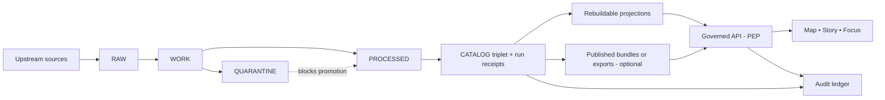

<!-- [KFM_META_BLOCK_V2]
doc_id: kfm://doc/f198c44a-6fb6-40e0-89e0-3f37f76e7742
title: data/ — Governed dataset artifacts + catalogs (Truth Path)
type: standard
version: v2
status: draft
owners: KFM Data Stewardship (resolve via CODEOWNERS)
created: 2026-02-22
updated: 2026-03-01
policy_label: public
related:
  - ../README.md
  - ../.github/README.md
  - ../configs/README.md
  - ../contracts/README.md
  - ../docs/governance/
tags:
  - kfm
  - data
  - governance
  - promotion-contract
  - catalogs
  - evidence
  - provenance
notes:
  - Documents the canonical “truth path” layout + required artifacts for promotion eligibility.
  - Written to be CI/validator-friendly (fail-closed, deterministic paths).
  - This README is a target contract; confirm repo reality and adjust path names only with a governed migration plan.
[/KFM_META_BLOCK_V2] -->

<a id="top"></a>

# `data/` — Governed dataset artifacts + catalogs
Governed dataset artifacts + catalogs for the KFM Truth Path (canonical lifecycle):

**UPSTREAM → RAW → WORK/QUARANTINE → PROCESSED → CATALOG/TRIPLET (DCAT+STAC+PROV + receipts) → PUBLISHED (governed runtime via PEP/API + UI)**  
…with an optional **PUBLISHED BUNDLES/EXPORTS** materialization stage (policy/rights filtered; cacheable), and an append-only **AUDIT** trail that makes every promotion and user-visible claim reviewable.

**Status:** draft • **Owners:** KFM Data Stewardship • **Last updated:** 2026-03-01


> [!IMPORTANT]
> **This directory is canonical truth (when used as the truth store).**  
> Databases/search/tiles are rebuildable projections. If a projection disagrees with `data/processed` + `data/catalog`, the **catalog + processed artifacts win**.

> [!IMPORTANT]
> **Terminology alignment (KFM):** **PUBLISHED** refers to the *policy-enforced runtime surfaces* (PEP/API + UI).  
> `data/published/` (this directory) is an **optional** materialization area for *published bundles/exports* (e.g., tilesets, offline packages) that runtime may serve.

> [!NOTE]
> **Normative keywords:** this README uses **MUST / SHOULD / MAY** to indicate enforcement strength.  
> Anything marked **UNKNOWN (repo)** is not verified on this branch and should fail-closed until confirmed.

---

## Quick navigation

- [Truth status legend](#truth-status-legend)
- [Directory contract](#directory-contract)
- [Repo reality check](#repo-reality-check)
- [What goes where](#what-goes-where)
- [Truth path diagram](#truth-path-diagram)
- [Directory layout](#directory-layout)
- [Canonical path convention](#canonical-path-convention)
- [Identifiers and naming](#identifiers-and-naming)
- [Deterministic hashing guardrails](#deterministic-hashing-guardrails)
- [Controlled vocabularies](#controlled-vocabularies)
- [Zone contracts](#zone-contracts)
- [Dataset specs](#dataset-specs)
- [Source registry](#source-registry)
- [Anchor register](#anchor-register)
- [Quarantine workflow](#quarantine-workflow)
- [Promotion Contract gates](#promotion-contract-gates)
- [Catalog triplet](#catalog-triplet)
- [Catalog profiles](#catalog-profiles)
- [Cross-linking rules](#cross-linking-rules)
- [Evidence resolver touchpoints](#evidence-resolver-touchpoints)
- [Checksums and digests](#checksums-and-digests)
- [Policy labels and sensitive data](#policy-labels-and-sensitive-data)
- [Definition of Done](#definition-of-done)
- [Appendix templates](#appendix-templates)

---

## Truth status legend

- **CONFIRMED (design):** required KFM posture (must hold regardless of stack)
- **UNKNOWN (repo):** not verified on this branch (treat as TODO; fail-closed)
- **PROPOSED:** a recommended template/pattern (adopt only after review)

> [!NOTE]
> This README is a **contract target** for the truth path.  
> If your branch differs, update this README and any validators together as a governed change.

---

## Directory contract

### Purpose
`data/` holds the **governed artifacts** that make KFM reproducible and auditable:
- dataset onboarding specs (inputs to deterministic identity)
- source registry entries (rights + sensitivity + access posture)
- immutable acquisitions (RAW) **or** metadata-only references (when mirroring is disallowed)
- intermediate transforms and QA outputs (WORK)
- blocked artifacts with remediation (QUARANTINE)
- publishable, immutable artifacts (PROCESSED)
- canonical metadata + lineage (CATALOG/TRIPLET: DCAT + STAC + PROV + receipts)
- optional publishable bundles/exports (PUBLISHED bundles; policy/rights filtered; cacheable)
- append-only audit ledger segments (AUDIT)

### Where this fits
`data/` sits on the **canonical side** of the trust membrane:
- **Pipelines** write here (or to equivalent object-store prefixes).
- **Governed APIs** serve only **promoted** versions that have passed gates and have catalogs/receipts.
- **Apps/UI** never read from here directly (no direct object-store/DB reads).

### Acceptable inputs
- Small, reviewable metadata (specs/registry/receipts/manifests/catalog JSON)
- Checksums and validation reports
- Approved dataset artifacts *when policy allows storing them in-repo* (often it will not)

### Exclusions
- **Secrets** (keys, tokens, credentials)
- **PII** (unless explicitly restricted and governed outside of git; even then prefer external storage)
- **Exact coordinates for sensitive locations** in public/publishable paths
- Large binaries when the repo is not meant to store them (use object storage; keep digests + pointers here)

> [!WARNING]
> If it would be unsafe to paste into a public issue, it does not belong in public-labeled areas of `data/`.

<p align="right"><a href="#top">Back to top ↑</a></p>

---

## Repo reality check

KFM can store the **full truth path** in object storage in production, while the git repo stores:
- specs + registries + catalogs + receipts + digests
- bounded fixtures for tests

Before enforcing gates, verify what your branch actually contains:

```bash
# Show top-level shape
find data -maxdepth 2 -type d -print

# Find dataset specs and source registry entries
ls -la data/specs 2>/dev/null || true
ls -la data/registry/sources 2>/dev/null || true

# Find catalogs and promotion manifests (if any exist)
find data/catalog -maxdepth 6 -name 'promotion_manifest*.json' -print 2>/dev/null

# Confirm quarantine exists (directory or state approach)
ls -la data/quarantine 2>/dev/null || true

# Spot-check PROV filename convention (bundle.jsonld vs prov.jsonld)
find data/catalog -maxdepth 8 -type f \( -name 'bundle.jsonld' -o -name 'prov.jsonld' \) -print 2>/dev/null
```

> [!IMPORTANT]
> If your repo uses a different prefix (e.g., `storage/`, `artifacts/`, or an object-store bucket mapping),
> treat this README as the **semantic contract** and map the paths accordingly—do not silently invent new meanings.

<p align="right"><a href="#top">Back to top ↑</a></p>

---

## What goes where

| Area | Purpose | Mutability | Must include (minimum) |
|---|---|---:|---|
| `data/specs/` | Dataset onboarding specs (inputs to `spec_hash`) | editable (versioned) | dataset_slug, upstream/sources, validation rules, outputs, policy label intent |
| `data/registry/sources/` | Source registry (rights/sensitivity/access posture) | editable | license/terms snapshot pointer, sensitivity intent, cadence, QA notes, mirroring mode |
| `data/registry/anchors/` | Anchor dataset register (Tier 0/1/…) | editable (versioned) | anchors list + CI validation against sources/specs |
| `data/fixtures/` | Small fixtures for tests/eval | editable | bounded samples + expected outputs |
| `data/raw/` | Immutable acquisitions (append-only) | append-only | acquisition manifest, terms snapshot(s), raw artifacts **or** metadata-only pointer(s), checksums |
| `data/work/` | Intermediate transforms + QA outputs (run-scoped) | per-run; keep runs append-only | artifacts, QA outputs, checksums, run receipt pointer (or copy) |
| `data/quarantine/` | Failed gates (blocked from promotion) | append-only | reason + remediation plan + owner, diagnostics (bounded), checksums |
| `data/processed/` | Publishable artifacts (immutable per DatasetVersion) | immutable per version | artifacts, checksums, runtime metadata, QA report |
| `data/catalog/` | Canonical metadata + lineage (triplet + receipts + promotion manifest) | immutable per version | DCAT + STAC + PROV, run receipts, promotion manifest, link validation |
| `data/published/` | **Optional**: publishable bundles/exports used by runtime (policy/rights filtered; cacheable) | immutable per version | exports/bundles + attribution (if allowed), checksums, publish run receipt |
| `data/audit/` | Append-only audit ledger segments | append-only | ledger segments, references to approvals/decisions (policy-safe) |

> [!WARNING]
> **RAW is append-only.** Never “fix” a RAW acquisition in place.  
> If upstream content is wrong, create a new acquisition / DatasetVersion, quarantine the bad one, and supersede it via catalog/provenance.

<p align="right"><a href="#top">Back to top ↑</a></p>

---

## Truth path diagram



> [!NOTE]
> In KFM terms, **PUBLISHED** is the governed runtime surface (**API/PEP + UI**).  
> `PB` above is an optional *materialization* of publishable bundles/exports that runtime may serve.

> [!NOTE]
> Only **promoted DatasetVersions** (processed + validated catalogs + receipts + pass gates) are eligible to appear in runtime surfaces.

<p align="right"><a href="#top">Back to top ↑</a></p>

---

## Directory layout

This is the **recommended contract layout** for the truth path. Use it as the basis for validators and CI gates.

```text
data/                                                   # Governed truth path + registries
├─ README.md
│
├─ specs/                                                # Dataset onboarding specs (inputs to spec_hash; deterministic)
│  ├─ README.md
│  ├─ <dataset_slug>.v1.json                             # Canonical dataset spec (versioned)
│  └─ _schemas/                                          # OPTIONAL: schemas for dataset specs (or reference contracts/)
│     └─ kfm.dataset_spec.v1.schema.json
│
├─ registry/                                             # Canonical registries (governed)
│  ├─ README.md
│  ├─ sources/
│  │  ├─ <source_id>.v1.yml                              # Source registry entry (human editable)
│  │  └─ <source_id>.v1.json                             # OPTIONAL: normalized export (generated)
│  └─ anchors/
│     ├─ anchors.v1.json                                 # Anchor register (Tier 0/1/2/R)
│     └─ _schemas/
│        └─ kfm.anchor_register.v1.schema.json
│
├─ fixtures/                                             # Small fixtures for tests/evals (bounded; synthetic preferred)
│  ├─ README.md
│  ├─ sample_dataset/
│  ├─ sample_catalog_triplet/
│  └─ golden/                                            # expected outputs for validators
│
├─ raw/                                                  # Immutable acquisitions (append-only; never served)
│  └─ <dataset_slug>/
│     └─ <dataset_version_id>/                           # NOTE: some deployments prefer <acquisition_id>; see Canonical path convention
│        ├─ acquisition_manifest.v1.json                 # Capture manifest (license/sensitivity required)
│        ├─ terms_snapshot/                              # Terms/license snapshot(s) captured at acquisition time
│        │  └─ <captured_at>.txt|html|pdf
│        ├─ artifacts/                                   # Original payload (never modified; MAY be absent if metadata-only mode)
│        ├─ pointers/                                    # OPTIONAL: metadata-only references when mirroring is disallowed
│        │  └─ artifacts.ref.v1.json
│        ├─ checksums.v1.json                            # Digests for raw artifacts (or referenced artifacts, where possible)
│        └─ notes.md                                     # OPTIONAL: human notes (policy-safe)
│
├─ work/                                                 # Regeneratable intermediates (never served; run-scoped)
│  └─ <dataset_slug>/
│     └─ <dataset_version_id>/
│        ├─ runs/
│        │  └─ <run_id>/                                 # One pipeline work run
│        │     ├─ artifacts/                             # Intermediate outputs (bounded; reproducible)
│        │     ├─ qa/                                    # Validation/QC outputs (schema/geo/time/license/policy checks)
│        │     ├─ checksums.v1.json                      # Digests for work artifacts
│        │     └─ run_receipt.ref.json                   # POINTER or copy of the run receipt (see catalog/ too)
│        └─ summary.json                                 # OPTIONAL: aggregated status across runs (generated)
│
├─ quarantine/                                           # Failed gates (never served; never promoted)
│  └─ <dataset_slug>/
│     └─ <dataset_version_id>/
│        ├─ reason.v1.json                               # REQUIRED: reason code + remediation plan + owner
│        ├─ diagnostics/                                 # Debug artifacts (bounded; synthetic where possible)
│        ├─ checksums.v1.json                            # Digests for quarantine artifacts
│        └─ supersedes.json                              # OPTIONAL: points to replacement DatasetVersion(s)
│
├─ processed/                                            # Publishable artifacts — immutable per DatasetVersion
│  └─ <dataset_slug>/
│     └─ <dataset_version_id>/
│        ├─ artifacts/                                   # Data products (GeoParquet, PMTiles, COG, JSONL, PDF…)
│        ├─ checksums.v1.json                            # Digests for processed artifacts (required)
│        ├─ runtime_metadata.v1.json                     # Bounds, schema refs, policy label, evidence refs
│        └─ qa/
│           ├─ validation_report.v1.json                 # REQUIRED for promotion gates
│           └─ profiles_used.v1.json                     # OPTIONAL: what profile set validated this version
│
├─ catalog/                                              # Canonical metadata + lineage (validated + cross-linked)
│  └─ <dataset_slug>/
│     └─ <dataset_version_id>/
│        ├─ dcat.jsonld                                  # DCAT dataset/distribution record(s)
│        ├─ stac/
│        │  ├─ collection.json                           # STAC Collection
│        │  └─ items/                                    # STAC Items (one file per item)
│        ├─ prov/
│        │  └─ bundle.jsonld                             # PROV bundle linking raw → work → processed
│        ├─ run_receipts/                                # Receipts/manifests used as promotion evidence
│        │  └─ <run_id>.json
│        ├─ promotion_manifest.v1.json                   # Roll-up manifest tying catalogs/receipts/checksums together
│        ├─ linkcheck_report.v1.json                     # OPTIONAL: generated linkcheck outputs (CI artifact)
│        └─ checksums.v1.json                            # OPTIONAL: digest roll-up for catalog artifacts
│
├─ published/                                            # OPTIONAL: publishable bundles/exports used by runtime (policy/rights filtered)
│  └─ <dataset_slug>/
│     └─ <dataset_version_id>/
│        ├─ exports/                                     # Allowed exports (CSV/GeoJSON/packages/tilesets)
│        ├─ attribution/                                 # Auto-generated attribution bundle (license + notices)
│        ├─ publish_run_receipt.json                     # OPTIONAL: run receipt for publish/export step
│        └─ checksums.v1.json
│
└─ audit/                                                # Append-only audit records (often stored outside git in prod)
   ├─ README.md
   └─ ledger/
      └─ <year>/<month>/
         └─ append-only.log                              # Append-only ledger segments (policy-safe; access-controlled)
```

> [!IMPORTANT]
> If artifacts live outside git (recommended for most real datasets), these paths map cleanly to object storage prefixes.
> The repo can still store **specs + registries + manifests + catalogs + receipts + digests** to preserve auditability.

<p align="right"><a href="#top">Back to top ↑</a></p>

---

## Canonical path convention

KFM uses predictable paths so CI, policy, and evidence resolution can be deterministic.

### Canonical path patterns (zones)
- `specs/<dataset_slug>.v1.json`
- `registry/sources/<source_id>.v1.yml`
- `registry/anchors/anchors.v1.json`

- `raw/<dataset_slug>/<dataset_version_id>/acquisition_manifest.v1.json`
- `raw/<dataset_slug>/<dataset_version_id>/terms_snapshot/*`
- `raw/<dataset_slug>/<dataset_version_id>/artifacts/*` (if mirroring is allowed)
- `raw/<dataset_slug>/<dataset_version_id>/pointers/artifacts.ref.v1.json` (if metadata-only mode)
- `raw/<dataset_slug>/<dataset_version_id>/checksums.v1.json`

- `work/<dataset_slug>/<dataset_version_id>/runs/<run_id>/artifacts/*`
- `work/<dataset_slug>/<dataset_version_id>/runs/<run_id>/qa/*`
- `work/<dataset_slug>/<dataset_version_id>/runs/<run_id>/checksums.v1.json`

- `quarantine/<dataset_slug>/<dataset_version_id>/reason.v1.json`

- `processed/<dataset_slug>/<dataset_version_id>/artifacts/*`
- `processed/<dataset_slug>/<dataset_version_id>/checksums.v1.json`
- `processed/<dataset_slug>/<dataset_version_id>/qa/validation_report.v1.json`

- `catalog/<dataset_slug>/<dataset_version_id>/dcat.jsonld`
- `catalog/<dataset_slug>/<dataset_version_id>/stac/collection.json`
- `catalog/<dataset_slug>/<dataset_version_id>/prov/bundle.jsonld`
- `catalog/<dataset_slug>/<dataset_version_id>/run_receipts/<run_id>.json`
- `catalog/<dataset_slug>/<dataset_version_id>/promotion_manifest.v1.json`

- `published/<dataset_slug>/<dataset_version_id>/exports/*` (if used)
- `published/<dataset_slug>/<dataset_version_id>/publish_run_receipt.json` (if used)

> [!NOTE]
> **PROPOSED option:** some deployments key `raw/` by `<acquisition_id>` and `work/` by `<work_run_id>`.  
> If you adopt that posture, update all validators and receipts to reference the chosen canonical keys. Do **not** mix keying schemes inside one dataset.

### Canonical rules (enforced by validators / promotion gates)
- `raw/`, `work/`, `quarantine/`, `processed/`, `catalog/`, `published/`, `audit/` are **reserved** zone names.
- `dataset_slug` is stable and does **not** encode dates.
- `dataset_version_id` is derived deterministically from the dataset spec (`spec_hash` posture).
- Every artifact referenced by catalogs/receipts MUST have a digest (prefer `sha256`).
- Catalogs cross-link and validate as a triplet (+ receipts).
- Quarantined versions MUST NOT be served or promoted.

<p align="right"><a href="#top">Back to top ↑</a></p>

---

## Identifiers and naming

### Identifier families (recommended)
Use explicit URI-like identifiers with stable prefixes:
- `kfm://dataset/<dataset_slug>` (Dataset)
- `kfm://dataset/<dataset_slug>@<dataset_version_id>` (DatasetVersion)
- `kfm://artifact/sha256:<digest>` (Artifact)
- `kfm://run/<timestamp>.<dataset_slug>.<spec_hash_prefix>` (Run)
- `kfm://evidence/<digest>` (EvidenceBundle identity)
- `kfm://story/<uuid>@v3` (Story node)

Avoid embedding environment-specific hostnames in canonical IDs. Hostnames belong in distribution URLs.

### Deterministic versioning posture (spec_hash)
- `spec_hash` MUST be computed from a **canonicalized** spec representation (canonical JSON recommended).
- `spec_hash` MUST be stable across platforms (enforce with a test).
- `dataset_version_id` MUST be derived from `spec_hash` inputs (same spec → same version ID).

### Dataset slug conventions
Rules (recommended):
- lowercase
- words separated by underscore
- include upstream authority when helpful
- do not include date in dataset slug (date belongs to version)

<p align="right"><a href="#top">Back to top ↑</a></p>

---

## Deterministic hashing guardrails

Deterministic identity is only useful if it is **re-computable in CI** and **stable across platforms**.

### Hash drift prevention checklist (MUST for any “spec_hash posture”)
- **Do not** compute `spec_hash` from data that depends on:
  - system clocks (e.g., `retrieved_at`, `fetched_at`, “now()”)
  - random seeds / UUIDs generated at runtime
  - unstable serialization (unordered maps, locale-dependent floats)
- **Do**:
  - canonicalize JSON (RFC 8785 posture recommended)
  - pin any referenced schema/profile versions
  - keep any acquisition timestamps in **manifests and run receipts**, not in the hashed spec
  - include a CI “golden spec_hash” test for at least one fixture spec

### PROPOSED: stable `dataset_version_id` composition
Examples in KFM docs often look like `2026-02.abcd1234`.  
To preserve determinism while keeping a human-friendly prefix:
- include a stable `version_ref` (e.g., `2026-02`) in the dataset spec (not derived from wall-clock), and
- compute `dataset_version_id` as `<version_ref>.<spec_hash_prefix>`.

If you adopt this, bake it into validators and keep the algorithm documented and tested.

<p align="right"><a href="#top">Back to top ↑</a></p>

---

## Controlled vocabularies

Controlled vocabularies reduce “mystery states” in receipts, catalogs, and policy evaluation.

Recommended starter controlled vocabularies:
- `citation.kind`: `dcat | stac | prov | doc | graph`
- `artifact.zone`: `raw | work | quarantine | processed | catalog | published | external`
- `policy_label`: `public | public_generalized | restricted | restricted_sensitive_location | internal | embargoed | quarantine`

> [!NOTE]
> Expand vocabularies only via governed change (ADR + schema update + tests).  
> New terms MUST be supported by validators.

<p align="right"><a href="#top">Back to top ↑</a></p>

---

## Zone contracts

| Zone | Primary goal | Allowed contents | Not allowed | “Serve/publish eligible?” |
|---|---|---|---|---|
| RAW | Preserve upstream truth | as-received payload + manifest + terms snapshot + digests **or** metadata-only references | edits-in-place | ❌ |
| WORK | Normalize + validate + draft redactions | intermediate transforms + QA + candidates (run-scoped) | skipping QA, “manual fixes” without provenance | ❌ |
| QUARANTINE | Fail closed safely | reason + remediation + diagnostics (bounded) | promotion shortcuts | ❌ |
| PROCESSED | Publishable outputs | KFM-approved formats + digests + runtime metadata | missing digests/metadata | ✅ (only with catalogs + receipts + pass gates) |
| CATALOG/TRIPLET | Canonical evidence surface | DCAT + STAC + PROV + receipts + promotion manifest | unvalidated catalogs, broken links | ✅ |
| PUBLISHED | Governed runtime surface | policy-enforced API/UI outputs; may be backed by immutable bundles | bypassing PEP/policy | ✅ (policy-limited) |
| PUBLISHED bundles (dir) | Optional publish artifacts | tilesets/offline packages/exports + attribution + receipts | leaking restricted details | ✅ (policy-limited) |
| AUDIT | Reviewability | append-only ledger segments | deletion/rewrites | N/A |

---

## Dataset specs

Dataset specs are **inputs** to deterministic identity and pipeline behavior.

**Location:** `data/specs/<dataset_slug>.v1.json`

Minimum requirements:
- MUST be canonicalizable (JSON recommended)
- MUST be versioned (`kfm_spec_version`)
- MUST include upstream/sources, validation rules, and output artifact plan
- MUST include policy label intent (for review + obligations)

> [!IMPORTANT]
> Changing a dataset spec changes identity inputs.  
> Any change that affects `spec_hash` MUST be treated as a **new DatasetVersion** and must be audit-visible.

---

## Source registry

Every upstream **source** must have a machine-readable registry entry; it is a promotion input (not optional documentation).

**Location:** `data/registry/sources/<source_id>.v1.yml`

Minimum fields:
- `source_id` (stable)
- `name`, `authority`, `domain`
- `access_method` (api/bulk/portal/manual/scrape)
- `cadence`
- `license_terms_snapshot` (what/when/where captured)
- `sensitivity_intent` (policy label intent)
- `connector_spec` (non-secret)
- `mirroring_mode` (mirror_full | mirror_thumbnails | metadata_only_reference)
- `known_limitations` + `qa_checks`

---

## Anchor register

The anchor register makes the “build-first” dataset set enforceable.

**Location:** `data/registry/anchors/anchors.v1.json`

Validation expectations:
- every anchor references an existing `source_id` entry
- every anchor references an existing dataset spec
- anchors requiring restricted handling must declare derivative expectations (e.g., public_generalized spec exists)

> [!NOTE]
> The anchor register is a **CI gate input**: it prevents drift between “what we claim are anchors” and “what is actually onboarded.”

---

## Quarantine workflow

Quarantine triggers include:
- unclear licensing / rights
- validation failures (schema/geo/time)
- sensitivity concerns (restricted/sensitive location)
- upstream instability preventing reproducible acquisition

Quarantine requires:
- `reason.v1.json` with a reason code + remediation plan + owner
- checksums for any diagnostic artifacts
- explicit supersession pointers if replaced

> [!WARNING]
> Do not “temporarily promote” quarantined items.

---

## Promotion Contract gates

Promotion to **PUBLISHED runtime** MUST be blocked unless required artifacts exist **and validate**. These gates are the basis of CI checks and steward review.

> [!TIP]
> Treat the gate set as **non-skippable**. Use a single always-runs “gate summary” check as the branch protection requirement.

### Gate A — Identity and versioning
- Dataset identity (`dataset_id` / slug) is stable.
- DatasetVersion is immutable and derived from deterministic `spec_hash` (canonicalized spec input).
- Spec hash stability test exists in CI (same spec → same hash across platforms).

### Gate B — Licensing and rights metadata
- License is explicit and compatible with intended use.
- Rights-holder and attribution requirements are captured.
- Mirroring mode is compatible with rights (metadata-only reference is allowed when mirroring is disallowed).
- If unclear: quarantine (fail closed).

### Gate C — Sensitivity classification and redaction plan
- `policy_label` assigned.
- Policy evaluation returns allow/deny plus obligations (e.g., generalize geometry, remove attributes) and reason codes.
- For restricted/sensitive-location: a generalization/redaction plan exists and is recorded in PROV.

### Gate D — Catalog triplet validation + cross-links
- DCAT record exists and validates under profile.
- STAC collection/items exist (if applicable) and validate.
- PROV bundle exists and validates.
- Run receipt(s) exist and cross-link the triplet.
- EvidenceRefs resolve without guessing (link-check + resolver smoke test).

### Gate E — QA thresholds
- Dataset-specific quality checks and thresholds are documented in spec.
- Validation report exists with a pass/degraded/fail summary.
- Failures are quarantined and blocked from promotion.

### Gate F — Run receipt + audit record
- Run receipts exist for producing runs (pipeline runs and any publish/export runs).
- Inputs and outputs are enumerated with digests (prefer sha256).
- Environment recorded (container image digest, params digest, git ref).
- Append-only audit record exists (policy-safe).

### Gate G — Release manifest (promotion manifest)
- `promotion_manifest.v1.json` exists and is digest-addressable.
- Optional signatures/attestations are present (where your supply chain posture requires them).
- Release tagging/changelog is produced for promoted versions.

---

## Catalog triplet

The triplet is KFM’s interoperability + evidence surface:

- **DCAT**: dataset identity, publisher, license/rights, distributions
- **STAC**: assets, spatiotemporal extents, hrefs + checksums, policy-consistent geometry/bbox
- **PROV**: lineage (raw → work → processed), agents, activities, parameters, approvals
- **Run receipts**: per-run evidence (inputs/outputs/checks/timestamps) used by CI and the evidence resolver

Minimum expectations:
- All components exist where applicable and validate under KFM profiles.
- All include:
  - `kfm:dataset_id`
  - `kfm:dataset_version_id`
  - `kfm:policy_label`
- All cross-links resolve deterministically (no guessing).
- EvidenceRefs used by stories/focus map into these objects.

---

## Catalog profiles

KFM should define strict, testable profiles for each catalog type so validation is predictable.

**PROPOSED minima** (extend in `contracts/`):

### DCAT (minimum)
- `dct:title`, `dct:description`, `dct:publisher`
- `dct:license` (or `dct:rights`)
- `dct:spatial` and `dct:temporal` coverage
- `dcat:distribution` (one per artifact class)
- `prov:wasGeneratedBy` link to PROV activity/bundle
- `kfm:policy_label`, `kfm:dataset_id`, `kfm:dataset_version_id`

### STAC (minimum)
Collection:
- `id`, `title`, `description`, `extent` (spatial bbox + temporal interval), `license`
- links to DCAT dataset record
- `kfm:dataset_version_id` and policy label

Item:
- `id`, `geometry` or `bbox` (policy-consistent/generalized), `datetime` (or start/end)
- assets with `href` + `checksum`/digest + `media_type`
- links to PROV activity and/or run receipt and DCAT distribution

### PROV (minimum)
- `prov:Activity` per pipeline run
- `prov:Entity` per artifact (raw, work, processed)
- `prov:Agent` for pipeline and steward approval events
- `prov:used` and `prov:wasGeneratedBy` edges
- policy decision references (decision_id + obligations)
- environment capture: container image digest, git commit, parameters

---

## Cross-linking rules

Cross-links MUST be explicit so navigation and evidence resolution are deterministic:

- DCAT dataset → distributions → artifact digests
- DCAT dataset → `prov:wasGeneratedBy` → PROV bundle
- STAC collection → link rel=`describedby` → DCAT dataset
- STAC item → link to PROV activity and/or run receipt
- EvidenceRef schemes resolve into these objects without guessing

CI SHOULD include a link-checker that verifies cross-links for every promoted dataset version.

---

## Evidence resolver touchpoints

EvidenceRef schemes (minimum starter set):
- `dcat://...` resolves to dataset/distribution metadata
- `stac://...` resolves to collection/item/asset metadata
- `prov://...` resolves to run lineage (activities/entities/agents)
- `doc://...` resolves to governed docs and story citations
- `graph://...` resolves to entity relations (if enabled)

Minimum expectations:
- Resolver applies policy and returns allow/deny plus obligations.
- EvidenceBundle returned includes:
  - human view (renderable card)
  - machine metadata (JSON)
  - artifact links (only if policy allows)
  - digests + dataset_version IDs
  - audit references

---

## Checksums and digests

Rules:
- Every artifact gets a digest (prefer `sha256`).
- Digests are recorded in:
  - zone-adjacent `checksums.v1.json`
  - run receipts (`catalog/.../run_receipts/<run_id>.json`)
  - promotion manifest roll-up (`promotion_manifest.v1.json`)
- Catalogs SHOULD surface digests in artifact metadata (e.g., DCAT distributions and STAC assets).

Recommended `checksums.v1.json` structure:

```json
{
  "kfm_checksums_version": "v1",
  "algorithm": "sha256",
  "artifacts": [
    { "path": "artifacts/events.parquet", "digest": "sha256:..." },
    { "path": "qa/validation_report.v1.json", "digest": "sha256:..." }
  ]
}
```

> [!IMPORTANT]
> Checksums are integrity controls and audit anchors. Missing or mismatched digests are promotion blockers.

---

## Policy labels and sensitive data

Starter labels (extend via controlled vocab):
- `public`
- `public_generalized`
- `restricted`
- `restricted_sensitive_location`
- `internal`
- `embargoed`
- `quarantine`

Default-safe rules:
- Default deny for sensitive-location and restricted data unless policy explicitly allows.
- If any public representation is allowed, publish a **separate** `public_generalized` derivative.
- Never embed precise coordinates in Story Nodes or Focus outputs unless policy explicitly allows.
- Generalization/redaction is a first-class transform recorded in PROV.
- Policy decisions may include obligations + reason codes; record the decision ID and obligations in receipts/catalogs.

---

## Definition of Done

A dataset integration (or new DatasetVersion) is DONE only when:

### Onboarding
- [ ] Source registry entry exists (`data/registry/sources/*`) with terms snapshot pointer, mirroring mode, and sensitivity intent.
- [ ] Dataset spec exists (`data/specs/*`) and `spec_hash` stability is tested.
- [ ] RAW acquisition includes manifest + terms snapshot + digests (or metadata-only references if mirroring is disallowed).
- [ ] WORK run(s) emit QA artifacts + digests + run receipt references.
- [ ] Failures are quarantined with reason + remediation plan.

### Promotion eligibility
- [ ] PROCESSED artifacts exist and are digest-addressed.
- [ ] CATALOG triplet validates and cross-links (DCAT/STAC/PROV) + receipts.
- [ ] Run receipts exist and enumerate input/output digests.
- [ ] Promotion manifest exists and ties everything together.
- [ ] At least one EvidenceRef resolves successfully in CI (smoke test).
- [ ] Policy label reviewed where required (steward workflow).
- [ ] (If used) PUBLISHED exports/bundles exist and pass policy/rights filters.
- [ ] Changelog entry exists if this is a governed release/promotion.

---

## Appendix templates

<details>
<summary><strong>Template: Dataset spec (JSON)</strong></summary>

```json
{
  "kfm_spec_version": "v1",
  "dataset_slug": "example_dataset",

  "title": "Example Dataset",

  "upstream": {
    "authority": "Example Authority",
    "access_method": "bulk",
    "endpoints": [
      {
        "name": "example_zip",
        "url": "https://example.invalid/data.zip",
        "parameters": { "region": "KS", "as_of": "2026-02" }
      }
    ],
    "cadence": "monthly"
  },

  "sensitivity": {
    "policy_label_intent": "public",
    "pii_risk": "low",
    "sensitive_location_risk": "low",
    "obligations": []
  },

  "validation": {
    "schema": "contracts/schemas/example.schema.json",
    "checks": [
      { "name": "geometry_valid", "threshold": 1.0 },
      { "name": "required_fields_present", "threshold": 0.99 }
    ]
  },

  "transforms": [
    {
      "name": "normalize",
      "container_image": "sha256:<pinned_image_digest>",
      "params": { "crs": "EPSG:4326", "schema_version": "v1" }
    }
  ],

  "outputs": [
    {
      "artifact_type": "geoparquet",
      "zone": "processed",
      "path": "data/processed/example_dataset/<dataset_version_id>/artifacts/data.geoparquet",
      "media_type": "application/x-parquet"
    }
  ]
}
```

> [!NOTE]
> Keep acquisition timestamps (fetched_at/retrieved_at) in **acquisition manifests** and **run receipts**, not in the hashed spec.

</details>

<details>
<summary><strong>Template: Source registry entry (YAML)</strong></summary>

```yaml
source_id: usgs_waterdata_nwis
name: USGS WaterData (NWIS)
authority: USGS
domain: hydrology
access_method: api
cadence: daily
license_terms_snapshot:
  kind: public_domain
  captured_at: "2026-02-22"
  path_hint: "data/raw/usgs_waterdata_nwis/<dataset_version_id>/terms_snapshot/..."
sensitivity_intent: public
mirroring_mode: mirror_full # mirror_full | mirror_thumbnails | metadata_only_reference
connector_spec:
  type: http_api
  base_url: "https://example.invalid/"
credentials:
  strategy: secrets_manager
known_limitations:
  - missing_values_present
qa_checks:
  - validate_lat_lon_bounds
  - validate_time_series_gaps
```
</details>

<details>
<summary><strong>Template: Acquisition manifest (JSON)</strong></summary>

```json
{
  "kfm_acquisition_manifest_version": "v1",
  "dataset_slug": "example_dataset",
  "dataset_version_id": "2026-02.abcd1234",
  "source_id": "example_source",
  "fetched_at": "2026-02-28T12:00:00Z",
  "license_terms_snapshot": {
    "captured_at": "2026-02-28T12:00:00Z",
    "paths": ["terms_snapshot/2026-02-28T12-00Z.txt"]
  },
  "policy": { "sensitivity_intent": "public" },
  "mirroring_mode": "mirror_full",
  "artifacts": [
    { "path": "artifacts/source.csv", "media_type": "text/csv" }
  ],
  "notes": "RAW is append-only; supersede with a new acquisition/DatasetVersion if needed."
}
```
</details>

<details>
<summary><strong>Template: Quarantine reason (JSON)</strong></summary>

```json
{
  "kfm_quarantine_reason_version": "v1",
  "dataset_slug": "example_dataset",
  "dataset_version_id": "2026-02.abcd1234",
  "reason_code": "RIGHTS_UNCLEAR|VALIDATION_FAIL|SENSITIVE_LOCATION|OTHER",
  "summary": "Short policy-safe summary of why this version is blocked.",
  "remediation_plan": {
    "owner": "team-or-person",
    "next_steps": ["Capture license terms snapshot", "Add generalization transform", "Re-run validation"],
    "target_date": "2026-03-15"
  },
  "created_at": "2026-02-28T13:00:00Z"
}
```
</details>

<details>
<summary><strong>Template: Validation report (JSON)</strong></summary>

```json
{
  "kfm_validation_report_version": "v1",
  "dataset_slug": "example_dataset",
  "dataset_version_id": "2026-02.abcd1234",
  "status": "pass|degraded|fail",
  "checks": [
    { "name": "schema", "status": "pass", "details": {} },
    { "name": "spatial_bounds", "status": "pass", "details": {} },
    { "name": "temporal_coverage", "status": "degraded", "details": { "missing_pct": 0.02 } },
    { "name": "rights", "status": "pass", "details": {} },
    { "name": "policy", "status": "pass", "details": { "policy_label": "public" } }
  ],
  "generated_at": "2026-02-28T14:00:00Z"
}
```
</details>

<details>
<summary><strong>Template: Run receipt (JSON)</strong></summary>

```json
{
  "kfm_run_receipt_version": "v1",
  "run_id": "kfm://run/2026-02-28T12:00:00Z.example_dataset.abcd",
  "run_type": "pipeline|index|story_publish|focus",
  "dataset_slug": "example_dataset",
  "dataset_version_id": "2026-02.abcd1234",
  "spec_hash": "sha256:abcd1234...",
  "inputs": [
    {
      "artifact_id": "kfm://artifact/sha256:1111...",
      "zone": "raw",
      "uri": "s3://kfm-raw/example_dataset/2026-02/source.csv",
      "digest": "sha256:1111..."
    }
  ],
  "outputs": [
    {
      "artifact_id": "kfm://artifact/sha256:2222...",
      "zone": "processed",
      "path": "data/processed/example_dataset/2026-02.abcd1234/artifacts/data.geoparquet",
      "digest": "sha256:2222...",
      "media_type": "application/x-parquet"
    }
  ],
  "validation": {
    "status": "pass|degraded|fail",
    "reports": [{ "name": "schema_check", "status": "pass" }]
  },
  "policy": {
    "policy_label": "public",
    "decision_id": "kfm://policy_decision/xyz",
    "obligations": []
  },
  "environment": {
    "git_commit": "<commit>",
    "container_image": "sha256:<image_digest>",
    "runtime": "kubernetes",
    "parameters_digest": "sha256:<params_digest>"
  },
  "timestamps": { "started_at": "2026-02-28T12:00:00Z", "ended_at": "2026-02-28T12:10:00Z" },
  "audit_ref": "kfm://audit/entry/123"
}
```
</details>

<details>
<summary><strong>Template: Promotion manifest (JSON)</strong></summary>

```json
{
  "kfm_promotion_manifest_version": "v1",
  "dataset_slug": "example_dataset",
  "dataset_version_id": "2026-02.abcd1234",
  "spec_hash": "sha256:abcd1234...",
  "released_at": "2026-02-28T13:00:00Z",
  "artifacts": [
    { "path": "artifacts/data.geoparquet", "digest": "sha256:...", "media_type": "application/x-parquet" }
  ],
  "catalogs": [
    { "path": "dcat.jsonld", "digest": "sha256:..." },
    { "path": "stac/collection.json", "digest": "sha256:..." },
    { "path": "prov/bundle.jsonld", "digest": "sha256:..." }
  ],
  "qa": { "status": "pass", "report_digest": "sha256:..." },
  "policy": { "policy_label": "public", "decision_id": "kfm://policy_decision/xyz" },
  "approvals": [
    { "role": "steward", "principal": "<id>", "approved_at": "2026-02-28T12:59:00Z" }
  ]
}
```
</details>

<p align="right"><a href="#top">Back to top ↑</a></p>
