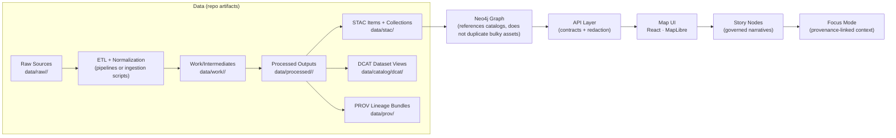

# `data/` — KFM datasets, staging, and catalogs

🏷️ **Governed** • 🏷️ **Evidence-first** • 🏷️ **Contract-first** • 🏷️ **Deterministic pipelines** • 🏷️ **Trust membrane**

This directory is the canonical **on-repo home** for KFM’s data lifecycle **staging areas** and the **metadata boundary artifacts** that make data publishable and traceable across the platform (catalogs → graph → API → UI → Story Nodes → Focus Mode).

> ⚠️ **Governance note**
>
> Treat **anything under `data/processed/` and the catalogs (`data/stac/`, `data/catalog/dcat/`, `data/prov/`) as publishable project artifacts**.
> If a dataset contains sensitive information (e.g., culturally restricted locations, protected sites, PII), **do not publish it** without governance review and appropriate generalization/redaction in the governed pipeline and API layer.

---

## 📘 Overview

### Purpose
- Provide a **standard, auditable staging structure** for datasets:
  - `data/raw/` → immutable source snapshots
  - `data/work/` → intermediate/working artifacts
  - `data/processed/` → final publishable outputs
- Provide the **required catalogs** that act as *boundary artifacts* for downstream layers:
  - **STAC** for assets (collections + items)
  - **DCAT** for dataset discovery/distributions
  - **PROV** for lineage (inputs → activities → outputs)

### Scope
This README defines:
- directory conventions, lifecycle rules, and “done” gates for data publication
- catalog locations and linkage expectations (STAC/DCAT/PROV)
- architecture boundaries for how `data/` interacts with graph/API/UI

Out of scope:
- domain-specific ETL recipes (these live under `docs/data/<domain>/README.md`)
- uncited interpretation or narrative (belongs in governed Story Nodes)

### Audience
- data contributors and domain stewards
- pipeline/ETL authors
- maintainers reviewing PRs that add or modify data artifacts
- governance/security reviewers

### Key definitions
- **Domain**: a top-level thematic module (e.g., `soils`, `air-quality`, `land-treaties`)
- **Dataset**: a versioned data product with catalog entries and provenance
- **Evidence artifact**: any derived/analysis/AI-generated output treated as a first-class dataset
- **Boundary artifacts**: the required metadata records (STAC/DCAT/PROV) that “publish” a dataset

---

## 🗂️ Directory Layout

### This document
- `data/README.md` (this file)

### Expected canonical subfolders (required staging + catalogs)

```text
data/
  README.md
  raw/
    <domain>/
      ...
  work/
    <domain>/
      ...
  processed/
    <domain>/
      ...
  stac/
    collections/
      ...
    items/
      ...
  catalog/
    dcat/
      ...
  prov/
    ...
```

### Directory registry

| Path | Stage | What goes here | Mutability | Notes |
|---|---|---|---|---|
| `data/raw/<domain>/` | Source snapshots | Original downloads, exports, scans (as received) | **Read-only** | Never “fix” raw in place; add a new raw version instead. |
| `data/work/<domain>/` | Working | Intermediate outputs, scratch tables, temporary conversions | Mutable | May be cleaned periodically (but must not break PROV). |
| `data/processed/<domain>/` | Publishable | Final normalized layers (vectors/rasters/tables) | Controlled | Must be reproducible via pipeline; changes require catalog + PROV updates. |
| `data/stac/collections/` | Catalog | STAC Collection records | Controlled | Required for publish boundary. |
| `data/stac/items/` | Catalog | STAC Item records linking to assets | Controlled | Item IDs must be stable. |
| `data/catalog/dcat/` | Catalog | DCAT Dataset entries (JSON-LD) | Controlled | Primary discovery layer and distributions. |
| `data/prov/` | Provenance | PROV lineage bundles (JSON-LD) | Controlled | Must connect raw → work → processed. |

#### Optional (only if your repo uses them)
> Keep optional folders clearly documented and **do not invent ad-hoc new roots** without updating governance docs.

- `data/sources/` — source inventories (URLs, descriptions, extents)  
- `data/samples/` — small, non-sensitive fixtures for tests/demos  
- `data/tiles/` — derived tilesets or preview artifacts (if produced by pipeline)  

---

## 🧭 Context

### Where `data/` sits in KFM architecture
`data/` is part of the **Infrastructure layer**: it stores datasets and (optionally) ETL artifacts, while downstream runtime stores include spatial DBs and indexes. The **frontend must not read directly from `data/`**; it consumes the governed API (trust membrane).  

### Invariants (must not regress)
- **No direct client access:** UI/external clients do not bypass the API gateway.
- **No direct DB access from core logic:** backend business logic does not bypass repository interfaces.
- **Deterministic pipelines:** given the same inputs/config, pipelines produce stable outputs.
- **Publish boundary:** a dataset is not “published” until STAC + DCAT + PROV are present and valid.

---

## 🗺️ Diagrams

### Canonical pipeline flow (data → catalogs → graph → API → UI → narrative)



---

## 📦 Data & Metadata

### Data lifecycle (required staging)

1) **Ingest → `data/raw/<domain>/`**  
2) **Transform → `data/work/<domain>/`** (intermediate artifacts)  
3) **Publishable outputs → `data/processed/<domain>/`**  
4) **Boundary artifacts → catalogs + provenance**  
   - STAC (collections/items)
   - DCAT (dataset entries)
   - PROV (lineage bundles)

> ✅ **Rule:** If it isn’t in catalogs + PROV, it isn’t publishable.

### Domain expansion pattern (adding a new domain or dataset)

**Minimum steps**
- [ ] Create domain folder(s): `data/raw/<new-domain>/`, `data/work/<new-domain>/`, `data/processed/<new-domain>/`
- [ ] Place raw inputs under `data/raw/<new-domain>/` (read-only snapshots)
- [ ] Run deterministic ETL to produce outputs in `data/processed/<new-domain>/`
- [ ] Generate boundary artifacts:
  - [ ] STAC Collection + Item(s)
  - [ ] DCAT Dataset entry
  - [ ] PROV lineage bundle (raw → work → processed)
- [ ] Add/Update domain runbook: `docs/data/<new-domain>/README.md`
- [ ] Run validations (see **🧪 Validation & CI/CD**)
- [ ] Submit PR with full provenance and governance notes

### Evidence artifact pattern (AI/analysis outputs)

KFM treats derived/analysis outputs as first-class datasets:
- Store the artifact in `data/processed/<domain>/...`
- Catalog it in STAC/DCAT
- Trace it in PROV, including method, parameters, and any confidence/uncertainty indicators
- Integrate with the graph **cautiously** and always via references back to catalogs
- Expose through governed APIs only (no UI hard-coding)

<details>
  <summary><strong>Examples of evidence artifacts</strong> (expand)</summary>

- OCR-derived text corpus from scanned historical documents
- AI-predicted raster layer (e.g., habitat suitability)
- Derived vector layer from conflation or geocoding pipeline
- Statistical aggregates used for visualization and story claims

</details>

### Naming and organization conventions

Use clear, descriptive names:
- Prefer **full words** with `_` or `-` separators.
- If version-specific, include a version token in the filename.
- Avoid spaces and ambiguous abbreviations.
- Keep each domain isolated in its folder (no cross-domain dumping).

> If the repo uses a formal dataset ID scheme, apply it consistently in STAC/DCAT/PROV and folder naming.

---

## 🌐 STAC, DCAT & PROV Alignment

### Alignment policy (required)

Every new dataset (including evidence artifacts) must establish:
- **STAC Collection + STAC Item(s)** (assets, spatial/temporal indexing)
- **DCAT Dataset entry** (discoverability, distributions)
- **PROV activity bundle** (how it was produced: inputs, steps, agents, parameters)

These must conform to the project’s profiles (e.g., `docs/standards/KFM_STAC_PROFILE.md`, `docs/standards/KFM_DCAT_PROFILE.md`, `docs/standards/KFM_PROV_PROFILE.md`) and are expected to be machine-validated by CI.

### Canonical output locations

| Artifact | Canonical location | Producer | “Done” gate |
|---|---|---|---|
| STAC Collection | `data/stac/collections/` | pipeline | schema-valid |
| STAC Items | `data/stac/items/` | pipeline | links resolve to assets |
| DCAT Dataset entry | `data/catalog/dcat/` | pipeline | schema-valid + distributions present |
| PROV lineage bundle | `data/prov/` | pipeline | links raw → work → processed |

### Cross-layer linkage expectations
- STAC Items must point to the actual assets (processed files or stable endpoints), with attribution + license metadata.
- DCAT entries must provide distribution links referencing STAC and/or stable downloads.
- PROV must capture the full lineage chain and identify the specific run/config that produced outputs (e.g., run ID, commit hash).
- Graph should reference catalog IDs (STAC/DCAT identifiers), not duplicate large payloads.

---

## 🧱 Architecture

### Trust membrane reminder
- The **frontend and external clients** consume the API; they do **not** read directly from the filesystem or databases.
- Core backend logic uses **repository interfaces**, not direct DB connections.

### Runtime stores vs repo artifacts
Repo artifacts (`data/processed/` + catalogs) are inputs for loading into runtime stores such as:
- Spatial relational store (e.g., PostGIS)
- Knowledge graph (e.g., Neo4j)
- Search / vector indexes (if used)

> Keep “source of truth” semantics clear:
> - `data/raw` = source snapshots
> - `data/processed` + catalogs + PROV = publishable truth bundle
> - runtime stores = query-optimized replicas fed by the truth bundle

---

## 🧠 Story Node & Focus Mode Integration

- Story Nodes should cite datasets **via catalog identifiers** (STAC/DCAT/PROV), not raw file paths.
- Focus Mode should only surface provenance-linked content; avoid uncited narrative.
- If a Story Node references an asset (map, image, table), that asset must be present in the catalogs and traceable via PROV.

---

## 🧪 Validation & CI/CD

### Required validation gates (conceptual)
Before merging data changes, CI is expected to enforce:

- **Markdown protocol & front-matter** checks for governed docs
- **Link/reference validation** (no broken internal references)
- **Schema validation** for STAC/DCAT/PROV artifacts
- **Security & governance scans** (secrets, PII, sensitive locations, classification consistency)
- **Graph integrity tests** (when ontology/data model changes affect graph loads)
- **API contract tests** (when new datasets require new endpoints/contracts)

### PR checklist for data changes

- [ ] Added/updated dataset outputs in `data/processed/<domain>/`
- [ ] Added/updated STAC Collection + Items
- [ ] Added/updated DCAT Dataset entry
- [ ] Added/updated PROV lineage bundle
- [ ] Added/updated `docs/data/<domain>/README.md` (ETL runbook + source notes)
- [ ] Confirmed no secrets/PII/sensitive locations are exposed without governance review
- [ ] Validated locally (if local validation tooling exists in repo)

<details>
  <summary><strong>Local validation commands</strong> (placeholder)</summary>

This section is intentionally a placeholder until confirmed by repo tooling.
Common patterns include:

- `make validate` / `make data-validate`
- `python -m pipelines.validate_catalogs`
- `npm run lint:docs`

Replace with actual project commands once confirmed.

</details>

---

## ⚖️ FAIR+CARE & Governance

### Governance review triggers (non-exhaustive)
Escalate for governance/security review when:
- introducing or expanding datasets involving communities with sovereignty concerns
- publishing precise locations that could enable harm (protected sites, culturally restricted places, endangered species nesting)
- including any PII or quasi-identifiers
- changing classification from restricted → public without an approved de-identification step

### Minimum governance requirements for datasets
- clear licensing and attribution
- explicit provenance (PROV) and reproducible pipeline inputs
- classification tags consistent from raw → processed
- redaction/generalization implemented at the API boundary where required

---

## 🕰️ Version History

| Version | Date | Change | Author |
|---|---:|---|---|
| 1.0.0 | 2026-02-09 | Initial governed `data/README.md` scaffold aligned to KFM pipeline + catalog boundary artifacts | (you) |