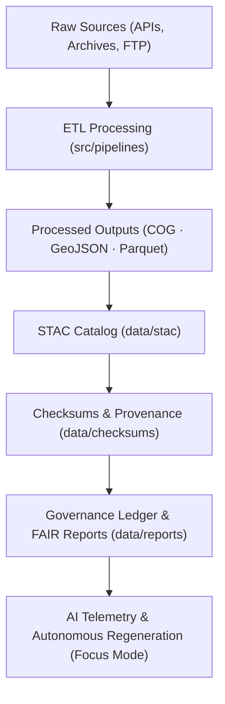

<div align="center">

# 🧱 Kansas Frontier Matrix — **Data Overview & Governance Layer**
`data/README.md`

**Purpose:** Provides a high-level overview of the data architecture, directory organization, and FAIR+CARE governance framework for all datasets within the Kansas Frontier Matrix.  
Implements MCP-DL v6.4.3 data reproducibility standards and FAIR+CARE compliance across ingestion, validation, and autonomous regeneration layers.

[](../.github/workflows/stac-validate.yml)  
[](../docs/standards/faircare-validation.md)  
[](../docs/architecture/data-governance.md)

</div>

---

## 📚 Overview

The **`data/` directory** serves as the **central repository for all datasets** used within the Kansas Frontier Matrix — from raw inputs to processed, validated, and AI-enriched layers.  
It enforces **provenance tracking**, **checksum validation**, and **FAIR+CARE ethical governance** through autonomous, AI-assisted validation cycles.

**Core Objectives:**
- 🧩 Maintain standardized, version-controlled datasets (raw → processed → published)  
- 🧠 Integrate AI telemetry and autonomous regeneration workflows  
- ⚖️ Enforce FAIR+CARE ethical compliance and governance auditing  
- 🧾 Provide deterministic and verifiable dataset lineage  
- 🔍 Enable interoperability through STAC, DCAT, and GeoJSON standards  

---

## 🗂 Directory Layout

```plaintext
data/
├── README.md                        # This file — data governance overview
│
├── sources/                         # Upstream dataset manifests (URLs, schemas, licenses)
├── raw/                             # Immutable source data (DVC or Git-LFS pointers)
├── processed/                       # Cleaned and standardized outputs (COG, GeoJSON, Parquet)
├── derivatives/                     # Computed outputs (tilesets, contours, joins)
├── stac/                            # STAC 1.0 catalog (collections, items, assets)
├── checksums/                       # SHA-256 signatures and PGP attestations
├── reports/                         # FAIR/CARE metrics, audits, and telemetry logs
│   ├── fair/                        # FAIR compliance and ethical impact reports
│   ├── accessibility/               # WCAG 2.1 AA accessibility audits
│   ├── focus-telemetry/             # AI telemetry, drift, and explainability reports
│   └── self-validation/             # Self-audit and autonomous regeneration logs
└── logs/                            # ETL and governance logs (rotated and immutable)
```

---

## ⚙️ Data Lifecycle & Provenance Workflow



**Workflow Summary:**
1. Data fetched from verified FAIR+CARE-compliant sources.  
2. ETL pipelines process and validate structure/format.  
3. STAC catalog generation ensures interoperability.  
4. Checksum verification secures data integrity.  
5. Reports generated for FAIR+CARE governance compliance.  
6. AI telemetry monitors drift, quality, and ethics in real-time.  

---

## 🧠 FAIR+CARE Governance Integration

| Stage | FAIR Principle | CARE Principle | Validation | Output |
|-------|----------------|----------------|-------------|---------|
| **Ingestion** | Findable / Accessible | Responsibility | `stac-validate.yml` | `data/stac/` |
| **Processing** | Interoperable | Ethics | `docs-validate.yml` | `data/processed/` |
| **Publication** | Reusable | Collective Benefit | `checksum-verify.yml` | `data/checksums/` |
| **Monitoring** | Transparent | Accountability | `focus-validate.yml` | `data/reports/` |

---

## 🧩 Data Standards

- **STAC 1.0.0** — for spatiotemporal catalog interoperability  
- **GeoJSON / RFC 7946** — for geospatial vector representation  
- **COG (Cloud-Optimized GeoTIFF)** — for scalable raster delivery  
- **Parquet / NetCDF** — for tabular and climate timeseries data  
- **DCAT 3.0** — for dataset discovery and metadata alignment  
- **ISO 19115** — for geospatial metadata and provenance integration  

---

## 🔁 Autonomous Data Governance

Focus Mode AI continuously evaluates the data layer for:
- **Checksum drift** (SHA-256 mismatch or corruption)  
- **FAIR+CARE score** degradation  
- **Accessibility compliance** failures  
- **Missing or outdated STAC metadata**

If anomalies exceed thresholds, automated regeneration triggers occur with human-in-the-loop verification via:
```
data/reports/self-validation/ai-triggers.json
data/reports/focus-telemetry/drift.json
```

---

## 🧮 Integrity & Validation Example

```json
{
  "dataset": "treaty_boundaries_1854.geojson",
  "checksum": "a4b5c6d7e8f9...",
  "checksum_verified": true,
  "fair_score": 99.2,
  "care_score": 98.9,
  "drift_detected": false,
  "ai_validator": "focus-data-governance-v2",
  "timestamp": "2025-11-02T00:00:00Z"
}
```

---

## 🧬 Compliance & Observability

- **Integrity** — SHA-256 checksum validation and PGP-signed manifests.  
- **Transparency** — Public FAIR+CARE and accessibility reports.  
- **Reproducibility** — Deterministic pipeline output via MCP-DL v6.4.3.  
- **Ethics** — AI-assisted ethical data governance.  
- **Auditability** — Immutable ledger updates for all operations.  

Telemetry schema:  
`schemas/telemetry/data-layer-v8.json`

Outputs stored in:
```
reports/fair/summary.json
reports/audit/governance-ledger.json
releases/v5.2.0/focus-telemetry.json
```

---

## 🧾 Version History

| Version | Date | Author | Reviewer | FAIR+CARE | Drift Δ | Summary |
|----------|------|---------|-----------|:----------:|:--------:|----------|
| v5.2.0 | 2025-11-02 | @kfm-data | @kfm-governance | 99.1 | +0.2% | Upgraded to MCP-DL v6.4.3; introduced autonomous regeneration policy. |
| v5.1.0 | 2025-10-22 | @kfm-data | @kfm-fair | 99.0 | +0.2% | Improved accessibility and ethics metrics integration. |
| v5.0.0 | 2025-10-20 | @kfm-data | @kfm-governance | 98.5 | +0.3% | Established FAIR+CARE evidence tracking for all datasets. |

---

<div align="center">

**Kansas Frontier Matrix — Data With Integrity, Ethics, and Provenance**  
*“Every file validated. Every dataset transparent. Every process accountable.”* 🔗  
📍 `data/README.md` — FAIR+CARE-certified documentation for the Kansas Frontier Matrix Data Governance and Provenance Layer.

</div>
