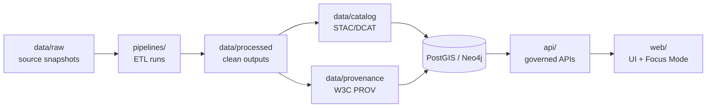

# KFM Data Directory

<kbd>GOVERNED</kbd> <kbd># `data/` — Governed datasets, catalogs, and provenance (KFM)

> [!IMPORTANT]
> **Processed is the only publishable source of truth.**  
> `data/raw/` and `data/work/` are **never** served directly to users—only referenced by lineage/provenance. [oai_citation:2‡KFM_NextGen_Blueprint_and_Primary_Guide_v1_2_EXPANSIVE_TOC.pdf](sediment://file_00000000de5071fd8771d2d96fda3ac2)

This folder is the **governed data substrate** for Kansas Frontier Matrix (KFM): it contains the **Raw → Work → Processed** zones *and* the machine-readable catalogs (**DCAT/STAC/PROV**) and validation artifacts required to promote datasets safely and reproducibly. [oai_citation:3‡KFM_NextGen_Blueprint_and_Primary_Guide_v1_2_EXPANSIVE_TOC.pdf](sediment://file_00000000de5071fd8771d2d96fda3ac2) [oai_citation:4‡KFM_Comprehensive_Data_Source_Integration_Blueprint_v1_massive.pdf](sediment://file_000000000bbc722f8debeb7985ab63ea)

---

## Table of contents

- [Truth path](#truth-path)
- [Directory layout](#directory-layout)
- [Zones and invariants](#zones-and-invariants)
  - [Raw](#raw)
  - [Work](#work)
  - [Processed](#processed)
  - [Catalog (DCAT / STAC / PROV)](#catalog-dcat--stac--prov)
- [ID strategy and naming conventions](#id-strategy-and-naming-conventions)
- [Formats and storage](#formats-and-storage)
- [Policy labels and sensitivity handling](#policy-labels-and-sensitivity-handling)
- [Ingestion workflow](#ingestion-workflow)
- [Validation gates](#validation-gates)
- [Promotion gates (CI-enforced)](#promotion-gates-ci-enforced)
- [What to commit to Git](#what-to-commit-to-git)
- [Examples](#examples)
- [Definition of Done for a dataset integration PR](#definition-of-done-for-a-dataset-integration-pr)
- [References](#references)

---

## Truth path

KFM’s end-to-end “truth path” (from governed raw inputs to public UI + auditable answers) is:

**Raw → Work → Processed → STAC/DCAT/PROV → Stores → API → UI → Stories → Focus Mode** [oai_citation:5‡KFM_NextGen_Blueprint_and_Primary_Guide_v1_2_EXPANSIVE_TOC.pdf](sediment://file_00000000de5071fd8771d2d96fda3ac2)

```mermaid
flowchart LR
  RAW[data/raw] --> WORK[data/work]
  WORK --> PROC[data/processed]
  PROC --> CATS[data/catalog (DCAT/STAC/PROV)]
  CATS --> STORES[Stores\n(PostGIS/Neo4j/Search/ObjectStore)]
  STORES --> API[API Gateway]
  API --> UI[Web UI]
  UI --> STORIES[Stories]
  STORIES --> FOCUS[Focus Mode]
```

> [!NOTE]
> The runtime request path is governed at the **trust membrane** (API + policy boundary). Frontend does not talk to databases directly, and policy evaluation occurs on every request. [oai_citation:6‡KFM_NextGen_Blueprint_and_Primary_Guide_v1_2_EXPANSIVE_TOC.pdf](sediment://file_00000000de5071fd8771d2d96fda3ac2)

---

## Directory layout

> **Design intent:** A human can browse datasets and their provenance; a pipeline can validate, promote, and publish them; CI can fail fast when governance requirements are missing.

```text
data/
  README.md                           # you are here

  raw/                                # immutable source drops + fetch manifests
  work/                               # intermediate artifacts + QA/validation outputs
  processed/                          # publishable artifacts ONLY (served via API)

  catalog/                            # machine-readable catalogs consumed by runtime services
    dcat/                             # dataset-level metadata (DCAT)
    stac/                             # spatial asset catalogs (STAC)
    prov/                             # lineage + transformations (PROV)
    _profiles/                        # KFM profile docs + validator configs (recommended)

  runs/                               # pipeline run records (JSON) + links to validation reports
  reports/                            # validation reports, profiling metrics, drift reports, QA notes

  _templates/                         # dataset skeletons (optional convenience)
  _scratch/                           # local-only scratch (should be gitignored)
```

> [!WARNING]
> Folder names are **contractual**: validators and pipeline tooling should treat these paths as stable interfaces.

---

## Zones and invariants

### Raw

**Purpose:** Immutable “source of record” drops and/or fetch manifests. Raw is referenced by lineage; it is not user-facing. [oai_citation:7‡KFM_NextGen_Blueprint_and_Primary_Guide_v1_2_EXPANSIVE_TOC.pdf](sediment://file_00000000de5071fd8771d2d96fda3ac2)

**Rules:**
- ✅ Raw assets must be **checksummed** and addressable by content hash. [oai_citation:8‡KFM_Comprehensive_Data_Source_Integration_Blueprint_v1_massive.pdf](sediment://file_000000000bbc722f8debeb7985ab63ea)
- ✅ Raw manifests must be **deterministic** (stable ordering; stable checksums). [oai_citation:9‡KFM_Comprehensive_Data_Source_Integration_Blueprint_v1_massive.pdf](sediment://file_000000000bbc722f8debeb7985ab63ea)
- ❌ Do not overwrite raw files in-place; new fetches create new versions (see [ID strategy](#id-strategy-and-naming-conventions)). [oai_citation:10‡KFM_Comprehensive_Data_Source_Integration_Blueprint_v1_massive.pdf](sediment://file_000000000bbc722f8debeb7985ab63ea)

Recommended structure per dataset:
```text
data/raw/<dataset_id>/<dataset_version>/
  manifest.json
  checksums.sha256
  upstream/                # optional: preserved upstream naming/layout
```

### Work

**Purpose:** Regenerable intermediate artifacts used for normalization, QA, and debugging. [oai_citation:11‡KFM_NextGen_Blueprint_and_Primary_Guide_v1_2_EXPANSIVE_TOC.pdf](sediment://file_00000000de5071fd8771d2d96fda3ac2)

**Rules:**
- ✅ May be regenerated; treat as “build output” unless explicitly governed.
- ✅ Store validation reports and QA notes here (or under `data/reports/`) so promotion can be blocked when missing/incomplete. [oai_citation:12‡KFM_NextGen_Blueprint_and_Primary_Guide_v1_2_EXPANSIVE_TOC.pdf](sediment://file_00000000de5071fd8771d2d96fda3ac2)

Recommended structure:
```text
data/work/<dataset_id>/<dataset_version>/
  normalized/               # canonicalized raw → normalized
  validation_report.json
  profiling.json
  notes.md                  # optional: human QA notes (governed if referenced)
```

### Processed

**Purpose:** Publishable artifacts served by the API and rendered in UI/stories. Must include required catalogs + checksums. [oai_citation:13‡KFM_NextGen_Blueprint_and_Primary_Guide_v1_2_EXPANSIVE_TOC.pdf](sediment://file_00000000de5071fd8771d2d96fda3ac2)

**Rules:**
- ✅ Every promoted artifact must have a **PROV chain** and a deterministic checksum. [oai_citation:14‡KFM_Comprehensive_Data_Source_Integration_Blueprint_v1_massive.pdf](sediment://file_000000000bbc722f8debeb7985ab63ea)
- ✅ License + attribution must be captured in DCAT; restrictions encoded in policy. [oai_citation:15‡KFM_Comprehensive_Data_Source_Integration_Blueprint_v1_massive.pdf](sediment://file_000000000bbc722f8debeb7985ab63ea)
- ❌ Do not place ad-hoc files here—**only** artifacts that have passed validation + policy gates.

Recommended structure:
```text
data/processed/<dataset_id>/<dataset_version>/
  data/                      # parquet/geojson/cog/etc (or pointers if external)
  metadata/                  # derived metadata used by runtime
  checksums.sha256
```

### Catalog (DCAT / STAC / PROV)

Catalogs are **machine-readable** and consumed by runtime services. KFM uses:
- **DCAT** for dataset-level metadata (publisher, license, spatial/temporal coverage, update frequency, contacts). [oai_citation:16‡KFM_Comprehensive_Data_Source_Integration_Blueprint_v1_massive.pdf](sediment://file_000000000bbc722f8debeb7985ab63ea)
- **STAC** for geospatial assets (rasters/vectors) for map/timeline rendering (Collection per product; Items per time/area unit). [oai_citation:17‡KFM_Comprehensive_Data_Source_Integration_Blueprint_v1_massive.pdf](sediment://file_000000000bbc722f8debeb7985ab63ea)
- **PROV** for transformation lineage (inputs → activity → outputs). [oai_citation:18‡KFM_Comprehensive_Data_Source_Integration_Blueprint_v1_massive.pdf](sediment://file_000000000bbc722f8debeb7985ab63ea)

Recommended structure:
```text
data/catalog/dcat/<dataset_id>/<dataset_version>.jsonld
data/catalog/stac/<dataset_id>/collection.json
data/catalog/stac/<dataset_id>/items/<item_id>.json
data/catalog/prov/<dataset_id>/<dataset_version>/run_<run_id>.json
```

---

## ID strategy and naming conventions

KFM’s identifier rules emphasize determinism + stability:
- Dataset IDs are **stable** (publisher + product + scope).
- DatasetVersion IDs are **content-addressed** (hash of raw manifest + metadata).
- User-visible evidence citations reference **DatasetVersion + source_record_id(s)**.
- Every transformation produces **new identifiers**; never overwrite prior versions. [oai_citation:19‡KFM_Comprehensive_Data_Source_Integration_Blueprint_v1_massive.pdf](sediment://file_000000000bbc722f8debeb7985ab63ea)

### Naming rules (recommended)

| Concept | Field | Rule | Example |
|---|---|---|---|
| Dataset | `dataset_id` | `kebab-case`, stable | `kansas-mesonet-stations` |
| Version | `dataset_version` | content-addressed (hash) or `vYYYYMMDD...` derived from manifest hash | `sha256_4b1d...` |
| Source record | `source_record_id` | stable per upstream semantics | `nwis:site:06891000` |
| Run | `run_id` | timestamp + dataset + commit/image (implementation choice) | `run_2026-02-12T120000Z__...` |

> [!NOTE]
> Time model: use ISO-8601 timestamps with explicit time zones (or UTC); represent uncertain time as `[start,end]` intervals; for historical sources store publication date and event date claim separately (each with its provenance). [oai_citation:20‡KFM_Comprehensive_Data_Source_Integration_Blueprint_v1_massive.pdf](sediment://file_000000000bbc722f8debeb7985ab63ea)

---

## Formats and storage

Recommended format targets for ingested sources include:
- JSON/CSV for tabular
- GeoJSON/Parquet for vectors
- COG for rasters
- PDF/JPEG/PNG for media artifacts [oai_citation:21‡KFM_Comprehensive_Data_Source_Integration_Blueprint_v1_massive.pdf](sediment://file_000000000bbc722f8debeb7985ab63ea)

> [!NOTE]
> For extremely large datasets, store **metadata + pointers** when mirroring is impractical, and cache derived tiles for map preview (where allowed). [oai_citation:22‡KFM_Comprehensive_Data_Source_Integration_Blueprint_v1_massive.pdf](sediment://file_000000000bbc722f8debeb7985ab63ea)

---

## Policy labels and sensitivity handling

KFM sensitivity is handled by:
1) policy labels at dataset/record/field level,  
2) derivative datasets with explicit redaction provenance, and  
3) fail-closed policy checks. [oai_citation:23‡KFM_Comprehensive_Data_Source_Integration_Blueprint_v1_massive.pdf](sediment://file_000000000bbc722f8debeb7985ab63ea)

### Policy labels (minimum)

The integration blueprint uses (at least) `public | restricted | sensitive-location` as a config-level policy label. [oai_citation:24‡KFM_Comprehensive_Data_Source_Integration_Blueprint_v1_massive.pdf](sediment://file_000000000bbc722f8debeb7985ab63ea)

It also recommends sensitivity classes including:
- **Public** (safe to publish)
- **Restricted** (role-based access)
- **Sensitive-location** (coordinates generalized/suppressed)
- **Aggregate-only** (publish only above thresholds) [oai_citation:25‡KFM_Comprehensive_Data_Source_Integration_Blueprint_v1_massive.pdf](sediment://file_000000000bbc722f8debeb7985ab63ea)

> [!IMPORTANT]
> **Redaction is a first-class transformation** recorded in PROV. Raw remains immutable; the redacted derivative is a separate DatasetVersion (often separate dataset_id) with a documented policy label. [oai_citation:26‡KFM_Comprehensive_Data_Source_Integration_Blueprint_v1_massive.pdf](sediment://file_000000000bbc722f8debeb7985ab63ea)

---

## Ingestion workflow

KFM ingestion is connector-driven and follows:
**discover → acquire → normalize → validate → enrich → publish** [oai_citation:27‡KFM_Comprehensive_Data_Source_Integration_Blueprint_v1_massive.pdf](sediment://file_000000000bbc722f8debeb7985ab63ea)

```mermaid
flowchart TD
  D[Discover] --> A[Acquire]
  A --> N[Normalize]
  N --> V[Validate]
  V --> E[Enrich]
  E --> P[Publish]
  P --> C[Update DCAT/STAC/PROV]
  C --> R[Trigger index refresh\n(search/graph)]
```

Key expectations:
- Normalize to canonical encodings (UTF-8), geometry (WGS84), and time (ISO 8601). [oai_citation:28‡KFM_Comprehensive_Data_Source_Integration_Blueprint_v1_massive.pdf](sediment://file_000000000bbc722f8debeb7985ab63ea)
- Publish promotes to Processed, updates catalogs (DCAT/STAC/PROV), triggers index refresh. [oai_citation:29‡KFM_Comprehensive_Data_Source_Integration_Blueprint_v1_massive.pdf](sediment://file_000000000bbc722f8debeb7985ab63ea)

---

## Validation gates

Minimum validation gates include:
- Row-level schema validation (required fields; coercion rules documented)
- Geometry validity + bounds
- Temporal consistency (no future dates for historic archives; no negative durations)
- License + attribution captured in DCAT; restrictions encoded in policy
- Provenance completeness: promoted artifact has PROV chain + deterministic checksum [oai_citation:30‡KFM_Comprehensive_Data_Source_Integration_Blueprint_v1_massive.pdf](sediment://file_000000000bbc722f8debeb7985ab63ea)

---

## Promotion gates (CI-enforced)

Promotion gates are CI-enforced checks that must be satisfied before anything is considered publishable.

From the integration blueprint (catalog + promotion requirements):
- All raw assets checksummed and addressable by content hash
- Schema validation passes; QA report stored with stable ID
- Policy labels attached
- Catalog writers succeed (DCAT/STAC/PROV well-formed and link-check clean)
- Contract tests for dependent API queries pass [oai_citation:31‡KFM_Comprehensive_Data_Source_Integration_Blueprint_v1_massive.pdf](sediment://file_000000000bbc722f8debeb7985ab63ea)

From the Next-Gen blueprint (promotion checklist summary):
- license present
- sensitivity classification present
- schema/geospatial checks pass
- checksums computed
- STAC/DCAT/PROV artifacts exist and validate
- audit event recorded
- human approval if sensitive [oai_citation:32‡KFM_NextGen_Blueprint_and_Primary_Guide_v1_2_EXPANSIVE_TOC.pdf](sediment://file_00000000de5071fd8771d2d96fda3ac2) [oai_citation:33‡KFM_NextGen_Blueprint_and_Primary_Guide_v1_2_EXPANSIVE_TOC.pdf](sediment://file_00000000de5071fd8771d2d96fda3ac2)

---

## What to commit to Git

> [!WARNING]
> **Secrets are never committed.** If upstream requires keys, store them in vault/secret manager, not in this repo. [oai_citation:34‡KFM_Comprehensive_Data_Source_Integration_Blueprint_v1_massive.pdf](sediment://file_000000000bbc722f8debeb7985ab63ea)

Recommended Git policy (practical + governance-friendly):
- ✅ Commit: manifests, checksums, catalogs (DCAT/STAC/PROV), run records, validation reports, small sample slices (if policy allows).
- ❌ Do not commit: large binaries and bulk raw drops unless explicitly approved (prefer object store + pointers). [oai_citation:35‡KFM_Comprehensive_Data_Source_Integration_Blueprint_v1_massive.pdf](sediment://file_000000000bbc722f8debeb7985ab63ea)

---

## Examples

### Example: pipeline run record (illustrative)

```json
{
  "run_id": "run_2026-02-12T120000Z__example__v1",
  "dataset_id": "example_dataset",
  "inputs": [{"uri":"data/raw/example_dataset/sha256_.../manifest.json","sha256":"..."}],
  "code": {"git_sha":"...","image":"kfm/pipeline:..."},
  "outputs": [{"uri":"data/processed/example_dataset/sha256_.../data/example.parquet","sha256":"..."}],
  "validation_report": "data/reports/example_dataset/sha256_.../validation_report.json",
  "prov_ref": "data/catalog/prov/example_dataset/sha256_.../run_run_2026-02-12T120000Z__example__v1.json"
}
```

### Example: catalog expectations (at a glance)

| Standard | What it covers | Where it lives |
|---|---|---|
| DCAT | Dataset-level metadata | `data/catalog/dcat/` |
| STAC | Spatial assets (rasters/vectors) | `data/catalog/stac/` |
| PROV | Lineage (inputs → activity → outputs) | `data/catalog/prov/` |

---

## Definition of Done for a dataset integration PR

Use this checklist as a PR gate for adding/updating a dataset integration:

- [ ] Connector implemented + registered in the data-source registry config [oai_citation:36‡KFM_Comprehensive_Data_Source_Integration_Blueprint_v1_massive.pdf](sediment://file_000000000bbc722f8debeb7985ab63ea)
- [ ] Raw acquisition produces deterministic manifest + checksums [oai_citation:37‡KFM_Comprehensive_Data_Source_Integration_Blueprint_v1_massive.pdf](sediment://file_000000000bbc722f8debeb7985ab63ea)
- [ ] Normalization emits canonical schema and/or STAC assets [oai_citation:38‡KFM_Comprehensive_Data_Source_Integration_Blueprint_v1_massive.pdf](sediment://file_000000000bbc722f8debeb7985ab63ea)
- [ ] Validation gates implemented and enforced in CI [oai_citation:39‡KFM_Comprehensive_Data_Source_Integration_Blueprint_v1_massive.pdf](sediment://file_000000000bbc722f8debeb7985ab63ea)
- [ ] Policy labels defined; restricted fields/locations are redacted per rules [oai_citation:40‡KFM_Comprehensive_Data_Source_Integration_Blueprint_v1_massive.pdf](sediment://file_000000000bbc722f8debeb7985ab63ea)
- [ ] Catalogs emitted (**DCAT always; STAC/PROV as applicable**) and link-check clean [oai_citation:41‡KFM_Comprehensive_Data_Source_Integration_Blueprint_v1_massive.pdf](sediment://file_000000000bbc722f8debeb7985ab63ea)
- [ ] API contract tests pass for at least one representative query [oai_citation:42‡KFM_Comprehensive_Data_Source_Integration_Blueprint_v1_massive.pdf](sediment://file_000000000bbc722f8debeb7985ab63ea)

---

## References

- KFM Next-Generation Blueprint (2026-02-12): repo layout, trust membrane, truth path, data zones/invariants. [oai_citation:43‡KFM_NextGen_Blueprint_and_Primary_Guide_v1_2_EXPANSIVE_TOC.pdf](sediment://file_00000000de5071fd8771d2d96fda3ac2) [oai_citation:44‡KFM_NextGen_Blueprint_and_Primary_Guide_v1_2_EXPANSIVE_TOC.pdf](sediment://file_00000000de5071fd8771d2d96fda3ac2)
- KFM Data Source Integration Blueprint (v1.0, 2026-02-12): ingestion workflow, validation gates, catalog standards, sensitivity + redaction, deterministic IDs. [oai_citation:45‡KFM_Comprehensive_Data_Source_Integration_Blueprint_v1_massive.pdf](sediment://file_000000000bbc722f8debeb7985ab63ea) [oai_citation:46‡KFM_Comprehensive_Data_Source_Integration_Blueprint_v1_massive.pdf](sediment://file_000000000bbc722f8debeb7985ab63ea)-FIRST</kbd> <kbd>STAC · DCAT</kbd> <kbd>W3C PROV</kbd> <kbd>FAIR + CARE</kbd> <kbd>SAFE BY DEFAULT</kbd>

This `data/` directory is the governed home for **KFM datasets** *and* the **machine-readable metadata + provenance** that make those datasets usable, reviewable, and safe to publish.

> [!IMPORTANT]
> **Canonical pipeline order (no shortcuts):** Raw → Processed → Catalog + Provenance → Database/Graph → API → UI/Focus Mode.  
> Directly injecting data into the UI or bypassing metadata/provenance is considered a broken contribution pattern.

---

## Contents

- [Scope](#scope)
- [Directory layout](#directory-layout)
- [Canonical data lifecycle](#canonical-data-lifecycle)
- [Dataset bundle contract](#dataset-bundle-contract)
- [Add or update a dataset](#add-or-update-a-dataset)
- [Metadata and catalog](#metadata-and-catalog)
- [Provenance](#provenance)
- [Licensing and usage constraints](#licensing-and-usage-constraints)
- [Sensitivity and CARE](#sensitivity-and-care)
- [Validation and CI expectations](#validation-and-ci-expectations)
- [Templates and examples](#templates-and-examples)
- [References](#references)
- [Version history](#version-history)

---

## Scope

| In scope | Out of scope |
|---|---|
| Governed storage for **raw snapshots**, **processed outputs**, and **STAC/DCAT/PROV** artifacts | Detailed ETL implementation docs (see pipeline code/docs) |
| Rules for adding/updating datasets without breaking governance | Legal advice (licenses are summarized, not interpreted) |
| CI/validation expectations for data contributions | Runtime database operations (handled by deploy/runtime tooling) |

---

## Directory layout

The **canonical** layout (as designed in KFM architecture docs) is:

```text
data/
  raw/            # Immutable raw data snapshots (exact copies of sources)
  processed/      # Cleaned/standardized outputs ready for KFM use
  catalog/        # Catalog metadata (STAC Items/Collections, DCAT dataset records)
  provenance/     # W3C PROV lineage documents (what ran, when, using what, producing what)
```

> [!NOTE]
> Some documents mention alternative legacy or expanded subfolders (e.g., `work/`, `stac/`, `prov/`).  
> Treat the four folders above as the **contract** unless the repo’s current structure explicitly differs.

---

## Canonical data lifecycle



> [!IMPORTANT]
> **Trust membrane rule:** The UI must never access databases directly; all access goes through the governed API layer.

---

## Dataset bundle contract

A dataset is “real” in KFM only when it is bundled with its metadata and provenance.

### Required artifacts

| Artifact | Purpose | Expected location |
|---|---|---|
| Raw snapshot **or** governed pointer | Reproducibility; evidence that processing is grounded | `data/raw/<domain>/...` *(or pointer/manifest if raw can’t be redistributed)* |
| Processed output(s) | What the platform actually uses (clean, standardized) | `data/processed/<domain>/...` |
| STAC Item/Collection | Spatial/temporal extent + dataset description + license/attribution | `data/catalog/...` |
| (Optional) DCAT record | Catalog interoperability / data portal publishing | `data/catalog/...` |
| W3C PROV lineage doc | Audit trail: inputs → activity → outputs (+who/when/how) | `data/provenance/...` |
| Pipeline code reference | Re-run capability and reviewability | `pipelines/...` *(exact path may vary)* |

> [!WARNING]
> **No data enters KFM without documentation.** If you add a file under `data/processed/`, you should assume CI will require corresponding catalog + provenance artifacts.

---

## Add or update a dataset

### Definition of Done checklist

- [ ] Raw snapshot is present **or** a governed retrieval pointer exists (license-aware)
- [ ] Processed output(s) written under `data/processed/`
- [ ] Catalog metadata created/updated under `data/catalog/` (STAC; DCAT if applicable)
- [ ] Provenance created/updated under `data/provenance/` (W3C PROV lineage)
- [ ] License and attribution are explicit in metadata
- [ ] Validation passes locally (format + schema + links where applicable)
- [ ] PR opened with a clear change summary and dataset IDs referenced

### Step-by-step workflow

1. **Acquire source data (raw)**
   - Store the *exact* snapshot in `data/raw/` when allowed.
   - If the source **cannot** be redistributed, store a **pointer/manifest** (see [Licensing and usage constraints](#licensing-and-usage-constraints)).

2. **Run the pipeline**
   - Use the appropriate ETL under `pipelines/` to:
     - parse/clean/normalize
     - convert CRS if needed
     - standardize schema and units

3. **Write outputs to `data/processed/`**
   - Prefer well-defined, reviewable formats (examples used in design docs include GeoJSON for vector and Parquet for tabular time-series).
   - Keep processed outputs *ready-to-use* by the platform (correct columns, valid geometries, correct spatial reference).

4. **Update metadata + provenance (hard requirement)**
   - Create/update STAC (and DCAT if used) under `data/catalog/`.
   - Create/update PROV lineage under `data/provenance/` that references:
     - which raw files (or pointers) were used
     - which script version ran (Git commit/hash if available)
     - when it ran
     - what outputs were produced

5. **Commit + PR**
   - Stage changes, commit, open a PR.
   - Expect CI to check:
     - every new `data/processed/` file has matching catalog + provenance artifacts
     - basic format validity (e.g., GeoJSON validity checks)
     - governance failures (e.g., missing license) fail closed

### Updating an existing dataset

Treat updates as the same lifecycle:
- add new raw snapshot (or pointer)
- re-run pipeline
- update processed output
- create a new PROV “version” record (new run) so the audit trail shows what changed and when

---

## Metadata and catalog

### What belongs in `data/catalog/`

- **STAC Item** for a single dataset asset
- **STAC Collection + Items** for multi-date or multi-part datasets
- **DCAT dataset record** (optional but recommended when publishing a catalog externally)

> [!NOTE]
> Some repos keep a “catalog index” listing all datasets. With STAC, this may be optional because STAC can be crawled.

### Metadata fields

Use a table like this inside your STAC/DCAT record (or in a small sidecar README if needed).

| Field | Required | What it means | Example |
|---|---:|---|---|
| `dataset_id` | Yes | Canonical KFM identifier | `ks-population-1900` |
| `title` | Yes | Human-readable dataset name | `Kansas Population 1900` |
| `description` | Yes | What this dataset is and why it exists | Short paragraph |
| `spatial_extent` | Yes | Bounding box / geometry coverage | Kansas bbox |
| `temporal_extent` | If applicable | Start/end dates | `1900-01-01` → `1900-12-31` |
| `source_ref` | Yes | Provenance pointer to source evidence (URN/path/hash) | `data/raw/...` or manifest reference |
| `license` | Yes | License/terms label + link/identifier where possible | SPDX-like or source terms |
| `attribution` | Yes | Required attribution text | e.g., “Cornell Lab of Ornithology (eBird)” |
| `sensitivity` | Yes | Handling label for governance | `Public` / `Restricted` *(labels may be project-defined)* |
| `provenance_ref` | Yes | Link to PROV doc for this dataset version | `data/provenance/...` |
| `schema_version` | Recommended | Version of your KFM STAC/DCAT profile | e.g., `KFM-STAC v11.0.0` *(if used in repo)* |

> [!IMPORTANT]
> If something is unknown or not yet verified in the repo, mark it explicitly as *“(not confirmed in repo)”* instead of guessing.

---

## Provenance

### What belongs in `data/provenance/`

Provenance artifacts should be **machine-readable** and describe lineage at **run granularity**.

A PROV document should cover:
- **Entities**: raw inputs, processed outputs
- **Activity**: the pipeline run that transformed inputs → outputs
- **Agent**: who/what executed the run (pipeline, contributor, automation)

### Provenance content checklist

- [ ] Inputs listed (including retrieval pointers if raw is external)
- [ ] Outputs listed (paths under `data/processed/`)
- [ ] Pipeline/script identifier recorded (prefer Git SHA or content hash)
- [ ] Run timestamp recorded
- [ ] Checksums recorded for key artifacts *(recommended)*
- [ ] License + sensitivity carried through *(recommended)*

> [!NOTE]
> Provenance is not only for internal audit—KFM UI patterns expect to show dataset attribution and lineage in provenance panels and audit views.

---

## Licensing and usage constraints

> [!WARNING]
> This section is **not legal advice**. It’s a contributor-friendly reminder that KFM treats licensing as a first-class governance constraint.

### Practical rules

1. **Always record license/terms in metadata.**
2. If the source **cannot be redistributed**, do **not** commit raw data:
   - store a pointer/manifest (what to fetch, where, and under what terms)
   - store only derived outputs if permitted
3. When in doubt, **fail closed** and request governance review.

### Examples from “KFM Data for Kansas” planning

| Source | Common constraint | Practical handling in KFM |
|---|---|---|
| eBird | Registration + data use agreement; raw redistribution restrictions | Keep raw external; store pointer/manifest; publish only allowed derivatives + required attribution |
| Kansas GAP (USGS) | Public domain | Raw and processed may be storable; still cite source |
| NOAA climate archives | Open/public domain (commonly), attribution recommended | Store raw where permitted; cite; keep processing transparent |
| Kansas Mesonet | Access may require request/terms | Treat as restricted until verified; use pointer/manifest |
| Kansas Oral History Project | CC BY-NC-ND | Avoid derivatives unless terms allow; store with required attribution; consider access controls |

---

## Sensitivity and CARE

KFM is committed to **FAIR + CARE** and a **safe-by-default** posture.

### Redaction and governance triggers

> [!IMPORTANT]
> Protect culturally sensitive information:
> - redact precise locations of sacred/vulnerable sites
> - flag datasets/docs requiring special review in the Governance section

Common review triggers (non-exhaustive):
- Indigenous-related cultural content
- precise site locations that could enable harm
- personal data that is not explicitly cleared for publication
- new licenses or unclear redistribution terms

---

## Validation and CI expectations

KFM documentation and data contributions are expected to pass automated checks.

### What CI is expected to enforce

| Category | Typical checks |
|---|---|
| Data contract checks | Every new file in `data/processed/` has corresponding PROV (and catalog) artifacts |
| Schema validation | STAC, DCAT v3, PROV-O structural checks |
| Doc hygiene | Markdown linting, template/structure checks where applicable |
| Link + image checks | Internal links resolve; no hot-linked external images |
| Sensitivity scanning | Flags missing citations or sensitive content patterns needing redaction/review |
| Accessibility | Alt text, heading hierarchy, table headers |

### Local workflow tips

- Run pre-commit checks (if configured)
- Validate STAC/DCAT/PROV with the project’s validators
- Preview Markdown rendering before PR
- Update version history for non-trivial changes

---

## Templates and examples

<details>
<summary>STAC Item skeleton (illustrative)</summary>

```json
{
  "type": "Feature",
  "stac_version": "1.0.0",
  "id": "ks-example-dataset-1900",
  "properties": {
    "title": "Example Dataset Title",
    "description": "What this dataset is, provenance context, and constraints.",
    "start_datetime": "1900-01-01T00:00:00Z",
    "end_datetime": "1900-12-31T23:59:59Z",
    "license": "TBD",
    "sensitivity": "Public"
  },
  "bbox": [-102.051, 36.993, -94.588, 40.003],
  "geometry": null,
  "links": [],
  "assets": {}
}
```

> Replace with the repo’s actual STAC profile requirements and validate in CI.
</details>

<details>
<summary>PROV run record checklist (illustrative)</summary>

- Entity: `data/raw/...` (or retrieval pointer)
- Entity: `data/processed/...`
- Activity: pipeline run (include parameters/config hash if relevant)
- Agent: CI runner / contributor / pipeline identity
- `used`: raw → activity
- `wasGeneratedBy`: processed → activity
- Timestamp + script hash/Git SHA
</details>

---

## References

These documents informed this directory contract and workflow:

- Kansas Frontier Matrix (KFM) – Comprehensive Technical Blueprint (PDF) [^blueprint]
- Kansas Frontier Matrix (KFM) Comprehensive Guide (PDF) [^compguide]
- Kansas Frontier Matrix engineering and documentation advancement report (PDF) [^engreport]
- KFM Markdown Guide (PDF) [^mdguide]
- KFM-Data for Kansas (PDF) [^datasources]
- Kansas Frontier Matrix (KFM) – Unified Technical Blueprint (PDF) [^unified]

[^blueprint]: KFM design doc describing the canonical pipeline order, repo layout, and data folder contract. *(Repo path not confirmed here.)*
[^compguide]: KFM guide describing CI expectations for data bundles and architectural “no shortcuts” constraints. *(Repo path not confirmed here.)*
[^engreport]: KFM engineering report recommending deterministic pipelines + STAC/DCAT/PROV validators and provenance panels. *(Repo path not confirmed here.)*
[^mdguide]: KFM Markdown governance guide describing citation requirements, validation checks, and sensitivity posture. *(Repo path not confirmed here.)*
[^datasources]: KFM “Data for Kansas” source inventory and licensing/constraints notes. *(Repo path not confirmed here.)*
[^unified]: Unified blueprint emphasizing open standards (OGC, STAC, DCAT) and interoperability goals. *(Repo path not confirmed here.)*

---

## Version history

| Version | Date | Summary of changes | Author |
|---|---|---|---|
| v1.0.0 | 2026-02-11 | Initial governed `data/` directory contract + contribution workflow | AI-assisted draft |