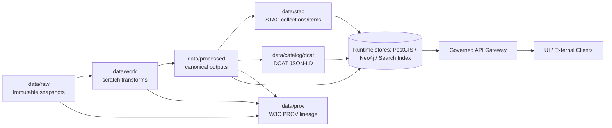

# data/ — KFM Governed Data Layer 🧭🗺️


-lightgrey)


> [!IMPORTANT]
> KFM treats the repository itself as a **versioned data lake**: code, data, and docs evolve in lockstep.
> Every dataset change must preserve **lineage**, satisfy **metadata + provenance** requirements, and pass
> **policy/quality validation** before it is eligible to power APIs/UI.

---

## What lives in `data/`

This folder holds:

- **Raw immutable snapshots** (never edited in place).
- **Processed, analysis-ready outputs** (reproducible from raw).
- **Machine-readable metadata** (STAC + DCAT) and **provenance** (W3C PROV).
- (Optionally) intermediate “scratch” outputs used during transformation.

> [!NOTE]
> Runtime databases/search/graph stores are *derived accelerators*, not the canonical source of truth.
> Canonical artifacts live here in `data/` alongside their metadata + provenance.

---

## Non-negotiables ✅

- **Raw is immutable**: if upstream changes, ingest a *new* raw version; don’t overwrite.
- **Processed is reproducible**: rerunning the same pipeline on the same raw inputs should produce identical outputs.
- **No data enters without context**: every raw dataset requires a manifest; processed datasets require STAC/DCAT/PROV.
- **Governance is enforced in CI**: validation + policy checks are “fail closed” (PRs must pass before merge).
- **Sensitivity is real**: sensitive/culturally restricted location detail must be generalized/redacted and flagged for review.

---

## Directory layout 📁

> This layout is the **canonical intent** described by KFM implementation + governance docs.
> If your repo differs, align to this structure or document the deviation in this README.

```text
data/
  raw/                    # immutable source snapshots + per-dataset manifest(s)
  work/                   # intermediate scratch outputs (often transient / gitignored)
  processed/              # canonical, standardized, analysis-ready outputs (reproducible)
  stac/
    collections/          # STAC Collections (dataset-level metadata)
    items/                # STAC Items (asset-level metadata)
  catalog/
    dcat/                 # DCAT JSON-LD (dataset/distribution discovery)
  prov/                   # provenance bundles (W3C PROV; may be named "provenance/" in some specs)
```

---

## The “Truth Path” (raw → processed → catalog → provenance)



---

## Required artifacts per dataset

| Artifact | Lives in | Purpose | Gate? |
|---|---|---:|:---:|
| Raw file(s) | `data/raw/...` | Immutable evidence of what was ingested | ✅ |
| Raw manifest | `data/raw/.../manifest.(yml|json)` | Source URL/origin, acquisition timestamp, checksums, license, format | ✅ |
| Processed output(s) | `data/processed/...` | Standardized analysis-ready outputs | ✅ |
| STAC | `data/stac/...` | Asset + collection metadata with links to processed assets | ✅ |
| DCAT (JSON-LD) | `data/catalog/dcat/...` | Catalog/discovery + distribution metadata | ✅ |
| PROV | `data/prov/...` | Lineage record: raw → work → processed (+ agents/activities) | ✅ |

> [!TIP]
> Keep identifiers stable. Metadata should **link to the actual files** in `data/processed/` and provenance
> should describe transformations that produced those outputs.

---

## Adding or updating a dataset (contributor workflow)

### 1) Ingest raw (immutable)
- Place upstream snapshot(s) under `data/raw/…`
- Include a timestamp or version identifier in naming (or directory path) to preserve lineage.
- Add a manifest next to the raw snapshot(s).

### 2) Transform (work → processed)
- Use `data/work/` for intermediate artifacts (large, transient, experimental).
- Emit the canonical result to `data/processed/`.

### 3) Generate metadata + provenance
- Create/Update:
  - STAC Collection/Items under `data/stac/`
  - DCAT JSON-LD under `data/catalog/dcat/`
  - PROV bundle under `data/prov/`

### 4) Pass gates (CI will enforce)
- Schema validation (manifests + metadata)
- Data quality checks (domain-specific)
- Policy checks (OPA/Rego; includes sensitivity handling)
- License/source presence (show-stopper if missing)

### Definition of Done (PR checklist)
- [ ] Raw snapshot added (no destructive overwrite)
- [ ] Raw manifest added and validates
- [ ] Processed outputs added (reproducible, standardized)
- [ ] STAC updated (assets resolve to processed files)
- [ ] DCAT updated (license + source present)
- [ ] PROV updated (lineage complete raw→work→processed)
- [ ] Sensitivity assessed + tagged (and escalated if needed)
- [ ] CI is green

---

## Raw manifest: minimum fields (template)

> [!NOTE]
> Field names may evolve; CI enforces the exact schema. This template captures the **minimum intent**:
> source/origin, acquisition time, checksums, license, and format.

```yaml
dataset:
  name: "<human-friendly name>"
  id: "<stable-id>"
source:
  origin: "<source organization / archive name>"
  url: "<source URL or reference>"
  acquired_at: "YYYY-MM-DDTHH:MM:SSZ"
files:
  - path: "<relative path to raw file>"
    checksum:
      algo: "sha256"
      value: "<hex>"
    format: "<csv|geojson|tif|...>"
license:
  spdx: "<SPDX id or 'custom'>"
  text: "<short license note or pointer>"
governance:
  sensitivity: ["public"]   # e.g., public | internal | restricted | indigenous (example)
  notes: "<any access constraints, contact, etc.>"
```

---

## Governance & sensitivity (FAIR + CARE)

KFM’s data layer is governed, not just “stored”:

- **FAIR**: data must be findable/discoverable with metadata, accessible via governed APIs, interoperable via standard formats, and reusable via clear licensing.
- **CARE**: for culturally sensitive knowledge, respect authority to control, responsibility, ethics, and collective benefit.

> [!WARNING]
> If a dataset is tagged with high sensitivity (example: `indigenous`), it must be treated as **restricted**:
> - **do not publish precise locations**
> - **require governance review/approval**
> - CI/policy should block promotion until approved

Additionally, metadata may support access-control semantics such as:
- `accessLevel` (public/internal/restricted)
- `ownerGroup`
- `status` (e.g., active/withdrawn)

---

## Validation gates (what CI/policy should be checking)

Common gate categories:

1. **Manifest completeness**
   - source/origin present
   - license present
   - checksums present
2. **Metadata validity**
   - STAC + DCAT are syntactically valid
   - STAC assets point to `data/processed` files that exist
3. **Provenance completeness**
   - PROV contains: Entities (raw/processed), Activities (transform), Agents (pipeline/operator)
4. **Content & sensitivity policy**
   - detect/deny sensitive location disclosures where prohibited
   - detect personal identifiers where disallowed
5. **Security hygiene**
   - no secrets committed
   - dependency/tooling risks managed (where applicable)

---

## Large or non-repo-friendly assets 🧱

Some datasets (e.g., large rasters) can exceed practical Git limits.

Recommended approaches:
- Git LFS for large binaries **when appropriate**
- Pointer files / checksum references to external object storage (data lake)
- Keep provenance + metadata in-repo even if payload is external

> [!IMPORTANT]
> Even when payload is stored externally, KFM still requires:
> manifest + metadata + provenance in-repo so lineage and governance remain auditable.

---

## Security considerations (data is production software)

- Apply **least privilege** and **defense in depth** to ingestion tooling and storage.
- Treat pipeline configuration as code; require review for changes.
- Protect against **supply-chain risks** (malicious dependencies / pipeline compromise).
- Avoid cloud/storage **misconfigurations**; enable logging/monitoring for auditability.

---

## Related governed specs (design sources)

These documents define the “why” behind the rules above:

- `MARKDOWN_GUIDE_v13.md` (governance + artifact conventions; STAC/DCAT/PROV alignment)
- `Kansas Frontier Matrix (KFM) System Implementation Guide`
- `Kansas Frontier Matrix (KFM) System Implementation Blueprint & Capabilities Guide`
- `Kansas Frontier Matrix (KFM) – Comprehensive Technical Blueprint`
- `Software Security Guide for Developers (2026 Edition)` (security foundations & DevSecOps)