```mermaid
flowchart LR
  REG["Registry (dataset profiles)"] --> RAW["Raw (manifest + checksums)"]
  RAW --> WORK["Work (run record + validation + receipt)"]
  WORK -->|Promotion Contract| PROC["Processed (immutable versioned artifacts)"]
  PROC --> CATS["Catalogs (DCAT + STAC + PROV)"]
  CATS --> BNDL["Evidence bundle (digest-addressed)"]
  BNDL --> STORES["Derived stores (PostGIS / Graph / Search / Object store)"]
  STORES --> API["Governed API (policy + redaction + audit)"]
  API --> UI["Web UI / Story Nodes / Focus Mode"]
```

<!--
KFM Governed Artifact
File: data/README.md
If you change meaning (not just phrasing), route through governance review (CODEOWNERS + CI gates).
-->

# 🧾 `data/` — KFM Governed Data Plane  
## Zones • Registry • Catalogs • Evidence Bundles • Provenance • Promotion Gates


> [!IMPORTANT]
> `data/` is a **governed system boundary**. Changing anything under `data/` can change:
>
> - what the governed API is allowed to serve,
> - what Story Nodes are allowed to publish,
> - what Focus Mode is allowed to answer,
> - and what auditors can verify end-to-end.
>
> **Rule of thumb:** if you can’t point to **processed artifacts + checksums + catalogs + lineage**, it is **not servable**.

---

## Governance Header

| Field | Value |
|---|---|
| Document | `data/README.md` |
| Status | **Governed** |
| Scope | Data zones, registry, promotion gates, catalogs, evidence addressing, provenance, sensitivity controls |
| Version | `v2.0.0` *(contract target; update via governance review)* |
| Effective date | `2026-02-16` |
| Owners | `.github/CODEOWNERS` *(required; if missing → governance gap)* |
| Change control | **Fail closed**: missing required proofs → deny promotion / deny serving |
| Review triggers | Anything affecting promotion rules, receipt schemas, catalog minimums, sensitivity classes, redaction rules, evidence addressing |

> [!WARNING]
> **Fail-closed rule:** if any required enforcement surface is missing (policy, receipts, catalogs, checksums, lineage), promotion/serve must **deny** by default.

---

## What This README Is

This file is **not** a “nice-to-have README.” It is the contract for how KFM’s data plane works.

- It defines which artifacts are considered **servable truth**.
- It defines what “publishable” means via a **Promotion Contract**.
- It defines how provenance must be emitted so every claim can be **cited and audited**.
- It defines what must happen in CI so the system cannot silently drift.

If this README disagrees with implementation, treat it as a **governance incident** and resolve via ADR + CI gates.

---

## Table of Contents

- [Non-Negotiables](#non-negotiables)
- [Core Concepts](#core-concepts)
- [Directory Layout](#directory-layout)
- [Truth Path](#truth-path)
- [Registry](#registry)
- [Data Zones](#data-zones)
- [Promotion Contract](#promotion-contract)
- [Deterministic Identity](#deterministic-identity)
- [Catalog Layer](#catalog-layer)
- [Evidence Bundles](#evidence-bundles)
- [Audit & Evidence Resolution](#audit--evidence-resolution)
- [Sensitivity, CARE/FAIR, and Redaction](#sensitivity-carefair-and-redaction)
- [Connectors, Watchers, and Backfills](#connectors-watchers-and-backfills)
- [Formats and Normalization Standards](#formats-and-normalization-standards)
- [CI Gates](#ci-gates)
- [Operations & Monitoring](#operations--monitoring)
- [Appendix: Templates](#appendix-templates)
- [Governance Review Triggers](#governance-review-triggers)
- [Glossary](#glossary)

---

## Non-Negotiables

These are **system invariants**. If any are violated, the system is not “KFM” anymore.

1) **Trust Membrane**
   - Frontend and external clients **never** read data directly from databases/object storage.
   - All access goes through the **governed API + policy boundary + audit logging**.

2) **Fail-Closed Policy**
   - Authorization is **default deny**.
   - If policy cannot prove allow, deny.
   - If evidence is missing or ambiguous, **abstain** rather than “best guess.”

3) **Registry-Driven Integrations**
   - Every dataset must be registered **before** ingestion/promotion.
   - The registry is the authoritative inventory and build plan (prevents ad‑hoc “mystery datasets”).

4) **Promotion Gates Before Serving**
   - Data flows **Raw → Work → Processed**.
   - Promotion denies unless **receipts + checksums + catalogs + lineage** exist and validate.

5) **Processed Is the Only Publishable Source of Truth**
   - `raw/` and `work/` are **never served**, directly or indirectly.
   - Only `processed/` plus `catalog/` metadata are eligible to back user-facing outputs.

6) **Cite-or-Abstain**
   - Focus Mode and Story Nodes **must include citations** that resolve to evidence, or abstain.
   - Every governed response must include an `audit_ref`.

---

## Core Concepts

KFM’s data plane is easier to reason about when the nouns are crisp.

| Concept | Meaning | Why it exists |
|---|---|---|
| **Dataset** (`dataset_id`) | A governed intake/source definition (license + sensitivity + cadence + connector plan) | Prevent ad-hoc ingestion; make obligations explicit |
| **Dataset Version** (`version_id`) | Immutable publishable output set for a dataset | Enables reproducibility, rollback, and audit |
| **Run** (`run_id`) | A single pipeline execution producing work + processed outputs | Binds inputs, code, params, outputs |
| **Receipt** | The machine-validated proof package for a run/version | Enables promotion gates and auditing |
| **Catalogs** | DCAT/STAC/PROV metadata published alongside data | Discovery + interoperability + lineage |
| **Evidence Object** | Anything citeable that can be resolved and inspected | Enables cite-or-abstain behavior |
| **Evidence Bundle** | Digest-addressed provenance root packaging receipts + catalogs (+ optionally artifacts) | Canonical addressing + portability |
| **Audit Event** | Append-only record of promotion/serving/decision events | Accountability + tamper evidence (where supported) |

---

## Directory Layout

> [!IMPORTANT]
> This is the **target governed layout**. If your repo differs, either migrate toward it or document deviations in an ADR and update validators accordingly.

```text
data/                                                    # Governed data plane (inventory → zones → catalogs → proofs)
├─ README.md                                             # This file (contract for the data plane)
│
├─ registry/                                             # Authoritative dataset inventory + integration profiles (governed)
│  ├─ datasets/                                          # One profile per dataset_id
│  │  └─ <dataset_id>.yml
│  ├─ policy_taxonomy.yml                                # Controlled vocab for classification/flags/constraints
│  ├─ sources.yml                                        # Optional: upstream access capabilities (limits, formats)
│  └─ schemas.lock.yml                                   # Optional: schema/tool version pins for reproducibility
│
├─ raw/                                                  # Immutable captures/manifests (NEVER served)
│  └─ <dataset_id>/
│     ├─ manifest.yml                                    # REQUIRED: raw manifest (license + sensitivity + source notes)
│     ├─ checksums.sha256                                # REQUIRED: raw checksums OR pointer checksums
│     └─ pointers/                                       # Optional: pointer maps to object storage / upstream URLs
│
├─ work/                                                 # Regeneratable intermediates (NEVER served)
│  └─ <dataset_id>/
│     └─ runs/<run_id>/                                  # Append-only run directory
│        ├─ run_record.json                              # Run metadata (inputs/outputs/code identity/params)
│        ├─ validation_report.json                       # Validation summary (schema/geo/time/license/policy)
│        ├─ run_manifest.json                            # REQUIRED: Promotion Contract receipt (machine-checkable)
│        ├─ qa/                                          # Optional QC (bounded, machine-readable)
│        ├─ profiling/                                   # Optional drift/stats/errors (bounded)
│        └─ scratch/                                     # Optional temp outputs (recommend gitignored)
│
├─ processed/                                            # Publishable artifacts (servable) — immutable per version
│  └─ <dataset_id>/
│     └─ <version_id>/                                   # Immutable version directory
│        ├─ data/                                        # Canonical outputs (Parquet/GeoParquet/COG/etc.)
│        ├─ tiles/                                       # Optional tiles/PMTiles derivatives
│        ├─ media/                                       # Optional publishable media derivatives (PDF/PNG)
│        ├─ checksums.sha256                             # REQUIRED: checksums for every artifact in this version
│        └─ evidence_bundle.ref.json                     # Optional: bundle digest + canonical resolver reference
│
├─ catalog/                                              # Machine-readable catalogs served by the API
│  ├─ dcat/
│  │  ├─ <dataset_id>.json                               # Dataset-level DCAT record
│  │  └─ <dataset_id>/<version_id>.json                  # Version/distribution record (recommended)
│  ├─ stac/
│  │  └─ <dataset_id>/
│  │     ├─ collection.json                              # STAC Collection record
│  │     └─ items/<version_id>/*.json                    # STAC Items for the version
│  └─ prov/
│     └─ <dataset_id>/
│        └─ run_<run_id>.json                            # PROV lineage linking raw → work → processed (+ catalogs)
│
├─ bundles/                                              # Optional evidence bundle descriptors + small fixtures
│  └─ <bundle_digest>/
│     └─ descriptor.json                                 # Bundle descriptor (what’s inside + resolver links)
│
└─ audit/                                                # Optional local/dev audit checkpoints (prod often external)
   └─ checkpoints/                                       # Bounded snapshots; must never contain secrets
```

### Folder responsibilities at a glance

| Path | Servable? | Mutability | Primary purpose |
|---|---:|---|---|
| `registry/` | ❌ | governed edits | Inventory + obligations + integration plan |
| `raw/` | ❌ | append-only | Immutable capture manifests + checksums |
| `work/` | ❌ | append-only per run | Repro intermediates + receipts + validation |
| `processed/` | ✅ | **immutable** per version | Publishable artifacts + checksums |
| `catalog/` | ✅ *(metadata)* | append-only by version | DCAT/STAC/PROV that drive discovery + lineage |
| `bundles/` | ✅ *(if exposed via API)* | append-only | Canonical evidence packaging descriptors |
| `audit/` | ✅ *(dev only)* | append-only | Local checkpoints (prod audit typically external) |

---

## Truth Path

KFM turns “data” into “servable truth” via a fixed pipeline ordering.



> [!IMPORTANT]
> **Only** `processed/` artifacts and `catalog/` metadata are eligible for serving (directly or indirectly).  
> Raw/work exist for reproducibility, QA, and audit—not to back user-visible claims.

---

## Registry

The registry is the **build driver**. If it isn’t registered, it isn’t real.

### What the registry controls

- dataset identity (`dataset_id`)
- connector/watch configuration (how ingestion happens)
- license + attribution + redistribution constraints
- expected cadence and freshness SLO targets
- baseline sensitivity labels and redaction expectations
- validation requirements + acceptance thresholds
- backfill policy (time ranges, batching, idempotency requirements)
- output types (tabular/vector/raster/media) and canonical formats

### Dataset profile minimum fields (recommended)

**Minimum fields** are the ones validators should treat as promotion blockers if missing.

- `dataset_id`
- `title`
- `source` *(type + access method)*
- `license` *(and attribution text)*
- `cadence` *(expected update frequency)*
- `sensitivity` *(classification + flags)*
- `outputs` *(formats, geometry/time expectations)*
- `validation` *(required checks + thresholds)*
- `backfill` *(policy)*
- `contacts` *(for governance escalation; avoid personal addresses when possible)*

> [!NOTE]
> Your schema for registry profiles should be versioned and validated in CI (schema ID + semver).  
> If the schema is missing, treat as *(not confirmed in repo)* and prioritize closing the gap.

---

## Data Zones

Zones encode policy and reproducibility guarantees.

| Zone | Servable? | Mutability | What belongs here | Must never happen |
|---|---:|---|---|---|
| `raw/` | ❌ | append-only | manifests, raw captures, pointer maps, raw checksums | serving raw to users; rewriting history |
| `work/` | ❌ | run-scoped append-only | run records, validation reports, receipts, QA | treating work as truth; publishing directly |
| `processed/` | ✅ | **immutable** per version | canonical publishable outputs + checksums + bundle refs | mutating a published version |
| `catalog/` | ✅ *(metadata)* | append-only | DCAT/STAC/PROV cross-linked to versions | catalogs that don’t match versions/hashes |

---

## Promotion Contract

Promotion is a **contract**, not a convenience. A dataset version is *publishable* only when all required proofs exist and validate.

### Required promotion evidence (minimum viable)

1) **Raw proof**
   - `data/raw/<dataset_id>/manifest.yml`
   - `data/raw/<dataset_id>/checksums.sha256`

2) **Run proof**
   - `data/work/<dataset_id>/runs/<run_id>/run_record.json`
   - `data/work/<dataset_id>/runs/<run_id>/validation_report.json`
   - `data/work/<dataset_id>/runs/<run_id>/run_manifest.json` *(Promotion Contract receipt)*

3) **Processed proof**
   - `data/processed/<dataset_id>/<version_id>/...` artifacts
   - `data/processed/<dataset_id>/<version_id>/checksums.sha256`

4) **Catalog proof**
   - DCAT: `data/catalog/dcat/...` *(required)*
   - STAC: `data/catalog/stac/...` *(required when spatial assets exist)*
   - PROV: `data/catalog/prov/...` *(required for all promotions)*

5) **Policy proof**
   - classification + sensitivity flags attached and enforceable (missing → deny)
   - audit event recorded for the promotion (where audit ledger exists)

### Promotion checklist (CI-enforced)

- [ ] License present and propagated to DCAT distributions
- [ ] Classification and sensitivity flags present (missing → deny)
- [ ] Schema validation passes (tabular/vector/raster/media as applicable)
- [ ] Geo/time validation passes when applicable (CRS declared; time normalized)
- [ ] Checksums computed + verified (raw and processed)
- [ ] Receipt validates schema and links inputs/outputs/codeline identity
- [ ] DCAT validates (required)
- [ ] STAC validates when required (spatial assets exist)
- [ ] PROV validates (required)
- [ ] Evidence bundle ref created when bundles are enabled
- [ ] Audit event written referencing `run_id` and `version_id`

> [!WARNING]
> “It seems fine” is not a gate.  
> **If the system cannot validate proofs automatically, the system must deny promotion automatically.**

---

## Deterministic Identity

KFM uses **two** hash families and they serve different jobs.

### 1) Checksums: content integrity

Checksums prove the served bytes match what was promoted.

- Required in `raw/` and `processed/`.
- Prefer sha256.
- Prefer `sha256sum` style:

```text
<sha256_hex>  <relative_path>
```

### 2) `spec_hash`: semantic spec identity

`spec_hash` proves the same governed spec yields the same receipts and identities.

**Standard definition:**

- `spec_hash = sha256(JCS(spec))`
- JCS = RFC 8785 JSON Canonicalization Scheme
- Store alongside:
  - `spec_schema_id`
  - `spec_recipe_version`

> [!IMPORTANT]
> `spec_hash` is for **specs and receipts** (JSON documents).  
> File checksums are for **artifact bytes** (Parquet/COG/PMTiles/PDF/etc.).  
> Do not confuse them, and do not substitute one for the other.

---

## Catalog Layer

Catalogs are not “metadata later.” They are **the discovery + audit interface** for KFM.

### DCAT (required)

DCAT records must capture:

- dataset identity + description
- license + attribution + restrictions
- distributions pointing to processed artifacts *(or evidence bundle resolver)*
- temporal/spatial coverage where applicable
- update frequency / cadence
- sensitivity labels (or policy labels referenced) in a consistent field mapping

### STAC (conditional, required for spatial assets)

STAC must capture:

- Collection for the dataset
- Items/Assets for each published version
- roles/media types/hrefs for assets
- stable linking conventions
- cross-links to DCAT and PROV per KFM profile

### PROV (required)

PROV is the lineage spine:

- raw inputs → work transforms → processed outputs
- activity metadata (`run_id`, toolchain identity, parameters)
- entity identities + digests for promoted artifacts
- links to catalogs (PROV references DCAT/STAC outputs as entities)

> [!NOTE]
> If you only implement one lineage surface first, implement PROV.  
> Without PROV, “why should I trust this?” becomes unanswerable.

---

## Evidence Bundles

KFM treats “where is the evidence?” as a governed, resolvable question.

### Canonical addressing hierarchy

1) **Digest-addressed evidence bundle** (canonical provenance root)  
2) **Stable resolver URL derived from digest** (servable)  
3) **Storage URLs** (implementation details; not provenance roots)

### Evidence bundle minimum contents (recommended)

- catalogs (DCAT/STAC/PROV)
- receipts (run record + run manifest + validation report)
- checksums (raw + processed)
- processed artifacts *or pointers to them*
- optional: SBOM + build provenance attestations + signatures

> [!IMPORTANT]
> Evidence bundles are the “portable audit package.”  
> If you move storage backends, bundles remain stable and citations keep working.

---

## Audit & Evidence Resolution

### Evidence resolution requirement

All citations and provenance references must be resolvable by the governed API (or an approved evidence gateway).

Canonical citation kinds (recommended):

- `dcat`
- `stac`
- `prov`
- `doc` *(e.g., PDFs, scans, registry docs)*
- `graph` *(entity link proof; still must resolve to evidence objects)*
- `bundle` *(digest bundle root; optional but recommended)*

### Audit record minimum fields (recommended)

- `audit_ref`
- timestamp
- actor metadata (role/claims; avoid PII)
- event type + subject/resource
- evidence bundle digest + citations used
- policy decision summary (allow/deny/abstain)
- tamper-evident chaining where supported (`prev_hash`, `event_hash`)

> [!WARNING]
> Audit records must never contain secrets.  
> Treat audit logs as potentially leakable artifacts.

---

## Sensitivity, CARE/FAIR, and Redaction

KFM assumes some data is sensitive by nature:

- precise archaeology/historic site locations
- culturally restricted knowledge
- personal data and re-identification risk
- ownership/landholder names depending on context and governance policy
- any location traces that could enable harm

### Controlled vocabulary (must exist)

A controlled taxonomy must cover:

- classification (`public`, `internal`, `restricted`, …)
- sensitivity flags (`sensitive_location`, `culturally_sensitive`, `pii_risk`, …)
- redistribution constraints
- precision rules (generalize geometry by policy)
- authority/consent metadata (CARE alignment)
- retention rules (where applicable)

> [!IMPORTANT]
> These labels are enforceable policy inputs, not “documentation.”

### Sensitive locations: split assets pattern (recommended)

- **publish-safe** generalized geometry: servable
- **restricted** precise geometry: separate artifact and/or denied
- all generalization/suppression must be recorded in PROV (as a transformation activity)

---

## Connectors, Watchers, and Backfills

### Connector phases (conceptual)

discover → acquire → normalize/enrich → validate → receipt → catalog → promote

### Watchers (when used)

- conditional requests (ETag / Last-Modified) where possible
- bounded retries + exponential backoff
- emit delta receipts (what changed, when, why)
- respect provider rate limits and terms

### Backfills

- always explicit runs with their own provenance
- never overwrite prior releases
- backfill scope and batching must be declared in registry
- idempotency is a requirement: re-running must not create ambiguous duplicates

---

## Formats and Normalization Standards

### Canonical normalization (minimum)

- UTF-8 encoding
- WGS84 geometry *(or explicitly declared CRS; normalize to WGS84 for publish layers when policy requires)*
- ISO 8601 timestamps *(UTC when applicable; declare timezone handling)*
- stable field naming (snake_case recommended)
- explicit units (especially for scientific measurements)

### Recommended publish formats

| Data type | Processed (canonical) | Work/debug (optional) |
|---|---|---|
| Tabular | Parquet | CSV (bounded) |
| Vector | GeoParquet | GeoJSON |
| Raster | Cloud Optimized GeoTIFF (COG) | GeoTIFF |
| Tiles | PMTiles / vector tiles | N/A |
| Documents/media | PDF/PNG/JPEG (with provenance) | N/A |

---

## CI Gates

CI is the **gatehouse** that turns “policy” into “enforcement.”

### Minimal hardening set (data plane)

- validate registry profile schema
- validate raw manifest schema
- verify raw checksums
- validate run receipts (run_record, validation_report, run_manifest)
- verify processed checksums
- validate DCAT
- validate STAC when applicable
- validate PROV
- run policy tests (OPA/Rego) with default-deny posture
- contract tests for evidence resolution (citations must resolve)
- “no raw/work serving” regression tests at API boundary

> [!TIP]
> CI should fail with actionable messages:
> - “missing `checksums.sha256`”
> - “DCAT distribution missing license”
> - “PROV run missing entity digest”
> - “policy taxonomy flag not recognized”
>
> Make failure reasons explicit so governance is teachable.

---

## Operations & Monitoring

### Freshness SLOs

Each dataset declares a freshness expectation based on its cadence (registry-driven).

Example expectations:

- daily sources: “last successful run < 36 hours”
- weekly sources: “last successful run < 10 days”
- static archives: “no freshness SLO; integrity SLO only”

### Observability signals (minimum)

- pipeline runs: success/fail, duration, bytes/rows, retries
- freshness: last success vs expected cadence
- drift: missingness, distributions, geo error rate
- API: latency, policy denials, evidence resolution failures
- index drift: rebuild-from-catalog diffs

### Incident posture (data plane)

- Missing proofs → deny promotion/serve (fail closed)
- Provenance mismatch → quarantine version (do not delete; supersede with new version)
- Sensitivity violation → emergency policy update + audit review + redaction rerun (new version)

---

## Appendix: Templates

> [!NOTE]
> These templates are illustrative scaffolds. Production schemas should be versioned and validated.

<details>
<summary><strong>Template: <code>data/registry/datasets/&lt;dataset_id&gt;.yml</code></strong></summary>

```yaml
dataset_id: example_dataset
title: "Example Dataset"
description: "Short description of what this dataset represents."
source:
  type: http
  uri: "https://example.org/source.csv"
cadence:
  expected: "monthly"
license:
  spdx: "CC-BY-4.0"
  attribution: "Example Publisher"
sensitivity:
  classification: public
  flags: []
outputs:
  primary:
    kind: tabular
    format: parquet
    time:
      field: observed_at
      timezone: UTC
validation:
  required:
    - schema
    - license
    - checksums
backfill:
  strategy: "range"
  max_window_days: 365
contacts:
  governance_owner: "data-stewards@kfm.invalid"
```
</details>

<details>
<summary><strong>Template: <code>data/raw/&lt;dataset_id&gt;/manifest.yml</code></strong></summary>

```yaml
dataset_id: example_dataset
title: "Example Dataset"
captured_at: "2026-02-16T12:34:56Z"
source:
  type: http
  uri: "https://example.org/source.csv"
license: "CC-BY-4.0"
attribution: "Example Publisher"
sensitivity:
  classification: public
  flags: []
expected_files:
  - path: "source.csv"
    sha256: "..."
notes:
  - "Any important acquisition notes go here."
```
</details>

<details>
<summary><strong>Template: <code>data/work/.../run_record.json</code></strong></summary>

```json
{
  "run_id": "run_2026-02-16T12:34:56Z",
  "dataset_id": "example_dataset",
  "spec_schema_id": "kfm.schema.run_record.v1",
  "spec_recipe_version": "1.0.0",
  "spec_hash": "sha256:...",
  "inputs": [
    { "uri": "data/raw/example_dataset/source.csv", "sha256": "..." }
  ],
  "code": {
    "git_sha": "...",
    "image": "kfm/pipeline@sha256:..."
  },
  "outputs": [
    {
      "uri": "data/processed/example_dataset/<version_id>/data/data.parquet",
      "sha256": "..."
    }
  ],
  "validation_report": "data/work/example_dataset/runs/<run_id>/validation_report.json",
  "prov_ref": "data/catalog/prov/example_dataset/run_<run_id>.json"
}
```
</details>

<details>
<summary><strong>Template: <code>data/processed/.../evidence_bundle.ref.json</code></strong></summary>

```json
{
  "bundle_digest": "sha256:...",
  "canonical_resolver": "/bundles/sha256:...",
  "includes": ["dcat", "stac", "prov", "run_record", "run_manifest", "validation", "checksums"]
}
```
</details>

---

## Governance Review Triggers

Route through governance review (CODEOWNERS + CI gates) if any of the following are true:

- promotion rules change (what counts as publishable)
- receipt schemas change
- catalog minimums change (DCAT/STAC/PROV requirements)
- sensitivity taxonomy changes
- any dataset includes:
  - precise archaeological/historic site locations
  - culturally restricted knowledge
  - personal data / PII risk
  - small-area counts that enable re-identification
  - redistribution constraints beyond standard licenses

---

## Glossary

- **Dataset**: Governed unit of data with license + sensitivity + versioning.
- **Dataset Version**: Immutable, publishable release for a dataset.
- **Registry**: Authoritative dataset inventory + integration configuration.
- **Raw / Work / Processed**: Promotion zones enforcing provenance and publishability.
- **Catalogs**: DCAT/STAC/PROV metadata consumed by runtime services.
- **Evidence bundle**: Digest-addressed package of artifacts + metadata + receipts for audit/citations.
- **Audit ledger**: Append-only record of access, decisions, and evidence references.

---

### Back to Top

[↑ Back to top](#-data----kfm-governed-data-plane)
