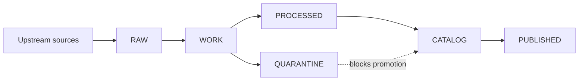

# Data

> Governed dataset specs, policy vocabularies, and CI fixtures that make KFM’s **truth path** reproducible and fail-closed.

**Status:** draft  
**Owners:** _Unknown — assign via CODEOWNERS_  
**What this folder is:** repo-side “control plane” inputs (specs/policy/fixtures)  
**What this folder is not:** a dumping ground for large binaries, secrets, or unreviewed exports

## Navigation
- [What belongs in data](#what-belongs-in-data)
- [Directory layout](#directory-layout)
- [Naming and deterministic identity](#naming-and-deterministic-identity)
- [Truth path zones](#truth-path-zones)
- [Promotion Contract gates](#promotion-contract-gates)
- [Catalog triplet](#catalog-triplet)
- [Policy labels and sensitive locations](#policy-labels-and-sensitive-locations)
- [Contribution workflow](#contribution-workflow)
- [Templates](#templates)
- [Definition of Done for a dataset integration](#definition-of-done-for-a-dataset-integration)

---

## What belongs in data

This folder holds **governance-critical inputs** that must be reviewable in PRs.

### Store here
- **Dataset onboarding specs**: canonical inputs to deterministic versioning (`spec_hash`) and pipeline execution.
- **Policies**: controlled vocabularies, notices, partner/community constraints (redacted where needed).
- **Fixtures**: small, non-sensitive sample inputs/outputs to exercise schema validation, policy gates, and link checks.

### Do not store here
- Large raw/processed datasets (use the artifact store; commit only manifests/specs).
- Secrets, tokens, private keys, credentials.
- Sensitive precise locations or culturally restricted site coordinates (store generalized geometry or keep restricted and governed).

[Back to top](#data)

---

## Directory layout

Recommended minimum structure:

```text
data/
  README.md
  specs/                 # dataset onboarding specs (canonical inputs)
  policies/              # controlled vocabularies + policy artifacts (redact as required)
  fixtures/              # small fixtures used for CI contract/policy tests
```

Notes:
- `data/specs/` is where **new datasets start**.
- `data/policies/` is where **allowed labels / obligations / vocab** live (treat as “policy as code”).
- `data/fixtures/` should contain **tiny** examples only: enough to fail CI when contracts drift.

[Back to top](#data)

---

## Naming and deterministic identity

### Dataset slugs
Use **lowercase** with **underscore** separators. Include upstream authority when helpful. **Do not** put dates in the slug (dates belong to versions).

Examples:
- `usgs_nwis_kansas`
- `noaa_ncei_storm_events`
- `fema_disaster_declarations`

### Identifier families
Prefer URI-like identifiers with stable prefixes (examples):
- `kfm://dataset/<slug>`
- `kfm://artifact/sha256:<digest>`
- `kfm://run/<run_id>`
- `kfm://evidence/<...>`

Avoid embedding environment-specific hostnames in canonical IDs. Hostnames belong in distribution URLs.

### DatasetVersion identity
A DatasetVersion is derived from a **canonical specification**. Any change to the spec creates a **new** version.

Recommended pattern:
- `spec_hash = sha256( canonical_json(spec) )`
- `dataset_version_id = <dataset_slug> + "@" + short(spec_hash)`

Requirement:
- `spec_hash` must be stable across platforms → canonical JSON + a drift test.

[Back to top](#data)

---

## Truth path zones

KFM data moves through named lifecycle zones. Promotion is **fail-closed**: if something is unclear or invalid, it stays out of runtime surfaces.

### Zones at a glance

| Zone | Purpose | What’s allowed | Mutability |
|---|---|---|---|
| RAW | Capture upstream source snapshots + terms snapshots | Source artifacts + checksums + acquisition notes | Append-only |
| WORK | Transform & normalize | Intermediate artifacts, logs, temporary products | Rewrite OK |
| QUARANTINE | Hold failures or unresolved rights | Failed validations, ambiguous licensing, sensitive leakage | Rewrite OK, but not promoted |
| PROCESSED | Promotion candidate outputs | Canonical artifacts with digests + media types | Immutable per version |
| CATALOG | Metadata + lineage contract | DCAT + STAC + PROV + cross-links + receipts | Immutable per version |
| PUBLISHED | Runtime bundles | Only promoted versions surfaced to API/UI | Immutable per release |

### Visual flow



Key invariant:
- Runtime should only see **PUBLISHED**, which is derived only from **promoted** versions (PROCESSED + CATALOG pass gates).

[Back to top](#data)

---

## Promotion Contract gates

Promotion moves a dataset version from Raw/Work into **Processed + Catalog/Lineage**, making it eligible for runtime. It must be blocked unless gates pass.

| Gate | Fail-closed check | If it fails |
|---|---|---|
| A Identity and versioning | Deterministic `dataset_version_id` + `spec_hash`; promotion manifest exists | Block promotion |
| B Licensing and rights | License/rights recorded; terms snapshot captured; export rights verified | Quarantine or metadata-only |
| C Sensitivity | `policy_label` assigned; sensitive location handling applied | Require generalization or restrict |
| D Catalog triplet | DCAT/STAC/PROV present and schema-valid under profile | Block promotion |
| E Run receipts and checksums | Inputs/outputs digested; run receipt emitted; environment captured | Block promotion |
| F Policy and contract tests | Default-deny passes; obligations applied; conformance tests pass | Block promotion |
| G Operational readiness | Runbook/rollback/monitoring readiness (recommended) | Require waiver + recorded approval |

Minimum expectation: gates are implementable as CI checks (schemas, link-check, policy tests).

[Back to top](#data)

---

## Catalog triplet

Catalogs are not “nice metadata.” They are **contract surfaces** between pipelines and runtime.

- **DCAT** answers: what is this dataset, who published it, what are the rights, what distributions exist.
- **STAC** answers: what assets exist, where are the files, what are their spatiotemporal extents.
- **PROV** answers: how were outputs created, with which inputs/tools/parameters, under what environment.

Cross-linking rules must be testable:
- DCAT dataset ↔ distributions ↔ artifact digests
- DCAT dataset ↔ PROV activity bundle
- STAC collection ↔ DCAT record
- STAC item ↔ PROV activity and/or run receipt
- Evidence references resolve deterministically

[Back to top](#data)

---

## Policy labels and sensitive locations

### Policy labels
A starter set of `policy_label` values:

- `public`
- `public_generalized`
- `restricted`
- `restricted_sensitive_location`
- `internal`
- `embargoed`
- `quarantine`

### Sensitive location default
If a dataset may expose sensitive locations or culturally restricted sites:
- Prefer `public_generalized` for public releases.
- Avoid exact coordinates unless explicitly permitted and governed.
- Record the generalization method used and treat it as part of reproducible provenance.

[Back to top](#data)

---

## Contribution workflow

### Add a new dataset
1. Create `data/specs/<dataset_slug>.json` describing:
   - upstream source configuration
   - transform parameters and container digests
   - validation rules
   - output artifact plan
   - intended policy label
   - expected cadence
2. Add/confirm required controlled vocab entries in `data/policies/` if new values are introduced.
3. Add minimal fixtures under `data/fixtures/<dataset_slug>/`:
   - small input sample (non-sensitive)
   - expected schema-valid output sample
   - at least one invalid fixture to prove CI can fail
4. Ensure CI covers:
   - spec canonicalization + `spec_hash` stability
   - policy tests default-deny
   - schema validation for catalogs and receipts
   - link checks for catalog cross-links

### Promotion is PR-based
Promotion should be social + technical:
- contributor PR adds specs/policies/fixtures
- CI runs gates
- steward reviews licensing + sensitivity + policy label
- operator merges + triggers controlled pipeline run
- processed artifacts + catalogs emitted
- promotion manifest created for the released DatasetVersion

[Back to top](#data)

---

## Templates

The full canonical templates live in the governance docs; below are **illustrative shapes** to keep contributors aligned.

<details>
<summary><strong>Dataset onboarding spec shape</strong></summary>

```json
{
  "kfm_dataset_spec_version": "v1",
  "dataset_slug": "example_dataset",
  "title": "Example dataset",
  "sources": [
    {
      "kind": "bulk",
      "uri": "https://example.org/data.zip",
      "terms_snapshot_required": true,
      "schedule": "cron(0 3 * * *)"
    }
  ],
  "transforms": [
    {
      "name": "normalize",
      "container_image": "ghcr.io/org/pipeline@sha256:...",
      "params": { "crs": "EPSG:4326", "schema_version": "v1" }
    }
  ],
  "outputs": [
    { "zone": "processed", "path": "artifacts/main.parquet", "media_type": "application/x-parquet" }
  ],
  "policy": { "default_policy_label": "public_generalized" }
}
```

</details>

<details>
<summary><strong>Run receipt shape</strong></summary>

```json
{
  "run_id": "kfm://run/2026-02-21T12:00:00Z.example",
  "operation": "ingest+publish",
  "actor": { "principal": "svc:pipeline", "role": "pipeline" },
  "dataset_version_id": "example_dataset@abcd1234",
  "inputs": [{ "uri": "raw/source.csv", "digest": "sha256:..." }],
  "outputs": [{ "uri": "processed/main.parquet", "digest": "sha256:..." }],
  "environment": {
    "container_digest": "sha256:...",
    "git_commit": "deadbeef",
    "params_digest": "sha256:..."
  },
  "validation": { "status": "pass", "report_digest": "sha256:..." },
  "policy": { "decision_id": "kfm://policy_decision/..." },
  "created_at": "2026-02-21T12:05:00Z"
}
```

</details>

<details>
<summary><strong>Promotion manifest shape</strong></summary>

```json
{
  "kfm_promotion_manifest_version": "v1",
  "dataset_slug": "example_dataset",
  "dataset_version_id": "example_dataset@abcd1234",
  "spec_hash": "sha256:...",
  "released_at": "2026-02-21T13:00:00Z",
  "artifacts": [
    { "path": "artifacts/main.parquet", "digest": "sha256:...", "media_type": "application/x-parquet" }
  ],
  "catalogs": [
    { "path": "catalog/dcat.jsonld", "digest": "sha256:..." },
    { "path": "catalog/stac/collection.json", "digest": "sha256:..." },
    { "path": "catalog/prov/prov.json", "digest": "sha256:..." }
  ],
  "qa": { "status": "pass", "report_digest": "sha256:..." },
  "policy": { "policy_label": "public_generalized", "decision_id": "kfm://policy_decision/..." },
  "approvals": [
    { "role": "steward", "principal": "user:...", "approved_at": "2026-02-21T12:59:00Z" }
  ]
}
```

</details>

[Back to top](#data)

---

## Definition of Done for a dataset integration

A dataset is “integrated” only when it can be promoted and safely surfaced.

- [ ] Spec added under `data/specs/` and passes `spec_hash` drift tests
- [ ] Licensing/rights documented; terms snapshot captured where required
- [ ] Policy label assigned; sensitive location handling applied
- [ ] Processed artifacts exist with digests and media types recorded
- [ ] Catalog triplet generated and schema-valid (DCAT + STAC + PROV)
- [ ] Cross-links resolve (link-check passes; EvidenceRefs resolve deterministically)
- [ ] Run receipt emitted; environment captured; audit append completed
- [ ] Fixtures exist (valid + invalid) and CI fails correctly on invalid fixtures
- [ ] Promotion manifest created for the released version
- [ ] If required: steward approvals recorded (and any waivers explicitly documented)

[Back to top](#data)
