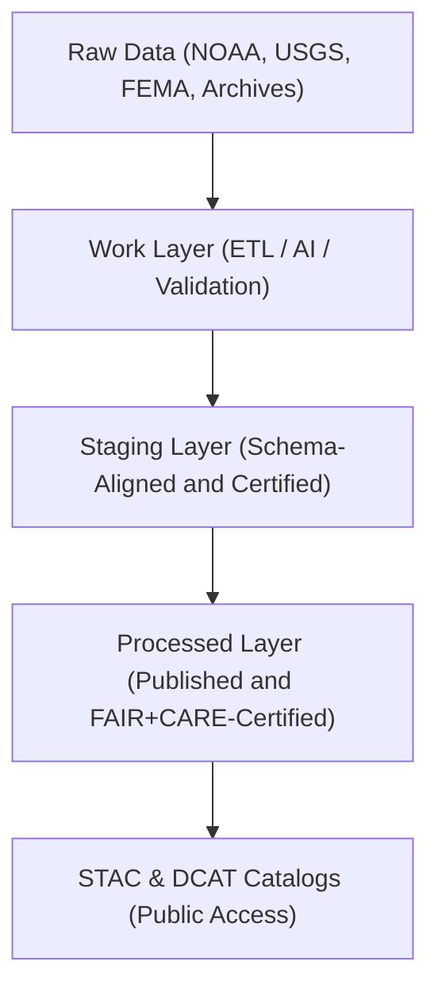

<div align="center">

# 🗄️ Kansas Frontier Matrix — **Data Architecture & Governance Overview**
`data/README.md`

**Purpose:**  
Documents the **complete data lifecycle**, governance structure, and FAIR+CARE-compliant data layers within the **Kansas Frontier Matrix (KFM)**.  
This framework integrates open environmental, historical, and geospatial data into a unified, traceable system that emphasizes transparency, ethical stewardship, and reproducibility.

[](../docs/standards/faircare-validation.md)
[]()
[]()
[](../LICENSE)

</div>

---

## 📚 Overview

The **Data Layer Architecture** defines how raw, processed, and AI-validated datasets are structured, stored, and ethically governed across the KFM ecosystem.  
It combines **FAIR+CARE data principles**, **ISO metadata standards**, and **STAC/DCAT 3.0 interoperability** to ensure each dataset is traceable from ingestion to publication.

### Core Responsibilities
- Maintain version-controlled datasets under FAIR+CARE governance.  
- Support reproducible ETL pipelines for all data domains.  
- Enforce schema validation, checksum integrity, and provenance logging.  
- Enable AI explainability and Focus Mode data visualization.  

---

## 🧭 Data Architecture Framework



### Data Flow Summary
1. **Raw Layer:** Ingest unaltered data from open repositories and partner organizations.  
2. **Work Layer:** Apply ETL, AI models, FAIR+CARE audits, and validation workflows.  
3. **Staging Layer:** Normalize schemas and prepare datasets for governance certification.  
4. **Processed Layer:** Publish final, certified datasets for public use and archival.  
5. **Catalogs:** Index datasets through STAC/DCAT-compliant metadata for discoverability.  

---

## 🗂️ Directory Layout

```plaintext
data/
├── README.md                               # This file — overview of data architecture and governance
│
├── raw/                                   # Unaltered source data from public and archival sources
├── work/                                  # Operational data layer (ETL, AI, and FAIR+CARE validation)
│   ├── tmp/                               # Temporary, transient ETL and validation workspace
│   ├── staging/                           # Normalized datasets pending validation
│   └── processed/                         # Certified, finalized data ready for publication
│
├── processed/                             # Public, published datasets certified under FAIR+CARE
├── reports/                               # Validation, governance, and FAIR+CARE audit outputs
├── checksums/                             # Cryptographic integrity and ledger-linked verification files
├── stac/                                  # STAC-compliant catalogs of processed data assets
└── archive/                               # Long-term, versioned storage of validated data releases
```

---

## 🧱 Data Layer Descriptions

| Layer | Description | Purpose |
|--------|--------------|----------|
| **Raw** | Direct downloads from original sources. | Transparency and provenance preservation. |
| **Work** | Active ETL workspace for transformations, validation, and AI explainability. | Data processing and auditing. |
| **Staging** | Schema-aligned, pre-publication datasets under governance review. | FAIR+CARE compliance and validation. |
| **Processed** | Certified, published datasets approved for public access. | Public distribution and citation. |
| **Reports** | Validation summaries, AI governance logs, and FAIR+CARE audits. | Accountability and reproducibility. |
| **Checksums** | SHA-256 verification files for all published datasets. | Data integrity and cryptographic proof. |
| **STAC** | Spatial metadata catalog linking all datasets. | Discovery and interoperability. |
| **Archive** | Immutable repository of all certified data releases. | Long-term reproducibility. |

---

## 🧩 FAIR+CARE Governance Integration

| Principle | Implementation | Verified By |
|------------|----------------|--------------|
| **Findable** | Datasets indexed in STAC/DCAT catalogs with globally unique IDs. | @kfm-data |
| **Accessible** | Published under open FAIR+CARE license (MIT / CC-BY 4.0). | @kfm-accessibility |
| **Interoperable** | JSON, CSV, GeoJSON, and Parquet formats standardized across domains. | @kfm-architecture |
| **Reusable** | Datasets retain schema, metadata, and provenance hashes. | @kfm-design |
| **Collective Benefit** | Supports transparent climate, land, and treaty research. | @faircare-council |
| **Authority to Control** | FAIR+CARE Council validates all published datasets. | @kfm-governance |
| **Responsibility** | Audit trails link all datasets to provenance and checksum logs. | @kfm-security |
| **Ethics** | Culturally sensitive or private data redacted prior to release. | @kfm-ethics |

All audit logs are maintained in:  
`data/reports/audit/data_provenance_ledger.json`

---

## 🧠 Data Validation & Provenance Framework

| Process | Description | Output |
|----------|--------------|---------|
| **Schema Validation** | Ensures dataset structure matches KFM Data Contract v3. | `data/reports/validation/schema_validation_summary.json` |
| **Checksum Verification** | Computes SHA-256 hashes for all validated assets. | `data/checksums/manifest.json` |
| **FAIR+CARE Audit** | Ethical and reproducibility validation. | `data/reports/fair/faircare_summary.json` |
| **AI Explainability** | Links AI outputs to explainability logs. | `data/reports/audit/ai_validation_ledger.json` |
| **Governance Registration** | Logs certified datasets to blockchain-linked ledger. | `data/reports/audit/data_provenance_ledger.json` |

---

## 📊 Example Data Governance Record

```json
{
  "id": "work_hazards_v9.6.0",
  "domain": "hazards",
  "records_processed": 24318,
  "checksum_verified": true,
  "fairstatus": "certified",
  "schema_version": "v3.0.1",
  "ai_explainability_score": 0.987,
  "governance_registered": true,
  "ledger_ref": "data/reports/audit/data_provenance_ledger.json",
  "timestamp": "2025-11-03T19:25:00Z"
}
```

---

## ⚙️ Data Quality & Sustainability Metrics

| Metric | Target | Verified By |
|---------|---------|--------------|
| Schema Conformance | ≥ 99% | @kfm-validation |
| FAIR+CARE Certification | 100% | @faircare-council |
| Provenance Retention | Permanent | @kfm-governance |
| Dataset Reusability | ≥ 95% | @kfm-data |
| Energy Efficiency | ≤ 20 Wh per ETL run | @kfm-sustainability |

Metrics are logged in:  
`releases/v9.6.0/focus-telemetry.json`

---

## 🌱 Sustainable Data Practices

| Practice | Description | Compliance |
|-----------|--------------|-------------|
| **Immutable Governance Logs** | Ledger entries are cryptographically verified and permanent. | ISO 37000 |
| **Renewable Compute Infrastructure** | ETL and AI pipelines run on RE100-compliant servers. | ISO 14064 |
| **Open Data Licensing** | MIT / CC-BY 4.0 licensing for public reuse. | FAIR+CARE |
| **Ethical Redaction** | Automated review of sensitive or Indigenous-related data. | CARE Principles |

---

## 🧾 Internal Use Citation

```text
Kansas Frontier Matrix (2025). Data Architecture & Governance Overview (v9.6.0).
Defines the multi-layered, FAIR+CARE-certified data management framework for Kansas Frontier Matrix.
Ensures transparency, reproducibility, and ethical data stewardship across all environmental, spatial, and historical domains.
```

---

## 🧾 Version Notes

| Version | Date | Notes |
|----------|------|--------|
| v9.6.0 | 2025-11-03 | Updated data architecture for telemetry-linked FAIR+CARE auditing. |
| v9.5.0 | 2025-11-02 | Added energy efficiency and checksum validation metrics. |
| v9.3.2 | 2025-10-28 | Established baseline data governance structure and STAC integration. |

---

<div align="center">

**Kansas Frontier Matrix** · *FAIR+CARE Data Ethics × Provenance Transparency × Sustainable Stewardship*  
[🔗 Repository](https://github.com/bartytime4life/Kansas-Frontier-Matrix) • [🧭 Governance Ledger](../docs/standards/governance/DATA-GOVERNANCE.md) • [📊 FAIR+CARE Summary](../data/reports/fair/faircare_summary.json)

</div>