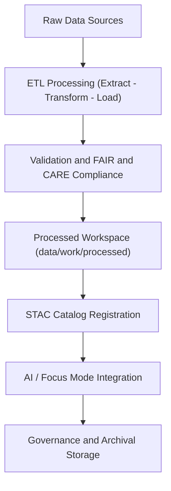

<div align="center">

# 🗃️ Kansas Frontier Matrix — **Data Architecture & Governance Overview**
`data/README.md`

**Purpose:** Defines the structure, governance, and FAIR+CARE-aligned design of the Kansas Frontier Matrix data repository.  
Implements a modular, reproducible, and ethically governed data ecosystem for spatiotemporal, historical, and environmental datasets.

[](../.github/workflows/stac-validate.yml)
[](../LICENSE)
[](../docs/standards/faircare-validation.md)
[](../docs/architecture/repo-focus.md)

</div>

---

## 📚 Overview

The `data/` directory is the **central data hub** for the Kansas Frontier Matrix (KFM) project.  
It contains all datasets, sources, metadata, STAC catalogs, and validation records used by the system’s pipelines and interfaces.  
All data artifacts follow **FAIR (Findable, Accessible, Interoperable, Reusable)** and **CARE (Collective Benefit, Authority, Responsibility, Ethics)** principles, ensuring transparency, provenance, and ethical stewardship.

This data architecture connects:
- **Raw and processed datasets** from historical, GIS, environmental, and archival sources  
- **ETL pipelines** for transformation and normalization  
- **AI/ML enrichment layers** for analysis and prediction  
- **Governance and audit logs** for traceability and ethics oversight  

---

## 🗂️ Directory Layout

```plaintext
data/
├── README.md                         # This file — data architecture overview
│
├── sources/                          # JSON manifests of external data sources
│   ├── usgs_historic_topo.json
│   ├── noaa_weather_datasets.json
│   └── kansas_archival_maps.json
│
├── raw/                              # Immutable raw datasets (not version-controlled directly)
│   ├── usgs/
│   ├── fema/
│   ├── noaa/
│   └── kgs/
│
├── work/                             # Temporary and processed workspace for ETL pipelines
│   ├── tmp/
│   │   ├── climate/
│   │   ├── hazards/
│   │   ├── staging/
│   │   └── validation/
│   └── processed/
│       ├── climate/
│       ├── hazards/
│       ├── hydrology/
│       └── treaties/
│
├── stac/                             # SpatioTemporal Asset Catalog (STAC 1.0) for all datasets
│   ├── catalog.json
│   ├── items/
│   │   ├── climate_2025.json
│   │   ├── hazards_v9.3.2.json
│   │   └── hydrology_2024.json
│   └── collections/
│       ├── hazards_collection.json
│       └── climate_collection.json
│
├── archive/                          # Archived datasets and historical versions
│   ├── hazards/
│   ├── climate/
│   └── treaties/
│
└── reports/                          # Validation, FAIR+CARE, and governance audit reports
    ├── audit/
    │   └── data_provenance_ledger.json
    ├── fair/
    │   ├── data_fair_summary.json
    │   └── data_care_assessment.json
    ├── validation/
    │   ├── stac_validation_report.json
    │   └── schema_validation_summary.json
    └── lineage/
        └── data_lineage_tree.json
```

---

## 🧩 Data Lifecycle



Each dataset’s journey is **fully documented** with versioning, schema validation, and cryptographic checksums to ensure reproducibility and accountability.

---

## ⚙️ Data Standards

All datasets follow the following **open and interoperable standards**:

| Standard | Purpose | Location |
|-----------|----------|----------|
| **STAC 1.0** | Geospatial asset metadata | `data/stac/` |
| **DCAT 3.0** | Dataset catalog interoperability | `data/sources/` |
| **GeoJSON / GeoTIFF** | Geospatial data storage | `data/work/processed/` |
| **ISO 19115** | Metadata for spatial datasets | Embedded in STAC items |
| **CIDOC CRM + OWL-Time** | Semantic linkages (events, people, places) | `data/work/processed/treaties/` |
| **FAIR+CARE Framework** | Data ethics and governance | `docs/standards/faircare-validation.md` |

---

## 🧠 FAIR+CARE Compliance

| Principle | Implementation |
|------------|----------------|
| **Findable** | All data is indexed via STAC and searchable through Focus Mode and catalog UI. |
| **Accessible** | Datasets stored in open formats under public licenses (MIT/CC-BY). |
| **Interoperable** | Uses open schemas (STAC, DCAT, GeoJSON) with consistent CRS (EPSG:4326). |
| **Reusable** | Metadata includes license, source, and version for each dataset. |
| **Collective Benefit** | Supports climate, environmental, and historical research. |
| **Authority to Control** | Communities acknowledged and credited within metadata. |
| **Responsibility** | Ethical reviews embedded in the FAIR+CARE ledger. |
| **Ethics** | Sensitive data flagged and controlled through governance policies. |

---

## 🔍 Data Provenance & Governance

All datasets in `data/` are subject to strict **provenance and audit logging**.

| Governance File | Purpose |
|-----------------|----------|
| `reports/audit/data_provenance_ledger.json` | Records all dataset transformations and approvals |
| `reports/validation/stac_validation_report.json` | Ensures compliance with STAC schema |
| `reports/fair/data_fair_summary.json` | FAIR+CARE audit summary |
| `releases/v9.3.2/manifest.zip` | Complete data manifest with checksums |
| `schemas/telemetry/work-data-governance-v14.json` | Telemetry schema for data version tracking |

Provenance records include:
- Dataset origin (source URL and license)  
- Validation and FAIR review timestamps  
- Digital signatures of validators and maintainers  
- SHA-256 checksums for each asset  

---

## 🧾 Data Access & Integration

Data is accessible through:
- **Frontend API** (`/api/stac/` and `/api/events/`)  
- **Graph Database** (Neo4j integration for CIDOC CRM entities)  
- **STAC Catalog Viewer** (interactive visualization in the web interface)  
- **AI Pipelines** for inference and Focus Mode contextualization  

Focus Mode consumes curated datasets from:
- `data/work/tmp/hazards/`  
- `data/work/tmp/climate/`  
- `data/work/tmp/hydro/`  

---

## 🧱 Validation Workflows

| Workflow | Description | Output |
|-----------|--------------|--------|
| `.github/workflows/stac-validate.yml` | Validates STAC metadata and schemas | `reports/validation/stac_validation_report.json` |
| `.github/workflows/faircare-validate.yml` | Runs FAIR+CARE compliance checks | `reports/fair/data_fair_summary.json` |
| `.github/workflows/governance-ledger.yml` | Updates provenance and ledger | `reports/audit/data_provenance_ledger.json` |

---

## 🧩 Data Ethics Review Process

Every dataset addition or update triggers:
1. FAIR+CARE validation for ethical alignment.  
2. Governance review (`data_submission.yml` issue template).  
3. Metadata linkage into the STAC catalog.  
4. Provenance logging to the audit ledger.  
5. Telemetry entry for reproducibility tracking.

All actions logged under the **FAIR+CARE Council Oversight** process ensure full transparency and accountability.

---

## 🧾 Version History

| Version | Date       | Author             | Summary |
|----------|------------|--------------------|----------|
| v9.3.2   | 2025-10-28 | @kfm-data-lab      | Comprehensive data architecture documentation with FAIR+CARE and STAC integration. |
| v9.3.1   | 2025-10-27 | @bartytime4life    | Added governance and provenance reporting standards. |
| v9.3.0   | 2025-10-26 | @kfm-architecture  | Established modular data directory and validation workflows. |

---

<div align="center">

**Kansas Frontier Matrix** · *Data Provenance × FAIR+CARE Ethics × Open Science*  
[🔗 Repository](https://github.com/bartytime4life/Kansas-Frontier-Matrix) • [🧭 Docs Portal](../docs/) • [⚖️ Governance Ledger](../docs/standards/governance/)

</div>
