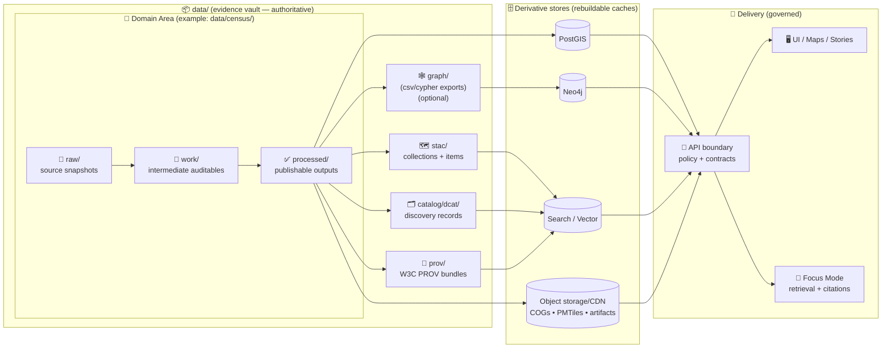

<div align="center">

<!-- 🚧 UNDER CONSTRUCTION -->

<picture>
  <source media="(prefers-reduced-motion: reduce)" srcset="../docs/assets/kfm-seal-320.png">
  
</picture>

<br/>

# 📦 `data/` — Evidence Vault, Versioned Datasets, Catalogs, & Provenance 🗺️🧾

**KFM’s canonical source-of-truth for evidence → publishable outputs → catalogs → lineage.**  
<sub><em>“The map behind the map” — every layer has receipts.</em></sub>

<br/>


<br/>

<a href="#-quick-nav">🧭 Quick Nav</a> •
<a href="#-kfm-invariant-the-truth-path-is-non-negotiable">🧱 Truth Path</a> •
<a href="#-truth-path-lifecycle-how-evidence-becomes-servable">🗺️ Lifecycle</a> •
<a href="#-folder-layout-v13-canonical">📁 Layout</a> •
<a href="#-path-compatibility-map-domain-first-vs-stage-first">🧩 Compatibility</a> •
<a href="#-dataset-contract-bundle-completeness">📦 Dataset Contract</a> •
<a href="#-stac--dcat--prov-profiles--cross-linking">🗂️ STAC/DCAT/PROV</a> •
<a href="#-governance-fair--care--data-sovereignty">⚖️ Governance</a> •
<a href="#-validation--ci-gates-fail-closed">🧪 CI Gates</a>

</div>

> [!WARNING]
> **This `data/` folder is under active construction.**  
> Structure and validators are stabilizing. Expect migrations (with redirects / compatibility notes) and stricter CI gates over time.

---

## ✨ What this folder is

`data/` is KFM’s **evidence vault**: a **versioned, reviewable, rebuildable** data layer where the “truth path” is enforced.

At a minimum, `data/` exists so we can always answer:

- **What is this dataset?**
- **Where did it come from (inputs)?**
- **How was it produced (process + parameters)?**
- **What can we safely show (policy + classification)?**

### 🧱 Design constraints (non-negotiables)

- 🧾 **Raw is evidence**: immutable snapshots of original inputs (audit trail).
- 🧪 **Work is audit support**: intermediate artifacts worth keeping for QA/audit.
- ✅ **Processed is authoritative**: standardized, serve-ready outputs (rebuild anchor).
- 🗂️ **Catalogs & lineage are boundary artifacts**: STAC + DCAT + PROV are required for publishability.
- 🗄️ **Runtime stores are caches**: PostGIS/Neo4j/indexes can be rebuilt; they are not “truth.”

> [!IMPORTANT]
> **The repo itself acts like a versioned data lake.**  
> Large binaries may be stored via pointers (Git LFS / checksum references), but their identity, metadata, and lineage must still be captured in-repo.  

---

<a id="-quick-nav"></a>

## 🧭 Quick Nav

- [🧱 KFM invariant: the Truth Path is non-negotiable](#-kfm-invariant-the-truth-path-is-non-negotiable)
- [🗺️ Truth Path lifecycle (how evidence becomes “servable”)](#-truth-path-lifecycle-how-evidence-becomes-servable)
- [📁 Folder layout (v13 canonical)](#-folder-layout-v13-canonical)
- [🧩 Path compatibility map (domain-first vs stage-first)](#-path-compatibility-map-domain-first-vs-stage-first)
- [📦 Dataset contract (bundle completeness)](#-dataset-contract-bundle-completeness)
- [🏷️ Naming, versioning, & identifiers](#-naming-versioning--identifiers)
- [🗂️ STAC / DCAT / PROV profiles & cross-linking](#-stac--dcat--prov-profiles--cross-linking)
- [🧱 Formats, storage tiers, & large-file strategy](#-formats-storage-tiers--large-file-strategy)
- [🤖 Evidence artifacts (AI + analysis outputs)](#-evidence-artifacts-ai--analysis-outputs)
- [⚖️ Governance: FAIR + CARE + data sovereignty](#-governance-fair--care--data-sovereignty)
- [🧪 Validation & CI gates (fail-closed)](#-validation--ci-gates-fail-closed)
- [✅ Publishing checklist (Definition of Done)](#-publishing-checklist-definition-of-done)
- [📚 References](#-references--standards)

---

<a id="-kfm-invariant-the-truth-path-is-non-negotiable"></a>

## 🧱 KFM invariant: the Truth Path is non-negotiable

KFM enforces a strict order from evidence → publishable outputs → governed serving.

```text
raw ➜ work ➜ processed ➜ catalogs (STAC/DCAT/PROV) ➜ graph/stores ➜ API ➜ UI/AI ➜ narrative
```

### ✅ What each stage means (data-layer view)

- 🧾 **Raw** — original source snapshots, preserved as evidence (read-only)
- 🧪 **Work** — intermediate artifacts worth keeping for auditability (QA, transforms, georeferencing logs)
- ✅ **Processed** — authoritative, standardized outputs; the rebuild anchor for downstream caches
- 🗂️ **Catalogs + Provenance** — boundary artifacts that make datasets discoverable + traceable
- 🗄️ **Graph/stores** — Neo4j/PostGIS/search/object storage (read-optimized mirrors, rebuildable)
- 🧩 **API** — governed boundary: validation + policy + redaction + audit
- 🖥️ **UI/AI** — maps, stories, Focus Mode (clients; never privileged backdoors)

> [!IMPORTANT]
> **Publishability = completeness.**  
> A dataset isn’t “real” in KFM until reviewers can walk: **processed → STAC/DCAT → PROV → raw evidence**.

---

<a id="-truth-path-lifecycle-how-evidence-becomes-servable"></a>

## 🗺️ Truth Path lifecycle (how evidence becomes “servable”)



> [!NOTE]
> **Focus Mode is not privileged.** It is “just another client” that must cite retrieved evidence and obey the same policy gates as everyone else.

---

<a id="-folder-layout-v13-canonical"></a>

## 📁 Folder layout (v13 canonical)

This layout stabilizes **one canonical home per subsystem** and makes catalogs/provenance first-class.

```text
📦 data/
├─ 🗺️ stac/
│  ├─ 📁 collections/               # STAC Collections (dataset-level)
│  └─ 📁 items/                     # STAC Items (asset-level)
│
├─ 🗂️ catalog/
│  └─ 📁 dcat/                      # DCAT outputs (JSON-LD, etc.)
│
├─ 🧬 prov/                         # PROV bundles (per run / per dataset)
│
├─ 🕸️ graph/                        # Graph import artifacts (optional)
│  ├─ 📁 csv/                       # Neo4j import CSV exports
│  └─ 📁 cypher/                    # Optional post-import scripts
│
├─ 📁 <domain>/                     # e.g., census/, railroads/, historical_maps/
│  ├─ 🧾 raw/                       # Raw source data (read-only evidence)
│  ├─ 🧪 work/                      # Working artifacts (intermediate outputs)
│  ├─ ✅ processed/                 # Final processed outputs (publishable)
│  ├─ 🧷 mappings/                  # Dataset→STAC/DCAT/PROV mapping notes (optional)
│  └─ 📄 README.md                  # Domain runbook (sources, assumptions, SOP)
│
└─ 📄 README.md                     # This file (global data rules + contracts)
```

### 🔗 “Nearby coupling” (not inside `data/`, but required)

```text
⚙️ src/pipelines/                   # Deterministic ETL writing raw→work→processed
🧾 schemas/                         # JSON Schemas + profiles (STAC/DCAT/PROV + Story Nodes)
📚 docs/data/<domain>/README.md      # Domain documentation (sources, assumptions, decisions)
📦 releases/                         # Versioned bundles + manifests + SBOM (audited releases)
🛡️ docs/governance/                 # stewardship, sovereignty, sensitive-data rules
📜 docs/standards/                   # KFM profiles: STAC/DCAT/PROV + repo protocols
```

> [!TIP]
> If you’re tempted to create near-duplicates like `data/provenance/` or `data/catalog/stac/`, don’t.  
> Prefer redirects + tooling aliases so we keep a **single canonical home per subsystem**.

---

<a id="-path-compatibility-map-domain-first-vs-stage-first"></a>

## 🧩 Path compatibility map (domain-first vs stage-first)

Some older docs, scripts, or upstream tools may still use a **stage-first** convention like:
- `data/raw/<domain>/...`
- `data/work/<domain>/...`
- `data/processed/<domain>/...`

KFM v13 canonicalizes to **domain-first**:
- `data/<domain>/raw/...`
- `data/<domain>/work/...`
- `data/<domain>/processed/...`

**Compatibility stance**
- ✅ New work should use the v13 layout shown above.
- ✅ If you inherit a stage-first layout, use a README redirect, symlink, or tooling alias.
- 🛑 Never “fork the truth” by keeping two divergent copies.

| Concept | v13 canonical ✅ | Alternate/stage-first you may encounter 🧱 |
|---|---|---|
| Domain staging | `data/<domain>/raw|work|processed/` | `data/raw|work|processed/<domain>/` |
| STAC metadata | `data/stac/...` | `data/catalog/stac/...` (avoid; migrate) |
| DCAT metadata | `data/catalog/dcat/...` | (often the same) |
| Provenance | `data/prov/...` | `data/provenance/...` (avoid; migrate) |
| Graph exports | `data/graph/...` | ad-hoc exports under `work/` (avoid) |

---

<a id="-dataset-contract-bundle-completeness"></a>

## 📦 Dataset contract (bundle completeness)

A dataset is not “servable” in KFM until it has its **boundary artifacts** and policy fields.

### ✅ Minimum viable dataset bundle

| Artifact | Purpose | Canonical location |
|---|---|---|
| ✅ Processed output(s) | What caches/API/UI consume | `data/<domain>/processed/...` |
| 🗺️ STAC Collection + Item(s) | Spatial/temporal metadata + asset links | `data/stac/collections/*.json` + `data/stac/items/*.json` |
| 🗂️ DCAT record (JSON-LD) | Discovery + license + distributions | `data/catalog/dcat/*.jsonld` |
| 🧬 PROV bundle | Lineage: raw → work → processed (+ agents/params) | `data/prov/*.prov.json` |
| 🏷️ Sensitivity classification | Policy enforcement | encoded in metadata + tags |

> [!IMPORTANT]
> Missing any of the above should be treated as **fail-closed**: not publishable, not mergable, not servable.

---

### 🔗 Cross-layer linkage expectations (required)

To keep catalogs, provenance, graph, and stories in sync, KFM expects:

- **STAC Items → Assets**
  - STAC Items must link to actual asset files/URLs and carry license/attribution fields.

- **DCAT → Distributions (often STAC-backed)**
  - DCAT distributions should reference STAC and/or direct download endpoints.

- **PROV end-to-end**
  - PROV must link raw inputs → work artifacts → processed outputs.
  - Include run identity (run ID), parameters/config reference, and producing agent.

- **Graph references catalogs (don’t duplicate data)**
  - Neo4j stores relationships and stable references (STAC/DCAT/provenance IDs), not bulky payload blobs.

---

### 🧾 Optional (but useful): `bundle.yaml` (“dataset bill of materials”)

A lightweight manifest makes reviews and reproducibility faster.

**Recommended location:**  
`data/<domain>/processed/<dataset_id>/bundle.yaml`

```yaml
dataset_id: "kfm.census.population.1900"
domain: "census"
version: "v1"
was_revision_of: null

run:
  run_id: "2026-02-07T19:02:11Z__census_pop_1900__v1"
  git_commit: "REPLACE_ME"
  pipeline: "src/pipelines/census/pop_1900.py"
  params_ref: "data/census/work/pop_1900_params.json"

outputs:
  - path: "data/census/processed/population__kansas__1900__v1.parquet"
    sha256: "REPLACE_ME"
    media_type: "application/x-parquet"

stac:
  item: "data/stac/items/kfm.census.population.1900__v1.json"
  collection: "data/stac/collections/kfm.census.population.json"

dcat:
  record: "data/catalog/dcat/kfm.census.population.1900__v1.jsonld"

prov:
  bundle: "data/prov/kfm.census.population.1900__v1.prov.json"

license:
  spdx: "CC-BY-4.0"

sensitivity:
  classification: "public"  # public|internal|confidential|restricted
  tags: []
```

> [!TIP]
> Even if you don’t adopt `bundle.yaml` immediately, preserve the **bundle concept**: reviewers should be able to answer “what is it, where did it come from, how do we reproduce it?” quickly.

---

<a id="-naming-versioning--identifiers"></a>

## 🏷️ Naming, versioning, & identifiers

### 📛 Domain folders
Use `snake_case` domains aligned with real-world themes/sources:
- `census`, `weather`, `railroads`, `soil`, `imagery`, `historical_maps`, `land_treaties`

### 🧩 Dataset IDs (stable + boring = good)
Recommended format:

```text
kfm.<domain>.<topic>.<time_or_edition>
```

Examples:
- `kfm.census.population.1900`
- `kfm.weather.precip.daily.v1`
- `kfm.historical_maps.county_boundaries.1930`

### 🧾 Processed filename conventions (scan-readable)
```text
<topic>__<coverage>__<time>__<vX>.<ext>
```

Examples:
- `population__kansas__1900__v1.parquet`
- `precip__kansas__daily__1850-2020__v2.parquet`
- `landsat__kansas__2010-06-15__v1.cog.tif`

### 🔁 Versioning expectations (KFM rules)

- **Dataset-level versioning**
  - If you change outputs meaningfully, create a new dataset version and connect it via PROV (`prov:wasRevisionOf`).

- **Persistent IDs (release-grade publishing)**
  - Prefer DOI/ARK when publishing stable releases externally.

- **Repo/system versioning**
  - Use semantic versioning tags for major platform shifts; major versions signal structural/contract changes.

---

<a id="-stac--dcat--prov-profiles--cross-linking"></a>

## 🗂️ STAC / DCAT / PROV profiles & cross-linking

KFM uses project profiles that extend base standards with KFM fields (e.g., provenance pointers, uncertainty/quality fields, governance tags).

Profiles live under:
- `../docs/standards/`
- `../schemas/`

> [!IMPORTANT]
> **Walk-the-chain rule:** if a Story Node or Focus Mode response cites a dataset, reviewers must be able to walk:
>
> ```text
> Story ➜ DCAT ➜ STAC ➜ PROV ➜ Raw Evidence
> ```

---

<a id="-formats-storage-tiers--large-file-strategy"></a>

## 🧱 Formats, storage tiers, & large-file strategy

KFM favors interoperable formats and “source-of-truth once” storage. Domain runbooks define exact choices, but typical targets include:

| Data type | Typical formats | Notes |
|---|---|---|
| Vector | GeoJSON (small), Parquet/GeoParquet (large) | analytics-friendly where possible |
| Tabular/time-series | Parquet / CSV | partition when large |
| Raster/imagery | **COG GeoTIFF** | cloud-optimized range reads |
| Tiles | **PMTiles / MBTiles**, MVT | portable packs + performant web delivery |

### 📦 Large assets: Git vs LFS vs “pointers”

If it’s too large to commit directly:
- use Git LFS, **or**
- store externally and commit a **pointer identity** (sha256, size, retrieval method, license, classification),
- still generate STAC/DCAT/PROV so the asset remains first-class in KFM.

> [!TIP]
> If it’s too big to commit, **still commit its identity** and its governance metadata.  
> “Invisible” assets (no checksums, no lineage, no license) are treated as non-compliant.

### 🧳 Release packaging (audited exports)
Use `releases/` for versioned bundles (manifest + SBOM + signatures) when producing audited releases.

---

<a id="-evidence-artifacts-ai--analysis-outputs"></a>

## 🤖 Evidence artifacts (AI + analysis outputs)

KFM treats analysis outputs (OCR corpora, simulations, inferred layers, ML masks) as **first-class datasets**, not “misc outputs.”

**Rule:** If it can influence a map, story, statistic, or AI answer, then it must:
- live in `data/<domain>/processed/...`
- be cataloged (STAC/DCAT)
- be provenance-linked (PROV; include method/model + parameters; add confidence/quality where applicable)
- be governed (license + sensitivity + policy tags)
- be served only via governed APIs (no UI bypass)

> [!CAUTION]
> Never hard-code AI-derived layers directly into UI config.  
> If it matters, it must be a dataset with catalogs and lineage.

---

<a id="-governance-fair--care--data-sovereignty"></a>

## ⚖️ Governance: FAIR + CARE + data sovereignty

KFM treats governance as part of the lifecycle, not an afterthought.

### 🌱 FAIR (Findable, Accessible, Interoperable, Reusable)
- achieved via consistent metadata + catalogs (STAC/DCAT)
- strengthened by deterministic pipelines + PROV lineage

### 🤝 CARE (Collective Benefit, Authority to Control, Responsibility, Ethics)
CARE complements FAIR, especially for data relating to Indigenous Peoples, lands, waters, and territories.

**Practical KFM stance**
- If you’re unsure whether a dataset triggers CARE obligations: raise it early (issue + governance label).
- Default to caution; fail-closed if policy cannot decide.
- Encode sensitivity/classification in metadata and propagate restrictions downstream.

> [!NOTE]
> CARE-sensitive datasets may require additional controls, review, redaction obligations, or restricted distribution tiers.

---

<a id="-validation--ci-gates-fail-closed"></a>

## 🧪 Validation & CI gates (fail-closed)

CI is expected to enforce **contracts**, not “best effort.”

### ✅ Minimum CI gates (v13 expectation)

- **Markdown & structure checks**
  - enforce front-matter presence where required
  - enforce anchors/links conventions
  - validate local link refs (no broken internal pointers)

- **Schema validation**
  - STAC/DCAT/PROV JSON must validate against KFM schemas/profiles
  - Story Nodes must validate against the Story Node schema
  - Focus Mode telemetry/records must validate (if emitted)

- **Policy-as-code (OPA) tests**
  - conformance tests for policy rules
  - fail when mandatory policy fields (license/classification/provenance pointers) are missing

- **Graph integrity checks (when applicable)**
  - ensure catalog IDs referenced by graph exports resolve
  - block malformed imports or inconsistent identifiers

> [!IMPORTANT]
> **Fail-closed is intentional.**  
> If metadata/provenance is missing or policy cannot evaluate, the default outcome is deny/block.

---

<a id="-publishing-checklist-definition-of-done"></a>

## ✅ Publishing checklist (Definition of Done)

A dataset is “done” when:

### ✅ Required
- [ ] 📥 Raw snapshot under `data/<domain>/raw/...` (or documented pointer/LFS strategy)
- [ ] 🧪 Deterministic pipeline writes `raw → work → processed`
- [ ] ✅ Output(s) in `data/<domain>/processed/...`
- [ ] 🗺️ STAC item/collection exists + links to assets + license + provenance pointers
- [ ] 🗂️ DCAT record exists + license + distributions + keywords
- [ ] 🧬 PROV bundle exists + connects raw/work/processed + run identity
- [ ] 🔐 Sensitivity classification recorded (policy can enforce)
- [ ] 🧪 CI gates pass (fail-closed)

### 🌟 Strongly recommended
- [ ] 📄 Domain runbook: `data/<domain>/README.md` and/or `docs/data/<domain>/README.md`
- [ ] 🧾 Checksums recorded for all large binaries (even if stored via pointers)
- [ ] 📈 QA summaries stored in `work/` and referenced in PROV

---

## 🧪 Example: dataset bundle (end-to-end)

```text
data/
├─ stac/
│  ├─ collections/
│  │  └─ kfm.census.population.json
│  └─ items/
│     └─ kfm.census.population.1900__v1.json
├─ catalog/
│  └─ dcat/
│     └─ kfm.census.population.1900__v1.jsonld
├─ prov/
│  └─ kfm.census.population.1900__v1.prov.json
└─ census/
   ├─ raw/
   │  └─ census_1900_source.csv
   ├─ work/
   │  ├─ census_1900_cleaned.parquet
   │  └─ pop_1900_params.json
   └─ processed/
      ├─ population__kansas__1900__v1.parquet
      └─ kfm.census.population.1900/
         └─ bundle.yaml
```

✅ Now the dataset is: **usable**, **findable**, **auditable**, and **rebuildable**.

---

<a id="-references--standards"></a>

## 📚 References & standards

Repo-local anchors (recommended reading):
- `../docs/MASTER_GUIDE_v13.md` (canonical ordering + contracts)
- `../docs/standards/` (KFM profiles for STAC/DCAT/PROV + repo protocols)
- `../docs/governance/` (ROOT_GOVERNANCE, ETHICS, SOVEREIGNTY)
- `../schemas/` (validation schemas; contract artifacts)
- `../src/pipelines/` (deterministic ETL jobs)

---

<div align="center">

### 🧭 North Star
**If it can’t be traced → it can’t be served.**  
**If it can’t be governed → it can’t be merged.** ✅🔒

<div align="center">