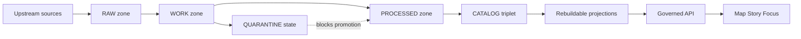

<!-- [KFM_META_BLOCK_V2]
doc_id: kfm://doc/f198c44a-6fb6-40e0-89e0-3f37f76e7742
title: data/ — Governed dataset artifacts + catalogs (Truth Path)
type: standard
version: v1
status: draft
owners: KFM Data Stewardship
created: 2026-02-22
updated: 2026-02-22
policy_label: public
related:
  - data/
tags:
  - kfm
  - data
  - governance
  - promotion-contract
notes:
  - Documents the on-disk layout + required artifacts for KFM’s truth path zones.
  - Written to be CI/validator-friendly (fail-closed).
[/KFM_META_BLOCK_V2] -->

# `data/`
Governed dataset artifacts + catalogs for the KFM Truth Path (RAW → WORK/QUARANTINE → PROCESSED → CATALOG).

**Status:** draft • **Owners:** KFM Data Stewardship • **Last updated:** 2026-02-22


---

## Quick navigation
- [What goes where](#what-goes-where)
- [Truth path diagram](#truth-path-diagram)
- [Directory layout](#directory-layout)
- [Canonical path convention](#canonical-path-convention)
- [Zone contracts](#zone-contracts)
- [Source registry](#source-registry)
- [Promotion contract gates](#promotion-contract-gates)
- [Quarantine workflow](#quarantine-workflow)
- [Catalog triplet](#catalog-triplet)
- [Checksums and digests](#checksums-and-digests)
- [Policy labels and sensitive data](#policy-labels-and-sensitive-data)
- [Definition of done](#definition-of-done)
- [Appendix templates](#appendix-templates)

---

## What goes where

| Area | Purpose | Mutability | Must include |
|---|---|---:|---|
| `data/sources/` | **Source registry** entries (machine-readable) | editable | identity, access, cadence, license snapshot, sensitivity intent, QA notes |
| `data/raw/` | **Immutable acquisitions** from upstream | append-only | acquisition `manifest.json`, raw `artifacts/`, `checksums.json` |
| `data/work/` | **Intermediate transforms** + QA + redaction candidates | editable | normalized `artifacts/`, `qa/`, `checksums.json` |
| `data/processed/` | **Publishable artifacts** in KFM-approved formats | replace-by-version | `artifacts/`, `checksums.json`, derived runtime metadata, `qa/validation_report.json` |
| `data/catalog/` | **Triplet + receipts** (DCAT + STAC + PROV + run receipts + promotion manifest) | replace-by-version | validated catalogs + cross-links + `receipts/` + `promotion_manifest.json` |

> **WARNING**  
> RAW is *append-only*. Never “fix” a RAW acquisition in place. If something is wrong, create a new acquisition and supersede the old one.

---

## Truth path diagram



> **NOTE**  
> Only **promoted dataset versions** (processed + validated catalogs + receipts + policy label) are eligible to appear in runtime surfaces.

---

## Directory layout

This repo’s **recommended** layout keeps the “truth path” zones adjacent and validator-friendly:

```text
data/
├─ README.md
├─ sources/
│  ├─ <source_id>.yml
│  └─ <source_id>.json
├─ raw/
│  └─ <dataset_slug>/
│     └─ <acquisition_id>/
│        ├─ manifest.json
│        ├─ artifacts/
│        └─ checksums.json
├─ work/
│  └─ <dataset_slug>/
│     └─ <work_run_id>/
│        ├─ artifacts/
│        ├─ qa/
│        ├─ checksums.json
│        └─ status.json          # optional: quarantine reasons, remediation plan
├─ processed/
│  └─ <dataset_slug>/
│     └─ <dataset_version_id>/
│        ├─ artifacts/
│        ├─ checksums.json
│        └─ qa/
│           └─ validation_report.json
└─ catalog/
   └─ <dataset_slug>/
      └─ <dataset_version_id>/
         ├─ dcat.jsonld
         ├─ stac/
         │  ├─ collection.json
         │  └─ items/
         ├─ prov/
         │  └─ prov.jsonld
         ├─ receipts/
         │  └─ <run_id>.json
         └─ promotion_manifest.json
```

> **TIP**  
> If you need a “quarantine directory,” prefer treating quarantine as a **state** (via `status.json` + policy label) rather than inventing a parallel top-level structure. The file layout stays consistent; promotion gates enforce “no quarantined items.”

---

## Canonical path convention

KFM uses predictable paths so CI, policy, and evidence resolution can be deterministic.

### Canonical path patterns (zones)
- `raw/<dataset_slug>/<acquisition_id>/manifest.json`
- `raw/<dataset_slug>/<acquisition_id>/artifacts/*`
- `raw/<dataset_slug>/<acquisition_id>/checksums.json`

- `work/<dataset_slug>/<work_run_id>/artifacts/*`
- `work/<dataset_slug>/<work_run_id>/qa/*`
- `work/<dataset_slug>/<work_run_id>/checksums.json`

- `processed/<dataset_slug>/<dataset_version_id>/artifacts/*`
- `processed/<dataset_slug>/<dataset_version_id>/checksums.json`
- `processed/<dataset_slug>/<dataset_version_id>/qa/validation_report.json`

- `catalog/<dataset_slug>/<dataset_version_id>/dcat.jsonld`
- `catalog/<dataset_slug>/<dataset_version_id>/stac/collection.json`
- `catalog/<dataset_slug>/<dataset_version_id>/prov/prov.jsonld`
- `catalog/<dataset_slug>/<dataset_version_id>/receipts/<run_id>.json`
- `catalog/<dataset_slug>/<dataset_version_id>/promotion_manifest.json`

### Rules (enforced by validators / promotion gates)
- The leading segments `raw/`, `work/`, `processed/`, `catalog/` are fixed.
- `dataset_slug` is stable and does **not** encode dates.
- `dataset_version_id` is derived from a stable `spec_hash` (deterministic).
- Every artifact is digest-addressed and listed in checksums + receipts.
- Catalogs cross-link and validate as a triplet.

---

## Zone contracts

| Zone | Primary goal | Allowed contents | Not allowed | “Promotion ready?” |
|---|---|---|---|---|
| RAW | Preserve upstream truth | original downloads, API responses, scrape snapshots | edits-in-place | ❌ |
| WORK | Normalize + validate + draft redactions | parquet conversions, OCR, QA reports, candidate generalizations | bypassing QA, “hand edits” without provenance | ❌ |
| QUARANTINE (state) | Fail closed | same as WORK but **blocked** by policy + reason code | “temporary promotion” | ❌ |
| PROCESSED | Publishable outputs | approved formats (GeoParquet, PMTiles, COG, text corpora, …) + derived metadata | missing digests/metadata | ✅ (with catalogs + receipts) |
| CATALOG | Evidence surface | DCAT + STAC + PROV + receipts + promotion manifest | unvalidated catalogs, broken links | ✅ |

---

## Source registry

Every upstream **source** must have a machine-readable registry entry; it is a promotion input (not optional documentation).

Recommended location: `data/sources/<source_id>.yml` (or `.json`)

Minimum fields:
- `source_id` (stable)
- `name`, `authority`
- `access_method` (api/bulk/portal/manual/scrape)
- `cadence`
- `license_terms_snapshot` (or `rights`)
- `sensitivity_intent` (policy label intent)
- `connector_spec` and credentials strategy (if any)
- `known_limitations` + `qa_checks`

---

## Promotion contract gates

Promotion MUST be blocked unless required artifacts exist **and validate**. Use these gates as your checklist and as the basis for CI policy tests.

### Gate A — Identity and versioning
- Dataset ID and slug are stable.
- Dataset version is immutable and derived from a deterministic `spec_hash`.

### Gate B — Licensing and rights metadata
- License is explicit and compatible with intended use.
- Rights-holder and attribution requirements are captured.
- If unclear: quarantine (fail closed).

### Gate C — Sensitivity classification and redaction plan
- `policy_label` assigned.
- For restricted/sensitive-location: redaction/generalization plan exists and is recorded in PROV.

### Gate D — Catalog triplet validation
- DCAT record exists and validates under profile.
- STAC collection/items exist (if applicable) and validate.
- PROV bundle exists and validates.
- Cross-links are present and resolvable.

### Gate E — Run receipt and checksums
- Run receipts exist for producing runs.
- Inputs and outputs are enumerated with digests.
- Environment recorded (container image digest, params digest, git ref).

### Gate F — Policy tests and contract tests
- Policy tests pass (fixtures-driven).
- Evidence resolver can resolve at least one EvidenceRef in CI.
- Schemas and API contracts validate.

### Gate G — Optional (recommended for production posture)
- SBOM + build provenance for pipeline images
- Performance and accessibility smoke checks

---

## Quarantine workflow

Quarantine triggers include:
- unclear licensing
- validation failure
- sensitivity concerns
- upstream instability preventing reproducible acquisition

Quarantine requires:
- reason code
- remediation plan (who resolves, by when)
- policy default: deny publish

> **WARNING**  
> Do not “temporarily promote” quarantined items.

---

## Catalog triplet

The triplet is KFM’s interoperability + evidence surface:

- **DCAT** answers “what is this dataset” (publisher, license/rights, distributions, themes).
- **STAC** answers “what assets exist” (collections/items/assets with spatial + temporal extents).
- **PROV** answers “how it was made” (inputs, activities, agents, parameters).

Minimum (starter) expectations:
- All three are present where applicable.
- All three contain:
  - `kfm:dataset_id`
  - `kfm:dataset_version_id`
  - `kfm:policy_label`
- Links between DCAT ↔ STAC ↔ PROV are resolvable.

---

## Checksums and digests

Rules of thumb:
- Every artifact gets a digest (prefer `sha256`).
- Store digests in:
  - `checksums.json` adjacent to the artifacts
  - `receipts/<run_id>.json` (inputs + outputs)
  - `promotion_manifest.json` (release rollup)

Recommended `checksums.json` structure (example):
```json
{
  "algorithm": "sha256",
  "artifacts": [
    {"path": "artifacts/events.parquet", "digest": "sha256:..."},
    {"path": "qa/validation_report.json", "digest": "sha256:..."}
  ]
}
```

---

## Policy labels and sensitive data

Starter policy labels commonly used:
- `public`
- `public_generalized`
- `restricted`
- `restricted_sensitive_location`
- `internal`
- `embargoed`
- `quarantine`

Rules (default-safe posture):
- Default deny for sensitive-location and restricted data unless policy explicitly allows.
- If any public representation is allowed, create a separate `public_generalized` dataset version.
- Never embed precise coordinates in Story Nodes or Focus outputs unless policy explicitly allows.
- Treat generalization/redaction as a first-class transform recorded in PROV.

---

## Definition of done

A dataset integration is DONE only when:
- [ ] RAW acquisition is reproducible and documented.
- [ ] WORK transforms are deterministic (same inputs + spec → same outputs + hashes).
- [ ] PROCESSED artifacts exist in approved formats and are digest-addressed.
- [ ] Catalog triplet validates and is cross-linked.
- [ ] At least one EvidenceRef resolves successfully (CI verification).
- [ ] Policy label assigned + reviewed (as required).
- [ ] Changelog entry explains what changed and why.

---

## Appendix templates

<details>
<summary><strong>Template: Source registry entry (YAML)</strong></summary>

```yaml
source_id: usgs_waterdata_nwis
name: USGS WaterData (NWIS)
authority: USGS
domain: hydrology
access_method: api
cadence: daily
license_terms_snapshot:
  kind: public_domain
  captured_at: "2026-02-22"
sensitivity_intent: public
connector_spec:
  type: http_api
  base_url: "https://example.invalid/"
credentials:
  strategy: secrets_manager
known_limitations:
  - missing_values_present
qa_checks:
  - validate_lat_lon_bounds
  - validate_time_series_gaps
```
</details>

<details>
<summary><strong>Template: Acquisition manifest (JSON)</strong></summary>

```json
{
  "kfm_acquisition_manifest_version": "v1",
  "dataset_slug": "example_dataset",
  "acquisition_id": "2026-02-22T12:00:00Z.abcd",
  "source_id": "example_source",
  "fetched_at": "2026-02-22T12:00:00Z",
  "license_terms_snapshot": {"kind": "unknown", "captured_at": "2026-02-22"},
  "artifacts": [
    {"path": "artifacts/source.csv", "media_type": "text/csv"}
  ],
  "notes": "RAW is append-only; supersede with new acquisition if needed."
}
```
</details>

<details>
<summary><strong>Template: Run receipt (JSON)</strong></summary>

```json
{
  "run_id": "kfm://run/2026-02-22T12:00:00Z.abcd",
  "actor": {"principal": "svc:pipeline", "role": "pipeline"},
  "operation": "ingest+publish",
  "dataset_version_id": "2026-02.abcd1234",
  "inputs": [{"uri": "raw/example_dataset/2026-02-22T12:00:00Z.abcd/artifacts/source.csv", "digest": "sha256:..."}],
  "outputs": [{"uri": "processed/example_dataset/2026-02.abcd1234/artifacts/events.parquet", "digest": "sha256:..."}],
  "environment": {
    "container_digest": "sha256:...",
    "git_commit": "deadbeef",
    "params_digest": "sha256:..."
  },
  "validation": {"status": "pass", "report_digest": "sha256:..."},
  "policy": {"decision_id": "kfm://policy_decision/xyz"},
  "created_at": "2026-02-22T12:05:00Z"
}
```
</details>

<details>
<summary><strong>Template: Promotion manifest (JSON)</strong></summary>

```json
{
  "kfm_promotion_manifest_version": "v1",
  "dataset_slug": "example_dataset",
  "dataset_version_id": "2026-02.abcd1234",
  "spec_hash": "sha256:abcd1234",
  "released_at": "2026-02-22T13:00:00Z",
  "artifacts": [
    {"path": "artifacts/events.parquet", "digest": "sha256:...", "media_type": "application/x-parquet"}
  ],
  "catalogs": [
    {"path": "dcat.jsonld", "digest": "sha256:..."},
    {"path": "stac/collection.json", "digest": "sha256:..."},
    {"path": "prov/prov.jsonld", "digest": "sha256:..."}
  ],
  "qa": {"status": "pass", "report_digest": "sha256:..."},
  "policy": {"policy_label": "public", "decision_id": "kfm://policy_decision/xyz"},
  "approvals": [
    {"role": "steward", "principal": "<id>", "approved_at": "2026-02-22T12:59:00Z"}
  ]
}
```
</details>
