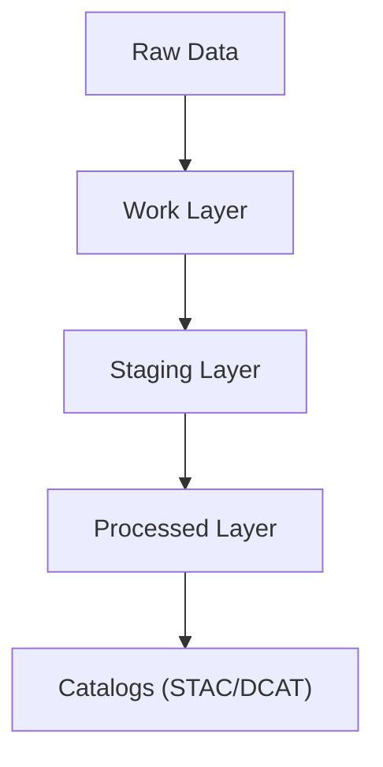

<div align="center">

# 🗄️ Kansas Frontier Matrix — **Data Architecture & Governance Overview**
`data/README.md`

**Purpose:**  
Document the **complete data lifecycle**, governance structure, and FAIR+CARE-compliant data layers within the **Kansas Frontier Matrix (KFM)**.  
Unify environmental, historical, and geospatial data into a **traceable, ethics-aligned, reproducible** system.

[](../docs/README.md)
[](../LICENSE)
[](../docs/standards/faircare-validation.md)
[]()
[]()

</div>

---

## 📘 Overview
The **Data Layer Architecture** defines how raw, processed, and AI-validated datasets are **structured, versioned, and governed** across KFM.  
It integrates **FAIR+CARE principles**, **ISO metadata**, and **STAC/DCAT 3.0** for discoverability and end-to-end provenance.

### Core Responsibilities
- Maintain **version-controlled** datasets under FAIR+CARE governance.  
- Support **reproducible** ETL and AI pipelines across domains.  
- Enforce **schema validation**, **checksum integrity**, and **provenance logging**.  
- Enable **Focus Mode** explainability and public **STAC/DCAT** cataloging.  

---

## 🧭 Data Architecture Framework


### Data Flow Summary
1. **Raw Layer:** Ingest unaltered data from trusted open sources and partners.  
2. **Work Layer:** Run ETL, AI reasoning, and validation with telemetry hooks.  
3. **Staging Layer:** Normalize schemas and prepare for governance certification.  
4. **Processed Layer:** Publish certified datasets with checksums and lineage.  
5. **Catalogs:** Expose datasets via **STAC** and **DCAT** for public discovery.

---

## 🗂️ Directory Layout
```plaintext
data/
├── README.md                        # This file — data architecture and governance overview
│
├── raw/                             # Unaltered source data (ingested snapshots)
├── work/                            # Operational layer for ETL, AI, validation
│   ├── tmp/                         # Transient workspace
│   ├── staging/                     # Schema-aligned, pending certification
│   └── processed/                   # Ready for release packaging
│
├── processed/                       # Public, certified datasets
├── reports/                         # Validation, governance, FAIR+CARE outputs
├── checksums/                       # SHA-256 manifests and integrity proofs
├── stac/                            # STAC collections and items (static catalog)
└── archive/                         # Long-term storage of certified releases
```

---

## 🧱 Data Layer Descriptions
| Layer | Description | Purpose |
|---|---|---|
| **Raw** | Direct downloads from original sources with source metadata. | Preserve transparency and original provenance. |
| **Work** | Active ETL, AI explainability, and validation space. | Transformation, audit, and metric collection. |
| **Staging** | Schema-aligned, pre-publication datasets under review. | FAIR+CARE compliance and governance certification. |
| **Processed** | Certified, published datasets with checksums. | Public distribution and stable citation targets. |
| **Reports** | FAIR+CARE, validation, AI governance, and telemetry outputs. | Accountability and reproducibility evidence. |
| **Checksums** | SHA-256 manifests per dataset and release. | Cryptographic integrity and traceability. |
| **STAC** | Geo-catalog linking datasets and assets. | Discovery, indexing, and machine interoperability. |
| **Archive** | Immutable store of certified releases. | Long-term reproducibility and rollback safety. |

---

## 🧩 Governance Integration (FAIR+CARE)
| Principle | Implementation | Verified By |
|---|---|---|
| **Findable** | Unique IDs, STAC/DCAT entries, cross-linked manifests & SBOMs. | `@kfm-data` |
| **Accessible** | Open licensing (CC-BY or MIT as applicable), machine-readable catalogs. | `@kfm-accessibility` |
| **Interoperable** | JSON, CSV, GeoJSON, Parquet; STAC 1.0, DCAT 3.0, ISO 19115. | `@kfm-architecture` |
| **Reusable** | Versioned datasets with schema and provenance hashes. | `@kfm-design` |
| **Collective Benefit** | Equitable public access to environmental & cultural data. | `@faircare-council` |
| **Authority to Control** | Council review of dataset certifications and deltas. | `@kfm-governance` |
| **Responsibility** | Audit trails link assets to checksums and governance logs. | `@kfm-security` |
| **Ethics** | Sensitive data review and redaction workflows. | `@kfm-ethics` |

**Governance logs:** `reports/audit/data_provenance_ledger.json`

---

## 🧠 Data Validation & Provenance Framework
| Process | Description | Output |
|---|---|---|
| **Schema Validation** | Enforce Data Contract v3 and domain schemas. | `reports/validation/schema_validation_summary.json` |
| **Checksum Verification** | Compute and verify SHA-256 across layers. | `checksums/manifest.json` |
| **FAIR+CARE Audit** | Ethics, accessibility, and reuse compliance. | `reports/fair/faircare_summary.json` |
| **AI Explainability** | Link AI outputs to XAI logs and scores. | `reports/audit/ai_validation_ledger.json` |
| **Governance Registration** | Record certified datasets in ledgers. | `reports/audit/data_provenance_ledger.json` |

---

## 📊 Example Data Governance Record
```json
{
  "id": "work_hazards_v10.0.0",
  "domain": "hazards",
  "records_processed": 26104,
  "checksum_verified": true,
  "fairstatus": "certified",
  "schema_version": "v3.1.0",
  "ai_explainability_score": 0.992,
  "governance_registered": true,
  "ledger_ref": "data/reports/audit/data_provenance_ledger.json",
  "timestamp": "2025-11-09T19:25:00Z"
}
```

---

## ⚙️ Data Quality & Sustainability Metrics
| Metric | Target | Verified By |
|---|---|---|
| Schema Conformance | ≥ 99% | `@kfm-validation` |
| FAIR+CARE Certification | 100% | `@faircare-council` |
| Provenance Retention | Permanent | `@kfm-governance` |
| Dataset Reusability | ≥ 95% | `@kfm-data` |
| Energy Efficiency | ≤ 18 Wh per ETL run | `@kfm-sustainability` |

**Telemetry rollup:** `../releases/v10.0.0/focus-telemetry.json`

---

## 🌱 Sustainable Data Practices
| Practice | Description | Compliance |
|---|---|---|
| **Immutable Governance Logs** | Cryptographically verified and permanent ledger entries. | ISO 37000 |
| **Renewable Compute** | Pipelines run on RE100-compliant infrastructure. | ISO 14064 |
| **Open Data Licensing** | CC-BY 4.0 for docs/data; MIT for code artifacts. | FAIR+CARE |
| **Ethical Redaction** | CARE-aligned workflows for culturally sensitive content. | CARE Principles |

---

## 🧾 Internal Use Citation
```text
Kansas Frontier Matrix (2025). Data Architecture & Governance Overview (v10.0.0).
Defines the multi-layered, FAIR+CARE-certified data management framework for Kansas Frontier Matrix.
Ensures transparency, reproducibility, and ethical data stewardship across environmental, spatial, and historical domains.
```

---

## 🕰️ Version History
| Version | Date | Author | Summary |
|---|---|---|---|
| v10.0.0 | 2025-11-09 | `@kfm-data` | Upgraded to v10: streaming STAC support, governance & telemetry schema v2, sustainability targets tightened. |
| v9.7.0 | 2025-11-06 | `@kfm-data` | Telemetry paths refreshed; sustainability targets aligned. |
| v9.6.0 | 2025-11-03 | `@kfm-data` | Telemetry-linked FAIR+CARE auditing added. |
| v9.5.0 | 2025-11-02 | `@kfm-data` | Energy efficiency and checksum validation metrics added. |
| v9.3.2 | 2025-10-28 | `@kfm-core` | Established baseline data governance structure and STAC integration. |

---

<div align="center">

**Kansas Frontier Matrix**  
*FAIR+CARE Data Ethics × Provenance Transparency × Sustainable Stewardship*  
© 2025 Kansas Frontier Matrix — CC-BY 4.0  

[Back to Docs Index](../docs/README.md) · [Governance Charter](../docs/standards/governance/DATA-GOVERNANCE.md) · [FAIR+CARE Summary](reports/fair/faircare_summary.json)

</div>