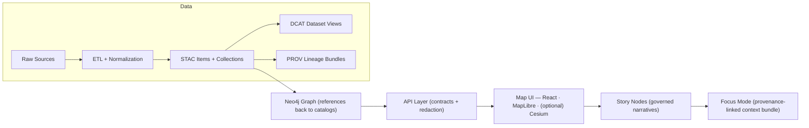

# 📦 `data/` — Kansas Frontier Matrix (KFM) Data & Metadata Hub


> ✅ **Purpose:** `data/` is the canonical home for **raw inputs**, **intermediate work**, **published/processed outputs**, and the **required metadata boundary artifacts** (STAC/DCAT/PROV) that make KFM traceable, governed, and shippable. [^staging]  
> ⚠️ **Rule:** If it isn’t **cataloged + provenance-linked**, it isn’t “published” in KFM. [^provenance-first]

---

## 🧭 Quick Nav
- [🚦 Non‑negotiables](#-non-negotiables)
- [🗂️ Directory layout](#️-directory-layout)
- [🔁 Data lifecycle](#-data-lifecycle)
- [🏷️ Metadata boundary artifacts](#️-metadata-boundary-artifacts)
- [🧾 Evidence artifacts](#-evidence-artifacts)
- [🧬 Versioning](#-versioning)
- [📐 Conventions](#-conventions)
- [🧪 Validation & CI gates](#-validation--ci-gates)
- [➕ Adding a new dataset / domain](#-adding-a-new-dataset--domain)
- [🛠️ Toolchain](#️-toolchain)
- [📚 Reference library](#-reference-library)

---

## 🧠 KFM Pipeline Snapshot (data → story)
KFM enforces a strict ordering from data → catalogs → graph → API → UI → narrative, ensuring traceability end-to-end. [^pipeline-diagram]



---

## 🚦 Non‑negotiables
These invariants keep the platform consistent and governed:

- **Pipeline ordering is absolute:** `ETL → Catalogs (STAC/DCAT/PROV) → Graph → API → UI → Story Nodes → Focus Mode`. [^pipeline-order]
- **API boundary rule:** UI never queries Neo4j directly; all access goes through the governed API layer (enforces access control + redaction). [^api-boundary]
- **Deterministic, idempotent ETL:** config-driven, repeatable runs with stable IDs/hashes and logging for reproducibility. [^deterministic-etl]
- **Evidence-first narrative:** Story Nodes/Focus Mode must cite evidence; AI outputs must be labeled and provenance-linked. [^evidence-first]
- **Sovereignty & classification propagation:** outputs cannot be **less restricted** than inputs without approved redaction/handling. [^sovereignty]

---

## 🗂️ Directory layout
KFM’s required staging and boundary artifacts:

```text
data/
  raw/                      # 1) Raw, minimally transformed source inputs (per domain)
    <domain>/
      ...                   # preserve source structure as much as practical

  work/                     # 2) Intermediate artifacts produced during ETL (per domain)
    <domain>/
      ...

  processed/                # 3) Final, publishable outputs (per domain)
    <domain>/
      ...                   # e.g., analysis outputs, tiles, derived rasters/vectors, feature tables

  stac/                     # Required: STAC catalog artifacts
    collections/            # STAC Collections (dataset-level)
    items/                  # STAC Items (asset-level)

  catalog/
    dcat/                   # Required: DCAT JSON-LD dataset entries

  prov/                     # Required: PROV lineage bundles (inputs → activities → outputs)
```

> This staged layout is required (raw → work → processed), and publishing requires STAC/DCAT/PROV artifacts in their canonical locations. [^staging]

---

## 🔁 Data lifecycle
KFM’s data pipeline is conceptualized in stages and can be **batch** or **streaming** depending on the source. [^kfm-pipeline-overview]

### 1) Ingestion (Extract)
- Scheduled batch ingest (e.g., daily imagery, weekly reports) via schedulers like cron/Airflow. [^kfm-ingestion]
- Streaming ingest (e.g., sensor readings) via brokers/protocols (MQTT/HTTP ingest endpoints), validating + timestamping quickly. [^kfm-ingestion]
- Manual uploads (expert-provided CSVs, surveys) into a staging area with controlled import. [^kfm-ingestion]
- **Raw-first principle:** store raw inputs with minimal transformations to preserve a reprocessing baseline (e.g., archive incoming GeoTIFFs with date/region naming). [^raw-first]

### 2) Processing (Transform)
This is where value is added: cleaning, joining, deriving metrics, running models/simulations.
- Prefer “compute close to data” where appropriate (e.g., PostGIS spatial SQL). [^postgis-processing]
- Support scalable processing (Spark/Dask) for very large spatiotemporal archives. [^postgis-processing]
- Shell scripts and command-line tools are valid “glue” for reproducible pipelines (e.g., `ogr2ogr`, `raster2pgsql`). [^postgis-processing]

### 3) Storage (Load) & Indexing
Processed outputs land in:
- **Structured stores** (tables optimized for query patterns, including spatial indices). [^storage]
- **Geospatial stores/files** for imagery + map layers (GeoTIFF/tiles), including **tile pyramids** for efficient web serving. [^storage]

### 4) Publication / Serving
- Frontend requests go through the API, which retrieves from databases or stable file/tiles storage and returns map layers or URLs. [^serve-frontend]
- Event-driven workflows (queues/topics) can publish “new data available” signals for downstream processors. [^event-driven]

---

## 🏷️ Metadata boundary artifacts
Before data is considered “published,” KFM requires “boundary artifacts” that downstream stages consume (graph/API/UI). [^boundary-artifacts]

### ✅ Required metadata outputs
- **STAC (Collections + Items)** for geospatial assets (and consistent collection records even for some non-spatial datasets). [^stac-dcat-prov]
- **DCAT dataset entry** (JSON-LD) for discovery: title/description/license/keywords/distributions. [^stac-dcat-prov]
- **PROV lineage bundle** capturing inputs → processing activities → outputs with configs/params and run identifiers. [^prov-end-to-end]

### 🔗 Cross-layer linkage expectations (don’t break these)
- STAC Items must link to the actual stable assets (often in `data/processed/**`). [^stac-links]
- DCAT should link to STAC and/or direct downloads. [^dcat-links]
- PROV must link raw → work → processed and record run/config identifiers. [^prov-end-to-end]
- Graph stores references to catalog IDs rather than duplicating bulky payloads. [^graph-references]

---

## 🧾 Evidence artifacts
KFM treats **analysis outputs** (including AI-generated artifacts and simulations) as first-class datasets that must be stored + cataloged + provenance-linked. [^evidence-artifacts]

Evidence artifacts must be:
- Stored in `data/processed/...` (domain or project subfolder). [^evidence-artifacts]
- Cataloged in STAC/DCAT and labeled as derived/AI-generated as needed. [^evidence-artifacts]
- Traced in PROV with inputs, method/model, parameters, and confidence/uncertainty where applicable. [^evidence-artifacts]
- Exposed only via governed APIs (enforcing classification and redaction). [^evidence-artifacts]

---

## 🧬 Versioning
KFM is versioned at both dataset and system levels. [^versioning]

- **Dataset versioning:** link revisions using DCAT + PROV (e.g., `prov:wasRevisionOf`). Prefer persistent identifiers (DOI/ARK) for published versions. [^versioning]
- **Graph & ontology versioning:** keep backward compatibility unless a deliberate migration occurs. [^versioning]
- **API versioning:** breaking changes require versioned endpoints or negotiated deprecation strategy; OpenAPI/GraphQL schemas are contracts. [^versioning]
- **Release versioning:** repo releases follow semantic versioning; major versions reflect structural changes (e.g., v13). [^versioning]

---

## 📐 Conventions

### 🧾 File naming (recommended)
Use names that support reproducibility and routing:
- `"<domain>__<dataset>__<yyyymmdd or yyyymm>__<crs>__<resolution>__v<major.minor>.<ext>"`
- Example: `agriculture__ndvi__20250301__epsg4326__30m__v1.0.tif`

### 🌍 CRS & units (recommended)
- Store CRS explicitly in geospatial files and metadata.
- Keep units consistent and document conversions in PROV/configs (especially for time-series and model features).

### 🗺️ Web serving friendly assets
- For web maps, prefer publishable outputs in web-friendly formats (tiles, simplified vectors).
- When committing sample vectors (e.g., GeoJSON) for demos, remember public repos imply public downloads (don’t leak sensitive data). [^geojson-privacy]

### 🗃️ Databases (when relevant)
PostGIS enables spatial storage + analysis close to data (buffers, within, distance, joins, etc.). [^postgis-intro]

---

## 🧪 Validation & CI gates
KFM expects automated validation and governance checks to prevent regressions and sensitive leaks. [^ci-gates]

Typical gates include:
- Markdown/front-matter validation for governed docs.
- Schema validation for STAC/DCAT/PROV outputs.
- Graph integrity tests for ontology constraints.
- API contract tests (OpenAPI/GraphQL).
- Secret scanning, PII/sensitive data scanning, and classification-consistency checks (no “downgrades” in restriction without approved steps). [^ci-gates]

---

## ➕ Adding a new dataset / domain
Follow the domain expansion pattern and keep domains isolated. [^domain-expansion]

### ✅ Checklist
- [ ] Create domain folders:
  - [ ] `data/raw/<new-domain>/`
  - [ ] `data/work/<new-domain>/`
  - [ ] `data/processed/<new-domain>/`  [^staging]
- [ ] Add/confirm ETL pipeline config (idempotent, logged, hashable). [^deterministic-etl]
- [ ] Produce boundary artifacts:
  - [ ] STAC Collection + Item(s) → `data/stac/...` [^staging]
  - [ ] DCAT entry → `data/catalog/dcat/...` [^staging]
  - [ ] PROV lineage → `data/prov/...` [^staging]
- [ ] Validate schemas + links in CI (no broken references). [^ci-gates]
- [ ] (If needed) Load references into graph **after** catalogs exist; don’t duplicate raw payloads in graph. [^graph-references]
- [ ] Expose via governed API (redaction/classification). [^api-boundary]
- [ ] Create/Update domain runbook: `docs/data/<new-domain>/README.md`. [^domain-expansion]

---

## 🛠️ Toolchain
KFM’s data layer is meant to interoperate across geospatial + ML + simulation + web delivery:

- 🐍 **Python geospatial stack:** geopandas/rasterio/pyproj + PostGIS integrations
- 🐘 **PostgreSQL + PostGIS:** spatial SQL for analysis and query performance [^postgis-intro]
- 🧰 **CLI tooling:** `ogr2ogr`, `raster2pgsql`, shell automation for repeatable jobs [^postgis-processing]
- 🧩 **Workflow orchestration:** cron/Airflow-style scheduling for batch + dependency graphs [^postgis-processing]
- 🌐 **Serving layer:** governed API returns JSON/tiles/layers to the map UI [^serve-frontend]
- 🗺️ **Frontend visualization:** React + MapLibre, with optional Cesium for 3D views [^pipeline-diagram]

---

## 📚 Reference library
These are the primary project documents and learning references used to shape KFM’s data standards and workflows.

### 🧱 Core system + pipeline standards
- KFM Technical Documentation  [oai_citation:0‡Kansas Frontier Matrix (KFM) – Comprehensive Technical Documentation.pdf](file-service://file-Bro83fTiCi9UUVVno1fL6L)  [oai_citation:1‡Kansas Frontier Matrix (KFM) – Comprehensive Technical Documentation.pdf](file-service://file-Bro83fTiCi9UUVVno1fL6L)
- KFM Master Guide v13 (Draft) / Markdown Guide  [oai_citation:2‡MARKDOWN_GUIDE_v13.md.gdoc](file-service://file-UYVruFXfueR8veHMUKeugU)  [oai_citation:3‡MARKDOWN_GUIDE_v13.md.gdoc](file-service://file-UYVruFXfueR8veHMUKeugU)

### 🗺️ GIS + Geoprocessing
- GIS Basics  [oai_citation:4‡Geographic Information System Basics - geographic-information-system-basics.pdf](file-service://file-Kjn2enYFqXQtK3J4zN2DWz)
- Python Geospatial Analysis Cookbook  [oai_citation:5‡python-geospatial-analysis-cookbook.pdf](file-service://file-HT14njz1MhrTZCE7Pwm5Cu)  [oai_citation:6‡python-geospatial-analysis-cookbook.pdf](file-service://file-HT14njz1MhrTZCE7Pwm5Cu)  [oai_citation:7‡KFM- python-geospatial-analysis-cookbook-over-60-recipes-to-work-with-topology-overlays-indoor-routing-and-web-application-analysis-with-python.pdf](file-service://file-2gpiGDZS8iw6EdxGswEdHp)
- Making Maps (Map Design)  [oai_citation:8‡geoprocessing-with-python.pdf](file-service://file-NkXrdB4FwTruwhQ9Ggn53T)
- Google Maps API Succinctly  [oai_citation:9‡making-maps-a-visual-guide-to-map-design-for-gis.pdf](file-service://file-51FgWTn7uFXenxztXw29bP)
- Google Maps JavaScript API Cookbook  [oai_citation:10‡google-maps-javascript-api-cookbook.pdf](file-service://file-6w897pmf6KhF1cHXFQ1zdf)
- WebGL Programming Guide  [oai_citation:11‡webgl-programming-guide-interactive-3d-graphics-programming-with-webgl.pdf](file-service://file-7Nd7iS68ES97NmWhPiRWTP)

### 🛰️ Remote sensing + Earth Engine
- Cloud-Based Remote Sensing with Google Earth Engine  [oai_citation:12‡Cloud-Based Remote Sensing with Google Earth Engine-Fundamentals and Applications.pdf](file-service://file-CXGLTw8wpR4uKWWqjrGkyk)
- Google Earth Engine Applications  [oai_citation:13‡Google Earth Engine Applications.pdf](file-service://file-SmoZrQ3nZSAdHHNqcVzYCq)

### 🧠 ML / Data Science / Statistics
- Applied Data Science with Python + Jupyter  [oai_citation:14‡applied-data-science-with-python-and-jupyter.pdf](file-service://file-2PdBHtR24Wq7MYWfG8agQo)
- Data Science & Machine Learning (Math & Stats Methods)  [oai_citation:15‡Data Science &-  Machine Learning (Mathematical & Statistical Methods).pdf](file-service://file-MRNb2uGPEwpkSDsxF983PC)
- Regression Analysis with Python  [oai_citation:16‡clean-architectures-in-python.pdf](file-service://file-1TQxhq5hmghD898tCZcdJu)
- Understanding Statistics & Experimental Design  [oai_citation:17‡graphical-data-analysis-with-r.pdf](file-service://file-K7oxq5mFmdE9HrPPev6c7L)
- Statistics Done Wrong  [oai_citation:18‡Understanding Statistics & Experimental Design.pdf](file-service://file-SdX6LMgi1uDRk5kd4H4Bg3)
- Bayesian Computational Methods  [oai_citation:19‡responsive-web-design-with-html5-and-css3.pdf](file-service://file-Heg28TVM2nReDYTQ7nPhAK)
- Deep Learning in Python (Prereqs)  [oai_citation:20‡Statistics Done Wrong - Alex_Reinhart-Statistics_Done_Wrong-EN.pdf](file-service://file-THLZMx2BnXCR4bvvPJsMQm)
- AI Foundations of Computational Agents (3rd Ed.)  [oai_citation:21‡AI Foundations of Computational Agents 3rd Ed.pdf](file-service://file-BYuPtX8r1doBaqdetoMxC7)

### 🏗️ Architecture + DevOps + Backend
- Clean Architectures in Python  [oai_citation:22‡clean-architectures-in-python.pdf](file-service://file-6YHot4AqfpdbcrdfiYfpHM)
- Implementing Programming Languages  [oai_citation:23‡implementing-programming-languages-an-introduction-to-compilers-and-interpreters.pdf](file-service://file-JaNsY7yoyJTAzMJSwt9LDA)
- Node.js Notes for Professionals  [oai_citation:24‡Node.js Notes for Professionals - NodeJSNotesForProfessionals.pdf](file-service://file-9qS1yEFvCBXbDdtTfpt3Ye)
- PostgreSQL Notes for Professionals  [oai_citation:25‡PostgreSQL Notes for Professionals - PostgreSQLNotesForProfessionals.pdf](file-service://file-742sw3gADJniEdmC19JeAC)
- MySQL Notes for Professionals  [oai_citation:26‡MySQL Notes for Professionals - MySQLNotesForProfessionals.pdf](file-service://file-GQ5jWwmLZCFb6enxwykaRh)
- Introduction to Docker  [oai_citation:27‡Introduction-to-Docker.pdf](file-service://file-5SALje8G4GDUXHUM3P3LuU)
- Command Line Kung Fu (Shell)  [oai_citation:28‡AI Foundations of Computational Agents 3rd Ed.pdf](file-service://file-BYuPtX8r1doBaqdetoMxC7)

### ⚖️ Ethics + Human-centered constraints
- Introduction to Digital Humanism  [oai_citation:29‡Introduction to Digital Humanism.pdf](file-service://file-HC311tLjkcn1yRbyTBLJQQ)
- Principles of Biological Autonomy  [oai_citation:30‡Principles of Biological Autonomy - book_9780262381833.pdf](file-service://file-PwPXcX5554FpuRsF3iXTCf)  [oai_citation:31‡Principles of Biological Autonomy - book_9780262381833.pdf](file-service://file-PwPXcX5554FpuRsF3iXTCf)

---

## 🧷 Footnotes / Evidence (source grounding)
[^pipeline-diagram]: Diagram of the KFM pipeline including Map UI stack and Focus Mode linkage. [oai_citation:32‡MARKDOWN_GUIDE_v13.md.gdoc](file-service://file-UYVruFXfueR8veHMUKeugU)
[^staging]: Required staging + catalog output locations: `data/raw/<domain>` → `data/work/<domain>` → `data/processed/<domain>`, plus STAC/DCAT/PROV outputs in canonical folders. [oai_citation:33‡MARKDOWN_GUIDE_v13.md.gdoc](file-service://file-UYVruFXfueR8veHMUKeugU)
[^pipeline-order]: “Pipeline ordering is absolute” invariant statement. [oai_citation:34‡MARKDOWN_GUIDE_v13.md.gdoc](file-service://file-UYVruFXfueR8veHMUKeugU)
[^api-boundary]: API boundary rule (UI must not query the graph directly; governed API enforces controls/redaction). [oai_citation:35‡MARKDOWN_GUIDE_v13.md.gdoc](file-service://file-UYVruFXfueR8veHMUKeugU)
[^provenance-first]: Provenance-first publishing requirement (STAC/DCAT + PROV before graph/UI/story usage). [oai_citation:36‡MARKDOWN_GUIDE_v13.md.gdoc](file-service://file-UYVruFXfueR8veHMUKeugU)
[^deterministic-etl]: Deterministic, idempotent, config-driven ETL with fully logged runs + hashes/stable IDs. [oai_citation:37‡MARKDOWN_GUIDE_v13.md.gdoc](file-service://file-UYVruFXfueR8veHMUKeugU)
[^evidence-first]: Evidence-first narrative rule + AI labeling and provenance/confidence requirements. [oai_citation:38‡MARKDOWN_GUIDE_v13.md.gdoc](file-service://file-UYVruFXfueR8veHMUKeugU)
[^sovereignty]: Sovereignty/classification propagation (no derivative less restricted than inputs; UI safeguards). [oai_citation:39‡MARKDOWN_GUIDE_v13.md.gdoc](file-service://file-UYVruFXfueR8veHMUKeugU)
[^boundary-artifacts]: Boundary artifacts required before publication (STAC/DCAT/PROV as interfaces to downstream stages). [oai_citation:40‡MARKDOWN_GUIDE_v13.md.gdoc](file-service://file-UYVruFXfueR8veHMUKeugU)
[^evidence-artifacts]: Evidence artifact handling requirements (store, catalog, PROV trace, governed API exposure). [oai_citation:41‡MARKDOWN_GUIDE_v13.md.gdoc](file-service://file-UYVruFXfueR8veHMUKeugU)
[^stac-dcat-prov]: STAC/DCAT/PROV alignment policy (required metadata records + profile validation). [oai_citation:42‡MARKDOWN_GUIDE_v13.md.gdoc](file-service://file-UYVruFXfueR8veHMUKeugU)
[^stac-links]: STAC Items must point to stable data assets (often `data/processed/**`) and include attribution/license. [oai_citation:43‡MARKDOWN_GUIDE_v13.md.gdoc](file-service://file-UYVruFXfueR8veHMUKeugU)
[^dcat-links]: DCAT entries should link to STAC/distributions for discovery and access. [oai_citation:44‡MARKDOWN_GUIDE_v13.md.gdoc](file-service://file-UYVruFXfueR8veHMUKeugU)
[^prov-end-to-end]: PROV must link raw → work → processed and identify pipeline run/config identifiers. [oai_citation:45‡MARKDOWN_GUIDE_v13.md.gdoc](file-service://file-UYVruFXfueR8veHMUKeugU)
[^graph-references]: Graph should reference catalog IDs rather than storing bulky payloads; graph models relationships. [oai_citation:46‡MARKDOWN_GUIDE_v13.md.gdoc](file-service://file-UYVruFXfueR8veHMUKeugU)
[^versioning]: Dataset/graph/API/release versioning expectations (incl. `prov:wasRevisionOf` and semantic versioning). [oai_citation:47‡MARKDOWN_GUIDE_v13.md.gdoc](file-service://file-UYVruFXfueR8veHMUKeugU)
[^kfm-pipeline-overview]: KFM pipeline stages overview (Ingestion → Processing → Storage → Publication/Serving) and batch/streaming framing. [oai_citation:48‡Kansas Frontier Matrix (KFM) – Comprehensive Technical Documentation.pdf](file-service://file-Bro83fTiCi9UUVVno1fL6L)
[^kfm-ingestion]: Ingestion modes: scheduled batch (cron/Airflow), streaming ingest (MQTT/HTTP), manual uploads; examples including GEE API usage. [oai_citation:49‡Kansas Frontier Matrix (KFM) – Comprehensive Technical Documentation.pdf](file-service://file-Bro83fTiCi9UUVVno1fL6L)
[^raw-first]: “Store raw data reliably first” principle (keep raw as possible; name/tag raw GeoTIFFs before processing). [oai_citation:50‡Kansas Frontier Matrix (KFM) – Comprehensive Technical Documentation.pdf](file-service://file-Bro83fTiCi9UUVVno1fL6L)
[^event-driven]: Event-driven approach with queues/topics for async processing and resilience (e.g., new imagery triggers). [oai_citation:51‡Kansas Frontier Matrix (KFM) – Comprehensive Technical Documentation.pdf](file-service://file-Bro83fTiCi9UUVVno1fL6L)
[^serve-frontend]: High-level flow: ingest → process → store/index → serve via API to frontend (fast queries due to preprocessing/indexing). [oai_citation:52‡Kansas Frontier Matrix (KFM) – Comprehensive Technical Documentation.pdf](file-service://file-Bro83fTiCi9UUVVno1fL6L)
[^postgis-processing]: Processing options including PostGIS queries, distributed processing, shell tooling, and Airflow DAG orchestration example. [oai_citation:53‡Kansas Frontier Matrix (KFM) – Comprehensive Technical Documentation.pdf](file-service://file-Bro83fTiCi9UUVVno1fL6L)
[^storage]: Storage outcomes include relational tables with indices and geospatial stores; tile pyramids are used for efficient raster serving. [oai_citation:54‡Kansas Frontier Matrix (KFM) – Comprehensive Technical Documentation.pdf](file-service://file-Bro83fTiCi9UUVVno1fL6L)
[^postgis-intro]: PostGIS described as a spatial database enabling complex spatial analysis functions for vectors and rasters; used for answering spatial questions efficiently. [oai_citation:55‡KFM- python-geospatial-analysis-cookbook-over-60-recipes-to-work-with-topology-overlays-indoor-routing-and-web-application-analysis-with-python.pdf](file-service://file-2gpiGDZS8iw6EdxGswEdHp)
[^geojson-privacy]: Note that quick GeoJSON visualization on public GitHub makes data downloadable/public; private repos keep data private (privacy/sensitivity consideration). [oai_citation:56‡KFM- python-geospatial-analysis-cookbook-over-60-recipes-to-work-with-topology-overlays-indoor-routing-and-web-application-analysis-with-python.pdf](file-service://file-2gpiGDZS8iw6EdxGswEdHp)
[^ci-gates]: CI validation expectations including schema validation, link checks, and security/governance scans (secrets, PII, classification consistency). [oai_citation:57‡MARKDOWN_GUIDE_v13.md.gdoc](file-service://file-UYVruFXfueR8veHMUKeugU)
[^domain-expansion]: Domain expansion pattern: raw/work/processed per domain, publish to catalogs, and maintain a domain README under `docs/data/<domain>/`. [oai_citation:58‡MARKDOWN_GUIDE_v13.md.gdoc](file-service://file-UYVruFXfueR8veHMUKeugU)