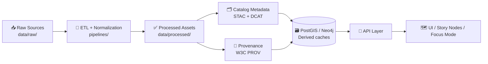

# 📦 `data/` — Versioned Datasets, Metadata, & Provenance (KFM)


Welcome to the **canonical source-of-truth** for Kansas Frontier Matrix (KFM) datasets 🗺️  
This folder is **not “just a dump of files”** — it’s a *provenance-first* data vault where **every processed layer is traceable back to raw sources** and **discoverable via catalogs**.

> ✅ **Core rule:** If it’s used by the system, it must be **(1) processed**, **(2) cataloged**, and **(3) provenance-linked**.  
> ⛔ Anything missing metadata / lineage is considered **not publishable**.

---

## 🧭 Quick Nav

- [📁 Folder layout](#-folder-layout)
- [🔁 Data lifecycle](#-data-lifecycle)
- [🧱 What goes where](#-what-goes-where)
- [✅ Publishing checklist](#-publishing-checklist)
- [🏷️ Dataset naming & conventions](#️-dataset-naming--conventions)
- [🧾 STAC / DCAT / PROV expectations](#-stac--dcat--prov-expectations)
- [📦 Handling large files](#-handling-large-files)
- [🧪 Example: dataset “bundle”](#-example-dataset-bundle)
- [📚 Further reading](#-further-reading)

---

## 📁 Folder layout

> The goal is to make data **diffable**, **reviewable**, and **rebuildable** — like code.

```text
📦 data/
├─ 📁 raw/                      # Immutable source snapshots (evidence) 🧾
│  └─ 📁 <domain>/              # e.g., census_1900/, usgs_water/, historical_maps/
│
├─ 🧪 (optional) 📁 work/        # Intermediate artifacts (pipelines may write here)
│  └─ 📁 <domain>/
│
├─ ✅ 📁 processed/              # Curated outputs used by DB/API/UI
│  └─ 📁 <domain>/              # e.g., census/, weather/, land_treaties/
│
├─ 🗂️ 📁 catalog/               # Discovery metadata (machine-readable)
│  ├─ 📁 stac/                   # STAC Collections + Items
│  │  ├─ 📁 collections/
│  │  └─ 📁 items/
│  └─ 📁 dcat/                   # DCAT dataset records (JSON-LD / TTL)
│
├─ 🧬 📁 provenance/             # Lineage logs (W3C PROV bundles)
│
└─ 🧱 (optional) 📁 external/    # Pointers/manifests for large assets (S3/LFS/etc.)
```

> 💡 If your repo doesn’t currently include `work/`, treat it as a **recommended staging area**.  
> Pipelines can also use ephemeral temp directories — but provenance should still *reference* intermediate steps when relevant.

---

## 🔁 Data lifecycle



**Key idea:** Databases are **derivative performance caches**, not the authoritative store.  
If a DB is wiped, it should be rebuildable from `data/processed/` + metadata.

---

## 🧱 What goes where

### 🧾 `raw/` (immutable “evidence”)
- Exact snapshots from original sources (ZIPs, CSVs, shapefiles, PDFs, etc.)
- **Never edited by pipelines**
- If something is wrong with a raw source:
  - Prefer adding a corrected *new* snapshot (or replacing via Git history) + documenting it in metadata/provenance

✅ Good:
- `data/raw/census_1900/census_1900.csv`
- `data/raw/historical_maps/1930_county_map.pdf`

⛔ Not allowed:
- “Fixing” typos in a raw CSV by hand without recording a new snapshot + provenance

---

### ✅ `processed/` (curated “ready to use” outputs)
- Cleaned, standardized, analysis-ready products
- What the platform ultimately serves (directly or via DB loading scripts)
- Prefer **open formats** and **review-friendly diffs** (more below)

✅ Good:
- `data/processed/census/1900_population.geojson`
- `data/processed/weather/daily_rainfall.parquet`
- `data/processed/imagery/landsat_2010_kansas.tif` (may be pointer-managed if huge)

---

### 🗂️ `catalog/` (make data *findable*)
KFM uses:
- **STAC** for spatial/temporal asset metadata (collections + items)
- **DCAT** for higher-level dataset discovery entries

The catalog should enable queries like:
- “wheat yields in the 1930s”
- “precipitation time series for western Kansas”

---

### 🧬 `provenance/` (make data *trustworthy*)
Provenance records should answer:
- **What inputs produced this output?**
- **Which pipeline + parameters were used?**
- **When did it run, and under what version/commit?**
- **Who/what ran it (agent)?**

If a dataset has no provenance record, treat it as a 🚩 red flag.

---

## ✅ Publishing checklist

When adding or updating a dataset, a PR is only “done” when **all** items below are complete:

- [ ] 📥 Raw snapshot stored under `data/raw/<domain>/...` (or referenced if externally hosted)
- [ ] 🧼 Pipeline exists/updated under `pipelines/` and is **deterministic**
- [ ] ✅ Outputs written to `data/processed/<domain>/...`
- [ ] 🗂️ STAC Collection + Item(s) created/updated (links to assets + provenance)
- [ ] 🗂️ DCAT record created/updated (title, description, license, keywords, distributions)
- [ ] 🧬 PROV bundle created/updated (raw → work → processed, agents, timestamps, parameters)
- [ ] ⚖️ License clearly declared (and compatible with repo policy)
- [ ] 🧪 Validation passes (schemas, geometry validity, required fields, metadata completeness)
- [ ] 🔍 PR review includes **data diffs + metadata diffs** (not just code)

> 🧯 Governance note: KFM is designed to **fail closed**. If metadata/license/provenance is missing, CI should block merge.

---

## 🏷️ Dataset naming & conventions

### 📛 Domain folders
Use `snake_case` domain names that match the real-world theme/source:
- `census`, `weather`, `land_treaties`, `railroads`, `soil`, `historical_maps`

### 🧩 Dataset IDs (recommended)
A stable dataset identifier keeps catalogs + provenance + narratives aligned:
- `dataset_id`: `kfm.<domain>.<topic>.<version_or_year>`

Example:
- `kfm.census.population.1900`
- `kfm.weather.precip.daily.v1`

### 🗺️ Spatial reference & units
- Prefer a **common coordinate system** across processed layers unless there’s a strong reason not to.
- Explicitly document:
  - CRS / EPSG
  - Units
  - Null conventions
  - Timezone / temporal resolution (for time series)

---

## 🧾 STAC / DCAT / PROV expectations

### 🗂️ STAC (spatiotemporal asset metadata)
A STAC Item typically includes:
- bbox / geometry
- datetime or start/end
- keywords + providers
- license
- links to:
  - the processed asset
  - the provenance bundle

Recommended structure:
- `data/catalog/stac/collections/<collection_id>.json`
- `data/catalog/stac/items/<item_id>.json`

---

### 🗂️ DCAT (dataset discovery metadata)
DCAT record should minimally include:
- title + description
- license
- keywords/tags
- distributions (links to STAC entry and/or direct asset)

Recommended structure:
- `data/catalog/dcat/<dataset_id>.jsonld`

---

### 🧬 PROV (lineage + reproducibility)
A provenance bundle should capture:
- **Entities:** raw inputs, intermediate artifacts, processed outputs
- **Activities:** pipeline run(s), parameters, transformations
- **Agents:** script + version, and (when relevant) human trigger

Recommended structure:
- `data/provenance/<dataset_id>.prov.json`

> 💡 Bonus: include pipeline Git commit SHA in the PROV activity so future reruns are reproducible.

---

## 📦 Handling large files

Some geospatial assets get big fast (rasters, point clouds, dense time series). KFM’s stance:

- ✅ Small–medium files: store directly in Git (diff-friendly when possible)
- 🧱 Large binaries: store via one of these patterns:
  1) **Git LFS** pointer files  
  2) **External object storage** (S3/Blob) + a **recorded checksum/hash** in-repo  
  3) Chunked, diffable formats (e.g., line-delimited GeoJSON) when feasible

Recommended:
- Keep a manifest under `data/external/` that records:
  - asset logical name
  - storage location
  - size
  - checksum (sha256)
  - retrieval method

---

## 🧪 Example: dataset bundle

Let’s say we’re adding a historical census extract:

```text
data/
├─ raw/
│  └─ census_1900/
│     └─ census_1900.csv
│
├─ processed/
│  └─ census/
│     └─ 1900_population.geojson
│
├─ catalog/
│  ├─ stac/
│  │  ├─ collections/
│  │  │  └─ kfm.census.population.json
│  │  └─ items/
│  │     └─ kfm.census.population.1900.json
│  └─ dcat/
│     └─ kfm.census.population.1900.jsonld
│
└─ provenance/
   └─ kfm.census.population.1900.prov.json
```

✅ Now the dataset is:
- **Usable** (processed file exists)
- **Findable** (STAC/DCAT records exist)
- **Auditable** (PROV exists)

---

## 📚 Further reading

These project references strongly influenced how `data/` is organized:

- 📘 *Kansas Frontier Matrix (KFM) – Comprehensive Technical Blueprint* (data storage, catalogs, provenance, governance)
- 🧭 *MARKDOWN_GUIDE_v13* (STAC/DCAT/PROV alignment policy, CI gating, lifecycle diagrams)
- 🧠 *Data Spaces* (why governance + trustworthy data ecosystems matter)
- 🛰️ *Cloud-Based Remote Sensing with Google Earth Engine* (remote sensing workflows & dataset patterns)
- ⏳ *Visualization of Time-Oriented Data* (spatiotemporal/time-series analysis & visualization ideas)

---