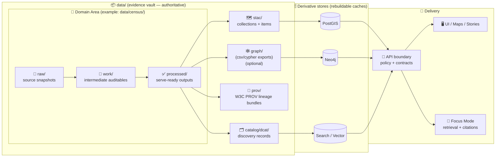

<div align="center">

<!-- 🚧 UNDER CONSTRUCTION -->
<picture>
  <source media="(prefers-reduced-motion: reduce)" srcset="../docs/assets/kfm-seal-320.png">
  
</picture>

<br/>

# 📦 `data/` — Evidence Vault, Versioned Datasets, Catalogs, & Provenance 🗺️🧾

**KFM’s canonical source-of-truth for everything that powers maps, stories, and Focus Mode — traceable end-to-end.**  
<sub><em>“The map behind the map” — every layer has receipts.</em></sub>

<br/>


<br/>

<a href="#-quick-nav">🧭 Quick Nav</a> •
<a href="#-kfm-invariant-the-truth-path-is-non-negotiable">🧱 Truth Path</a> •
<a href="#-folder-layout-v13-canonical">📁 Layout</a> •
<a href="#-dataset-contract-bundle-completeness">📦 Dataset Contract</a> •
<a href="#-stac--dcat--prov-profiles--cross-linking">🗂️ STAC/DCAT/PROV</a> •
<a href="#-governance-fair--care--data-sovereignty">⚖️ Governance</a> •
<a href="#-validation--ci-gates-fail-closed">🧪 CI Gates</a>

</div>

---

> [!WARNING]
> **This `data/` folder is under active construction.**  
> Structure, validators, and naming rules are stabilizing. Expect migrations (with redirects / compatibility notes), and expect CI to get stricter over time. 🚧

---

## ✨ What this folder is

`data/` is KFM’s **evidence vault**: a **versioned, reviewable, rebuildable** data layer where:

- 📌 **Raw sources are preserved** (immutability = reproducibility)
- 🧪 **Working artifacts are retained when worth auditing** (intermediate proof + QA)
- ✅ **Processed outputs are standardized** (serve-ready, analysis-ready, deterministic)
- 🗺️ **Catalogs make datasets discoverable** (STAC + DCAT)
- 🧬 **Provenance makes datasets defensible** (W3C PROV)
- 🔒 **Governance gates stop bad merges** (fail-closed by design)

KFM is not a “black-box portal” — it’s an evidence-first system where insights must remain traceable. [oai_citation:0‡Kansas Frontier Matrix Comprehensive System Documentation.pdf](sediment://file_00000000ef40722faf17987b69730695)

> [!IMPORTANT]
> **Databases are performance caches.**  
> The repo (data + catalogs + provenance + pipelines + schemas) is the authority.

---

<a id="-quick-nav"></a>

## 🧭 Quick Nav

- [🧱 KFM invariant: the Truth Path is non-negotiable](#-kfm-invariant-the-truth-path-is-non-negotiable)
- [🗺️ Truth Path lifecycle (how evidence becomes “servable”)](#-truth-path-lifecycle-how-evidence-becomes-servable)
- [📁 Folder layout (v13 canonical)](#-folder-layout-v13-canonical)
- [🧩 Legacy path compatibility map](#-legacy-path-compatibility-map)
- [📦 Dataset contract (bundle completeness)](#-dataset-contract-bundle-completeness)
- [🏷️ Naming, versioning, & identifiers](#-naming-versioning--identifiers)
- [🗂️ STAC / DCAT / PROV profiles & cross-linking](#-stac--dcat--prov-profiles--cross-linking)
- [🧱 Formats, storage tiers, & large-file strategy](#-formats-storage-tiers--large-file-strategy)
- [🛰️ Remote sensing & raster conventions](#-remote-sensing--raster-conventions)
- [🤖 Evidence artifacts (AI + analysis outputs)](#-evidence-artifacts-ai--analysis-outputs)
- [⚖️ Governance: FAIR + CARE + data sovereignty](#-governance-fair--care--data-sovereignty)
- [🧪 Validation & CI gates (fail-closed)](#-validation--ci-gates-fail-closed)
- [✅ Publishing checklist (Definition of Done)](#-publishing-checklist-definition-of-done)
- [📚 References](#-references--standards)

---

<a id="-kfm-invariant-the-truth-path-is-non-negotiable"></a>

## 🧱 KFM invariant: the Truth Path is non-negotiable

KFM enforces a strict order from evidence → outputs. Nothing ships by bypassing steps. [oai_citation:1‡Kansas Frontier Matrix Comprehensive System Documentation.pdf](sediment://file_00000000ef40722faf17987b69730695)

```text
Raw ➜ Work ➜ Processed ➜ Catalog/Provenance ➜ Stores ➜ API ➜ UI/AI
```

### ✅ What each stage means (data-layer view)

- 🧾 **Raw** — original source snapshots, preserved as evidence (read-only)
- 🧪 **Work** — intermediate artifacts worth keeping for auditability (QA, transforms, georeferencing logs)
- ✅ **Processed** — authoritative, standardized outputs; the *rebuild anchor* for downstream caches
- 🗂️ **Catalog/Provenance** — **boundary artifacts** (STAC/DCAT/PROV) that make datasets discoverable + traceable
- 🗄️ **Stores** — PostGIS/Neo4j/Search indexes/object storage (rebuildable caches)
- 🧩 **API** — governed boundary: validation + policy + redaction + audit
- 🖥️ **UI/AI** — maps, stories, Focus Mode

Why this matters:

- 🧯 **If a database is wiped**, we can rebuild from `processed/` + boundary artifacts + pipeline code.
- 🧾 **If an answer is questioned**, we can trace it through catalogs + provenance to evidence.
- 🔒 **If metadata is missing**, merges and publication must be blocked.

> [!IMPORTANT]
> **Publishability = completeness.**  
> A dataset isn’t “real” in KFM until it can be traced: **processed → STAC/DCAT → PROV → raw**.

---

<a id="-truth-path-lifecycle-how-evidence-becomes-servable"></a>

## 🗺️ Truth Path lifecycle (how evidence becomes “servable”)



> [!NOTE]
> **Focus Mode is not privileged.** It’s “just another client” that must cite retrieved evidence and obey the same policy gates.

---

<a id="-folder-layout-v13-canonical"></a>

## 📁 Folder layout (v13 canonical)

This layout mirrors KFM’s master guide and stabilizes “one canonical home per subsystem,” eliminating duplicates and ambiguity. [oai_citation:2‡MARKDOWN_GUIDE_v13.md.gdoc](file-service://file-UYVruFXfueR8veHMUKeugU)

```text
📦 data/
├─ 🗺️ stac/
│  ├─ 📁 collections/               # STAC Collections
│  └─ 📁 items/                     # STAC Items
│
├─ 🗂️ catalog/
│  └─ 📁 dcat/                      # DCAT outputs (JSON-LD, etc.)
│
├─ 🧬 prov/                         # PROV bundles (per run / per dataset)
│
├─ 🕸️ graph/                        # Graph import artifacts (optional)
│  ├─ 📁 csv/                       # Neo4j import CSV exports
│  └─ 📁 cypher/                    # Optional post-import scripts
│
├─ 📁 <domain>/                     # e.g., census/, railroads/, historical_maps/
│  ├─ 🧾 raw/                       # Raw source data (read-only evidence)
│  ├─ 🧪 work/                      # Working artifacts (intermediate outputs)
│  ├─ ✅ processed/                 # Final processed outputs (authoritative)
│  ├─ 🧷 mappings/                  # Dataset→STAC/DCAT/PROV mapping notes (optional)
│  └─ 📄 README.md                  # Domain runbook (sources, assumptions, SOP)
│
└─ 📄 README.md                     # This file (global data rules + contracts)
```

### 🔗 “Nearby” coupling (not inside `data/`, but mandatory in spirit) [oai_citation:2‡MARKDOWN_GUIDE_v13.md.gdoc](file-service://file-UYVruFXfueR8veHMUKeugU)

```text
⚙️ src/pipelines/                   # Deterministic ETL writing raw→work→processed
🧾 schemas/                         # JSON Schemas + profiles (STAC/DCAT/PROV + Story Nodes)
📚 docs/data/<domain>/README.md      # Domain runbooks & source notes (canonical docs)
📦 releases/                         # Versioned data bundles + manifests + SBOM (audited releases)
```

> [!TIP]
> If you’re tempted to create `data/provenance/`, `data/catalog/stac/`, or other near-duplicates… **don’t**.  
> Prefer redirects + tooling aliases so we keep a single canonical home per subsystem. [oai_citation:3‡MARKDOWN_GUIDE_v13.md.gdoc](file-service://file-UYVruFXfueR8veHMUKeugU)

---

<a id="-legacy-path-compatibility-map"></a>

## 🧩 Legacy path compatibility map

KFM evolves. When legacy paths exist, **don’t fork the truth** — redirect to canonical paths.

| Concept | v13 Canonical ✅ | Legacy patterns you may still see 🧱 |
|---|---|---|
| Domain staging | `data/<domain>/raw|work|processed/` | `data/raw|work|processed/<domain>/` |
| STAC metadata | `data/stac/...` | `data/catalog/stac/...` |
| DCAT metadata | `data/catalog/dcat/...` | (often the same) |
| Provenance | `data/prov/...` | `data/provenance/...` |
| Graph exports | `data/graph/...` | ad-hoc exports in `work/` |

**Migration stance**
- ✅ New work goes to canonical layout
- ✅ Legacy gets a README redirect, symlink, or tooling alias (so validators still find artifacts)
- ✅ CI should enforce canonical paths and flag drift early

---

<a id="-dataset-contract-bundle-completeness"></a>

## 📦 Dataset contract (bundle completeness)

A dataset is not “servable” in KFM until it has its **boundary artifacts**. [oai_citation:4‡MARKDOWN_GUIDE_v13.md.gdoc](file-service://file-UYVruFXfueR8veHMUKeugU)

### ✅ Minimum viable dataset bundle

| Artifact | Purpose | Canonical location |
|---|---|---|
| ✅ Processed output(s) | What caches/API/UI consume | `data/<domain>/processed/...` |
| 🗺️ STAC Collection + Item(s) | Spatial/temporal + asset linking | `data/stac/collections/*.json` + `data/stac/items/*.json` |
| 🗂️ DCAT record | Discovery + license + distributions | `data/catalog/dcat/*.jsonld` |
| 🧬 PROV bundle | Lineage: raw → work → processed | `data/prov/*.prov.json` |
| 🏷️ Sensitivity classification | Policy enforcement | encoded in metadata + tags |

> [!IMPORTANT]
> Missing any of the above should be treated as **fail-closed**: not publishable, not mergable, not servable. 🔒

### 🔗 Cross-layer linkage expectations (required)

To keep catalogs, provenance, graph, and stories in sync, KFM enforces cross-references among STAC/DCAT/PROV (and graph, when present): [oai_citation:5‡MARKDOWN_GUIDE_v13.md.gdoc](file-service://file-UYVruFXfueR8veHMUKeugU)

- **STAC Items → Data**  
  STAC Items must point to the actual assets (files or stable storage endpoints) and carry source attribution + license info. [oai_citation:5‡MARKDOWN_GUIDE_v13.md.gdoc](file-service://file-UYVruFXfueR8veHMUKeugU)

- **DCAT → STAC / Distributions**  
  DCAT entries must include distribution links referencing STAC (or direct downloads), enabling catalog harvesting and external discovery. [oai_citation:6‡MARKDOWN_GUIDE_v13.md.gdoc](file-service://file-UYVruFXfueR8veHMUKeugU)

- **PROV end-to-end**  
  PROV must link the full chain: raw inputs → intermediate work → processed outputs, and identify the producing run/config (run ID, commit hash, params). [oai_citation:7‡MARKDOWN_GUIDE_v13.md.gdoc](file-service://file-UYVruFXfueR8veHMUKeugU)

- **Graph references catalogs (don’t duplicate data)**  
  Neo4j should store references (STAC IDs / DCAT IDs / DOIs) and relationships—not bulky payloads. [oai_citation:8‡MARKDOWN_GUIDE_v13.md.gdoc](file-service://file-UYVruFXfueR8veHMUKeugU)

---

### 🧾 Strongly recommended: `bundle.yaml` (“dataset bill of materials”)

A lightweight manifest makes reviews, CI, and reproducibility simpler.

**Suggested location:**  
`data/<domain>/processed/<dataset_id>/bundle.yaml`

```yaml
dataset_id: "kfm.census.population.1900"
domain: "census"

# Dataset version (dataset-level)
version: "v1"
was_revision_of: null  # or "kfm.census.population.1900@v0"

# Optional persistent ID (publication-grade)
pid: null              # e.g., DOI/ARK once published

# Provenance anchors (run-level)
run:
  run_id: "2026-02-07T19:02:11Z__census_pop_1900__v1"
  git_commit: "REPLACE_ME"
  pipeline: "src/pipelines/census/pop_1900.py"
  params_ref: "data/census/work/pop_1900_params.json"

outputs:
  - path: "data/census/processed/population__kansas__1900__v1.geoparquet"
    sha256: "REPLACE_ME"
    media_type: "application/parquet"

stac:
  item: "data/stac/items/kfm.census.population.1900__v1.json"
  collection: "data/stac/collections/kfm.census.population.json"

dcat:
  record: "data/catalog/dcat/kfm.census.population.1900__v1.jsonld"

prov:
  bundle: "data/prov/kfm.census.population.1900__v1.prov.json"

license:
  spdx: "CC-BY-4.0"

sensitivity:
  classification: "public"  # public|internal|confidential|restricted
  tags: []
```

> [!TIP]
> Even if you don’t use `bundle.yaml` yet, keep the **bundle concept**: reviewers should be able to answer “what is it, where did it come from, and how do we reproduce it?” in under 3 minutes. ✅

---

<a id="-naming-versioning--identifiers"></a>

## 🏷️ Naming, versioning, & identifiers

### 📛 Domain folders
Use `snake_case` domains aligned with real-world sources/themes:
- `census`, `weather`, `railroads`, `soil`, `imagery`, `historical_maps`, `land_treaties`

### 🧩 Dataset IDs (stable + boring = good)
Recommended format:

```text
kfm.<domain>.<topic>.<time_or_edition>
```

Examples:
- `kfm.census.population.1900`
- `kfm.weather.precip.daily.v1`
- `kfm.historical_maps.county_boundaries.1930`

### 🧾 Processed filename conventions (scan-readable)
```text
<topic>__<coverage>__<time>__<vX>.<ext>
```

Examples:
- `population__kansas__1900__v1.geoparquet`
- `precip__kansas__daily__1850-2020__v2.parquet`
- `landsat__kansas__2010-06-15__v1.cog.tif`

### 🔁 Versioning expectations (KFM rules)

KFM versions both at **dataset-level** and **system-level**. [oai_citation:9‡MARKDOWN_GUIDE_v13.md.gdoc](file-service://file-UYVruFXfueR8veHMUKeugU)

- **Dataset-level versioning:**  
  Changes to a dataset should create a new dataset version linked via `prov:wasRevisionOf` (DCAT + PROV). [oai_citation:10‡MARKDOWN_GUIDE_v13.md.gdoc](file-service://file-UYVruFXfueR8veHMUKeugU)

- **Persistent identifiers (when publishing):**  
  Prefer a persistent ID (DOI/ARK) for “release-grade” datasets. [oai_citation:11‡MARKDOWN_GUIDE_v13.md.gdoc](file-service://file-UYVruFXfueR8veHMUKeugU)

- **Repo/system versioning:**  
  The repository uses semantic versioning; major versions (like **v13**) mark structural shifts and contract changes. [oai_citation:12‡MARKDOWN_GUIDE_v13.md.gdoc](file-service://file-UYVruFXfueR8veHMUKeugU)

> [!NOTE]
> Versioning isn’t paperwork — it’s how we prevent “silent drift” and keep maps, stories, and AI answers reproducible.

---

<a id="-stac--dcat--prov-profiles--cross-linking"></a>

## 🗂️ STAC / DCAT / PROV profiles & cross-linking

KFM requires STAC/DCAT/PROV for every dataset/evidence artifact and validates metadata against project profiles. [oai_citation:13‡MARKDOWN_GUIDE_v13.md.gdoc](file-service://file-UYVruFXfueR8veHMUKeugU)

### 📌 Profiles (KFM extensions of base standards)
Profiles are defined in KFM’s standards:
- `KFM_STAC_PROFILE.md`
- `KFM_DCAT_PROFILE.md`
- `KFM_PROV_PROFILE.md`

These extend base standards with project-specific fields (e.g., provenance references, uncertainty indicators), and CI validates conformance. [oai_citation:14‡MARKDOWN_GUIDE_v13.md.gdoc](file-service://file-UYVruFXfueR8veHMUKeugU)

### 🧭 Practical “walk-the-chain” rule

If a Story Node or Focus Mode response cites a dataset, reviewers must be able to walk:

```text
Story ➜ DCAT ➜ STAC ➜ PROV ➜ Raw Evidence
```

> ✅ Think of STAC/DCAT/PROV as the **data-layer API** that downstream stages consume.

---

<a id="-formats-storage-tiers--large-file-strategy"></a>

## 🧱 Formats, storage tiers, & large-file strategy

KFM favors interoperable formats and a “source of truth” approach—avoid duplicating large data, store authoritative copies once, and reference them consistently. [oai_citation:15‡Kansas Frontier Matrix (KFM) – Comprehensive Technical Blueprint.pdf](sediment://file_000000006dbc71f89a5094ce310a452d)

### ✅ Recommended defaults (domain runbooks may refine)
| Data type | Preferred format | Why |
|---|---|---|
| Vector | **GeoParquet** (GeoJSON only for small) | efficient + analytics-friendly |
| Tabular/time-series | **Parquet** (partition when large) | stable schema + scalable |
| Raster/imagery | **COG GeoTIFF** | cloud-optimized range reads [oai_citation:16‡Kansas Frontier Matrix (KFM) – Unified Technical Blueprint.pdf](sediment://file_0000000000d8722f9ee56b2c59e5a887) |
| Tiles | **PMTiles / MBTiles** (and/or MVT) | offline packs + performant map delivery [oai_citation:17‡Kansas Frontier Matrix Comprehensive System Documentation.pdf](sediment://file_00000000ef40722faf17987b69730695) |

### 📦 Large assets: Git vs LFS vs “pointers”

For big binaries, KFM may use:
- Git LFS pointer files, **or**
- checksum + a script to fetch the real asset (cloud/object storage), **while still treating it logically as part of** `processed/`. [oai_citation:18‡Kansas Frontier Matrix (KFM) – Comprehensive Technical Blueprint.pdf](sediment://file_000000006dbc71f89a5094ce310a452d)

> [!TIP]
> If it’s too big to commit, **still commit its identity**:
> - stable logical name
> - sha256
> - size
> - retrieval method
> - license + sensitivity classification
> - STAC/DCAT/PROV that references it

### 🧳 Release packaging (audited “exports”)
Use `releases/` for versioned bundles (manifest + SBOM + signatures) when producing audited releases. [oai_citation:19‡MARKDOWN_GUIDE_v13.md.gdoc](file-service://file-UYVruFXfueR8veHMUKeugU)

---

<a id="-remote-sensing--raster-conventions"></a>

## 🛰️ Remote sensing & raster conventions

KFM’s system design explicitly supports remote sensing via STAC and cloud-optimized formats (e.g., COGs), plus interoperable geoservices (WMS/WFS/WCS) where appropriate. [oai_citation:20‡Kansas Frontier Matrix (KFM) – Unified Technical Blueprint.pdf](sediment://file_0000000000d8722f9ee56b2c59e5a887)

Typical pipeline steps (recommended):
1. 📥 Ingest scenes for Kansas AOI (often STAC-driven)
2. ✂️ Clip/mosaic to Kansas AOI (when needed)
3. 🌐 Reproject to a documented EPSG (declare it; don’t guess)
4. 🧱 Convert to **COG** and/or build tile artifacts for web rendering
5. 🗺️ Register STAC Item (bbox/time/resolution) + link PROV
6. 🤖 Optional: run ML → publish derived layers as first-class datasets

> [!IMPORTANT]
> AI-derived outputs (masks, classifications, change layers) become **new datasets** with their own STAC/DCAT/PROV. [oai_citation:21‡Kansas Frontier Matrix Comprehensive System Documentation.pdf](sediment://file_00000000ef40722faf17987b69730695)

---

<a id="-evidence-artifacts-ai--analysis-outputs"></a>

## 🤖 Evidence artifacts (AI + analysis outputs)

KFM treats analysis outputs and AI-generated artifacts as **first-class datasets**, not “misc outputs.” [oai_citation:22‡MARKDOWN_GUIDE_v13.md.gdoc](file-service://file-UYVruFXfueR8veHMUKeugU)

Examples:
- OCR corpora from scanned archives
- inferred features (trails, land cover, settlement footprints)
- simulation outputs (hydrology, climate scenarios)
- QA confidence layers (uncertainty bands, flags)

**Rule:** If it can influence a map, story, statistic, or AI answer, then it must:
- live in `data/<domain>/processed/...`
- be cataloged (STAC/DCAT)
- be provenance-linked (PROV)
- be governed (license + sensitivity + policy tags)
- be served only via governed APIs (no UI bypass) [oai_citation:23‡MARKDOWN_GUIDE_v13.md.gdoc](file-service://file-UYVruFXfueR8veHMUKeugU)

---

<a id="-governance-fair--care--data-sovereignty"></a>

## ⚖️ Governance: FAIR + CARE + data sovereignty

KFM’s governance explicitly aligns with **FAIR + CARE** and treats governance as part of the data lifecycle, not an afterthought. [oai_citation:24‡Kansas Frontier Matrix (KFM) – Comprehensive Technical Blueprint.pdf](sediment://file_000000006dbc71f89a5094ce310a452d)

### 🌱 FAIR (Findable, Accessible, Interoperable, Reusable)
- achieved via consistent formats + metadata + catalogs (STAC/DCAT)
- strengthened by deterministic pipelines + PROV lineage

### 🤝 CARE (Collective Benefit, Authority to Control, Responsibility, Ethics)
CARE exists as a necessary complement to FAIR, especially for data relating to Indigenous Peoples, lands, waters, and territories. [oai_citation:25‡Indigenous Statistics.pdf](sediment://file_0000000033ec72308e1f791a79f61bfe)

**KFM stance (practical):**
- 🧾 If data concerns Indigenous Peoples or territories, treat it as CARE-sensitive by default.
- 🏷️ Encode sensitivity/classification in metadata (DCAT + PROV + policy tags).
- 🔒 Make access policy-explicit (fail-closed if uncertain).
- 🧠 Preserve provenance so communities can validate, contest, or contextualize.

Indigenous data governance emphasizes decision-making authority and control over collection, access, and use — including when data is held by institutions. [oai_citation:26‡Indigenous Statistics.pdf](sediment://file_0000000033ec72308e1f791a79f61bfe)

> [!NOTE]
> If you’re unsure whether a dataset triggers CARE obligations: **raise it early** (issue + governance label). Default to caution.

---

<a id="-validation--ci-gates-fail-closed"></a>

## 🧪 Validation & CI gates (fail-closed)

KFM relies on policy gating and provenance logging before publication. CI should validate contracts and block incomplete datasets. [oai_citation:27‡Kansas Frontier Matrix Comprehensive System Documentation.pdf](sediment://file_00000000ef40722faf17987b69730695)

### ✅ Minimum CI checks (recommended)
- **Bundle completeness:** processed ↔ STAC ↔ DCAT ↔ PROV all exist
- **Profile validation:** STAC/DCAT/PROV conform to KFM profiles [oai_citation:28‡MARKDOWN_GUIDE_v13.md.gdoc](file-service://file-UYVruFXfueR8veHMUKeugU)
- **Cross-link integrity:** STAC/DCAT/PROV references resolve and are consistent
- **License + attribution:** present, compatible, and human-readable
- **Sensitivity tags:** classification present; propagation rules enforceable
- **Geometry sanity:** valid geometries, bbox sanity, CRS declared
- **Determinism smoke test:** reruns don’t drift without a version bump

<details>
<summary><b>🧪 Suggested “dataset PR gates” checklist</b> (expand) ✅</summary>

- [ ] Raw snapshot added (or an explicit pointer strategy documented)
- [ ] Pipeline deterministic + parameterized
- [ ] Processed outputs written to canonical domain folder
- [ ] STAC Item updated (bbox/time/links/assets/license)
- [ ] DCAT record updated (title/desc/license/distributions/keywords)
- [ ] PROV bundle updated (inputs/activities/agents/params/run-id)
- [ ] Sensitivity classification recorded (policy can enforce)
- [ ] Validators pass locally + in CI
- [ ] Reviewer can reproduce output from documented steps

</details>

---

<a id="-publishing-checklist-definition-of-done"></a>

## ✅ Publishing checklist (Definition of Done)

A dataset is “done” when:

### ✅ Required
- [ ] 📥 Raw snapshot under `data/<domain>/raw/...` (or clearly documented pointer/LFS strategy)
- [ ] 🧪 Deterministic pipeline writes `raw → work → processed`
- [ ] ✅ Output(s) in `data/<domain>/processed/...`
- [ ] 🗺️ STAC item exists + links to assets + license + provenance link
- [ ] 🗂️ DCAT record exists + license + distributions + keywords
- [ ] 🧬 PROV bundle exists + connects raw/work/processed + run-id
- [ ] ⚖️ License is explicit + attribution is present
- [ ] 🔐 Sensitivity classification recorded (policy can enforce)
- [ ] 🧪 CI gates pass (fail-closed)

### 🌟 Strongly recommended
- [ ] 📚 Domain runbook: `data/<domain>/README.md` + `docs/data/<domain>/README.md`
- [ ] 🧾 Checksums recorded for *all* large binaries (even if stored in Git)
- [ ] 📈 QA summaries stored in `work/` and referenced in PROV

---

## 🧪 Example: dataset bundle (end-to-end)

```text
data/
├─ stac/
│  ├─ collections/
│  │  └─ kfm.census.population.json
│  └─ items/
│     └─ kfm.census.population.1900__v1.json
├─ catalog/
│  └─ dcat/
│     └─ kfm.census.population.1900__v1.jsonld
├─ prov/
│  └─ kfm.census.population.1900__v1.prov.json
└─ census/
   ├─ raw/
   │  └─ census_1900_source.csv
   ├─ work/
   │  ├─ census_1900_cleaned.parquet
   │  └─ pop_1900_params.json
   └─ processed/
      ├─ population__kansas__1900__v1.geoparquet
      └─ kfm.census.population.1900/
         └─ bundle.yaml
```

✅ Now the dataset is: **usable**, **findable**, **auditable**, and **rebuildable**.

---

<a id="-references--standards"></a>

## 📚 References & standards

Project anchor docs (recommended reading):
- **KFM — Comprehensive System Documentation** [oai_citation:29‡Kansas Frontier Matrix Comprehensive System Documentation.pdf](sediment://file_00000000ef40722faf17987b69730695)
- **KFM — Comprehensive Technical Blueprint** [oai_citation:30‡Kansas Frontier Matrix (KFM) – Comprehensive Technical Blueprint.pdf](sediment://file_000000006dbc71f89a5094ce310a452d)
- **KFM — Unified Technical Blueprint** [oai_citation:31‡Kansas Frontier Matrix (KFM) – Unified Technical Blueprint.pdf](sediment://file_0000000000d8722f9ee56b2c59e5a887)
- **KFM Markdown + Data Guide (v13)** [oai_citation:32‡MARKDOWN_GUIDE_v13.md.gdoc](file-service://file-UYVruFXfueR8veHMUKeugU)
- **Indigenous Statistics (FAIR + CARE, data sovereignty)** [oai_citation:33‡Indigenous Statistics.pdf](sediment://file_0000000033ec72308e1f791a79f61bfe)
- **Digital Humanism (data + AI governance, provenance & quality)** [oai_citation:34‡Introduction to Digital Humanism.pdf](sediment://file_0000000090a071f5afd5c78c4383e488)

---

<div align="center">

### 🧭 North Star
**If it can’t be traced → it can’t be served.**  
**If it can’t be governed → it can’t be merged.** ✅🔒

</div>

<!-- ✅ TODOs (Roadmap for this README)
- Link canonical STAC/DCAT/PROV profiles under docs/standards/ + schemas/
- Add real bundle.yaml template used by validators (tools/)
- Add CRS + temporal policy section once standardized
- Add examples for raster + tile pack + time-series domain bundles
- Add a "domain README template" and enforce via CI
-->
