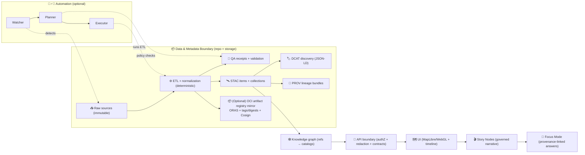

<!--
📌 `data/` is KFM’s canonical evidence + metadata boundary.
🗓️ Last updated: 2026-01-26
🔐 Reminder: “Published” in KFM means cataloged + provenance-linked + validated (not just “a file exists”).
-->

<a id="top"></a>

# 📦 `data/` — Kansas Frontier Matrix Evidence & Metadata Hub 🧭🗺️
_The governed home of KFM’s **sources**, **evidence artifacts**, and the **boundary metadata** (STAC/DCAT/PROV) that makes everything traceable._

<p align="left">
  
  
  
  
  
  
  
  
  
  
  
  
  
  
</p>

> [!IMPORTANT]
> ✅ **Prime directive:** `data/` is the **evidence boundary**.  
> If something can be used in the UI, Story Nodes, or Focus Mode, it must be:
> **(1) cataloged (STAC/DCAT)** + **(2) lineage-linked (PROV)** + **(3) policy-checked** + **(4) reproducible**.  
> **No catalog → no graph → no API → no UI.**  
> _(KFM calls this the “evidence triplet / evidence-first publishing” posture.)_ [oai_citation:0‡📚 Kansas Frontier Matrix (KFM) – Expanded Technical & Design Guide.pdf](file-service://file-Tjmzn5F3sT5VNvVFhqj1Vo) [oai_citation:1‡Kansas Frontier Matrix (KFM) – AI System Overview 🧭🤖.pdf](file-service://file-P4zHoJicw1HG6bXmqFygG8)

> [!NOTE]
> 🌐 **Data Spaces mindset:** In KFM, **metadata + IDs + provenance** are the interface.  
> Big binaries may live in stable storage / registries *only if* pointers are stable, licensed, hashed, and auditable.  
> _(We prefer content-addressed references + strong receipts over “mystery paths.”)_ [oai_citation:2‡Kansas Frontier Matrix (KFM) – Comprehensive Platform Overview and Roadmap.pdf](file-service://file-J9i6fUc35zPWB2U62zUnEN)

---

## 🔗 Repo navigation (common)
- ⬅️ Overview: `../README.md`
- 🧬 Pipelines: `../src/pipelines/README.md` *(or `../pipelines/README.md`, if present)*
- 🚪 API boundary: `../api/README.md` *(if present)*
- 🌐 Web UI boundary: `../web/README.md` *(if present)*
- 🧪 MCP (methods + receipts): `../mcp/README.md` *(if present)*
- 🧩 Schemas & contracts: `../schemas/README.md` *(if present)*
- 🧰 Validators & tooling: `../tools/README.md` *(if present)*
- 🤝 Collaboration automation: `../.github/README.md` *(if present)*

---

<details>
<summary><strong>🧭 Table of contents</strong></summary>

- [🧾 Doc metadata](#-doc-metadata)
- [⚡ 60‑second rules](#-60second-rules)
- [🏁 5‑minute publish checklist](#-5minute-publish-checklist)
- [🧠 KFM pipeline snapshot](#-kfm-pipeline-snapshot)
- [🚦 Non‑negotiables](#-nonnegotiables)
- [✅ What “published” means in KFM](#-what-published-means-in-kfm)
- [🗂️ Canonical directory layout](#-canonical-directory-layout)
- [🧱 Intake Gate 0 (security + integrity)](#-intake-gate-0-security--integrity)
- [🔁 Data lifecycle](#-data-lifecycle)
- [🏷️ Metadata boundary artifacts](#-metadata-boundary-artifacts)
- [🧾 Manifests, contracts, QA receipts](#-manifests-contracts-qa-receipts)
- [🧬 Telemetry, policy decisions & run receipts](#-telemetry-policy-decisions--run-receipts)
- [🧷 IDs, versioning, naming, hashing](#-ids-versioning-naming-hashing)
- [📐 Formats & packaging rules](#-formats--packaging-rules)
- [📦 “Dual-format package” pattern (GeoParquet + PMTiles)](#-dual-format-package-pattern-geoparquet--pmtiles)
- [📚 Document knowledge base (PDFs, scans, excerpts)](#-document-knowledge-base-pdfs-scans-excerpts)
- [🛰️ Streaming/live feeds](#-streaminglive-feeds)
- [🧪 Validation & CI gates](#-validation--ci-gates)
- [🔐 Security, privacy, and sensitive-location safety](#-security-privacy-and-sensitive-location-safety)
- [🌐 Federation & data spaces](#-federation--data-spaces)
- [➕ Adding a new dataset / domain](#-adding-a-new-dataset--domain)
- [🧬 Releases, snapshots, and attestations](#-releases-snapshots-and-attestations)
- [📚 Project file influence map](#-project-file-influence-map)
- [🕰️ Version history](#-version-history)

</details>

---

## 🧾 Doc metadata

| Field | Value |
|---|---|
| Doc | `data/README.md` |
| Status | Active ✅ |
| Last updated | **2026-01-26** |
| Audience | pipeline authors · catalog writers · validators · reviewers · API/UI integrators |
| Prime directive | **Catalogs are interfaces** (offer IDs + truthy pointers, not mystery paths). |
| Canonical ordering | **ETL → Catalogs (STAC/DCAT/PROV) → Graph → API → UI → Story → Focus** |
| Default posture | fail‑closed publish gates 🚦 · hostile‑input aware 🧯 · audit‑ready 🧾 |

---

## ⚡ 60‑second rules

If you remember nothing else, remember these 👇

1. 🧾 **No triplet, no ship:** every promoted dataset emits **STAC + DCAT + PROV**. [oai_citation:3‡📚 Kansas Frontier Matrix (KFM) – Expanded Technical & Design Guide.pdf](file-service://file-Tjmzn5F3sT5VNvVFhqj1Vo)
2. 🧊 **Raw is immutable:** never modify `data/raw` in place; treat it as a permanent record. [oai_citation:4‡Kansas Frontier Matrix (KFM) – Comprehensive Platform Overview and Roadmap.pdf](file-service://file-J9i6fUc35zPWB2U62zUnEN)
3. 🔁 **Determinism wins:** same inputs + config ⇒ same outputs; re-runs are idempotent. [oai_citation:5‡Kansas Frontier Matrix (KFM) – Comprehensive Architecture, Features, and Design.pdf](file-service://file-Qj23Z329hf1Q1WD86hXYfL)
4. 🧷 **IDs are contracts:** if meaning/schema changes → bump **major** version.
5. 🔐 **Security is upstream:** hostile inputs are normal; validate and bound everything.
6. ⚖️ **CARE/sovereignty propagates:** outputs cannot be less restricted than inputs without an audited redaction step. [oai_citation:6‡Kansas Frontier Matrix (KFM) – Comprehensive Technical Documentation.pdf](file-service://file-VgLA7nv34M5muqZ5MQxBLG)
7. 🛡️ **Policy is enforced, not vibes:** OPA/Conftest gates block violations in CI and runtime. [oai_citation:7‡Kansas Frontier Matrix (KFM) – AI System Overview 🧭🤖.pdf](file-service://file-P4zHoJicw1HG6bXmqFygG8)
8. 🧬 **Receipts-first:** runs emit telemetry + hashes + PROV + QA receipts.
9. 🧭 **UI touches only the governed API:** provenance + permissions are enforced at the boundary. [oai_citation:8‡Kansas Frontier Matrix (KFM) – Comprehensive UI System Overview (Technical Architecture Guide).pdf](file-service://file-MbEYbsLWBmpXVYXVF79c38)
10. 📦 **Prefer dual-format packages:** GeoParquet (analysis) + PMTiles (UX) under one dataset ID. [oai_citation:9‡Kansas Frontier Matrix (KFM) – Comprehensive Technical Documentation.pdf](file-service://file-VgLA7nv34M5muqZ5MQxBLG)

---

## 🏁 5‑minute publish checklist

> [!IMPORTANT]
> **Publishing** = **processed evidence output + boundary artifacts + validation**.  
> Raw files alone are *never* “published” in KFM.

### ✅ Minimum bar (per dataset)
- [ ] **Intake Gate 0** passed (security + integrity) ✅  
  - [ ] `source.json` present  
  - [ ] `checksums.sha256` present  
  - [ ] `telemetry.ndjson` started *(even if tiny)*  
- [ ] Place sources under `data/raw/<domain>/<source>/...` *(read-only mindset; reprocessing anchor)*
- [ ] Generate intermediates under `data/work/<domain>/<dataset>/...` *(discardable/regeneratable)*
- [ ] Produce publishable outputs under `data/processed/<domain>/<dataset>/...`
- [ ] Create (or update) a dataset **manifest/contract** *(machine-checkable)*  
  - [ ] `data/manifests/kfm.ks.<domain>.<dataset>.v<major>.yml` *(recommended)*  
  - [ ] or `dataset.contract.json` *(supported if you prefer JSON; keep schema’d)*  
- [ ] Emit boundary artifacts (**the “evidence triplet”**) [oai_citation:10‡📚 Kansas Frontier Matrix (KFM) – Expanded Technical & Design Guide.pdf](file-service://file-Tjmzn5F3sT5VNvVFhqj1Vo)
  - [ ] **STAC Collection** → `data/stac/collections/kfm.ks.<domain>.<dataset>.v<major>.json`
  - [ ] **STAC Item(s)** → `data/stac/items/kfm.ks.<domain>.<dataset>.<yyyymmdd>.<variant>.v<major>.json`
  - [ ] **DCAT Dataset (JSON‑LD)** → `data/catalog/dcat/kfm.ks.<domain>.<dataset>.v<major>.jsonld`
  - [ ] **PROV run bundle (JSON‑LD)** → `data/prov/<run-id>.jsonld`
- [ ] Add QA receipts: `data/qa/<domain>/<dataset>/<run-id>/...` *(bbox sanity, quicklook, validation report)*
- [ ] Run validators (local or CI) ✅ confirm schemas + links + governance checks pass

### 🥇 Quality tiers (helps reviewers)
| Tier | What it means | Required |
|---|---|---|
| 🥉 Bronze | Raw preserved + basic stewardship | source + terms + classification + hashes |
| 🥈 Silver | Processed output + STAC | publishable artifacts + STAC + QA note |
| 🥇 Gold | Fully governed + discoverable | STAC + DCAT + PROV + strong QA + hashes + policy pass |

### 🛡️ Optional “Gold+” (supply-chain / federation ready)
- [ ] **SLSA/SBOM** attached to the run artifacts (or referenced) [oai_citation:11‡Kansas Frontier Matrix (KFM) – Comprehensive Technical Documentation.pdf](file-service://file-VgLA7nv34M5muqZ5MQxBLG)
- [ ] **Sigstore Cosign attestation** for releases (if mirrored to an artifact registry) [oai_citation:12‡Kansas Frontier Matrix (KFM) – Comprehensive Platform Overview and Roadmap.pdf](file-service://file-J9i6fUc35zPWB2U62zUnEN)
- [ ] **OCI artifact packaging** (ORAS pattern) for distribution/federation (optional) [oai_citation:13‡Kansas Frontier Matrix (KFM) – Comprehensive Platform Overview and Roadmap.pdf](file-service://file-J9i6fUc35zPWB2U62zUnEN)

---

## 🧠 KFM pipeline snapshot

KFM enforces strict ordering so downstream always has traceable evidence.



> [!NOTE]
> Watchers often use **ETag / Last-Modified** to avoid redundant downloads and to keep ingestion efficient. [oai_citation:14‡Kansas Frontier Matrix (KFM) – Comprehensive Architecture, Features, and Design.pdf](file-service://file-Qj23Z329hf1Q1WD86hXYfL)

---

## 🚦 Non‑negotiables

- ⛓️ **Pipeline ordering is absolute:** `ETL → Catalogs (STAC/DCAT/PROV) → Graph → API → UI → Story → Focus`.
- 🧾 **Catalogs are required interfaces:** downstream layers reference **catalog IDs**, not ad‑hoc file paths.
- 🔁 **Deterministic + idempotent ETL:** same inputs + config ⇒ same outputs (replay-safe). [oai_citation:15‡Kansas Frontier Matrix (KFM) – Comprehensive Architecture, Features, and Design.pdf](file-service://file-Qj23Z329hf1Q1WD86hXYfL)
- 🧷 **Stable IDs forever:** dataset IDs, collection IDs, run IDs, story IDs are long-lived contracts.
- 🔒 **Integrity is mandatory:** SHA256 hashes + manifests for publishable artifacts (at minimum processed outputs).
- 🔐 **Sovereignty/classification propagate:** outputs cannot be *less restricted* than any input without an audited redaction/generalization step. [oai_citation:16‡Kansas Frontier Matrix (KFM) – Comprehensive Technical Documentation.pdf](file-service://file-VgLA7nv34M5muqZ5MQxBLG)
- 🧯 **Hostile inputs:** GeoJSON/CSV/PDF/images/rasters from the internet are attack surfaces → validate + bound + sanitize.
- 🧊 **Git stays healthy:** commit metadata + QA receipts; keep heavy binaries in stable storage with hashed pointers (or DVC).

> [!TIP]
> **FAIR** makes data findable/accessible/interoperable/reusable.  
> **CARE** keeps it ethical and accountable.  
> **Sovereignty** ensures the right people control sensitive knowledge. 🧭

---

## ✅ What “published” means in KFM

KFM uses explicit **stages** and **contracts** so we don’t ship mystery layers.

### 🧊 Stages (data state)
- **Raw** → `data/raw/<domain>/<source>/...`  
  Source snapshot; minimally transformed; reprocessing anchor.
- **Work** → `data/work/<domain>/<dataset>/...`  
  Intermediate artifacts; not stable; may be deleted/regenerated.
- **Processed** → `data/processed/<domain>/<dataset>/...`  
  Final evidence outputs meant to be served/used downstream.
- **Published** ✅  
  Processed outputs with:
  - STAC/DCAT/PROV boundary artifacts, **and**
  - passing validations/CI gates, **and**
  - correct license/classification handling, **and**
  - stable IDs (dataset + run). [oai_citation:17‡MARKDOWN_GUIDE_v13.md.gdoc](file-service://file-UYVruFXfueR8veHMUKeugU)

### 🧭 Dataset “lifecycle status” (metadata state)
We recommend tracking lifecycle explicitly (in manifests + catalogs):
- `draft` → present, not promoted, may change
- `published` → meets the publish bar
- `deprecated` → still available, but replaced; keep pointers to successor
- `tombstoned` → removed from distribution (policy/legal), but provenance remains

> [!WARNING]
> If you ship a file without a STAC/DCAT/PROV trail, you ship an **orphan**.  
> Orphans do not get promoted.

---

## 🗂️ Canonical directory layout

> [!IMPORTANT]
> v13+ posture is **stage-first**: `data/{raw,work,processed}/<domain>/...`  
> Catalogs reference **processed** artifacts (or stable object-store/registry pointers). [oai_citation:18‡MARKDOWN_GUIDE_v13.md.gdoc](file-service://file-UYVruFXfueR8veHMUKeugU)

```text
data/
├─ 📥 raw/                                  # ✅ Required: raw source snapshots (read-only mindset; immutable evidence boundary)
│  └─ 🗂️ <domain>/
│     └─ 🌐 <source>/                       # as-downloaded bytes + checksums + intake telemetry
│
├─ 🧪 work/                                 # Recommended: intermediate transforms (regeneratable; OK to wipe/rebuild)
│  └─ 🗂️ <domain>/
│     └─ 🗃️ <dataset>/                      # normalized tables, intermediate exports, scratch
│
├─ ✅ processed/                             # ✅ Required: publishable evidence artifacts (what API/UI/graph should serve)
│  └─ 🗂️ <domain>/
│     └─ 📦 <dataset>/                      # GeoParquet/COG/PMTiles/etc. + sidecars + digests
│
├─ 🧾 sources/                               # Recommended: source manifests + fetch receipts (small, auditable files)
│  └─ 🗂️ <domain>/
│     └─ 🛰️ <source>/                       # source.json, fetch config, license notes, contacts, ETag/Last-Modified receipts
│
├─ 🛰️ stac/                                  # ✅ Required: STAC catalogs (asset index + time/run snapshots)
│  ├─ 🧾 catalog.json                        # Optional but helpful STAC root (links to collections)
│  ├─ 🗂️ collections/                        # STAC Collections (dataset-level metadata)
│  └─ 🧷 items/                               # STAC Items (run/time/version snapshots referencing assets)
│
├─ 🗂️ catalog/                               # Discovery layer (human/machine “what exists” index)
│  └─ 🗂️ dcat/                                # ✅ Required: DCAT JSON-LD dataset entries (license/access/distributions)
│     └─ ➕ (optional) vocabulary/, keywords/, orgs/  # controlled vocab + org metadata
│
├─ 🧬 prov/                                  # ✅ Required: PROV lineage bundles (JSON-LD) linking raw→work→processed→catalog
│
├─ 🧾 manifests/                             # Recommended: dataset manifests/contracts + dictionaries
├─ 🧪 qa/                                    # Recommended: QA receipts (quicklooks, bbox checks, validation reports)
├─ 📡 live/                                  # Optional: streaming buffers + snapshots (still cataloged + provenance-linked)
├─ 📦 packs/                                 # Optional: offline “education packs” (PMTiles + mini web app + subset of stories)
├─ 🛡️ attestations/                          # Optional: signed build/publish receipts (SLSA/Cosign refs) or verification notes
├─ 🔎 indexes/                               # Optional: full-text / search index snapshots (redaction-aware; never raw secrets)
├─ 🕸️ graph/                                 # Optional: graph import/export artifacts (prefer pointers over duplication)
│  ├─ 🧱 csv/                                 # Neo4j import CSV snapshots (node/rel tables)
│  └─ 🧠 cypher/                              # Cypher import scripts or verification queries
└─ 🙂📄 README.md                              # you are here
```

> [!NOTE]
> Some specs use `data/catalogs/*` or `data/provenance/*`. That’s fine **only if** you keep a single canonical path and alias the rest consistently.  
> Prefer stability over aesthetics.

---

## 🧱 Intake Gate 0 (security + integrity)

Before *anything* is allowed to move from “downloaded” → “raw”, run the intake gate. ✅🧯

### ✅ What Gate 0 checks
- 📄 **Source manifest exists** (`source.json`)  
- 🔒 **Hashes exist** (`checksums.sha256`) for at least:
  - the exact downloaded archive(s), or
  - the exact raw files if unarchived  
- 🧾 **Telemetry started** (`telemetry.ndjson`)  
- 🧪 **Safe extraction & scanning** (zip-bomb limits, path traversal, file allowlists)
- 🏷️ **Classification assigned** (`public/internal/restricted/...`) before anything is promoted
- ⚖️ **License/terms recorded** (or blocked pending review)

> [!CAUTION]
> If `source.json` is missing, reviewers cannot evaluate provenance.  
> If hashes are missing, we can’t detect silent corruption or tampering.

### ✅ Recommended “Gate 0+” receipts (small but powerful)
- `source.lock.json` capturing:
  - retrieval timestamp
  - URL/URI
  - HTTP headers (ETag, Last-Modified) when available
  - size, MIME type
  - auth mode used (never store secrets)
- `scan.json` capturing:
  - extraction boundaries used
  - antivirus/tool versions
  - findings (even “none”)

> [!TIP]
> Watchers can use ETag/Last-Modified to skip re-downloading unchanged artifacts, but the decision should still be logged as telemetry. 🧾 [oai_citation:19‡Kansas Frontier Matrix (KFM) – Comprehensive Architecture, Features, and Design.pdf](file-service://file-Qj23Z329hf1Q1WD86hXYfL)

### 📄 `source.json` (minimal example)
```json
{
  "source_id": "kfm.source.<provider>.<name>",
  "name": "Human-readable source name",
  "owner": "Provider / archive / agency",
  "uri": "https://example.org/source",
  "retrieved_at": "2026-01-26",
  "license": {
    "spdx": "UNKNOWN",
    "terms_uri": "https://example.org/terms",
    "attribution": "If required, paste exact attribution text here"
  },
  "classification": "public",
  "notes": "Handling notes (rate limits, access policy, redaction constraints)."
}
```

### 🔒 `checksums.sha256` (format example)
```text
<sha256>  raw/<domain>/<source>/<filename.ext>
<sha256>  raw/<domain>/<source>/<archive.zip>
```

### 🧾 `telemetry.ndjson` (first lines example)
```json
{"ts":"2026-01-26T14:02:11Z","event":"intake.start","source_id":"kfm.source...","actor":"human","host":"devbox-01"}
{"ts":"2026-01-26T14:02:58Z","event":"intake.hash","path":"raw/.../archive.zip","sha256":"..."}
{"ts":"2026-01-26T14:03:21Z","event":"intake.scan.ok","tool":"clamav","notes":"no threats found"}
```

---

## 🔁 Data lifecycle

KFM supports batch and event-driven pipelines. Both remain provenance-led.

### 1) Ingestion 📥
- Scheduled pulls (known sources)
- Manual expert uploads (controlled staging + explicit terms)
- Crowd/citizen contributions (separate review lane; never auto-promoted)
- Preserve raw inputs as a reprocessing anchor.

> [!IMPORTANT]
> **Raw is a permanent record.** Pipelines should never alter files in `data/raw/`; they write new artifacts to `data/processed/` (and optionally `data/work/`). [oai_citation:20‡Kansas Frontier Matrix (KFM) – Comprehensive Platform Overview and Roadmap.pdf](file-service://file-J9i6fUc35zPWB2U62zUnEN)

### 2) Processing 🧰
Cleaning, joins, georeferencing, derived layers, modeling, simulation outputs.

Rules of thumb:
- Prefer “compute near data” (PostGIS for spatial ops; workers for heavy ML/sim).
- Partition by what users filter on (space/time/admin boundaries).
- Keep transforms explicit and repeatable (scripts/config captured in PROV).
- If outputs come from **analysis/modeling/simulation/optimization**, publish with:
  - parameters + seeds,
  - validation/verification status (QA),
  - uncertainty notes (QA + manifest),
  - clear “not for decision-making” flags when appropriate. [oai_citation:21‡Kansas Frontier Matrix (KFM) – Comprehensive Architecture, Features, and Design.pdf](file-service://file-Qj23Z329hf1Q1WD86hXYfL)

### 3) Indexing & discovery 🗂️
- STAC Items/Collections describe assets and coverage.
- DCAT describes datasets/distributions and how to obtain them.
- PROV describes how the dataset was produced and from what inputs.

### 4) Publication & serving 🌐
- Downstream layers ingest from catalogs (or catalog-driven exports).
- UI consumes governed API outputs (authZ + redaction + classification rules). [oai_citation:22‡Kansas Frontier Matrix (KFM) – Comprehensive UI System Overview (Technical Architecture Guide).pdf](file-service://file-MbEYbsLWBmpXVYXVF79c38)
- New catalogs can trigger graph refresh + UI indexing.

### 5) Deprecation 🪦
- Never “silently replace” a published dataset.
- Deprecate by:
  - publishing a successor dataset version,
  - marking old one `deprecated`,
  - preserving old artifacts + hashes for audit/replay.

---

## 🏷️ Metadata boundary artifacts

> [!IMPORTANT]
> Boundary artifacts are the **interfaces** downstream layers consume.  
> Graph/API/UI/Story/Focus should reference **catalog IDs**, not ad-hoc local paths. [oai_citation:23‡MARKDOWN_GUIDE_v13.md.gdoc](file-service://file-UYVruFXfueR8veHMUKeugU)

### ✅ Required boundary outputs (the “evidence triplet”) [oai_citation:24‡📚 Kansas Frontier Matrix (KFM) – Expanded Technical & Design Guide.pdf](file-service://file-Tjmzn5F3sT5VNvVFhqj1Vo)
- **STAC (Collections + Items)** for spatiotemporal assets (vectors, rasters, tiles, documents, thumbnails, QA receipts).
- **DCAT dataset entry (JSON‑LD)** for discovery (title/description/license/keywords/distributions).
- **PROV lineage bundle (JSON‑LD)** capturing inputs → activities → outputs.

### 🔗 Cross-layer linkage expectations (do not break)
- STAC Items link to stable assets (usually `data/processed/...` or stable object-store/registry URLs).
- DCAT links to distributions (STAC, API endpoints, and/or direct downloads where allowed).
- PROV links raw → work → processed and records run/config identifiers.
- Graph stores references to catalog IDs (avoid stuffing heavy payloads into the graph). [oai_citation:25‡Kansas Frontier Matrix (KFM) – AI System Overview 🧭🤖.pdf](file-service://file-P4zHoJicw1HG6bXmqFygG8)

### 🧩 KFM extensions (recommended fields)
To support policy gates + Focus Mode “receipts”, add KFM-scoped fields (namespaced) in STAC/DCAT/PROV where appropriate:

- `kfm:dataset_id`
- `kfm:run_id`
- `kfm:classification`
- `kfm:license_spdx`
- `kfm:sovereignty_notes` *(when needed)*
- `kfm:ai_assisted` *(if any ML/LLM used to derive an artifact)*
- `kfm:quality` *(QA pointers + known limitations)*

### 🧭 FAIR+CARE metadata (recommended)
KFM design includes ethical metadata fields (e.g., “faircare” notes capturing collective benefit, authority to control, responsibility, ethics). [oai_citation:26‡📚 Kansas Frontier Matrix (KFM) – Expanded Technical & Design Guide.pdf](file-service://file-Tjmzn5F3sT5VNvVFhqj1Vo)

> [!NOTE]
> Focus Mode is only as strong as the metadata it can cite. If an artifact lacks license/classification/provenance pointers, Focus Mode must treat it as **not eligible**.

---

## 🧾 Manifests, contracts, QA receipts

KFM treats datasets like shippable products: they need a machine-checkable contract and a human-readable QA receipt. 🎟️🧾

### ✅ Recommended per-dataset files
- `data/manifests/kfm.ks.<domain>.<dataset>.v<major>.yml`  
- `data/qa/<domain>/<dataset>/<run-id>/qa.md`  
- `data/qa/<domain>/<dataset>/<run-id>/quicklook.png` *(small)*
- `data/qa/<domain>/<dataset>/<run-id>/validation.json` *(machine-readable)*
- `data/manifests/<...>/data_dictionary.md` *(or `schema.json` — strongly recommended for analytics outputs)*

### 📄 Dataset manifest (YAML example)
```yaml
dataset_id: "kfm.ks.<domain>.<dataset>.v1"
title: "Human-readable title"
description: "What this is and what it is not."
owner: "KFM / partner org"
contacts:
  - name: "Data Steward"
    role: "steward"
    email: "steward@example.org"

classification: "public"        # public|internal|confidential|restricted
license:
  spdx: "CC-BY-4.0"
  terms_uri: "https://example.org/terms"
  attribution: "Required attribution text"

faircare:                        # optional but encouraged (human-governed)
  collective_benefit: "Who benefits?"
  authority_to_control: "Who controls use?"
  responsibility: "Responsibilities/constraints?"
  ethics: "Key ethical notes"

spatial:
  crs: "EPSG:4326"
  bbox: [-102.05, 36.99, -94.58, 40.00]
temporal:
  start: "1930-01-01"
  end: "1940-12-31"

distributions:
  - kind: "stac_collection"
    id: "kfm.ks.<domain>.<dataset>.v1"
    path: "data/stac/collections/kfm.ks.<domain>.<dataset>.v1.json"
  - kind: "dcat_dataset"
    id: "kfm.ks.<domain>.<dataset>.v1"
    path: "data/catalog/dcat/kfm.ks.<domain>.<dataset>.v1.jsonld"

artifacts:
  processed_paths:
    - "data/processed/<domain>/<dataset>/..."
  checksums: "data/processed/<domain>/<dataset>/checksums.sha256"

qa:
  latest_run_id: "etl_20260126_140211_ab12cd3"
  receipts_path: "data/qa/<domain>/<dataset>/etl_20260126_140211_ab12cd3/"
  known_limits:
    - "Explain key limitations here (coverage gaps, accuracy bounds, etc.)"
```

### 🧾 QA receipt template (Markdown + YAML front matter)
```yaml
---
doc_uuid: "qa.kfm.ks.<domain>.<dataset>.etl_20260126_140211_ab12cd3"
dataset_id: "kfm.ks.<domain>.<dataset>.v1"
run_id: "etl_20260126_140211_ab12cd3"
classification: "public"
bbox: [-102.05, 36.99, -94.58, 40.00]
crs: "EPSG:4326"
time_coverage: ["1930-01-01", "1940-12-31"]
quicklooks:
  - "quicklook.png"
validators:
  - name: "stac.validate"
    status: "pass"
  - name: "prov.validate"
    status: "pass"
---
# QA Receipt — <dataset>
## What changed
## Validation summary
## Visual sanity checks
## Known limitations
## Evidence pointers (STAC/DCAT/PROV IDs)
```

> [!TIP]
> Reviewers love QA receipts. They turn “trust me” into “see for yourself.” ✅

---

## 🧬 Telemetry, policy decisions & run receipts

KFM’s reproducibility posture is “receipt-first.” Every meaningful run leaves a trail.

### ✅ What should exist for a promoted run
- `run_id` (stable, audit-friendly)
- parameters/config snapshot (hashable)
- deterministic seed (when relevant)
- input hashes (at least raw archive hashes)
- output hashes (required for processed)
- PROV bundle (inputs → activities → outputs)
- telemetry log (NDJSON) for “what happened”
- policy decision refs (policy hash / version) when a gate is involved [oai_citation:27‡Kansas Frontier Matrix (KFM) – AI System Overview 🧭🤖.pdf](file-service://file-P4zHoJicw1HG6bXmqFygG8)

### 🧾 Recommended telemetry event vocabulary
Keep it boring and consistent:
- `intake.*` → download/hash/scan/extract/classify
- `etl.*` → transform steps, CRS transforms, georef, resampling, simplification
- `validate.*` → schema checks, link checks, geometry checks
- `publish.*` → writing STAC/DCAT/PROV, promotion decisions, kill-switch status
- `policy.*` → OPA/Conftest decisions + rule IDs
- `redact.*` → generalization/masking steps (and approvals)
- `schema_drift.*` → planner proposals + executed migrations (if enabled) [oai_citation:28‡Kansas Frontier Matrix (KFM) – Comprehensive Platform Overview and Roadmap.pdf](file-service://file-J9i6fUc35zPWB2U62zUnEN)

### 🛡️ Provenance-first operations (supply chain posture)
KFM extends provenance beyond datasets into the build/release process:
- SLSA-style attestations and SBOMs can accompany releases (software + data). [oai_citation:29‡Kansas Frontier Matrix (KFM) – Comprehensive Technical Documentation.pdf](file-service://file-VgLA7nv34M5muqZ5MQxBLG)
- Data artifacts can be mirrored into OCI registries and cryptographically signed (Sigstore Cosign). [oai_citation:30‡Kansas Frontier Matrix (KFM) – Comprehensive Platform Overview and Roadmap.pdf](file-service://file-J9i6fUc35zPWB2U62zUnEN)
- Automation agents may sign artifacts/PRs to prove they came from approved automation paths. [oai_citation:31‡Kansas Frontier Matrix (KFM) – Comprehensive Platform Overview and Roadmap.pdf](file-service://file-J9i6fUc35zPWB2U62zUnEN)

> [!IMPORTANT]
> If the **kill-switch** is enabled, telemetry must show it, and promotion steps must stop (or enter audit-only mode). 🧯

---

## 🧷 IDs, versioning, naming, hashing

Stable IDs make KFM queryable, debuggable, and safe to automate.

### ✅ Dataset IDs (recommended)
- **Dataset / Collection ID:** `kfm.ks.<domain>.<dataset>.v<major>`  
  Example: `kfm.ks.hydrology.watersheds.v1`
- **STAC Item ID:** `kfm.ks.<domain>.<dataset>.<yyyymmdd>.<variant>.v<major>`  
  Example: `kfm.ks.geology.surficial.20260101.statewide.v1`
- **Run ID:** `etl_<yyyymmdd>_<hhmmss>_<shortgitsha>`  
  Example: `etl_20260126_140211_ab12cd3`

### 🧠 ID design rule (don’t regret later)
- IDs are **names**, not facts.
- Avoid encoding mutable meaning inside IDs.
- If meaning/schema changes, bump the **major version**.

### 📛 File naming (processed evidence artifacts)
Prefer routing-friendly names:
- `<domain>__<dataset>__<yyyymmdd|yyyymm>__<epsg>__<resolution>__v<major.minor>.<ext>`
- Example: `agriculture__ndvi__20250301__epsg4326__30m__v1.0.tif`

### 🔒 Hashing rule
Record **SHA256** for:
- processed outputs (**required**)
- raw inputs (**recommended**)
- configs/parameter snapshots (**recommended**)

Where hashes should appear:
- STAC assets (checksum fields / extension)
- PROV entity records
- dataset manifests (`data/manifests/**`)
- `checksums.sha256` alongside artifacts for quick audit

### 📦 Optional: content-addressed distribution
When distributing via registries:
- prefer digest references (`...@sha256:<digest>`) over mutable tags
- if you must use `latest`, treat it as a convenience pointer only [oai_citation:32‡Kansas Frontier Matrix (KFM) – Comprehensive Platform Overview and Roadmap.pdf](file-service://file-J9i6fUc35zPWB2U62zUnEN)

---

## 📐 Formats & packaging rules

KFM is map-first and time-aware. Formats must support streaming, indexing, and honest representation.

### 🗺️ Vector
| Use case | Preferred | Why |
|---|---|---|
| Small inspectable overlays | GeoJSON | debuggable; interoperable |
| Analytics exchange | GeoParquet | columnar; fast filters/scans |
| UI performance | PMTiles (vector tiles) | pan/zoom performance + offline |
| Authoritative edits | PostGIS | constraints + indices + query power |

**Vector must-haves ✅**
- stable feature IDs (`kfm_id` or equivalent)
- geometry validity checks + CRS explicit
- simplification/topology documented for UI-facing layers
- schema documented (manifest + DCAT) for analytics formats

### 🛰️ Raster
| Use case | Preferred | Why |
|---|---|---|
| Web streaming | COG | range requests; pyramids |
| Analysis stacks | Zarr/NetCDF *(when appropriate)* | chunked reads; large time-series |
| Quicklook | PNG/JPEG | small previews for QA |
| Time-series | chunked partitions | scalable partial reads |

**Raster must-haves ✅**
- nodata defined + units documented
- overviews/pyramids when serving to UI
- QA quicklook at known bbox/zoom

### 🧾 Documents & scans (archives)
| Use case | Preferred | Notes |
|---|---|---|
| Scanned historical maps | lossless master + georef COG | record georef method + RMS + GCP count |
| Textual archives | PDF + extracted text | treat PDFs as hostile inputs; validate |
| Image derivatives | PNG/JPEG | derivatives for UX, masters for fidelity |

### 🧊 3D & “beyond 2D” evidence
3D evidence must remain provenance-linked:
- raw scans/models in `data/raw/<domain>/...`
- view-optimized assets in `data/processed/<domain>/...` (glTF / 3D Tiles)
- cataloged in STAC as assets with **CRS + vertical datum** + QA previews

> [!TIP]
> Visualization ≠ truth. 3D assets still need provenance, QA, and policy gating.

---

## 📦 “Dual-format package” pattern (GeoParquet + PMTiles)

This pattern is a KFM favorite because it serves **both** analysis and UX.

### ✅ What it is
Publish **one dataset ID** with **two distributions**:
- **GeoParquet** → analysis, joins, statistics
- **PMTiles** → UI layers, offline packs, fast pan/zoom

A concrete example described in KFM docs is a **Surficial Geology** package shipped as GeoParquet + PMTiles under shared metadata and hashes. [oai_citation:33‡Kansas Frontier Matrix (KFM) – Comprehensive Technical Documentation.pdf](file-service://file-VgLA7nv34M5muqZ5MQxBLG)

### 📁 Suggested structure
```text
data/processed/geology/surficial/
  surficial__statewide__epsg4326__v1.0.parquet
  surficial__statewide__z0-12__v1.0.pmtiles
  checksums.sha256

data/stac/items/
  kfm.ks.geology.surficial.20260101.statewide.v1.json   # assets: parquet + pmtiles + quicklook

data/catalog/dcat/
  kfm.ks.geology.surficial.v1.jsonld                    # distributions: parquet + pmtiles + api
```

### ✅ Reviewer expectations
- both distributions hash-verified
- STAC points to both assets
- QA receipt includes:
  - quicklook screenshot(s)
  - bbox sanity
  - basic attribute summary (top fields, row count)
  - simplification/tiling notes for PMTiles

> [!NOTE]
> Offline “education packs” and PWA bundles get dramatically easier when PMTiles exists. 📦📚

---

## 📚 Document knowledge base (PDFs, scans, excerpts)

KFM supports a “document knowledge base” pattern where excerpts, citations, and evidence are discoverable and map-linked.

A design pattern described in KFM materials is to keep:
- source PDFs in storage,
- extracted excerpts as structured records,
- links from excerpts to **places** (coordinates / bounding boxes), **topics**, and **timeline** anchors, enabling map + search + narrative use. [oai_citation:34‡Kansas-Frontier-Matrix_ Open-Source Geospatial Historical Mapping Hub Design.pdf](file-service://file-64djFYQUCmxN1h6L6X7KUw)

### ✅ Recommended layout (documents)
```text
data/raw/archives/<source>/pdf/
data/work/archives/<dataset>/text_extraction/
data/processed/archives/<dataset>/
  excerpts.parquet            # extracted snippets + references (no secrets; redaction-aware)
  ocr_text.ndjson             # optional raw OCR output (classification-dependent)
  thumbnails/                 # small UI previews
  checksums.sha256
```

### 🧯 Security note (documents)
- PDFs/images are hostile-input surfaces; extract in sandboxed workers.
- Record OCR tool/version and quality metrics in QA receipts.
- If documents contain PII/sensitive locations, publish only redacted/generalized derivatives.

---

## 🛰️ Streaming/live feeds

KFM supports streaming inputs **only if they remain governable**.

### ✅ Rules for live/streamed datasets
- Live data becomes “real” only when it is:
  - written to stable storage (snapshots or append logs),
  - cataloged as STAC Items (micro-batch measurements are fine),
  - lineage-linked (PROV run/activity),
  - policy checked (classification + redaction + licensing).
- Prefer micro-batch windows (e.g., 5 min / 1 hour / daily) → STAC Item per window.
- Treat feeds as hostile inputs (schema checks, bounds checks, rate-limits).

### 📁 Suggested layout (optional)
```text
data/live/<domain>/<feed>/
  buffer/                 # short-lived ingest buffers (not published)
  snapshots/              # durable snapshots (publish candidates)
  telemetry.ndjson
```

> [!CAUTION]
> “Near real-time” is a pressure multiplier. Don’t relax governance because data is fast.

---

## 🧪 Validation & CI gates

KFM expects automated validation to prevent regressions and sensitive leaks.

### ✅ Typical gates
- STAC/DCAT/PROV schema validation (KFM profiles)
- Link checks (assets exist/reachable, distributions resolve)
- Hash verification (processed outputs required)
- Classification consistency (no downgrades without audited redaction)
- Secret scanning + sensitive data scanning
- Geometry validity + CRS sanity
- Temporal indexing sanity (timeline slider depends on it) [oai_citation:35‡Kansas Frontier Matrix (KFM) – Comprehensive UI System Overview (Technical Architecture Guide).pdf](file-service://file-MbEYbsLWBmpXVYXVF79c38)
- Policy pack evaluation (OPA/Conftest) for:
  - required license fields,
  - CRS requirements,
  - sensitivity restrictions,
  - AI citation requirements, etc. [oai_citation:36‡Kansas Frontier Matrix (KFM) – AI System Overview 🧭🤖.pdf](file-service://file-P4zHoJicw1HG6bXmqFygG8)

### 🚦 Fail-fast publish gates (common policy)
- missing PROV bundle → ❌
- broken STAC asset link → ❌
- missing license/attribution for a promoted dataset → ❌ *(or “blocked pending review”)*
- sensitive leak hit → ❌
- kill-switch enabled and PR attempts promotion → ❌/audit-only 🧯

### 🧰 Starter local checks (examples)
```bash
# 1) JSON sanity
find data/stac data/catalog/dcat data/prov -name "*.json*" -print0 | xargs -0 -n 1 jq empty

# 2) STAC link check (assets exist)
python tools/validation/validate_stac_links.py data/stac/items

# 3) PROV completeness (raw→work→processed)
python tools/validation/validate_prov.py data/prov

# 4) Governance scan (sensitive fields, risky URLs)
python tools/validation/scan_sensitive.py data
```

> ⭐ Keep CI fast. Put heavy geospatial validations into scheduled/nightly lanes when needed.

---

## 🔐 Security, privacy, and sensitive-location safety

### ✅ Always
- Never commit secrets.
- Treat ingestion as hostile (zip bombs, malformed files, SSRF, parser exploits).
- Keep “publish” behind policy gates (OPA/Conftest), and keep a kill-switch. [oai_citation:37‡Kansas Frontier Matrix (KFM) – AI System Overview 🧭🤖.pdf](file-service://file-P4zHoJicw1HG6bXmqFygG8)

### 🧭 Sensitive location rule (hard)
If a dataset includes sensitive locations (culturally sensitive sites, protected resources, critical infrastructure, etc.):
- generalize precision (county/township grids, H3, jitter, or bounding boxes)
- restrict access where required
- do not publish exact coordinates unless explicitly permitted and reviewed

KFM examples explicitly call out generalizing sensitive site coordinates and requiring elevated permissions when needed. [oai_citation:38‡Kansas Frontier Matrix (KFM) – Comprehensive Technical Documentation.pdf](file-service://file-VgLA7nv34M5muqZ5MQxBLG)

### 🕵️ Privacy-preserving data mining mindset (why this matters)
Even “non-sensitive” releases can leak information via:
- linkage attacks (joining public datasets)
- inference attacks (predicting private attributes)
- temporal differencing (comparing snapshots to reveal hidden changes)

Mitigations KFM can standardize:
- aggregation thresholds (don’t publish tiny groups)
- query auditing + inference control on sensitive slices (API layer) [oai_citation:39‡Data Mining Concepts & applictions.pdf](file-service://file-2uwEbQAFVKpXaTtWgUirAH)
- k-anonymity / l-diversity / t-closeness where appropriate (explicitly documented) [oai_citation:40‡Data Mining Concepts & applictions.pdf](file-service://file-2uwEbQAFVKpXaTtWgUirAH)
- differential privacy for high-risk aggregates (optional, clearly labeled)
- publish snapshots (not uncontrolled “diff drips”) for sensitive domains

> [!IMPORTANT]
> If we can’t defend the disclosure boundary, it doesn’t ship. 🔒

---

## 🌐 Federation & data spaces

KFM is designed as a blueprint for other “Frontier Matrices.”

Target posture:
- prefer standards (STAC/DCAT/PROV) for interoperability
- expose trust signals (license, provenance, classification, QA pointers, uncertainty notes)
- enable cross-hub discovery via catalogs + shared ontology mappings
- keep sovereignty enforceable across federation boundaries
- optionally distribute artifacts via registries to support cross-instance reuse [oai_citation:41‡Kansas Frontier Matrix (KFM) – Comprehensive Platform Overview and Roadmap.pdf](file-service://file-J9i6fUc35zPWB2U62zUnEN)

> [!NOTE]
> Federation ≠ free-for-all. Governance stays always-on.

---

## ➕ Adding a new dataset / domain

### ✅ Checklist
- [ ] Create staging folders:
  - [ ] `data/raw/<new-domain>/<source>/`
  - [ ] `data/work/<new-domain>/<dataset>/`
  - [ ] `data/processed/<new-domain>/<dataset>/`
- [ ] Run **Intake Gate 0** (source.json + hashes + telemetry + scan)
- [ ] Build deterministic pipeline (config + logging + hashes) [oai_citation:42‡📚 Kansas Frontier Matrix (KFM) – Expanded Technical & Design Guide.pdf](file-service://file-Tjmzn5F3sT5VNvVFhqj1Vo)
- [ ] Emit boundary artifacts:
  - [ ] STAC Collection + Item(s)
  - [ ] DCAT JSON‑LD entry
  - [ ] PROV run bundle
- [ ] Add dataset manifest (`data/manifests/...`) + QA receipt (`data/qa/...`)
- [ ] Validate schemas + links + governance in CI
- [ ] (Optional) Graph sync after catalogs exist
- [ ] Expose via governed API (classification + redaction)
- [ ] Add domain runbook under `docs/` *(recommended)* [oai_citation:43‡MARKDOWN_GUIDE_v13.md.gdoc](file-service://file-UYVruFXfueR8veHMUKeugU)

<details>
<summary><strong>🧱 Dataset skeleton (copy/paste)</strong></summary>

```text
# Intake (Gate 0)
data/raw/<domain>/<source>/source.json
data/raw/<domain>/<source>/checksums.sha256
data/raw/<domain>/<source>/telemetry.ndjson

# Evidence lifecycle (stage-first)
data/raw/<domain>/<source>/
data/work/<domain>/<dataset>/
data/processed/<domain>/<dataset>/
data/processed/<domain>/<dataset>/checksums.sha256

# Catalog boundary artifacts (versioned dataset IDs)
data/stac/collections/kfm.ks.<domain>.<dataset>.v1.json
data/stac/items/kfm.ks.<domain>.<dataset>.<yyyymmdd>.<variant>.v1.json

data/catalog/dcat/kfm.ks.<domain>.<dataset>.v1.jsonld
data/prov/etl_<yyyymmdd>_<hhmmss>_<shortgitsha>.jsonld

# QA + manifests (recommended)
data/qa/<domain>/<dataset>/etl_<...>/qa.md
data/qa/<domain>/<dataset>/etl_<...>/quicklook.png
data/manifests/kfm.ks.<domain>.<dataset>.v1.yml
```
</details>

---

## 🧬 Releases, snapshots, and attestations

When evidence artifacts graduate into distribution:
- 📦 Prefer immutable **release snapshots** (versioned IDs + immutable hashes).
- 🧾 Maintain a human-readable manifest answering:
  - what changed?
  - why?
  - which catalogs/prov define it?
- 🛡️ Where supported, publish integrity signals:
  - checksums
  - signed release artifacts / attestations (Sigstore Cosign) [oai_citation:44‡Kansas Frontier Matrix (KFM) – Comprehensive Platform Overview and Roadmap.pdf](file-service://file-J9i6fUc35zPWB2U62zUnEN)
  - supply chain receipts (SLSA + SBOM) [oai_citation:45‡Kansas Frontier Matrix (KFM) – Comprehensive Technical Documentation.pdf](file-service://file-VgLA7nv34M5muqZ5MQxBLG)

### 📦 Optional: “Data packaged as OCI” distribution lane
KFM roadmaps describe treating data like software packages:
- push a dataset bundle (GeoParquet + PMTiles + metadata) as an OCI artifact (ORAS)
- sign/attest with Cosign
- reference the digest from DCAT distributions [oai_citation:46‡Kansas Frontier Matrix (KFM) – Comprehensive Platform Overview and Roadmap.pdf](file-service://file-J9i6fUc35zPWB2U62zUnEN)

> [!TIP]
> Treat “data releases” like software releases: version, changelog, hashes, provenance. Same discipline, same trust.

---

## 📚 Project file influence map

> ✅ This README is shaped by KFM’s core specs + the attached reference portfolios.  
> The table below reflects how those files influence `data/` rules, staging, packaging, governance, and reproducibility.

<details>
<summary><strong>📦 Expand: Influence map (project files)</strong></summary>

### 🧭 Core KFM specs (project-defining)
| Project file | How it shapes `data/` |
|---|---|
| `📚 Kansas Frontier Matrix (KFM) – Expanded Technical & Design Guide.pdf`  [oai_citation:47‡📚 Kansas Frontier Matrix (KFM) – Expanded Technical & Design Guide.pdf](file-service://file-Tjmzn5F3sT5VNvVFhqj1Vo) | Defines the **stage-first lifecycle** (`raw→work→processed`) and the **evidence triplet** requirement (STAC + DCAT + PROV). Also introduces FAIR+CARE metadata fields and deterministic ETL expectations. [oai_citation:48‡📚 Kansas Frontier Matrix (KFM) – Expanded Technical & Design Guide.pdf](file-service://file-Tjmzn5F3sT5VNvVFhqj1Vo) |
| `Kansas Frontier Matrix (KFM) – Comprehensive Technical Documentation.pdf`  [oai_citation:49‡Kansas Frontier Matrix (KFM) – Comprehensive Technical Documentation.pdf](file-service://file-VgLA7nv34M5muqZ5MQxBLG) | Solidifies governance posture (FAIR/CARE + sensitive-site handling), dual-format packaging example (GeoParquet + PMTiles), and provenance-first operations with SLSA/SBOM considerations. [oai_citation:50‡Kansas Frontier Matrix (KFM) – Comprehensive Technical Documentation.pdf](file-service://file-VgLA7nv34M5muqZ5MQxBLG) [oai_citation:51‡Kansas Frontier Matrix (KFM) – Comprehensive Technical Documentation.pdf](file-service://file-VgLA7nv34M5muqZ5MQxBLG) |
| `Kansas Frontier Matrix (KFM) – Comprehensive Architecture, Features, and Design.pdf` | Provides the ingestion component model (watchers/fetchers/transformers/validators/loaders/metadata emitters) and emphasizes determinism + idempotence and ETag/Last-Modified efficiency patterns. [oai_citation:52‡Kansas Frontier Matrix (KFM) – Comprehensive Architecture, Features, and Design.pdf](file-service://file-Qj23Z329hf1Q1WD86hXYfL) |
| `Kansas Frontier Matrix (KFM) – Comprehensive Platform Overview and Roadmap.pdf` | Adds the “data-as-artifacts” distribution lane (OCI registry + ORAS) and cryptographic integrity (Cosign attestations), plus offline packs/AR direction for packaging choices. [oai_citation:53‡Kansas Frontier Matrix (KFM) – Comprehensive Platform Overview and Roadmap.pdf](file-service://file-J9i6fUc35zPWB2U62zUnEN) [oai_citation:54‡Kansas Frontier Matrix (KFM) – Comprehensive Platform Overview and Roadmap.pdf](file-service://file-J9i6fUc35zPWB2U62zUnEN) |
| `Kansas Frontier Matrix (KFM) – Comprehensive UI System Overview (Technical Architecture Guide).pdf` | Drives temporal indexing requirements (timeline slider), provenance injection into UI (via governed API), and motivates quicklooks + time slices for smooth UX. [oai_citation:55‡Kansas Frontier Matrix (KFM) – Comprehensive UI System Overview (Technical Architecture Guide).pdf](file-service://file-MbEYbsLWBmpXVYXVF79c38) [oai_citation:56‡Kansas Frontier Matrix (KFM) – Comprehensive UI System Overview (Technical Architecture Guide).pdf](file-service://file-MbEYbsLWBmpXVYXVF79c38) |
| `Kansas Frontier Matrix (KFM) – AI System Overview 🧭🤖.pdf` | Requires evidence-first publishing for Focus Mode; policy-as-code enforcement via OPA/Conftest; policy versioning and audit logs; and sandbox posture for AI + secrets protection. [oai_citation:57‡Kansas Frontier Matrix (KFM) – AI System Overview 🧭🤖.pdf](file-service://file-P4zHoJicw1HG6bXmqFygG8) |

### 🧰 Supporting project docs (templates + design blueprints)
| Project file | What it contributes |
|---|---|
| `MARKDOWN_GUIDE_v13.md.gdoc` | Reinforces canonical pipeline flow and directory conventions; suggests doc templates/runbooks and consistent “boundary artifacts” requirements. [oai_citation:58‡MARKDOWN_GUIDE_v13.md.gdoc](file-service://file-UYVruFXfueR8veHMUKeugU) |
| `Kansas-Frontier-Matrix_ Open-Source Geospatial Historical Mapping Hub Design.pdf` | Contributes the “document knowledge base” model (map-linked excerpts), and reinforces raw immutability + processed outputs for serving. [oai_citation:59‡Kansas-Frontier-Matrix_ Open-Source Geospatial Historical Mapping Hub Design.pdf](file-service://file-64djFYQUCmxN1h6L6X7KUw) [oai_citation:60‡Kansas Frontier Matrix (KFM) – Comprehensive Platform Overview and Roadmap.pdf](file-service://file-J9i6fUc35zPWB2U62zUnEN) |

### 📚 Reference portfolios (embedded libraries)
| Portfolio file | What it contributes to `data/` conventions |
|---|---|
| `AI Concepts & more.pdf` | Governance & uncertainty-first AI posture; human-in-the-loop; model output labeling and audit expectations. |
| `Data Managment-Theories-Architures-Data Science-Baysian Methods-Some Programming Ideas.pdf` | Metadata-as-interface mindset; data spaces/federation concepts; performance/partitioning ideas. |
| `Maps-GoogleMaps-VirtualWorlds-Archaeological-Computer Graphics-Geospatial-webgl.pdf` | Projection/CRS hygiene, 3D evidence patterns, WebGL/UX constraints informing packaging + QA. |
| `Mapping-Modeling-Python-Git-HTTP-CSS-Docker-GraphQL-Data Compression-Linux-Security.pdf` | Secure engineering + reproducible toolchains; compression and transport considerations; container posture. |
| `Geographic Information-Security-Git-R coding-SciPy-MATLAB-ArcGIS-Apache Spark-Type Script-Web Applications.pdf` | GIS tooling cross-compatibility; analytics stack considerations; reproducible computational workflows. |
| `Various programming langurages & resources 1.pdf` | Cross-language references; Git hygiene; practical engineering notes supporting maintainability. |

</details>

---

## 🕰️ Version history

| Version | Date | Summary | Author |
|---:|---|---|---|
| v1.5.0 | 2026-01-26 | Added **offline packs** + **attestations** optional lanes, strengthened **evidence triplet** language, clarified **policy decision logging** and **schema drift** events, aligned UI expectations (timeline/provenance injection), expanded **data-as-OCI** and **Cosign/SLSA/SBOM** posture, and added document knowledge base pattern. | KFM Engineering |
| v1.4.0 | 2026-01-19 | Added **Intake Gate 0** (source.json + checksums.sha256 + telemetry.ndjson), introduced `data/sources/` + `data/live/` optional lanes, formalized **telemetry/run receipts**, added **dual-format package pattern** (GeoParquet + PMTiles), strengthened privacy/inference safety notes, and refreshed influence map. | KFM Engineering |
| v1.3.1 | 2026-01-13 | Corrected canonical `data/` layout to v13 **stage-first** staging; expanded formats guidance (GeoParquet + 3D evidence); strengthened CI “fail-fast” publish gates; refreshed influence map. | KFM Engineering |
| v1.3.0 | 2026-01-11 | Prior iteration: lifecycle stages, STAC/DCAT/PROV boundary artifacts, dataset ID conventions, validation gates, influence map. | KFM Engineering |

---

<!--
Evidence anchors used to update this README (project files referenced):
- 📚 Kansas Frontier Matrix (KFM) – Expanded Technical & Design Guide.pdf   [oai_citation:61‡📚 Kansas Frontier Matrix (KFM) – Expanded Technical & Design Guide.pdf](file-service://file-Tjmzn5F3sT5VNvVFhqj1Vo)
- Kansas Frontier Matrix (KFM) – Comprehensive Technical Documentation.pdf  [oai_citation:62‡Kansas Frontier Matrix (KFM) – Comprehensive Technical Documentation.pdf](file-service://file-VgLA7nv34M5muqZ5MQxBLG)
- Kansas Frontier Matrix (KFM) – Comprehensive Architecture, Features, and Design.pdf
- Kansas Frontier Matrix (KFM) – Comprehensive Platform Overview and Roadmap.pdf
- Kansas Frontier Matrix (KFM) – Comprehensive UI System Overview (Technical Architecture Guide).pdf
- Kansas Frontier Matrix (KFM) – AI System Overview 🧭🤖.pdf
- MARKDOWN_GUIDE_v13.md.gdoc
- Kansas-Frontier-Matrix_ Open-Source Geospatial Historical Mapping Hub Design.pdf
- AI Concepts & more.pdf
- Data Managment-Theories-Architures-Data Science-Baysian Methods-Some Programming Ideas.pdf
- Maps-GoogleMaps-VirtualWorlds-Archaeological-Computer Graphics-Geospatial-webgl.pdf
- Mapping-Modeling-Python-Git-HTTP-CSS-Docker-GraphQL-Data Compression-Linux-Security.pdf
- Geographic Information-Security-Git-R coding-SciPy-MATLAB-ArcGIS-Apache Spark-Type Script-Web Applications.pdf
- Various programming langurages & resources 1.pdf
-->

<p align="right"><a href="#top">⬆️ Back to top</a></p>