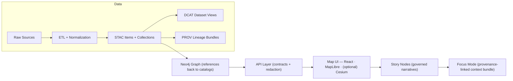

# 📦 `data/` — Kansas Frontier Matrix Data & Metadata Hub


> ✅ **Purpose:** `data/` is the canonical home for **raw inputs**, **intermediate work**, **published/processed outputs**, and the **required metadata boundary artifacts** (STAC/DCAT/PROV) that make KFM traceable, governed, and shippable. [^staging]  
> ⚠️ **Rule:** If it isn’t **cataloged + provenance-linked**, it isn’t “published” in KFM. [^provenance-first]

---

## 🧭 Quick Nav
- [🚦 Non‑negotiables](#-non-negotiables)
- [🗂️ Directory layout](#️-directory-layout)
- [🔁 Data lifecycle](#-data-lifecycle)
- [🏷️ Metadata boundary artifacts](#️-metadata-boundary-artifacts)
- [🧩 Minimal artifact templates](#-minimal-artifact-templates)
- [🧾 Evidence artifacts](#-evidence-artifacts)
- [🧬 Versioning](#-versioning)
- [🧷 Stable IDs + hashing](#-stable-ids--hashing)
- [📐 Conventions](#-conventions)
- [🧪 Validation & CI gates](#-validation--ci-gates)
- [➕ Adding a new dataset / domain](#-adding-a-new-dataset--domain)
- [🛠️ Toolchain](#️-toolchain)
- [📚 Reference library](#-reference-library)
- [🧷 Footnotes](#-footnotes)

---

## 🧠 KFM Pipeline Snapshot
KFM enforces a strict ordering from **data → catalogs → graph → API → UI → narrative**, ensuring traceability end-to-end. [^pipeline-diagram]



---

## 🚦 Non‑negotiables
These invariants keep the platform consistent and governed:

- **Pipeline ordering is absolute:** `ETL → Catalogs (STAC/DCAT/PROV) → Graph → API → UI → Story Nodes → Focus Mode`. [^pipeline-order]
- **API boundary rule:** UI never queries Neo4j directly; all access goes through the governed API layer (enforces access control + redaction). [^api-boundary]
- **Deterministic, idempotent ETL:** config-driven, repeatable runs with stable IDs/hashes and logging for reproducibility. [^deterministic-etl]
- **Evidence-first narrative:** Story Nodes/Focus Mode must cite evidence; AI outputs must be labeled and provenance-linked. [^evidence-first]
- **Sovereignty & classification propagation:** outputs cannot be **less restricted** than inputs without approved redaction/handling. [^sovereignty]

> 🧩 Governance reminder: **FAIR** makes data *findable/accessible/interoperable/reusable*; **CARE** ensures *collective benefit, authority to control, responsibility, and ethics*; **sovereignty** ensures the right people control sensitive data.

---

## 🗂️ Directory layout
KFM’s required staging and boundary artifacts (plus a few recommended “helper” dirs):

```text
data/
  raw/                      # 1) Raw, minimally transformed source inputs (per domain)
    <domain>/
      ...                   # preserve source structure as much as practical

  work/                     # 2) Intermediate artifacts produced during ETL (per domain)
    <domain>/
      ...                   # temp joins, intermediate rasters, staging tables, etc.

  processed/                # 3) Final, publishable outputs (per domain)
    <domain>/
      ...                   # analysis outputs, tiles, derived rasters/vectors, feature tables

  stac/                     # Required: STAC catalog artifacts
    catalog.json            # ✅ Recommended: root STAC catalog entrypoint
    collections/            # STAC Collections (dataset-level)
    items/                  # STAC Items (asset-level)

  catalog/
    dcat/                   # Required: DCAT JSON-LD dataset entries

  prov/                     # Required: PROV lineage bundles (inputs → activities → outputs)

  manifests/                # ⭐ Recommended: dataset manifests, schemas, dictionaries, QA contracts
  qa/                       # ⭐ Recommended: validation reports (schema checks, link checks, QA metrics)
```

> ✅ The staged layout is required (`raw → work → processed`), and publishing requires STAC/DCAT/PROV artifacts in their canonical locations. [^staging]

---

## 🔁 Data lifecycle
KFM’s data pipeline is conceptualized in stages and can be **batch** or **streaming** depending on the source. [^kfm-pipeline-overview]

### 1) Ingestion
- Scheduled batch ingest (e.g., daily imagery, weekly reports) via schedulers like cron/Airflow. [^kfm-ingestion]
- Streaming ingest (e.g., sensor readings) via brokers/protocols (MQTT/HTTP ingest endpoints), validating + timestamping quickly. [^kfm-ingestion]
- Manual uploads (expert-provided CSVs, surveys) into a staging area with controlled import. [^kfm-ingestion]
- **Raw-first principle:** store raw inputs with minimal transformations to preserve a reprocessing baseline. [^raw-first]

### 2) Processing
This is where value is added: cleaning, joining, deriving metrics, running models/simulations.
- Prefer “compute close to data” where appropriate (e.g., PostGIS spatial SQL). [^postgis-processing]
- Support scalable processing (Spark/Dask) for very large spatiotemporal archives. [^postgis-processing]
- Shell scripts and CLI tools are valid “glue” for reproducible pipelines (e.g., `ogr2ogr`, `raster2pgsql`). [^postgis-processing]

### 3) Storage & indexing
Processed outputs land in:
- **Structured stores** (tables optimized for query patterns, including spatial indices). [^storage]
- **Geospatial stores/files** for imagery + map layers (GeoTIFF/tiles), including **tile pyramids** for efficient web serving. [^storage]

### 4) Publication / serving
- Frontend requests go through the API, which retrieves from databases or stable file/tiles storage and returns map layers or URLs. [^serve-frontend]
- Event-driven workflows (queues/topics) can publish “new data available” signals for downstream processors. [^event-driven]

---

## 🏷️ Metadata boundary artifacts
Before data is considered “published,” KFM requires “boundary artifacts” that downstream stages consume (graph/API/UI). [^boundary-artifacts]

### ✅ Required metadata outputs
- **STAC (Collections + Items)** for geospatial assets (and consistent collection records even for some non-spatial datasets). [^stac-dcat-prov]
- **DCAT dataset entry** (JSON-LD) for discovery: title/description/license/keywords/distributions. [^stac-dcat-prov]
- **PROV lineage bundle** capturing inputs → processing activities → outputs with configs/params and run identifiers. [^prov-end-to-end]

### 🔗 Cross-layer linkage expectations (don’t break these)
- STAC Items must link to the actual stable assets (often in `data/processed/**`). [^stac-links]
- DCAT should link to STAC and/or direct downloads. [^dcat-links]
- PROV must link raw → work → processed and record run/config identifiers. [^prov-end-to-end]
- Graph stores references to catalog IDs rather than duplicating bulky payloads. [^graph-references]

### 🔐 Classification propagation (always-on)
- Carry classification labels and handling notes through **STAC**, **DCAT**, and **PROV**.
- Outputs cannot be published at a *lower restriction* than any input unless a documented redaction step exists. [^sovereignty]

---

## 🧩 Minimal artifact templates
Use these as starter scaffolds. Keep them small, validate in CI, and extend via KFM profiles.

<details>
<summary><strong>🗺️ STAC Collection</strong> (data/stac/collections/&lt;collection-id&gt;.json)</summary>

```json
{
  "type": "Collection",
  "stac_version": "1.0.0",
  "id": "kfm-agriculture-ndvi",
  "title": "KFM Agriculture — NDVI",
  "description": "NDVI composites derived from satellite imagery for Kansas agriculture monitoring.",
  "license": "proprietary",
  "extent": {
    "spatial": { "bbox": [[-102.05, 36.99, -94.59, 40.00]] },
    "temporal": { "interval": [["2020-01-01T00:00:00Z", null]] }
  },
  "links": [
    { "rel": "root", "href": "../catalog.json", "type": "application/json" }
  ],
  "keywords": ["KFM", "agriculture", "NDVI"],
  "providers": [
    { "name": "Kansas Frontier Matrix", "roles": ["producer"] }
  ]
}
```
</details>

<details>
<summary><strong>🛰️ STAC Item</strong> (data/stac/items/&lt;item-id&gt;.json)</summary>

```json
{
  "type": "Feature",
  "stac_version": "1.0.0",
  "id": "kfm-agriculture-ndvi-20250301",
  "collection": "kfm-agriculture-ndvi",
  "geometry": null,
  "bbox": null,
  "properties": {
    "datetime": "2025-03-01T00:00:00Z"
  },
  "assets": {
    "cog": {
      "href": "../../processed/agriculture/agriculture__ndvi__20250301__epsg4326__30m__v1.0.tif",
      "type": "image/tiff; application=geotiff; profile=cloud-optimized",
      "roles": ["data"]
    }
  },
  "links": [
    { "rel": "collection", "href": "../collections/kfm-agriculture-ndvi.json", "type": "application/json" }
  ]
}
```
</details>

<details>
<summary><strong>🏷️ DCAT Dataset (JSON-LD)</strong> (data/catalog/dcat/&lt;dataset-id&gt;.jsonld)</summary>

```json
{
  "@context": {
    "dcat": "http://www.w3.org/ns/dcat#",
    "dct": "http://purl.org/dc/terms/",
    "foaf": "http://xmlns.com/foaf/0.1/"
  },
  "@type": "dcat:Dataset",
  "dct:identifier": "kfm-agriculture-ndvi",
  "dct:title": "KFM Agriculture — NDVI",
  "dct:description": "NDVI composites derived for KFM agriculture monitoring.",
  "dct:license": "proprietary",
  "dcat:keyword": ["KFM", "NDVI", "agriculture"],
  "dcat:distribution": [
    {
      "@type": "dcat:Distribution",
      "dct:title": "STAC Collection",
      "dcat:accessURL": "data/stac/collections/kfm-agriculture-ndvi.json"
    }
  ]
}
```
</details>

<details>
<summary><strong>🧬 PROV Bundle</strong> (data/prov/&lt;run-id&gt;.jsonld)</summary>

```json
{
  "@context": {
    "prov": "http://www.w3.org/ns/prov#",
    "xsd": "http://www.w3.org/2001/XMLSchema#"
  },
  "@graph": [
    {
      "@id": "prov:activity/etl_run_2025_03_01_001",
      "@type": "prov:Activity",
      "prov:startedAtTime": { "@value": "2025-03-01T01:02:03Z", "@type": "xsd:dateTime" },
      "prov:endedAtTime": { "@value": "2025-03-01T01:15:00Z", "@type": "xsd:dateTime" },
      "prov:label": "NDVI ETL run",
      "prov:used": [
        { "@id": "prov:entity/raw_landsat_scene_2025_03_01" }
      ],
      "prov:generated": [
        { "@id": "prov:entity/processed_ndvi_2025_03_01" }
      ]
    },
    {
      "@id": "prov:entity/raw_landsat_scene_2025_03_01",
      "@type": "prov:Entity",
      "prov:label": "Raw Landsat input",
      "prov:location": "data/raw/agriculture/landsat/2025/03/01/..."
    },
    {
      "@id": "prov:entity/processed_ndvi_2025_03_01",
      "@type": "prov:Entity",
      "prov:label": "Processed NDVI GeoTIFF",
      "prov:location": "data/processed/agriculture/agriculture__ndvi__20250301__epsg4326__30m__v1.0.tif"
    }
  ]
}
```
</details>

---

## 🧾 Evidence artifacts
KFM treats **analysis outputs** (including AI-generated artifacts and simulations) as first-class datasets that must be stored + cataloged + provenance-linked. [^evidence-artifacts]

Evidence artifacts must be:
- Stored in `data/processed/...` (domain or project subfolder). [^evidence-artifacts]
- Cataloged in STAC/DCAT and labeled as derived/AI-generated as needed. [^evidence-artifacts]
- Traced in PROV with inputs, method/model, parameters, and confidence/uncertainty where applicable. [^evidence-artifacts]
- Exposed only via governed APIs (enforcing classification and redaction). [^evidence-artifacts]

> 🤖 If AI participates: label the artifact **AI-assisted / AI-generated**, store the prompt/config (as allowed), and record model/version + constraints in PROV.

---

## 🧬 Versioning
KFM is versioned at both dataset and system levels. [^versioning]

- **Dataset versioning:** link revisions using DCAT + PROV (e.g., `prov:wasRevisionOf`). Prefer persistent identifiers (DOI/ARK) for published versions. [^versioning]
- **Graph & ontology versioning:** keep backward compatibility unless a deliberate migration occurs. [^versioning]
- **API versioning:** breaking changes require versioned endpoints or negotiated deprecation strategy; OpenAPI/GraphQL schemas are contracts. [^versioning]
- **Release versioning:** repo releases follow semantic versioning; major versions reflect structural changes (e.g., v13). [^versioning]

---

## 🧷 Stable IDs + hashing
Stable IDs are what make the pipeline deterministic and linkable.

### ✅ Recommended ID rules
- **Dataset ID**: `kfm-<domain>-<dataset>` (stable, human-readable)
- **Item ID**: `kfm-<domain>-<dataset>-<yyyymmdd or yyyymm>-<variant>`
- **Run ID**: `etl_<yyyymmdd>_<hhmmss>_<shortgitsha>` (or equivalent)

### 🔒 Hashing rules
- Record **SHA256** for:
  - raw inputs (when feasible)
  - processed outputs
  - configs (ETL config snapshot)
- Store hashes in:
  - STAC asset extra fields (or via extension)
  - PROV entities
  - `data/manifests/**` (as a simple index for auditing)

> 🧠 Determinism tip: if an output changes, it *should be* explainable via changed inputs, config, code revision, or environment.

---

## 📐 Conventions

### 🧾 File naming
Use names that support reproducibility and routing:
- `"<domain>__<dataset>__<yyyymmdd or yyyymm>__<crs>__<resolution>__v<major.minor>.<ext>"`
- Example: `agriculture__ndvi__20250301__epsg4326__30m__v1.0.tif`

### 🌍 CRS & units
- Store CRS explicitly in geospatial files and metadata.
- Keep units consistent and document conversions in PROV/configs (especially for time-series and model features).

### 🗺️ Web serving friendly assets
- For web maps, prefer publishable outputs in web-friendly formats (tiles, simplified vectors).
- When committing sample vectors (e.g., GeoJSON) for demos, remember public repos imply public downloads (don’t leak sensitive data). [^geojson-privacy]

### 🗃️ Databases (when relevant)
PostGIS enables spatial storage + analysis close to data (buffers, within, distance, joins, etc.). [^postgis-intro]

---

## 🧪 Validation & CI gates
KFM expects automated validation and governance checks to prevent regressions and sensitive leaks. [^ci-gates]

### ✅ Typical gates
- Markdown/front-matter validation for governed docs.
- Schema validation for STAC/DCAT/PROV outputs.
- Link checks (STAC assets exist, DCAT distributions resolve, PROV locations present).
- Graph integrity tests for ontology constraints.
- API contract tests (OpenAPI/GraphQL).
- Secret scanning, PII/sensitive data scanning, and classification-consistency checks (no “downgrades” without approved steps). [^ci-gates]

### 🧰 Practical “starter” checks (example)
```bash
# 1) JSON sanity
find data/stac data/catalog/dcat data/prov -name "*.json*" -print0 | xargs -0 -n 1 jq empty

# 2) Broken links (STAC assets exist)
python tools/validate_stac_links.py data/stac/items

# 3) Provenance completeness (raw→work→processed)
python tools/validate_prov.py data/prov

# 4) No accidental leaks (example placeholder)
python tools/scan_sensitive.py data/processed
```

> ⭐ Keep CI fast: treat heavy geospatial QA (large rasters) as nightly unless critical.

---

## ➕ Adding a new dataset / domain
Follow the domain expansion pattern and keep domains isolated. [^domain-expansion]

### ✅ Checklist
- [ ] Create domain folders:
  - [ ] `data/raw/<new-domain>/`
  - [ ] `data/work/<new-domain>/`
  - [ ] `data/processed/<new-domain>/`  [^staging]
- [ ] Add/confirm ETL pipeline config (idempotent, logged, hashable). [^deterministic-etl]
- [ ] Produce boundary artifacts:
  - [ ] STAC Collection + Item(s) → `data/stac/...` [^staging]
  - [ ] DCAT entry → `data/catalog/dcat/...` [^staging]
  - [ ] PROV lineage → `data/prov/...` [^staging]
- [ ] Validate schemas + links in CI (no broken references). [^ci-gates]
- [ ] (If needed) Load references into graph **after** catalogs exist; don’t duplicate raw payloads in graph. [^graph-references]
- [ ] Expose via governed API (redaction/classification). [^api-boundary]
- [ ] Create/Update domain runbook: `docs/data/<new-domain>/README.md`. [^domain-expansion]

---

## 🛠️ Toolchain
KFM’s data layer is meant to interoperate across geospatial + ML + simulation + web delivery:

- 🐍 **Python geospatial stack:** geopandas/rasterio/pyproj + PostGIS integrations
- 🐘 **PostgreSQL + PostGIS:** spatial SQL for analysis and query performance [^postgis-intro]
- 🧰 **CLI tooling:** `ogr2ogr`, `raster2pgsql`, shell automation for repeatable jobs [^postgis-processing]
- 🧩 **Workflow orchestration:** cron/Airflow-style scheduling for batch + dependency graphs [^postgis-processing]
- 🌐 **Serving layer:** governed API returns JSON/tiles/layers to the map UI [^serve-frontend]
- 🗺️ **Frontend visualization:** React + MapLibre, with optional Cesium for 3D views [^pipeline-diagram]

---

## 📚 Reference library
> 📌 Repo convention (recommended): store reference PDFs under `/docs/library/` (use **Git LFS** if needed).  
> Internal KFM specs should live under `/docs/specs/` and `/docs/policies/`.

### 🧱 Core system + pipeline standards (internal)
- 📘 **Unified Knowledge Base — Future‑Proof Tech Documentation** → `/docs/specs/Unified_Knowledge_Base_Future_Proof_Tech_Documentation.docx`
- 📗 **KFM Technical Documentation** → `/docs/specs/KFM_Technical_Documentation.pdf` *(internal)*
- 📙 **KFM Master Guide v13 / Markdown Guide** → `/docs/specs/MARKDOWN_GUIDE_v13.md` *(internal)*

### 🗺️ GIS + Geoprocessing
- 🧭 Geographic Information System Basics → `/docs/library/geographic-information-system-basics.pdf`
- 🐍 Python Geospatial Analysis Cookbook → `/docs/library/python-geospatial-analysis-cookbook.pdf`
- 🧪 Geoprocessing with Python → `/docs/library/geoprocessing-with-python.pdf`
- 🎨 Making Maps (Map Design) → `/docs/library/making-maps-a-visual-guide-to-map-design-for-gis.pdf`
- 🧩 Google Maps API Succinctly → `/docs/library/google_maps_api_succinctly.pdf`
- 🗺️ Google Maps JavaScript API Cookbook → `/docs/library/google-maps-javascript-api-cookbook.pdf`
- 🧊 WebGL Programming Guide → `/docs/library/webgl-programming-guide-interactive-3d-graphics-programming-with-webgl.pdf`
- 📱 Responsive Web Design (HTML5/CSS3) → `/docs/library/responsive-web-design-with-html5-and-css3.pdf`

### 🛰️ Remote sensing + Earth Engine
- ☁️ Cloud-Based Remote Sensing with Google Earth Engine → `/docs/library/Cloud-Based Remote Sensing with Google Earth Engine-Fundamentals and Applications.pdf`
- 🌍 Google Earth Engine Applications → `/docs/library/Google Earth Engine Applications.pdf`

### 🧠 ML / Data Science / Statistics
- 📓 Applied Data Science with Python + Jupyter → `/docs/library/applied-data-science-with-python-and-jupyter.pdf`
- 📈 Data Science & Machine Learning (Math & Stats Methods) → `/docs/library/Data Science &-  Machine Learning (Mathematical & Statistical Methods).pdf`
- 📉 Regression Analysis with Python → `/docs/library/regression-analysis-with-python.pdf`
- 🧪 Understanding Statistics & Experimental Design → `/docs/library/Understanding Statistics & Experimental Design.pdf`
- ⚠️ Statistics Done Wrong → `/docs/library/Statistics Done Wrong - Alex_Reinhart-Statistics_Done_Wrong-EN.pdf`
- 🎲 Bayesian Computational Methods → `/docs/library/Bayesian computational methods.pdf`
- 🧠 Deep Learning in Python (Prereqs) → `/docs/library/deep-learning-in-python-prerequisites.pdf`
- 🤖 AI Foundations of Computational Agents (3rd Ed.) → `/docs/library/AI Foundations of Computational Agents 3rd Ed.pdf`

### 🏗️ Architecture + DevOps + Backend
- 🧱 Clean Architectures in Python → `/docs/library/clean-architectures-in-python.pdf`
- 🧠 Implementing Programming Languages → `/docs/library/implementing-programming-languages-an-introduction-to-compilers-and-interpreters.pdf`
- 🟩 Node.js Notes for Professionals → `/docs/library/NodeJSNotesForProfessionals.pdf`
- 🐘 PostgreSQL Notes for Professionals → `/docs/library/PostgreSQLNotesForProfessionals.pdf`
- 🐬 MySQL Notes for Professionals → `/docs/library/MySQLNotesForProfessionals.pdf`
- 🐳 Introduction to Docker → `/docs/library/Introduction-to-Docker.pdf`
- 🥷 Command Line Kung Fu (Shell) → `/docs/library/Command_Line_Kung_Fu_Bash_Scripting_Tricks,_Linux_Shell_Program.pdf`

### ⚖️ Ethics + Human-centered constraints
- 🧑‍⚖️ Introduction to Digital Humanism → `/docs/library/Introduction to Digital Humanism.pdf`
- 🧬 Principles of Biological Autonomy → `/docs/library/book_9780262381833.pdf`

---

## 🧷 Footnotes
[^pipeline-diagram]: Diagram of the KFM pipeline including Map UI stack and Focus Mode linkage (KFM architecture spec).
[^staging]: Required staging + catalog output locations: `data/raw/<domain>` → `data/work/<domain>` → `data/processed/<domain>`, plus STAC/DCAT/PROV outputs in canonical folders.
[^pipeline-order]: “Pipeline ordering is absolute” invariant statement (KFM policy).
[^api-boundary]: API boundary rule (UI must not query the graph directly; governed API enforces controls/redaction).
[^provenance-first]: Provenance-first publishing requirement (STAC/DCAT + PROV before graph/UI/story usage).
[^deterministic-etl]: Deterministic, idempotent, config-driven ETL with fully logged runs + hashes/stable IDs.
[^evidence-first]: Evidence-first narrative rule + AI labeling and provenance/confidence requirements.
[^sovereignty]: Sovereignty/classification propagation (no derivative less restricted than inputs; UI safeguards).
[^boundary-artifacts]: Boundary artifacts required before publication (STAC/DCAT/PROV as interfaces to downstream stages).
[^evidence-artifacts]: Evidence artifact handling requirements (store, catalog, PROV trace, governed API exposure).
[^stac-dcat-prov]: STAC/DCAT/PROV alignment policy (required metadata records + profile validation).
[^stac-links]: STAC Items must point to stable data assets (often `data/processed/**`) and include attribution/license.
[^dcat-links]: DCAT entries should link to STAC/distributions for discovery and access.
[^prov-end-to-end]: PROV must link raw → work → processed and identify pipeline run/config identifiers.
[^graph-references]: Graph should reference catalog IDs rather than storing bulky payloads; graph models relationships.
[^versioning]: Dataset/graph/API/release versioning expectations (incl. `prov:wasRevisionOf` and semantic versioning).
[^kfm-pipeline-overview]: KFM pipeline stages overview (Ingestion → Processing → Storage → Publication/Serving) and batch/streaming framing.
[^kfm-ingestion]: Ingestion modes: scheduled batch, streaming ingest, manual uploads.
[^raw-first]: “Store raw data reliably first” principle (keep raw as baseline for reprocessing).
[^event-driven]: Event-driven approach with queues/topics for async processing and resilience (e.g., new imagery triggers).
[^serve-frontend]: High-level flow: ingest → process → store/index → serve via API to frontend.
[^postgis-processing]: Processing options including PostGIS queries, distributed processing, shell tooling, and orchestration.
[^storage]: Storage outcomes include relational tables with indices and geospatial stores; tile pyramids are used for efficient raster serving.
[^postgis-intro]: PostGIS enables complex spatial analysis functions for vectors and rasters; used for answering spatial questions efficiently.
[^geojson-privacy]: Public GeoJSON in public repos is downloadable; treat as a disclosure boundary.
[^ci-gates]: CI validation expectations including schema validation, link checks, and security/governance scans (secrets, PII, classification consistency).
[^domain-expansion]: Domain expansion pattern: raw/work/processed per domain, publish to catalogs, and maintain a domain README under `docs/data/<domain>/`.
