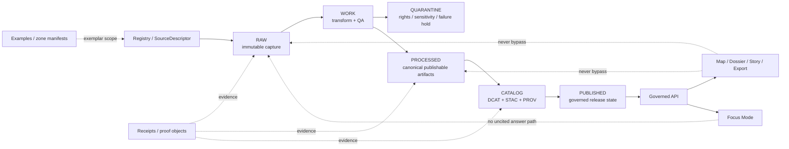

<!-- [KFM_META_BLOCK_V2]
doc_id: kfm://doc/<NEEDS_VERIFICATION_UUID>
title: data/
type: standard
version: v1
status: draft
owners: NEEDS VERIFICATION
created: YYYY-MM-DD
updated: 2026-03-18
policy_label: NEEDS VERIFICATION
related: [../README.md, ./registry/README.md, ./specs/README.md, ./catalog/README.md, ./catalog/stac/README.md]
tags: [kfm, data, truth-path, catalog, provenance]
notes: [Current-session workspace inspection exposed PDF documents only; exact repo paths, owners, created date, policy label, and subdirectory existence remain NEEDS VERIFICATION. Relative links below are preserved as target-adjacent repo intent, not verified live-tree fact.]
[/KFM_META_BLOCK_V2] -->

# `data/`

Governed storage, lifecycle, and release-artifact surface for KFM evidence-bearing data.

> **Status:** experimental  
> **Doc state:** draft  
> **Owners:** NEEDS VERIFICATION  
> 
> 
> 
> 
> 
>   
> **Quick jump:** [Scope](#scope) · [Repo fit](#repo-fit) · [Accepted inputs](#accepted-inputs) · [Exclusions](#exclusions) · [Directory tree](#directory-tree) · [Quickstart](#quickstart) · [Usage](#usage) · [Diagram](#diagram) · [Tables](#tables) · [Task list](#task-list) · [FAQ](#faq) · [Appendix](#appendix)

> [!IMPORTANT]
> Current-session workspace inspection exposed PDF documents only. This README therefore treats `data/` as a **strongly documented target module** and treats its internal layout as a **doctrine-aligned target shape** unless the live repository checkout confirms otherwise.

## Scope

`data/` is the governed artifact surface for moving material through the KFM truth path:

`Source edge -> RAW -> WORK / QUARANTINE -> PROCESSED -> CATALOG -> PUBLISHED`

At the repository level, the March 2026 corpus also describes `data/` as the place for **registry entries, example datasets, catalog artifacts, and zone manifests**. Read together, those two views mean `data/` is not a generic storage bucket. It is the storage-and-artifact boundary where intake, lifecycle state, catalog closure, and release evidence stay legible.

### What this README is for

This file does four jobs:

1. defines what `data/` is allowed to hold,
2. shows how `data/` fits beside contracts, policy, apps, and tests,
3. distinguishes **CONFIRMED doctrine** from **NEEDS VERIFICATION path shape**,
4. gives maintainers a practical checklist for confirming or correcting the live tree.

> [!NOTE]
> This README uses **CATALOG** for the lifecycle state and **catalog triplet** for the linked `DCAT + STAC + PROV` closure that makes a version discoverable, traceable, and evidence-resolvable.

[Back to top](#data)

## Repo fit

**Target path:** `data/README.md`

### Path and adjacent surfaces

| Relation | Surface | Posture | Why it matters |
|---|---|---|---|
| Upstream | [`../README.md`](../README.md) | NEEDS VERIFICATION | Expected repo-wide doctrine, layout, and navigation surface. |
| Upstream | [`../contracts/`](../contracts/) | Documented target module | Shared schemas, profiles, and controlled vocabularies should remain explicit rather than hiding inside storage zones. |
| Upstream | [`../policy/`](../policy/) | Documented target module | Rights, sensitivity, obligations, and fail-closed rules belong in executable policy as well as docs. |
| Upstream | [`../docs/`](../docs/) | Documented target module | Architecture docs, ADRs, runbooks, and human-governed procedures should explain behavior-significant changes to the data surface. |
| Lateral | [`./registry/README.md`](./registry/README.md) | Documented target role / path NEEDS VERIFICATION | Source and dataset registration surfaces anchor intake intent, ownership, and stewardship. |
| Lateral | [`./catalog/README.md`](./catalog/README.md) | Documented target role / path NEEDS VERIFICATION | Catalog closure is part of release readiness, not decorative metadata. |
| Lateral | [`./catalog/stac/README.md`](./catalog/stac/README.md) | Documented triplet sub-surface / path NEEDS VERIFICATION | STAC is part of the catalog triplet and should stay coupled to release-ready assets. |
| Lateral | [`./specs/README.md`](./specs/README.md) | Requested adjacent link / path NEEDS VERIFICATION | The task expects this adjacency, but the strongest corpus evidence still points more clearly to `../contracts/` for shared spec surfaces. |
| Downstream | [`../apps/`](../apps/) | Documented target module | Public and role-limited surfaces should consume promoted scope through governed APIs, not through direct storage reads. |
| Downstream | [`../tests/`](../tests/) | Documented target module | Invalid fixtures, catalog validation, stale-projection tests, and correction drills should prove this surface. |
| Downstream | [`../infra/`](../infra/) | Documented target module | Deployment, promotion, reconciliation, backup, and rollback logic must preserve the trust membrane. |

### Schema placement note

The March 2026 corpus strongly supports machine-readable schemas, standards profiles, registries, and fixtures. What it does **not** settle from current-session evidence is one final rule for whether every spec-like artifact belongs under `data/specs/`, `../contracts/`, or a split arrangement.

This README therefore:

- keeps `./specs/README.md` because the requested target metadata expects it,
- treats `./specs/` as **NEEDS VERIFICATION**,
- treats `../contracts/` as the stronger documented home for shared schemas and profiles until the live checkout proves otherwise.

[Back to top](#data)

## Accepted inputs

The following belong in or immediately around `data/` when KFM’s doctrine is being honored:

- source registration artifacts and source-descriptor-adjacent metadata
- immutable raw captures and acquisition manifests
- work / quarantine outputs and validation artifacts
- processed dataset versions and canonical publishable derivatives
- catalog closure artifacts across **DCAT + STAC + PROV**
- receipts, release manifests, proof packs, and correction-linked evidence
- public-safe example datasets, catalog exemplars, and zone manifests that clarify lifecycle or publication shape

### Artifact families at a glance

| Artifact family | Why it exists | Typical stage |
|---|---|---|
| `SourceDescriptor` | Declares intake contract before a source is allowed into governed flow | Registry / source admission |
| `IngestReceipt` | Proves what was fetched, when, with which identity and integrity context | RAW |
| `ValidationReport` | Records schema, CRS, time, units, and domain QA outcomes | WORK / QUARANTINE |
| `DatasetVersion` | Carries immutable processed subject sets suitable for controlled cataloging and release | PROCESSED |
| `CatalogClosure` | Links release-ready `DCAT + STAC + PROV` metadata and identifiers | CATALOG |
| `DecisionEnvelope` + `ReviewRecord` | Carries machine-readable admissibility and review outcomes | Catalog / policy / review |
| `ReleaseManifest` / `ProofPack` | Assembles a publishable trust unit | Release boundary |
| `EvidenceBundle` | Resolves a visible claim or feature to inspectable support | Runtime and trust surfaces |
| `CorrectionNotice` | Preserves visible lineage under supersession, withdrawal, rollback, or narrowed republication | Post-publication governance |

> [!TIP]
> `data/` may **use** shared schemas from `../contracts/`, but that is different from treating `data/` as the canonical home for all shared schemas.

[Back to top](#data)

## Exclusions

The following do **not** belong here as sovereign truth or as the normal public path:

- direct client or browser reads from RAW, WORK, PROCESSED, or canonical stores
- secrets, credentials, tokens, or environment-specific secret material
- policy bundles and registries that belong under `../policy/`
- cross-repo shared schemas and standards profiles that belong under `../contracts/`
- unreviewed analyst scratch outputs presented as publishable evidence
- graph, search, vector, tile, scene, cache, or summary layers treated as authoritative truth
- silent overwrite of raw capture, processed authority, or published release state

> [!WARNING]
> `data/` is part of the governed evidence path. It is **not** the trust membrane, **not** the API boundary, and **not** permission to expose storage directly.

[Back to top](#data)

## Directory tree

### Doctrine-aligned target shape

The tree below is a **documentation-first target shape**, not a claim that every path already exists in the current checkout.

```text
data/
├── README.md
├── registry/                # source and dataset registration surfaces
├── raw/                     # immutable source-native capture
├── work/                    # transforms, QA, and reproducible intermediate work
│   └── quarantine/          # unresolved rights/sensitivity/failure hold
├── processed/               # canonical publishable derivatives and dataset versions
├── catalog/                 # catalog closure boundary
│   ├── dcat/
│   ├── stac/
│   └── prov/
├── receipts/               # run, validation, and release evidence
├── examples/               # public-safe examples / catalog exemplars
└── specs/                  # optional/request-derived adjacency; verify vs ../contracts/
```

### Path posture

| Path claim | Posture | Reading rule |
|---|---|---|
| `data/` is a top-level repo area | Documented root role / current-session path NEEDS VERIFICATION | Safe to describe as a documented target module. Verify live presence in checkout. |
| `data/` carries lifecycle zones aligned to RAW -> WORK / QUARANTINE -> PROCESSED -> CATALOG -> PUBLISHED | CONFIRMED doctrine | Safe to describe as KFM law. |
| `data/registry/`, `data/catalog/`, `data/receipts/` | Documented target roles / subpaths NEEDS VERIFICATION | Treat as intended subareas unless the live repo confirms exact names. |
| `data/examples/` | Strongly implied repo role / path NEEDS VERIFICATION | Supported by the documented purpose of `data/`, but exact placement still needs checkout confirmation. |
| `data/specs/` | Requested adjacency only / NEEDS VERIFICATION | Do not create by reflex; first verify whether the repo already centralizes this under `../contracts/`. |

### Surface intent

| Surface | Role | What must never happen |
|---|---|---|
| `registry/` | Declares source and dataset admission context before fetch or publication | Ad hoc onboarding with no explicit owner, rights posture, or quality contract |
| `raw/` | Preserves immutable source-native bytes and minimal intake memory | In-place mutation or direct public exposure |
| `work/` | Hosts reproducible transforms, normalization, redaction, and QA | Quiet drift into pseudo-production |
| `work/quarantine/` | Holds unresolved rights, sensitivity, extraction, or validation problems | “Publish with warning” as the normal path |
| `processed/` | Carries canonical publishable derivatives and dataset versions | Artifacts that cannot regenerate valid catalog closure |
| `catalog/` | Carries `DCAT + STAC + PROV` closure and outward identifiers | Marking a version complete with broken or partial linkage |
| `receipts/` | Holds run, validation, release, and correction evidence | Consequential publication with no reconstructible trail |
| `examples/` | Holds public-safe exemplars and documentation-support artifacts | Examples quietly treated as authoritative domain coverage |

[Back to top](#data)

## Quickstart

Assuming a real checkout is available locally, verify the live tree before trusting any adjacent path in this README.

```bash
# Verify that the target surface exists
pwd
find data -maxdepth 3 -print 2>/dev/null | sort

# Inspect storage-facing README files if present
test -f data/README.md && sed -n '1,220p' data/README.md
test -f data/registry/README.md && sed -n '1,200p' data/registry/README.md
test -f data/catalog/README.md && sed -n '1,200p' data/catalog/README.md
test -f data/catalog/stac/README.md && sed -n '1,200p' data/catalog/stac/README.md
test -f data/specs/README.md && sed -n '1,200p' data/specs/README.md

# Inspect artifact-shaped files if present
find data -maxdepth 4 -type f \
  \( -iname '*manifest*' -o -iname '*receipt*' -o -iname '*catalog*' -o -iname '*.json' -o -iname '*.yaml' -o -iname '*.yml' \) \
  2>/dev/null | sort | sed -n '1,160p'
```

### Minimal verification pass

```bash
# Confirm or downgrade the documented target shape
for d in registry raw work processed catalog receipts examples specs; do
  test -d "data/$d" && echo "FOUND data/$d" || echo "MISSING data/$d"
done

# Check whether catalog-triplet artifacts exist anywhere under data/
find data -type f 2>/dev/null | grep -Ei '/(stac|dcat|prov)/|catalog' || true

# Check whether receipt/proof-shaped artifacts exist
find data -type f 2>/dev/null | grep -Ei 'receipt|manifest|proof|attest|bundle|correction' || true
```

> [!TIP]
> If `data/specs/` is absent, do not quietly create it. Verify whether the repo already treats `../contracts/` as the canonical home for schemas, profiles, and registries.

[Back to top](#data)

## Usage

### 1. Register before you fetch

In KFM, source intake is a contract, not a download. If a source cannot be described with enough clarity to be replayed, rights-reviewed, and quality-checked, it is not ready for governed intake.

### 2. Capture raw immutably

`RAW` is where source-native bytes, request context, and minimal intake memory remain durable. Cleanup, normalization, OCR, or restructuring belong later.

### 3. Transform in `WORK`, quarantine when necessary

Normalization, reprojection, parsing, OCR, QA, enrichment, redaction, and repair belong in `WORK`. Unclear rights, unresolved sensitivity, failed validation, or low-confidence extraction move to `QUARANTINE`, not to `PROCESSED`.

### 4. Treat processed outputs as release candidates, not just files

`PROCESSED` is where stable derivatives and immutable dataset versions emerge. They should already point back to receipts, validation outputs, and the source context that makes them auditable.

### 5. Close the catalog triplet before promotion

A version is not release-ready until **DCAT + STAC + PROV** can cross-link identifiers, assets, lineage, and outward discovery surfaces without guesswork.

### 6. Publish by governed transition

`PUBLISHED` is first a release state, not merely a sibling folder. Promotion binds dataset version, catalog closure, policy state, review state, proof objects, and rollback readiness into one inspectable decision.

### 7. Keep derived layers derived

Search, graph, vector, tile, scene, summary, and export layers may accelerate access, but they remain downstream of approved release scope. They must prove freshness and release linkage rather than quietly becoming truth by convenience.

### 8. Carry correction forward visibly

Rollback, supersession, withdrawal, correction, and stale-visible states must remain legible in artifacts and surfaces. Silent overwrite is not a valid repair strategy.

[Back to top](#data)

## Diagram


```mermaid
flowchart LR
    REG[Registry / SourceDescriptor] --> RAW[RAW<br/>immutable capture]
    RAW --> WORK[WORK<br/>transform + QA]
    WORK --> QUAR[QUARANTINE<br/>rights / sensitivity / failure hold]
    WORK --> PROC[PROCESSED<br/>canonical publishable artifacts]
    PROC --> CAT[CATALOG<br/>DCAT + STAC + PROV]
    CAT --> PUB[PUBLISHED<br/>governed release state]
    PUB --> API[Governed API]
    API --> UI[Map / Dossier / Story / Export]
    API --> FOCUS[Focus Mode]

    REC[Receipts / proof objects] -. evidence .-> RAW
    REC -. evidence .-> PROC
    REC -. evidence .-> CAT
    EX[Examples / zone manifests] -. exemplar scope .-> REG

    UI -. never bypass .-> RAW
    UI -. never bypass .-> PROC
    FOCUS -. no uncited answer path .-> RAW
```

[Back to top](#data)

## Tables

### Truth-path zone matrix

| Zone / state | Core question | What belongs here | Block if |
|---|---|---|---|
| `RAW` | What exactly arrived? | Source-native payloads, request details, checksums, manifests, rights snapshots | Raw bytes are mutated in place or exposed directly |
| `WORK` | What deterministic transform is happening? | Repair, normalization, OCR, reprojection, QA, redaction transforms | Transform logic is irreproducible or undocumented |
| `QUARANTINE` | What is unresolved or unsafe? | Rights ambiguity, sensitivity ambiguity, failed validation, low-confidence extraction | Ambiguous material is treated as “almost publishable” |
| `PROCESSED` | What is now canonical and publishable? | Immutable processed artifacts, dataset versions, final QA outputs | The artifact cannot support valid catalog closure |
| `CATALOG` | Can the release be discovered and explained? | Cross-linked `DCAT + STAC + PROV`, outward identifiers, evidence pointers | Triplet members are missing, broken, or unresolved |
| `PUBLISHED` | May this scope be exposed? | Governed release state through API and trust-visible surfaces | Publication is treated as a folder copy instead of a gated transition |

### Minimum gates before outward trust widens

| Gate family | What it proves | Fail-closed outcome |
|---|---|---|
| Source admission | A `SourceDescriptor` captures admissibility, rights, cadence, owner, and quality contract | Reject, defer, or register-only |
| Source replay | Intake memory is sufficient to re-fetch and verify inputs | Hold or quarantine |
| Schema conformance | Required fields, enums, and structural constraints are satisfied | Block merge or promotion |
| Geometry / CRS | Geometry is valid, CRS is explicit, and spatial support is coherent | Hold in `WORK / QUARANTINE` |
| Time validity | Time fields are present and semantically meaningful | Hold or quarantine |
| Identifier stability | IDs, spec hashes, and lineage pointers are deterministic enough to audit and replay | Block canonical write or release |
| Checksum / integrity | Acquired and processed artifacts match recorded digests | Quarantine or retry |
| Catalog closure | `STAC + DCAT + PROV` and outward identifiers resolve coherently | Block release or promotion |
| Policy bundle | Rights, sensitivity, reason codes, and deny-by-default rules are sufficient | Deny or hold |
| Evidence resolution | Every consequential visible claim resolves to inspectable support | Runtime must abstain, deny, or error |
| Correction drill | Supersession, withdrawal, rollback, and correction remain visible and auditable | Prevent silent overwrite |

### Path-certainty matrix

| Claim | Status | Safer wording |
|---|---|---|
| `data/` belongs at repo root | Documented repo role / current-session path NEEDS VERIFICATION | “documented target module; verify in checkout” |
| `data/` contains lifecycle-aligned zones | CONFIRMED doctrine | “governed target shape for KFM data state” |
| `data/registry/`, `data/catalog/`, `data/receipts/` exist today | NEEDS VERIFICATION | “documented target roles; verify actual subpaths” |
| `data/specs/` is canonical | NOT ESTABLISHED | “requested adjacent path; verify against `../contracts/`” |
| published is “just another folder” | NOT SUPPORTED | “published is a governed state first” |

[Back to top](#data)

## Task list

### Definition of done for this README

- [ ] The file separates **CONFIRMED doctrine** from **NEEDS VERIFICATION repo shape**.
- [ ] `data/` is described as a governed truth-path surface, not a generic bucket.
- [ ] Accepted inputs and exclusions are explicit.
- [ ] The directory tree is clearly labeled as a doctrine-aligned target shape rather than silent repo fact.
- [ ] The README makes clear that storage is not the trust membrane.
- [ ] At least one Mermaid diagram explains real KFM structure.
- [ ] Verification steps tell a maintainer how to confirm or downgrade path claims in a live checkout.

### Review checks before merge

- [ ] Replace placeholder `doc_id`, owners, created date, and policy label with repo-backed metadata.
- [ ] Verify all relative links against the actual checkout.
- [ ] Confirm whether shared schemas belong under `data/specs/` or `../contracts/`.
- [ ] Confirm whether `examples/` and `receipts/` exist as real subpaths or need relocation.
- [ ] Add one real example of a receipt/proof object path if such artifacts already exist in the repo.
- [ ] Keep terminology aligned with KFM doctrine: truth path, trust membrane, authoritative-versus-derived, catalog closure, EvidenceBundle, promotion, correction.

[Back to top](#data)

## FAQ

### Is `published` a directory?

Not by doctrine. In KFM, **published** is first a governed release state. A repo may materialize supporting artifacts for that state, but publication is not reducible to “copy files somewhere.”

### Why is `data/` not the public API surface?

Because storage is not the trust membrane. Public and role-limited surfaces are supposed to cross governed APIs, policy checks, evidence resolution, and release-state checks before trust is granted.

### Do graph, search, vector, tile, or scene layers belong under `data/`?

They may exist as derived artifacts or build outputs, but they must remain explicitly downstream of approved release scope and must not become sovereign truth.

### Where should schemas live: `data/specs/` or `../contracts/`?

The corpus strongly supports machine-readable schemas and profiles, but current-session evidence does not settle the exact path rule. Verify the live tree before choosing. This README keeps `./specs/README.md` only as a requested adjacency, not as a confirmed path.

### Are example datasets allowed here?

Yes, when they are public-safe, clearly labeled as examples, and used to explain lifecycle, catalog, or UI behavior. Large test fixtures or synthetic failure cases may fit better under `../tests/`.

[Back to top](#data)

## Appendix

<details>
<summary>Glossary</summary>

| Term | Meaning in this README |
|---|---|
| Truth path | The governed movement from source edge through RAW, WORK / QUARANTINE, PROCESSED, CATALOG, and into PUBLISHED state. |
| Trust membrane | The rule that clients do not bypass governed APIs, policy mediation, and evidence resolution to reach storage directly. |
| Catalog triplet | The linked metadata boundary formed by `DCAT + STAC + PROV`. |
| SourceDescriptor | Intake contract describing access mode, cadence, rights posture, normalization plan, and quality checks. |
| DatasetVersion | Immutable governed version of a processed subject set. |
| EvidenceBundle | Governed support object that resolves a visible claim or answer into inspectable evidence. |
| Derived layer | Search, graph, vector, tile, scene, summary, or export surface built downstream of stronger truth. |
| CorrectionNotice | Evidence-bearing supersession, withdrawal, rollback, or narrowed republication object. |

</details>

<details>
<summary>Verification backlog carried by this file</summary>

| Item | Why it matters |
|---|---|
| Actual `data/` tree snapshot | Converts documented target shape into inspectable repo fact |
| Owners / dates / policy label / doc UUID | Lets the metadata block stop carrying placeholders |
| Real schema and registry placement | Resolves `data/specs/` versus `../contracts/` ambiguity |
| Sample receipts / manifests / catalog outputs | Grounds examples in emitted project artifacts rather than doctrine alone |
| Adjacent README presence and names | Prevents broken relative links from drifting into repo-native docs |
| One hydrology-first thin-slice artifact chain | Gives the data surface one end-to-end, public-safe proof lane |

</details>

<details>
<summary>Related entrypoints</summary>

- [`../README.md`](../README.md)
- [`./registry/README.md`](./registry/README.md)
- [`./specs/README.md`](./specs/README.md)
- [`./catalog/README.md`](./catalog/README.md)
- [`./catalog/stac/README.md`](./catalog/stac/README.md)
- [`../contracts/`](../contracts/)
- [`../policy/`](../policy/)
- [`../docs/`](../docs/)
- [`../tests/`](../tests/)

</details>

[Back to top](#data)
