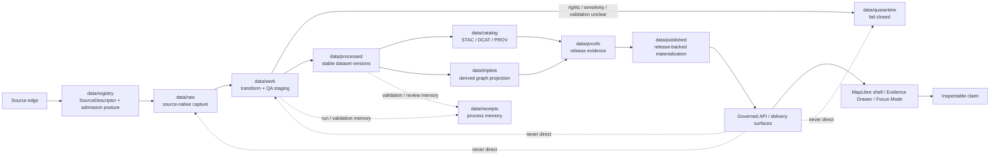

<!-- [KFM_META_BLOCK_V2]
doc_id: kfm://doc/NEEDS_VERIFICATION__data_readme
title: data
type: standard
version: v1
status: draft
owners: @bartytime4life
created: NEEDS_VERIFICATION__YYYY-MM-DD
updated: 2026-04-22
policy_label: NEEDS_VERIFICATION__public_or_internal
related: [
  ../README.md,
  ./registry/README.md,
  ./fixtures/,
  ./raw/README.md,
  ./work/README.md,
  ./quarantine/README.md,
  ./processed/README.md,
  ./catalog/README.md,
  ./triplets/,
  ./receipts/README.md,
  ./proofs/README.md,
  ./published/README.md,
  ../contracts/README.md,
  ../schemas/README.md,
  ../policy/README.md,
  ../tests/README.md,
  ../tools/README.md,
  ../pipelines/README.md,
  ../release/,
  ../apps/,
  ../.github/CODEOWNERS,
  ../.github/workflows/
]
tags: [kfm, data, lifecycle, evidence, registry, catalog, receipts, proofs, publication]
notes: [
  "doc_id, created date, and final policy label need active-branch verification.",
  "Owner is grounded in current public CODEOWNERS coverage for /data/.",
  "This README is both a standard KFM doc and a README-like directory landing page.",
  "Implementation depth, emitted artifact inventory, validator wiring, and workflow enforcement remain NEEDS VERIFICATION unless proven by the active checkout."
]
[/KFM_META_BLOCK_V2] -->

<a id="top"></a>

# `data/`

Governed lifecycle surface for KFM source admission, evidence-bearing data stages, catalog closure, process memory, release evidence, and public-safe materialization.

> [!IMPORTANT]
> **Status:** active  
> **Doc state:** draft  
> **Owners:** `@bartytime4life`  
> **Path:** `data/README.md`  
> **Repo fit:** child of [`../README.md`](../README.md); parent to [`./registry/`](./registry/), [`./raw/`](./raw/), [`./work/`](./work/), [`./quarantine/`](./quarantine/), [`./processed/`](./processed/), [`./catalog/`](./catalog/), [`./triplets/`](./triplets/), [`./receipts/`](./receipts/), [`./proofs/`](./proofs/), and [`./published/`](./published/); adjacent to [`../contracts/`](../contracts/), [`../schemas/`](../schemas/), [`../policy/`](../policy/), [`../tests/`](../tests/), [`../tools/`](../tools/), [`../pipelines/`](../pipelines/), and [`../release/`](../release/).
>
> 
> 
> 
> 
> 
> 
>
> **Quick jumps:** [Scope](#scope) · [Repo fit](#repo-fit) · [Accepted inputs](#accepted-inputs) · [Exclusions](#exclusions) · [Directory tree](#directory-tree) · [Quickstart](#quickstart) · [Usage](#usage) · [Diagram](#diagram) · [Reference tables](#reference-tables) · [Task list](#task-list--definition-of-done) · [FAQ](#faq) · [Appendix](#appendix)

> [!CAUTION]
> `data/` is **not** the trust membrane, not a public API, and not a shortcut around governance. Public and role-limited clients should consume release-backed scope through governed interfaces, catalog records, tile services, EvidenceBundle resolution, and review-visible state — not through direct reads of RAW, WORK, QUARANTINE, or unpublished candidates.

---

## Scope

`data/` is the repo-facing home for KFM’s governed data lifecycle.

It exists to make evidence-bearing material inspectable as it moves from source admission toward public-safe publication:

```text
SOURCE EDGE → RAW → WORK / QUARANTINE → PROCESSED → CATALOG / TRIPLET → PUBLISHED
```

Inside that path, this directory should help maintainers answer practical review questions:

- What source or dataset was admitted?
- What lifecycle state is this material in?
- What source role, rights posture, sensitivity, and review burden apply?
- What receipts, validation reports, catalog records, proof packs, release manifests, or correction notices explain the movement?
- Which public or role-limited surfaces may consume the result?

The durable KFM value is not “a file under `data/`.” The durable value is an **inspectable claim** or release-backed artifact that can be traced to admissible evidence, spatial and temporal scope, source role, policy posture, review state, release state, and correction lineage.

### Evidence posture used here

| Label | Meaning in this README |
|---|---|
| **CONFIRMED** | Directly supported by current public repo evidence, current-session inspection, or stable KFM doctrine. |
| **INFERRED** | Strongly follows from adjacent README surfaces and KFM doctrine, but still needs active-branch confirmation. |
| **PROPOSED** | A recommended pattern or future structure that fits KFM but is not proven as current implementation. |
| **UNKNOWN** | Not verifiable from the available checkout, public tree, or attached corpus. |
| **NEEDS VERIFICATION** | A specific check required before stronger repo, workflow, validator, schema, or release claims are made. |

[Back to top](#top)

---

## Repo fit

`data/` is a lifecycle and evidence-surface parent. It should remain close to contracts, schemas, policy, validators, tests, pipelines, release handling, and governed application surfaces — but it should not absorb their responsibilities.

### Path and neighboring surfaces

| Relation | Surface | Role | Current posture |
|---|---|---|---|
| Parent | [`../README.md`](../README.md) | Project identity, trust posture, and repo-level orientation | **CONFIRMED** |
| Admission | [`./registry/`](./registry/) | Source identity, source role, rights, cadence, activation state, and dataset onboarding | **CONFIRMED path** |
| Fixture support | [`./fixtures/`](./fixtures/) | Small example or test-oriented data artifacts where repo convention permits | **CONFIRMED path / NEEDS VERIFICATION contents** |
| Lifecycle | [`./raw/`](./raw/) | Immutable source-native intake | **CONFIRMED path** |
| Lifecycle | [`./work/`](./work/) | Non-public transformation, normalization, QA, and handoff staging | **CONFIRMED path** |
| Lifecycle | [`./quarantine/`](./quarantine/) | Fail-closed holding state for invalid, sensitive, rights-conflicted, or unresolved material | **CONFIRMED path** |
| Lifecycle | [`./processed/`](./processed/) | Stable, normalized, reviewable dataset versions before publication | **CONFIRMED path** |
| Catalog | [`./catalog/`](./catalog/) | STAC / DCAT / PROV and internal catalog closure where applicable | **CONFIRMED path** |
| Projection | [`./triplets/`](./triplets/) | Derived graph/triplet projection; never sovereign truth | **CONFIRMED path / NEEDS VERIFICATION contents** |
| Process memory | [`./receipts/`](./receipts/) | Run, ingest, validation, review, and audit-facing process memory | **CONFIRMED path** |
| Release evidence | [`./proofs/`](./proofs/) | Proof packs, attestations, release evidence, rollback/correction trace | **CONFIRMED path** |
| Publication | [`./published/`](./published/) | Optional materialized outward scope after governed promotion | **CONFIRMED path** |
| Control | [`../contracts/`](../contracts/) · [`../schemas/`](../schemas/) | Human and machine contract authority; schema-home split remains review-sensitive | **CONFIRMED paths / ADR-sensitive** |
| Control | [`../policy/`](../policy/) | Policy rules, decision logic, reason codes, release obligations | **CONFIRMED path** |
| Verification | [`../tests/`](../tests/) · [`../tools/`](../tools/) | Fixtures, validators, proof checks, documentation checks, catalog/link checks | **CONFIRMED paths** |
| Execution | [`../pipelines/`](../pipelines/) | Watchers, ingest, transform, and promotion handoff flows | **CONFIRMED path / NEEDS VERIFICATION depth** |
| Release | [`../release/`](../release/) | Release manifests, release notes, promotion bundles, and distribution controls where adopted | **CONFIRMED path / NEEDS VERIFICATION depth** |
| Runtime | [`../apps/`](../apps/) | Governed API and UI consumers of release-backed data | **CONFIRMED path / implementation UNKNOWN** |

### Boundary summary

| Question | Answer |
|---|---|
| What is `data/` for? | Governed source admission, lifecycle state, evidence-bearing artifacts, small fixtures, catalog closure, process memory, release proof support, and materialized published scope. |
| What is `data/` not? | Not a public API, not a model context bucket, not a schema authority by default, not a policy home, and not permission to expose unpublished or sensitive material directly. |
| What stays adjacent? | Contracts, schemas, executable policy, validators, workflow code, app routes, secrets, platform settings, and branch/ruleset enforcement. |

[Back to top](#top)

---

## Accepted inputs

The following belong in or immediately around `data/` when they preserve the KFM lifecycle and evidence posture.

| Accepted input | Why it belongs here | Typical surface |
|---|---|---|
| Source registration artifacts | Source onboarding is a governed admission act, not just a fetch | `registry/` |
| Source-native captures or acquisition manifests | RAW must preserve what arrived and under what context | `raw/` |
| Request metadata, rights snapshots, and checksums | Intake must be replayable and reviewable | `raw/`, `receipts/` |
| Repeatable transform outputs | WORK normalizes and validates without pretending to publish | `work/` |
| Redaction, generalization, and QA candidates | Sensitive and policy-bearing transforms need visible handoff context | `work/`, `quarantine/`, `receipts/` |
| Invalid, rights-unclear, sensitive, or unresolved material | Fail-closed handling is a normal lifecycle state | `quarantine/` |
| Stable processed dataset versions | Processed artifacts carry normalized authority before release | `processed/` |
| Catalog closure records | Discovery and provenance need STAC / DCAT / PROV or internal equivalents | `catalog/` |
| Derived graph/triplet projection files | Graph views are useful query projections when clearly derivative | `triplets/` |
| Receipts and validation reports | Replay, rollback, audit, and correction need process memory | `receipts/` |
| Proof packs and release evidence | Promotion must leave reviewable evidence and rollback targets | `proofs/`, `release/` |
| Release-backed materialized outputs | Some promoted artifacts need stable outward packaging | `published/` |
| Small fixtures or examples | Tests and docs may need compact, public-safe data examples | `fixtures/`, `tests/fixtures/` |

> [!TIP]
> When in doubt, ask: “Is this source-native, work-in-progress, blocked, processed, cataloged, proof-bearing, or published?” If the answer is unclear, use a receipt, validation report, or quarantine path rather than silently choosing the most convenient folder.

[Back to top](#top)

---

## Exclusions

Do not use `data/` as a catch-all for anything that is merely data-shaped.

| Does **not** belong here | Better home | Why |
|---|---|---|
| Secrets, tokens, credentials, private keys, or deployment credentials | Secret manager or deployment-only configuration outside the public repo | Public data surfaces must not leak operational access. |
| Canonical schema definitions unless the schema-home ADR says so | [`../schemas/`](../schemas/) or [`../contracts/`](../contracts/) | `data/` should hold instances and lifecycle artifacts, not silently become the contract authority. |
| Policy source code or reason-code law | [`../policy/`](../policy/) | Policy must remain reviewable and testable as policy. |
| Application routes, UI state, or model runtime code | [`../apps/`](../apps/) or [`../packages/`](../packages/) | Runtime behavior belongs behind governed APIs and typed contracts. |
| Large ad hoc downloads without source registration | `registry/` first, then `raw/` after admission | Source identity, rights, cadence, and sensitivity must be explicit. |
| Analyst scratch that cannot be replayed | Local ignored workspace or governed `work/` run folder with receipts | Unreplayable scratch becomes invisible authority. |
| Exact sensitive locations for archaeology, rare species, cultural, sacred, critical-infrastructure, living-person, DNA, or other restricted contexts | Restricted steward workflow, redacted/generalized derivative, or `quarantine/` | KFM fails closed when public exposure risk is unresolved. |
| Published-looking outputs that lack release proof | `processed/` + `catalog/` + `proofs/` until promotion passes | Publication is a governed state transition, not a file copy. |
| Generated summaries or direct AI output | Governed runtime envelope, EvidenceBundle, AIReceipt, and citation validation | Generated prose is not root truth. |
| Emergency-alerting or life-safety instruction payloads | Official alerting authorities and external public-safety systems | KFM contextualizes evidence; it is not an emergency alert system. |

[Back to top](#top)

---

## Directory tree

### Current top-level `data/` shape

```text
data/
├── README.md
├── catalog/
├── fixtures/
├── processed/
├── proofs/
├── published/
├── quarantine/
├── raw/
├── receipts/
├── registry/
├── triplets/
└── work/
```

> [!NOTE]
> The tree above is the parent-level orientation. Deeper per-lane inventories, emitted artifacts, workflow outputs, schema bindings, and validator wiring remain **NEEDS VERIFICATION** unless the active branch proves them.

### Proposed domain-lane deepening pattern

Use this only after source admission, schema-home review, policy review, and fixture planning.

```text
data/
├── registry/
│   └── <domain>/
├── raw/
│   └── <source_id>/<acquisition_id>/
├── work/
│   └── <domain>/<run_id>/
├── quarantine/
│   └── <domain>/<hold_id>/
├── processed/
│   └── <domain>/<dataset_id>/<version>/
├── catalog/
│   ├── stac/<domain>/
│   ├── dcat/<domain>/
│   └── prov/<domain>/
├── triplets/
│   └── <domain>/
├── receipts/
│   └── <domain>/
├── proofs/
│   └── <domain>/<release_id>/
└── published/
    └── <domain>/<release_id>/
```

[Back to top](#top)

---

## Quickstart

Use these commands to inspect the data surface without implying deeper implementation maturity.

```bash
# From the repository root.
git status --short
git branch --show-current
git rev-parse --show-toplevel

find data -maxdepth 2 -type d | sort
find data -maxdepth 3 -type f -iname 'README.md' | sort
```

Check for large or sensitive files before committing.

```bash
# Review candidate data additions.
git status --short data
git diff --stat -- data
git diff --name-only -- data | sort
```

Inspect likely governance companions before promoting or publishing anything.

```bash
find data/registry data/receipts data/proofs data/catalog data/published \
  -maxdepth 3 -type f 2>/dev/null | sort

find contracts schemas policy tests tools pipelines release \
  -maxdepth 3 -type f 2>/dev/null | sort | sed -n '1,250p'
```

> [!WARNING]
> Do not add live provider pulls, sensitive exact geometry, credentials, or large generated outputs merely to satisfy a README example. Use public-safe fixtures and small, reviewable manifests until the relevant source descriptor, policy, schema, and validator path are verified.

[Back to top](#top)

---

## Usage

### Lifecycle rules

1. **Register before harvesting.** A source should have an identity, source role, rights posture, sensitivity posture, cadence, and review burden before live ingestion.
2. **Land source-native material in RAW.** Preserve original bytes, request context, checksums, and rights snapshots.
3. **Transform in WORK.** Normalize, reproject, enrich, redact, generalize, QA, and prepare handoff without pretending to publish.
4. **Escalate uncertainty to QUARANTINE.** Rights conflicts, sensitivity ambiguity, failed validation, stale evidence, or unresolved identity should fail closed.
5. **Stabilize in PROCESSED.** A processed artifact should have stable identity, schema context, time semantics, and validation evidence.
6. **Close the catalog and projection seams.** Catalog records, triplets, and derivative layers should point back to processed/release-backed support.
7. **Separate receipts from proofs.** Receipts preserve process memory; proofs support release trust.
8. **Publish only after promotion.** `published/` is for release-backed outward scope, not convenience copies.

### Naming guidance

Prefer deterministic, boring names.

| Naming pressure | Recommended pattern | Avoid |
|---|---|---|
| Source identity | `source_id` from registry | provider nickname without role |
| Acquisition | timestamp or source-provided version | “latest” |
| Run identity | `run_id` + `spec_hash` where available | opaque local notebook names |
| Dataset version | stable version, date, or digest-bearing folder | overwrite-in-place folders |
| Release | `release_id` tied to manifest/proof | public copy without rollback target |
| Blocked material | explicit hold id and reason | hidden `tmp/` or `misc/` folder |

[Back to top](#top)

---

## Diagram


```mermaid
flowchart LR
    S[Source edge] --> R0[data/registry<br/>SourceDescriptor + admission posture]
    R0 --> RAW[data/raw<br/>source-native capture]
    RAW --> W[data/work<br/>transform + QA staging]
    W -->|rights / sensitivity / validation unclear| Q[data/quarantine<br/>fail closed]
    W --> P[data/processed<br/>stable dataset versions]
    P --> C[data/catalog<br/>STAC / DCAT / PROV]
    P --> T[data/triplets<br/>derived graph projection]
    W -. run / validation memory .-> RC[data/receipts<br/>process memory]
    P -. validation / review memory .-> RC
    C --> PF[data/proofs<br/>release evidence]
    T --> PF
    PF --> PUB[data/published<br/>release-backed materialization]
    PUB --> API[Governed API / delivery surfaces]
    API --> UI[MapLibre shell / Evidence Drawer / Focus Mode]
    UI --> CLAIM[Inspectable claim]

    API -. never direct .-> RAW
    API -. never direct .-> W
    API -. never direct .-> Q
```

### Reading rule

The forbidden arrows matter as much as the happy path. Normal public clients and routine UI surfaces should not read `raw/`, `work/`, or `quarantine/` directly.

[Back to top](#top)

---

## Reference tables

### Lifecycle role matrix

| Surface | Main role | Can be public by itself? | Typical gate before moving on |
|---|---|---:|---|
| `registry/` | Source and dataset admission | No | Source role, rights, sensitivity, cadence, and review posture declared |
| `raw/` | Source-native intake | No | Checksums, request context, rights snapshot, acquisition receipt |
| `work/` | Transform and QA staging | No | Reproducibility, validation, policy checks, handoff notes |
| `quarantine/` | Fail-closed hold state | No | Explicit reason, reviewer or policy decision, correction path |
| `processed/` | Stable normalized artifacts | Not directly | Schema, spatial/temporal/unit validation, evidence linkage |
| `catalog/` | Discovery and provenance closure | Not alone | Catalog links to source, dataset, evidence, and release intent |
| `triplets/` | Derived graph/query projection | Not sovereign truth | Provenance to processed support and projection contract |
| `receipts/` | Process memory | Not proof alone | Links to run, validation, policy, review, and subject artifacts |
| `proofs/` | Release evidence | Supports release | Integrity, manifest, policy, review, rollback reference |
| `published/` | Release-backed outward materialization | Yes, if promoted | Promotion decision, proof pack, catalog closure, correction route |

### Artifact families

| Family | Purpose | Strong home |
|---|---|---|
| `SourceDescriptor` | Names source role, authority limits, rights, sensitivity, cadence, and activation state | `data/registry/` + schema/contract surface |
| `IngestReceipt` | Records acquisition, request, hash, and raw landing context | `data/receipts/`, sometimes raw-adjacent |
| `ValidationReport` | Records schema, spatial, temporal, unit, source-role, and policy validation | `data/receipts/` |
| `DatasetVersion` | Stable processed artifact identity | `data/processed/` |
| `CatalogClosure` | STAC/DCAT/PROV or internal closure for discoverability and provenance | `data/catalog/` |
| `DecisionEnvelope` / `PolicyDecision` | Bounded allow/deny/abstain/error and obligations | `policy/`, `schemas/`, `receipts/` |
| `EvidenceBundle` | Inspectable support package for claims and UI trust surfaces | `data/proofs/`, release bundle, or governed evidence surface |
| `ReleaseManifest` | Names release artifacts, hashes, scope, and rollback target | `data/proofs/`, `release/` |
| `LayerManifest` | Binds rendered map layer to governed source/evidence/policy state | `data/catalog/`, `data/proofs/`, app delivery contracts |
| `CorrectionNotice` | Records rollback, supersession, withdrawal, or narrowed republication | `data/proofs/`, `release/`, docs/runbooks |

### Review burden by risk

| Risk signal | Default action | Release note |
|---|---|---|
| Unknown rights | Quarantine or deny promotion | Do not publish until source terms are recorded |
| Sensitive exact location | Redact, generalize, restrict, or quarantine | Store transform receipt and reason |
| Missing EvidenceRef | Abstain from consequential claim | Do not paper over with summary prose |
| Failed validation | Quarantine | Keep validation report visible |
| Stale operational feed | Mark stale or hold | Do not imply current status |
| Model-generated text | Treat as interpretation only | Require EvidenceBundle and AIReceipt when material |
| Graph or tile derivative | Treat as projection | Link to processed/release-backed source |

[Back to top](#top)

---

## Task list / definition of done

A change under `data/` is not done because a file exists. It is done when the lifecycle, evidence, and release consequences are reviewable.

- [ ] Path, owner, and adjacent README links verified.
- [ ] KFM Meta Block V2 present for README-like governed Markdown.
- [ ] Source role, rights, sensitivity, cadence, and activation state captured for new sources.
- [ ] RAW inputs preserve source-native material, request context, and checksums.
- [ ] WORK outputs are reproducible enough to replay or explain.
- [ ] QUARANTINE items include explicit reason, reviewer/policy context, and next action.
- [ ] PROCESSED artifacts have stable identity, schema context, and validation results.
- [ ] CATALOG records link to source, processed artifact, evidence, and release intent.
- [ ] TRIPLET projections remain derivative and resolvable back to governed sources.
- [ ] RECEIPTS and PROOFS remain separate.
- [ ] PUBLISHED material is release-backed, policy-checked, and rollback-aware.
- [ ] No normal public route, UI layer, export, story, or Focus Mode answer reads RAW, WORK, QUARANTINE, or canonical/internal stores directly.
- [ ] Documentation updated wherever lifecycle meaning, source status, publication status, or public interpretation changed.

[Back to top](#top)

---

## FAQ

### Is `data/` the source of truth?

Not by itself. `data/` contains lifecycle artifacts and evidence-bearing surfaces. Current truth still depends on source role, contracts, schemas, policy, validation, review, catalog closure, release state, and correction lineage.

### Can clients read directly from `data/published/`?

Only if the project explicitly treats a published artifact as a release-backed delivery object and the governed interface rules allow it. The normal KFM posture is that public clients use governed APIs, cataloged delivery, tile services, EvidenceBundle resolution, and trust-visible UI state.

### Are receipts the same as proofs?

No. Receipts are process memory: what ran, when, with which inputs, checks, outputs, and policy context. Proofs are release evidence: why a promoted artifact can be trusted, reviewed, rolled back, or corrected.

### What should happen to sensitive exact locations?

Fail closed. Use quarantine, redaction, generalization, staged access, or steward review. Do not commit public exact geometry for sensitive archaeology, rare species, cultural, sacred, critical infrastructure, living-person, DNA, or other restricted contexts unless the governing policy and review state explicitly support release.

### Can AI-generated summaries be stored here?

Only as governed derivative artifacts with clear evidence links, policy outcome, and AIReceipt where material. AI text must not become source evidence or release truth.

### What is the safest first data PR?

A small, reversible PR that updates README coverage, source registry skeletons, public-safe fixtures, schema-home notes, validation fixtures, and no-network proof slices before live connectors or broad publication.

[Back to top](#top)

---

## Appendix

<details>
<summary><strong>Glossary</strong></summary>

| Term | Working meaning |
|---|---|
| **Inspectable claim** | A statement reconstructable to evidence, source role, scope, policy, review, release, and correction lineage. |
| **Trust membrane** | Boundary preventing internal, raw, canonical, or model-only material from becoming normal public truth. |
| **SourceDescriptor** | Source identity and governance record. |
| **EvidenceRef** | Stable evidence reference that should resolve to an EvidenceBundle. |
| **EvidenceBundle** | Inspectable support package for claims, UI state, and governed synthesis. |
| **RunReceipt** | Process-memory record for pipeline or transformation execution. |
| **AIReceipt** | Process-memory record for material model participation. |
| **ReleaseManifest** | Integrity and publication manifest for release-backed artifacts. |
| **CatalogClosure** | Metadata/provenance closure for discovery and downstream consumption. |
| **Triplet projection** | Derived graph/query representation that remains subordinate to source evidence. |
| **Promotion** | Governed state transition into release-backed status, not a file move. |
| **CorrectionNotice** | Visible record for supersession, withdrawal, rollback, or narrowed republication. |
| **Quarantine** | Hold state for invalid, unresolved, sensitive, rights-conflicted, or otherwise unfit material. |

</details>

<details>
<summary><strong>Minimum review checklist for new domain folders</strong></summary>

A new `data/<stage>/<domain>/` subtree should not land as a broad empty scaffold. Minimum useful review material should include:

- source or dataset purpose
- source role and rights posture
- expected lifecycle stage
- accepted input shape
- excluded material
- sensitivity posture
- validation plan
- receipt/proof relationship
- rollback or correction implication
- owner or review role
- links to schemas, contracts, policy, fixtures, and runbooks where they exist

</details>

[Back to top](#top)
