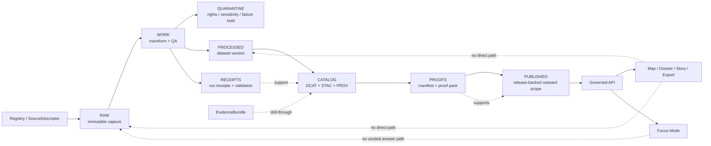

<!-- [KFM_META_BLOCK_V2]
doc_id: kfm://doc/<NEEDS_VERIFICATION_UUID>
title: data/
type: standard
version: v1
status: draft
owners: NEEDS VERIFICATION
created: NEEDS_VERIFICATION_YYYY-MM-DD
updated: 2026-04-14
policy_label: NEEDS VERIFICATION
related: [
  ../README.md,
  ./registry/README.md,
  ./catalog/README.md,
  ./catalog/stac/README.md,
  ./processed/README.md,
  ./receipts/README.md,
  ./proofs/README.md,
  ./published/README.md,
  ../contracts/README.md,
  ../policy/README.md,
  ../tests/README.md,
  ../tools/validators/README.md,
  ../tools/validators/connector_gate/README.md,
  ../tools/validators/promotion_gate/README.md
]
tags: [kfm, data, truth-path, catalog, provenance, promotion-contract, receipts, proofs, publication]
notes: [Revised upward from the supplied draft. Parent data-lane README now aligns more explicitly with receipt/proof/catalog/published boundaries and publication-as-state doctrine. Child-path and artifact-inventory claims still require live branch verification where not directly proven.]
[/KFM_META_BLOCK_V2] -->

<a id="top"></a>

# `data/`

Governed lifecycle surface for KFM evidence-bearing data, process memory, catalog closure, release evidence, and release-backed outward scope.

> [!IMPORTANT]
> **Status:** experimental  
> **Document status:** draft  
> **Owners:** NEEDS VERIFICATION  
> **Path:** `data/README.md`  
>       
> **Quick jumps:** [Scope](#scope) · [Repo fit](#repo-fit) · [Accepted inputs](#accepted-inputs) · [Exclusions](#exclusions) · [Directory tree](#directory-tree) · [Quickstart](#quickstart) · [Usage](#usage) · [Diagram](#diagram) · [Reference tables](#reference-tables) · [Task list](#task-list) · [FAQ](#faq) · [Appendix](#appendix)

> [!IMPORTANT]
> This README keeps five evidence layers separate on purpose:
>
> - **CONFIRMED doctrine** for KFM truth-path law, trust boundaries, catalog closure, promotion posture, and correction lineage
> - **CONFIRMED repo-root role** for `data/` as a documented repository surface for registry entries, example datasets, catalog artifacts, and lifecycle zones
> - **INFERRED subtree snapshot** for deeper `data/` child paths carried forward from the supplied draft and adjacent lane docs
> - **PROPOSED deeper pack shape** for exact version-pack conventions, proof-pack placement, and emitted filename patterns not directly proven here
> - **UNKNOWN / NEEDS VERIFICATION** for branch-only paths, local-only contents, owners, CI enforcement, emitted proof objects, and any artifact inventory not directly surfaced in this session

> [!TIP]
> Keep the KFM trust split visible across this parent lane:
>
> **receipt ≠ proof ≠ catalog ≠ publication**
>
> `data/receipts/` preserves process memory.  
> `data/proofs/` preserves release-significant evidence.  
> `data/catalog/` preserves outward discovery and lineage closure.  
> `data/published/` materializes already release-backed outward scope.

> [!CAUTION]
> No live repo checkout was mounted in this session. Treat child-path, artifact-placement, and emitted-proof claims below repo root as recheck items until a working branch or local checkout confirms them.

---

## Scope

`data/` is the repo-facing governed lifecycle surface for KFM evidence-bearing data.

In KFM doctrine, the shortest correct reading is:

`Source edge → RAW → WORK / QUARANTINE → PROCESSED → CATALOG → PUBLISHED`

That makes `data/` more than storage. It is the surface where intake memory, transformation evidence, catalog closure, release-adjacent proof, and correction lineage should remain inspectable enough to audit, review, replay, and repair.

### What this README is for

This file helps maintainers do four things quickly:

1. understand what belongs in `data/`
2. separate **CONFIRMED doctrine** from **CONFIRMED repo-root role**, **INFERRED subtree snapshot**, **PROPOSED deeper shape**, and **UNKNOWN / NEEDS VERIFICATION**
3. keep storage responsibilities separate from contracts, policy, validators, and governed APIs
4. extend the tree without quietly weakening KFM’s trust posture

### Evidence posture for this README

| Layer | Status | How to read it |
|---|---|---|
| Truth path, trust membrane, authoritative-versus-derived split, catalog triplet, promotion/correction posture | **CONFIRMED** | Safe to treat as current KFM doctrine |
| `data/` as a documented repo-root surface | **CONFIRMED** | Strong enough to describe `data/` as part of the repo’s intended architecture |
| Child `data/` directories and selected child README surfaces carried in the supplied draft | **INFERRED / NEEDS VERIFICATION** | Useful for drafting and review, but recheck in a live checkout before merge |
| Exact internal filenames, emitted proof packs, receipts, release examples, and validator wiring under those paths | **UNKNOWN / NEEDS VERIFICATION** | Path presence is not the same as emitted artifact proof |
| Separate repo-root `schemas/` path | **UNKNOWN / NEEDS VERIFICATION** | The supplied inventory strongly confirms `contracts/`; it does **not** directly prove a distinct repo-root `schemas/` directory |
| `data/specs/` | **OPEN TENSION / NEEDS VERIFICATION** | The broader conversation surfaced a tension around this lane; do not teach it as settled current-tree fact without checkout proof |

### Parent-lane rule

Use this parent README to define:

- lifecycle meaning
- boundary rules
- inter-zone responsibilities
- trust-visible separations

Do **not** use it to pretend every child lane already has proven emitted artifacts, live workflows, or settled schema homes.

[Back to top](#top)

---

## Repo fit

`data/` sits at the seam where governed source intake becomes durable project state.

The highest-confidence repo-root reading visible in this session is narrow but useful: `data/` is part of the documented KFM repository shape, and its role includes registry entries, example datasets, catalog artifacts, and lifecycle-zone manifests. The deeper zone layout below that role remains a carried-forward working draft until rechecked in a live checkout.

### Path and adjacent surfaces

| Relation | Surface | Posture | Why it matters |
|---|---|---|---|
| Upstream | [`../README.md`](../README.md) | **INFERRED / NEEDS VERIFICATION** | Almost certainly the repo-wide overview surface, but this session did not directly prove the file path |
| Upstream | [`../packages/`](../packages/) | **CONFIRMED path / INFERRED role** | Shared reusable law should stay in packages rather than leaking into ad hoc storage layouts |
| Upstream | [`../contracts/`](../contracts/) | **CONFIRMED path / INFERRED role** | Shared schemas, profiles, and controlled vocabularies should remain explicit rather than hiding inside data zones |
| Upstream | separate repo-level schema surface, if any | **UNKNOWN / NEEDS VERIFICATION** | The corpus expects machine-readable schema authority somewhere, but this session did not directly prove a distinct `../schemas/` root path |
| Upstream | [`../policy/`](../policy/) | **CONFIRMED path / INFERRED role** | Rights, sensitivity, deny-by-default rules, and review obligations belong in executable policy as well as prose |
| Upstream | [`../docs/`](../docs/) | **CONFIRMED path / INFERRED role** | Architecture docs, ADRs, templates, and runbooks should track behavior-significant changes to the data surface |
| Lateral | [`./registry/README.md`](./registry/README.md) | **INFERRED / NEEDS VERIFICATION** | Registration-facing documentation surface for source identity, cadence, rights, and downstream intent |
| Lateral | [`./catalog/README.md`](./catalog/README.md) | **INFERRED / NEEDS VERIFICATION** | Catalog closure lane for outward metadata and lineage |
| Lateral | [`./catalog/stac/README.md`](./catalog/stac/README.md) | **INFERRED / NEEDS VERIFICATION** | STAC-specific closure surface |
| Lateral | [`./processed/README.md`](./processed/README.md) | **INFERRED / NEEDS VERIFICATION** | Canonical processed-authority lane |
| Lateral | [`./receipts/README.md`](./receipts/README.md) | **INFERRED / NEEDS VERIFICATION** | Process-memory lane; distinct from proofs and publication |
| Lateral | [`./proofs/README.md`](./proofs/README.md) | **INFERRED / NEEDS VERIFICATION** | Release-evidence lane; distinct from receipts and published materialization |
| Lateral | [`./published/README.md`](./published/README.md) | **INFERRED / NEEDS VERIFICATION** | Optional materialized outward scope; publication is still state first |
| Lateral | `data/specs/` | **OPEN TENSION / NEEDS VERIFICATION** | Do not add or teach as settled current fact until the target branch proves it |
| Downstream | [`../apps/`](../apps/) | **CONFIRMED path / INFERRED role** | Public and role-limited surfaces should consume promoted scope through governed APIs, not direct storage reads |
| Downstream | [`../tools/`](../tools/) | **CONFIRMED path / INFERRED role** | Validators, link checks, catalog QA, and evidence linting should prove the data surface rather than merely describe it |
| Downstream | [`../tests/`](../tests/) | **CONFIRMED path / INFERRED role** | Schema, catalog, policy, freshness, correction, and replay tests should enforce this surface |
| Downstream | [`../infra/`](../infra/) | **CONFIRMED path / INFERRED role** | Deployment, backup, restore, correction, and reconciliation logic should preserve the trust membrane |

### Repo-fit summary

| Question | Answer |
|---|---|
| What is `data/` for? | Governed intake, lifecycle state, registry entries, example datasets, catalog artifacts, process memory, release evidence, and repo-facing data surfaces such as processed or publish-adjacent zones |
| What is `data/` **not**? | Not the trust membrane, not the public API surface, and not permission to expose RAW, WORK, QUARANTINE, or unpublished candidates directly |
| What stays adjacent instead of buried here? | Shared contracts, any repo-level schema authority, executable policy, validators, app routes, worker logic, and most implementation law |

[Back to top](#top)

---

## Accepted inputs

The following belong in or immediately around `data/` when KFM doctrine is being honored:

| Accepted input | Why it belongs here | Typical stage |
|---|---|---|
| Source registration artifacts | Source onboarding is a contract, not just a fetch | Registry / admission |
| Immutable raw captures and acquisition manifests | RAW must preserve source-native bytes and intake memory | RAW |
| Reproducible transforms, redactions, and QA outputs | WORK exists to normalize and validate without pretending to publish | WORK |
| Rights-unclear, sensitive, or failed-validation material | QUARANTINE is the regular hold state for unresolved material | QUARANTINE |
| Canonical processed dataset versions | PROCESSED is where publishable authority becomes stable and inspectable | PROCESSED |
| Run receipts, validation reports, and audit-ready process memory | Replay, rollback, and correction fail without durable process evidence | RECEIPTS |
| `DCAT + STAC + PROV` closure artifacts | Catalog closure is part of release truth, not decorative metadata | CATALOG |
| Release manifests, proof packs, and integrity objects | Promotion is a governed transition and should leave release-significant evidence | PROOFS / release boundary |
| Materialized outward scope that is already release-backed | Publication may need a stable outward surface after promotion | PUBLISHED |
| Example datasets and zone manifests | The supplied repo inventory explicitly associates these with `data/`’s repo-root role | Reference / exemplar |

### Artifact families at a glance

| Artifact family | What it does | Stage seam |
|---|---|---|
| `SourceDescriptor` | Declares source identity, access mode, rights posture, cadence, and publication intent | Admission |
| `IngestReceipt` | Proves what was fetched, when, and with what integrity result | RAW / receipts |
| `ValidationReport` | Records structural, spatial, temporal, unit, and domain QC outcomes | WORK / QUARANTINE / receipts |
| `DatasetVersion` | Carries immutable processed authority with stable identity and time semantics | PROCESSED |
| `CatalogClosure` | Links outward catalog metadata and lineage for releasable scope | CATALOG |
| `DecisionEnvelope` / `ReviewRecord` | Carries policy and review-bearing admissibility outcomes | Review / promotion |
| `ReleaseManifest` / `ReleaseProofPack` | Assembles a publishable trust unit | PROOFS / release |
| Materialized published bundle or scope | Carries outward-facing copies or packages already backed by release truth | PUBLISHED |
| `EvidenceBundle` | Resolves visible claims or surface state to inspectable support | Runtime / trust surfaces |
| `CorrectionNotice` | Preserves visible lineage for rollback, supersession, withdrawal, or narrowed republication | Post-release governance |

### Proof quartet

| Signal | Why it matters near `data/` |
|---|---|
| `spec_hash` | Anchors an input or build spec stably enough to diff, replay, and attest |
| `run_receipt` | Proves a concrete transformation or publish-bound step happened |
| `ai_receipt` | Keeps model mediation explicit where AI touches a governed build path |
| attestation refs | Make integrity and origin re-verifiable rather than merely stated |

> [!NOTE]
> The proof quartet is now a strong KFM design center, but this README does **not** claim the target branch already emits all four objects under `data/`. It treats them as doctrine-aligned expectations and verification targets.

### Dataset-version pack (`PROPOSED` starter shape)

| Part | Typical location | Why it exists |
|---|---|---|
| manifest + checksums | `data/processed/<theme>/<dataset>/<version>/manifest.json`, `SHA256SUMS.txt` | stable fingerprinting and replay |
| version README | `data/processed/<theme>/<dataset>/<version>/README.md` | human-readable method, CRS, units, caveats, license, and links |
| receipt / validation pack | `data/receipts/` or version-adjacent audited surface | run receipts, validation reports, policy decisions, and replay memory |
| STAC / DCAT / PROV | `data/catalog/stac/`, `data/catalog/dcat/`, `data/catalog/prov/` | discoverability, lineage, and policy-facing metadata closure |
| proof / attestation pack | `data/proofs/` or equivalent release bundle | promotion evidence, integrity, and rollback traceability |
| outward materialization | `data/published/` or governed delivery surface | optional materialized scope after release backing exists |

> [!TIP]
> `data/` may **consume** shared schemas from `../contracts/` or another repo-level schema authority, but that is different from treating `data/` as the canonical home for every shared schema, vocabulary, or standards profile.

[Back to top](#top)

---

## Exclusions

The following do **not** belong here as sovereign truth or as the normal public path:

| Exclusion | Put it under / behind | Why |
|---|---|---|
| Direct client reads from canonical stores or unpublished artifacts | governed APIs and trust-visible app surfaces | Storage is not the trust membrane |
| Secrets, credentials, tokens, or host-specific secret material | runtime secret management / deployment layer | `data/` is evidence-bearing, not secret-bearing |
| Shared schemas and standards profiles | `../contracts/` or the repo’s actual schema authority | Keeps machine-readable contract authority explicit and reviewable |
| Policy bundles, reason registries, and deny-by-default logic | `../policy/` | Policy should remain executable, testable, and independently reviewable |
| Unreviewed analyst scratch outputs presented as publishable truth | `work/` or `quarantine/` | Exploration is valid; silent publication is not |
| Derived layers treated as authority by convenience | rebuildable downstream layers | Search, graph, tile, vector, scene, cache, and summary layers remain downstream of stronger truth |
| Silent overwrite of raw capture, processed authority, released state, or published meaning | correction / rollback / supersession flow | KFM requires visible correction lineage |

> [!WARNING]
> `data/` is a governed evidence surface. It is **not** the public edge, **not** the trust boundary, and **not** permission to expose RAW, WORK, QUARANTINE, or unpublished candidates directly.

[Back to top](#top)

---

## Directory tree

### Carried-forward subtree snapshot (`INFERRED` from the supplied draft; recheck in live checkout before merge)

```text
data/
├── README.md
├── catalog/
│   ├── README.md
│   ├── dcat/
│   ├── prov/
│   └── stac/
│       └── README.md
├── processed/
│   └── README.md
├── proofs/
├── published/
├── quarantine/
├── raw/
├── receipts/
├── registry/
│   ├── README.md
│   └── schemas/
└── work/
```

### Doctrine-aligned deeper pack shape (`PROPOSED` below the carried-forward snapshot)

```text
data/
├── raw/<source>/<run>/                    # immutable source-native capture
├── work/<lane>/<run>/                     # transforms, QA, redaction, and intermediate work
├── quarantine/<reason>/<subject>/         # unresolved rights / sensitivity / validation holds
├── processed/<theme>/<dataset>/<version>/ # canonical dataset versions
├── catalog/
│   ├── dcat/
│   ├── stac/
│   └── prov/
├── receipts/<lane>/<run>/                 # process-memory artifacts
├── published/<release>/                   # optional materialized release scope
└── proofs/<release>/                      # manifests, proof packs, attestations, correction trace
```

### Path posture

| Path claim | Status | Reading rule |
|---|---|---|
| `data/` exists as a repo-root path | **CONFIRMED** | Treat as a current documented repo-root surface |
| `data/` is a repo-root role for registry entries, example datasets, catalog artifacts, and zone manifests | **CONFIRMED** | Safe to describe as the current high-level role of the path |
| `data/registry/README.md`, `data/catalog/README.md`, `data/catalog/stac/README.md`, `data/processed/README.md`, `data/receipts/README.md`, `data/proofs/README.md`, and `data/published/README.md` exist on the target branch exactly as linked | **INFERRED / NEEDS VERIFICATION** | Carried forward from the supplied draft and adjacent docs; recheck before merge |
| `data/raw/`, `data/work/`, `data/quarantine/`, `data/processed/`, `data/catalog/`, `data/receipts/`, `data/published/`, and `data/proofs/` exist as child directories exactly as shown | **INFERRED / NEEDS VERIFICATION** | Useful for drafting and review, but not a substitute for checkout proof |
| `data/catalog/dcat/` and `data/catalog/prov/` exist as catalog subdirectories exactly as shown | **INFERRED / NEEDS VERIFICATION** | Recheck in the target branch before teaching them as settled current fact |
| Exact artifact filenames, emitted release examples, proof packs, receipts, and validator wiring already exist inside those directories | **UNKNOWN / NEEDS VERIFICATION** | Inspect branch contents before documenting emitted objects as fact |
| Separate repo-root `schemas/` path is canonical | **UNKNOWN** | Do not teach this path until the target branch proves it |
| `data/specs/` is a current path | **OPEN TENSION / NEEDS VERIFICATION** | Keep the mismatch visible until the target branch proves or removes it |

### What this README intentionally does *not* assert

- that every carried-forward child directory already contains emitted production artifacts
- that the supplied subtree snapshot is sufficient proof of active CI enforcement
- that real proof packs, runtime response envelopes, or resolver traces have already been surfaced in-repo
- that a separate repo-root `schemas/` directory exists
- that `data/specs/` exists
- that carried-forward subtree shape alone proves end-to-end operational maturity

[Back to top](#top)

---

## Quickstart

Start by separating **doctrine**, **path recheck**, and **artifact proof**.

```bash
# Inspect the current local checkout of the data surface
find data -maxdepth 3 -print 2>/dev/null | sort

# Read adjacent README surfaces if present
for f in \
  data/README.md \
  data/registry/README.md \
  data/catalog/README.md \
  data/catalog/stac/README.md \
  data/processed/README.md \
  data/receipts/README.md \
  data/proofs/README.md \
  data/published/README.md
do
  test -f "$f" && { echo "===== $f"; sed -n '1,220p' "$f"; }
done

# Confirm lifecycle and release-adjacent child directories in the checkout
for p in \
  data/raw \
  data/work \
  data/quarantine \
  data/processed \
  data/catalog \
  data/receipts \
  data/published \
  data/proofs \
  data/registry
do
  test -e "$p" && echo "FOUND $p" || echo "MISSING $p"
done

# Treat branch-only or historical paths as unverified until shown by the checkout
test -d data/specs && echo "FOUND data/specs" || echo "data/specs not present in checked-out branch"
```

### Inspect deeper artifact evidence

```bash
# Look for manifest / receipt / proof / catalog-shaped files
find data -maxdepth 6 -type f \
  \( -iname '*manifest*' -o -iname '*receipt*' -o -iname '*proof*' -o -iname '*catalog*' -o -iname '*.json' -o -iname '*.jsonld' -o -iname '*.prov' -o -iname '*.yaml' -o -iname '*.yml' \) \
  2>/dev/null | sort | sed -n '1,240p'

# If a processed zone exists, inspect whether version-like packs are materialized
find data/processed -maxdepth 5 -print 2>/dev/null | sort | sed -n '1,240p'

# If receipts/proofs/published exist as directories, check whether they already contain emitted artifacts
find data/receipts data/proofs data/published -maxdepth 5 -print 2>/dev/null | sort | sed -n '1,240p'
```

> [!TIP]
> Path confirmation is helpful, but KFM doctrine still requires **artifact-level proof** before claims like “release-ready,” “policy-enforced,” or “resolver-backed” become fair.

[Back to top](#top)

---

## Usage

### 1. Register before you fetch

In KFM, source intake is a contract, not a download. A source that cannot be named, replayed, rights-reviewed, and quality-checked is not ready for governed movement into `data/`.

### 2. Keep RAW immutable

`RAW` should preserve source-native bytes, request context, rights/terms snapshots, and checksums. Cleanup, normalization, OCR, reprojection, redaction, and summarization belong later.

### 3. Transform in `WORK`, hold ambiguity in `QUARANTINE`

`WORK` is where normalization, parsing, joins, QA, redaction, and repair happen. Rights ambiguity, failed validation, unresolved sensitivity, or low-confidence extraction belong in `QUARANTINE`, not in `PROCESSED`.

### 4. Treat `PROCESSED` as governed authority candidates

`PROCESSED` is where stable dataset versions emerge. They should already point back to receipts, validation outputs, source context, and reproducible transform memory strongly enough to survive audit and replay.

### 5. Keep receipts and reports queryable

Run receipts, validation reports, and audit references are part of KFM’s operational memory. Whether they live under `data/receipts/` or an equivalent audited surface, they should remain easy to resolve during replay, correction, and release review.

### 6. Close the catalog triplet before promotion

A version is not outward-ready until `DCAT + STAC + PROV` can cross-link identifiers, assets, lineage, and evidence references without guesswork.

### 7. Publish by governed transition

`PUBLISHED` is first a release state, not merely a directory name. A repo may materialize supporting release artifacts under `data/published/`, but promotion still binds dataset version, catalog closure, policy state, review state, and proof objects into one inspectable decision.

### 8. Keep proofs attached to the exact release they justify

Checksums, manifests, proof packs, attestations, and correction evidence should remain linked to the exact dataset version or release scope they support. Detached proof objects are much less useful during rollback, audit, or dispute.

### 9. Read tree shape and operational maturity separately

A visible directory is useful evidence. It is **not** the same thing as proving that the zone already contains complete receipts, manifests, closures, proof objects, and correction drills.

### Illustrative artifact chain

The exact live filenames are **NEEDS VERIFICATION**, but the intended sequence is stable:

```text
registry/      source descriptor / source admission context
raw/           ingest receipt + immutable capture
work/          validation report + transform evidence
quarantine/    rights / sensitivity / validation hold
processed/     dataset version + manifest + checksums
receipts/      run receipts / validation outputs / audit-ready process memory
catalog/       catalog closure (DCAT + STAC + PROV)
proofs/        release proof pack / attestation / correction trace
published/     optional materialized release scope
```

[Back to top](#top)

---

## Diagram


```mermaid
flowchart LR
    REG[Registry / SourceDescriptor] --> RAW[RAW<br/>immutable capture]
    RAW --> WORK[WORK<br/>transform + QA]
    WORK --> QUAR[QUARANTINE<br/>rights / sensitivity / failure hold]
    WORK --> PROC[PROCESSED<br/>dataset version]
    WORK --> REC[RECEIPTS<br/>run receipts + validation]
    PROC --> CAT[CATALOG<br/>DCAT + STAC + PROV]
    CAT --> PROOF[PROOFS<br/>manifest + proof pack]
    PROOF --> PUB[PUBLISHED<br/>release-backed outward scope]

    PUB --> API[Governed API]
    API --> UI[Map / Dossier / Story / Export]
    API --> FOCUS[Focus Mode]

    REC -. support .-> CAT
    PROOF -. supports .-> PUB
    EVD[EvidenceBundle] -. drill-through .-> CAT

    UI -. no direct path .-> RAW
    UI -. no direct path .-> PROC
    FOCUS -. no uncited answer path .-> RAW
```

[Back to top](#top)

---

## Reference tables

### Truth-path zone matrix

| Zone / state | Core question | What belongs here | Block if |
|---|---|---|---|
| `RAW` | What exactly arrived? | Source-native payloads, request details, checksums, rights snapshots, unmodified source bytes | raw bytes are mutated in place or exposed directly |
| `WORK` | What deterministic transform is happening? | Repair, normalization, OCR, reprojection, QA, joins, redaction transforms | transform logic is irreproducible or undocumented |
| `QUARANTINE` | What is unresolved or unsafe? | Rights ambiguity, sensitivity ambiguity, failed validation, low-confidence extraction | ambiguous material is treated as “almost publishable” |
| `PROCESSED` | What is now canonical and publishable? | Immutable processed artifacts, dataset versions, final QA outputs, stable manifests | the artifact cannot support valid catalog closure |
| `CATALOG` | Can the release be discovered and explained? | Cross-linked `DCAT + STAC + PROV`, outward identifiers, evidence pointers | triplet members are missing, broken, or unresolved |
| `PUBLISHED` | May this scope be exposed? | Governed release state through API and trust-visible surfaces, optionally materialized under `data/published/` | publication is treated as a folder copy instead of a gated transition |

### Boundary matrix

| Surface | Primary job | Must not be confused with |
|---|---|---|
| `data/receipts/` | queryable process memory | release proof, catalog closure, or outward publication |
| `data/proofs/` | release-significant evidence | run-memory receipts or materialized outward copies |
| `data/catalog/` | outward metadata and lineage closure | process memory, release proof, or storage materialization |
| `data/published/` | optional release-backed outward scope | the act that created trust or the proof that justified it |

### Repo-root role versus deeper lane shape

| Level | Status | What you can safely say |
|---|---|---|
| Repo root `data/` role | **CONFIRMED** | Registry entries, example datasets, catalog artifacts, and zone manifests belong in the repo-facing role of `data/` |
| Lifecycle zones below repo root | **INFERRED / NEEDS VERIFICATION** | `raw/`, `work/`, `quarantine/`, `processed/`, `catalog/`, `receipts/`, `published/`, and `proofs/` are a strong carried-forward subtree hypothesis, not current checkout proof |
| Emitted proof objects inside those zones | **UNKNOWN / NEEDS VERIFICATION** | Actual manifests, receipts, proof packs, closures, and resolver traces still need branch inspection |

### Promotion gate shorthand

| Gate | What must exist before outward trust widens | Fail-closed outcome |
|---|---|---|
| A — identity & versioning | `dataset_id`, `dataset_version_id`, deterministic `spec_hash`, content digests | block canonical write or promotion |
| B — licensing & rights metadata | license/rights fields and a snapshot of upstream terms | hold, quarantine, or deny |
| C — sensitivity classification & redaction plan | `policy_label` plus any required obligations such as geometry generalization or field removal | deny until obligations are satisfied |
| D — catalog triplet validation | `DCAT + STAC + PROV` all validate, cross-link, and resolve without guesswork | block release |
| E — QA & thresholds | dataset-specific quality checks exist and pass | quarantine or block promotion |
| F — run receipt & audit record | receipt captures inputs, tooling, hashes, and policy decisions | block promotion |
| G — release manifest / proof pack | promotion is recorded as release-linked evidence referencing artifacts and digests | prevent governed publication |

### Path-certainty matrix

| Claim | Status | Safer wording |
|---|---|---|
| `data/` exists as a repo-root path | **CONFIRMED** | “current documented repo-root path” |
| `data/` is governed by the canonical truth path | **CONFIRMED** | “load-bearing KFM doctrine” |
| `data/` is a repo-root role for registry entries, example datasets, catalog artifacts, and zone manifests | **CONFIRMED** | “documented high-level repo role” |
| child README surfaces exist exactly as linked | **INFERRED / NEEDS VERIFICATION** | “carried forward from the supplied draft and adjacent child-doc work; recheck in checkout” |
| lifecycle child directories are already live exactly as shown | **INFERRED / NEEDS VERIFICATION** | “baseline-draft subtree snapshot; inspect checkout before stronger claims” |
| specific release manifests, proof packs, receipts, or resolver traces already exist under those zones | **UNKNOWN / NEEDS VERIFICATION** | “inspect branch contents before documenting emitted objects” |
| separate repo-root `schemas/` path is canonical | **UNKNOWN** | “do not teach this path until the target branch proves it” |
| `data/specs/` is canonical | **OPEN TENSION / NEEDS VERIFICATION** | “keep the mismatch visible until the target branch proves or removes it” |

[Back to top](#top)

---

## Task list

### Definition of done for this README

- [ ] the file clearly separates **CONFIRMED doctrine** from **CONFIRMED repo-root role**, **INFERRED subtree snapshot**, **PROPOSED deeper shape**, and **UNKNOWN / NEEDS VERIFICATION**
- [ ] `data/` is described as a governed truth-path surface, not a generic storage bucket
- [ ] accepted inputs and exclusions are explicit
- [ ] the tree distinguishes carried-forward subtree evidence from deeper target-state pack shapes
- [ ] the README makes clear that storage is not the trust membrane
- [ ] at least one Mermaid diagram explains real KFM structure
- [ ] verification steps tell a maintainer how to confirm or downgrade artifact-level claims in a working checkout
- [ ] receipt, proof, catalog, and published boundaries remain explicit and cross-linked

### Review checks before merge

- [ ] replace placeholder `doc_id`, owners, created date, and policy label with repo-backed values
- [ ] recheck child `data/` paths in the live target branch before merging
- [ ] verify whether a separate repo-level `schemas/` path exists before naming it as a canonical surface
- [ ] verify whether `data/specs/` exists before adding any direct link or schema-home claim
- [ ] inspect deeper contents of `raw/`, `work/`, `quarantine/`, `receipts/`, `published/`, and `proofs/` before documenting emitted artifacts
- [ ] add one real emitted artifact path once a live release lane is visible
- [ ] keep terminology aligned with KFM doctrine: truth path, trust membrane, authoritative vs derived, catalog closure, EvidenceBundle, promotion, correction
- [ ] do not let carried-forward subtree shape be misread as proof of full operational maturity

[Back to top](#top)

---

## FAQ

### Is `published` a directory?

Possibly, but this revision treats the child-path claim as carried forward from the supplied draft and adjacent child-doc work and therefore still recheck-worthy. By doctrine, **published** is first a governed release state. If `data/published/` exists, it can materialize release scope, but publication is still not reducible to “copy files somewhere.”

### Are `data/registry/README.md`, `data/catalog/README.md`, and `data/catalog/stac/README.md` already real?

The supplied draft says yes. This revision keeps those as carried-forward path claims that should be rechecked in the live checkout before merge.

### Is a separate repo-root `schemas/` directory real?

Unknown in this session. The supplied inventory clearly confirms `contracts/`, but it does not directly prove a separate `schemas/` root path. Treat that as **UNKNOWN** until the target branch proves it.

### Is `data/specs/` real?

Unresolved in this session. Keep it as an open tension until the target branch or local checkout proves it or removes the mismatch.

### Does visible tree shape mean the lane is operational?

No. It proves, at most, path shape. It does not prove emitted receipts, release manifests, correction drills, policy bundles, or runtime proof objects.

### Are receipts different from proofs?

Yes. **Receipts** are process-memory artifacts such as ingest receipts, validation reports, and run records. **Proofs** are release-significant objects such as manifests, attestations, and correction trace. The exact emitted contents of either still need inspection.

### Is `data/published/` the same as publication?

No. Publication is a governed state. `data/published/` is an optional materialized surface for scope that has already crossed into that state.

[Back to top](#top)

---

## Appendix

<details>
<summary><strong>Glossary</strong></summary>

| Term | Meaning in this README |
|---|---|
| Truth path | The governed movement from source edge through RAW, WORK / QUARANTINE, PROCESSED, CATALOG, and into PUBLISHED state |
| Trust membrane | The rule that clients do not bypass governed APIs, policy mediation, and evidence resolution to reach storage directly |
| Catalog triplet | The linked metadata boundary formed by `DCAT + STAC + PROV` |
| SourceDescriptor | Intake contract describing access mode, cadence, rights posture, normalization plan, and publication intent |
| IngestReceipt | Evidence-bearing record of what was fetched, when, and with what integrity result |
| DatasetVersion | Immutable governed version of a processed subject set |
| DecisionEnvelope | Policy-significant admissibility record tying candidate publication to review and policy state |
| ReleaseManifest | Release-time object that binds published scope to artifacts, identifiers, and digests |
| ReleaseProofPack | Release-significant evidence bundle justifying promotion and later inspection |
| EvidenceBundle | Governed support object that resolves a visible claim or answer into inspectable evidence |
| Derived layer | Search, graph, vector, tile, scene, summary, or export surface built downstream of stronger truth |
| CorrectionNotice | Evidence-bearing supersession, withdrawal, rollback, or narrowed republication object |

</details>

<details>
<summary><strong>Verification backlog carried by this file</strong></summary>

| Item | Why it matters |
|---|---|
| live target-branch `data/` subtree snapshot | prevents a carried-forward draft snapshot from being misread as fresh checkout proof |
| owners / dates / policy label / doc UUID | lets the meta block stop carrying placeholders |
| deeper contents of `raw/`, `work/`, `quarantine/`, `receipts/`, `published/`, and `proofs/` | converts path shape into inspectable artifact fact |
| whether a separate repo-root `schemas/` path exists | prevents broken links and schema-surface drift |
| whether `data/specs/` exists on the working branch | prevents broken links and stale doctrine claims |
| one emitted dataset pack with manifest + triplet + receipts/proof objects | grounds examples in real artifacts rather than doctrine alone |
| one runtime resolver trace and one negative-path sample | proves EvidenceBundle and runtime negative-path behavior rather than leaving them conceptual |

</details>

<details>
<summary><strong>Related entrypoints</strong></summary>

- [`../README.md`](../README.md)
- [`./registry/README.md`](./registry/README.md)
- [`./catalog/README.md`](./catalog/README.md)
- [`./catalog/stac/README.md`](./catalog/stac/README.md)
- [`./processed/README.md`](./processed/README.md)
- [`./receipts/README.md`](./receipts/README.md)
- [`./proofs/README.md`](./proofs/README.md)
- [`./published/README.md`](./published/README.md)
- [`../contracts/`](../contracts/)
- [`../policy/`](../policy/)
- [`../tools/`](../tools/)
- [`../tests/`](../tests/)
- [`../apps/`](../apps/)
- [`../infra/`](../infra/)

</details>

[Back to top](#top)
